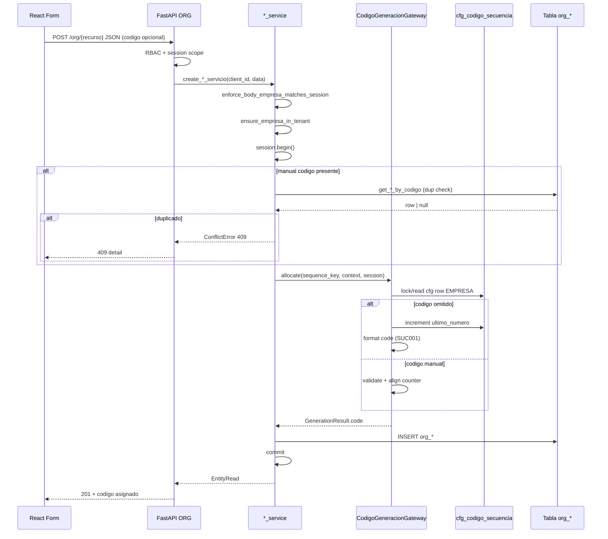
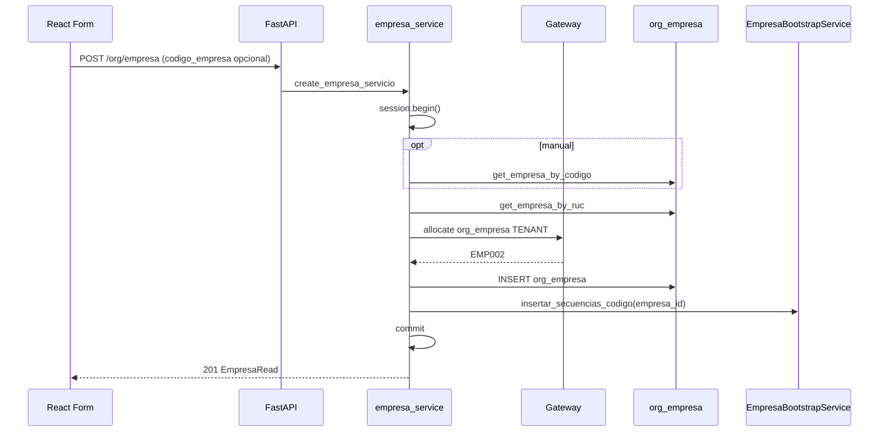

# Errores HTTP y flujo runtime

**Audiencia:** Frontend + QA  
**Alcance:** CREATE con motor de códigos — 5 entidades ORG Ola 1

---

## 1. Catálogo de errores HTTP

### 1.1 Éxito

| Status | Cuándo | Body |
|--------|--------|------|
| **201 Created** | Alta exitosa | `{Entity}Read` con código asignado |

### 1.2 Errores cliente / negocio

| Status | Excepción | Cuándo | Acción Frontend |
|--------|-----------|--------|-----------------|
| **400** | `ValidationError` / motor | Código manual formato inválido | Mostrar `detail` en campo código |
| **403** | `AuthorizationError` | Sin permiso RBAC | Mensaje permiso |
| **403** | `AuthorizationError` (`EMPRESA_MISMATCH`) | `empresa_id` body ≠ sesión | Refrescar contexto empresa / corregir payload |
| **404** | `NotFoundError` | cfg secuencia ausente (`CFG_SEQUENCE_NOT_FOUND`) | Error técnico — contactar soporte |
| **409** | `ConflictError` | Código duplicado en scope | Mostrar mensaje unicidad en campo código |
| **409** | `ConflictError` | RUC duplicado (solo empresa) | Mostrar en campo RUC |
| **422** | `RequestValidationError` (FastAPI) | Schema Pydantic (campos required) | Errores por campo estándar |

### 1.3 Formato error API

```json
{
  "detail": "Ya existe un cargo con el código 'CAR001' en esta empresa."
}
```

Errores Pydantic 422:

```json
{
  "detail": [
    { "loc": ["body", "nombre"], "msg": "Field required", "type": "missing" }
  ]
}
```

### 1.4 Mapeo ConflictError por entidad

| Entidad | Mensaje 409 código |
|---------|-------------------|
| Empresa | `Ya existe una empresa con el código '{codigo}' en este tenant.` |
| Sucursal | `Ya existe una sucursal con el código '{codigo}' en esta empresa.` |
| Departamento | `Ya existe un departamento con el código '{codigo}' en esta empresa.` |
| Centro costo | `Ya existe un centro de costo con el código '{codigo}' en esta empresa.` |
| Cargo | `Ya existe un cargo con el código '{codigo}' en esta empresa.` |

---

## 2. Flujo completo Frontend → Backend → Motor → BD → Response

### 2.1 Diagrama general (company-scoped)



### 2.2 Flujo org_empresa (tenant-scoped)



### 2.3 Puntos clave para Frontend

| Punto | Implicación |
|-------|-------------|
| Código se conoce **después** del 201 | No pre-calcular en FE salvo preview futuro |
| Transacción atómica | Si 409/404, **no** se creó registro |
| Normalización UPPER en Backend | FE puede enviar minúsculas |
| `""` ≡ omitido | Limpiar input vacío antes de enviar (opcional) |

---

## 3. Sesión ERP requerida

| Entidad | Gate router | Requisito sesión |
|---------|-------------|------------------|
| Empresa | `require_org_tenant_erp_session` | JWT tenant; lista todas empresas |
| Sucursal, Depto, CC, Cargo | `require_org_company_erp_session` | JWT con `empresa_id` operativa |

**Frontend:** formularios company-scoped deben ejecutarse con empresa activa seleccionada en sesión; `empresa_id` del body = empresa activa.

---

## 4. UPDATE — fuera del motor en Ola 1

| Operación | Motor interviene |
|-----------|------------------|
| CREATE | ✅ Sí |
| UPDATE código | ❌ No — servicio ORG directo + dup check |
| DELETE (soft) | ❌ No |

Frontend: edición de código en PUT sigue comportamiento legacy (unicidad 409).

---

## 5. Casos transversales QA

| ID | Escenario | Entidades | Esperado |
|----|-----------|-----------|----------|
| X-01 | CREATE sin código | Todas | 201 + auto |
| X-02 | CREATE manual único | Todas | 201 + manual |
| X-03 | CREATE manual dup | Todas | 409 antes motor |
| X-04 | Dos CREATE auto seguidos | Todas | Códigos correlativos distintos |
| X-05 | Cambio empresa sesión | Company-scoped | Contador independiente por empresa |
| X-06 | Impersonación tenant | Todas | client_id operativo JWT, no platform |

---

*Estrategia migración FE: [`04_FRONTEND_MIGRATION_STRATEGY.md`](04_FRONTEND_MIGRATION_STRATEGY.md)*
