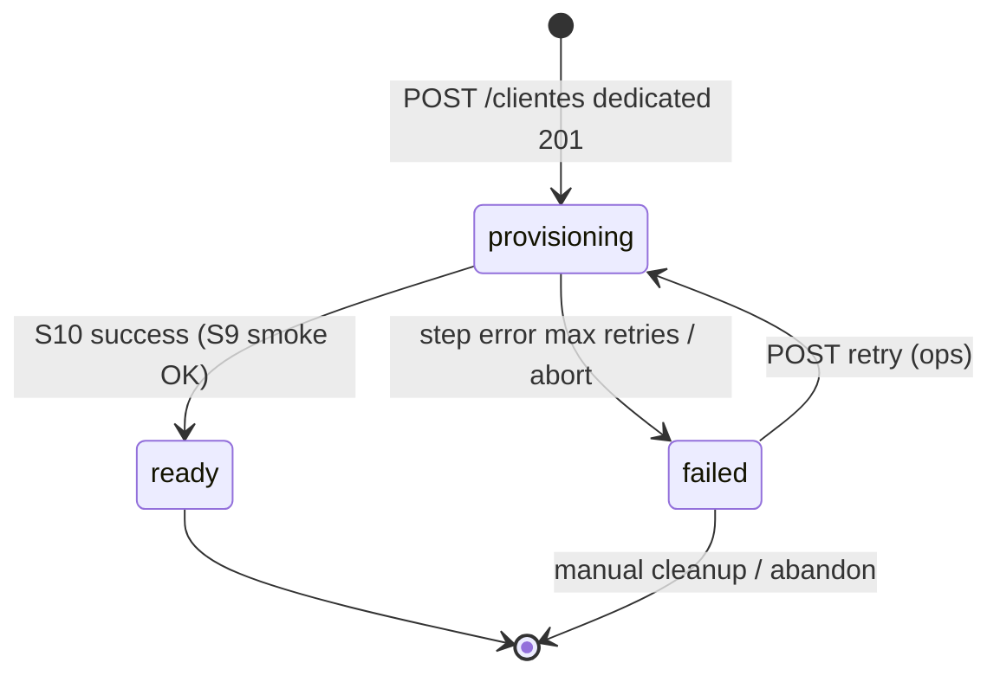

# DEDICATED PROVISIONING API CONTRACT

## 1. Objetivo del contrato

Definir el **contrato público v1** que el Frontend Platform Admin y consumidores autorizados deben usar para **provisionar un tenant Dedicated** en la plataforma Hybrid, desde el alta del cliente hasta el estado operativo **Ready**.

Este documento establece el comportamiento **target F4** aprobado (Decisión AR-F01, BL-F4-1.0, IP-2.0.1). Sustituye al flujo FE legacy «crear cliente → crear conexión manual» como **happy path** para Dedicated nuevo.

**Relación con otros contratos:**

| Contrato | Rol post-F4 |
|----------|-------------|
| **Este documento** | Happy path Dedicated: provisioning automático |
| `CONNECTION_CREATION_API_CONTRACT.md` | Manual / repair / legacy / Shared opcional — **no** happy path Dedicated |

---

## 2. Alcance

### In scope

| Operación | Descripción |
|-----------|-------------|
| Inicio de provisioning | `POST /api/v1/clientes/` con `tipo_instalacion=dedicated` |
| Consulta de estado | `GET /api/v1/clientes/{cliente_id}/provisioning-status/` |
| Reintento ops | `POST /api/v1/clientes/{cliente_id}/provisioning/retry` |
| Abort ops | `POST /api/v1/clientes/{cliente_id}/provisioning/abort` |
| Estados, errores, idempotencia, auditoría | Normativa FE/BE |

### Out of scope

| Tema | Documento / fase |
|------|------------------|
| Creación manual de `cliente_conexion` (happy path) | `CONNECTION_CREATION_API_CONTRACT.md` |
| Runtime ERP, login tenant, JWT post-Ready | Contratos auth existentes |
| Migración Shared→Dedicated | F7 |
| On-premise sin executor automático | Extensión futura ADR-007-D |
| Detalle interno saga S1–S10 (DDL, scripts) | BL-F4-1.0 — no expuesto en API |

---

## 3. Flujo oficial del producto

```
Platform Admin (Super Admin)
    │
    ▼
POST /api/v1/clientes/          tipo_instalacion = "dedicated"
    │  HTTP 201 inmediato
    │  provisioning_state = "provisioning"
    │
    ▼ (asíncrono — saga S1…S10)
    │
    ├─ S1  Registry tenant (Control Plane)
    ├─ S2  Allocate storage identity
    ├─ S3  Create physical database
    ├─ S4  Apply ERP schema (bootstrap)
    ├─ S5  Apply dedicated RBAC schema
    ├─ S6  Apply catalog seeds (plan tenant)
    ├─ S7  Seed tenant data (Data Plane)
    ├─ S8  Register cliente_conexion (Control Plane) — AUTOMÁTICO
    ├─ S9  Invalidate cache + routing smoke
    └─ S10 Mark tenant Ready
    │
    ▼
GET /provisioning-status/  →  provisioning_state = "ready"
    │
    ▼
Tenant Dedicated operativo (login admin, ERP vía Hybrid Gateway)
```

**Prohibición de producto (AR-F01):** el Frontend **no debe** invocar `POST /conexiones/` tras crear un cliente Dedicated nuevo en el flujo estándar F4.

---

## 4. Endpoint de inicio del Provisioning

| Atributo | Valor |
|----------|-------|
| **Método HTTP** | `POST` |
| **URL** | `/api/v1/clientes/` |
| **URL completa (ejemplo)** | `https://{api-host}/api/v1/clientes/` |
| **Content-Type** | `application/json` |
| **Status éxito** | `201 Created` |
| **Disparo provisioning** | Automático cuando `tipo_instalacion = "dedicated"` y provisioning v2 habilitado en plataforma |

### Autenticación requerida

| Requisito | Detalle |
|-----------|---------|
| **Esquema** | Bearer JWT (`Authorization: Bearer <access_token>`) |
| **Usuario** | Autenticado y activo |

### Permisos requeridos

| Capa | Requisito |
|------|-----------|
| **RBAC** | Permiso `tenant.cliente.crear` |
| **LBAC** | Super Administrador (nivel ≥ 5, rol `SuperAdministrador` y/o `is_super_admin=true`) |

### Headers opcionales

| Header | Descripción |
|--------|-------------|
| `Idempotency-Key` | UUID v4 opcional. Reintento seguro de `POST /clientes/` ante timeout de red. Misma clave + mismo body → misma respuesta 201 sin segundo tenant. |

---

## 5. Request

Cuerpo JSON conforme al schema **`ClienteCreate`** existente. **No se introducen campos obligatorios nuevos** en v1.

### Campos relevantes para Dedicated

| nombre | tipo | obligatorio | descripción | impacto provisioning |
|--------|------|-------------|-------------|----------------------|
| `tipo_instalacion` | `string` | No (default `"shared"`) | Debe ser **`"dedicated"`** para activar saga | **Disparador** |
| `subdominio` | `string` | **Sí** | Subdominio único tenant | S1 registry |
| `codigo_cliente` | `string` | **Sí** | Código único tenant | S1 registry |
| `razon_social` | `string` | **Sí** | Razón social | S1 registry |
| `plan_suscripcion` | `string` | No (default `"trial"`) | `trial`, `basico`, `profesional`, `enterprise` | Perfil catálogos S6 |
| `contacto_email` | `string` | **Sí** | Email contacto admin | Metadata tenant |
| `estado_suscripcion` | `string` | No | Estado comercial | Independiente de `provisioning_state` |
| `metadata_json` | `string` | No | JSON extensible | Reservado; no sustituye plan |

### Campos que el Frontend NO envía para provisioning

| Campo | Motivo |
|-------|--------|
| `servidor`, `nombre_bd`, credenciales BD | Asignados en S2/S3/S8 por plataforma |
| `provisioning_state` | Solo lectura — backend |
| Datos de conexión | S8 automático |

### Validaciones existentes (sin cambio v1)

- `tipo_instalacion` ∈ `shared`, `dedicated`, `onpremise`, `hybrid`
- Subdominio único, formato DNS-safe
- `codigo_cliente` único

---

## 6. Response HTTP 201

**HTTP 201** — Body: objeto **`ClienteCreateResponse`** extendido con campos de provisioning **aditivos**.

### Estructura envelope (invariante ADR-F4-03)

```json
{
  "success": true,
  "message": "Cliente creado exitosamente. Guarde las credenciales, no se volverán a mostrar.",
  "data": { },
  "credenciales_iniciales": { },
  "provisioning": { }
}
```

### Objeto `data` — `ClienteRead` (+ campos aditivos)

Todos los campos actuales de `ClienteRead` se preservan. Campos **aditivos** cuando `tipo_instalacion=dedicated`:

| Campo | Tipo | Presente cuando | Descripción |
|-------|------|---------------|-------------|
| `provisioning_state` | `string` | `tipo_instalacion=dedicated` | `"provisioning"` en 201 |
| `provisioning_run_id` | `UUID` | `tipo_instalacion=dedicated` | Identificador de la ejecución saga |

### Objeto `credenciales_iniciales`

| Campo | Tipo | Descripción |
|-------|------|-------------|
| `nombre_usuario` | `string` | Usuario admin inicial (default `"admin"`) |
| `contrasena` | `string` | Contraseña en texto plano — **solo en esta respuesta** |
| `requiere_cambio` | `boolean` | Cambio obligatorio primer acceso |

**Regla de negocio v1:** las credenciales se **entregan en 201** (invariante histórico). El **login tenant ERP/admin solo está permitido** cuando `provisioning_state = "ready"`. El Frontend debe bloquear acceso hasta Ready.

### Objeto `provisioning` (aditivo)

| Campo | Tipo | Descripción |
|-------|------|-------------|
| `status_url` | `string` (URI) | URL relativa o absoluta para polling: `/api/v1/clientes/{cliente_id}/provisioning-status/` |
| `estimated_duration_seconds` | `integer` | Orientativo (ej. 300–1800); no SLA contractual v1 |

### Ejemplo JSON — Dedicated recién creado

```json
{
  "success": true,
  "message": "Cliente creado exitosamente. Guarde las credenciales, no se volverán a mostrar.",
  "data": {
    "cliente_id": "a1b2c3d4-e5f6-7890-abcd-ef1234567890",
    "razon_social": "ACME Corp S.A.C.",
    "subdominio": "acme",
    "codigo_cliente": "ACME001",
    "tipo_instalacion": "dedicated",
    "plan_suscripcion": "profesional",
    "estado_suscripcion": "activo",
    "es_activo": true,
    "provisioning_state": "provisioning",
    "provisioning_run_id": "f47ac10b-58cc-4372-a567-0e02b2c3d479"
  },
  "credenciales_iniciales": {
    "nombre_usuario": "admin",
    "contrasena": "xK9#mP2$vL7nQ4",
    "requiere_cambio": true
  },
  "provisioning": {
    "status_url": "/api/v1/clientes/a1b2c3d4-e5f6-7890-abcd-ef1234567890/provisioning-status/",
    "estimated_duration_seconds": 900
  }
}
```

### Comportamiento temporal

| Aspecto | Contrato |
|---------|----------|
| Bloqueo HTTP | **Prohibido** — 201 retorna en < 500 ms (p95) |
| Progreso saga | Consultar vía `provisioning-status` |
| Shared (`tipo_instalacion=shared`) | Sin objeto `provisioning`; sin `provisioning_state` en v1 shared path |

---

## 7. Estados del Provisioning

| Estado | Código | Descripción |
|--------|--------|-------------|
| **Provisioning** | `provisioning` | Saga en curso |
| **Ready** | `ready` | Tenant operativo; routing habilitado |
| **Failed** | `failed` | Error irrecuperable o abort; requiere retry/ops |

**Estados comerciales** (`estado_suscripcion`, `es_activo`) son **ortogonales** — un tenant puede ser `ready` técnicamente y `suspendido` comercialmente.

---

## 8. Máquina de estados



| Transición | Disparador | Condición |
|------------|------------|-----------|
| → `provisioning` | `POST /clientes/` dedicated | Registry OK; saga encolada |
| `provisioning` → `ready` | Saga S10 | S9 smoke OK; guard único |
| `provisioning` → `failed` | Saga error / `POST abort` | Step fallido o cancelación ops |
| `failed` → `provisioning` | `POST retry` | Superadmin; desde último step incompleto |

**Estados no terminales:** solo `provisioning`.

---

## 9. Endpoint provisioning-status

| Atributo | Valor |
|----------|-------|
| **Método HTTP** | `GET` |
| **URL** | `/api/v1/clientes/{cliente_id}/provisioning-status/` |
| **Status éxito** | `200 OK` |

### Autenticación y permisos

| Capa | Requisito |
|------|-----------|
| **RBAC** | `tenant.cliente.leer` o `tenant.cliente.crear` |
| **LBAC** | Super Administrador |

### Response 200 — `DedicatedProvisioningStatusRead`

| Campo | Tipo | Descripción |
|-------|------|-------------|
| `cliente_id` | `UUID` | Tenant |
| `provisioning_state` | `string` | `provisioning` \| `ready` \| `failed` |
| `provisioning_run_id` | `UUID` | Run activo o último |
| `current_step` | `string` \| null | Código step en curso (ver tabla §9.1) |
| `steps` | `array` | Lista de steps con estado |
| `started_at` | `datetime` | Inicio saga |
| `updated_at` | `datetime` | Última actualización |
| `ready_at` | `datetime` \| null | Timestamp Ready |
| `failed_at` | `datetime` \| null | Timestamp Failed |
| `last_error_code` | `string` \| null | Código error sanitizado |
| `last_error_message` | `string` \| null | Mensaje ops-safe (sin SQL/secrets) |
| `retry_allowed` | `boolean` | `true` si `failed` y retry disponible |
| `abort_allowed` | `boolean` | `true` si `provisioning` |

#### 9.1 Códigos de step expuestos (sanitizados)

| Código API | Paso saga | Descripción FE |
|------------|-----------|----------------|
| `registry` | S1 | Registro tenant |
| `storage_allocation` | S2 | Asignación almacén |
| `create_database` | S3 | Creación BD física |
| `apply_schema_erp` | S4 | Esquema ERP |
| `apply_schema_rbac` | S5 | Esquema RBAC dedicated |
| `apply_catalogs` | S6 | Catálogos |
| `seed_tenant` | S7 | Datos iniciales tenant |
| `register_metadata` | S8 | Registro conexión |
| `activate_routing` | S9 | Activación routing |
| `mark_ready` | S10 | Tenant Ready |

#### Objeto step

| Campo | Tipo | Valores |
|-------|------|---------|
| `code` | `string` | Códigos §9.1 |
| `status` | `string` | `pending` \| `running` \| `completed` \| `failed` \| `skipped` |
| `started_at` | `datetime` \| null | — |
| `completed_at` | `datetime` \| null | — |

### Response 404

Tenant no encontrado o cross-scope.

---

## 10. Endpoint retry

| Atributo | Valor |
|----------|-------|
| **Método HTTP** | `POST` |
| **URL** | `/api/v1/clientes/{cliente_id}/provisioning/retry` |
| **Body** | vacío o `{}` |
| **Status éxito** | `202 Accepted` |

### Permisos

| Capa | Requisito |
|------|-----------|
| **RBAC** | `tenant.cliente.actualizar` (o permiso ops dedicado futuro) |
| **LBAC** | Super Administrador |

### Precondiciones

| Condición | Requerido |
|-----------|-----------|
| `provisioning_state` | `failed` |
| Sin otra saga activa para mismo `cliente_id` | Sí |

### Response 202

```json
{
  "success": true,
  "message": "Reintento de provisioning iniciado.",
  "provisioning_run_id": "uuid-nuevo-o-mismo",
  "provisioning_state": "provisioning"
}
```

### Efecto

Relanza saga desde **último step incompleto** de forma idempotente. No duplica tenant registry ni BD si markers indican step completado.

---

## 11. Endpoint abort

| Atributo | Valor |
|----------|-------|
| **Método HTTP** | `POST` |
| **URL** | `/api/v1/clientes/{cliente_id}/provisioning/abort` |
| **Body** | opcional `{ "reason": "string" }` |
| **Status éxito** | `200 OK` |

### Permisos

Igual que retry (Super Admin).

### Precondiciones

| Condición | Requerido |
|-----------|-----------|
| `provisioning_state` | `provisioning` |

### Response 200

```json
{
  "success": true,
  "message": "Provisioning abortado.",
  "provisioning_state": "failed",
  "cleanup_checklist_url": null
}
```

### Efecto

Transición a `failed`. Compensación semi-automática según step alcanzado (ver §15). No elimina fila `cliente` automáticamente en v1.

---

## 12. Estados terminales

| Estado | Terminal | Tráfico ERP tenant | Acciones FE |
|--------|----------|-------------------|-------------|
| **`ready`** | Sí — éxito | **Permitido** | Habilitar acceso; mostrar tenant operativo |
| **`failed`** | Sí — error | **Bloqueado** | Mostrar error; ofrecer retry (ops) o contacto soporte |

**`provisioning` no es terminal.** Polling recomendado cada 5–15 s con backoff hasta `ready` o `failed`, timeout UI sugerido 30 min.

---

## 13. Códigos de error

### Formato de error (heredado plataforma)

**Formato A — `CustomException`:**

```json
{
  "detail": "<mensaje legible>",
  "error_code": "<CODIGO>"
}
```

**Formato B — `HTTPException` (auth):**

```json
{
  "detail": "<mensaje legible>"
}
```

### POST /clientes/ — Dedicated

| HTTP | error_code | Causa |
|------|------------|-------|
| **401** | — | Token inválido |
| **403** | — | Sin Super Admin / sin permiso |
| **409** | `SUBDOMAIN_CONFLICT` | Subdominio duplicado |
| **409** | `CLIENT_CODE_CONFLICT` | Código cliente duplicado |
| **409** | `IDEMPOTENCY_CONFLICT` | Misma `Idempotency-Key` con body distinto |
| **422** | `VALIDATION_ERROR` | Schema inválido |
| **503** | `PROVISIONING_DISABLED` | Dedicated provisioning v2 deshabilitado en plataforma |
| **500** | `INTERNAL_SERVICE_ERROR` | Error inesperado pre-saga |

> El **201 no se revierte** si la saga falla posteriormente. Estado vía `provisioning-status`.

### GET provisioning-status

| HTTP | error_code | Causa |
|------|------------|-------|
| **404** | `CLIENT_NOT_FOUND` | `cliente_id` inexistente |
| **400** | `NOT_DEDICATED_TENANT` | Cliente no es `tipo_instalacion=dedicated` |
| **400** | `LEGACY_TENANT_NO_PROVISIONING` | Legacy sin estado provisioning (ver §18) |

### POST retry / abort

| HTTP | error_code | Causa |
|------|------------|-------|
| **409** | `INVALID_PROVISIONING_STATE` | Estado no permite operación |
| **409** | `PROVISIONING_ALREADY_RUNNING` | Saga activa |
| **404** | `CLIENT_NOT_FOUND` | — |

### Errores de saga (expuestos en status, no en 201)

| error_code | Step típico | FE |
|------------|-------------|-----|
| `PROVISIONING_CREATE_DATABASE_FAILED` | S3 | Error infra BD |
| `PROVISIONING_SCHEMA_FAILED` | S4, S5 | Error DDL |
| `PROVISIONING_CATALOG_FAILED` | S6 | Error catálogos |
| `PROVISIONING_SEED_FAILED` | S7 | Error seed |
| `PROVISIONING_METADATA_FAILED` | S8 | Error metadata |
| `PROVISIONING_ACTIVATION_FAILED` | S9, S10 | Error routing/smoke |
| `PROVISIONING_ABORTED` | — | Abort manual |

---

## 14. Reglas de negocio

| # | Regla |
|---|-------|
| RN-01 | **Un solo happy path Dedicated:** `POST /clientes/` → saga → Ready. Sin `POST /conexiones/` en flujo estándar. |
| RN-02 | **`cliente_conexion` principal** creada automáticamente en S8 con `es_conexion_principal=true`. |
| RN-03 | Metadata (S8) **solo después** de seed (S7) y DDL (S3–S6). |
| RN-04 | Tenant Dedicated en `provisioning` o `failed`: **tráfico ERP bloqueado** (fail-closed routing). |
| RN-05 | Login admin entregado en 201; **uso operativo solo en `ready`**. |
| RN-06 | Máximo **una** conexión principal activa por tenant (hereda regla conexiones). |
| RN-07 | `plan_suscripcion` determina subset catálogos S6. |
| RN-08 | Una saga activa por `cliente_id` (mutex). |
| RN-09 | Shared: **no** ejecuta steps S3–S6 dedicated; comportamiento onboarding actual preservado. |
| RN-10 | Reintento no crea segundo tenant ni segunda BD si markers completos. |
| RN-11 | Abort no borra tenant; marca `failed` + checklist ops. |
| RN-12 | `estado_suscripcion=suspendido` bloquea acceso comercial independientemente de `ready`. |

---

## 15. Idempotencia

| Operación | Clave | Comportamiento |
|-----------|-------|----------------|
| `POST /clientes/` | `Idempotency-Key` header (opcional) | Misma key + body → misma respuesta 201 |
| Saga steps | Markers internos por `(run_id, step)` | Re-run step skip si `completed` |
| S3 CREATE DATABASE | `nombre_bd` | Script idempotente |
| S4–S6 bootstrap | `bootstrap_applied` markers | Re-run safe |
| S8 metadata | `(cliente_id, es_conexion_principal)` | UNIQUE → no duplicar |
| S10 activate | Guard `provisioning→ready` | Una sola transición |
| `POST retry` | Nuevo intento explícito | Continúa desde último incomplete |
| `GET status` | — | Read-only idempotente |

---

## 16. Eventos de auditoría

Eventos platform audit (referencia; payload sin secrets):

| Evento | Cuándo | Datos mínimos |
|--------|--------|---------------|
| `dedicated.provisioning.started` | POST /clientes/ dedicated 201 | `cliente_id`, `run_id`, `actor_user_id` |
| `dedicated.provisioning.step.completed` | Cada step OK | `cliente_id`, `run_id`, `step_code` |
| `dedicated.provisioning.step.failed` | Step fail | `cliente_id`, `run_id`, `step_code`, `error_code` |
| `dedicated.provisioning.ready` | S10 | `cliente_id`, `run_id`, `duration_seconds` |
| `dedicated.provisioning.failed` | Estado failed | `cliente_id`, `run_id`, `error_code` |
| `dedicated.provisioning.retry` | POST retry | `cliente_id`, `actor_user_id` |
| `dedicated.provisioning.abort` | POST abort | `cliente_id`, `actor_user_id`, `reason` |
| `dedicated.provisioning.metadata_registered` | S8 | `cliente_id`, `conexion_id` (sin credenciales) |

---

## 17. Compatibilidad con Shared

| Aspecto | Comportamiento |
|---------|----------------|
| `POST /clientes/` shared | Sin cambios v1; sin objeto `provisioning` |
| Onboarding shared | Síncrono en BD central — sin saga S3–S6 |
| `POST /conexiones/` | Opcional shared; sin cambio contrato |
| Regresión | Gate `shared-regression` obligatorio F4 |

---

## 18. Compatibilidad con clientes Dedicated legacy

**Definición legacy:** tenant `tipo_instalacion=dedicated` creado **antes del cutover F4** con `cliente_conexion` registrada manualmente y **sin** `provisioning_state`.

| Caso | Comportamiento API |
|------|-------------------|
| Legacy con conexión válida | Tratado como **`ready` implícito** en routing; `GET provisioning-status` → `400 LEGACY_TENANT_NO_PROVISIONING` o respuesta sintética `ready` (decisión implementación — **preferido:** `ready` sintético para FE uniforme) |
| Legacy sin conexión | Ops deben usar `POST /conexiones/` manual o migración puntual |
| Coexistencia | Prohibido aplicar saga automática + manual conexión mismo tenant |
| Datos existentes | **Sin reprovisioning** obligatorio |

---

## 19. Compatibilidad con OpenAPI

| Regla | v1 F4 |
|-------|-------|
| Breaking changes en `POST /clientes/` | **Prohibidos** — campos aditivos únicamente |
| Nuevos endpoints | Aditivos — documentar en OpenAPI |
| `ClienteCreate` required fields | Sin cambio |
| Response 201 schema | Extensión aditiva `provisioning`, campos en `data` |
| Deprecación | `POST /conexiones/` para Dedicated estándar — nota descriptiva OpenAPI (no `deprecated=true` obligatorio MVP) |
| Security schemes | Sin cambio — Bearer JWT |

### Endpoints OpenAPI v1 F4

| Método | Path | operationId sugerido |
|--------|------|----------------------|
| POST | `/api/v1/clientes/` | existente — extend response |
| GET | `/api/v1/clientes/{cliente_id}/provisioning-status/` | `get_provisioning_status_...` |
| POST | `/api/v1/clientes/{cliente_id}/provisioning/retry` | `retry_provisioning_...` |
| POST | `/api/v1/clientes/{cliente_id}/provisioning/abort` | `abort_provisioning_...` |

---

## 20. Impacto sobre Frontend Platform Admin

| Área | Cambio requerido |
|------|------------------|
| Wizard alta Dedicated | **Un paso:** crear cliente. Eliminar paso conexión del happy path. |
| Post-201 | Polling `provisioning-status`; progress UI por steps §9.1 |
| Credenciales | Mostrar en 201; **deshabilitar login** hasta `ready` |
| Errores | Pantalla failed + botón retry (ops) |
| Shared | Sin cambio |
| Legacy repair | Pantalla avanzada ops mantiene `POST /conexiones/` |
| Feature flag FE | Alinear con `DEDICATED_PROVISIONING_V2` / cutover staging |

---

## 21. Impacto sobre Backend

| Área | Contrato |
|------|----------|
| `POST /clientes/` | Encola saga si dedicated + v2 enabled; 201 inmediato |
| Nuevos endpoints | status, retry, abort |
| `POST /conexiones/` | Sin auto-invoke desde saga happy path |
| Routing | Sin cambio firmas F0–F3; S9 invalida cache |
| ERP modules | Zero diff |
| Feature flag | `DEDICATED_ENABLED` — default false prod pre-cutover |

---

## 22. Consideraciones de seguridad

| Tema | Requisito |
|------|-----------|
| Autorización | Super Admin en inicio; status readable superadmin |
| Credenciales 201 | HTTPS obligatorio; no loguear `contrasena` |
| Status/retry/abort | Sin exponer connection strings, passwords SQL, stack traces |
| DDL credentials | Nunca en API responses |
| Idempotency-Key | Almacenar hash body; TTL 24h |
| Rate limit | Retry/abort max N por tenant por hora (ops) |
| Audit | Toda mutación provisioning auditada |
| Tenant isolation | Status/retry/abort scoped a `cliente_id` válido |

---

## 23. Trazabilidad con BL-F4 e IP-2.0.1

| Referencia | Mapeo contrato |
|------------|----------------|
| **BL-F4-1.0 §4** Estados | §7, §8 |
| **BL-F4-1.0 §5** Saga S1–S10 | §3, §9.1 |
| **BL-F4-1.0 §9** Rollback | §11, §13 errores saga |
| **BL-F4-1.0 §10** Cache | S9 — RN-04 |
| **BL-F4-1.0 §13** Activación Ready | §12 — S10 |
| **BL-F4-1.0 §15** Idempotencia | §15 |
| **ADR-F4-03** POST /clientes/ invariant | §6 |
| **ADR-F4-04** Compensación semi-auto | §11 abort |
| **AR-F01** Flujo canónico | §3, RN-01 |
| **IP-2.0.1 §3.1** Ready vs saga | §8, §12 |
| **IP-2.0.1 PR-F4-11** | §9–11 endpoints |
| **IP-2.0.1 §10.1** Shared onboarding check | §17 |
| **Q-031** Metadata post seed | RN-03 |
| **Q-030** Saga spec | Este documento cierra spec pública |
| **G-07** OpenAPI | §19 |
| **G-03** FE transparency runtime | §20 — orquestación infra en BE |

---

## Versionado

| Campo | Valor |
|-------|-------|
| **Version** | v1 |
| **Fecha** | 2026-06-25 |
| **Estado** | **APPROVED** |
| **Decisión AR-F01** | Cerrada — incorporada |
| **Supersede (happy path)** | Sección Dedicated de flujo manual en `CONNECTION_CREATION_API_CONTRACT.md` |
| **Implementación** | F4 conforme IP-2.0.1 |

---

*Contrato funcional definitivo — base para implementación F4. Sin detalle de implementación interna.*
