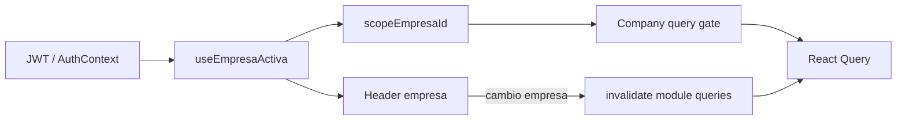

# Estándares frontend ERP — v1.0

**Sistema:** CAXIS ERP (SaaS multi-tenant)  
**Stack:** React · TypeScript · Vite · Tailwind · React Query · Axios · Zustand  
**Versión:** 1.0  
**Fecha:** 31 mayo 2026  
**Estado:** Documento normativo de referencia — **sin implementación asociada**  
**Fuentes consolidadas:** IAM (admin), ORG (cerrado funcionalmente), INV (patrón transaccional de referencia)  
**Auditorías base:** `ORG_CLOSE_AUDIT.md`, `INVENTORY_MULTIEMPRESA_AUDIT.md`, `ERP_MODULE_PATTERN_AUDIT.md`, `RULES_EVOLUTION_AUDIT.md`

---

## 1. Propósito y alcance

### 1.1 Para qué sirve este documento

- Ser la **única fuente de verdad** de estándares UX/técnicos del frontend ERP hasta la siguiente versión mayor.
- Servir como **checklist obligatorio** al crear o refactorizar módulos (`ORG`, `INV`, `SLS`, `PUR`, `FIN`, etc.).
- Base para actualizar posteriormente `.cursorrules` y `docs/prompts/PROMPT_FRONTEND_MAESTRO.md` **sin sustituirlos aún**.

### 1.2 Qué no cubre

- Contratos API por módulo (OpenAPI / `*_API.json`).
- Reglas de negocio backend.
- Implementación de código en este entregable.
- Debounce de búsqueda (recomendado IAM; **pendiente** adopción global en ORG).

### 1.3 Decisiones de steering aceptadas

| # | Decisión |
|---|----------|
| 1 | **ORG cerrado funcionalmente** como módulo de negocio. |
| 2 | **ORG = patrón de plataforma** (multiempresa, listados, modales seguros, UX tabla). |
| 3 | **INV = patrón funcional transaccional** (cabecera+detalle, formularios complejos, movimientos, inventario físico). |
| 4 | Ningún módulo nuevo debe reintroducir selectores locales de empresa en toolbars company-scoped. |

---

## 2. Glosario

| Término | Definición |
|---------|------------|
| **JWT / sesión** | Token de acceso; empresa activa y tenant derivados de `AuthContext` + `useEmpresaActiva`. |
| **Company-scoped** | Datos y operaciones de **una empresa activa** (sucursales, productos, movimientos, etc.). |
| **Tenant-scoped** | Datos del **tenant** sin ámbito empresa obligatorio en sesión (ej. administración de empresas del tenant). |
| **Hybrid-scoped** | Recursos con alcance GLOBAL u OVERRIDE por empresa (ej. parámetros ORG). |
| **scopeEmpresaId** | ID de empresa activa de sesión; única fuente operativa para queries/mutaciones company-scoped. |
| **B.1.1** | Patrón de cierre de modal con formulario dirty: confirmación antes de descartar; bloqueo ESC/click fuera. |
| **E-ME4** | Regla: no exponer UUID de empresa (ni otros IDs) en UI visible, tooltips o `title`. |
| **Baja lógica** | Desactivar / reactivar — nunca “eliminar” físico en vocabulario UI. |

---

## 3. Patrón multiempresa JWT

### 3.1 Principio

La **empresa operativa** la define la **sesión** (JWT + `AuthContext`), reflejada en el **header** (`EmpresaSelector` / contexto visible). Las páginas **no** duplican esa decisión con un selector local.

### 3.2 Fuentes de verdad (código de referencia)

| Responsabilidad | Referencia actual |
|-----------------|-------------------|
| Sesión y flags | `src/shared/context/AuthContext.tsx` |
| Empresa activa, elegibles, cambio | `src/features/auth/hooks/useEmpresaActiva.ts` |
| Scope ORG (modelo a generalizar) | `src/features/org/hooks/useOrgSessionScope.ts` |
| Gate de queries company | `src/features/org/hooks/org-company-query-gate.ts` |
| Acceso operativo company (P0) | `src/features/org/utils/org-company-scope-access.ts` |
| Invalidación al cambiar empresa | `src/features/org/utils/invalidate-org-queries.ts` |
| Header visible (evitar banner duplicado) | `src/shared/hooks/useHeaderEmpresaContextVisible.ts` |
| Reglas acceso ERP | `src/core/auth/utils/empresa-access.ts` |

### 3.3 Reglas MUST

| ID | Regla |
|----|--------|
| ME-01 | En pantallas **company-scoped**, `empresa_id` de listados y mutaciones = `scopeEmpresaId` de sesión, no estado local arbitrario. |
| ME-02 | **Prohibido** `<select>` en toolbar con opciones “Todas las empresas” o selector de empresa para filtrar listados operativos. |
| ME-03 | Al cambiar empresa en el header, **invalidar** todas las queries del módulo afectado (patrón `invalidateOrgQueries`). |
| ME-04 | Si `empresaSelectionPending` o sin empresa activa, **no** ejecutar queries company-scoped; mostrar guard o redirect (patrón `OrgCompanyRouteGuard`). |
| ME-05 | Payload create/update: `empresa_id` debe coincidir con sesión (`assertBodyEmpresaMatchesSession` o equivalente). |
| ME-06 | **Prohibido** `title`, `aria-label` o texto visible con UUID de empresa (E-ME4). |

### 3.4 Reglas SHOULD

| ID | Regla |
|----|--------|
| ME-07 | Extraer `useErpCompanyScope` compartido desde `useOrgSessionScope` antes de escalar a INV/SLS (nombre ilustrativo). |
| ME-08 | Sincronizar condición de header con `useHeaderEmpresaContextVisible` antes de mostrar banner fallback de empresa. |
| ME-09 | Resetear filtros locales de página (`buscar`, tabs) al cambiar `scopeEmpresaId` (`useOrgScopeEmpresaReset`). |

### 3.5 Flujo resumido



---

## 4. Company-scoped vs tenant-scoped vs hybrid

### 4.1 Matriz de clasificación

| Tipo | ¿Requiere empresa en sesión? | Selector empresa en página | Ejemplo |
|------|------------------------------|----------------------------|---------|
| **Tenant-scoped** | No (admin tenant) | No | ORG `EmpresaPage` (listado empresas del tenant) |
| **Company-scoped** | Sí | No — solo header | ORG sucursales, departamentos, cargos, centros de costo |
| **Hybrid-scoped** | Sí para tab OVERRIDE | No — tabs GLOBAL/OVERRIDE | ORG `ParametrosPage` |
| **Transaccional company** | Sí | No — campo readonly en form | INV movimientos, inventario físico (objetivo post INV-M0) |

### 4.2 Guards de ruta

| Tipo | Patrón |
|------|--------|
| Company / hybrid | `OrgCompanyRouteGuard` (o equivalente `ErpCompanyRouteGuard`) |
| Tenant | `OrgTenantRouteGuard` cuando aplique restricción tenant-admin |

### 4.3 Campo empresa en formularios

| Contexto | Patrón |
|----------|--------|
| Create company-scoped | `OrgSessionEmpresaField` — readonly, label de sesión, hidden `empresa_id` si necesario |
| Create tenant-scoped | Selector o flujo propio del dominio (ej. crear empresa) |
| Transaccional INV (objetivo) | Misma regla que ORG: **no** `<select>` editable de empresa en cabecera salvo excepción documentada |

---

## 5. Toolbar estándar

### 5.1 Layout obligatorio (listados)

Una **sola fila compacta** (con `flex-wrap` en viewport estrecho):

```
[ Filtros opcionales ] [ Búsqueda ] [ Ver inactivos ]     ———     [ CTA principal ]
        └────────────── grupo izquierdo ──────────────┘              └─ derecha ─┘
```

### 5.2 Clases y estructura

```tsx
// Contenedor (company-scoped: OrgCompanyToolbar)
<div className="mb-4 flex flex-wrap items-center justify-between gap-3">
  <div className="flex flex-wrap items-center gap-3 min-w-0">
    {/* banner empresa solo si header NO visible */}
    {/* filtros específicos (ej. módulo en Parámetros) */}
    {/* OrgToolbarSearch */}
    {/* checkbox Ver inactivos — shrink-0 */}
  </div>
  <div className="flex shrink-0 items-center gap-2">
    {/* CTA Crear — bg-brand-primary */}
  </div>
</div>
```

### 5.3 Referencias

| Componente | Ruta |
|------------|------|
| Toolbar company | `src/features/org/components/OrgCompanyToolbar.tsx` |
| Toolbar tenant (sin banner) | `EmpresaPage` — misma estructura `justify-between` |
| INV referencia visual previa | `ProductosPage` toolbar **sin** select empresa (post INV-M0) |

### 5.4 Reglas MUST

| ID | Regla |
|----|--------|
| TB-01 | Sin H1 ni subtítulo en body; el breadcrumb del layout identifica la página. |
| TB-02 | CTA principal alineado a la **derecha** (`justify-between` + `shrink-0`). |
| TB-03 | No reintroducir selector de empresa en toolbar company-scoped. |
| TB-04 | `gap-3` coherente; controles secundarios con `shrink-0` donde aplique. |

---

## 6. Búsqueda estándar

### 6.1 Componente

| Elemento | Estándar |
|----------|----------|
| Input | `IamSearchInput` (`@/features/admin/components/iam`) |
| Wrapper ancho | `OrgToolbarSearch` — evita `w-full` que rompe el flex |

```tsx
<OrgToolbarSearch
  value={buscar}
  onChange={setBuscar}
  placeholder="…"
  aria-label="Buscar …"
  disabled={discardPending !== null}
/>
```

**Ruta wrapper:** `src/features/org/components/OrgToolbarSearch.tsx`  
**Contenedor:** `w-52 min-w-[12rem] max-w-md shrink-0` + `IamSearchInput className="w-full"` interno.

### 6.2 Integración con datos

| Aspecto | Estándar actual ORG |
|---------|---------------------|
| Estado | `useState('')` → `buscar` en hook React Query |
| Query key | Incluir `buscar.trim()` en la key |
| Debounce | **SHOULD** 500ms (`useDebounce` — patrón `UserManagementPage`); ORG aún sin debounce |
| Deshabilitado | `disabled={discardPending !== null}` en modales con B.1.1 |

### 6.3 Variante búsqueda vacía

```ts
const hasSearch = buscar.trim().length > 0;
```

Usar en `IamTableEmptyState` (título y CTA — ver §7).

---

## 7. Empty state estándar

### 7.1 Componente

**`IamTableEmptyState`** dentro del `<tbody>` de la tabla.

| Prop | Uso |
|------|-----|
| `colSpan` | Igual al número de columnas del `<thead>` |
| `icon` | Lucide, coherente con la entidad |
| `title` | Mensaje principal |
| `description` | Secundario; **obligatorio** si `hasSearch` |
| `actionLabel` / `onAction` | CTA crear solo si aplica |
| `actionDisabled` | `discardPending !== null` cuando hay B.1.1 |

### 7.2 Matriz de mensajes

| Condición | Título | Description | CTA crear |
|-----------|--------|-------------|-----------|
| Lista vacía, activos | “No hay … activos.” | — | Sí, si permiso + scope |
| Lista vacía, con inactivos | “No hay … registrados.” | — | Según reglas de tab |
| `hasSearch` | “No se encontraron … que coincidan con la búsqueda.” | “Pruebe con otro término o limpie el filtro…” | **No** |
| Sin `scopeEmpresaId` (company) | Mensaje de guard, no empty de tabla | — | No |

### 7.3 Reglas MUST

| ID | Regla |
|----|--------|
| ES-01 | No implementar empty inline duplicado (icono + `<p>` + botón manual) en listados nuevos. |
| ES-02 | `colSpan` debe coincidir con skeleton y thead. |

---

## 8. Skeleton estándar

### 8.1 Componente

**`InvTableSkeleton`** — origen INV; ORG reexporta como `OrgTableSkeleton`.

| Prop | Regla |
|------|--------|
| `columns` | **Debe** igualar columnas del `<thead>` |
| `rows` | Default 8; ajustar solo si tabla muy baja |

```tsx
{loading && <InvTableSkeleton columns={TABLE_COLSPAN} />}
{error && !loading && ( /* banner error */ )}
{!loading && !error && ( /* tabla */ )}
```

**Ruta:** `src/features/inv/components/InvTableSkeleton.tsx`

### 8.2 Reglas MUST

| ID | Regla |
|----|--------|
| SK-01 | En listados, **no** usar solo `Loader` centrado que oculta toda la tabla. |
| SK-02 | Mantener chrome de tabla (`overflow-x-auto rounded-lg border … shadow`) del skeleton. |
| SK-03 | Mismo `TABLE_COLSPAN` constante para skeleton, empty y thead. |

### 8.3 Excepciones

| Vista | Carga |
|-------|--------|
| Formulario transaccional página completa | `Loader` aceptable en carga inicial de documento |
| Panel detalle secundario en lista | Spinner local aceptable; preferir skeleton si hay tabla |

---

## 9. Patrón B.1.1 (modales con formulario dirty)

### 9.1 Origen

- **IAM:** `UserManagementPage` + `scheduleModalStackValidation`
- **ORG:** `org-discard-handlers.ts`, `OrgDiscardConfirmDialog`, `form-dirty/*`

### 9.2 Comportamiento obligatorio

1. Usuario cierra modal (X, ESC, click fuera) con formulario **dirty** → cerrar Radix primero → abrir `ConfirmDialog`.
2. Textos: **“Seguir editando”** (cancel) / **“Sí, descartar”** (confirm).
3. Mientras dirty y pendiente de confirm: `onInteractOutside` y `onEscapeKeyDown` → `preventDefault`.
4. Tras confirmar descarte: limpiar estado y `scheduleModalStackValidation(contextPrefix)`.
5. Submit en curso: bloquear cierre.

### 9.3 Piezas tipo

| Pieza | Referencia |
|-------|------------|
| Estado | `discardPending: null \| 'create' \| 'edit'` |
| Handlers factory | `createOrgDiscardHandlers({ ... })` |
| Dialog | `OrgDiscardConfirmDialog` |
| Dirty por entidad | `src/features/org/utils/form-dirty/*.ts` |
| Modal stack | `src/features/admin/utils/iam-modal-stack-validation.ts` |

### 9.4 Reglas MUST

| ID | Regla |
|----|--------|
| B11-01 | Todo **CRUD modal** con formulario multi-campo en módulos nuevos **debe** implementar B.1.1. |
| B11-02 | `ConfirmDialog` de baja/reactivar es **independiente** del discard dirty (no mezclar estados). |
| B11-03 | Desactivar acciones de fila y CTA toolbar cuando `discardPending !== null`. |

---

## 10. Patrón CRUD modal (maestros)

### 10.1 Cuándo aplica

Entidades **maestras simples**: categorías, unidades, departamentos, cargos, etc.  
**Modal** si el formulario cabe en diálogo; página completa solo si complejidad extrema (excepción documentada).

### 10.2 Stack técnico

| Capa | Estándar |
|------|----------|
| Types | `Create` / `Update` / `Read` en `types/[modulo].types.ts` |
| Service | Métodos por entidad; sin endpoints deprecated |
| Hooks | `useQuery` list/detail + `useMutation`; toast **solo** en `onError` del hook |
| RBAC | `usePermissions` → `can('modulo', 'crear' \| 'editar' \| 'eliminar')` — no renderizar botón |
| Layout página | `OrgPageLayout` / `InvPageLayout` — sin título duplicado |
| Tabla | Tokens Capa 1; acciones icono editar / desactivar / reactivar |
| Baja | `ConfirmDialog` — vocabulario **Desactivar** / **Reactivar** |
| Formulario | `FormSection`; grid 2 cols campos cortos; validación API vía `getValidationErrors` |

### 10.3 Secuencia de render listado

```
Toolbar → Skeleton (loading) → Error banner → Tabla (filas | IamTableEmptyState)
Modales: Create / Edit con B.1.1
ConfirmDialog: delete/reactivar
OrgDiscardConfirmDialog: dirty
```

### 10.4 Referencia canónica ORG

`CentrosCostoPage`, `DepartamentosPage` — menor superficie; replicar estructura antes que `EmpresaPage`.

---

## 11. Patrón cabecera + detalle (transaccional)

### 11.1 Cuándo aplica

Documentos con líneas: **movimientos**, **inventario físico**, y análogos en otros módulos.

### 11.2 Reglas de API (MUST)

| ID | Regla |
|----|--------|
| CD-01 | **Un solo** POST/PUT con detalle embebido (`.../con-detalle`). |
| CD-02 | **Prohibido** POST/PUT independiente sobre tablas detalle si el contrato marca deprecated. |
| CD-03 | GET de detalle para **lectura** sí permitido. |

### 11.3 Reglas de UI (MUST)

| ID | Regla |
|----|--------|
| CD-04 | Formulario en **página completa** (no modal) si hay muchas líneas. |
| CD-05 | Sección cabecera + sección líneas con tabla editable **antes** del submit. |
| CD-06 | Botón “Agregar línea”; eliminar línea solo en cliente antes de enviar. |
| CD-07 | `empresa_id` en cabecera = sesión (post INV-M0); alineado a ME-05. |

### 11.4 Referencia canónica INV

| Vista | Ruta |
|-------|------|
| Movimiento | `src/features/inv/pages/MovimientoFormPage.tsx` |
| Inventario físico | `src/features/inv/pages/InventarioFisicoFormPage.tsx` |
| Hooks | `useCreateMovimientoConDetalle`, `useUpdateMovimientoConDetalle`, etc. |
| Service | `src/features/inv/services/inv.service.ts` (comentarios deprecated) |

### 11.5 Layout transaccional

- Secciones en `bg-surface border border-border-base rounded-lg shadow-sm`.
- Cabecera: `p-6 mb-6`.
- Detalle: header interno `px-4 py-3 border-b border-border-base`.

---

## 12. Reglas de UUID e identificadores

### 12.1 MUST — Nunca en UI

| Prohibido | Permitido |
|-----------|-----------|
| Columna `empresa_id`, `producto_id`, etc. | `codigo`, `nombre`, `razon_social` |
| Tooltip `title={uuid}` | `title` con texto descriptivo o omitir |
| Placeholder con UUID | Labels de negocio |
| Mensajes “ID: abc-123…” | “—” si FK no resuelta |

### 12.2 Permitido en DOM (no visible)

- `value` de `<option>` en selects de FK.
- `<input type="hidden">` para submit (`empresa_id_session`).
- Query keys y variables internas TypeScript.

### 12.3 Enriquecimiento FK

Si el listado solo trae ID: ajustar query, join en API, o lookup en mapa local — **nunca** mostrar el ID como fallback (usar **"—"**).

---

## 13. Reglas de empresa activa

### 13.1 Resumen

| Regla | Descripción |
|-------|-------------|
| EA-01 | Una empresa operativa por sesión para usuarios multiempresa (salvo flujos tenant-admin documentados). |
| EA-02 | Cambio de empresa **solo** en header (o flujo `SeleccionarEmpresa`), no en cada página. |
| EA-03 | `activeEmpresaLabel` para UI; **nunca** el UUID como etiqueta principal. |
| EA-04 | `tenant_admin` en rutas company: usar `canOperateOrgCompanyScope` (no confundir con `canAccessErp` solo). |
| EA-05 | `empresaService.list` en páginas operativas: **solo** si el dominio es tenant-wide; no para poblar filtros INV/ORG company. |

### 13.2 Estados de sesión

| Estado | Comportamiento UI |
|--------|-------------------|
| `requiereSeleccionEmpresa` | Redirect a selección; guards bloquean company-scoped |
| Sin `scopeEmpresaId` | Guard “Empresa activa requerida” |
| Impersonación | Respetar flags de `AuthContext`; no bypass de guards |

---

## 14. Cuándo usar patrón ORG vs INV

### 14.1 Tabla de decisión

| Necesidad | Patrón | Módulo referencia |
|-----------|--------|-------------------|
| Listado maestro + modales | **ORG** | `DepartamentosPage`, `CentrosCostoPage` |
| Multiempresa JWT + guards | **ORG** | `useOrgSessionScope`, `OrgCompanyRouteGuard` |
| Toolbar + búsqueda + empty + skeleton | **ORG** (+ IAM components) | E-UX / E-UX.1 |
| B.1.1 en modales | **ORG** (+ IAM stack) | E-SEC |
| Parámetros GLOBAL/OVERRIDE | **ORG** | `ParametrosPage` |
| Admin de empresas del tenant | **ORG** | `EmpresaPage` (con precaución por tamaño) |
| Movimiento / documento con líneas | **INV** | `MovimientoFormPage` |
| Inventario físico conteo | **INV** | `InventarioFisicoFormPage` |
| Hooks `*ConDetalle` | **INV** | `movimientos.hooks.ts`, `inventario-fisico.hooks.ts` |
| Service con deprecated documentado | **INV** | `inv.service.ts` |
| Stock / Kardex solo lectura | **INV** | `StockPage`, `KardexPage` |
| Debounce búsqueda listado | **IAM** | `UserManagementPage` |
| RBAC granular pantallas admin | **IAM** | `RoleManagementPage` |

### 14.2 Árbol rápido

```
¿El endpoint recibe detalle embebido en POST/PUT?
  ├─ SÍ → Patrón INV (cabecera + detalle, página completa)
  └─ NO → ¿La data depende de empresa activa JWT?
        ├─ SÍ → Patrón ORG (scope, toolbar, empty, skeleton, B.1.1 si modal)
        └─ NO → ¿Es administración del tenant?
              ├─ SÍ → Patrón ORG tenant-scoped (Empresa)
              └─ NO → Evaluar caso con arquitectura
```

### 14.3 Anti-patrones explícitos

| No copiar de INV (hasta INV-M0) | Copiar de ORG |
|----------------------------------|---------------|
| `empresaFilter` + “Todas las empresas” | `scopeEmpresaId` + query gate |
| `loadEmpresas()` en cada página | `useEmpresaActiva` + invalidación |
| Empty inline sin `hasSearch` | `IamTableEmptyState` |
| Modales sin B.1.1 | Discard handlers + `OrgDiscardConfirmDialog` |

| No copiar de ORG | Copiar de INV |
|------------------|---------------|
| `EmpresaPage` monolito como plantilla | Form pages transaccionales |
| — | `InvTableSkeleton` (origen) |
| Separar POST cabecera y POST detalle | `*ConDetalle` hooks |

---

## 15. Checklist obligatorio — módulo nuevo o sprint mayor

### 15.1 Antes de codificar

- [ ] Clasificar vistas: tenant / company / hybrid / transaccional.
- [ ] Leer contrato `*_API.json`; listar endpoints deprecated.
- [ ] Elegir plantilla: **ORG listado** vs **INV transaccional**.

### 15.2 Multiempresa

- [ ] `scopeEmpresaId` desde sesión; query gate en hooks.
- [ ] Sin selector empresa en toolbar (company-scoped).
- [ ] `invalidate*Queries` al cambiar empresa.
- [ ] Route guard o mensaje si falta empresa.
- [ ] `OrgSessionEmpresaField` (o sucesor) en creates.
- [ ] E-ME4: sin UUID en tooltips/texto.

### 15.3 Listado (si aplica)

- [ ] Toolbar `justify-between` compacta.
- [ ] `OrgToolbarSearch` + `IamSearchInput`.
- [ ] `InvTableSkeleton` con `columns` correcto.
- [ ] `IamTableEmptyState` + `hasSearch`.
- [ ] RBAC: botones no renderizados sin permiso.
- [ ] Toast error solo en hooks.

### 15.4 Modales CRUD (si aplica)

- [ ] B.1.1 completo (dirty, confirm, ESC/outside).
- [ ] `ConfirmDialog` desactivar/reactivar.
- [ ] `FormSection` y validación por campo.

### 15.5 Transaccional (si aplica)

- [ ] Un submit `con-detalle`.
- [ ] Líneas editables pre-submit.
- [ ] Página completa; secciones layout INV.
- [ ] Sin escritura a endpoints detalle deprecated.

### 15.6 Calidad

- [ ] Sin `any`.
- [ ] Tokens Capa 1 / brand Capa 2.
- [ ] ESLint en archivos tocados.
- [ ] `tsc` sin errores nuevos en el módulo.

---

## 16. Mapa de componentes compartidos (v1)

| Estándar | Componente / utilidad | Ubicación |
|----------|----------------------|-----------|
| Búsqueda | `IamSearchInput` | `@/features/admin/components/iam` |
| Búsqueda layout | `OrgToolbarSearch` | `features/org/components` (generalizar nombre en v2) |
| Empty tabla | `IamTableEmptyState` | IAM |
| Skeleton | `InvTableSkeleton` | `features/inv/components` |
| Toolbar | `OrgCompanyToolbar` | `features/org/components` |
| Banner empresa | `OrgActiveEmpresaBanner` | `features/org/components` |
| Campo empresa sesión | `OrgSessionEmpresaField` | `features/org/components` |
| Discard confirm | `OrgDiscardConfirmDialog` | `features/org/components` |
| Confirmación baja | `ConfirmDialog` | `@/shared/components/ui` |
| Layout | `OrgPageLayout` / `InvPageLayout` | Por módulo |
| Errores | `getErrorMessage` | `@/core/services/error.service` |
| Permisos | `usePermissions` | `@/core/auth/hooks/usePermissions` |

**Nota v2:** Al generalizar plataforma, prefijar `Erp*` y mover a `src/shared/components/erp/` o `src/core/empresa/`.

---

## 17. Relación con documentos normativos existentes

| Documento | Relación con v1.0 |
|-----------|-------------------|
| `.cursorrules` | Subconjunto; le faltan multiempresa JWT, B.1.1 explícito, componentes IAM por nombre |
| `PROMPT_FRONTEND_MAESTRO.md` | Proceso Fase 0–2; ejemplos de filtros empresa **desactualizados** |
| `ORG_CLOSE_AUDIT.md` | Inventario y deuda ORG |
| `INVENTORY_MULTIEMPRESA_AUDIT.md` | Brechas INV pre INV-M0 |
| `ERP_MODULE_PATTERN_AUDIT.md` | Justificación ORG vs INV |
| `RULES_EVOLUTION_AUDIT.md` | Plan de sync reglas post-INV |

**Orden de precedencia al implementar:**

1. Contrato API (OpenAPI)  
2. **Este documento (ERP_FRONTEND_STANDARDS_V1)**  
3. `.cursorrules` / PROMPT donde no contradigan v1.0  

---

## 18. Control de versión

| Versión | Fecha | Cambios |
|---------|-------|---------|
| 1.0 | 2026-05-31 | Consolidación inicial IAM + ORG + referencias INV |

**Próxima revisión sugerida:** Tras cierre **INV-M0** (multiempresa) + **INV-M1** (UX paridad ORG) → v1.1 con renombres `Erp*` y debounce obligatorio.

---

*Documento normativo generado por auditoría. Sin cambios en código, reglas ni prompts. Sin commit.*
