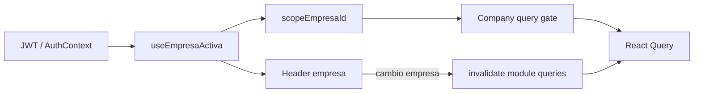

# Estándares frontend ERP — v2.5

**Sistema:** CAXIS ERP (SaaS multi-tenant)  
**Stack:** React · TypeScript · Vite · Tailwind · React Query · Axios · Zustand  
**Versión:** 2.5  
**Fecha:** 24 junio 2026  
**Estado:** **Normativo** — ORG e INV **referencia oficial** (jun 2026) · §5.11 listados PERF (F0–F7) · §4.8.4 IAM Session V2 · Baseline V1 post Phase-09  
**Principio:** *Write once* — reglas con ID único; sin duplicar en `.cursorrules` ni PROMPT  
**Precedencia:** OpenAPI > **este documento** > `ERP_FRONTEND_ARCHITECTURE_BASELINE_V1.md` > `.cursorrules` > `PROMPT_FRONTEND_MAESTRO.md`

**Fuentes consolidadas:**

| Módulo | Documento de cierre | Rol en V2 |
|--------|---------------------|-----------|
| **IAM** | Sprints A–D + B.1.1 (`TENANT_ADMIN_GLOBAL_UX_AUDIT.md`) | Componentes tabla/búsqueda; origen B.1.1 |
| **ORG** | `ORG_CLOSE_AUDIT.md`, `ORG_SPRINT_CLOSURE_AUDIT.md` | Plataforma multiempresa; Plantilla A; hybrid |
|         | *(código validado jun 2026)* | **Referencia oficial** Plantilla A / T / H |
| **INV** | `INV_MODULE_CLOSURE_AUDIT.md` | Plantilla A/B bifurcada; referencia operativa ERP |
|         | *(código validado jun 2026)* | **Referencia oficial** Plantilla A / A+ / B-L / B-F / B-R |

**Auditoría V2:** [`AUDITORIA_FINAL_V2_GAPS.md`](./AUDITORIA_FINAL_V2_GAPS.md)  
**Supersede:** [`ERP_FRONTEND_STANDARDS_V1.md`](./ERP_FRONTEND_STANDARDS_V1.md) (archivado)

---

## §0 — Metadatos y alcance

### §0.1 Propósito

Este documento es la **única fuente normativa** de estándares UX/técnicos del frontend ERP operativo (tenant + company-scoped + transaccional).

| Uso | Descripción |
|-----|-------------|
| Implementación | Checklist por ID MUST al crear o refactorizar módulos |
| QA | Gates §11 como criterio de aceptación |
| Documentación derivada | `.cursorrules` y PROMPT **referencian** IDs; no redefinen reglas |

### §0.2 Qué cubre / qué no cubre

**Cubre:**

- Clasificación de vistas (Plantillas A, A+, B-L, B-F, B-R, T, H, Admin, Platform)
- Multiempresa JWT, auth, impersonation mínima
- UX listados, modales, formularios transaccionales, B.1.1
- Integridad API, RBAC, vocabulario UI, errores
- Referencias canónicas IAM / ORG / INV cerrados
- Patrones validados ORG/INV: dirty stack, modales scroll, RBAC negocio transaccional, workflow UI, branding BRANDING-01
- Arquitectura listados paginados PERF (Tier A/B/C, `useErpListQuery`) — §5.11

**No cubre (documentos externos):**

| Tema | Dónde |
|------|-------|
| Contratos API por módulo | OpenAPI / `docs/api/*_API.json` |
| Params listados ORG/INV (tiers, whitelist sort) | `FRONTEND_LISTADOS_CONTRACT_V1.md` |
| Evidencia implementación PERF F0–F7 | `FRONTEND_PERF_PHASE*_AUDIT.md` |
| Reglas de negocio backend | Backend / dominio |
| Procedimiento Fase 0–4 | `docs/prompts/PROMPT_FRONTEND_MAESTRO.md` |
| Integridad API resumida | `.cursorrules` (pointers a §8) |
| Sistema diseño 2 capas (tokens + brand) | `.cursorrules` §4 |
| Flujo auth detallado | `docs/FLUJO_AUTH_MULTIEMPRESA_FE.md` |
| Arquitectura provider / compositors (L9) | `docs/arquitectura/ERP_FRONTEND_ARCHITECTURE_BASELINE_V1.md` |
| POS terminal, BI/dashboards dedicados | Fuera V2.0 — UI especial |

### §0.3 Precedencia y documentos relacionados

```
OpenAPI (contrato)
    ↓
ERP_FRONTEND_STANDARDS_V2 (este documento)
    ↓
ERP_FRONTEND_ARCHITECTURE_BASELINE_V1 (provider + compositors)
    ↓
.cursorrules (resumen operativo + diseño 2 capas)
    ↓
PROMPT_FRONTEND_MAESTRO.md (proceso; Fase 0 OpenAPI obligatoria)
```

| Documento | Rol | Relación con V2 |
|-----------|-----|-----------------|
| `ERP_FRONTEND_ARCHITECTURE_BASELINE_V1.md` | Patrón Provider + Compositors, refactor estructural core | Complementa §4.8 (comportamiento auth UX); **no** duplicar P-*, AC rules ni testing estructural |
| `.cursorrules` | Recordatorios MUST diarios | Debe apuntar a §4, §7, §8, §11 — **no copiar tablas completas** |
| `PROMPT_FRONTEND_MAESTRO.md` | Bootstrap módulo nuevo | Fase 0.4/0.5 → clasificación §2; Gates → §11 |
| `AUDITORIA_FRONTEND_[CODIGO].md` | Inventario + contrato por módulo | Obligatorio pre-implementación (PROMPT Fase 1) |
| `IAM_SESSION_MANAGEMENT_V2_BACKEND_SPECIFICATION.md` | Contrato sesión IAM V2 (Backend) | §4.8.4 AUTH-V2-* |
| `FRONTEND_IAM_V2_COMPLIANCE_CERTIFICATE.md` | Cierre FE sesión IAM V2 | §4.8.4 AUTH-V2-06 |
| Cierres IAM/ORG/INV | Evidencia QA | §9 referencias; paneles admin especializados → docs de módulo |

**V1:** Archivado. Ante conflicto V1 vs V2, prevalece V2.

### §0.4 Convenciones de lectura

| Nivel | Significado |
|-------|-------------|
| **MUST** | Obligatorio; incumplimiento = no conforme |
| **MUST NOT** | Prohibido |
| **SHOULD** | Recomendado; desviación documentada en auditoría módulo |
| **MAY** | Opcional |

- Cada regla tiene ID único (`ME-01`, `B11-03`, …).
- Referencias cruzadas: `§X.Y` o ID (`ver PA-05`).
- Rutas de código: **solo** en §10 (mapa único).

---

## §1 — Glosario y taxonomía

### §1.1 Glosario normativo

| Término | Definición | Capítulo |
|---------|------------|----------|
| **JWT / sesión** | Token de acceso; tenant, empresa activa, flags impersonation | §4 |
| **`session_id`** | UUID canónico de sesión lógica (JWT `sid`); estable durante vida de sesión | §4.8.4 |
| **`current_session_id`** | Sesión asociada al access token actual (`GET /auth/me/`) | §4.8.4 |
| **`token_id`** | Refresh token vigente (RTR); **no** es ID de sesión | §4.8.4 |
| **Company-scoped** | Datos de **una empresa activa** en sesión | §4.2 |
| **Tenant-scoped** | Datos del tenant sin empresa obligatoria en sesión | §4.2 |
| **Hybrid-scoped** | Recursos GLOBAL u OVERRIDE por empresa | §4.2 |
| **`scopeEmpresaId`** | ID empresa operativa de sesión; fuente única queries/mutaciones company | §4 |
| **B.1.1** | Cierre seguro con formulario dirty: confirmación antes de descartar | §7 |
| **E-ME4** | Prohibición de UUID visible en UI | §4.6 |
| **Baja lógica** | Desactivar / Reactivar — nunca “Eliminar” en vocabulario UI | §8.4 |
| **Dirty / snapshot / baseline (formulario)** | Comparación formulario vs estado inicial para discard (`useOrgModalCreateDirty`, `isDirtyAgainstBaseline`) | §7 |
| **Architecture Baseline V1** | Documento normativo refactor estructural Provider + Compositors — **≠** baseline formulario §7 | `docs/arquitectura/ERP_FRONTEND_ARCHITECTURE_BASELINE_V1.md` |
| **Provider decomposition / L9** | Descomposición Context monolítico en shell + ensamblador + compositors | Baseline V1 §3, §14 |
| **`discardPending`** | `'create' \| 'edit' \| null` — modal pendiente de confirm discard | §7.1 |
| **Plantilla A / A+ / B-L / B-F / B-R** | Taxonomía de vistas ERP | §2 |
| **T / H / Admin / Platform** | Vistas especiales fuera del par A/B estándar | §2 |
| **Gate 0–4** | Checklist obligatorio por fase | §11 |
| **ERP-BL-ACT-01** | Patrón Hub acciones listado B-L: Ver detalle explícito; workflow y edición en modal detalle | §6.3.1 |
| **Modal Hub B-L** | Detalle Tipo A (MD-03) como cockpit operativo del documento | §6.3.1, §7.1.1 |
| **`puedeEditarDocumento`** | Helper local por página; guard único modal edición → B-F | §6.3.1 PB-20 |
| **INV-UX-003** | Cierre INV: dirty guard confirm Aprobar IF (≠ V2 UX-03 §8.6) | §7.3.1 |
| **INV-UX-004** | Cierre INV: dirty guard confirm Anular Mov (≠ V2 UX-04 §8.6) | §7.3.1 |
| **`OrgTenantRouteGuard`** | Guard rutas tenant-scoped sin empresa obligatoria | §4.5 |
| **`useOrgHybridQueryGate`** | Gate queries plantilla H (parámetros hybrid) | §4.5 |
| **`useOrgModalCreateDirty`** | Hook baseline create dinámico en modales A+ | §5.8, §7.1 |
| **`isDirtyAgainstBaseline`** | Comparación normalizada form vs baseline | §7.1 |
| **`DialogBody`** | Contenedor scroll interno modal largo | §7.1.2 |
| **`workflowConfirmOpen`** | Flag derivado: algún confirm workflow B-L abierto | §6.3, §7.1 |
| **`INV_PERMISSIONS`** | Constantes permiso recurso INV (RBAC negocio) | §8.3.1 |
| **`useInvRbacFormAccess`** | Guard acceso B-F por permiso + redirect | §7.2, §8.3.1 |
| **`movimiento-workflow.ui.ts`** | Helpers dominio workflow movimientos | §6.3.1 |
| **Tier A / B / C** | Perfil volumen/paginación listados API — §5.11.1 | §5.11 |
| **`useErpListQuery`** | Hook listado paginado Tier B/C — §5.11 | §5.11, §10 |
| **`normalizeListResponse`** | Política unificación `list[]` \| envelope — §5.11.4 | §5.11 |
| **`matchesInvCatalogSearch`** | **DEPRECATED** — anti-patrón búsqueda client | §5.3.1 |
| **RBAC catálogo** | `usePermissions` → `can(modulo, accion)` | §8.3 |
| **RBAC negocio** | `usePermission` → `hasPermission(CONSTANTE)` | §8.3.1 |
| **BRANDING-01** | Consistencia `brand-primary` / focus rings / accent nativos | §8.9 |

### §1.2 Taxonomía plantilla — tabla maestra

| Plantilla | Naturaleza | CRUD | B.1.1 | Toolbar |
|-----------|------------|------|-------|---------|
| **A** | Maestro modal | Modal | §7.1 | `OrgCompanyToolbar` |
| **A+** | Maestro modal extenso | Modal grande | §7.1 + §7.1.4 | Idem A |
| **B-L** | Lista transaccional + workflow | Lista + detalle modal | §7.3 | Operativa propia |
| **B-F** | Documento cabecera + líneas | Página completa | §7.2 | Header compacto |
| **B-R** | Consulta analítica | Solo lectura | N/A | Filtros dominio |
| **T** | Tenant-wide | Variable | §7.1 si modal | Sin banner empresa duplicado |
| **H** | Hybrid GLOBAL/OVERRIDE | Tabs | §7.1 | `OrgCompanyToolbar` + tabs |
| **Admin** | IAM tenant | Modal / página | §7.1 | Patrón IAM |
| **Platform** | Super-admin | Variable | SHOULD §9.4 | Sin scope company JWT |

---

## §2 — Clasificación de vistas

### §2.1 Árbol de decisión (único en V2)

```
¿Ruta /super-admin/* ?
  SÍ → Platform (§9.4)
  NO → ¿Escritura con detalle embebido POST/PUT?
        SÍ → B-F
        NO → ¿Solo lectura / analítica / reporte exportable?
              SÍ → B-R
              NO → ¿Flujo documental (estados, aprobar, anular)?
                    SÍ → B-L
                    NO → ¿Administración tenant sin empresa en sesión?
                          SÍ → T
                          NO → ¿Parámetros GLOBAL/OVERRIDE?
                                SÍ → H
                                NO → ¿Ruta /admin/* IAM?
                                      SÍ → Admin (§9.1)
                                      NO → ¿Formulario modal > ~25 campos visibles?
                                            SÍ → A+
                                            NO → A
```

**Flujos pre-app** (login, selección empresa, onboarding): no usan plantilla A/B — ver **§4.8 AUTH-xx**.

### §2.2 Reglas de clasificación

| ID | Nivel | Regla |
|----|-------|-------|
| **CL-01** | MUST | Clasificar cada ruta antes de implementar (Gate 0 §11.1) |
| **CL-02** | MUST NOT | Mezclar toolbar Plantilla A (`OrgCompanyToolbar` + Ver inactivos) en B-L/B-R |
| **CL-03** | MUST NOT | Usar B-F si el formulario cabe en modal sin líneas embebidas |
| **CL-04** | SHOULD | Documentar excepción T/H/Platform en `AUDITORIA_FRONTEND_[CODIGO].md` |
| **CL-05** | MUST NOT | Usar `useInvTransactionalFormGuard` en Plantilla A (ver §7.2 SEC-01) |
| **CL-06** | MUST NOT | Crear plantilla ad hoc por código de módulo (PUR, SLS, …); MUST mapear a A/A+/B-L/B-F/B-R/T/H/Admin/Platform |

### §2.3 Matriz cobertura escenarios ERP

| Escenario | Plantilla | Referencia bootstrap §9 |
|-----------|-----------|-------------------------|
| Maestro ORG (depto, cargo, CC, sucursal) | **A** | ORG `DepartamentosPage` |
| Maestro INV catálogo | **A** | INV `UnidadesMedidaPage` |
| Producto modal extenso | **A+** | INV `ProductosPage` |
| Movimientos / IF lista | **B-L** | INV `MovimientosPage` |
| Movimiento / IF form | **B-F** | INV `MovimientoFormPage` |
| Stock / Kardex | **B-R** | INV `StockPage`, `KardexPage` |
| Empresas tenant | **T** | ORG `EmpresaPage` (no copiar monolito — AP-10) |
| Parámetros hybrid | **H** | ORG `ParametrosPage` |
| IAM usuarios / roles | **Admin** | IAM `UserManagementPage` |
| Super-admin clientes / catálogos | **Platform** | §9.4 |
| **PUR** proveedores, contactos | **A** | ORG + INV catálogo |
| **PUR** solicitudes, cotizaciones | **B-L** | INV `MovimientosPage` |
| **PUR** OC, recepciones | **B-F** | INV `MovimientoFormPage` |
| **SLS** clientes, direcciones | **A** | Idem PUR |
| **SLS** cotizaciones, pedidos | **B-F** / **B-L** | INV |
| **FIN** plan cuentas, periodos | **A** | ORG `CentrosCostoPage` |
| **FIN** asientos contables | **B-F** | INV `MovimientoFormPage` |
| **LOG** transportistas, vehículos | **A** | INV `AlmacenesPage` |
| **LOG** guías, despachos | **B-L** + **B-F** | INV IF / movimientos |
| **PRC** listas precio con líneas | **B-F** o **A+** | Si POST embebido → B-F |
| **INV_BILL** comprobantes | **B-L** | Documento fiscal + estados |
| **CRM** pipeline | **B-L** | Lista con estados |
| Reportes / dashboards exportables | **B-R** | Filtros + tabla; sin CRUD |

---

## §3 — Precedencia y anti-patrones

### §3.1 Orden de precedencia

1. Contrato OpenAPI del módulo  
2. **Este documento** (IDs MUST)  
3. `ERP_FRONTEND_ARCHITECTURE_BASELINE_V1.md` (refactor estructural core)  
4. `.cursorrules`  
5. `PROMPT_FRONTEND_MAESTRO.md`

### §3.2 Anti-patrones MUST NOT (lista única)

| ID | Anti-patrón | Plantillas | Regla positiva |
|----|-------------|------------|----------------|
| **AP-01** | Selector empresa en toolbar company-scoped | A, B-* | ME-02 |
| **AP-02** | POST detalle independiente si API marca deprecated | B-F | CD-01 |
| **AP-03** | UUID visible / `title={uuid}` | Todas | E-ME4-01 |
| **AP-04** | Modal CRUD multi-campo sin B.1.1 | A, A+, T, H | B11-01 |
| **AP-05** | Salir B-F dirty sin confirm/blocker | B-F | SEC-01 |
| **AP-06** | Mezclar `ConfirmDialog` baja con `discardPending` | A | B11-02 |
| **AP-07** | H1 + subtítulo en body de listado | A, B-L | TB-01 |
| **AP-08** | Empty inline manual en listados nuevos A | A | ES-01 |
| **AP-09** | Loader full-page ocultando tabla en listado | A, B-L | SK-01 |
| **AP-10** | Copiar `EmpresaPage` monolito como plantilla | T | §9.2 |
| **AP-11** | Toast error duplicado hook + componente | Todas | ER-02 |
| **AP-13** | Radix `Dialog` `open` + `ConfirmDialog` `isOpen` simultáneos | A, B-L, T, H, Admin | B11-10 |
| **AP-14** | Acciones fila catálogo sin rama `row.es_activo` | A, A+, T, H | RB-ROW-02 |

---

## §4 — Multiempresa JWT

### §4.1 Principio

La empresa operativa la define la **sesión** (JWT + `AuthContext`), reflejada en el **header** (`EmpresaSelector`). Las páginas company-scoped **no** duplican esa decisión.



### §4.2 Matriz scope

| Tipo | ¿Empresa en sesión? | Selector en página | Guard | Ejemplo |
|------|---------------------|--------------------|-------|---------|
| **Company** | Sí | No | Company | INV categorías, ORG deptos |
| **Tenant** | No* | No | `OrgTenantRouteGuard` | ORG `EmpresaPage` |
| **Hybrid** | Sí (tab OVERRIDE) | No | Company + `useOrgHybridQueryGate` | ORG `ParametrosPage` — tabs `OrgParametroHybridTabs` |
| **B-F / B-L** | Sí | No | Company | INV movimientos |
| **Platform** | No (scope platform) | No | N/A platform | `/super-admin/*` |

\* Tenant-admin puede operar company-scoped con empresa activa en JWT.

### §4.3 Reglas MUST — scope y queries

| ID | Regla |
|----|-------|
| **ME-01** | `empresa_id` operativo en listados y mutaciones = `scopeEmpresaId` de sesión |
| **ME-02** | MUST NOT `<select>` “Todas las empresas” ni selector empresa en toolbar company-scoped |
| **ME-03** | MUST invalidar queries del módulo al cambiar empresa en header |
| **ME-04** | MUST NOT ejecutar queries company si `requiereSeleccionEmpresa`, `empresaSelectionPending` o sin empresa activa |
| **ME-05** | MUST `assertBodyEmpresaMatchesSession` (o equivalente) en create/update company-scoped |
| **ME-06** | MUST NOT `empresaService.list` para poblar filtros operativos company-scoped |

### §4.4 Reglas SHOULD — scope

| ID | Regla |
|----|-------|
| **ME-07** | SHOULD extraer `useErpCompanyScope` desde `useOrgSessionScope` / `useInvSessionScope` antes de escalar PUR/SLS (Anexo EXT-01) |
| **ME-08** | SHOULD alinear banner fallback con `useHeaderEmpresaContextVisible` antes de `OrgActiveEmpresaBanner` |
| **ME-09** | SHOULD reset filtros locales, modales abiertos y `discardPending` al cambiar `scopeEmpresaId` |
| **ME-10** | SHOULD Hooks GET nuevos usan `useTenantQuery` (tenant en queryKey) además de gate empresa cuando aplique |

### §4.5 Guards y hooks

Patrón por módulo (rutas §10):

| Pieza | ORG | INV |
|-------|-----|-----|
| Session scope | `useOrgSessionScope` | `useInvSessionScope` |
| Query gate | `useOrgCompanyQueryGate` | `useInvCompanyQueryGate` |
| Route guard | `OrgCompanyRouteGuard` | `InvCompanyRouteGuard` |
| Reset filtros | `useOrgScopeEmpresaReset` | `useInvScopeEmpresaReset` |
| Invalidación | `invalidateOrgQueries` | `invalidateInvQueries` |
| Route guard tenant | `OrgTenantRouteGuard` | — |
| Hybrid query gate | `useOrgHybridQueryGate` | — |
| RBAC global params | `useOrgCanManageGlobalParametros` | — |
| Reset UI B-L | — | `resetMovimientosListUiState`, `resetInventarioFisicoListUiState` |

Los hooks `useOrgScopeEmpresaReset` / `useInvScopeEmpresaReset` deben resetear: filtros locales, modales abiertos, `editing`, snapshots, `discardPending` y mapas de enriquecimiento (patrón validado ORG/INV). Ver **ME-09**.

Módulos nuevos: copiar patrón INV/ORG literal en M0; extracción `useErpCompanyScope` no bloqueante.

### §4.6 E-ME4 — identificadores en UI

| ID | Regla |
|----|-------|
| **E-ME4-01** | MUST NOT columna, tooltip, `title`, texto visible con UUID |
| **E-ME4-02** | MUST fallback `—` si FK no resuelta |
| **E-ME4-03** | MAY UUID en `value` de select, hidden inputs, query keys, variables TS |

Ver también §8.2 FK-xx.

### §4.7 Estados de sesión (resumen)

| Estado | Comportamiento | Reglas |
|--------|----------------|--------|
| Requiere selección empresa | Redirect; no queries company | AUTH-01, ME-04 |
| Sin empresa activa | Guard / mensaje | ME-04 |
| Impersonación activa | Respetar flags; no bypass guards | IMP-01…IMP-04 |
| Post-login / post-selección | Destino vía menú JWT | AUTH-02 |

Detalle flujos: **§4.8**.

### §4.8 Flujos Auth, selección empresa e impersonation

> Hogar único AUTH/IMP. §9 no repite estas reglas.

#### §4.8.1 Auth y onboarding

| ID | Nivel | Regla |
|----|-------|-------|
| **AUTH-01** | MUST | Si `requiereSeleccionEmpresa`, redirect a selección; MUST NOT queries company-scoped |
| **AUTH-02** | MUST | Post-login / post-selección: resolver destino vía menú JWT (`resolvePostLoginPath` en `post-login-path.ts`); MUST NOT hardcode módulo |
| **AUTH-03** | MUST | Onboarding primera empresa (`?onboarding=true`): B.1.1 en modal create; flujo **T**; no company-scoped hasta empresa creada |
| **AUTH-04** | MUST | `SeleccionarEmpresaPage`: elección persiste en JWT; MUST NOT operar listados company sin empresa activa |
| **AUTH-05** | SHOULD | Empty / error en selección con CTA claro (logout, reintentar) |

**Referencias código:** §10 — `AuthContext`, `SeleccionarEmpresaPage`, `OnboardingEmpresaPage`, `post-login-path.ts`.  
**Detalle:** `docs/FLUJO_AUTH_MULTIEMPRESA_FE.md`.

#### §4.8.2 Impersonation (platform → tenant)

| ID | Nivel | Regla |
|----|-------|-------|
| **IMP-01** | MUST | Con impersonación activa (`is_impersonation` JWT): MUST NOT bypass guards company vía `savePlatformParentSession` u otro atajo |
| **IMP-02** | MUST | Tras impersonate con selección pendiente: mismo flujo AUTH-01 que login multiempresa |
| **IMP-03** | MUST | Salir impersonación: restaurar sesión platform parent; invalidar queries tenant/empresa |
| **IMP-04** | SHOULD | UI visible “modo soporte” sin exponer tokens ni UUID cliente |
| **IMP-05** | MUST | En impersonación: MUST NOT `POST /auth/empresa/cambiar/`; selector empresa readonly; sesión impersonada permanece |
| **IMP-06** | SHOULD | Bloqueo in-place con guard en provider; UI refleja `canSwitchEmpresa`; MUST NOT terminar impersonación por intento de cambio empresa |

**Separación:** AUTH = selección normal; IMP = impersonation platform.

#### §4.8.3 Implementación estructural auth (post Phase-09)

Comportamiento observable auth/impersonation permanece en **§4.8.1–§4.8.2** (AUTH-*, IMP-*).  
La **implementación interna** post IAM-FE-PHASE-09 SIGNOFF-02:

- **Entrada pública app:** `@/shared/context/AuthContext` + `useAuth()` — **sin cambio** de contrato (§10).
- **Capa L9 interna:** `src/core/auth/provider/` — ensamblador `useAuthProvider`; **MUST NOT** importar compositors desde features/UI.
- **Refactor estructural core:** proceso y reglas → `docs/arquitectura/ERP_FRONTEND_ARCHITECTURE_BASELINE_V1.md` §14.

#### §4.8.4 Identidad de sesión IAM V2

> Alcance: aplica a código que consume API `/auth/sessions*` o identidad en `/auth/me/`. **No** aplica a módulos operativos (PUR, SLS, CRM, …) sin superficie de sesión.

| ID | Nivel | Regla |
|----|-------|-------|
| **AUTH-V2-01** | MUST | Identificador canónico de sesión = `session_id` (claim JWT `sid`, listados, revoke path param) |
| **AUTH-V2-02** | MUST NOT | Usar `token_id` como ID de sesión en UI, keys de dominio ni revoke — `token_id` es refresh vigente (RTR) |
| **AUTH-V2-03** | MUST | `current_session_id` desde `GET /auth/me/` en contexto auth; fallback temporal `current_token_id` solo RC1 |
| **AUTH-V2-04** | SHOULD | Prioridad `is_current`: flag backend → `session_id === current_session_id` → fallback `token_id` RC1; **MUST** si el módulo lista sesiones |
| **AUTH-V2-05** | MUST | Revoke self/admin: path param = `resolveSessionId(target)` (`session_id` con fallback `token_id` RC1) — cuando exista API revoke de sesión |
| **AUTH-V2-06** | SHOULD | Pointer normativo: `IAM_SESSION_MANAGEMENT_V2_BACKEND_SPECIFICATION.md` + `FRONTEND_IAM_V2_COMPLIANCE_CERTIFICATE.md` |

**Referencias código:** §10 — `resolveSessionId`, `isCurrentSession`.

---

## §5 — Plantilla A — Catálogo

> Aplica **A** y **A+**. Extensiones A+ solo §5.8.

### §5.1 Layout de página

| ID | Regla |
|----|-------|
| **PA-01** | MUST `OrgPageLayout` / `InvPageLayout` sin H1 en body |
| **PA-02** | MUST secuencia: Toolbar → Skeleton → Error banner → Tabla |

### §5.2 Toolbar

Layout obligatorio:

```
[ Filtros opcionales ] [ Búsqueda ] [ Ver inactivos ]     ———     [ CTA Crear ]
        └────────────── grupo izquierdo ──────────────┘              └─ derecha ─┘
```

| ID | Regla |
|----|-------|
| **TB-01** | MUST NOT H1/subtítulo en body (breadcrumb identifica página) |
| **TB-02** | MUST `justify-between`; CTA derecha `shrink-0` |
| **TB-03** | MUST NOT selector empresa en company-scoped |
| **TB-04** | MUST `gap-3`; controles secundarios `shrink-0` |
| **TB-05** | MUST deshabilitar CTA, búsqueda, acciones fila si `discardPending !== null` |

Componentes: §10 — `OrgCompanyToolbar`, `OrgToolbarSearch`.

### §5.3 Búsqueda

| ID | Regla |
|----|-------|
| **SR-01** | MUST `OrgToolbarSearch` + `IamSearchInput` |
| **SR-02** | MUST `hasSearch` vía `useDebouncedSearch().hasSearch` para variante empty (ES-03) |
| **SR-03** | SHOULD debounce **350 ms** en búsqueda server-side listados ERP (`ERP_LIST_SEARCH_DEBOUNCE_MS`); patrón IAM 500 ms válido fuera listados ERP |
| **SR-04** | MAY búsqueda client-side **solo** si OpenAPI del recurso **no** expone `buscar` — documentar deuda en auditoría módulo |
| **SR-05** | MUST NOT filtrar in-memory filas del listado cuando OpenAPI expone `buscar` |
| **SR-06** | MUST NOT toolbar `buscar` en recursos Tier C sin param `buscar` — usar filtros de dominio (§6.2 PB-02) |

#### §5.3.1 Anti-patrón deprecado — búsqueda client en catálogos (SR-04 histórico)

> **DEPRECATED jun 2026.** No usar en listados nuevos. Norma vigente: **§5.11**.

| Anti-patrón | Estado |
|-------------|--------|
| `matchesInvCatalogSearch` + `useMemo` filter sobre lista cargada | Eliminado en INV catálogos F6; util conservada sin consumidores |
| Búsqueda client en tabla cuando API tiene `buscar` | **PROHIBIDO** — SR-05 |

Si un módulo futuro carece de `buscar` en OpenAPI: registrar deuda en `AUDITORIA_FRONTEND_[CODIGO].md`; **no** reintroducir utilidades client-side sin revisión arquitectónica.

### §5.4 Empty state

| ID | Regla |
|----|-------|
| **ES-01** | MUST `IamTableEmptyState` dentro `<tbody>` |
| **ES-02** | MUST `colSpan` = columnas `<thead>` = skeleton |
| **ES-03** | MUST NOT CTA crear si `hasSearch` |
| **ES-04** | MUST `actionDisabled` si `discardPending !== null` |

#### §5.4.1 Matriz mensajes

| Condición | Título | Description | CTA crear |
|-----------|--------|-------------|-----------|
| Lista vacía, solo activos | “No hay … activos.” | — | Sí, si permiso + scope |
| Lista vacía, con inactivos | “No hay … registrados.” | — | Según tab |
| `hasSearch` | “No se encontraron … que coincidan con la búsqueda.” | “Pruebe otro término…” | **No** |
| Sin `scopeEmpresaId` | Mensaje guard, no empty tabla | — | No |

### §5.5 Skeleton

| ID | Regla |
|----|-------|
| **SK-01** | MUST `InvTableSkeleton` (re-export ORG: `OrgTableSkeleton`) |
| **SK-02** | MUST constante `TABLE_COLSPAN` compartida skeleton / empty / thead |
| **SK-03** | MUST NOT solo `Loader` ocultando toda la tabla en listado |

Excepción: carga inicial formulario B-F — §6.6.

### §5.6 Modal CRUD

| ID | Regla |
|----|-------|
| **PA-03** | MUST modales create + edit |
| **PA-04** | MUST `OrgSessionEmpresaField` en create company-scoped |
| **PA-05** | MUST B.1.1 create + edit (detalle §7.1) |
| **PA-06** | MUST NOT `useInvTransactionalFormGuard` en Plantilla A |
| **PA-07** | MUST `ConfirmDialog` desactivar/reactivar **independiente** de discard |
| **PA-08** | MUST RBAC: no renderizar botón sin permiso |

Stack types/hooks: §8.1. Vocabulario baja: §8.4. Variants `ConfirmDialog`: §8.8 UX-05…08.

Modales largos A/A+: ver **§7.1.2** (`DialogBody`, scroll interno).

### §5.7 Reset al cambiar empresa

| ID | Regla |
|----|-------|
| **PA-09** | MUST extender `use*ScopeEmpresaReset`: cerrar modals, limpiar editing, snapshot, `discardPending` |

Referencia INV M3: reset empresa en modals catálogo.

### §5.8 Plantilla A+ (extensiones)

| ID | Regla |
|----|-------|
| **PA+-01** | MAY modal `max-w-3xl` o mayor; mismo B.1.1 que A |
| **PA+-02** | MUST baseline create dinámico si defaults dependen de catálogos async (ej. monedas en Productos) |
| **PA+-03** | SHOULD dirty scope = solo campos visibles en modal |

Referencia: INV `ProductosPage` §9.3.

**PA+-02 implementación:** `useOrgModalCreateDirty` + `isDirtyAgainstBaseline` (`@/features/org/hooks/useOrgModalCreateDirty`, `@/features/org/utils/org-form-dirty.helpers`). Referencia: INV `ProductosPage`.

### §5.9 Referencias canónicas Plantilla A

| Módulo | Archivo | Rol |
|--------|---------|-----|
| ORG | `DepartamentosPage`, `CentrosCostoPage` | A estándar |
| ORG | `SucursalesPage`, `CargosPage` | A estándar |
| ORG | `EmpresaPage` | T — **AP-10** |
| ORG | `ParametrosPage` | H — hybrid tabs |
| INV | `UnidadesMedidaPage`, `CategoriasPage`, `AlmacenesPage`, `TiposMovimientoPage` | A Tier B — §5.11 ErpList |
| INV | `ProductosPage` | A+ Tier B — §5.11 ErpList |

### §5.10 Acciones de fila — catálogo (Plantilla A, A+, T, H)

> Complementa **UX-04** (formularios) y **RB-01** (permisos). Referencia: INV `AlmacenesPage`; ORG `DepartamentosPage`.

| ID | Regla |
|----|-------|
| **RB-ROW-01** | MUST en listados con baja lógica: si `row.es_activo === true` → Editar + Desactivar (con permiso); si `false` → Reactivar **únicamente** (con permiso) |
| **RB-ROW-02** | MUST rama única `row.es_activo ? accionesActivas : accionesInactivas` — MUST NOT bloques aditivos que muestren Editar/Desactivar/Reactivar sin discriminar estado |
| **RB-ROW-03** | MUST guards de dominio adicionales (ej. `rowCanMutate` en hybrid) **dentro** de cada rama; no sustituyen RB-ROW-01 |

**Convención permiso Reactivar:** MAY usar permiso `editar` — ver implementación ORG/INV §9.2, §9.3.

### §5.11 Arquitectura listados paginados (PERF-01…06)

> Norma transversal listados ORG/INV validada F0–F7 (jun 2026). Contrato params y whitelists: **`FRONTEND_LISTADOS_CONTRACT_V1.md`**. Aplica a **módulos futuros** (PUR, SLS, FIN, CRM, LOG, etc.) que expongan el mismo contrato listados backend.

#### §5.11.1 Perfiles Tier A / B / C

| Tier | Recursos (ORG/INV referencia) | Respuesta API | Paginación UI | Búsqueda | Hook tabla |
|------|----------------------------|---------------|---------------|----------|------------|
| **A** | ORG: empresa, sucursales, deptos, cargos | `list[]` aceptable | Opcional | Server `buscar` + debounce | Legacy `useTenantQuery` OK |
| **B** | ORG: centros-costo, parámetros; INV maestros | `list[]` \| envelope | **MUST** `page=1&limit=50` | Server `buscar` + debounce | **MUST** `use*ErpList` |
| **C** | INV: movimientos, kardex, IF, stock | `list[]` \| envelope | **MUST** paginar | Filtros **dominio** (sin `buscar` si API no lo expone) | **MUST** `use*ErpList` |

Matriz decisión (contrato §5): Tier C o >50 filas esperadas → siempre paginar; Tier A → full-load aceptable con debounce; Tier B → paginar en grillas.

#### §5.11.2 Capas de implementación

```
Página → useDebouncedSearch (si API expone buscar)
      → useModuloErpList (hook módulo)
      → useErpListQuery (@/core/list)
      → fetcher: orgFetchList | invFetchList + build*ListQuery
      → normalizeListResponse
      → ErpSortableHeader + ErpPagination
```

| Capa | Ubicación |
|------|-----------|
| Config tier/whitelist | `ErpListResourceConfig`, `*_LIST_CONFIG` en hooks del módulo |
| Query state | `src/core/list/useErpListQuery.ts` |
| Debounce toolbar | `src/core/list/useDebouncedSearch.ts` |
| Normalización respuesta | `src/core/list/erp-list-normalize.ts` |
| Query params HTTP | `buildErpListQueryParams`, `resolveErpListFetchParams` |
| UI compartida | `src/shared/components/erp-list/*` |

#### §5.11.3 Reglas MUST — IDs LR-xx

| ID | Regla |
|----|-------|
| **LR-01** | Tier B/C tabla principal: MUST `useErpListQuery` vía hook `use*ErpList` del módulo |
| **LR-02** | Tier B/C: MUST `forcePagination: true`, default `limit=50` (`ERP_LIST_DEFAULT_LIMIT`) |
| **LR-03** | Fetcher ErpList: MUST `orgFetchList` / `invFetchList` sin `unwrapListItems`; envelope intacto hasta `normalizeListResponse` |
| **LR-04** | Sort: MUST whitelist `sortableColumns` del contrato; UI solo vía `ErpSortableHeader` |
| **LR-05** | MUST NOT sort in-memory en listas paginadas server-side |
| **LR-06** | MUST reset `page=1` al cambiar búsqueda debounced, filtros dominio, `solo_activos`, tab hybrid (H) |
| **LR-07** | Reset empresa (ME-09): MUST `search.clear()`, `setPage(1)`, `clearSort()` en callback `use*ScopeEmpresaReset` |
| **LR-08** | Hooks legacy full-load (`useXxx` sin ErpList): **MAY** únicamente para **selects, comboboxes, FK lookups y modales** (`enabled` acotado). **MUST NOT** alimentar tablas Tier B/C, búsquedas masivas ni dashboards operativos |
| **LR-09** | Tier C sin `buscar` en OpenAPI: MUST NOT `OrgToolbarSearch` con filtrado client — PB-02 filtros dominio |
| **LR-10** | Plantilla H (parámetros): MUST query `vista=efectivo\|global\|override`; una instancia ErpList por tab activa |

#### §5.11.4 Política `normalizeListResponse`

> **Política arquitectónica obligatoria** — no negociable por pantalla.

| ID | Regla |
|----|-------|
| **LR-N01** | Todo listado nuevo Tier B/C MUST consumir respuesta API vía **`normalizeListResponse`** (directamente en `useErpListQuery` o fetcher equivalente) |
| **LR-N02** | MUST tolerar **ambos** modos backend: `list[]` legacy y `Paginated*Response` envelope — sin ramas ad hoc por pantalla |
| **LR-N03** | MUST NOT crear adaptadores, mappers o normalizadores **por pantalla** que dupliquen la lógica de `@/core/list/erp-list-normalize.ts` |
| **LR-N04** | `unwrapListItems` / `orgListItems` / `invListItems`: MAY en hooks legacy §LR-08; **MUST NOT** en fetcher ErpList de tabla Tier B/C |

Reglas contrato HTTP: `limit` solo con `page`; `sort_dir` solo con `sort_by`. Toast 422 `INVALID_SORT_COLUMN`: deuda F8 — fuera alcance F0–F7.

#### §5.11.5 Referencias canónicas implementadas (ORG/INV)

> Las pantallas siguientes son **referencias canónicas de código** validadas jun 2026. La arquitectura §5.11 es **norma de plataforma**: al implementar listados en **PUR, SLS, FIN, CRM, LOG** u otros módulos con contrato listados equivalente, copiar el mismo stack (Tier → `*_LIST_CONFIG` → `use*ErpList` → componentes §10), no reimplementar patrones ad hoc.

| Módulo | Pantalla | Tier | Rol referencia |
|--------|----------|------|----------------|
| INV | `ProductosPage` | B | Piloto ErpList + A+ |
| INV | `CategoriasPage`, `UnidadesMedidaPage`, `AlmacenesPage`, `TiposMovimientoPage` | B | Catálogos maestros |
| INV | `MovimientosPage`, `InventarioFisicoPage` | C | B-L + filtros dominio |
| INV | `StockPage`, `KardexPage` | C | B-R + gate dominio (kardex: `producto_id`) |
| ORG | `CentrosCostoPage` | B | Tier B company-scoped |
| ORG | `ParametrosPage` | B + H | Tabs hybrid + ErpList |
| ORG | `EmpresaPage`, `SucursalesPage`, `DepartamentosPage`, `CargosPage` | A | Debounce + `buscar` server; sin ErpList obligatorio |

**INV-REF-02:** Primer módulo operativo con arquitectura PERF completa. **Obligatorio** como plantilla listados para PUR/SLS/FIN/CRM al cerrar contrato OpenAPI del módulo.

#### §5.11.6 Anti-patrones eliminados (código nuevo)

| Anti-patrón | Sustituto |
|-------------|-----------|
| `matchesInvCatalogSearch` + `.filter()` en tabla | `buscar` server + `useDebouncedSearch` |
| Full-load hook en tabla Tier B/C | `use*ErpList` |
| `orgListItems` en fetcher paginado | `orgFetchList` + `normalizeListResponse` |
| Sort client-side en lista paginada | `ErpSortableHeader` + whitelist |
| Toolbar `buscar` en Tier C sin param API | Filtros dominio §6.2 |

#### §5.11.7 Fuera de alcance F0–F7 (Fase 8+)

URL sync listados, chips filtros, `AbortController` búsqueda, toast 422 sort, `ErpDataTable` genérico, limpieza fallback híbrido parámetros legacy — ver `FRONTEND_PERF_IMPLEMENTATION_PLAN.md` Fase 8.

---

## §6 — Plantilla B — Transaccional y consulta

### §6.1 Subclasificación

| Plantilla | Descripción | Ejemplo INV |
|-----------|-------------|-------------|
| **B-L** | Lista + workflow + detalle modal | `MovimientosPage`, `InventarioFisicoPage` |
| **B-F** | Documento cabecera + líneas, página completa | `MovimientoFormPage`, `InventarioFisicoFormPage` |
| **B-R** | Solo lectura / analítica | `StockPage`, `KardexPage` |

### §6.2 Toolbar operativa (B-L / B-R)

| ID | Regla |
|----|-------|
| **PB-01** | MUST NOT `OrgCompanyToolbar` + patrón “Ver inactivos” en B-L/B-R |
| **PB-02** | MUST filtros de dominio (fechas, almacén, producto, estado documento) |
| **PB-03** | MUST NOT “Ver inactivos” de catálogo si dominio usa estados de documento |

### §6.3 Lista transaccional B-L

| ID | Regla |
|----|-------|
| **PB-04** | MUST acciones workflow en detalle/modal; no en tabla salvo atajo documentado |
| **PB-05** | MUST reset lista al cambiar empresa (patrón `inv-list-empresa-reset`) |
| **PB-06** | MAY empty inline hoy; SHOULD migrar `IamTableEmptyState` (deuda Anexo ES-B) |
| **PB-07** | MUST skeleton tabla en carga |
| **PB-08** | MUST `ConfirmDialog` workflow (aprobar/anular) sin mezclar B.1.1 form dirty |
| **PB-13** | MUST al abrir `ConfirmDialog` workflow desde modal detalle B-L: cerrar detalle (`setDetailOpen(false)` o equivalente) **antes** de `isOpen={true}` |
| **PB-14** | SHOULD defensa en profundidad: `open={detailOpen && !workflowConfirmOpen}` y `onOpenChange` que no cierre detalle mientras confirm workflow abierto |

Referencia: INV `MovimientosPage`, `InventarioFisicoPage`. Caso de estudio stacking: `INV_MODAL_STACKING_AUDIT.md`.

**Referencia INV validada:** `MovimientosPage`, `InventarioFisicoPage` usan empty inline en `<tbody>`. PB-06 MAY sigue vigente; la referencia oficial documenta el estado actual. Migración a `IamTableEmptyState` permanece en Anexo **ES-B** (no Gate).

Patrón validado: `workflowConfirmOpen` derivado de flags confirm locales; `detailDialogOpen = detailOpen && !workflowConfirmOpen` — ver PB-13, PB-14, §7.1.

### §6.3.1 Patrón ERP-BL-ACT-01 — Listado B-L Hub (acciones)

> **Estado:** Extensión normativa **v2.1** (jun 2026).  
> **Referencia implementada:** INV `MovimientosPage`, `InventarioFisicoPage`.  
> **Ámbito:** Plantilla **B-L** transaccional ERP (PUR, SLS, LOG, INV_BILL, CRM pipeline, etc.).

| ID | Regla |
|----|-------|
| **PB-15** | MUST NOT abrir detalle modal con `onClick` en `<tr>` ni `cursor-pointer` en fila como navegación |
| **PB-16** | MUST columna **Acciones** con botón icono **«Ver detalle»** (`Eye`, `title` + `aria-label="Ver detalle"`, variant ghost) |
| **PB-17** | MUST función única `abrirDetalle(entidad)` invocada **solo** desde PB-16 |
| **PB-18** | MUST NOT acciones **workflow** ni **edición** en grilla (refuerza PB-04) |
| **PB-19** | MUST edición documento **únicamente** desde modal detalle Hub → navegación B-F |
| **PB-20** | MUST helper local `puedeEditarDocumento(entidad \| selected)` — misma regla en modal; reglas de estado **por dominio** |
| **PB-21** | MUST CTA modal edición: texto **«Editar documento»** (N-B) |

**Modelo Hub:**

1. Grilla: descubrimiento + filtros + **Ver detalle** explícito.  
2. Modal detalle (Tipo A — MD-03): lectura + barra operativa (workflow PB-04 + PB-13/14).  
3. Editar: link/botón «Editar documento» → formulario B-F (CD-04, CD-05 en destino).

**Nota PB-04:** PB-18 acota «atajo documentado» para workflow y edición en tabla B-L Hub.

**Antecedente arquitectónico INV-BL-DET-01:** Patrón documental híbrido (click fila + icono Eye, jun 2026) queda como referencia histórica en `INV_DETAIL_NAVIGATION_HOMOLOGATION_AUDIT.md` e `INV_BL_DET_01_HOMOLOGATION_PLAN.md`. Patrón operativo vigente en v2.1: **ERP-BL-ACT-01** (PB-15…PB-21).

#### Helpers workflow dominio (referencia INV)

| Helper | Archivo |
|--------|---------|
| `resolveRequiereAutorizacion` | `movimiento-workflow.ui.ts` |
| `puedeAutorizarMovimiento` | idem |
| `puedeProcesarMovimiento` | idem |
| `puedeAnularMovimiento` | idem |
| `puedeEstornarMovimiento` | idem |
| `puedeEditarMovimientoDocumento` | idem (PB-20) |
| `esEstadoMovimientoTerminal` | idem |

Inventario físico: lifecycle permissions vía `INV_PERMISSIONS` + guards dominio en `InventarioFisicoPage` — ver §8.3.1, §7.3.1.

### §6.4 Consulta B-R

| ID | Regla |
|----|-------|
| **PB-09** | MUST NOT Crear / desactivar maestro |
| **PB-10** | MUST E-ME4 + fallback FK `—` |
| **PB-11** | MAY deep-link query params (ej. Kardex `producto_id`) |
| **PB-12** | MUST NOT endpoints escritura deprecated |

Referencia: INV `StockPage`, `KardexPage`.

**Enriquecimiento validado:** mapa local `productosMap` + `productoService.getById` por IDs únicos del listado; fallback `—` (E-ME4). **StockPage:** toggle `verAlertas` alterna `useStocks` / `useStockAlertas`. **KardexPage:** deep-link `producto_id`, `almacen_id` vía `useSearchParams`.

### §6.5 Cabecera + detalle — reglas API (B-F)

| ID | Regla |
|----|-------|
| **CD-01** | MUST un solo POST/PUT con detalle embebido (`…/con-detalle`) |
| **CD-02** | MUST NOT POST/PUT independiente sobre detalle si API deprecated |
| **CD-03** | MAY GET detalle para lectura |
| **CD-04** | MUST página completa si líneas editables pre-submit |
| **CD-05** | MUST sección cabecera + sección líneas |
| **CD-06** | MUST agregar/eliminar línea client-side pre-submit |
| **CD-07** | MUST `empresa_id` cabecera = sesión (ME-05) |

### §6.6 Layout B-F (UI)

| ID | Regla |
|----|-------|
| **CD-08** | MUST contenedores `bg-surface border border-border-base rounded-lg shadow-sm` |
| **CD-09** | MUST cabecera `p-6 mb-6`; detalle header `px-4 py-3 border-b border-border-base` |
| **CD-10** | MAY header compacto con identificador documento + acciones |
| **CD-11** | MUST NOT `InvPageLayout` full chrome si full-bleed transaccional documentado |

Referencia: INV `MovimientoFormPage`, `InventarioFisicoFormPage`.

---

## §7 — Seguridad UX — B.1.1

> Capítulo único discard. §5/§6 solo referencian IDs.

### §7.1 B.1.1 modales (A, A+, T, H, Admin)

#### Comportamiento

| ID | Regla |
|----|-------|
| **B11-01** | MUST confirm si dirty al cerrar (X, ESC, overlay, Cancelar) |
| **B11-02** | MUST `ConfirmDialog` baja/reactivar **independiente** de `discardPending` |
| **B11-03** | MUST deshabilitar toolbar/búsqueda/acciones fila si `discardPending !== null` |
| **B11-04** | MUST textos “Seguir editando” / “Sí, descartar” |
| **B11-05** | MUST NOT cerrar si submitting |
| **B11-06** | MUST `onInteractOutside` / `onEscapeKeyDown` → `preventDefault` si dirty |
| **B11-10** | MUST NOT tener `Dialog` Radix con `open={true}` y `ConfirmDialog` con `isOpen={true}` simultáneamente |
| **B11-11** | MUST cerrar `Dialog` Radix antes de abrir cualquier `ConfirmDialog` (discard, baja, reactivar, workflow) |

#### Flujo post-save

| ID | Regla |
|----|-------|
| **B11-07** | MUST `closeCreate` / `closeEdit` tras save OK |

#### Dirty A+

| ID | Regla |
|----|-------|
| **B11-08** | MUST snapshot edit al abrir; baseline create en open (A+) |
| **B11-09** | MUST dirty compare solo campos UI del modal |

#### §7.1.1 Clasificación de superficies modal (Tipo A / B / C)

| ID | Regla |
|----|-------|
| **MD-01** | MUST clasificar cada superficie modal en **Tipo A** (solo lectura), **Tipo B** (formulario editable CRUD) o **Tipo C** (`ConfirmDialog` negocio/discard) antes de implementar |
| **MD-02** | MUST Tipo B: `orgDialogGuardProps` + B.1.1 completo (B11-01…09) |
| **MD-03** | MUST Tipo A (detalle lectura B-L): Radix default (ESC y click fuera permitidos); MUST NOT `orgDialogGuardProps` — ver SEC-08 |
| **MD-04** | MUST Tipo C: `ConfirmDialog` a nivel página; cierre solo Cancelar/X; MUST cumplir B11-10 al abrir desde un `Dialog` Radix |

#### §7.1.2 Modal scroll — formularios largos (MOD-SCROLL)

| ID | Regla |
|----|-------|
| **MD-05** | MUST modales largos A/A+/detalle B-L con formulario extenso: `DialogContent` con `flex flex-col` + `overflow-hidden` |
| **MD-06** | MUST cuerpo desplazable en `DialogBody` (`min-h-0 flex-1 overflow-y-auto overscroll-contain`) |
| **MD-07** | MUST `DialogHeader` y `DialogFooter` fijos; scroll solo en `DialogBody` |
| **MD-08** | MUST NOT scrollbar en contenedor externo del modal (evitar desbordamiento fuera del panel) |

**Referencias:** `ProductosPage`, `EmpresaPage`, `SucursalesPage`, `CargosPage`, `CentrosCostoPage`, `MovimientosPage`, `InventarioFisicoPage`. Componente: `@/shared/components/ui/dialog` (`DialogBody`).

#### Piezas técnicas

Estado `discardPending`, `createOrgDiscardHandlers`, `OrgDiscardConfirmDialog`, `orgDialogGuardProps`, `form-dirty/*`, `scheduleModalStackValidation` → **§10**.

`useOrgModalCreateDirty`, `isDirtyAgainstBaseline` → **§10** (create dirty A+; ver PA+-02).

Patrón página B-L (no componente §10): derivar `workflowConfirmOpen` de flags locales y `detailDialogOpen = detailOpen && !workflowConfirmOpen` — ver PB-13, PB-14.

#### QA mínimo modal

Matriz 9 casos: `INV_M3_B11_CATALOGS_AUDIT.md` §8. Gate 2 §11.3.

### §7.2 B.1.1 página completa (B-F)

| ID | Regla |
|----|-------|
| **SEC-01** | MUST dirty guard página: `useInvTransactionalFormGuard` hoy; sucesor SHOULD `useErpTransactionalFormGuard` (Anexo EXT-02) |
| **SEC-02** | MUST `useBlocker` o equivalente RR si dirty al navegar |
| **SEC-03** | MUST `OrgDiscardConfirmDialog` + handlers página (`createInvPageDiscardHandlers`) |
| **SEC-04** | MUST cambio empresa en edit → redirect + toast (no form stale) |
| **SEC-05** | MUST NOT reset form antes navigate en discard edit |
| **SEC-06** | MUST create: reset form al cambiar empresa |
| **SEC-07** | SHOULD `beforeunload` — backlog, no MUST |
| **SEC-14** | MUST rutas B-F: `useInvRbacFormAccess(permission, redirectPath)` tras `permissionsInitialized`; MUST constantes módulo (`INV_PERMISSIONS` en INV); MUST redirect si sin permiso |

Referencia QA: `INV_M2_SEC_QA_BEHAVIOR_MATRIX.md`. Módulo INV §9.3. Referencias B-F: `MovimientoFormPage`, `InventarioFisicoFormPage`.

**PUR-M2:** SHOULD usar guard extraído `useErpTransactionalFormGuard` si existe; si no, copiar INV con rename module-local.

### §7.3 B.1.1 en B-L (excepciones)

| ID | Regla |
|----|-------|
| **SEC-08** | MUST NOT B.1.1 en modales **solo lectura** detalle |
| **SEC-09** | MUST NOT B.1.1 en confirms workflow one-shot (aprobar, procesar, anular con motivo) |
| **SEC-10** | MAY dirty en campos motivo anular — backlog Anexo R-06 |

### §7.3.1 Dirty guard en confirms workflow B-L (campos editables)

> Complementa **SEC-09** (no B.1.1 completo en one-shot) e implementa cierre parcial en INV (ver Anexo **R-06-INV**).

| ID | Regla |
|----|-------|
| **SEC-11** | MUST en `ConfirmDialog` workflow B-L con campos editables (ej. motivo anular, tipo/obs aprobar): baseline al abrir + compare dirty al cancelar |
| **SEC-12** | MUST usar `OrgDiscardConfirmDialog` + `discardPending` local página; MUST cumplir B11-10 al solicitar discard (cerrar confirm antes) |
| **SEC-13** | MUST NOT resetear campos del confirm al cancelar si dirty sin confirmación discard |

**Cierres documentados INV (jun 2026):**

| Ticket proyecto | Pantalla | Confirm | Evidencia |
|-----------------|----------|---------|-----------|
| **INV-UX-003** | `InventarioFisicoPage` | Aprobar (tipo movimiento + obs) | `UX_003_IMPLEMENTATION_PLAN.md` |
| **INV-UX-004** | `MovimientosPage` | Anular (motivo) | `UX_004_IMPLEMENTATION_PLAN.md` |
| *(referencia)* | `InventarioFisicoPage` | Lifecycle: `INV_PERMISSIONS.INVENTARIO_FISICO_*` + guards dominio aprobar/finalizar/anular | §8.3.1 |

**Disambiguación:** **INV-UX-003/004** ≠ **UX-03/UX-04** (§8.6 `es_activo` catálogo).

---

## §8 — Integridad API, datos y RBAC

### §8.1 Endpoints y service layer

| ID | Regla |
|----|-------|
| **API-01** | MUST NOT consumir endpoints `deprecated: true` |
| **API-02** | MUST comentar código legacy deprecated en service |
| **API-03** | MUST service layer; no fetch directo desde componentes |
| **API-04** | MUST types Create / Update / Read separados |

### §8.2 UUID, FK y enriquecimiento

Cross-ref E-ME4 §4.6.

| ID | Regla |
|----|-------|
| **FK-01** | MUST Select FK: nombre visible, ID en value enviado |
| **FK-02** | MUST NOT hardcode FK (moneda default, etc.) sin catálogo |

Si listado solo trae ID: ajustar query, join API, o mapa local — **nunca** mostrar UUID (E-ME4-02).

### §8.3 RBAC

| ID | Regla |
|----|-------|
| **RB-01** | MUST `usePermissions` → `can(modulo, accion)`; no renderizar acción sin permiso |
| **RB-02** | MUST NOT usar `disabled` como sustituto de ocultar en acciones destructivas |

Rutas: `PermissionGuard` §10.

#### §8.3.1 RBAC negocio — transaccional (INV referencia)

| ID | Regla |
|----|-------|
| **RB-N01** | MUST lifecycle B-L/B-F INV: `usePermission().hasPermission(INV_PERMISSIONS.…)` |
| **RB-N02** | MUST combinar permiso + regla dominio (estado documento) antes de renderizar acción workflow |
| **RB-N03** | MUST B-F: `useInvRbacFormAccess` — ver SEC-14 |
| **RB-N04** | MUST NOT confundir RB-N01 con RB-01: catálogos usan `can(modulo, accion)`; transaccional usa constantes recurso |

#### §8.3.2 IAM / LBAC (pointer)

> Administración identidad y LBAC: **§9.1 IAM-REF-01**. No replicar reglas IAM en módulos ERP operativos.

### §8.4 Vocabulario UI y baja lógica

**Tabla única** — no redefinir en otros capítulos.

| Contexto | Término UI | MUST NOT |
|----------|------------|----------|
| Maestro activo/inactivo | Desactivar / Reactivar | Eliminar, Borrar, Dar de baja |
| Documento workflow | Anular / Aprobar / Procesar / Finalizar | Según dominio API |
| Confirm baja maestro | “¿Desactivar …?” | “¿Eliminar …?” |
| CTA edición B-L → B-F | Editar documento | Editar cabecera y líneas (solo docs históricos) |

| ID | Regla |
|----|-------|
| **UX-01** | MUST vocabulario de esta tabla |
| **UX-02** | MUST NOT “Eliminar”, “Dar de baja”, “Borrar” en UI ERP |
| **UX-09** | MUST CTA edición desde modal detalle B-L: **«Editar documento»** (PB-21); MUST NOT variantes por módulo salvo excepción documentada en auditoría |

### §8.5 Errores y toast

| ID | Regla |
|----|-------|
| **ER-01** | MUST `getErrorMessage` con jerarquía `detail` / mensaje API |
| **ER-02** | MUST toast error **solo** en hook `onError` |
| **ER-03** | MAY toast validación cliente pre-mutación |

### §8.6 Campo `es_activo` en formularios

| ID | Regla |
|----|-------|
| **UX-03** | MUST NOT checkbox `es_activo` en create |
| **UX-04** | MUST NOT `es_activo` en edit modal; ciclo de vida vía tabla — ver **RB-ROW-01** (§5.10) |

### §8.7 Paginación server-side

| ID | Nivel | Regla |
|----|-------|-------|
| **PR-01** | MUST | Tier B/C: si OpenAPI expone `page`/`limit`, hook listado MUST enviarlos en queryKey y request |
| **PR-02** | MUST | Tier B/C: UI MUST `ErpPagination` con metadata envelope (`total`, `pagina_actual`, `total_paginas`) |
| **PR-03** | MAY | Client-side pagination solo si API no pagina, Tier A, y volumen documentado < umbral |
| **PR-04** | MUST | MUST NOT enviar `limit` sin `page` (contrato §1) |

Referencia paginación Tier B/C: §5.11, `ProductosPage`, `MovimientosPage`. Tier A ORG: `list[]` aceptable — §5.11.1. Super-admin clientes: §9.4.

### §8.8 ConfirmDialog — semántica `variant`

> Complementa **UX-01** (vocabulario) y **§8.4**. No modifica la primitiva `ConfirmDialog` — solo uso normativo.

| Acción / contexto | `variant` | ID |
|-------------------|-----------|-----|
| Aprobar, Autorizar, Procesar, Finalizar | `warning` | **UX-05** |
| Desactivar, Anular irreversible | `danger` | **UX-06** |
| Reactivar (confirm antes de mutar) | `info` | **UX-07** |
| Descarte B.1.1 dirty (`OrgDiscardConfirmDialog`) | `warning` + textos B11-04 | **UX-08** |

| ID | Regla |
|----|-------|
| **UX-05** | MUST NOT `variant="danger"` en Aprobar, Autorizar, Procesar, Finalizar; MUST `variant="warning"` |
| **UX-06** | MUST `variant="danger"` en Desactivar y Anular irreversible |
| **UX-07** | MUST `variant="info"` y confirmación obligatoria antes de mutar en Reactivar; MUST `isOpen` con guard `discardPending === null` (B11-02) |
| **UX-08** | MUST `variant="warning"` en descarte dirty; MUST textos B11-04 |

**Nota:** UX-05 y UX-08 comparten `warning` — distinguir por contexto (workflow vs discard) y copy, no solo por color.

---

### §8.9 Branding — consistencia visual (BRANDING-01)

| ID | Regla |
|----|-------|
| **BR-01** | MUST acciones primarias y CTAs: `bg-brand-primary`, `hover:bg-brand-primary-hover`, `text-brand-primary` (Capa 2) |
| **BR-02** | MUST focus visible inputs nativos ORG/INV: `focus:ring-brand-primary` (patrón `inputClass`) |
| **BR-03** | MUST checkbox/radio nativos: `accent-color` vía token branding en `src/index.css` |
| **BR-04** | MUST `shared/ui` `button`, `checkbox`, `dialog` close: `ring-brand-primary` (no `ring-ring` para focus marca) |
| **BR-05** | MUST NOT colores estructura `gray-*`/`slate-*`/`white` en UI — tokens Capa 1 (detalle: `.cursorrules`) |

Implementación validada jun 2026. Tokens runtime: `branding.utils.ts` (`--color-primary-hsl`, `--ring`). Diseño 2 capas: `.cursorrules`.

### §8.10 Timestamps operativos en listados

| ID | Nivel | Regla |
|----|-------|-------|
| **RT-01** | SHOULD | Timestamps operativos en listados: formato relativo en celda + tooltip o fecha absoluta; util por módulo |

---

## §9 — Módulos de referencia cerrados

> Qué copiar; qué no reabrir. Reglas ME/PA en §4/§5 — no repetidas aquí.

### §9.1 IAM — administración identidad

**Estado:** Cerrado Sprints A–D + B.1.1. Transporte sesión IAM V2: §4.8.4 (certificado FE jun 2026). Catálogo Admin: componentes §10. Paneles admin especializados: documentación de módulo (no §9.5).

| Aspecto | Patrón | Uso en módulos ERP |
|---------|--------|-------------------|
| RBAC pantallas | `RoleManagementPage`, `RolePermissionsManager` | Solo Admin |
| Búsqueda debounce | `UserManagementPage` | SHOULD SR-03 (500 ms IAM); listados ERP **350 ms** SR-03 |
| B.1.1 origen | `UserManagementPage` + modal stack | Referencia §7.1 |
| Componentes | `IamSearchInput`, `IamTableEmptyState` | §10 — Plantilla A |
| Multiempresa UI usuarios | Pendiente contrato BE | No MUST V2 |

**IAM-REF-01:** §9.1 cubre catálogo IAM Admin (componentes tabla, B.1.1 origen). Reglas transporte sesión: §4.8.4. MUST NOT replicar reglas IAM/LBAC en módulos ERP operativos (§8.3.2). UX de paneles admin especializados: docs de módulo.

| ID | Nivel | Regla |
|----|-------|-------|
| **AP-12** | SHOULD | Rutas admin legacy no alineadas (`/admin/menus`, `/admin/areas`): redirect documentado o 403; MUST NOT usar como plantilla |

### §9.2 ORG — plataforma multiempresa

**Estado:** Cerrado funcional (multiempresa JWT, E-SEC, E-UX, E-UX.1).

| Aspecto | Referencia | Plantilla |
|---------|------------|-----------|
| Scope JWT | `useOrgSessionScope` | Company / hybrid |
| B.1.1 modales | 6 páginas E-SEC | A, T, H |
| Hybrid parámetros | `ParametrosPage` | H |
| Tenant empresas | `EmpresaPage` | T — **AP-10** |
| Toolbar / empty | E-UX.1 | A |
| Acciones fila `es_activo` | Patrón ternario RB-ROW | A, T, H — `DepartamentosPage`, `ParametrosPage` |

**ORG-REF-01:** Deuda cosmética DT-xx → Anexo A. No bloquea PUR.

**ORG-REF-02:** ORG declarado **referencia oficial** Plantilla A / T / H (jun 2026). Páginas canónicas:

| Página | Plantilla |
|--------|-----------|
| `EmpresaPage` | T |
| `DepartamentosPage`, `SucursalesPage`, `CargosPage` | A (Tier A listados) |
| `CentrosCostoPage`, `ParametrosPage` | B — §5.11 ErpList |
| `ParametrosPage` | H |

Componentes hybrid: `OrgParametroHybridTabs`, `OrgParametroAlcanceField`, `OrgHybridPrecedenceHint`, `useOrgCanManageGlobalParametros`.

> ORG-REF-01 (Anexo DT-xx) permanece como backlog; no bloquea referencia oficial.

### §9.3 INV — operación bifurcada A + B

**Estado:** **✅ CERRADO OFICIAL** — `INV_MODULE_CLOSURE_AUDIT.md`.

| Plantilla | Pantallas referencia | Listado §5.11 |
|-----------|---------------------|---------------|
| **A** | `UnidadesMedidaPage`, `CategoriasPage`, `AlmacenesPage`, `TiposMovimientoPage` | Tier B |
| **A+** | `ProductosPage` | Tier B (piloto) |
| **B-L** | `MovimientosPage`, `InventarioFisicoPage` | Tier C |
| **B-F** | `MovimientoFormPage`, `InventarioFisicoFormPage` | — |
| **B-R** | `StockPage`, `KardexPage` | Tier C |
| Scope | `useInvSessionScope`, `InvCompanyRouteGuard` |
| B-F guard | `useInvTransactionalFormGuard` |
| B.1.1 catálogo | Patrón ORG E-SEC reutilizado (M3) |
| Acciones fila catálogo | `AlmacenesPage`, `TiposMovimientoPage` — RB-ROW | A |
| B-L stacking workflow | `MovimientosPage`, `InventarioFisicoPage` — PB-13, PB-14 | B-L |
| B-L acciones Hub | ERP-BL-ACT-01 — PB-15…PB-21 | B-L |
| RBAC negocio | `inv-permissions.ts`, `useInvRbacFormAccess` | B-L, B-F |
| Workflow UI | `movimiento-workflow.ui.ts` | B-L |
| Modal scroll | `DialogBody` en B-L detalle + A+ | A+, B-L |
| Create dirty A+ | `useOrgModalCreateDirty` en `ProductosPage` | A+ |
| Listados PERF Tier B/C | §5.11 — `ProductosPage`, catálogos INV, `MovimientosPage`, `KardexPage`, ORG centros/parámetros | A, B-L, B-R |

**INV-REF-01:** Primer módulo ERP operativo completo Plantilla A/B + arquitectura listados §5.11. Referencia obligatoria PUR/SLS/FIN/CRM/LOG.

### §9.4 Platform / super-admin

**Estado:** Operativo en prod; **no** cerrado formal equivalente IAM/ORG/INV. ~32 pantallas `super-admin/`.

| ID | Nivel | Regla |
|----|-------|-------|
| **PL-01** | MUST NOT | Aplicar scope company JWT (`scopeEmpresaId`) en rutas `/super-admin/*` |
| **PL-02** | MUST | Platform usa scope tenant/cliente objetivo vía JWT impersonation o admin platform; MUST NOT `OrgCompanyRouteGuard` |
| **PL-03** | SHOULD | Modales CRUD platform multi-campo: B.1.1 (deuda actual — sprint Platform-SEC) |
| **PL-04** | SHOULD | Reutilizar `IamSearchInput`, `IamTableEmptyState`, paginación patrón super-admin clientes |

**PL-03** no elevar a MUST hasta sprint Platform-SEC dedicado.

### §9.5 Matriz “qué copiar de quién”

| Necesidad | Copiar de | § |
|-----------|-----------|---|
| Listado A + B.1.1 | INV catálogo M3 o ORG E-SEC | §5, §9.3 |
| Listado Tier B/C PERF | §5.11 — copiar `ProductosPage` o catálogo INV | §5.11, §9.3 |
| Multiempresa M0 | ORG / INV infra scope | §4, §9.2 |
| Documento B-F | INV M2-SEC | §6, §7.2, §9.3 |
| Consulta B-R | INV Stock/Kardex | §6.4 |
| Admin RBAC | IAM | §9.1 |
| Parámetros hybrid | ORG | §9.2 |
| Auth / impersonation | §4.8 + `FLUJO_AUTH_MULTIEMPRESA_FE` | §4.8 |
| Create dirty A+ | INV `ProductosPage` + `useOrgModalCreateDirty` | §5.8, §7.1 |
| RBAC B-F | INV `MovimientoFormPage` + `useInvRbacFormAccess` | §7.2 SEC-14, §8.3.1 |
| Workflow B-L | INV `movimiento-workflow.ui.ts` | §6.3.1 |
| Modal largo | ORG `SucursalesPage` / INV `ProductosPage` | §7.1.2 MD-05…08 |
| Branding | §8.9 + `.cursorrules` Capa 2 | §8.9 |
| Tenant scope | ORG `OrgTenantRouteGuard` | §4.5 |
| Refactor Context monolítico core | Baseline V1 §10–§11 | Baseline V1 |

### §9.6 Módulos en migración (código legacy pre-M0)

| Módulo | Estado código | Bootstrap V2 |
|--------|---------------|--------------|
| **PUR** | Hooks parciales; `useTenantQuery` en algunos; company scope pendiente M0 | §2.3 + §9.5; auditoría `AUDITORIA_FRONTEND_PUR.md` |
| **SLS, FIN, LOG, PRC** | Páginas legacy pre-estándar | Clasificar §2; copiar INV/ORG según plantilla |
| **Platform** | Sin B.1.1 formal | §9.4 PL-xx |

§9 + §10 **eliminan auditoría arquitectónica de patrones**; **no sustituyen** Fase 0 OpenAPI ni inventario código (PROMPT Fase 0–1).

---

## §10 — Mapa de componentes y utilidades

**Única tabla maestra de rutas** — otros capítulos nombran componente, no ruta.

**FF-01 (SHOULD):** primitivos de dominio reutilizables bajo `features/{mod}/components/.../shared/`; plataforma transversal en `@/shared`.

| Estándar | Componente / utilidad | Ruta | Plantilla |
|----------|----------------------|------|-----------|
| Búsqueda input | `IamSearchInput` | `@/features/admin/components/iam` | A, Admin |
| Búsqueda layout | `OrgToolbarSearch` | `@/features/org/components` | A |
| Empty tabla | `IamTableEmptyState` | `@/features/admin/components/iam` | A |
| Skeleton | `InvTableSkeleton` | `@/features/inv/components` | A, B-L |
| Toolbar company | `OrgCompanyToolbar` | `@/features/org/components` | A, H |
| Banner empresa | `OrgActiveEmpresaBanner` | `@/features/org/components` | fallback |
| Campo empresa sesión | `OrgSessionEmpresaField` | `@/features/org/components` | A create |
| Discard modal | `OrgDiscardConfirmDialog` | `@/features/org/components` | §7.1 |
| Handlers discard | `createOrgDiscardHandlers` | `@/features/org/utils/org-discard-handlers` | §7.1 |
| Dialog guard props | `orgDialogGuardProps` | `@/features/org/utils/org-dialog-guard-props` | §7.1 |
| Dirty utils catálogo | `form-dirty/*` | `@/features/org/utils/form-dirty`, `@/features/inv/utils/form-dirty` | §7.1 |
| Page discard B-F | `createInvPageDiscardHandlers` | `@/features/inv/utils` | §7.2 |
| Transactional guard | `useInvTransactionalFormGuard` | `@/features/inv/hooks` | §7.2 B-F |
| Confirm baja | `ConfirmDialog` | `@/shared/components/ui` | §8.4, §8.8 |
| Layout | `OrgPageLayout` / `InvPageLayout` | por módulo | A |
| Errores | `getErrorMessage` | `@/core/services/error.service` | §8.5 |
| Permisos | `usePermissions` | `@/core/auth/hooks` | §8.3 |
| Route guard ORG | `OrgCompanyRouteGuard` | `@/features/org/components/guards` | company |
| Route guard INV | `InvCompanyRouteGuard` | `@/features/inv/components/guards` | company |
| Scope ORG | `useOrgSessionScope` | `@/features/org/hooks/useOrgSessionScope` | company |
| Scope INV | `useInvSessionScope` | `@/features/inv/hooks/useInvSessionScope` | company |
| Query gate ORG | `useOrgCompanyQueryGate` | `@/features/org/hooks/org-company-query-gate` | company |
| Query gate INV | `useInvCompanyQueryGate` | `@/features/inv/hooks/inv-company-query-gate` | company |
| Tenant query | `useTenantQuery` | `@/core/hooks/useTenantQuery` | ME-10 |
| Body scope assert | `assertBodyEmpresaMatchesSession` | `@/features/org/utils/org-body-scope` | ME-05 |
| Invalidación ORG | `invalidateOrgQueries` | `@/features/org/utils/invalidate-org-queries` | ME-03 |
| Invalidación INV | `invalidateInvQueries` | `@/features/inv/utils/invalidate-inv-queries` | ME-03 |
| Modal stack QA | `scheduleModalStackValidation` | `@/features/admin/utils/iam-modal-stack-validation` | §7.1 |
| Sesión (shell público) | `AuthContext` | `@/shared/context/AuthContext` | §4.8, §4.8.3 |
| Auth ensamblador L9 (interno) | `useAuthProvider` | `@/core/auth/provider/useAuthProvider` | §4.8.3 — **MUST NOT** importar desde features |
| Empresa activa | `useEmpresaActiva` | `@/features/auth/hooks/useEmpresaActiva` | §4 |
| Impersonation | `useImpersonation` | `@/features/auth/hooks/useImpersonation` | §4.8 |
| ID sesión (revoke/keys) | `resolveSessionId` | `@/features/admin/utils/iam-session-id.utils.ts` | §4.8.4 |
| Match sesión actual | `isCurrentSession` | `@/features/admin/utils/iam-current-session.ts` | §4.8.4 |
| Post-login | `resolvePostLoginPath` | `@/core/routing/post-login-path.ts` | AUTH-02 |
| Selección empresa | `SeleccionarEmpresaPage` | `@/features/auth/pages` | AUTH-04 |
| Onboarding | `OnboardingEmpresaPage` | `@/features/auth/pages` | AUTH-03 |
| Create dirty hook | `useOrgModalCreateDirty` | `@/features/org/hooks` | A+ |
| Baseline compare | `isDirtyAgainstBaseline` | `@/features/org/utils/org-form-dirty.helpers` | §7.1 |
| Listados PERF — query | `useErpListQuery` | `@/core/list` | §5.11 Tier B/C |
| Listados PERF — debounce | `useDebouncedSearch` | `@/core/list` | §5.11 SR-02/03 |
| Listados PERF — normalize | `normalizeListResponse`, `isPaginated` | `@/core/list` | §5.11.4 LR-N01…04 |
| Listados PERF — params | `buildErpListQueryParams` | `@/core/list` | §5.11 |
| Paginación UI | `ErpPagination` | `@/shared/components/erp-list` | §5.11, §8.7 |
| Sort UI | `ErpSortableHeader` | `@/shared/components/erp-list` | §5.11 LR-04 |
| Toolbar listados | `ErpListToolbar`, `ErpSearchInput` | `@/shared/components/erp-list` | §5.11 MAY |
| Table shell listados | `ErpListTableShell` | `@/shared/components/erp-list` | §5.11 MAY |
| Búsqueda client INV | `matchesInvCatalogSearch` | `@/features/inv/utils/inv-catalog-client-search` | **DEPRECATED** §5.3.1 |
| Workflow helpers | `movimiento-workflow.ui` | `@/features/inv/utils/movimiento-workflow.ui.ts` | B-L |
| Permisos INV | `INV_PERMISSIONS` | `@/features/inv/constants/inv-permissions.ts` | B-L, B-F |
| RBAC form B-F | `useInvRbacFormAccess` | `@/features/inv/hooks/useInvRbacFormAccess.ts` | B-F |
| Hybrid gate | `useOrgHybridQueryGate` | `@/features/org/hooks/org-company-query-gate.ts` | H |
| Tenant guard | `OrgTenantRouteGuard` | `@/features/org/components/guards/OrgTenantRouteGuard.tsx` | T |
| RBAC global params | `useOrgCanManageGlobalParametros` | `@/features/org/hooks/useOrgCanManageGlobalParametros.ts` | H |
| Hybrid tabs | `OrgParametroHybridTabs` | `@/features/org/components/OrgParametroHybridTabs.tsx` | H |
| Reset B-L UI | `resetMovimientosListUiState` | `@/features/inv/utils/inv-list-empresa-reset.ts` | B-L |
| Reset IF UI | `resetInventarioFisicoListUiState` | `@/features/inv/utils/inv-list-empresa-reset.ts` | B-L |
| Modal body scroll | `DialogBody` | `@/shared/components/ui/dialog.tsx` | A+, B-L |
| Permiso negocio | `usePermission` | `@/core/auth/PermissionContext` | B-L, B-F |
| Branding nativos | `accent-color` rule | `src/index.css` | Todas |

**SHOULD futuro (Anexo EXT-01):** renombrar prefijo `Erp*` y ubicar en `src/shared/components/erp/` — no bloquea V2.0.

---

## §11 — Checklist obligatorio — Gates

**Única checklist completa** del ecosistema. `.cursorrules` y PROMPT apuntan aquí.

### §11.1 Gate 0 — Clasificación

- [ ] **CL-01**, **CL-06**: plantilla por ruta (§2.1)
- [ ] **API-01**: endpoints deprecated inventariados (OpenAPI)
- [ ] Módulo patrón elegido (§9.5)
- [ ] `AUDITORIA_FRONTEND_[CODIGO].md` iniciado (PROMPT Fase 1)

### §11.2 Gate 1 — Multiempresa (company-scoped)

- [ ] **ME-01** … **ME-06**, **E-ME4**
- [ ] Guards + invalidate (§4.5, §10)
- [ ] **AUTH-01** … **AUTH-04** si flujos auth aplican
- [ ] **IMP-01** … **IMP-05** si ruta accesible en impersonation
- [ ] **AUTH-V2-01** … **AUTH-V2-05** si el módulo consume API de sesión o revoke

### §11.3 Gate 2 — Plantilla A / A+

- [ ] **PA-01** … **PA-09**, **TB-01** … **TB-05**, **ES-01** … **ES-04**, **SK-01** … **SK-03**, **SR-01**, **SR-02**, **SR-05**
- [ ] Tier B catálogo: **LR-01** … **LR-08**, **LR-N01** … **LR-N04**, **PR-01**, **PR-02** (§5.11)
- [ ] **B11-01** … **B11-09** (§7.1)
- [ ] QA modal 9 casos (`INV_M3_B11_CATALOGS_AUDIT.md`)
- [ ] Catálogos clasificados **A+** (§2.1): verificar además **PA+-01** … **PA+-03** (§5.8)
- [ ] **RB-ROW-01** … **RB-ROW-03** (§5.10); confirms baja/reactivar **UX-06**, **UX-07**
- [ ] **B11-10**, **B11-11** en modales CRUD con confirms (§7.1)
- [ ] **MD-05** … **MD-08** si modal largo A/A+ (§7.1.2)
- [ ] **useOrgModalCreateDirty** si PA+-02 aplica

### §11.4 Gate 3 — Plantilla B

> Gate 3 se evalúa **por ruta** según la plantilla asignada en §2.1 — no exigir ítems B-F en pantallas B-R ni SEC en B-L.

- [ ] **B-L:** **PB-04** … **PB-08**
- [ ] **B-L:** **PB-13**, **PB-14**; QA stacking (`INV_MODAL_STACKING_AUDIT.md`)
- [ ] **B-L:** confirms workflow **UX-05** (acciones positivas) y **UX-06** (anular)
- [ ] **B-L:** **PB-15** … **PB-21** (ERP-BL-ACT-01 Hub)
- [ ] **B-L:** confirms workflow con campos editables: **SEC-11** … **SEC-13** si aplica (ref. INV-UX-003/004)
- [ ] **B-L:** helpers `*-workflow.ui.ts` si workflow con estados
- [ ] **B-L:** **RB-N01** … **RB-N02** si lifecycle INV-equivalente
- [ ] **B-F:** **CD-01** … **CD-11**, **SEC-01** … **SEC-06**
- [ ] **B-F:** **SEC-14**, **RB-N03**
- [ ] **B-R:** **PB-09** … **PB-12**
- [ ] Tier C listado: **LR-01**, **LR-02**, **LR-06**, **LR-08**, **LR-09**, **PR-01**, **PR-02** (§5.11)
- [ ] QA B-F (`INV_M2_SEC_QA_BEHAVIOR_MATRIX.md`) — solo rutas **B-F**

### §11.5 Gate 4 — Calidad

- [ ] **RB-01**, **ER-02**, **API-04**, **UX-01** … **UX-04**
- [ ] **UX-05** … **UX-08** si la ruta usa `ConfirmDialog` (§8.8)
- [ ] **PR-01** … **PR-04** si Tier B/C del endpoint (§8.7, §5.11)
- [ ] **BR-01** … **BR-05** si se tocan `shared/ui` o inputs del módulo
- [ ] ESLint + `tsc` sin errores nuevos en módulo
- [ ] Auditoría módulo actualizada; PROMPT Fase 3 sign-off

---

## §12 — Vacíos V1 → V2 resueltos

Resolución de los 12 GAP identificados en [`AUDITORIA_FINAL_V2_GAPS.md`](./AUDITORIA_FINAL_V2_GAPS.md):

| GAP | Resolución V2 |
|-----|---------------|
| GAP-01 Platform | §9.4 PL-01…PL-04 |
| GAP-02 Auth / onboarding | §4.8 AUTH-01…AUTH-05 |
| GAP-03 Paginación | §5.11 + §8.7 PR-01…PR-04 (jun 2026 F0–F7) |
| GAP-04 Debounce | §5.3 SR-03 — 350 ms ERP listados; IAM 500 ms |
| GAP-05 Empty B-L | §6.3 PB-06 + Anexo ES-B |
| GAP-06 useTenantQuery | §4.4 ME-10 |
| GAP-07 Impersonation | §4.8 IMP-01…IMP-04 |
| GAP-08 Workflow dirty motivo | §7.3 SEC-10 + Anexo R-06 |
| GAP-09 PUR/SLS/FIN/LOG | §2.3 — sin GAP |
| GAP-10 Legacy admin | §9.1 AP-12 |
| GAP-11 FormSection cosmético | Anexo M3-R01 |
| GAP-12 Tests form-dirty | Anexo R-10 |

**Veredicto:** Ningún vacío normativo bloquea PUR-M0.

---

## §13 — Control de versión

| Versión | Fecha | Cambios |
|---------|-------|---------|
| 1.0 | 2026-05-31 | Consolidación IAM + ORG + referencias INV |
| **2.0** | **2026-05-31** | Post-cierre IAM/ORG/INV; Plantillas A/A+/B-*; B.1.1 modal + B-F; AUTH/IMP; Gates; supersede V1 |
| **2.1** | **2026-06-10** | Modales stacking (B11-10/11, PB-13/14, MD-01…04); acciones fila RB-ROW; semántica ConfirmDialog UX-05…08; AP-13/14 |
| **2.2** | **2026-06-13** | Congelamiento ORG/INV referencia oficial; MD-05…08; SEC-14; RB-N01…04; BR-01…05; §8.3.1; ampliaciones §4.5, §9, §10 |
| **2.3** | **2026-06-13** | §5.11 listados PERF F0–F7; LR-N; PR-xx |
| **2.4** | **2026-06-19** | Integración Baseline V1 post IAM-FE-PHASE-09 SIGNOFF-02: precedencia §0.3/§3.1, §4.8.3, glosario, §9.1/§9.5/§10 pointers |
| **2.5** | **2026-06-24** | §4.8.4 AUTH-V2-01…06; IMP-05/IMP-06; glosario session_id; §8.10 RT-01; §10 FF-01 + utils sesión; §9.1 IAM-REF-01; Gate 1 condicional auth V2 |

### §13.1 Relación documentos derivados

| Documento | Acción pendiente (fuera de este entregable) |
|-----------|-----------------------------------------------|
| `.cursorrules` | Sync v2.5: pointers §4.8.4 AUTH-V2-*, IMP-05 + diseño 2 capas |
| `PROMPT_FRONTEND_MAESTRO.md` | v4: Fase 0.4/0.5 → §2; Gates → §11; patrones ORG/INV referencia |
| `ERP_FRONTEND_STANDARDS_V1.md` | Banner “superseded by V2” |

### §13.2 Próxima revisión sugerida

Tras **PUR-M0** cerrado: validar PL-xx en Platform; evaluar extracción ME-07 / SEC-01 → Anexo EXT-xx.

**v2.2 cerrada (jun 2026):** ORG/INV referencia oficial. Próxima revisión: post PUR-M0.

---

## Anexo A — Deuda normativa (no MUST, no Gate)

Ítems backlog. **No copiar a `.cursorrules` como MUST.**

| ID | Ítem | Origen | Prioridad |
|----|------|--------|-----------|
| **EXT-01** | Extraer `useErpCompanyScope` desde ORG/INV scope hooks | ME-07, INV R-08 | P3 — no bloquea PUR-M0 |
| **EXT-02** | Extraer `useErpTransactionalFormGuard` desde INV | SEC-01, INV closure | P2 antes PUR-M2 |
| **ES-B** | Migrar empty inline B-L a `IamTableEmptyState` — referencia INV B-L usa empty inline; ítem backlog cosmético | GAP-05, PB-06 | P3 cosmética |
| **R-02** | UX menor catálogos INV | INV closure | P2 |
| **R-03** | UX menor B-R | INV closure | P2 |
| **R-04** | UX menor B-L | INV closure | P2 |
| **R-05** | Performance FK N× GET producto en movimientos | INV closure | P2 |
| **R-06** | Dirty guard en campos motivo anular workflow | GAP-08, SEC-10 | P4 |
| **R-06-INV** | Cierre dirty guard confirms B-L con campos editables (INV) | SEC-11…13, INV-UX-003/004 | Implementado INV jun 2026 — MUST replicar en nuevos B-L con campos editables |
| **R-07** | Hardening SEC adicional | INV M2 | P4 |
| **R-08** | Shared scope hook cross-módulo | INV closure | P3 (= EXT-01) |
| **R-09** | Productos: evaluar form en página vs modal XL | INV closure | P3 |
| **R-10** | Tests unitarios `form-dirty/*` | GAP-12 | Calidad |
| **M3-R01** | **Implementado** en referencia ORG/INV — ver §7.1.2 MD-05…08 | GAP-11 | Cerrado referencia |
| **DT-01…DT-12** | Deuda ORG (monolitos, debounce, onboarding wizard) — fuera alcance V2.2; no norma Gate | ORG closure | P1–P3 |
| **ORG-07** | Wizard post-onboarding guiado | ORG deuda | P2 |
| **Platform-SEC** | B.1.1 modales super-admin | PL-03 | Sprint dedicado |
| **IAM-ME** | Asignación empresas UI usuarios | IAM | Bloqueado BE |

**Regla Anexo:** ítems aquí **no** son criterio Gate §11 salvo promoción explícita a MUST en revisión mayor.

---

## Índice de referencias cruzadas

```
§2 CL-xx  ←→ §11 Gate 0
§4 ME/AUTH/IMP ←→ §5 PA-09, §6 PB-05, §11 Gate 1
§5 PA/TB/ES/SK/SR ←→ §7.1 B11-xx, §10
§6 CD/PB ←→ §7.2 SEC-xx, §8.1 API-xx
§7 B11/SEC ←→ §9.2 ORG, §9.3 INV
§8 UX/ER/API ←→ §5 PA-08, .cursorrules (link)
§9 ←→ §2 matriz, §10 mapa
§11 ←→ PROMPT Fases 2–3, .cursorrules (link)
Anexo A ←→ §12 GAP resueltos
§5.10 RB-ROW ←→ §8.6 UX-04, §11.3 Gate 2
§6.3 PB-13/14 ←→ §7.1 B11-10/11, §11.4 Gate 3 B-L
§7.1.1 MD-xx ←→ §7.3 SEC-08, PB-13
§8.8 UX-05…08 ←→ §8.4 UX-01, §7.1 B11-04
§6.3.1 PB-15…21 ←→ §8.4 UX-09, §9.3 INV, §11.4 Gate 3 B-L
§7.3.1 SEC-11…13 ←→ §7.3 SEC-09/10, Anexo R-06-INV, INV-UX-003/004
§7.1.2 MD-05…08 ←→ §5.8 PA+-01, §9.3 ProductosPage
§8.3.1 RB-N ←→ §7.2 SEC-14, §6.3.1 workflow
§8.9 BR-01…05 ←→ .cursorrules Capa 2
§5.3.1 SR-04 deprecado ←→ §5.11 LR-xx; §10 matchesInvCatalogSearch (DEPRECATED)
§5.11 LR / LR-N ←→ §8.7 PR; FRONTEND_LISTADOS_CONTRACT_V1.md
§4.8 AUTH/IMP ←→ Baseline V1 §14 (estructura L9 auth)
§10 AuthContext ←→ Baseline V1 §3.1 (capas internas)
§9.1 IAM-REF-01 ←→ Baseline V1 §15 (IAM Admin vs core auth)
§11 Module Gates ←→ Baseline V1 §10 Arch-Gates (alcance distinto)
§7 baseline form ←→ Baseline V1 §0 (disambiguation)
```

---

## Matriz anti-redundancia interna

| Tema | Hogar único | Otros capítulos |
|------|-------------|-----------------|
| Árbol plantilla | §2.1 | §5/§6 “ver §2.1” |
| ME / E-ME4 | §4 | §5 pointer |
| AUTH / IMP | §4.8 | §4.7 resumen |
| Toolbar A | §5.2 TB-xx | §6 PB-01 contraste |
| B.1.1 modal | §7.1 B11-xx | §5 PA-05 |
| B.1.1 B-F | §7.2 SEC-xx | §6 CD pointer |
| Anti-patrones | §3.2 AP-xx | |
| Componentes rutas | §10 | |
| Checklist | §11 | |
| IAM/ORG/INV | §9 | |
| Vocabulario baja | §8.4 | |
| Deuda | Anexo A | |
| Diseño 2 capas | `.cursorrules` | No en V2 |
| Acciones fila catálogo | §5.10 RB-ROW | §8.6 UX-04 pointer |
| Stacking modal | §7.1 B11-10/11, §6.3 PB-13/14 | §3.2 AP-13 |
| Semántica ConfirmDialog | §8.8 UX-05…08 | §8.4 vocabulario |
| Clasificación modal A/B/C | §7.1.1 MD-01…04 | §7.3 SEC-08 |
| Acciones listado B-L Hub | §6.3.1 PB-15…21 | §6.3 PB-04 refuerzo |
| CTA Editar documento B-L | §8.4 UX-09 | §6.3.1 PB-21 |
| Dirty confirm workflow B-L | §7.3.1 SEC-11…13 | §7.3 SEC-09/10 |
| Modal scroll | §7.1.2 MD-05…08 | §5.6 pointer |
| RBAC negocio | §8.3.1 RB-N | §7.2 SEC-14 |
| Branding | §8.9 BR | `.cursorrules` |
| Dirty create A+ | §7.1 + §5.8 PA+-02 | §10 |
| Listados PERF Tier B/C | §5.11 | §8.7 PR, §10, §11 |
| Provider L9 / compositors | Baseline V1 | §4.8.3, §10 pointer |
| Refactor estructural core | Baseline V1 | §9.5, PROMPT pointer |
| AC rules / testing estructural | Baseline V1 | No en V2 |

---

*Documento normativo V2.4 — write once. `.cursorrules` y PROMPT referencian IDs; no redefinen reglas.*
