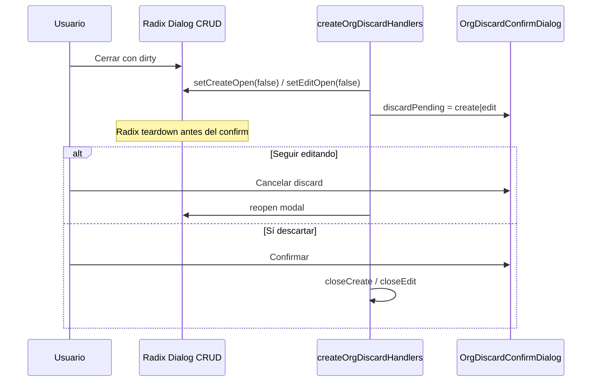
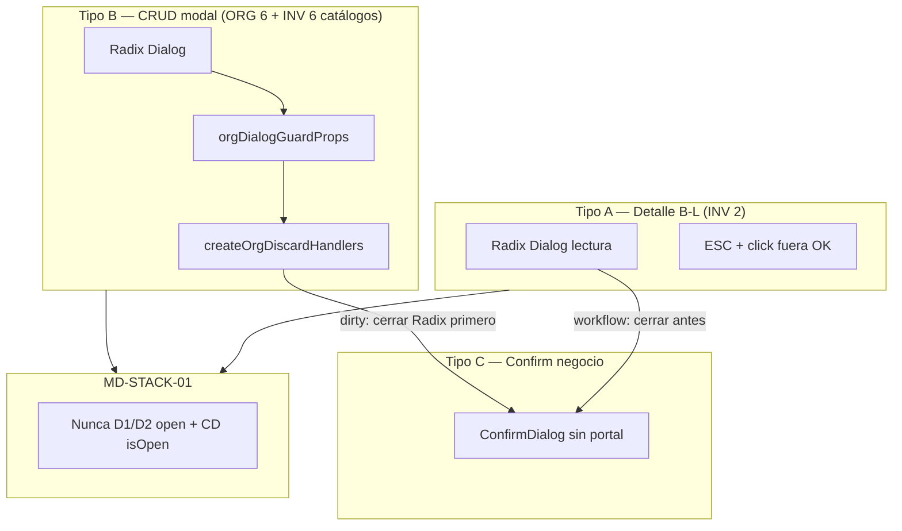

# ERP Frontend — Auditoría UX y Estándares de Modales (ORG + INV)

**Fecha:** 10 junio 2026  
**Estado:** Solo auditoría — sin implementación, sin commit  
**Alcance:** Módulos **ORG** e **INV** operativos en frontend  
**Referencias:** `ERP_FRONTEND_STANDARDS_V2.md` §6–§7, `INV_MODAL_STACKING_AUDIT.md`, `SPRINT_D_B11_OVERLAY_FIX_AUDIT.md`, `INV_M2_SEC_AUDIT.md`

---

## 1. Resumen ejecutivo

| Dimensión | ORG | INV | Veredicto transversal |
|-----------|-----|-----|------------------------|
| Modales CRUD (Plantilla A/A+) | **6/6** con B.1.1 completo | **6/6** catálogos con B.1.1 (reutiliza util ORG) | **Consistente** en formularios modal |
| Modales detalle B-L | N/A | **2** pantallas transaccionales | Comportamiento Tipo A correcto; stacking workflow **corregido** recientemente |
| Formularios B-F | N/A | **2** con `useInvTransactionalFormGuard` | **Correcto** (discard página) |
| Consulta B-R | N/A | Stock, Kardex — sin modales | N/A |
| `ConfirmDialog` workflow | Solo desactivar | Desactivar + workflow + reactivar | **Inconsistente** semántica visual y reactivar ORG vs INV |
| Modal stacking Radix + Confirm | **Mitigado** en CRUD vía `createOrgDiscardHandlers` | **Mitigado** en catálogos; **corregido** en B-L workflow | Riesgo residual en primitiva `ConfirmDialog` global |
| Click fuera / ESC | Bloqueado en CRUD (`orgDialogGuardProps`) | Igual en catálogos; **permitido** en detalle B-L | **Intencional** pero poco documentado |
| Reactivar | **Sin confirm** (mutación directa) | **Con** `ConfirmDialog` `variant="info"` | **Inconsistencia ORG ↔ INV** |

**Hallazgos totales:** 28 identificados  
**P0:** 0 abiertos (1 corregido en INV B-L)  
**P1:** 4  
**P2:** 14  
**P3:** 9  
**Mantener / correcto:** 12 grupos

---

## 2. Inventario de superficies auditadas

### 2.1 ORG

| Pantalla | Archivo | Plantilla V2 | Modales |
|----------|---------|--------------|---------|
| Empresas | `src/features/org/pages/EmpresaPage.tsx` | A | Create, Edit, Desactivar |
| Sucursales | `src/features/org/pages/SucursalesPage.tsx` | A | Create, Edit, Desactivar |
| Áreas (Departamentos) | `src/features/org/pages/DepartamentosPage.tsx` | A | Create, Edit, Desactivar |
| Cargos | `src/features/org/pages/CargosPage.tsx` | A | Create, Edit, Desactivar |
| Centros de costo | `src/features/org/pages/CentrosCostoPage.tsx` | A | Create, Edit, Desactivar |
| Parámetros | `src/features/org/pages/ParametrosPage.tsx` | A / H | Create, Edit, Desactivar |

> **Nota:** No existe pantalla separada “Áreas”; el dominio de áreas/departamentos es `DepartamentosPage`.

### 2.2 INV

| Pantalla | Archivo | Plantilla V2 | Modales / confirms |
|----------|---------|--------------|-------------------|
| Inventario Físico (lista) | `src/features/inv/pages/InventarioFisicoPage.tsx` | B-L | Detalle, Aprobar, Finalizar, Anular |
| Movimientos (lista) | `src/features/inv/pages/MovimientosPage.tsx` | B-L | Detalle, Autorizar, Procesar, Anular |
| Inventario Físico (form) | `src/features/inv/pages/InventarioFisicoFormPage.tsx` | B-F | Discard página (no Radix) |
| Movimiento (form) | `src/features/inv/pages/MovimientoFormPage.tsx` | B-F | Discard página |
| Almacenes | `src/features/inv/pages/AlmacenesPage.tsx` | A | Create, Edit, Desactivar, Reactivar |
| Categorías | `src/features/inv/pages/CategoriasPage.tsx` | A | Idem |
| Tipos de movimiento | `src/features/inv/pages/TiposMovimientoPage.tsx` | A | Idem |
| Unidades de medida | `src/features/inv/pages/UnidadesMedidaPage.tsx` | A | Idem |
| Productos | `src/features/inv/pages/ProductosPage.tsx` | A+ | Create/Edit grande, Desactivar, Reactivar |
| Stock | `src/features/inv/pages/StockPage.tsx` | B-R | Sin modales |
| Kardex | `src/features/inv/pages/KardexPage.tsx` | B-R | Sin modales |

**No se usa** `Sheet`, `Drawer` ni `AlertDialog` en ORG ni INV.

---

## 3. Matriz de comportamiento de modales

### 3.1 Leyenda política click fuera (Tipos A / B / C)

| Tipo | Contexto | Click fuera | ESC | Cancelar | X |
|------|----------|-------------|-----|----------|---|
| **A** | Solo lectura / detalle sin campos editables | **Permitido** | **Permitido** | N/A o opcional | Sí (Radix) |
| **B** | Formulario editable (CRUD modal) | **Bloqueado** → dirty guard | **Bloqueado** → dirty guard | Sí → dirty guard | Sí → dirty guard |
| **C** | Workflow crítico (`ConfirmDialog`) | **No cierra** (sin handler backdrop) | **No cierra** | Sí | Sí |

### 3.2 ORG — modales CRUD (Tipo B)

| Pantalla | Click fuera | ESC | Cancelar | X | Evidencia |
|----------|-------------|-----|----------|---|-----------|
| Empresas | Bloqueado | Bloqueado | Sí | Sí (Radix) | `{...orgDialogGuardProps}` en `DialogContent` |
| Sucursales | Bloqueado | Bloqueado | Sí | Sí | Idem |
| Departamentos | Bloqueado | Bloqueado | Sí | Sí | Idem |
| Cargos | Bloqueado | Bloqueado | Sí | Sí | Idem |
| Centros de costo | Bloqueado | Bloqueado | Sí | Sí | Idem |
| Parámetros | Bloqueado | Bloqueado | Sí | Sí | Idem |

**Implementación compartida:**

```9:12:src/features/org/utils/org-dialog-guard-props.ts
  onInteractOutside: (event) => event.preventDefault(),
  onPointerDownOutside: (event) => event.preventDefault(),
  onEscapeKeyDown: (event) => event.preventDefault(),
```

> **Matiz:** `orgDialogGuardProps` bloquea overlay/ESC **siempre**, no solo cuando dirty. El cierre pasa por `handleRequestClose*` que evalúa dirty. Comportamiento efectivo Tipo B: **consistente en las 6 pantallas ORG**.

### 3.3 INV — catálogos Plantilla A/A+ (Tipo B)

| Pantalla | Click fuera | ESC | Cancelar | X | Dirty B.1.1 |
|----------|-------------|-----|----------|---|-------------|
| Almacenes | Bloqueado | Bloqueado | Sí | Sí | **Correcto** |
| Categorías | Bloqueado | Bloqueado | Sí | Sí | **Correcto** |
| Tipos movimiento | Bloqueado | Bloqueado | Sí | Sí | **Correcto** |
| Unidades medida | Bloqueado | Bloqueado | Sí | Sí | **Correcto** |
| Productos (A+) | Bloqueado | Bloqueado | Sí | Sí | **Correcto** |

Patrón: `createOrgDiscardHandlers` + `OrgDiscardConfirmDialog` + `orgDialogGuardProps` + `discardPending !== null` deshabilita toolbar/acciones.

### 3.4 INV — listas transaccionales B-L (detalle Tipo A + workflow Tipo C)

| Pantalla | Modal detalle | Click fuera detalle | ESC detalle | Workflow confirms |
|----------|---------------|---------------------|-------------|-------------------|
| Inventario Físico | Radix `Dialog` lectura | **Permitido** (default Radix) | **Permitido** | Aprobar, Finalizar, Anular |
| Movimientos | Radix `Dialog` lectura | **Permitido** | **Permitido** | Autorizar, Procesar, Anular |

**Evidencia detalle sin guard:**

```331:337:src/features/inv/pages/InventarioFisicoPage.tsx
      <Dialog
        open={detailDialogOpen}
        onOpenChange={(open) => {
          if (!open && !workflowConfirmOpen) setDetailOpen(false);
        }}
      >
        <DialogContent className="max-w-3xl max-h-[90vh] overflow-y-auto">
```

Sin `{...orgDialogGuardProps}` — alineado con V2 **SEC-08** (detalle solo lectura).

**`ConfirmDialog` workflow (Tipo C):** backdrop sin `onClick`; solo **Cancelar** y **X** cierran. No hay handler ESC global.

### 3.5 INV — formularios B-F (página completa)

| Pantalla | Modal Radix | Discard |
|----------|-------------|---------|
| MovimientoFormPage | No | `useInvTransactionalFormGuard` + `OrgDiscardConfirmDialog` |
| InventarioFisicoFormPage | No | Idem |

Cancelar/Volver interceptan salida si dirty; `useBlocker` en navegación.

### 3.6 `ConfirmDialog` compartido (ORG + INV)

| Comportamiento | Estado |
|----------------|--------|
| Click fuera (backdrop) | **No cierra** — overlay es contenedor flex sin handler |
| ESC | **No manejado** |
| Botón Cancelar | Sí |
| Botón X | Sí |
| Portal | **No** — render inline |
| Focus trap | **No** |
| z-index | `z-50` (mismo que Radix) |
| Scroll lock body | **No gestiona** |

**Riesgo IAM histórico:** stacking Radix abierto + `ConfirmDialog` → overlay negro / body lock. **Mitigado** en ORG/INV catálogos y B-L post-fix.

---

## 4. Dirty state

### 4.1 Clasificación por pantalla

| Módulo | Pantalla | Detección dirty | Confirm discard | Seguir editando | Clasificación |
|--------|----------|-----------------|-----------------|-----------------|---------------|
| **ORG** | 6× CRUD | `form-dirty/*` + snapshot edit | `OrgDiscardConfirmDialog` `variant="warning"` | Sí | **Correcto** |
| **INV** | 6× catálogos | `form-dirty/*` INV | Reutiliza ORG discard | Sí | **Correcto** |
| **INV** | MovimientoFormPage | `movimiento-form-dirty` | Página + blocker | Sí | **Correcto** |
| **INV** | InventarioFisicoFormPage | `inventario-fisico-form-dirty` | Página + blocker | Sí | **Correcto** |
| **INV** | InventarioFisicoPage detalle | N/A (lectura) | N/A | N/A | **Correcto** (SEC-08) |
| **INV** | MovimientosPage detalle | N/A | N/A | N/A | **Correcto** |
| **INV** | IF → confirm Aprobar | Campos en confirm hijo | Reset al cancelar **sin** confirm dirty | N/A | **Faltante** (backlog SEC-10) |
| **INV** | Mov → confirm Anular | Textarea motivo | Reset al cancelar **sin** confirm dirty | N/A | **Faltante** (backlog R-06) |

### 4.2 Flujo discard CRUD (ORG + INV catálogos) — referencia correcta



**Evidencia cierre Radix primero:**

```31:37:src/features/org/utils/org-discard-handlers.ts
    if (isCreateDirty) {
      setCreateOpen(false);
      setDiscardPending('create');
      scheduleModalStackValidation(`${contextPrefix}-create-request-close-dirty`);
```

### 4.3 Hallazgos dirty

| ID | Módulo | Hallazgo | Severidad |
|----|--------|----------|-----------|
| **D-ORG-01** | ORG | 6/6 CRUD implementan B.1.1 según V2 §7.1 | **Mantener** |
| **D-INV-01** | INV | 6/6 catálogos paridad ORG vía utils compartidos | **Mantener** |
| **D-INV-02** | INV | B-F con guard transaccional completo | **Mantener** |
| **D-INV-03** | INV | Confirm Aprobar IF pierde tipo/obs al cancelar sin aviso | **P2** |
| **D-INV-04** | INV | Confirm Anular movimiento pierde motivo al cancelar | **P2** |
| **D-INV-05** | INV | `createInvPageDiscardHandlers` **no** llama `scheduleModalStackValidation` (a diferencia de ORG) | **P3** |

---

## 5. Modal stacking

### 5.1 Patrones encontrados

| Patrón | ORG | INV | Estado |
|--------|-----|-----|--------|
| Radix CRUD + `OrgDiscardConfirmDialog` | 6 pantallas | 6 catálogos | **Correcto** — Radix cierra antes |
| Radix CRUD + `ConfirmDialog` baja/reactivar | Desactivar con `discardPending === null` guard | Idem + reactivar `variant="info"` | **Correcto** — sin Dialog abierto |
| Radix detalle B-L + `ConfirmDialog` workflow | N/A | IF + Movimientos | **Corregido** — `detailDialogOpen = detailOpen && !workflowConfirmOpen` |
| Dialog + Dialog | No encontrado | No encontrado | — |
| Dialog + Sheet | No encontrado | No encontrado | — |
| `ConfirmDialog` + `ConfirmDialog` | No encontrado | No encontrado | — |

### 5.2 Caso histórico P0 (INV B-L) — cerrado

**Síntoma:** pantalla negra al Aprobar/Autorizar; confirm visible solo tras click en overlay.

**Causa:** Radix detalle `open=true` + `ConfirmDialog` `z-50` sin portal → overlay Radix encima del confirm.

**Fix aplicado:** `INV_MODAL_STACKING_FIX_REPORT.md` — cerrar detalle antes de abrir confirm + defensa `detailDialogOpen`.

```162:163:src/features/inv/pages/InventarioFisicoPage.tsx
  const workflowConfirmOpen = aprobarOpen || anularOpen || finalizarOpen;
  const detailDialogOpen = detailOpen && !workflowConfirmOpen;
```

### 5.3 Hallazgos stacking

| ID | Módulo | Hallazgo | Severidad |
|----|--------|----------|-----------|
| **S-ORG-01** | ORG | CRUD usa patrón B.1.1 IAM; `scheduleModalStackValidation` en `org-discard-handlers` | **Mantener** |
| **S-INV-01** | INV | Catálogos heredan mismo patrón ORG | **Mantener** |
| **S-INV-02** | INV | B-L workflow stacking | **Corregido** (era **P0**) |
| **S-PLAT-01** | ORG+INV | `ConfirmDialog` sin portal comparte `z-50` con Radix — riesgo si se viola regla “cerrar Radix primero” | **P1** |
| **S-PLAT-02** | ORG+INV | `ConfirmDialog` no participa en focus trap / body lock de Radix | **P2** |
| **S-INV-03** | INV | B-F discard sin instrumentación `scheduleModalStackValidation` | **P3** |

---

## 6. Confirmaciones de workflow

### 6.1 Matriz de acciones

| Acción | ORG | INV | Confirm | Variant confirm | Botón detalle |
|--------|-----|-----|---------|-----------------|---------------|
| Desactivar | 6 pantallas | 6 catálogos | Sí | `danger` | ghost/error en fila |
| Reactivar | 6 pantallas | 6 catálogos | **ORG: No** / **INV: Sí** | INV: `info` | `text-success` |
| Aprobar | — | IF | Sí (+ form hijo) | `danger` | `outline` |
| Autorizar | — | Movimientos | Sí | `danger` | `outline` |
| Procesar | — | Movimientos | Sí | `danger` | `outline` |
| Finalizar | — | IF | Sí | `danger` | `outline` |
| Anular | — | IF, Movimientos | Sí; Mov tiene motivo opcional | `danger` | `destructive` |

### 6.2 Mensajes

| Criterio | Estado |
|----------|--------|
| Incluye nombre/código del registro | **Sí** en todos los confirms auditados |
| Vocabulario “Desactivar” (no Eliminar) | **Sí** ORG + INV catálogos |
| Mensaje irreversible en anular IF | Menciona “suele ser irreversible” |
| UUID en mensajes | **No** detectado |

### 6.3 Hallazgos workflow

| ID | Módulo | Hallazgo | Severidad |
|----|--------|----------|-----------|
| **W-ORG-01** | ORG | Reactivar ejecuta mutación **directa** sin `ConfirmDialog` | **P1** |
| **W-INV-01** | INV | Reactivar siempre con confirm `variant="info"` | **Correcto** (contrasta con ORG) |
| **W-INV-02** | INV | Aprobar/Autorizar/Procesar/Finalizar usan `variant="danger"` (rojo) | **P1** |
| **W-INV-03** | INV | Anular usa `destructive` en botón + `danger` en confirm — coherente para destructiva | **Mantener** |
| **W-INV-04** | INV | Aprobar IF: validación cliente (tipo movimiento) vía `toast.error` en `onConfirm` — aceptable | **Mantener** |
| **W-INV-05** | INV | Post-confirm éxito cierra confirm sin reabrir detalle | **Correcto** |
| **W-INV-06** | INV | Cancelar confirm workflow reabre detalle (post-fix stacking) | **Correcto** |

**Evidencia variant danger en acción positiva:**

```475:476:src/features/inv/pages/InventarioFisicoPage.tsx
        variant="danger"
        loading={aprobarMutation.isPending}
```

```529:530:src/features/inv/pages/MovimientosPage.tsx
        variant="danger"
        loading={autorizarMutation.isPending}
```

**Evidencia reactivar ORG sin confirm:**

```282:284:src/features/org/pages/EmpresaPage.tsx
  const handleReactivar = async (empresa: Empresa) => {
    try {
      await reactivarEmpresa.mutateAsync({ empresaId: empresa.empresa_id });
```

---

## 7. Política de click fuera — recomendación ERP

### 7.1 Estándar propuesto por tipo

| Tipo | Cuándo | Click fuera | ESC | Implementación |
|------|--------|-------------|-----|--------------|
| **A** | Detalle solo lectura, consultas B-R con modal | Permitir | Permitir | Radix default; **sin** `orgDialogGuardProps` |
| **B** | CRUD modal multi-campo | Bloquear directo; evaluar dirty en handler | Igual | `orgDialogGuardProps` + `createOrgDiscardHandlers` |
| **C** | Confirm negocio / workflow | No cerrar por backdrop | No cerrar por ESC | `ConfirmDialog`; cierre solo Cancelar/X; **nunca** con Radix abierto debajo |

### 7.2 Regla stacking (crítica)

> **MD-STACK-01:** Nunca tener `Dialog` Radix `open={true}` y `ConfirmDialog` `isOpen={true}` simultáneamente. Cerrar Radix **antes** de abrir confirm (patrón B.1.1).

Aplica a: discard dirty, workflow B-L, y cualquier confirm de negocio.

---

## 8. Colores y semántica visual

### 8.1 Uso actual

| Elemento | ORG | INV catálogos | INV B-L workflow |
|----------|-----|---------------|------------------|
| Submit crear/editar | `bg-brand-primary` | Idem | N/A en detalle |
| Desactivar confirm | `variant="danger"` | `variant="danger"` | N/A |
| Reactivar confirm | N/A (sin confirm) | `variant="info"` | N/A |
| Aprobar/Autorizar/Procesar confirm | — | — | `variant="danger"` (**semántica incorrecta**) |
| Anular botón detalle | — | — | `variant="destructive"` |
| Anular confirm | — | — | `variant="danger"` (**correcto**) |
| Icono reactivar fila | `text-success` | `text-success` | — |

### 8.2 Estándar ERP propuesto

| Intención | Variant `ConfirmDialog` | Botón primario confirm | Icono |
|-----------|-------------------------|------------------------|-------|
| Descartar cambios (dirty) | `warning` | Amarillo/warning | AlertTriangle |
| Desactivar / Anular / irreversible | `danger` | Rojo/error | AlertTriangle |
| Reactivar / restaurar | `info` | Azul/info | AlertTriangle* |
| Aprobar / Autorizar / Procesar / Finalizar | **`warning`** o **`confirm`** nuevo | `bg-brand-primary` o `bg-warning` | CheckCircle o AlertTriangle warning |
| Informativo sin riesgo | `info` | info | Info |

\* **Hallazgo P3:** `ConfirmDialog` usa `AlertTriangle` para todas las variantes, incluso `info`.

| ID | Módulo | Hallazgo | Severidad |
|----|--------|----------|-----------|
| **V-INV-01** | INV | Acciones positivas de workflow con rojo `danger` | **P1** |
| **V-ORG-01** | ORG | Reactivar visualmente verde pero sin confirm — doble inconsistencia | **P1** |
| **V-PLAT-01** | ORG+INV | `ConfirmDialog` no tiene variant `success` / `confirm` | **P2** |
| **V-PLAT-02** | ORG+INV | Mismo icono `AlertTriangle` para warning, danger e info | **P3** |

---

## 9. Overlay y focus management

### 9.1 Comparativa primitivas

| Primitiva | Portal | Overlay | z-index | Focus trap | Body scroll lock | ESC | Click fuera |
|-----------|--------|---------|---------|------------|------------------|-----|-------------|
| Radix `Dialog` | Sí | `bg-black/80` | 50 | Sí | Sí | Configurable | Configurable |
| `ConfirmDialog` | **No** | `bg-black/50` | 50 | **No** | **No** | **No** | **No** |
| Radix `AlertDialog` | — | — | — | **No usado en ORG/INV** | — | — | — |

### 9.2 Riesgos tipo IAM

| Riesgo | Presente en ORG/INV hoy | Mitigación actual |
|--------|-------------------------|-------------------|
| Overlay Radix huérfano | Bajo en CRUD | `createOrgDiscardHandlers` cierra Radix primero |
| `body overflow:hidden` persistente | Bajo post-patrones | Discard/stacking correcto |
| Focus fuera de trap con confirm custom | Medio en `ConfirmDialog` | Un solo overlay cuando se sigue MD-STACK-01 |
| Doble overlay mismo z-index | **Mitigado** en B-L post-fix | `detailDialogOpen` |

### 9.3 Hallazgos focus/overlay

| ID | Módulo | Hallazgo | Severidad |
|----|--------|----------|-----------|
| **F-PLAT-01** | ORG+INV | `ConfirmDialog` sin focus trap ni restore foco | **P2** |
| **F-PLAT-02** | ORG+INV | `ConfirmDialog` sin portal — orden DOM dependiente | **P2** |
| **F-ORG-01** | ORG | `scheduleModalStackValidation` solo vía `org-discard-handlers` | **Mantener** |
| **F-INV-01** | INV | B-L post-fix: 0 overlays Radix durante workflow confirm (esperado) | **Mantener** |

---

## 10. Consistencia ORG ↔ INV

| Tema | ORG | INV | Gap |
|------|-----|-----|-----|
| B.1.1 CRUD modal | Nativo ORG | Reutiliza utils ORG | **Ninguno** |
| Layout modal largo | `DialogBody` + flex `max-h-[90vh]` | Catálogos: `max-w-lg` simple; Productos: scroll en `DialogContent` | **P2** — INV catálogos sin patrón flex ORG |
| Reactivar | Sin confirm | Con confirm `info` | **P1** |
| Desactivar | Con confirm `danger` | Con confirm `danger` | **Ninguno** |
| Detalle B-L | N/A | Click fuera permitido | N/A |
| Workflow semántica | N/A | Positivas en rojo | **P1** |
| Instrumentación DEV stack | Sí en discard ORG | Parcial (INV B-F sin schedule) | **P3** |
| Vocabulario baja | Desactivar | Desactivar | **Ninguno** |

---

## 11. Hallazgos consolidados por severidad

### P0 — Bloqueante operativo

| ID | Módulo | Descripción | Estado |
|----|--------|-------------|--------|
| ~~**S-INV-02**~~ | INV | Stacking Radix detalle + ConfirmDialog workflow | **Corregido** |

### P1 — Inconsistencia significativa / confusión UX

| ID | Módulo | Descripción |
|----|--------|-------------|
| **W-ORG-01** | ORG | Reactivar sin confirm en 6 pantallas |
| **W-INV-02** | INV | Workflow positivo (Aprobar, Autorizar, Procesar, Finalizar) con `variant="danger"` |
| **V-ORG-01** | ORG | Reactivar verde en UI pero sin barrera de confirmación |
| **S-PLAT-01** | ORG+INV | Dependencia de disciplina “cerrar Radix primero”; primitiva `ConfirmDialog` no defensiva |

### P2 — Deuda UX / riesgo medio

| ID | Módulo | Descripción |
|----|--------|-------------|
| **D-INV-03** | INV | Dirty faltante en confirm Aprobar IF |
| **D-INV-04** | INV | Dirty faltante en motivo anular movimiento |
| **F-PLAT-01** | ORG+INV | `ConfirmDialog` sin focus trap |
| **F-PLAT-02** | ORG+INV | `ConfirmDialog` sin portal |
| **V-PLAT-01** | ORG+INV | Falta variant semántica “confirmación positiva” |
| **UX-INV-01** | INV | Catálogos sin `DialogBody` flex de ORG — scroll en modales largos inferior |
| **UX-ORG-01** | ORG | `orgDialogGuardProps` bloquea ESC/overlay incluso sin dirty (cierre siempre vía handler) — correcto pero no documentado en UI |

### P3 — Mejora / backlog

| ID | Módulo | Descripción |
|----|--------|-------------|
| **D-INV-05** | INV | Sin `scheduleModalStackValidation` en B-F discard |
| **S-INV-03** | INV | Idem |
| **V-PLAT-02** | ORG+INV | Icono único AlertTriangle en todos los variants |
| **DOC-01** | ORG+INV | V2 §7.3 no documenta MD-STACK-01 explícitamente para B-L |

---

## 12. Estándares ERP propuestos (candidatos V2)

### §MD — Modales y confirms (nuevo capítulo sugerido)

| ID | Regla propuesta |
|----|-----------------|
| **MD-01** | MUST clasificar cada superficie modal en Tipo A, B o C antes de implementar |
| **MD-02** | MUST Tipo B: `orgDialogGuardProps` + B.1.1 completo |
| **MD-03** | MUST Tipo A: Radix default; MUST NOT `orgDialogGuardProps` |
| **MD-04** | MUST Tipo C: `ConfirmDialog` a nivel página; cierre solo Cancelar/X |
| **MD-STACK-01** | MUST NOT Radix `open` + `ConfirmDialog` `isOpen` simultáneos |
| **MD-STACK-02** | MUST B-L workflow: `setDetailOpen(false)` antes de abrir confirm |
| **MD-STACK-03** | MUST defensa: `open={detailOpen && !workflowConfirmOpen}` |
| **MD-SEM-01** | MUST NOT `variant="danger"` en Aprobar, Autorizar, Procesar, Finalizar |
| **MD-SEM-02** | MUST `variant="danger"` en Desactivar, Anular irreversible |
| **MD-SEM-03** | MUST `variant="info"` en Reactivar con confirm obligatorio |
| **MD-SEM-04** | MUST `variant="warning"` en discard dirty |
| **MD-REACT-01** | MUST `ConfirmDialog` antes de toda reactivación (paridad INV) |
| **MD-FOCUS-01** | SHOULD focus trap en confirms de workflow — backlog primitiva |

---

## 13. Reglas candidatas para `.cursorrules`

```markdown
## MODALES ERP (ORG / INV)

- Tipo A (solo lectura): detalle B-L, consultas — permitir ESC y click fuera; sin B.1.1.
- Tipo B (CRUD modal): SIEMPRE orgDialogGuardProps + createOrgDiscardHandlers + OrgDiscardConfirmDialog.
- Tipo C (workflow / baja): ConfirmDialog a nivel página; NUNCA con Radix abierto debajo.
- Al abrir ConfirmDialog desde un Dialog: cerrar Radix PRIMERO (patrón B.1.1 IAM).
- variant="danger" SOLO para desactivar/anular destructivo — NO para aprobar/autorizar/procesar/finalizar.
- Reactivar: SIEMPRE ConfirmDialog variant="info" — no mutación directa.
- NO modificar ConfirmDialog global sin auditoría blast-radius ORG+INV+IAM.
- Reutilizar: orgDialogGuardProps, createOrgDiscardHandlers, OrgDiscardConfirmDialog.
```

---

## 14. Reglas candidatas para `PROMPT_FRONTEND_MAESTRO.md`

```markdown
### Checklist modales (todo módulo Plantilla A / B-L)

1. Clasificar modal: Tipo A | B | C
2. Si B: copiar stack ORG (DepartamentosPage) — form-dirty, discardPending, orgDialogGuardProps
3. Si C workflow desde detalle B-L: cerrar detalle antes del confirm + workflowConfirmOpen guard
4. Confirm negocio: variant según MD-SEM-*; mensaje con nombre legible, nunca UUID
5. Desactivar y reactivar: dos ConfirmDialog independientes de discardPending (B11-02)
6. QA: 0 overlays Radix con confirm abierto; dirty cancel/restaurar; empresa change cierra modals
7. NO usar Sheet/Drawer sin estándar previo — hoy ORG/INV usan solo Dialog + ConfirmDialog
```

---

## 15. Quick wins (sin refactor arquitectónico)

| # | Acción | Módulo | Esfuerzo | Impacto |
|---|--------|--------|----------|---------|
| QW-01 | Añadir `ConfirmDialog` reactivar (`variant="info"`) en 6 pantallas ORG | ORG | Medio | Alto — paridad INV + reduce clics accidentales |
| QW-02 | Cambiar `variant` workflow positivo de `danger` a `warning` o `confirmButtonClassName` brand | INV | Bajo | Alto — semántica visual |
| QW-03 | Documentar MD-STACK-01 en V2 §6.3 / §7.3 | Docs | Bajo | Alto — previene regresiones |
| QW-04 | Alinear INV catálogos a layout `DialogBody` flex ORG en modales con scroll | INV | Medio | Medio |
| QW-05 | Dirty al cancelar confirm Aprobar IF y Anular mov (SEC-10 backlog) | INV | Bajo | Medio |
| QW-06 | Checklist QA DevTools overlay en PRs que toquen modales | ORG+INV | Bajo | Medio |

---

## 16. Riesgos de regresión (plan futuro)

| Cambio propuesto | Riesgo | Mitigación |
|------------------|--------|------------|
| ORG reactivar con confirm | Fricción extra para admins | `variant="info"`; mensaje corto |
| Cambiar variant workflow INV | Usuarios asocian rojo = “acción importante” | Comunicar en release; usar warning + icono distinto |
| Modificar `ConfirmDialog` (portal, focus) | Blast radius IAM, Platform, ORG, INV | Piloto en INV B-L; no cambio global silencioso |
| `orgDialogGuardProps` en detalle B-L | Rompería cierre rápido Tipo A | **No aplicar** |
| Extraer `useErpTransactionalFormGuard` | Renombres en INV B-F | V2 EXT-02 ya previsto |

---

## 17. Plan de estandarización futura

### Fase 0 — Documentación (sin código)
1. Incorporar §MD en `ERP_FRONTEND_STANDARDS_V2.md`
2. Actualizar `.cursorrules` y `PROMPT_FRONTEND_MAESTRO.md` con reglas MD-*
3. Referenciar `INV_MODAL_STACKING_AUDIT.md` como caso de estudio B-L

### Fase 1 — Quick wins UX (bajo riesgo)
1. QW-02 variant semántica workflow INV
2. QW-01 reactivar ORG con confirm
3. QW-05 dirty en confirms con campos (INV)

### Fase 2 — Paridad layout
1. QW-04 `DialogBody` en INV catálogos largos
2. Revisar ProductosPage A+ vs EmpresaPage ORG

### Fase 3 — Primitiva compartida (evaluar)
1. Estudio `ConfirmDialog` → portal + focus trap + variant `confirm`
2. O migrar confirms críticos a Radix `AlertDialog` como hermano coordinado
3. **No iniciar** sin auditoría Platform + IAM

### Fase 4 — Gates QA
1. Matriz QA modal en CI manual por módulo (9 casos M3 + 6 workflow B-L)
2. `scheduleModalStackValidation` opcional en INV B-F

---

## 18. Diagrama arquitectura modal ORG/INV



---

## 19. Veredicto

| Pregunta | Respuesta |
|----------|-----------|
| ¿ORG e INV son consistentes en CRUD modal? | **Sí** — INV reutiliza stack ORG correctamente |
| ¿Principal gap ORG vs INV? | **Reactivar** (ORG sin confirm; INV con confirm) |
| ¿Principal gap INV interno? | **Semántica roja** en acciones positivas de workflow |
| ¿Stacking B-L resuelto? | **Sí** — fix reciente en IF y Movimientos |
| ¿Listo para estandarizar en V2? | **Sí** — propuestas §12–§14 listas para revisión |
| ¿Implementar ahora? | **No** — solo auditoría según solicitud |

---

*Documento generado para decisión de estandarización ERP. Sin código. Sin commit.*
