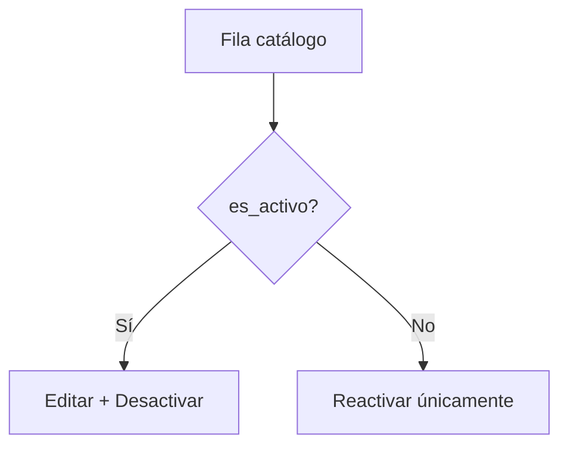

# ERP — Auditoría consistencia acciones de fila (ORG vs INV)

**Fecha:** 10 junio 2026  
**Estado:** Solo auditoría — sin implementación  
**Origen:** QA manual post-P1 — inconsistencia acciones en registros inactivos  
**Referencias:** `ERP_MODAL_AND_WORKFLOW_UX_AUDIT.md`, `ERP_FRONTEND_STANDARDS_V2.md` §8.4 UX-01, §8.6 UX-04, §5 Plantilla A

---

## 1. Resumen ejecutivo

| Hallazgo | ORG (6 pantallas) | INV (6 catálogos) |
|----------|-------------------|-------------------|
| Registro **activo** | Editar + Desactivar (+ Reactivar oculto) | Editar + Desactivar |
| Registro **inactivo** | **Editar + Reactivar + Desactivar** | **Reactivar únicamente** |
| Patrón de código | Acciones **aditivas** (sin rama `es_activo`) | Acciones **mutuamente excluyentes** por `row.es_activo` |
| Alineación V2 UX-04 | **Desalineado** | **Alineado** |

**Veredicto:** INV implementa el comportamiento ERP correcto para catálogos Plantilla A. Las 6 pantallas ORG auditadas comparten el mismo defecto estructural: **no condicionan Editar ni Desactivar a `row.es_activo === true`**.

**Severidad:** **P1** — inconsistencia UX entre módulos referencia, acción sin sentido en inactivos, posible confusión operativa y desalineación con V2 UX-04.

---

## 2. Comportamiento esperado (QA INV — referencia)

| Estado registro | Acciones visibles (con permiso) |
|-----------------|--------------------------------|
| **Activo** | Editar, Desactivar |
| **Inactivo** | Reactivar **únicamente** |

Este comportamiento cumple:

- Vocabulario baja lógica (UX-01): ciclo de vida solo vía Desactivar/Reactivar en tabla.
- UX-04: no gestionar `es_activo` en modal edit; transiciones en fila.
- RBAC visual (RB-01): no mostrar acción sin sentido de dominio.

---

## 3. Matriz por pantalla

### 3.1 ORG — comportamiento actual (defectuoso)

| Pantalla | Activo: Editar | Activo: Desactivar | Inactivo: Editar | Inactivo: Reactivar | Inactivo: Desactivar | Condición `es_activo` en acciones |
|----------|----------------|--------------------|------------------|---------------------|----------------------|----------------------------------|
| Empresas | Sí | Sí | **Sí** | Sí | **Sí** | Solo en Reactivar |
| Sucursales | Sí | Sí | **Sí** | Sí | **Sí** | Solo en Reactivar |
| Departamentos | Sí | Sí | **Sí** | Sí | **Sí** | Solo en Reactivar |
| Cargos | Sí | Sí | **Sí** | Sí | **Sí** | Solo en Reactivar |
| Centros de costo | Sí | Sí | **Sí** | Sí | **Sí** | Solo en Reactivar |
| Parámetros | Sí* | Sí* | **Sí*** | Sí* | **Sí*** | Solo en Reactivar |

\* Parámetros añade `rowCanMutate(row)` además de RBAC; **no** añade guard `es_activo` en Editar/Desactivar.

**Patrón ORG común (ej. Sucursales):**

```440:475:src/features/org/pages/SucursalesPage.tsx
                      {canEditar && (
                        <Button ... title="Editar">
                      )}
                      {canEditar && !row.es_activo && (
                        <Button ... title="Reactivar">
                      )}
                      {canEliminar && (
                        <Button ... title="Desactivar">
                      )}
```

Desactivar y Editar se renderizan **sin** `row.es_activo`.

### 3.2 INV — comportamiento actual (referencia correcta)

| Pantalla | Activo: Editar | Activo: Desactivar | Inactivo: Editar | Inactivo: Reactivar | Inactivo: Desactivar |
|----------|----------------|--------------------|------------------|---------------------|----------------------|
| Almacenes | Sí | Sí | No | Sí | No |
| Categorías | Sí | Sí | No | Sí | No |
| Tipos movimiento | Sí | Sí | No | Sí | No |
| Unidades medida | Sí | Sí | No | Sí | No |
| Productos | Sí | Sí | No | Sí | No |

**Patrón INV (ej. Almacenes):**

```381:421:src/features/inv/pages/AlmacenesPage.tsx
                      {row.es_activo ? (
                        <>
                          {canEditar && ( <Button ... title="Editar" /> )}
                          {canEliminar && ( <Button ... title="Desactivar" /> )}
                        </>
                      ) : (
                        canEditar && (
                          <Button ... title="Reactivar" />
                        )
                      )}
```

Rama única por estado: **mutuamente excluyente**.

### 3.3 Tabla comparativa ORG vs INV

| Dimensión | ORG | INV |
|-----------|-----|-----|
| Estructura JSX | 3 bloques independientes | 1 ternario `row.es_activo ? … : …` |
| Desactivar en inactivo | **Visible** (bug UX) | Oculto |
| Editar en inactivo | **Visible** | Oculto |
| Reactivar en activo | Oculto (`!row.es_activo`) | Oculto (rama else) |
| Permiso reactivar | `canEditar` | `canEditar` |
| Permiso desactivar | `canEliminar` | `canEliminar` |
| Confirm reactivar (post-P1) | Sí (`variant="info"`) | Sí |
| Homogeneidad interna módulo | 6/6 idénticas | 5/5 catálogos idénticos |

---

## 4. Análisis por observación del QA

### 4.1 «Un registro inactivo no debería mostrar Desactivar»

**Confirmado en código.** En las 6 pantallas ORG, `canEliminar && <Button title="Desactivar">` no evalúa `row.es_activo`.

**Impacto funcional probable:**

| Escenario | Comportamiento esperado dominio | UX actual ORG |
|-----------|--------------------------------|---------------|
| Click Desactivar en inactivo | Sin efecto o error API | Botón visible; usuario puede intentar desactivar de nuevo |
| Mensaje confirm | N/A | Mismo copy «¿Desactivar …?» — semánticamente incorrecto |

**Riesgo:** confusión, toasts de error evitables, percepción de bug.

### 4.2 «¿Editar debe permanecer en inactivos?»

| Opción | Argumento | Alineación V2 |
|--------|-----------|---------------|
| **A — Ocultar Editar en inactivos (recomendada)** | Ciclo de vida: reactivar primero, luego editar; paridad INV; UX-04 | **UX-04** explícito |
| **B — Mantener Editar en inactivos** | Permite corregir datos antes de reactivar sin cambiar estado | **Tensiona UX-04**; no hay precedente INV |

**Norma V2 aplicable:**

```635:636:ERP_FRONTEND_STANDARDS_V2.md
| **UX-03** | MUST NOT checkbox `es_activo` en create |
| **UX-04** | MUST NOT `es_activo` en edit modal; usar Desactivar/Reactivar en tabla |
```

UX-04 no prohíbe técnicamente **editar campos** de un inactivo, pero sí establece que **activación/desactivación** es exclusiva de acciones de tabla. INV interpreta esto de forma estricta: inactivo → solo Reactivar.

**Recomendación ERP:** Opción **A** — homologar ORG a INV; inactivo muestra **solo Reactivar**.

**Nota:** Los formularios edit ORG/INV no exponen checkbox `es_activo` en UI (cumplen UX-04 en modal), pero ORG permite abrir edit sobre inactivos, lo que habilita mutaciones PUT sobre registros fuera de operación normal.

### 4.3 Parámetros (caso especial hybrid)

`ParametrosPage` usa `rowCanMutate(row)` para filas globales vs override según permiso híbrido. El bug de `es_activo` es **el mismo**: Editar y Desactivar no están dentro de rama activa.

**Fix homologado debe preservar** `rowCanMutate(row)` dentro de cada rama:

```tsx
{row.es_activo ? (
  <>
    {canEditar && rowCanMutate(row) && <Editar />}
    {canEliminar && rowCanMutate(row) && <Desactivar />}
  </>
) : (
  canEditar && rowCanMutate(row) && <Reactivar />
)}
```

---

## 5. Causa raíz

| Factor | Descripción |
|--------|-------------|
| **Histórico ORG** | Acciones añadidas incrementalmente (Editar, luego Desactivar con confirm, luego Reactivar P1) sin refactor a patrón ternario |
| **INV M3** | Catálogos INV cerrados con patrón explícito `row.es_activo ?` desde implementación Plantilla A |
| **Ausencia en V2** | No existe regla explícita «RB-ROW-01: acciones mutuamente excluyentes por `es_activo`» — solo UX-04 indirecta |
| **Copy-paste ORG** | Las 6 pantallas comparten el mismo antipatrón — un fix es mecánico y repetible |

---

## 6. Estándar ERP propuesto (candidato — no en V2 aún)

### RB-ROW-01 — Acciones de fila en catálogos Plantilla A

| Estado | Acciones permitidas en UI | Permisos |
|--------|---------------------------|----------|
| `es_activo === true` | Editar, Desactivar | `editar`, `eliminar` |
| `es_activo === false` | Reactivar **solo** | `editar` (convención actual ORG/INV) |

**Reglas:**

1. **MUST** usar rama única `row.es_activo ? accionesActivas : accionesInactivas`.
2. **MUST NOT** renderizar Desactivar si `!row.es_activo`.
3. **MUST NOT** renderizar Editar si `!row.es_activo` (recomendado — paridad INV + UX-04).
4. **MUST NOT** renderizar Reactivar si `row.es_activo`.
5. Guards adicionales de dominio (ej. `rowCanMutate`) se aplican **dentro** de cada rama.

**Diagrama:**



---

## 7. Impacto de homologar ORG → INV

### 7.1 Alcance técnico

| Archivo | Cambio estimado |
|---------|-----------------|
| `src/features/org/pages/EmpresaPage.tsx` | Reemplazar bloque acciones por ternario `es_activo` |
| `src/features/org/pages/SucursalesPage.tsx` | Idem |
| `src/features/org/pages/DepartamentosPage.tsx` | Idem |
| `src/features/org/pages/CargosPage.tsx` | Idem |
| `src/features/org/pages/CentrosCostoPage.tsx` | Idem |
| `src/features/org/pages/ParametrosPage.tsx` | Idem + preservar `rowCanMutate` |

**Esfuerzo:** bajo (~10–20 líneas por archivo, sin cambios API/hooks/confirms).

### 7.2 Beneficios

- Paridad ORG ↔ INV como módulos referencia.
- Elimina Desactivar redundante en inactivos (hallazgo QA).
- Refuerza UX-04 y modelo mental «inactivo = solo restauración».
- Reduce errores API y toasts innecesarios.
- Plantilla copy-paste clara para futuros módulos ERP.

### 7.3 Riesgos y mitigaciones

| Riesgo | Severidad | Mitigación |
|--------|-----------|------------|
| Usuarios ORG editaban inactivos para corregir datos | Media | Flujo: Reactivar → Editar → Desactivar si aplica; o reactivar, editar, dejar activo |
| Backend permitía PUT en inactivo vía edit modal | Baja | API sigue permitiendo; solo se restringe entrada UI — alineado con INV |
| Regresión RBAC | Baja | Mismos `canEditar`/`canEliminar`; solo cambia visibilidad por estado |
| Parámetros hybrid | Baja | Mantener `rowCanMutate` en ambas ramas |
| Permiso `eliminar` usado solo en activos | Ninguno | Comportamiento deseado |

### 7.4 Qué NO cambia en homologación

- Confirms Desactivar / Reactivar (post-P1).
- Hooks de mutación.
- Formularios create/edit (sin checkbox `es_activo`).
- RBAC nombres (`eliminar` → UI «Desactivar»).
- Pantallas INV (ya correctas).

---

## 8. Fix mínimo recomendado (no implementar)

**Patrón a aplicar en cada página ORG** (pseudo-diff):

```tsx
// ANTES (ORG actual)
{canEditar && <Editar />}
{canEditar && !row.es_activo && <Reactivar />}
{canEliminar && <Desactivar />}

// DESPUÉS (paridad INV)
{row.es_activo ? (
  <>
    {canEditar && <Editar />}
    {canEliminar && <Desactivar />}
  </>
) : (
  canEditar && <Reactivar />
)}
```

**Parametros:** insertar `rowCanMutate(row)` en cada condición interna.

**Validación post-fix QA:**

| # | Caso | Esperado |
|---|------|----------|
| QA-1 | Fila activa + permisos | Editar + Desactivar; sin Reactivar |
| QA-2 | Fila inactiva + permisos | Solo Reactivar |
| QA-3 | Ver inactivos toggle | Acciones correctas en listado filtrado |
| QA-4 | `discardPending !== null` | Acciones deshabilitadas (sin regresión) |
| QA-5 | Parámetros fila global no mutable | Sin acciones (comportamiento actual preservado) |

---

## 9. Hallazgos clasificados

| ID | Módulo | Hallazgo | Severidad |
|----|--------|----------|-----------|
| **RA-ORG-01** | ORG 6× | Desactivar visible en registros inactivos | **P1** |
| **RA-ORG-02** | ORG 6× | Editar visible en registros inactivos | **P1** (recomendación alinear INV) |
| **RA-ORG-03** | ORG 6× | Patrón aditivo vs ternario INV | **P2** — deuda estructural |
| **RA-INV-01** | INV catálogos | Patrón correcto — referencia | **Mantener** |
| **RA-V2-01** | V2 | UX-04 no explicita matriz de acciones por estado | **P3** — proponer RB-ROW-01 |

---

## 10. Relación con auditorías previas

| Documento | Relación |
|-----------|----------|
| `ERP_MODAL_AND_WORKFLOW_UX_AUDIT.md` | P1 reactivar ORG corregido (confirm); **no** corrigió visibilidad acciones fila |
| `ERP_MODAL_STANDARDIZATION_P1_REPORT.md` | QA checklist no incluía matriz activo/inactivo en acciones |
| `ERP_V2_STANDARDS_PROPOSAL.md` | Candidato añadir **RB-ROW-01** en próxima revisión |

---

## 11. Veredicto

| Pregunta | Respuesta |
|----------|-----------|
| ¿QA detecta bug real? | **Sí** — ORG muestra Desactivar (y Editar) en inactivos; INV no |
| ¿Es consistente entre pantallas ORG? | **Sí** — las 6 comparten el mismo antipatrón |
| ¿Estándar ERP recomendado? | **Patrón INV** + candidato **RB-ROW-01** |
| ¿Editar en inactivos? | **No** — alinear con INV y UX-04 |
| ¿Implementar ahora? | **No** — solo auditoría según solicitud |
| ¿Prioridad fix? | **P1** — bajo esfuerzo, alto valor consistencia referencia |

---

*Auditoría generada tras QA manual. Sin código. Sin commit.*
