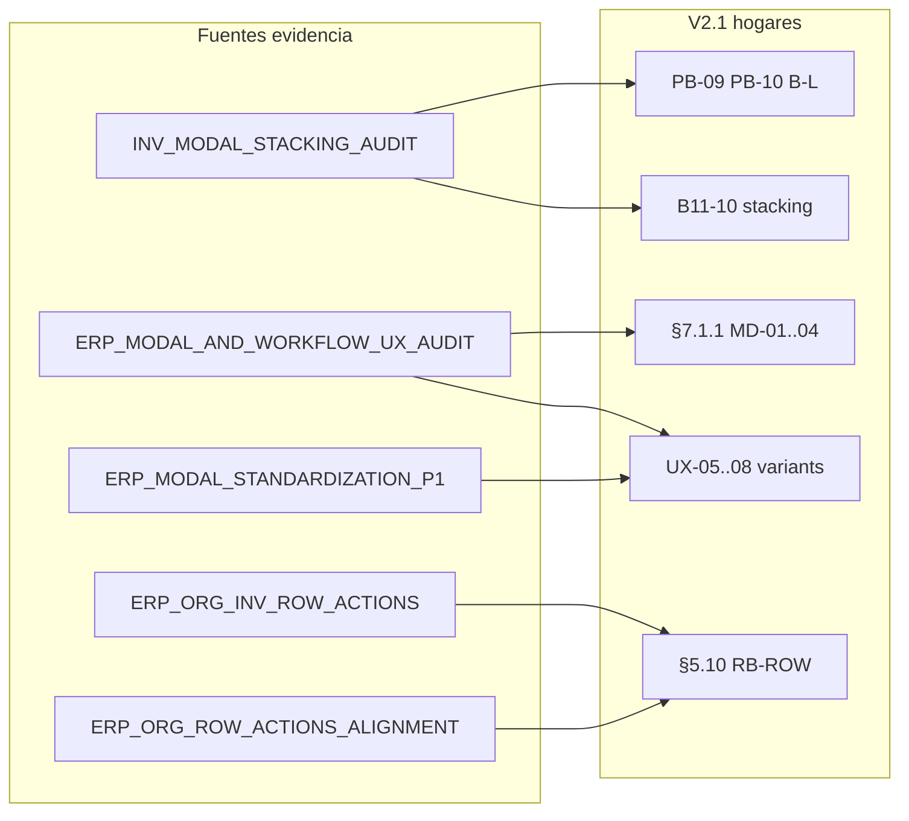

# ERP — Auditoría documental previa incorporación estándares ORG/INV

**Fecha:** 10 junio 2026  
**Estado:** Solo auditoría — **sin modificación** de archivos normativos  
**Alcance analizado:**

| Documento normativo | Rol |
|---------------------|-----|
| `ERP_FRONTEND_STANDARDS_V2.md` | Fuente normativa única (V2.0, 31 mayo 2026) |
| `.cursorrules` | Recordatorios operativos + diseño 2 capas |
| `docs/prompts/PROMPT_FRONTEND_MAESTRO.md` | Procedimiento bootstrap módulos (v3) |

**Fuentes de verdad (evidencia implementada):**

| Documento | Contenido relevante |
|-----------|---------------------|
| `ERP_MODAL_AND_WORKFLOW_UX_AUDIT.md` | Inventario modales ORG+INV; candidatos MD-01…MD-04, MD-STACK-*, MD-SEM-* |
| `ERP_ORG_INV_ROW_ACTIONS_CONSISTENCY_AUDIT.md` | Candidato RB-ROW-01; hallazgos RA-ORG-01/02 |
| `ERP_MODAL_STANDARDIZATION_P1_REPORT.md` | P1: reactivar ORG + variants workflow INV |
| `INV_MODAL_STACKING_AUDIT.md` | Caso de estudio stacking B-L; fix P0 |
| `ERP_ORG_ROW_ACTIONS_ALIGNMENT_REPORT.md` | Implementación RB-ROW; recomendación post-QA |
| `ERP_V2_STANDARDS_PROPOSAL.md` | Texto propuesto MD-* (no normativo) |

---

## 1. Resumen ejecutivo

Los estándares validados en ORG e INV (post-P0 stacking, post-P1 semántica confirms, post-alineación acciones fila) **no están formalizados** en la documentación maestra actual. V2 cubre **parcialmente** el mismo territorio mediante reglas dispersas (B11-02, PA-07, PB-08, UX-04, AP-06), pero **ninguna** de las ocho reglas auditadas existe como norma explícita equivalente.

| Regla | ¿Equivalente en V2? | Veredicto |
|-------|---------------------|-----------|
| MD-STACK-01 | Parcial (implícito en handlers) | **Gap normativo — incorporar** |
| MD-STACK-02 | No | **Nueva — incorporar** |
| MD-STACK-03 | No | **Nueva — incorporar** (SHOULD en V2; MUST en B-L nuevos) |
| RB-ROW-01 (+02, +03) | Parcial (UX-04 indirecta) | **Gap normativo — incorporar** |
| MD-SEM-01 | No | **Nueva — incorporar** |
| MD-SEM-02 | Parcial (UX-01 vocabulario) | **Formalizar variant** |
| MD-SEM-03 | Parcial (B11-02/PA-07) | **Extender con variant + obligatoriedad** |
| MD-SEM-04 | Parcial (B11-04 textos) | **Formalizar variant** |

**Recomendación final:** Incorporar en **una sola revisión V2.1** (no parches aislados), respetando el principio *write once* del documento. Orden sugerido: (1) V2 con IDs definitivos y mapa de inserción §5–§8; (2) `.cursorrules` con pointers cortos; (3) `PROMPT_FRONTEND_MAESTRO.md` con checklist Fase 2/3.5. **No tocar** diseño 2 capas, ME-*, CD-*, API-01, ni reabrir §9 cierres.

**Bloqueante previo a merge normativo:** Completar QA manual pendiente en `ERP_ORG_ROW_ACTIONS_ALIGNMENT_REPORT.md` §5 y `ERP_MODAL_STANDARDIZATION_P1_REPORT.md` §5.

---

## 2. Inventario de reglas existentes relacionadas

### 2.1 `ERP_FRONTEND_STANDARDS_V2.md`

| ID existente | Sección | Relación con candidatos | Cobertura |
|--------------|---------|-------------------------|-----------|
| **B11-02** | §7.1 | Confirm baja/reactivar **independiente** de `discardPending` | Parcial → MD-SEM-03 (guard), no exige confirm antes de mutar reactivar |
| **B11-03** | §7.1 | Deshabilitar acciones fila si `discardPending !== null` | Complementa RB-ROW; no define matriz por `es_activo` |
| **B11-04** | §7.1 | Textos discard «Seguir editando» / «Sí, descartar» | Parcial → MD-SEM-04 (copy, no `variant`) |
| **PA-07** | §5.6 | `ConfirmDialog` desactivar/reactivar independiente de discard | Parcial → MD-SEM-03 |
| **PA-08** | §5.6 | RBAC: no renderizar botón sin permiso | Complementa RB-ROW-01 |
| **TB-05** | §5.2 | Deshabilitar acciones fila con `discardPending` | Complementa RB-ROW |
| **PB-08** | §6.3 | Confirm workflow sin mezclar B.1.1 dirty | **No** cubre stacking Radix+Confirm |
| **SEC-08** | §7.3 | Detalle B-L solo lectura: sin B.1.1 | Relacionado Tipo A modales; no MD-STACK |
| **SEC-09** | §7.3 | Confirms workflow one-shot sin B.1.1 dirty | Ortogonal a MD-STACK |
| **AP-06** | §3.2 | No mezclar confirm baja con `discardPending` | Parcial → independencia, no stacking simultáneo |
| **UX-01** | §8.4 | Vocabulario Desactivar/Reactivar | Parcial → MD-SEM-02 (texto, no variant) |
| **UX-03** | §8.6 | No checkbox `es_activo` en create | Complementa RB-ROW |
| **UX-04** | §8.6 | No `es_activo` en edit; baja vía tabla | **Indirecta** → RB-ROW-01 (no matriz acciones fila) |
| **RB-01** | §8.3 | Permisos antes de renderizar acción | Complementa RB-ROW |
| **RB-02** | §8.3 | No `disabled` como sustituto de ocultar destructivas | Complementa RB-ROW |
| **§7.1 piezas técnicas** | §7.1 | `createOrgDiscardHandlers`, `scheduleModalStackValidation` | **Implementación** de MD-STACK-01 en CRUD; no norma explícita |
| **§10** | §10 | `OrgDiscardConfirmDialog`, `ConfirmDialog`, handlers | Mapa rutas; sin semántica `variant` |

**Ausente en V2:** tabla acción → `variant` ConfirmDialog; regla stacking Radix+Confirm; matriz acciones fila por `es_activo`; clasificación Tipo A/B/C modales (candidatos MD-01…04 del audit modal).

### 2.2 `.cursorrules`

| Bloque | Contenido relacionado | Gap |
|--------|----------------------|-----|
| Plantilla A § | B.1.1, vocabulario baja, skeleton/empty | Sin RB-ROW; sin variants |
| Plantilla B § | B-F, B-L toolbar | Sin MD-STACK |
| Feedback § | «ConfirmDialog antes de desactivar, anular, **aprobar**» | **Ambiguo** post-P1: no distingue `warning` vs `danger` |
| Modales § | B11-02 discard independiente | Sin stacking ni semántica variant |
| Diseño 2 capas | Tokens + brand | **Fuera de alcance** — no mezclar con MD-* |

### 2.3 `PROMPT_FRONTEND_MAESTRO.md`

| Fase | Contenido relacionado | Gap |
|------|----------------------|-----|
| Reglas absolutas | UX-01, RB-01, B.1.1, ConfirmDialog genérico | Sin MD-* ni RB-ROW |
| Fase 2 — Plantilla A | Toolbar, modales, Gate 2 | Sin checklist acciones fila activo/inactivo |
| Fase 2 — Plantilla B-L | PB-04…08, confirm workflow | Sin procedimiento stacking |
| Fase 2 — Normas transversales | Pointer `V2 §8.2–§8.4` | No menciona §8.6 UX-04 matriz fila |
| Fase 3.5 Gates | Gate 2/3/4 por plantilla | Sin ítems MD-STACK / RB-ROW |

---

## 3. Análisis de equivalencia por regla candidata

### 3.1 MD-STACK-01 — No abrir Radix Dialog y ConfirmDialog simultáneamente

| Pregunta | Respuesta |
|----------|-----------|
| ¿Existe equivalente? | **Parcial.** `createOrgDiscardHandlers` cierra Radix antes de `discardPending`; guards `isOpen={!!target && discardPending === null}` en baja/reactivar. **No** está escrito como MUST NOT global. |
| Evidencia código | ORG discard handlers; INV catálogos; fix B-L `workflowConfirmOpen` |
| Gap | B-L workflow no estaba cubierto hasta fix P0; V2 §7.3 no menciona stacking |

### 3.2 MD-STACK-02 — Cerrar detalle B-L antes de confirm workflow

| Pregunta | Respuesta |
|----------|-----------|
| ¿Existe equivalente? | **No.** PB-08 solo separa workflow confirm de dirty form. |
| Evidencia | `INV_MODAL_STACKING_AUDIT.md` §2; fix `setDetailOpen(false)` antes de confirm |

### 3.3 MD-STACK-03 — Defensa `open={detailOpen && !workflowConfirmOpen}`

| Pregunta | Respuesta |
|----------|-----------|
| ¿Existe equivalente? | **No.** |
| Nota severidad | Propuesta: **SHOULD** en V2 general; **MUST** al copiar patrón INV B-L (§9.5) |

### 3.4 RB-ROW-01 — Matriz acciones fila catálogo A por `es_activo`

| Pregunta | Respuesta |
|----------|-----------|
| ¿Existe equivalente? | **Parcial.** UX-04 prohíbe `es_activo` en edit modal y manda baja vía tabla; **no** prohíbe mostrar Editar en fila inactiva ni Desactivar en inactivo. |
| Evidencia implementada | `ERP_ORG_ROW_ACTIONS_ALIGNMENT_REPORT.md`; referencia INV `AlmacenesPage` |
| Extensiones propuestas | **RB-ROW-02** (ternario obligatorio); **RB-ROW-03** (guards dominio dentro de rama) |

### 3.5 MD-SEM-01 — No `danger` en workflow positivo

| Pregunta | Respuesta |
|----------|-----------|
| ¿Existe equivalente? | **No.** §8.4 lista vocabulario, no variants visuales. |
| Evidencia P1 | IF/Movimientos: Aprobar, Autorizar, Procesar, Finalizar → `warning` |

### 3.6 MD-SEM-02 — `danger` en Desactivar / Anular

| Pregunta | Respuesta |
|----------|-----------|
| ¿Existe equivalente? | **Parcial.** UX-01 + tabla §8.4; práctica ORG+INV ya consistente. |
| Gap | `variant="danger"` no normado |

### 3.7 MD-SEM-03 — `info` + confirm obligatorio en Reactivar

| Pregunta | Respuesta |
|----------|-----------|
| ¿Existe equivalente? | **Parcial.** B11-02/PA-07: confirm reactivar no comparte estado con discard; **no** exige confirm antes de mutación ni `variant="info"`. |
| Evidencia P1 | 6 ORG + 6 INV catálogos con `reactivarTarget` |

### 3.8 MD-SEM-04 — `warning` en discard dirty

| Pregunta | Respuesta |
|----------|-----------|
| ¿Existe equivalente? | **Parcial.** B11-04 (textos); `OrgDiscardConfirmDialog` usa `warning` en código §10. |
| Gap | Variant no es MUST en V2 |

### 3.9 Reglas relacionadas no solicitadas pero en fuentes (contexto)

Del audit modal (`ERP_MODAL_AND_WORKFLOW_UX_AUDIT.md` §12): **MD-01…MD-04** (clasificación Tipo A/B/C), **MD-REACT-01** (duplica MD-SEM-03), **MD-FOCUS-01** (backlog primitiva). Recomendación: incorporar **MD-01…04** en la misma revisión §7 para dar marco a MD-STACK; **no** elevar MD-FOCUS-01 a MUST (mantener Anexo A).

---

## 4. Mapa exacto de inserción por archivo

### 4.1 `ERP_FRONTEND_STANDARDS_V2.md`

Principio del documento: *write once* — IDs únicos; `.cursorrules` y PROMPT solo referencian.

| Ubicación propuesta | Acción | Reglas | Tipo cambio |
|---------------------|--------|--------|-------------|
| **§7.1** (después B11-09) | Añadir filas B11-10, B11-11 | B11-10 = MD-STACK-01 (MUST NOT doble overlay); B11-11 = guard `discardPending === null` en confirms negocio (consolida PA-07 + evidencia P1) | Extensión |
| **§7.1** nuevo subapartado **§7.1.1 Clasificación modal (Tipo A/B/C)** | Añadir MD-01…MD-04 | Tipo A detalle B-L; Tipo B CRUD; Tipo C ConfirmDialog | **Nuevo subapartado** |
| **§6.3** (después PB-08) | Añadir PB-09, PB-10, PB-11 | PB-09 = MD-STACK-02; PB-10 = MD-STACK-03 (SHOULD); PB-11 = checklist QA stacking B-L | Extensión B-L |
| **§5.6** o nuevo **§5.10 Acciones de fila** | Añadir RB-ROW-01, RB-ROW-02, RB-ROW-03 | Matriz `es_activo`; ternario; guards dominio | **Nuevo subapartado §5.10** preferido (no mezclar con modales §5.6) |
| **§8.4** (después tabla vocabulario) | Añadir subtabla **ConfirmDialog — semántica `variant`** | MD-SEM-01…04 como filas con ID **UX-05…UX-08** *o* prefijo **MD-SEM-*** si se crea §8.8 | Extensión §8.4 **o** nuevo **§8.8** |
| **§3.2** anti-patrones | Añadir **AP-13** | «Radix `open` + ConfirmDialog `isOpen` simultáneos» → MD-STACK-01 | Nueva fila AP |
| **§3.2** anti-patrones | Añadir **AP-14** | «Acciones fila catálogo sin rama `es_activo`» → RB-ROW-02 | Nueva fila AP |
| **§9.2 ORG** | Una línea en tabla aspectos | «Acciones fila: patrón ternario `es_activo` (RB-ROW)» | Nota referencia |
| **§9.3 INV** | Una línea | «B-L stacking workflow (PB-09…11); catálogos RB-ROW referencia» | Nota referencia |
| **§10** mapa componentes | Fila nota patrón | `workflowConfirmOpen` — patrón página B-L, no componente extraído | Nota SHOULD |
| **§11.3 Gate 2** | +2 ítems checklist | RB-ROW-01…03; MD-SEM-02/03 en confirms baja/reactivar | Extensión |
| **§11.4 Gate 3 B-L** | +2 ítems | PB-09, PB-10; QA `INV_MODAL_STACKING_AUDIT` | Extensión |
| **§11.5 Gate 4** | +1 ítem | Tabla variants MD-SEM cumplida | Extensión |
| **§13** control versión | Entrada **2.1** | Changelog: MD-STACK, MD-SEM, RB-ROW | Metadatos |
| **Índice referencias cruzadas** | Actualizar | §5.10 ↔ §8.4 ↔ §7.1 | Mantenimiento |

**IDs recomendados (evitar duplicar prefijos):**

| Candidato audit | ID V2 recomendado | Hogar |
|-----------------|-------------------|-------|
| MD-STACK-01 | **B11-10** + **AP-13** | §7.1 + §3.2 |
| MD-STACK-02 | **PB-09** | §6.3 |
| MD-STACK-03 | **PB-10** (SHOULD) | §6.3 |
| MD-SEM-01…04 | **UX-05…UX-08** | §8.4 o §8.8 |
| RB-ROW-01…03 | **RB-ROW-01…03** | §5.10 (nuevo) |
| MD-01…04 | **MD-01…04** | §7.1.1 |

> Alternativa: capítulo **§14 — Modales y confirmaciones** unificando MD-* y RB-ROW. **No recomendado** — rompe estructura actual §5–§8 y duplicaría pointers; mejor extender hogares existentes según matriz anti-redundancia §final V2.

### 4.2 `.cursorrules`

Solo recordatorios; **sin tablas completas** (V2 §0.1).

| Ubicación | Texto propuesto (resumen) | Referencia V2 |
|-----------|---------------------------|---------------|
| Tras «ERP — PLANTILLA A / LISTADOS» | Catálogo A: fila activa → Editar+Desactivar; inactiva → solo Reactivar (`row.es_activo` ternario) | RB-ROW-01 |
| Tras «ERP — PLANTILLA B / TRANSACCIONAL» | B-L: cerrar Dialog detalle **antes** de ConfirmDialog workflow; nunca dos overlays abiertos | PB-09, B11-10 |
| En «Feedback» o «Modales» | `variant`: danger = desactivar/anular; info = reactivar; warning = discard y workflow positivo | UX-05…08 |
| En «EVALUACIÓN CÓDIGO EXISTENTE» | +2 ítems checklist: stacking Radix+Confirm; acciones fila sin rama `es_activo` | AP-13, AP-14 |

**Corrección necesaria (no conflicto destructivo):** La línea actual «ConfirmDialog antes de desactivar, anular, aprobar» debe precisarse: aprobar/autorizar/procesar/finalizar usan **`warning`**, no `danger` (MD-SEM-01).

**No tocar:** Sección «SISTEMA DE DISEÑO — DOS CAPAS» completa; reglas absolutas integridad API; precedencia.

### 4.3 `docs/prompts/PROMPT_FRONTEND_MAESTRO.md`

| Ubicación | Acción | Contenido |
|-----------|--------|-----------|
| **Reglas absolutas** | +3 líneas | RB-ROW pointer; MD-STACK pointer B-L; variants §8.4 |
| **Fase 2 — Plantilla A** (§ Bloque 4) | Sub-checklist **4.A.1 Acciones fila** | Matriz activo/inactivo; `rowCanMutate` si hybrid; Gate RB-ROW |
| **Fase 2 — Plantilla B-L** | Sub-checklist **4.BL.1 Stacking** | Cerrar detalle → confirm; `workflowConfirmOpen`; ref `INV_MODAL_STACKING_AUDIT` |
| **Fase 2 — Normas transversales** | Ampliar bullet `es_activo` | «V2 §5.10 RB-ROW + §8.6 UX-04» |
| **Fase 3 — Verificación** | +2 ítems numerados | QA matriz acciones fila; QA 0 overlays dobles en B-L |
| **Fase 3.5 Gate 2** | +1 línea | RB-ROW + confirms reactivar `info` |
| **Fase 3.5 Gate 3 B-L** | +1 línea | PB-09, PB-10 stacking |

**No tocar:** Fase 0 OpenAPI; estructura Fase 0.1→0.5; M0 multiempresa; diseño 2 capas pointer.

---

## 5. Reglas nuevas propuestas (texto consolidado para V2)

### 5.1 Stacking (ex MD-STACK-*)

| ID V2 | Nivel | Regla |
|-------|-------|-------|
| **B11-10** | MUST NOT | Tener `Dialog` Radix con `open={true}` y `ConfirmDialog` con `isOpen={true}` simultáneamente |
| **PB-09** | MUST | B-L: al abrir confirm workflow desde detalle, cerrar detalle (`setDetailOpen(false)`) antes de `isOpen={true}` |
| **PB-10** | SHOULD | B-L: `open={detailOpen && !workflowConfirmOpen}` y `onOpenChange` que ignore cierre mientras workflow confirm abierto |

### 5.2 Acciones fila (RB-ROW-*)

| ID | Nivel | Regla |
|----|-------|-------|
| **RB-ROW-01** | MUST | Plantilla A/A+/T/H catálogo: `es_activo === true` → Editar + Desactivar; `false` → Reactivar únicamente (con permiso) |
| **RB-ROW-02** | MUST | Rama única `row.es_activo ? accionesActivas : accionesInactivas` — MUST NOT bloques aditivos |
| **RB-ROW-03** | MUST | Guards dominio (ej. `rowCanMutate`) dentro de cada rama, no sustituyen RB-ROW-01 |

### 5.3 Semántica ConfirmDialog (ex MD-SEM-*)

| ID V2 | Nivel | Acción | `variant` |
|-------|-------|--------|-----------|
| **UX-05** | MUST NOT | Aprobar, Autorizar, Procesar, Finalizar | `danger` |
| **UX-05** | MUST | Acciones anteriores | `warning` |
| **UX-06** | MUST | Desactivar, Anular irreversible | `danger` |
| **UX-07** | MUST | Reactivar (confirm antes de mutar) | `info` |
| **UX-08** | MUST | Descarte B.1.1 dirty | `warning` + B11-04 |

### 5.4 Clasificación modal (ex MD-01…04) — recomendado en misma revisión

| ID | Regla breve |
|----|-------------|
| **MD-01** | MUST clasificar superficie modal Tipo A / B / C antes de implementar |
| **MD-02** | Tipo B (CRUD): `orgDialogGuardProps` + B.1.1 completo |
| **MD-03** | Tipo A (detalle lectura B-L): Radix default; MUST NOT `orgDialogGuardProps` |
| **MD-04** | Tipo C (`ConfirmDialog`): a nivel página; cierre Cancelar/X; aplicar B11-10 |

---

## 6. Conflictos detectados

| # | Conflicto | Severidad | Resolución propuesta |
|---|-----------|-----------|---------------------|
| C-01 | **UX-08** y **UX-05** comparten `variant="warning"` (discard vs workflow positivo) | Media | Documentar distinción por **contexto y copy**, no solo color; backlog icono dedicado (Anexo A, no MUST) |
| C-02 | `.cursorrules` «aprobar» sin variant | Media | Actualizar pointer al incorporar UX-05 |
| C-03 | **UX-04** vs **RB-ROW-01** | Baja | Complementarias: UX-04 = formulario; RB-ROW = visibilidad fila. Sin contradicción si RB-ROW explicita «MUST NOT Editar en inactivo» |
| C-04 | **PB-04** (workflow en detalle, no tabla) vs **RB-ROW** (acciones tabla catálogo) | Ninguna | Ámbitos distintos (B-L vs A) |
| C-05 | **SEC-09** (no B.1.1 en confirms workflow) vs **MD-STACK** | Ninguna | SEC-09 trata dirty; MD-STACK trata overlays |
| C-06 | Permiso `editar` para Reactivar (convención ORG/INV) no normada en V2 | Baja | Nota en RB-ROW-01 «MAY usar permiso `editar`» o documentar en §8.3 — no cambiar RBAC backend |
| C-07 | Duplicación MD-REACT-01 vs MD-SEM-03 en fuentes audit | Baja | Un solo ID **UX-07** en V2 |
| C-08 | Principio V2 «no copiar tablas en .cursorrules» vs necesidad operativa | Baja | Respetar: solo bullets + IDs en .cursorrules |

**Sin conflicto con:** ME-*, CD-*, API-01, E-ME4, Gates estructura, §9 cierres, diseño 2 capas.

---

## 7. Reglas actuales que NO deben tocarse

| Área | IDs / secciones | Motivo |
|------|-----------------|--------|
| Precedencia | §0.3, §3.1 | OpenAPI > V2 > .cursorrules > PROMPT |
| Multiempresa JWT | ME-01…ME-10, AUTH-*, IMP-* | Cerrado y estable |
| Cabecera + detalle API | CD-01…CD-07, API-01…04 | Independiente de UX modal |
| UUID en UI | E-ME4-01…03, FK-* | Sin solapamiento |
| B.1.1 núcleo | B11-01, B11-04…09, SEC-01…07 | Solo **extender** con B11-10; no reescribir |
| Anti-patrones existentes | AP-01…AP-12 | Solo **añadir** AP-13/14 |
| Plantilla clasificación | CL-01…06, árbol §2.1 | Sin cambio |
| §9 cierres IAM/ORG/INV | ORG-REF-01, INV-REF-01, IAM-REF-01 | No reabrir módulos; solo notas referencia |
| Platform | PL-01…04 | Fuera alcance ORG/INV modal |
| Anexo A deuda | EXT-*, R-*, DT-* | No promover a MUST salvo decisión explícita |
| Diseño 2 capas | `.cursorrules` § completo | Hogar único fuera V2 |
| Componente `ConfirmDialog` | Código | Fuera alcance documental; MD-FOCUS-01 permanece backlog |
| Gates por ruta §11.4 | Lógica «solo ítems de plantilla de ruta» | Mantener; solo añadir ítems |

---

## 8. Impacto en futuros módulos ERP

| Módulo / plantilla | Reglas aplicables | Efecto |
|--------------------|-------------------|--------|
| **PUR/SLS/FIN/LOG — catálogos A** | RB-ROW-01…03, UX-06/07, B11-10 | Copy-paste desde INV `AlmacenesPage` / ORG `DepartamentosPage` con checklist Gate 2 explícito |
| **PUR/SLS — B-L** (solicitudes, cotizaciones) | PB-09, PB-10, B11-10, UX-05/06 | Obligatorio patrón `MovimientosPage` post-fix; caso de estudio en onboarding |
| **PUR/SLS — B-F** | SEC-*, UX-08 | Sin MD-STACK en página (no Radix stack); discard ya normado |
| **Hybrid H** (`Parametros`-like) | RB-ROW-03 | Guards `rowCanMutate` documentados como precedente |
| **Platform** | B11-10 por analogía shellVisible | Referencia IAM/Platform audits; PL-03 B.1.1 separado |
| **Agentes / Cursor** | `.cursorrules` pointers | Menos regresiones RA-ORG-01/02 y stacking B-L en PRs |

**Coste de adopción:** Bajo para catálogos (patrón mecánico); medio para primer B-L de módulo nuevo (3 reglas stacking + QA DevTools).

**Beneficio:** Elimina ambigüedad que produjo desalineación ORG (acciones fila, reactivar sin confirm) e INV B-L (stacking P0).

---

## 9. Riesgos

| Riesgo | Prob. | Impacto | Mitigación |
|--------|-------|---------|------------|
| Congelar norma antes de QA completo | Media | Medio | Merge V2.1 solo tras checklists P1 + RB-ROW QA ☐ |
| Proliferación IDs (MD-* vs UX-* vs B11-*) | Media | Bajo | Tabla consolidación §5.3; un hogar por tema |
| Duplicar reglas en .cursorrules violando write-once | Media | Medio | Auditoría diff: máx. ~15 líneas pointers |
| Confusión warning discard vs warning workflow | Media | Bajo | UX-05/08 + copy obligatorio en PROMPT checklist |
| Equipos legacy con edit en inactivos | Baja | Medio | Comunicar flujo Reactivar → Editar en release notes |
| Reinterpretar UX-04 como suficiente sin RB-ROW | Media | Alto | RB-ROW MUST explícito; AP-14 anti-patrón |
| Modificar PROMPT Fase 0 y ralentizar bootstrap | Baja | Bajo | Cambios solo Fase 2/3.5 |

---

## 10. Secciones afectadas — resumen por documento

### `ERP_FRONTEND_STANDARDS_V2.md`

| Sección | Tipo impacto |
|---------|--------------|
| §3.2 Anti-patrones | +AP-13, AP-14 |
| §5.10 (nuevo) | RB-ROW-01…03 |
| §6.3 B-L | +PB-09, PB-10, PB-11 |
| §7.1 B.1.1 | +B11-10, B11-11; +§7.1.1 MD-01…04 |
| §8.4 o §8.8 (nuevo) | UX-05…UX-08 |
| §9.2, §9.3 | Notas referencia (1–2 líneas) |
| §10 | Nota patrón `workflowConfirmOpen` |
| §11.3, §11.4, §11.5 | Ítems checklist |
| §13 | Versión 2.1 changelog |
| Índice / matriz anti-redundancia | Actualización pointers |

### `.cursorrules`

| Sección | Tipo impacto |
|---------|--------------|
| Plantilla A | +RB-ROW pointer |
| Plantilla B | +MD-STACK pointer |
| Feedback / Modales | Variants + precisión «aprobar» |
| Evaluación código | +2 ítems AP |

### `PROMPT_FRONTEND_MAESTRO.md`

| Sección | Tipo impacto |
|---------|--------------|
| Reglas absolutas | +3 pointers |
| Fase 2 Bloque 4 A / B-L | Sub-checklists |
| Fase 3 / 3.5 | Ítems verificación |

---

## 11. Recomendación final

### 11.1 Veredicto de incorporación

| Regla | ¿Incorporar? | Prioridad | Hogar V2 |
|-------|--------------|-----------|----------|
| MD-STACK-01 | **Sí** | P0 normativo | B11-10 + AP-13 |
| MD-STACK-02 | **Sí** | P0 normativo | PB-09 |
| MD-STACK-03 | **Sí** | P1 normativo | PB-10 (SHOULD) |
| RB-ROW-01…03 | **Sí** | P0 normativo | §5.10 nuevo |
| MD-SEM-01…04 | **Sí** | P0 normativo | UX-05…08 en §8.4/§8.8 |
| MD-01…04 | **Sí** (misma revisión) | P1 | §7.1.1 |
| MD-FOCUS-01 | **No** (Anexo A) | P4 | Backlog primitiva |

### 11.2 Secuencia de ejecución recomendada

1. **Cerrar QA** manual pendiente (ORG row actions + P1 modales).
2. **Redactar V2.1** en rama dedicada: una PR solo documentación.
3. **Actualizar `.cursorrules`** en la misma PR (pointers mínimos).
4. **Actualizar `PROMPT_FRONTEND_MAESTRO.md`** en la misma PR (checklists Fase 2/3.5).
5. **Archivar** `ERP_V2_STANDARDS_PROPOSAL.md` con banner «merged en V2.1 §X».
6. **No** modificar `ConfirmDialog.tsx` ni extraer abstracciones — norma es disciplina de página.

### 11.3 Criterios de éxito post-incorporación

- [ ] Cero reglas MD-*/RB-ROW duplicadas verbatim en `.cursorrules`
- [ ] Gates §11 verificables sin leer audits externos
- [ ] PROMPT Fase 2 permite detectar RA-ORG-01/02 en revisión código nueva
- [ ] INV `MovimientosPage` / `InventarioFisicoPage` citados como referencia PB-09 en §9.3
- [ ] Changelog V2.1 referencia audits fuente sin convertirlos en norma

### 11.4 Lo que esta auditoría NO hace

- No modifica archivos normativos (restricción cumplida).
- No genera diffs ni texto final mergeable línea por línea.
- No reclasifica módulos ni reabre cierres §9.
- No sustituye `ERP_V2_STANDARDS_PROPOSAL.md` hasta merge explícito.

---

## 12. Referencias cruzadas audits → futuros IDs V2

---

*Auditoría documental generada sin modificación de `ERP_FRONTEND_STANDARDS_V2.md`, `.cursorrules`, `PROMPT_FRONTEND_MAESTRO.md` ni código. Entregable: análisis previo a revisión normativa V2.1.*
