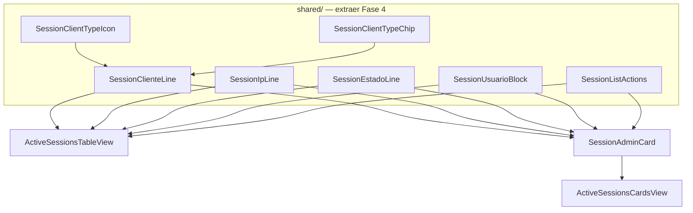

# FRONTEND — Active Sessions Cards — Architecture Audit

**Documento:** `FRONTEND_ACTIVE_SESSIONS_CARDS_ARCHITECTURE_AUDIT.md`  
**Versión:** 1.0  
**Fecha:** 2026-06-23  
**Modo:** READ ONLY — sin implementación  
**Especificación normativa:** `FRONTEND_ACTIVE_SESSIONS_ENTERPRISE_UX_DESIGN_V1_2.md` (exclusivamente v1.2)  
**Componente auditado:** `ActiveSessionsCardsView.tsx`  
**Referencia comparativa:** `ActiveSessionsTableView.tsx`, `ActiveSessionsPage.tsx`

---

## 0. Resumen ejecutivo

`ActiveSessionsCardsView` es un componente **presentacional legacy** (~144 LOC) que predates las fases Enterprise 1A–3. Comparte utilidades de dominio con la tabla pero **no comparte subcomponentes de fila** y **no cumple la paridad funcional v1.2** en variant admin.

| Dimensión | Estado vs v1.2 |
|-----------|----------------|
| Paridad funcional admin | 🔴 **NO CUMPLE** — 6 gaps P0/P1 |
| Paridad campos vs Lista | 🔴 **NO CUMPLE** — campos sobrantes + faltantes |
| Densidad desktop | 🔴 **NO CUMPLE** — `p-5`, max 3 cols, ~192px+ altura |
| Arquitectura reutilizable | 🟡 **PARCIAL** — utils sí; UI duplicada |
| variant=self | 🟢 **Aceptable** — fuera prioridad Fase 4 admin |

**Conclusión arquitectónica:** La refactorización Fase 4 debe **priorizar extracción de primitivos compartidos desde `ActiveSessionsTableView`** y **reconstruir la card admin como composición** de esos primitivos, no parchear el layout actual.

**Deuda técnica estimada:** Media — acotada a 1 componente + extracciones + wiring page + tests.

---

## 1. Arquitectura del componente

### 1.1 Responsabilidad actual

```
ActiveSessionsCardsView
├── Props IN
│   ├── sessions: AdminSessionRead[]
│   ├── onRevoke(session)
│   ├── isCurrentSession(session)
│   ├── actionsDisabled?
│   └── variant?: 'admin' | 'self'
├── Props OUT (callbacks)
│   └── onRevoke únicamente
├── Layout
│   └── grid wrapper (inline en componente)
└── Por sesión
    ├── Card container + getCurrentSessionCardClass
    ├── Header (usuario O device según variant)
    ├── Body (lista vertical icono+texto)
    └── Footer CTA revoke full-width
```

### 1.2 Acoplamientos

| Dependencia | Tipo | Observación |
|-------------|------|-------------|
| `ActiveSessionsViewVariant` | Import desde `ActiveSessionsTableView` | Acoplamiento tipo cruzado — candidato a `session-view.types.ts` |
| `SessionDeviceCell` | Shared | Usado en cards; **no** usado en tabla admin (tabla inline) |
| `SessionCurrentMarker` | Shared | ✅ |
| `SessionStatusBadge` | Shared | ✅ posición distinta a tabla |
| Utils display/ip/id | Shared | ✅ parcialmente — cards usa formatters **absolutos** incorrectos |

### 1.3 Lo que NO hace (y debería — v1.2 §1.4)

| Responsabilidad | Estado |
|-----------------|--------|
| Recibir `onViewDetail` | ❌ Prop inexistente |
| Renderizar `Eye` | ❌ |
| IP mismatch `AlertTriangle` | ❌ |
| Tiempos **relativos** (D-15) | ❌ Usa absolutos |
| Composición espejo Lista | ❌ Layout propio expandido |

### 1.4 Wiring en `ActiveSessionsPage`

```tsx
// Tabla — recibe onViewDetail
<ActiveSessionsTableView … onViewDetail={handleViewDetail} />

// Cards — NO recibe onViewDetail
<ActiveSessionsCardsView … onRevoke={setRevokeTarget} />
```

El Dialog está en page-level; Cards **no puede abrirlo** por diseño actual de props — gap arquitectónico en orquestación, no solo en card.

---

## 2. Código duplicado vs `ActiveSessionsTableView`

### 2.1 Duplicación exacta

| Bloque | TableView | CardsView | Líneas duplicadas |
|--------|-----------|-----------|-------------------|
| `ClientTypeIcon` | L34–42 (h-4) | L27–35 (h-5) | ~90% lógica idéntica |
| `resolveSessionId` key | ✅ | ✅ | Import compartido |
| `getSessionCloseActionLabel` | vía SessionRowActions | directo | Lógica compartida, UI distinta |
| `isCurrent` + marker | ✅ | ✅ | Patrón repetido |
| `formatUserDisplayName` / `formatEmpresaNombre` | ✅ admin td | ✅ admin header/body | Mismo dato, layout distinto |

### 2.2 Duplicación semántica (misma info, distinto renderer)

| Concern | TableView | CardsView |
|---------|-----------|-----------|
| Cliente / device | `ClientTypeIcon` + `ClientTypeChip` + `device_label` inline | Icon + capitalize + `SessionDeviceCell` ×2 |
| IP | `formatLastSeenIp` + mismatch | `SessionDeviceCell display=ip` sin mismatch |
| Estado | `SessionEstadoCell` (relativo) | 3 filas Calendar absolutas |
| Acciones | `SessionRowActions` | Botón full-width |

### 2.3 Código en TableView NO reutilizado por Cards (debería)

| Componente privado TableView | Exportable | Uso en Cards |
|------------------------------|------------|--------------|
| `ClientTypeChip` | Sí | ❌ |
| `SessionEstadoCell` | Sí | ❌ |
| `SessionRowActions` | Sí → `SessionListActions` | ❌ |
| `ClientTypeIcon` | Sí | Duplicado local |

---

## 3. Código ya reutilizable (mantener)

| Artefacto | Ubicación | Uso Cards | Uso Table |
|-----------|-----------|-----------|-----------|
| `SessionCurrentMarker` | component | ✅ | ✅ |
| `getCurrentSessionCardClass` | SessionCurrentMarker | ✅ | N/A (usa row class) |
| `SessionStatusBadge` | component | ✅ | ✅ |
| `SessionDeviceCell` | component | ✅ (excesivo) | ❌ admin |
| `resolveSessionId` | utils | ✅ | ✅ |
| `resolveLastSeenIp` | utils | ✅ | ✅ (via formatLastSeenIp) |
| `formatEmpresaNombre` | utils | ✅ | ✅ |
| `formatUserDisplayName` | utils | ✅ | ✅ |
| `getSessionCloseActionLabel` | utils | ✅ | ✅ |

**Nota:** `SessionDeviceCell` con `display=browser` es uso ** exclusivo de cards** y **no tiene equivalente en Lista admin** — candidato a eliminar en Fase 4.

---

## 4. Lógica a extraer a componentes compartidos

### 4.1 Candidatos prioritarios (orden implementación Fase 4)

| # | Componente propuesto | Origen | Responsabilidad |
|---|---------------------|--------|-----------------|
| 1 | **`SessionClientTypeIcon`** | Fusionar duplicados | Icono web/mobile/globe; prop `size` |
| 2 | **`SessionClientTypeChip`** | Extraer de TableView | Chip Web/Mobile |
| 3 | **`SessionClienteLine`** | Nuevo compositor | Icon + Chip + `device_label` truncado — espejo col Cliente |
| 4 | **`SessionIpLine`** | Nuevo compositor | `formatLastSeenIp` + `AlertTriangle` si mismatch |
| 5 | **`SessionEstadoLine`** | Exportar `SessionEstadoCell` | Refresh relativo + expira relativo + badge |
| 6 | **`SessionUsuarioBlock`** | Nuevo compositor admin | L1 usuario + marker; L2 nombre; L3 empresa |
| 7 | **`SessionListActions`** | Renombrar `SessionRowActions` | Eye + LogOut iconos; props `onViewDetail?` |
| 8 | **`SessionAdminCard`** | Nuevo | Composición compacta §9.3 v1.2 |
| 9 | **`ActiveSessionsCardsGrid`** | Extraer wrapper | Solo grid + gap + responsive cols |

### 4.2 Ubicación sugerida (sin implementar)

```
src/features/admin/components/iam/sessions/
├── shared/
│   ├── SessionClientTypeIcon.tsx
│   ├── SessionClientTypeChip.tsx
│   ├── SessionClienteLine.tsx
│   ├── SessionIpLine.tsx
│   ├── SessionEstadoLine.tsx      ← rename export SessionEstadoCell
│   ├── SessionUsuarioBlock.tsx
│   └── SessionListActions.tsx
├── ActiveSessionsTableView.tsx    ← consume shared/*
├── ActiveSessionsCardsView.tsx    ← consume shared/* + SessionAdminCard
└── session-view.types.ts            ← ActiveSessionsViewVariant
```

---

## 5. Campos Cards vs Lista vs spec v1.2 §9.3

### 5.1 Mapa comparativo admin

| Campo / capacidad | Lista (TableView) | Cards (actual) | v1.2 §9.3 máximo | Veredicto |
|-------------------|-------------------|----------------|------------------|-----------|
| `nombre_usuario` | ✅ L1 | ✅ h3 | ✅ | OK |
| `formatUserDisplayName` | ✅ L2 | ✅ p | ✅ (inline empresa) | OK |
| `formatEmpresaNombre` | ✅ L3 | ✅ línea Globe | ✅ trunc | OK |
| `SessionCurrentMarker` | ✅ | ✅ | ✅ | OK |
| `ClientTypeIcon` + chip | ✅ | ⚠️ icon + text capitalize | ✅ chip | **Redundante** — falta chip |
| `device_label` | ✅ col Cliente | ✅ + fila Monitor duplicada | ✅ 1 línea | **Redundante** — doble fila |
| `browser` / `os` | ❌ no en grilla | ✅ SessionDeviceCell browser | ❌ prohibido | **SOBRANTE** |
| IP last seen | ✅ mono + title | ✅ sin mono/mismatch | ✅ + ⚠ | **FALTANTE** mismatch |
| IP mismatch | ✅ AlertTriangle | ❌ | ✅ MUST | **FALTANTE** |
| Refresh relativo | ✅ «Último refresh: X» | ❌ absoluto `formatLastRefreshAt` | ✅ relativo | **SOBRANTE** formato + **FALTANTE** relativo |
| Expira relativo | ✅ + badge en L2 | ❌ absoluto `formatSessionDateTime` | ✅ relativo | **SOBRANTE** absoluto |
| `SessionStatusBadge` | ✅ en Estado L2 | ✅ header esquina | ✅ | **Redundante** posición; OK funcional |
| `issued_at` / Emitida | ❌ grilla | ✅ Calendar row | ❌ prohibido | **SOBRANTE** |
| Eye | ✅ | ❌ | ✅ MUST | **FALTANTE** |
| LogOut | ✅ icono | ✅ full-width único | ✅ icono | **Parcial** — falta Eye |
| `onViewDetail` | ✅ | ❌ prop | ✅ MUST | **FALTANTE** |

### 5.2 Resumen campos

| Categoría | Items |
|-----------|-------|
| **Sobrantes** (eliminar Fase 4) | `Emitida` absoluta; `Expira` absoluta en body; `browser/os` línea; fila device duplicada con Monitor hardcoded |
| **Faltantes** | Eye; `onViewDetail`; IP mismatch; tiempos relativos; `ClientTypeChip`; wiring page |
| **Redundantes** | Badge en header + fechas estado duplicadas; triple `Globe`/`Calendar`; icono Monitor junto a SessionDeviceCell (ya trae PlatformIcon) |

### 5.3 Formato tiempo — desalineación crítica

| Formatter Cards (actual) | Formatter Lista (correcto v1.2) |
|--------------------------|----------------------------------|
| `formatIssuedAt` | — (solo Dialog) |
| `formatLastRefreshAt` (absoluto) | `formatSessionLastRefreshRelative` |
| `formatSessionDateTime(expires_at)` | `formatSessionExpiresRelative` |

Cards viola **D-15**, **D-28**, **D-29** y **X-17** al mostrar fechas absolutas en body.

---

## 6. Validación paridad funcional v1.2 §1.4

| Requisito | Lista | Cards | Cumple |
|-----------|-------|-------|--------|
| Eye → SessionDetailDialog | ✅ | ❌ | **NO** |
| LogOut → ConfirmDialog revoke | ✅ | ✅ | **SÍ** (UX distinta) |
| SessionStatusBadge | ✅ | ✅ | **SÍ** |
| Estado refresh + expira relativos | ✅ | ❌ | **NO** |
| IP | ✅ | ⚠️ parcial | **NO** |
| IP mismatch | ✅ | ❌ | **NO** |
| SessionCurrentMarker | ✅ | ✅ | **SÍ** |
| Mismos handlers | ✅ | ❌ falta `onViewDetail` | **NO** |
| Mismos permisos (`actionsDisabled`) | ✅ | ✅ | **SÍ** |
| Flujo B11-10 (Dialog→Confirm) | ✅ vía Dialog | ❌ no hay Dialog desde card | **NO** |
| Sort/filtros/paginación page-level | ✅ | ✅ | **SÍ** |

**Score paridad admin:** **4/11 MUST** — **36% cumplimiento v1.2**

### 6.1 variant=self

| Requisito | Estado |
|-----------|--------|
| Revoke + marker | ✅ tests existentes |
| Eye / Dialog | ❌ tampoco en self tabla/cards |
| Prioridad Fase 4 | Secundaria — spec §9.4 |

---

## 7. Representación visual — evaluación Desktop First

### 7.1 Estado actual (medidas código)

| Atributo | Valor actual | Objetivo v1.2 §9.3 |
|----------|--------------|-------------------|
| Card padding | `p-5` | `p-3` – `p-4` |
| Grid gap | `gap-4 p-4` | `gap-3` |
| Cols 1920 | `lg:grid-cols-3` (3) | `xl:4` `2xl:5` |
| Cols 1366 | 3 | 4 |
| Acciones | CTA full-width bottom | Iconos Eye+LogOut alineados derecha |
| Líneas contenido | 7–9 filas icono+texto | 4 líneas max |
| Altura estimada | ~220–280 px | ≤140 px |
| Cards visibles 1920 / 25 items | ~3 cols × N filas | 4–5 cols × menos filas |

### 7.2 Propuesta visual Fase 4 (solo representación — sin mobile)

**Layout target admin (espejo wireframe v1.2 §9.3):**

```
┌─ SessionAdminCard (p-3) ─────────────────────────────────────┐
│ [SessionUsuarioBlock compact — 2 lines max on wide cards]   │
│ [SessionClienteLine] · [SessionIpLine mono trunc]           │
│ [SessionEstadoLine single row compact]          [Actions]   │
└─────────────────────────────────────────────────────────────┘
```

**Ajustes Tailwind propuestos:**

| Token | Actual | Propuesto |
|-------|--------|-----------|
| Card | `p-5 mb-3 gap-2` | `p-3 gap-1.5` |
| Grid container | `grid-cols-1 md:2 lg:3 gap-4 p-4` | `grid-cols-2 lg:3 xl:4 2xl:5 gap-3 p-3` |
| Título usuario | `text-base` | `text-sm font-semibold` |
| Secundarios | `text-sm space-y-2` | `text-xs leading-snug` |
| Badge | header corner | inline en SessionEstadoLine (como tabla) |
| Acciones | `w-full py-2` | `SessionListActions` inline-flex |

**Jerarquía visual alineada a Lista:**

1. Identidad (usuario + marker) — `text-text-base` semibold  
2. Contexto (nombre · empresa) — `text-text-soft text-xs`  
3. Operacional (cliente · IP) — `text-sm` una línea  
4. Temporal (refresh · expira · badge) — `text-text-soft text-xs`  
5. Acciones — iconos discretos derecha (como columna Acciones)

**Legibilidad desktop:** Mantener truncates + `title` tooltips en IP y empresa (como tabla). Mono solo en IP.

---

## 8. ¿Es posible compartir componentes?

**Sí — recomendado y necesario** para cumplir v1.2 sin drift futuro.

### 8.1 Mapa de reutilización



### 8.2 Qué NO compartir

| Elemento | Motivo |
|----------|--------|
| `<table>` / `<tr>` / sort headers | Exclusivo Lista |
| Grid wrapper responsive | Exclusivo Cards |
| `getCurrentSessionRowClass` vs `getCurrentSessionCardClass` | Contenedores distintos; markers sí compartidos |
| SortIndicator | Solo tabla |

### 8.3 Beneficio esperado

| Métrica | Antes | Después Fase 4 |
|---------|-------|----------------|
| LOC duplicados ClientTypeIcon | 2× ~10 LOC | 1× |
| Drift formato tiempo | Alto | Cero (SessionEstadoLine) |
| Drift IP mismatch | Alto | Cero (SessionIpLine) |
| Tests paridad | 0 admin cards | 1 suite shared + 2 vistas |

---

## 9. Riesgos

| ID | Riesgo | Prob. | Impacto | Mitigación Fase 4 |
|----|--------|-------|---------|-------------------|
| R-01 | Regresión variant=self al refactor | Media | Medio | Tests self existentes + no tocar self layout hasta admin estable |
| R-02 | Card compacta ilegible en 1280 | Baja | Medio | QA viewports v1.2 §9.2; truncates |
| R-03 | Over-extraction (demasiados micro-componentes) | Media | Bajo | 7 shared max; compositor `SessionAdminCard` |
| R-04 | Page sigue sin pasar `onViewDetail` | Alta | Alto | Checklist wiring explícito |
| R-05 | MySessions cards hereda cambios admin | Media | Bajo | `variant` branch; Fase 4 prioriza admin §9.4 |

---

## 10. Oportunidades

| ID | Oportunidad |
|----|-------------|
| O-01 | Unificar admin device rendering — tabla deja inline por `SessionClienteLine` |
| O-02 | Test suite «parity contract» — mismo session fixture, assert handlers+campos |
| O-03 | `SessionListActions` reutilizable en futuros listados IAM |
| O-04 | Reducir altura card → más sesiones visibles sin scroll en 27" |
| O-05 | Eliminar dependencia Cards→TableView type import |

---

## 11. Deuda técnica

| ID | Deuda | Severidad | Origen |
|----|-------|-----------|--------|
| TD-01 | Sin `onViewDetail` en Cards props | **P0** | Pre-Fase 2 |
| TD-02 | Fechas absolutas en card body | **P0** | Pre-Enterprise |
| TD-03 | `ClientTypeIcon` duplicado | **P1** | Copy-paste |
| TD-04 | `SessionEstadoCell` privado en TableView | **P1** | Encapsulación prematura |
| TD-05 | `SessionDeviceCell display=browser` solo cards | **P1** | Layout legacy |
| TD-06 | Grid max 3 cols en 1920 | **P1** | Pre v1.2 Desktop First |
| TD-07 | CTA revoke único sin Eye | **P0** | v1.2 §1.6 MUST |
| TD-08 | Sin tests admin cards Eye/Dialog | **P1** | Cobertura gap |
| TD-09 | `ActiveSessionsViewVariant` en TableView | **P3** | Organización tipos |
| TD-10 | Page wiring asymmetry | **P0** | ActiveSessionsPage |

---

## 12. Checklist cumplimiento v1.2 — `ActiveSessionsCardsView` admin

| ID spec | Requisito | Estado |
|---------|-----------|--------|
| D-04 | Eye + LogOut iconos | ❌ solo LogOut |
| D-05 | Eye obligatorio | ❌ |
| D-15 | Tiempo relativo + tooltip | ❌ absolutos |
| D-16 | IP + mismatch | ❌ parcial |
| D-25 | Toggle permanente (page) | ✅ page-level |
| D-26 | Cards permanente | ✅ componente existe |
| D-27 | Paridad funcional MUST | ❌ 36% |
| D-28 | No más info que Lista | ❌ browser, emitida |
| D-29 | Detalle avanzado solo Dialog | ❌ fechas absolutas en card |
| D-30 | Rediseño compacto | ❌ pendiente |
| §9.3 | Grid 4–5 cols 1920 | ❌ lg:3 |
| §9.3 | p-3/p-4, ≤140px | ❌ p-5 |
| §9.3 | Wireframe 4 líneas | ❌ 7–9 líneas |
| §13 Fase 4 | Criterios aceptación | ❌ 0/6 |

**Cumplimiento global v1.2 (Cards admin):** **2/14** items ✅

---

## 13. Propuesta Fase 4 definitiva (arquitectura)

Basada exclusivamente en v1.2 §13 Fase 4 + hallazgos de esta auditoría.

### 13.1 Objetivo

Lograr **paridad funcional MUST** y **representación visual condensada Desktop First** mediante **extracción shared + recomposición**, no patch incremental del JSX actual.

### 13.2 Entregables ordenados

| Paso | Entregable | Tipo | Dependencias |
|------|------------|------|--------------|
| **4.1** | `session-view.types.ts` — mover `ActiveSessionsViewVariant` | Refactor tipos | — |
| **4.2** | Extraer `shared/SessionClientTypeIcon`, `SessionClientTypeChip` | Shared UI | — |
| **4.3** | Extraer `SessionEstadoLine` desde `SessionEstadoCell` | Shared UI | utils relative time |
| **4.4** | Crear `SessionIpLine`, `SessionClienteLine`, `SessionUsuarioBlock` | Shared UI | 4.2 |
| **4.5** | Extraer `SessionListActions` desde `SessionRowActions` | Shared UI | — |
| **4.6** | Refactor `ActiveSessionsTableView` → consumir shared (zero UX delta) | Refactor | 4.2–4.5 |
| **4.7** | Crear `SessionAdminCard` compositor §9.3 | Nuevo | 4.4–4.5 |
| **4.8** | Reescribir `ActiveSessionsCardsView` admin branch | Refactor | 4.7 |
| **4.9** | `ActiveSessionsPage`: pasar `onViewDetail` a Cards | Wiring | 4.8 |
| **4.10** | Grid responsive `xl:4 2xl:5` en Cards | CSS | 4.8 |
| **4.11** | Tests: admin cards Eye, mismatch, relative time, parity handlers | QA | 4.9 |
| **4.12** | Regresión variant=self | QA | 4.8 |

### 13.3 Fuera alcance Fase 4 (confirmado v1.2)

- ❌ Eliminar Cards o toggle  
- ❌ `ActiveSessionsStackedRow`  
- ❌ Layouts mobile exclusivos  
- ❌ Añadir campos a card beyond Lista  
- ❌ Mover info Dialog a card  

### 13.4 Criterios de done (v1.2 §13 + auditoría)

- [ ] `ActiveSessionsCardsView` admin acepta `onViewDetail?: (session) => void`
- [ ] Cada card admin renderiza `SessionListActions` con Eye habilitado
- [ ] Cero uso de `formatIssuedAt`, `formatLastRefreshAt`, `formatSessionDateTime` en card body admin
- [ ] `SessionIpLine` muestra mismatch igual que tabla
- [ ] `SessionEstadoLine` idéntico a columna Estado tabla
- [ ] Grid ≥4 cols @1920, ≥3 @1366 (ideal 4 con breakpoint custom `min-[1366px]:grid-cols-4`)
- [ ] Altura card mediana ≤140 px con fixture 25 sesiones mock
- [ ] Tests admin cards equivalentes a `active-sessions-views.enterprise.test.tsx` tabla
- [ ] `ActiveSessionsTableView` sin regresión visual (snapshot o enterprise tests verdes)
- [ ] variant=self sin regresión en tests existentes

### 13.5 Estimación complejidad (referencia planning)

| Área | Esfuerzo relativo |
|------|-------------------|
| Extracción shared | M |
| Refactor TableView (import shared) | S |
| SessionAdminCard + CardsView | M |
| Page wiring + tests | S |
| **Total Fase 4** | **M** (1 sprint acotado) |

---

## 14. Dictamen arquitectónico

`ActiveSessionsCardsView` en variant admin es **deuda pre-Enterprise** que **contradice v1.2** en paridad funcional, contenido de campos y densidad desktop. No es un fallo de Backend ni de page data — es **aislamiento arquitectónico**: la tabla evolucionó en Fases 1A–2; las cards no.

La dirección v1.2 (**Lista + Cards equivalentes, Desktop First, Dialog como detalle**) es **arquitectónicamente correcta** y **implementable sin duplicación futura** si Fase 4 ejecuta extracción shared **antes** de rediseñar cards.

**Recomendación:** No editar línea a línea el body actual de cards. **Recomponer** desde primitivos compartidos con `SessionAdminCard` como único layout admin.

---

**Fin de auditoría — READ ONLY.**
