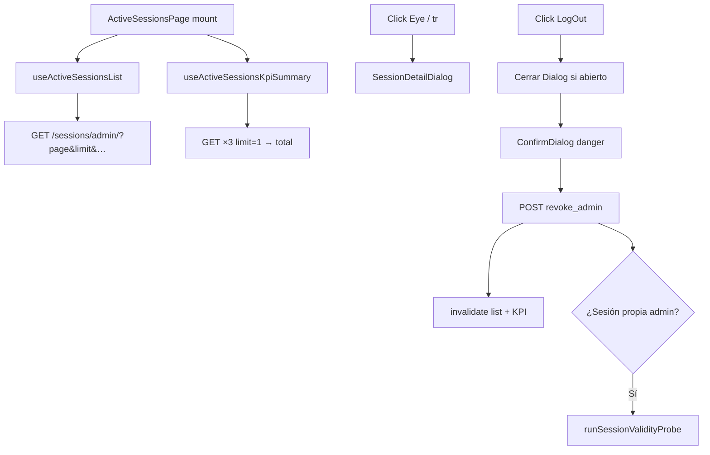
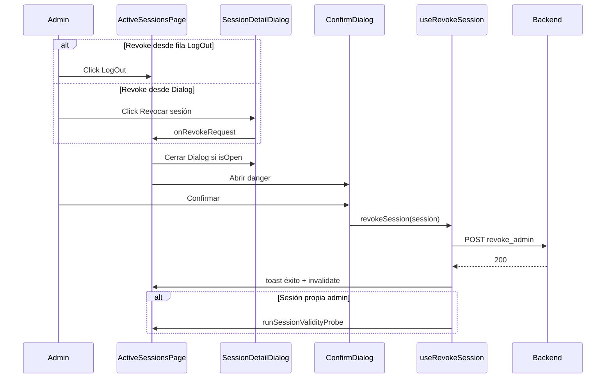

# FRONTEND — Active Sessions Enterprise UX Design

> ⚠️ **SUPERSEDED — NO USAR PARA IMPLEMENTACIÓN NUEVA**  
> **Reemplazado por:** [`FRONTEND_ACTIVE_SESSIONS_ENTERPRISE_UX_DESIGN_V1_2.md`](FRONTEND_ACTIVE_SESSIONS_ENTERPRISE_UX_DESIGN_V1_2.md) (2026-06-23)  
> **Motivo:** Decisión producto Desktop First Enterprise — Lista/Cards permanentes; descartado StackedRow y eliminación Cards.

**Documento:** `FRONTEND_ACTIVE_SESSIONS_ENTERPRISE_UX_DESIGN_V1_1.md`  
**Versión:** **1.1 — CONGELADO (histórico)**  
**Fecha:** 2026-06-23  
**Estado:** **SUPERSEDED por v1.2**
**Audiencia:** Producto, UX, Frontend IAM, QA

> **Este documento sustituye completamente a las versiones anteriores** (`FRONTEND_ACTIVE_SESSIONS_ENTERPRISE_UX_DESIGN.md` v1.0 y `FRONTEND_ACTIVE_SESSIONS_ENTERPRISE_FINAL_REVIEW.md` v1.0) **y constituye la especificación oficial para la implementación.**

**Restricciones congeladas:** sin cambios Backend · sin cambios OpenAPI · sin código en este ticket.

**Entradas normativas:**

| Documento | Rol |
|-----------|-----|
| `BACKEND_PLATFORM_API_CONTRACT_V2.md` §1d | `GET /api/v1/auth/sessions/admin/` |
| `ERP-IAM-SESSIONS-API-CONTRACT-V1.md` | DTOs `AdminSessionRead`, `SessionDeviceRead` |
| `IAM_SESSION_MANAGEMENT_V2_BACKEND_SPECIFICATION.md` | Semántica V2 campos sesión |
| `ERP_FRONTEND_STANDARDS_V2.md` §5, §7.1, §9.1 | Plantilla Admin IAM, Tier C, Dialog, B11 |
| Código referencia | `ActiveSessionsPage`, `UserManagementPage`, `UserCreateDialog` |

---

## 0. Resumen ejecutivo

La pantalla **Sesiones Activas** (`/admin/sesiones`, `ActiveSessionsPage`) evoluciona de **10 columnas con scroll horizontal** a una **tabla enterprise de 5 columnas**, **franja KPI** (3 métricas exactas + enlace preset), **`SessionDetailDialog`** (patrón IAM existente), y **toolbar** con filtros server-side. Paginación Tier C sin cambio de contrato.

**Orden predeterminado:** omitir `sort_by` en carga inicial → Backend aplica `last_used_at DESC, token_id ASC`.

**Vista única:** tabla en `md+`; filas apiladas en `< md`. Toggle Tabla/Cards se elimina en Fase 4.

---

## 1. Registro de decisiones — aceptadas vs descartadas

Consolidación explícita de contradicciones entre diseño v1.0 y revisión final.

### 1.1 Decisiones ACEPTADAS (congeladas v1.1)

| ID | Decisión | Origen |
|----|----------|--------|
| D-01 | Tabla **5 columnas** (Usuario · Cliente · IP · Estado · Acciones) | Revisión REV-P1-01 — prevalece sobre 6 cols v1.0 |
| D-02 | Columna **Estado** fusiona último refresh relativo + expiración relativa + `SessionStatusBadge` | Revisión §5 |
| D-03 | **`SessionDetailDialog`** (`Dialog` + `DialogBody` scroll, `max-w-lg`) — no Drawer/Sheet | Revisión REV-P0-01 |
| D-04 | Acciones fila: iconos **`Eye` + `LogOut`** únicamente; sin menú `⋯` | Revisión REV-P0-04 |
| D-05 | **`Eye` obligatorio** (a11y + teclado); click en `<tr>` **MAY** abrir Dialog como acelerador | Revisión REV-P0-02 |
| D-06 | **MUST NOT** revocar desde click fila; **MUST NOT** usar click fila como única vía de detalle | Revisión REV-P0-02 |
| D-07 | KPIs numéricos: **Total tenant**, **Web**, **Mobile** (3 queries `page=1&limit=1`) | v1.0 + revisión |
| D-08 | Cuarto control KPI: **enlace «Ver próximas a expirar»** (preset sort, **sin número**) | Revisión REV-P1-02 |
| D-09 | Copy dual filtros: KPIs = totales tenant; paginación = resultados filtrados | Revisión REV-P0-03 |
| D-10 | **Auto-refresh OFF** por defecto; intervalo **60 s** cuando ON | Revisión REV-P1-03 |
| D-11 | Timestamp **«Actualizado hace…»** siempre visible | Revisión + v1.0 |
| D-12 | Filtro **`usuario_id`** en **Fase 2** (no Fase 3) | Revisión REV-P1-06 |
| D-13 | Cerrar **Dialog detalle antes** de abrir `ConfirmDialog` revoke (B11-10) | Revisión R-A11Y-03 |
| D-14 | Hook dedicado **`useActiveSessionsKpiSummary`**; `staleTime` KPI ≥ 60 s | Revisión REV-P2-04 |
| D-15 | Tiempo relativo en grilla + tooltip datetime absoluto | v1.0 |
| D-16 | IP visible en grilla + alerta mismatch si `login_ip` ≠ last seen | v1.0 |
| D-17 | `user_agent` en Dialog — sección colapsable **«Diagnóstico avanzado»** | Revisión REV-P2-01 |
| D-18 | `duration_seconds` en Dialog — línea secundaria al pie de sección Tiempos | Revisión REV-P2-02 |
| D-19 | Eliminar toggle Cards admin Fase 4; mantener `variant=self` MySessions | v1.0 + revisión |
| D-20 | Paginación default **25**; opciones 10/25/50 | v1.0 |
| D-21 | Plan implementación **Fases 1A, 1B, 2, 3, 4, 5** | Revisión §7 |
| D-22 | QA gates viewport **1280 px y 1024 px** — cero scroll horizontal tabla | Revisión §8 |

### 1.2 Decisiones DESCARTADAS (no implementar)

| ID | Propuesta v1.0 | Motivo descarte | Sustituto v1.1 |
|----|----------------|-----------------|----------------|
| X-01 | **Drawer lateral 400px** | No existe primitivo en shell IAM | `SessionDetailDialog` |
| X-02 | **6 columnas** (Actividad + Vigencia separadas) | Filas altas en 1024 px; densidad inferior | 5 columnas; columna Estado |
| X-03 | **KPI numérico «Expira pronto»** | Impreciso sin endpoint stats | Enlace preset sin conteo |
| X-04 | **Auto-refresh ON** por defecto | 4–5 queries cada 60 s × N admins | OFF default |
| X-05 | **Menú `⋯`** en Acciones | Duplica affordances; no patrón IAM | Eye + LogOut |
| X-06 | **Avatar placeholder** en detalle | Sin dato API | Eliminado |
| X-07 | **Sección DISPOSITIVO triple** (label + browser/os + tipo por separado) | Redundancia | Bloque dispositivo único |
| X-08 | Citar **PB-15 (B-L Hub)** para click fila | PB-15 no aplica IAM Admin | Eye obligatorio; PB-15 no referenciado |
| X-09 | **Click fila como apertura principal** | Insuficiente a11y | Eye MUST; fila MAY |
| X-10 | Columna «**Actividad**» (nombre) | Confunde con actividad ERP | Subcopy «Último refresh» dentro de Estado |
| X-11 | Filtro usuario en **Fase 3** | Tarde para soporte | **Fase 2** |
| X-12 | Fase 1 monolítica (tabla + KPI juntos) | Scope creep kickoff | **1A** tabla / **1B** KPI |

### 1.3 Sin ambigüedad — reglas MUST / MUST NOT

| Regla | Detalle |
|-------|---------|
| **MUST** | Consumir solo `GET /auth/sessions/admin/` y `POST …/revoke_admin/` |
| **MUST** | Cero UUID visible en UI, tooltips y Dialog |
| **MUST** | `Eye` con `aria-label="Ver detalle"` en cada fila |
| **MUST** | `LogOut` con `aria-label` según `getSessionCloseActionLabel(isCurrent)` |
| **MUST** | Parseo UA prohibido — `user_agent` literal solo en Dialog colapsable |
| **MUST** | Toast error únicamente en `onError` del hook revoke (ER-02) |
| **MUST NOT** | Introducir componente Sheet/Drawer nuevo en shared/ui |
| **MUST NOT** | Full-load admin sin `page` |
| **MUST NOT** | Filtro por empresa, status o platform (no param BE) |
| **MAY** | Click `<tr>` abre Dialog si target no es botón interactivo |
| **MAY** | Agrupación visual mismo `usuario_id` en página (Fase 5) |

---

## 2. Arquitectura final de la pantalla

### 2.1 Clasificación V2

| Atributo | Valor |
|----------|-------|
| Plantilla | **Admin IAM** §9.1 |
| Listado | **Tier C** §5.11 — paginación server |
| Scope | Tenant-wide (`useTenantQuery`) — sin selector empresa toolbar (ME-02) |
| Ruta | `/admin/sesiones` — `ActiveSessionsPage` (nombre estable) |
| RBAC | Rol administrador tenant — sin renderizar revoke sin permiso |

### 2.2 Árbol de componentes (objetivo post-Fase 5)

```
ActiveSessionsPage
├── ActiveSessionsKpiStrip          (Fase 1B)
├── OrgCompanyToolbar
│   ├── OrgToolbarSearch
│   ├── ActiveSessionsUserFilter    (Fase 2)
│   ├── ActiveSessionsClientTypeFilter
│   ├── ActiveSessionsSortPresets   (Fase 3)
│   ├── ActiveSessionsRefreshMeta   (Fase 1B / 3)
│   └── AutoRefreshToggle             (Fase 3)
├── ActiveSessionsTableView         (Fase 1A — 5 cols admin)
│   └── ActiveSessionsStackedRow    (Fase 4 — < md)
├── ErpPagination
├── SessionDetailDialog             (Fase 2)
└── ConfirmDialog                   (revoke — existente)
```

**Hooks:**

| Hook | Responsabilidad |
|------|-----------------|
| `useActiveSessionsList` | Listado paginado — extendido filtros/sort existente |
| `useActiveSessionsKpiSummary` | 3 counts tenant; staleTime 60 s |
| `useRevokeSession` | Mutación admin — sin cambio |

**Utils nuevos:**

| Util | Responsabilidad |
|------|-----------------|
| `formatSessionRelativeTime` | Pasado/futuro/null; locale es-ES |
| `resolveSessionIpMismatch` | Compara `login_ip` vs last seen |

### 2.3 Flujo de datos



---

## 3. Layout definitivo

### 3.1 Desktop (≥ 1024 px)

```
╔══════════════════════════════════════════════════════════════════════════════╗
║  [KPI Strip — Fase 1B]                                                       ║
╠══════════════════════════════════════════════════════════════════════════════╣
║  [Toolbar — OrgCompanyToolbar]                                               ║
╠══════════════════════════════════════════════════════════════════════════════╣
║  [Tabla 5 columnas — sin overflow-x horizontal en lg+]                         ║
╠══════════════════════════════════════════════════════════════════════════════╣
║  [ErpPagination + copy resultados filtrados si aplica]                       ║
╚══════════════════════════════════════════════════════════════════════════════╝

Overlay: SessionDetailDialog (centrado, max-w-lg, scroll interno)
Overlay: ConfirmDialog (revoke — stack independiente tras cierre Dialog)
```

### 3.2 Orden vertical (TB-01 — sin H1 en body)

1. KPI Strip  
2. Toolbar (`justify-between` — búsqueda izquierda; controles derecha)  
3. Panel tabla (`bg-surface border border-border-base rounded-lg shadow-sm`)  
4. Paginación integrada en panel inferior  
5. Modales portaled (Dialog + Confirm)

### 3.3 Nota limitación BE (Fase 1A)

Texto fijo bajo toolbar, `text-text-faint text-xs`:

> «La búsqueda no incluye nombre de empresa. Use el listado o filtre por usuario.»

Repetir variante en **empty state** cuando hay filtros activos (Fase 3 / REV-P2-05).

---

## 4. Columnas definitivas (5)

`ACTIVE_SESSIONS_TABLE_COLSPAN = 5`

| # | Header | Contenido celda | Sort server | Ancho `table-fixed` |
|---|--------|-----------------|-------------|---------------------|
| 1 | **Usuario** | L1: `nombre_usuario` `font-medium` · L2: `{nombre} {apellido}` `text-text-soft text-xs` · L3: `empresa_nombre` truncado + `title={empresa_nombre}` · `SessionCurrentMarker` si `isCurrentSession` | `nombre_usuario` | 24% |
| 2 | **Cliente** | Icono platform · chip `Web`/`Mobile` · `device.device_label` truncado 1 línea | `client_type` | 22% |
| 3 | **IP** | Last seen: `device.ip_address` / alias raíz · `AlertTriangle` warning si mismatch `login_ip` | `ip_address` | 14% |
| 4 | **Estado** | L1: «Último refresh: {relativo}» desde `last_refresh_at`/`last_used_at`; «Sin refresh» si null · L2: «Expira {relativo}» + `SessionStatusBadge` | **Primario:** `last_used_at` · **Secundario (toggle header o preset):** `expires_at` | 30% |
| 5 | **Acciones** | Botón icono `Eye` · Botón icono `LogOut` | — | 10% |

### 4.1 Reglas columna Estado

- L1 prefijo literal **«Último refresh:»** — evita confusión con actividad ERP (REV-P1-04).
- Tooltip en L1 y L2 muestra datetime absoluto `Intl` es-ES.
- `SessionStatusBadge` **permanece en grilla** — no solo en Dialog.

### 4.2 Sort — fuente de verdad única (REV-P2-03)

| Mecanismo | Comportamiento |
|-----------|----------------|
| **Carga inicial** | Sin `sort_by` → legacy BE |
| **Click header** | Ciclo asc/desc en columna whitelist |
| **Presets dropdown (Fase 3)** | Setea `sort_by` + `sort_order`; sincroniza indicador header activo |
| **Enlace KPI «Ver próximas a expirar»** | Equivalente preset «Próximas a expirar» |

**Presets congelados:**

| Label UI | `sort_by` | `sort_order` |
|----------|-----------|--------------|
| Más recientes (default explícito) | `last_used_at` | `desc` |
| Próximas a expirar | `expires_at` | `asc` |
| Recién emitidas | `created_at` | `desc` |

### 4.3 Eliminación scroll horizontal

- `table-fixed w-full`; contenedor **sin** `overflow-x-auto` en `lg+` (≥ 1024 px).
- Padding celda: `px-4 py-3` (no `px-6`).
- Wrap permitido columnas 1–2 y 4; **prohibido** `whitespace-nowrap` global.
- IP: `font-mono text-sm`; truncar IPv6 largas con `title` completo.

---

## 5. SessionDetailDialog — especificación definitiva

### 5.1 Shell

| Atributo | Valor |
|----------|-------|
| Componente | `Dialog` + `DialogBody` — patrón `UserCreateDialog` |
| Ancho | `max-w-lg` |
| Scroll | Interno en `DialogBody` (MD-05) |
| Título | «Detalle de sesión» |
| Apertura | **MUST:** botón `Eye` · **MAY:** click `<tr>` (excl. botones) |
| Cierre | X · Escape · overlay · navegación revoke (B11-10) |

### 5.2 Contenido (orden fijo)

```
┌─ SessionDetailDialog ─────────────────────┐
│ Detalle de sesión                      [✕]│
├───────────────────────────────────────────┤
│ IDENTIDAD                                 │
│   nombre_usuario (semibold)               │
│   {nombre} {apellido}                     │
│   Empresa: {empresa_nombre}               │
│   [SessionStatusBadge]                    │
│   [SessionCurrentMarker] si aplica        │
├───────────────────────────────────────────┤
│ DISPOSITIVO (bloque único)                │
│   {device.device_label}                   │
│   {device.browser} · {device.os} ·        │
│   {device.platform} · chip Web/Mobile     │
├───────────────────────────────────────────┤
│ RED                                       │
│   IP última conexión: {last seen}         │
│   IP inicio sesión: {login_ip} o «—»      │
│   [Alerta si mismatch — texto explicativo]│
├───────────────────────────────────────────┤
│ TIEMPOS                                   │
│   Inicio sesión: {issued_at absoluto}     │
│   Último refresh: {last_refresh absoluto} │
│   Nota: «Último refresh de token, no      │
│          actividad en pantallas ERP.»     │
│   Última act. ERP: {last_business…} o «—» │
│   Nota: «Aproximada (throttle ~5 min).    │
│          No cierra sesión.»               │
│   Expira: {expires_at absoluto}           │
│   Duración sesión: {duration formateado}  │  ← secundario, pie sección
├───────────────────────────────────────────┤
│ ▶ Diagnóstico avanzado (colapsado)        │
│   User-Agent: [monospace pre-wrap scroll] │
│   [Copiar — Fase 5]                       │
├───────────────────────────────────────────┤
│ [Revocar sesión] variant danger           │
└───────────────────────────────────────────┘
```

### 5.3 Campos prohibidos en Dialog

`token_id`, `session_id`, `usuario_id`, `cliente_id`, `empresa_id`, `device_id` — **nunca** visibles.

### 5.4 Elementos eliminados vs v1.0

Avatar, bloques dispositivo duplicados, `user_agent` siempre expandido.

---

## 6. KPIs definitivos

### 6.1 Franja KPI (Fase 1B)

| Tile | Query | Label UI | Click |
|------|-------|----------|-------|
| 1 | Sin filtros, `page=1&limit=1` | **«{N} totales tenant»** | Reset filtros listado |
| 2 | `client_type=web`, `page=1&limit=1` | **«{N} Web»** | Activa filtro Web |
| 3 | `client_type=mobile`, `page=1&limit=1` | **«{N} Mobile»** | Activa filtro Mobile |
| 4 | — (sin query count) | **«Ver próximas a expirar →»** | Preset `expires_at asc` + scroll tabla |

**Tile 4 NO muestra número.** Prohibido conteo `expiring_soon` en KPI (X-03).

### 6.2 Copy KPI vs paginación (D-09)

| Estado filtros | KPI strip | ErpPagination / subtítulo |
|----------------|-----------|---------------------------|
| Sin filtros | «247 totales tenant» | «Mostrando 1–25 de 247» — **N KPI = N paginación total** |
| Filtro Web activo | KPIs **sin cambiar** (totales tenant globales) | «Mostrando 1–25 de **49 resultados** · **247 en el tenant**» |
| Cualquier filtro activo | Tiles globalmente atenuados `opacity-90` + tooltip «Totales del tenant» | Subtítulo dual obligatorio |

### 6.3 Hook `useActiveSessionsKpiSummary`

- 3 queries paralelas; key separada de listado.
- `staleTime: 60_000` ms.
- Invalidar junto con listado en refresh manual, auto-refresh ON, post-revoke.
- Loading: skeleton 4 celdas en strip.

### 6.4 Línea meta (Fase 1B / 3)

`Actualizado hace {relativo}` derivado de `dataUpdatedAt` React Query + botón refresh existente.

---

## 7. Toolbar definitiva

### 7.1 Controles por fase

| Control | Fase | Param BE | Componente |
|---------|------|----------|------------|
| Búsqueda | 1A | `search` | `OrgToolbarSearch` debounce 350 ms |
| Tipo cliente | 1A | `client_type` | Select: Todos · Web · Mobile |
| Refresh manual | 1A | — | Icono `RefreshCw` |
| Nota limitación empresa | 1A | — | Texto bajo toolbar |
| Usuario | **2** | `usuario_id` | Combobox async — patrón búsqueda IAM users |
| Presets orden | **3** | `sort_by` + `sort_order` | Dropdown 3 presets §4.2 |
| Auto-refresh toggle | **3** | invalidate RQ | OFF default; 60 s ON |
| Timestamp actualizado | **3** | — | Junto a auto-refresh |

### 7.2 Placeholders congelados

- Búsqueda: **«Buscar por usuario, nombre o IP…»**
- Usuario combobox: **«Filtrar por usuario…»**

### 7.3 Acciones toolbar derecha (post-Fase 3)

```
[Auto-refresh OFF ▼]  [Actualizado hace 2 min]  [↻]
```

Eliminar toggle **Tabla/Cards** en Fase 4.

---

## 8. Flujo de revocación definitivo



| Paso | Regla |
|------|-------|
| 1 | Si `SessionDetailDialog` abierto → **cerrar** antes de `ConfirmDialog` (B11-10) |
| 2 | `ConfirmDialog` variant `danger`; copy existente con `nombre_usuario` |
| 3 | `useRevokeSession` mode `admin` — sin cambio contrato |
| 4 | Error: toast solo en hook `onError` |
| 5 | 404 admin revoke: tratar sesión ya cerrada — invalidar listado |

---

## 9. Responsive definitivo

| Breakpoint | Layout |
|------------|--------|
| **≥ lg (1024 px)** | Tabla 5 cols; KPI 4 tiles horizontal; Dialog centrado |
| **md (768–1023 px)** | Tabla 5 cols compacta; KPI wrap 2×2; sin scroll horizontal **objetivo** |
| **< md (< 768 px)** | **`ActiveSessionsStackedRow`** por sesión (Fase 4) — no grid cards |

### 9.1 Stacked row (< md)

```
┌──────────────────────────────┐
│ juan.perez · ACME Colombia   │
│ Web · Chrome en Windows      │
│ 181.49.x.x · Último refresh: hace 5m │
│ Expira en 2d · [Activa]      │
│ [Eye Ver detalle] [LogOut]   │
└──────────────────────────────┘
```

Misma semántica que tabla; mismos handlers.

### 9.2 MySessions (`variant=self`)

- **No regresión** al eliminar cards admin.
- Fase 4: conservar componente cards/table self o migrar a stacked — **fuera alcance admin**; admin path usa layout congelado arriba.

---

## 10. Formato tiempo relativo (congelado)

Util **`formatSessionRelativeTime(value, mode: 'past' | 'future')`**:

| Condición | Copy |
|-----------|------|
| null / vacío | «—» (refresh) o «Sin refresh» en contexto L1 Estado |
| < 1 min pasado | «Ahora» |
| < 60 min | «Hace N min» |
| < 24 h | «Hace N h» |
| < 7 d | «Hace N días» |
| ≥ 7 d pasado | `dd/MM/yyyy` corto |
| futuro expires | «Expira en N min/h/días» |
| expirado | «Expirada» |

Tooltip: datetime absoluto `Intl` es-ES short date + short time.

---

## 11. Inventario datos API (referencia)

Sin cambios vs v1.0 — consumo exclusivo `AdminSessionRead` + params documentados.

**Params NO disponibles (congelado — no solicitar en impl):** `empresa_id`, `status`, `platform`, stats endpoint.

---

## 12. Wireframe funcional consolidado

```
╔══════════════════════════════════════════════════════════════════════════════╗
║  ┌──────────────┐ ┌──────────┐ ┌──────────┐ ┌──────────────────────────┐   ║
║  │ 247 totales  │ │ 198 Web  │ │  49 Mob. │ │ Ver próximas a expirar → │   ║
║  │   tenant     │ │          │ │          │ │                          │   ║
║  └──────────────┘ └──────────┘ └──────────┘ └──────────────────────────┘   ║
║  Actualizado hace 1 min · Auto-refresh OFF                    [↻]          ║
╠══════════════════════════════════════════════════════════════════════════════╣
║  [🔍 Buscar…] [Usuario ▼] [Tipo ▼] [Orden ▼]                               ║
║  La búsqueda no incluye nombre de empresa.                                  ║
╠══════════════════════════════════════════════════════════════════════════════╣
║  Usuario       │ Cliente      │ IP         │ Estado              │ Acc.   ║
║  ──────────────┼──────────────┼────────────┼─────────────────────┼────────║
║  juan.perez    │ 🖥 Web       │ 181.49.x.x │ Últ. refresh: 5m    │ [👁][⎋]║
║  Juan Pérez    │ Chrome Win   │            │ Expira en 2d [Act.] │        ║
║  ACME Colombia │              │            │                     │        ║
╠══════════════════════════════════════════════════════════════════════════════╣
║  Mostrando 1–25 de 49 resultados · 247 en el tenant    [25 ▼] [◀ 1 2 ▶]   ║
╚══════════════════════════════════════════════════════════════════════════════╝
```

---

## 13. Plan de implementación por fases

### Fase 1A — Tabla escaneable (P0)

**Objetivo:** 5 columnas + tiempo relativo + eliminar scroll horizontal.

| Entregable | Done cuando |
|------------|-------------|
| `formatSessionRelativeTime` + tests | Casos past/future/null/es-ES |
| `ActiveSessionsTableView` admin 5 cols | ColSpan=5; headers sort whitelist |
| Columna Estado con copy «Último refresh:» | Tests enterprise actualizados |
| Eye + LogOut iconos (LogOut funcional; Eye disabled hasta Fase 2) | aria-labels; sin menú ⋯ |
| Layout `table-fixed`; QA 1280 + **1024 px** | 0 scroll horizontal |
| Nota limitación búsqueda empresa | Visible bajo toolbar |

**Fuera alcance 1A:** Dialog, KPI strip, filtro usuario, presets, auto-refresh meta.

#### Criterios aceptación Fase 1A

- [ ] 5 columnas renderizadas admin; colspan skeleton = 5.
- [ ] Información P0 visible sin Dialog (usuario, empresa, cliente, IP, estado, revoke).
- [ ] Revoke fila operativo con ConfirmDialog existente.
- [ ] 0 `overflow-x-auto` en viewport 1024 px y 1280 px con 25 filas mock.
- [ ] Cero UUID en tabla.
- [ ] Tests `active-sessions-views.enterprise.test.tsx` verdes.

---

### Fase 1B — KPI strip (P1)

**Objetivo:** situational awareness sin KPI expira numérico.

| Entregable | Done cuando |
|------------|-------------|
| `useActiveSessionsKpiSummary` | 3 queries; staleTime 60 s |
| `ActiveSessionsKpiStrip` | 3 tiles + enlace preset |
| Copy dual paginación sin filtros | KPI total = pagination total |
| Timestamp «Actualizado hace…» | Visible junto a refresh |
| Skeleton KPI loading | No layout shift |

#### Criterios aceptación Fase 1B

- [ ] 3 KPI numéricos coinciden con `total` API en tests mock.
- [ ] Enlace «Ver próximas a expirar» aplica `sort_by=expires_at&sort_order=asc`.
- [ ] Tile 4 no muestra número.
- [ ] Invalidación manual refresh actualiza KPI + listado.

---

### Fase 2 — Dialog detalle + filtro usuario (P0/P1)

**Objetivo:** progressive disclosure + soporte por usuario.

| Entregable | Done cuando |
|------------|-------------|
| `SessionDetailDialog` | Contenido §5.2; colapsable UA |
| Eye abre Dialog | Click tr opcional |
| IP mismatch grilla + Dialog | `resolveSessionIpMismatch` |
| B11-10 stack | Dialog cierra antes Confirm revoke |
| Revoke desde Dialog | Mismo hook |
| `ActiveSessionsUserFilter` | Param `usuario_id`; reset page |
| Copy paginación dual con filtros | §6.2 |

#### Criterios aceptación Fase 2

- [ ] Eye keyboard-focusable abre Dialog con datos sesión.
- [ ] Dialog no muestra UUID; UA colapsado por default.
- [ ] Filtro usuario reduce listado; KPI strip permanece global.
- [ ] Subtítulo «X resultados · Y en el tenant» con filtro activo.
- [ ] Revoke desde Dialog: Dialog cerrado antes Confirm visible.

---

### Fase 3 — Presets + auto-refresh (P1/P2)

**Objetivo:** orden explícito y monitoreo opcional.

| Entregable | Done cuando |
|------------|-------------|
| `ActiveSessionsSortPresets` | 3 presets §4.2 sincronizados con headers |
| Auto-refresh toggle | **OFF default**; 60 s ON; localStorage |
| Empty state nota empresa | Con filtros activos |
| KPI tiles atenuados con filtro | opacity + tooltip |

#### Criterios aceptación Fase 3

- [ ] Preset cambia sort y resetea page=1.
- [ ] Auto-refresh OFF en first visit (sin localStorage previo).
- [ ] Auto-refresh ON invalida list + KPI cada 60 s.

---

### Fase 4 — Unificación vista (P2)

**Objetivo:** eliminar dualidad tabla/cards admin.

| Entregable | Done cuando |
|------------|-------------|
| Remover toggle Tabla/Cards | Key localStorage deprecada |
| `ActiveSessionsStackedRow` | `< md` breakpoint |
| `ActiveSessionsCardsView` admin deprecated | Comentario; `variant=self` intacto |
| Regresión MySessions | Tests self verdes |

#### Criterios aceptación Fase 4

- [ ] Admin no expone grid cards.
- [ ] Móvil stacked funcional con Eye + LogOut.
- [ ] MySessions sin regresión.

---

### Fase 5 — Pulido enterprise (P3)

**Objetivo:** a11y y forense.

| Entregable | Done cuando |
|------------|-------------|
| Agrupación visual `usuario_id` 2+ sesiones/página | Borde sutil |
| Copiar UA / IP | Clipboard API + toast éxito |
| Auditoría a11y | Focus trap Dialog; sort aria-sort |
| Documentación inline REV trazabilidad | Comentarios mínimos en page |

#### Criterios aceptación Fase 5

- [ ] Copiar UA funciona en Dialog expandido.
- [ ] axe/manual: Eye y LogOut anunciados por screen reader.

---

## 14. Alineación normativa V2

| Regla | Cumplimiento |
|-------|--------------|
| TB-01 | Toolbar first; sin H1 body |
| SK-01 / ES-01 | `InvTableSkeleton` + `IamTableEmptyState` |
| LR-01 / PR-01 | `useActiveSessionsList` + `ErpPagination` |
| E-ME4 | Sin UUID |
| ME-02 | Sin selector empresa toolbar |
| ER-02 | Toast revoke en hook |
| B11-10 | Dialog cierra antes Confirm |
| MD-05 | DialogBody scroll |
| Capa 1 tokens | `bg-surface`, `text-text-*`, semánticos |
| Capa 2 brand | `bg-brand-primary` acciones primarias toolbar KPI activo |

---

## 15. Riesgos residuales (aceptados)

| Riesgo | Mitigación congelada |
|--------|----------------------|
| KPI global vs lista filtrada confunde | Copy dual §6.2 |
| `last_refresh_at` ≠ uso ERP | Copy Estado + Dialog |
| Sin filtro empresa | Nota toolbar + empty state |
| 4 requests carga inicial | staleTime KPI; auto-refresh OFF default |
| Agrupación usuario solo en página | Documentado; Fase 5 opcional |
| Revocación remota no instantánea misma pestaña | Fuera alcance pantalla |

---

## 16. Gate final diseño

| Criterio | v1.1 |
|----------|------|
| Dialog (no Drawer) | ✅ §5 |
| Eye obligatorio | ✅ D-04, D-05 |
| KPI sin expira numérico | ✅ X-03, §6.1 |
| Auto-refresh OFF default | ✅ D-10 |
| 5 columnas | ✅ §4 |
| Copy KPI/paginación dual | ✅ §6.2 |
| Fases 1A–5 con criterios | ✅ §13 |
| Sin ambigüedad Backend/OpenAPI | ✅ |

**Estado documento:** **APROBADO PARA IMPLEMENTACIÓN** — ejecutar Fases 1A → 5 en orden. Cambios post-freeze requieren revisión arquitecto + incremento versión documento.

---

## 17. Trazabilidad

| Documento anterior | Disposición |
|--------------------|-------------|
| `FRONTEND_ACTIVE_SESSIONS_ENTERPRISE_UX_DESIGN.md` v1.0 | **Superseded** |
| `FRONTEND_ACTIVE_SESSIONS_ENTERPRISE_FINAL_REVIEW.md` v1.0 | **Incorporado y superseded** |
| `ERP-IAM-SESSIONS-FE-DESIGN-01.md` SessionDetailDrawer V1.1 | **Sustituido por SessionDetailDialog** |

| Artefacto código base | Acción impl |
|-----------------------|-------------|
| `ActiveSessionsPage.tsx` | Orquestación |
| `ActiveSessionsTableView.tsx` | Refactor 5 cols |
| `ActiveSessionsCardsView.tsx` | Deprecar admin Fase 4 |
| `useActiveSessionsList.ts` | Extender filtros |
| `iam-session-display.utils.ts` | + relative time |

---

**Fin de especificación v1.1 — CONGELADO.**

> **Este documento sustituye completamente a las versiones anteriores y constituye la especificación oficial para la implementación.**
