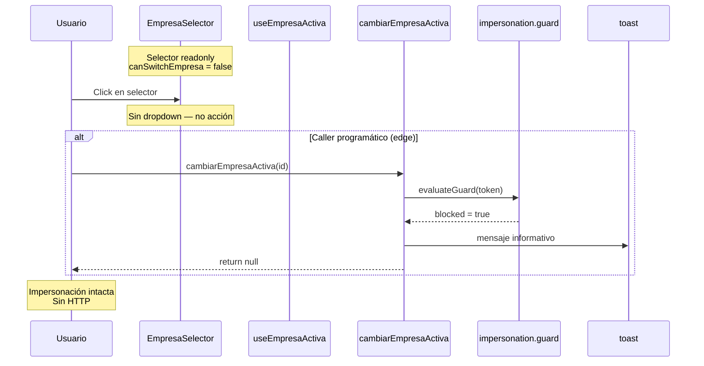
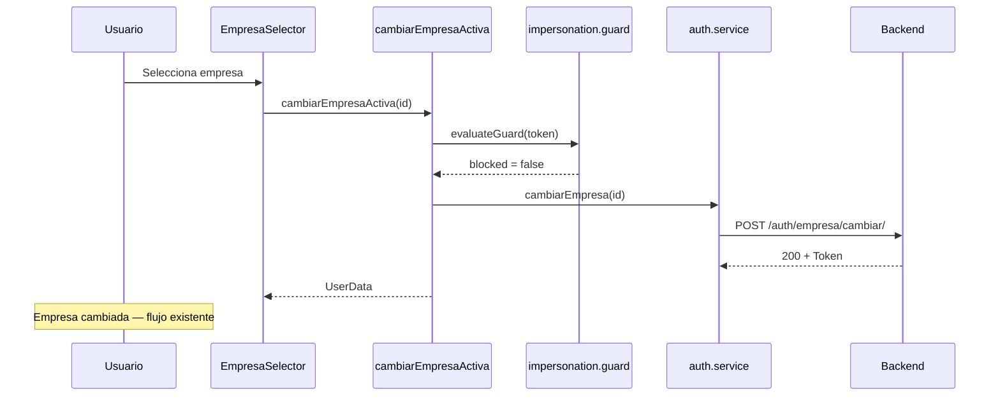

# FRONTEND — Impersonation Company Switch Fix (P0)

**Ticket:** POST-CERTIFICATION FIX P0  
**Alcance:** IAM Session Management V2 — Frontend web  
**Fecha:** 2026-06-23  
**Estado:** Diseño técnico oficial — **sin implementación**  
**Precedencia:** `POST_CERTIFICATION_FRONTEND_BUG_AUDIT.md` · `IAM_SESSION_MANAGEMENT_V2_BACKEND_SPECIFICATION.md` · `FRONTEND_IAM_V2_COMPLIANCE_CERTIFICATE.md` · `ERP_FRONTEND_STANDARDS_V2.md`

---

## 1. Resumen

Corregir el bug P0 identificado en la auditoría post-certificación: durante impersonación (`is_impersonation=true`), el intento de cambiar empresa **no debe** invocar Backend, **no debe** ejecutar `CONTROLLED_EXIT` ni terminar la impersonación.

**Comportamiento objetivo:**

| Acción | Resultado |
|--------|-----------|
| Usuario en modo impersonación intenta cambiar empresa | Toast informativo; sesión impersonada **sin cambios** |
| Llamada HTTP | **Ninguna** — cero `POST /auth/empresa/cambiar/` desde UI |
| Impersonación | **Permanece activa** |
| Platform session | **No se restaura** |

**Mensaje canónico (UX):**

> No es posible cambiar de empresa mientras se encuentra en modo impersonación.

Variante corta aceptable en `title` del selector readonly: *«Empresa fija en modo impersonación»*.

---

## 2. Contexto y causa raíz (referencia)

Dictamen completo: `POST_CERTIFICATION_FRONTEND_BUG_AUDIT.md`.

Resumen no re-investigado:

1. Política F6 mapeaba `cambiar_empresa_precheck` / `cambiar_empresa_forbidden` → `CONTROLLED_EXIT`.
2. Capa UI (`EmpresaSelector`, `useEmpresaActiva`) no bloqueaba interacción en impersonación.
3. Cuando el pre-check F6 no cortaba, la UI llegaba al Backend (403) y el interceptor/orchestrator terminaba impersonación.

Este diseño **reemplaza** la semántica F6 de «salida controlada por cambiar empresa» por «bloqueo in-place».

---

## 3. Decisiones de diseño

### 3.1 Selector visible vs oculto

| Opción | Evaluación | Decisión |
|--------|------------|----------|
| **Ocultar** `EmpresaSelector` en impersonación | Pierde contexto operativo (ME-01: usuario debe saber qué empresa impersona) | **Rechazada** |
| **Mostrar readonly** (nombre empresa, sin dropdown) | Alineado con estado actual de empresa única; coherente con banner «Modo soporte activo» | **Adoptada** |
| **Mostrar interactivo** + toast al click | Permite confusión; depende solo de UX | **Rechazada como única capa** |

**Decisión:** el selector **permanece visible** en impersonación, en modo **solo lectura** (mismo patrón visual que `canSwitchEmpresa === false` con una sola empresa elegible).

### 3.2 Dónde vive el guard oficial

| Capa | Rol | ¿Obligatoria? |
|------|-----|---------------|
| **Guard Provider** (`cambiarEmpresaActiva`) | **Fuente de verdad** — enforcement antes de cualquier HTTP | **Sí — canónica** |
| **Guard Hook** (`useEmpresaActiva`) | Deriva `canSwitchEmpresa` para UX readonly | **Sí — defensa UX** |
| **Guard UI** (`EmpresaSelector`) | Render readonly; toast defensivo si se invoca acción | **Sí — complementaria** |
| **Guard util puro** (nuevo módulo core) | Función reutilizable, testeable, sin React | **Sí — contrato compartido** |
| **Política F6** (`session-impersonation-exit.policy`) | Dejar de emitir `CONTROLLED_EXIT` para contextos cambiar empresa | **Sí — alineación semántica** |
| **Interceptor** (exclusión URL) | Red de seguridad si algún caller omite provider | **Sí — defensa profundidad** |

**Principio:** el guard **canónico** vive en **`cambiarEmpresaActiva`** (Auth Provider). UI y hook **no sustituyen** al provider; lo reflejan y evitan llamadas innecesarias.

**Detección en provider:** `isImpersonationSupportMode(authRef.current.token)` — misma función canónica F6 (`hasPlatformParentSession() || isImpersonationToken(token)`). Complemento defensivo en hook/UI: `isImpersonation` de `useAuth()` (estado React). Si divergen, **prevalece el provider** con detección por token + parent session.

### 3.3 Toast — ubicación única (ER-02)

| Evento | Emisor |
|--------|--------|
| Bloqueo por impersonación vía `EmpresaSelector` | **No toast en UI** si el dropdown está readonly (click imposible) |
| Bloqueo vía `cambiarEmpresaActiva` (caller programático, p. ej. onboarding) | **Provider** — `toast` informativo (`toast` neutro/info, no `error`) |
| Error real de API (sesión normal) | Sin cambio — `onError` / catch existente |

Evitar doble toast: UI readonly **no** llama a `cambiarEmpresaActiva`; callers programáticos reciben toast solo del provider.

### 3.4 Contrato de retorno de `cambiarEmpresaActiva` cuando bloqueado

```typescript
// Retorno estable — sin throw, sin side effects de sesión
return null;
```

- **No** `throw` — evita toast duplicado en `EmpresaSelector.catch`.
- **No** mutación de auth state.
- Callers programáticos deben interpretar `null` + impersonación activa como bloqueo (caso raro).

Alternativa documentada descartada: error tipado `CambiarEmpresaImpersonationBlockedError` — añade complejidad en todos los callers; innecesario si provider emite toast y retorna `null`.

### 3.5 Flags compile-time

Reutilizar **`SESSION_IMPERSONATION_CAMBIAR_EMPRESA_V6_ENABLED`** con **nueva semántica documentada**:

| Flag | OFF (rollback) | ON (objetivo post-fix) |
|------|----------------|------------------------|
| `VITE_SESSION_IMPERSONATION_CAMBIAR_EMPRESA_V6_ENABLED` | Comportamiento legacy pre-fix (riesgo conocido) | Guard in-place activo |

**No** crear flag adicional salvo necesidad de rollout gradual; el sub-flag existente ya scopea «cambiar empresa en impersonación».

---

## 4. Arquitectura propuesta

### 4.1 Diagrama de capas

```
┌─────────────────────────────────────────────────────────────┐
│  UI — EmpresaSelector (readonly si impersonación)           │
│  Hook — useEmpresaActiva (canSwitchEmpresa = … && !imp)     │
└──────────────────────────┬──────────────────────────────────┘
                           │ cambiarEmpresaActiva(empresaId)
                           ▼
┌─────────────────────────────────────────────────────────────┐
│  GUARD CANÓNICO — auth-provider-public-actions.ts           │
│  evaluateCambiarEmpresaImpersonationGuard(token)            │
│  → blocked? toast + return null (STOP — sin HTTP)           │
└──────────────────────────┬──────────────────────────────────┘
                           │ solo si no bloqueado
                           ▼
┌─────────────────────────────────────────────────────────────┐
│  authService.cambiarEmpresa → POST /auth/empresa/cambiar/   │
└─────────────────────────────────────────────────────────────┘

Red de seguridad (no debería ejecutarse desde UI post-fix):
  Interceptor 403 en /auth/empresa/cambiar/ → NO CONTROLLED_EXIT
```

### 4.2 Nuevo módulo util (puro)

**Archivo propuesto:** `src/core/auth/session/session-cambiar-empresa-impersonation.guard.ts`

```typescript
export const CAMBIAR_EMPRESA_IMPERSONATION_BLOCKED_MESSAGE =
  'No es posible cambiar de empresa mientras se encuentra en modo impersonación.';

export interface CambiarEmpresaImpersonationGuardResult {
  readonly blocked: boolean;
  readonly message: string;
}

export function evaluateCambiarEmpresaImpersonationGuard(
  token: string | null | undefined,
  flags?: { guardEnabled?: boolean },
): CambiarEmpresaImpersonationGuardResult;
```

- Sin imports React, Axios ni toast.
- Usa `isImpersonationSupportMode(token)` internamente.
- `guardEnabled` default: `SESSION_IMPERSONATION_CAMBIAR_EMPRESA_V6_ENABLED`.

### 4.3 Cambios en Provider

**Archivo:** `src/core/auth/provider/auth-provider-public-actions.ts`

Reemplazar bloque actual (L280–336):

| Antes | Después |
|-------|---------|
| `resolveImpersonationExitPolicy(cambiar_empresa_precheck)` → `CONTROLLED_EXIT` | `evaluateCambiarEmpresaImpersonationGuard` → toast + `return null` |
| `catch 403` → `cambiar_empresa_forbidden` → `CONTROLLED_EXIT` | **Eliminar** rama 403 específica cambiar empresa (no debería alcanzarse) |
| `authService.cambiarEmpresa` | Solo si guard `blocked === false` |

**Eliminar dependencia de** `runImpersonationControlledExit` en el flujo cambiar empresa.

### 4.4 Cambios en política F6

**Archivo:** `src/core/auth/session/session-impersonation-exit.policy.ts`

| Contexto | Acción actual | Acción propuesta |
|----------|---------------|------------------|
| `cambiar_empresa_precheck` | `CONTROLLED_EXIT` | `NO_OP` *(guard movido a módulo dedicado)* |
| `cambiar_empresa_forbidden` | `CONTROLLED_EXIT` | `NO_OP` |

**Alternativa equivalente:** nuevo action `BLOCK_IN_PLACE` en `ImpersonationExitAction` — solo si se desea consultar policy desde otros puntos. **Recomendación:** `NO_OP` + guard dedicado (menor superficie de tipos).

**Preservar sin cambio:**

- `interceptor` → `CONTROLLED_EXIT` para 401/403 ERP genéricos (sesión soporte inválida).
- `bootstrap`, `manual`, `selection_failed` — sin cambio.

**Mensaje legacy** `CAMBIAR_EMPRESA_FORBIDDEN_MESSAGE` en policy: deprecar en favor de constante del nuevo guard (mantener export si tests lo referencian, redirigir texto).

### 4.5 Cambios en Interceptor (red de seguridad)

**Archivo:** `src/core/auth/provider/auth-provider-interceptors.compositor.ts`

Añadir exclusión antes de `runImpersonationControlledExit`:

```typescript
// Pseudocódigo
if (isCambiarEmpresaRequest(originalRequest.url) && status === 403) {
  return Promise.reject(error); // sin controlled exit
}
```

**Util compartida propuesta** en `auth-http.utils.ts`:

```typescript
export function isCambiarEmpresaAuthRequest(url?: string): boolean;
```

Garantía: aunque un caller futuro invoque `authService.cambiarEmpresa` en impersonación, el 403 **no** termina impersonación.

### 4.6 Cambios en Hook

**Archivo:** `src/features/auth/hooks/useEmpresaActiva.ts`

```typescript
const { isImpersonation, ... } = useAuth();

const canSwitchEmpresa =
  empresasElegibles.length > 1 && !isImpersonation;
```

Export opcional (documentación / tests):

```typescript
cambiarEmpresaBlockedByImpersonation: isImpersonation,
```

### 4.7 Cambios en UI

**Archivo:** `src/shared/components/layout/EmpresaSelector.tsx`

| Cambio | Detalle |
|--------|---------|
| Consumir `canSwitchEmpresa` ya corregido | Dropdown no se renderiza en impersonación |
| `title` en modo readonly | *«Empresa fija en modo impersonación»* si `cambiarEmpresaBlockedByImpersonation` |
| `handleSelect` guard defensivo | Early return si `!canSwitchEmpresa` — belt-and-suspenders |

**Archivo:** `src/shared/components/layout/Header.tsx`

| Cambio | Detalle |
|--------|---------|
| Ninguno obligatorio | Sigue montando `<EmpresaSelector />`; el readonly lo resuelve el hook |

---

## 5. Componentes — matriz modificar / no modificar

### 5.1 Modificar

| Archivo | Cambio |
|---------|--------|
| `src/core/auth/session/session-cambiar-empresa-impersonation.guard.ts` | **Nuevo** — guard puro + constante mensaje |
| `src/core/auth/session/__tests__/session-cambiar-empresa-impersonation.guard.test.ts` | **Nuevo** — unit tests guard |
| `src/core/auth/provider/auth-provider-public-actions.ts` | Guard canónico; eliminar CONTROLLED_EXIT cambiar empresa |
| `src/core/auth/session/session-impersonation-exit.policy.ts` | `cambiar_empresa_*` → `NO_OP` |
| `src/core/auth/session/session-impersonation.types.ts` | Solo si se adopta `BLOCK_IN_PLACE` (opcional) |
| `src/core/auth/session/__tests__/session-impersonation-exit.policy.test.ts` | Actualizar expectativas cambiar empresa |
| `src/core/auth/provider/auth-provider-interceptors.compositor.ts` | Excluir 403 `/auth/empresa/cambiar/` de controlled exit |
| `src/core/api/auth-http.utils.ts` | `isCambiarEmpresaAuthRequest` |
| `src/core/api/__tests__/auth-http.utils.test.ts` | Tests URL helper (si existe; si no, crear) |
| `src/features/auth/hooks/useEmpresaActiva.ts` | `canSwitchEmpresa` + impersonación |
| `src/shared/components/layout/EmpresaSelector.tsx` | Readonly UX + guard defensivo en handler |
| `src/shared/context/__tests__/auth-phase-06-regression.test.ts` | Actualizar aserciones IMPL-07 |
| `src/core/auth/provider/__tests__/auth-provider-cambiar-empresa-impersonation.test.ts` | **Nuevo** — provider no llama API en soporte |

### 5.2 No modificar

| Archivo / sistema | Motivo |
|-------------------|--------|
| Backend / OpenAPI | Fuera de alcance — certificado |
| `src/features/auth/services/auth.service.ts` | Contrato API intacto |
| `src/core/auth/session/session-impersonation-exit.ts` | Orchestrator válido para otros sources |
| `ImpersonationSupportBanner.tsx` | Ya comunica modo soporte |
| `session-impersonation.flags.ts` | Reutilizar flag existente; defaults `true` |
| Flujos interceptor 401/403 **genéricos** ERP | Sesión soporte inválida sigue requiriendo exit |
| `completeEmpresaSelection` | Flujo selección inicial — distinto de cambiar empresa |
| Auth-sync / remote probe | Ortogonal |

### 5.3 Revisar sin cambio obligatorio

| Archivo | Notas |
|---------|-------|
| `src/features/org/pages/EmpresaPage.tsx` | Llama `cambiarEmpresaActiva` en onboarding post-create. En impersonación el **provider guard** bloquea; flujo onboarding en soporte es edge case improbable. No requiere cambio UI si provider emite toast. |
| `docs/arquitectura/IAM_FE_PHASE_06_TECHNICAL_DESIGN.md` | **No editar** en este ticket (congelado); este documento supersede semántica cambiar empresa post-cert. |

---

## 6. Flujo nuevo

### 6.1 Flujo feliz — impersonación, usuario intenta cambiar empresa



### 6.2 Flujo feliz — sesión normal (sin regresión)



### 6.3 Invariantes post-fix

| ID | Invariante |
|----|------------|
| IM-CS-01 | Cero `POST /auth/empresa/cambiar/` desde UI en impersonación |
| IM-CS-02 | Cero `executeImpersonationControlledExit` con source `CAMBIAR_EMPRESA_FORBIDDEN` |
| IM-CS-03 | `isImpersonation` permanece `true` tras intento bloqueado |
| IM-CS-04 | Token impersonado y `empresaActivaId` sin mutación |
| IM-CS-05 | 403 Backend por cambiar empresa **no alcanzable** vía UI certificada |
| IM-CS-06 | Interceptor no ejecuta controlled exit por 403 exclusivo de cambiar empresa |

---

## 7. Orden de implementación

| Fase | Entregable | Dependencias |
|------|------------|--------------|
| **1** | Módulo guard puro + tests unitarios | — |
| **2** | `auth-http.utils` — `isCambiarEmpresaAuthRequest` | — |
| **3** | Provider `cambiarEmpresaActiva` — guard canónico; remover CONTROLLED_EXIT | Fase 1 |
| **4** | Policy F6 — `cambiar_empresa_*` → `NO_OP` + tests policy | Fase 3 |
| **5** | Interceptor — exclusión URL cambiar empresa | Fase 2 |
| **6** | `useEmpresaActiva` — `canSwitchEmpresa` | — |
| **7** | `EmpresaSelector` — readonly UX + handler defensivo | Fase 6 |
| **8** | Tests integración provider + regresión F6 | Fases 3–7 |
| **9** | Verificación manual checklist §10 | Todas |

**Criterio de merge:** Fases 1–5 son **bloqueantes** (enforcement + red seguridad). Fases 6–7 son **UX** pero requeridas para certificar IM-CS-01.

---

## 8. Estrategia de pruebas

### 8.1 Unit — guard puro

**Archivo:** `session-cambiar-empresa-impersonation.guard.test.ts`

| Caso | Expectativa |
|------|-------------|
| Token con `is_impersonation=true` | `blocked: true` |
| `hasPlatformParentSession()` true, token normal | `blocked: true` |
| Sesión ERP normal | `blocked: false` |
| Flag `guardEnabled: false` | `blocked: false` (rollback) |
| Mensaje canónico | Texto exacto acordado |

### 8.2 Unit — policy

**Archivo:** `session-impersonation-exit.policy.test.ts`

| Caso | Expectativa |
|------|-------------|
| `cambiar_empresa_precheck` flags ON | `{ action: 'NO_OP' }` |
| `cambiar_empresa_forbidden` flags ON | `{ action: 'NO_OP' }` |
| `interceptor` 403 flags ON | `{ action: 'CONTROLLED_EXIT' }` — **sin regresión** |

### 8.3 Unit — provider (mock)

**Archivo:** `auth-provider-cambiar-empresa-impersonation.test.ts`

| Caso | Expectativa |
|------|-------------|
| Impersonación activa → `cambiarEmpresaActiva` | `authService.cambiarEmpresa` **not called** |
| Impersonación activa | `runImpersonationControlledExit` **not called** |
| Impersonación activa | Toast con mensaje canónico |
| Sesión normal | `authService.cambiarEmpresa` called |

### 8.4 Unit — interceptor URL

| Caso | Expectativa |
|------|-------------|
| 403 en `/auth/empresa/cambiar/` modo soporte | Reject sin `runImpersonationControlledExit` |
| 403 en `/api/inv/...` modo soporte | Controlled exit **sí** (sin regresión) |

### 8.5 Component — EmpresaSelector

| Caso | Expectativa |
|------|-------------|
| `isImpersonation=true`, multi empresa | Render readonly; sin `role="listbox"` |
| Click selector | Dropdown no abre |
| `handleSelect` directo (test) | No llama `cambiarEmpresaActiva` si `!canSwitchEmpresa` |

### 8.6 Regresión

| Suite | Acción |
|-------|--------|
| `auth-phase-06-regression.test.ts` | Actualizar IMPL-07: buscar guard in-place, no `cambiar_empresa_forbidden` + controlled exit |
| `session-impersonation-interceptor.integration.test.ts` | Añadir caso exclusión cambiar empresa |
| Suite IAM existente (`npm test` scope auth) | 0 failures |

### 8.7 Verificación manual

Ver §10 Criterios de aceptación.

---

## 9. Riesgos

| ID | Riesgo | Prob. | Impacto | Mitigación |
|----|--------|-------|---------|------------|
| R-01 | Divergencia `isImpersonation` (state) vs `isImpersonationSupportMode` (token) | Media | Alto | Guard provider usa **support mode**; hook UI usa state; tests con ambos desalineados |
| R-02 | Regresión F6 interceptor — 403 ERP genérico deja de hacer exit | Baja | Crítico | Exclusión **solo** URL `/auth/empresa/cambiar/` |
| R-03 | Flag OFF en build → comportamiento legacy peligroso | Baja | Alto | Default `true`; documentar en runbook; no usar OFF en prod |
| R-04 | `EmpresaPage` onboarding llama `cambiarEmpresaActiva` en soporte | Muy baja | Medio | Provider guard + toast; no crash |
| R-05 | Doble toast provider + UI | Media | Bajo | Readonly UI no invoca action; ER-02 respetado |
| R-06 | Desalineación doc F6 congelada vs fix | N/A | Bajo | Este documento como addendum post-cert; no reescribir F6 |
| R-07 | Certificado IAM 25/25 — interpretación | Baja | Medio | Fix corrige bug post-cert; no altera contrato BE; re-validar escenario impersonación en checklist manual |

---

## 10. Criterios de aceptación

### 10.1 Funcionales

- [ ] **AC-01** Usuario impersonando con ≥2 empresas elegibles ve nombre empresa activa **sin** chevron/dropdown interactivo.
- [ ] **AC-02** Intentar cambiar empresa (vía UI o programático) muestra toast: *«No es posible cambiar de empresa mientras se encuentra en modo impersonación.»*
- [ ] **AC-03** Tras intento bloqueado: impersonación activa, banner soporte visible, misma `empresaActivaId`.
- [ ] **AC-04** Network tab: **cero** requests `POST /auth/empresa/cambiar/` durante intento en impersonación.
- [ ] **AC-05** No ocurre `restorePlatformSession` ni redirect a Platform Admin por cambiar empresa.
- [ ] **AC-06** Sesión ERP **normal** (no impersonación): cambiar empresa sigue funcionando con toast éxito.
- [ ] **AC-07** Finalizar impersonación manual (`Salir del modo soporte`) sigue funcionando sin regresión.

### 10.2 Técnicos

- [ ] **AC-08** Tests unitarios guard + policy + provider pasan.
- [ ] **AC-09** `auth-phase-06-regression` actualizado y verde.
- [ ] **AC-10** Interceptor: 403 cambiar empresa en soporte no dispara controlled exit.
- [ ] **AC-11** TypeScript estricto — sin `any`.
- [ ] **AC-12** Sin cambios Backend / OpenAPI / contratos API.

### 10.3 No objetivos (explícito)

- Cambiar comportamiento P1 (revocación remota ~5 s).
- Modificar `ImpersonationSupportBanner` copy.
- Añadir selector empresa en Platform Admin shell.

---

## 11. Referencias

| Documento | Uso |
|-----------|-----|
| `POST_CERTIFICATION_FRONTEND_BUG_AUDIT.md` | Causa raíz P0 |
| `docs/arquitectura/IAM_FE_PHASE_06_TECHNICAL_DESIGN.md` | Baseline F6 (semántica cambiar empresa **supersedida** por este fix) |
| `docs/arquitectura/IAM_SESSION_FRONTEND_ARCHITECTURE_V1.md` §9 | Flujo cambiar empresa ERP normal |
| `ERP_FRONTEND_STANDARDS_V2.md` ME-01, ME-02, ER-02 | Multiempresa JWT; toast único |
| `IAM_SESSION_MANAGEMENT_V2_BACKEND_SPECIFICATION.md` §13.5 | BE 403 esperado — FE debe evitar llegar |

---

## 12. Declaración de alcance

Este diseño es **exclusivamente Frontend**. No requiere cambios Backend. La corrección alinea UX post-certificación con ME-02 operativo: **prohibido cambiar empresa en soporte**, interpretado como **bloqueo cliente in-place**, no como salida controlada de impersonación.

**Siguiente paso:** implementación según §7 tras aprobación de este diseño.

---

*Fin — FRONTEND_IMPERSONATION_COMPANY_SWITCH_FIX_DESIGN.md*
