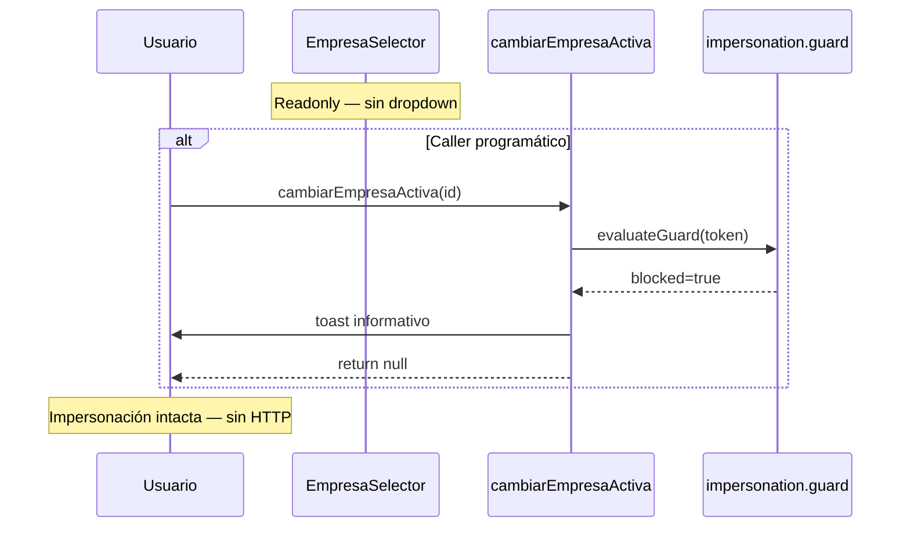

# FRONTEND — Impersonation Company Switch Fix

## Stage 1 — Implementación

**Ticket:** POST-CERTIFICATION FIX P0  
**Fecha:** 2026-06-23  
**Diseño base:** `FRONTEND_IMPERSONATION_COMPANY_SWITCH_FIX_DESIGN.md`  
**Ajuste arquitectónico Stage 1:** Política F6 (`session-impersonation-exit.policy.ts`) **no modificada**. El flujo cambiar empresa en impersonación queda gobernado exclusivamente por el guard dedicado en provider + capas UX.

---

## 1. Resumen

Stage 1 implementa bloqueo in-place de cambiar empresa durante impersonación:

- Sin `POST /auth/empresa/cambiar/` cuando el guard detecta modo soporte.
- Sin `CONTROLLED_EXIT` ni `restorePlatformSession` en ese flujo.
- Toast informativo con mensaje canónico.
- Selector readonly en UI cuando `isImpersonation === true`.

**Pendiente Stage 2:** exclusión interceptor 403 `/auth/empresa/cambiar/`, actualización política F6, red de seguridad adicional.

---

## 2. Archivos modificados

| Archivo | Tipo | Cambio |
|---------|------|--------|
| `src/core/auth/session/session-cambiar-empresa-impersonation.guard.ts` | **Nuevo** | Guard puro + constante mensaje |
| `src/core/auth/session/__tests__/session-cambiar-empresa-impersonation.guard.test.ts` | **Nuevo** | 4 tests unitarios |
| `src/core/auth/provider/auth-provider-public-actions.ts` | Modificado | Guard canónico en `cambiarEmpresaActiva`; eliminado wiring F6 precheck/403 |
| `src/features/auth/hooks/useEmpresaActiva.ts` | Modificado | `canSwitchEmpresa` excluye impersonación; export `cambiarEmpresaBlockedByImpersonation` |
| `src/shared/components/layout/EmpresaSelector.tsx` | Modificado | Readonly UX, title impersonación, guard defensivo en `handleSelect` |
| `src/shared/context/__tests__/auth-phase-06-regression.test.ts` | Modificado | IMPL-07 actualizado para guard in-place |

### Archivos explícitamente no modificados (Stage 1)

| Archivo | Motivo |
|---------|--------|
| `session-impersonation-exit.policy.ts` | Acordado — Stage 2 |
| `auth-provider-interceptors.compositor.ts` | Acordado — Stage 2 |
| Backend / OpenAPI / `auth.service.ts` | Fuera de alcance |

---

## 3. Explicación técnica

### 3.1 Guard puro (`session-cambiar-empresa-impersonation.guard.ts`)

Función `evaluateCambiarEmpresaImpersonationGuard(token, options?)`:

1. Si `guardEnabled === false` (rollback vía `SESSION_IMPERSONATION_CAMBIAR_EMPRESA_V6_ENABLED`) → `{ blocked: false }`.
2. Si `isImpersonationSupportMode(token)` → `{ blocked: true, message }`.
3. Caso contrario → `{ blocked: false }`.

Sin efectos secundarios — testeable de forma aislada.

### 3.2 Provider — enforcement canónico

`cambiarEmpresaActiva` ahora:

```typescript
const guard = evaluateCambiarEmpresaImpersonationGuard(authRef.current.token);
if (guard.blocked) {
  toast(guard.message);
  return null;
}
// … authService.cambiarEmpresa(empresaId) solo si no bloqueado
```

**Eliminado** del mismo callback:

- `resolveImpersonationExitPolicy({ context: 'cambiar_empresa_precheck' })` + `runImpersonationControlledExit`
- `catch 403` + `cambiar_empresa_forbidden` + `runImpersonationControlledExit`

El flujo cambiar empresa **ya no invoca F6**. Otros flujos (`completeEmpresaSelection`, `endImpersonation`, interceptor genérico) conservan F6 intacto.

### 3.3 Hook UX (`useEmpresaActiva`)

```typescript
const cambiarEmpresaBlockedByImpersonation = isImpersonation;
const canSwitchEmpresa =
  empresasElegibles.length > 1 && !cambiarEmpresaBlockedByImpersonation;
```

Capa defensiva UI — evita abrir dropdown; no sustituye al provider.

### 3.4 UI (`EmpresaSelector`)

- Modo readonly cuando `!canSwitchEmpresa` (incluye impersonación con multi-empresa).
- `title`: *«Empresa fija en modo impersonación»* si `cambiarEmpresaBlockedByImpersonation`.
- `handleSelect`: early return si `!canSwitchEmpresa`.

Toast de bloqueo solo en provider (callers programáticos como `EmpresaPage` onboarding).

---

## 4. Flujo post-implementación



---

## 5. Pruebas ejecutadas

### 5.1 Suites focalizadas Stage 1

```bash
npm run test:run -- session-cambiar-empresa-impersonation session-impersonation-exit.policy auth-phase-06-regression session-impersonation.flags
```

| Resultado | Detalle |
|-----------|---------|
| **4 files** | **33 tests passed** |

### 5.2 Regresión auth ampliada

```bash
npm run test:run -- src/core/auth src/shared/context/__tests__/auth
```

| Resultado | Detalle |
|-----------|---------|
| **62 passed** | 648 tests |
| **1 failed** | `session-refresh-retry.policy.test.ts` — flaky timing preexistente (`parseRetryAfterHeader` HTTP-date); **no relacionado con Stage 1** |

### 5.3 Suites verificadas sin regresión Stage 1

- `session-cambiar-empresa-impersonation.guard.test.ts` — 4/4
- `session-impersonation-exit.policy.test.ts` — 10/10 (F6 sin cambios; tests policy intactos)
- `auth-phase-06-regression.test.ts` — 11/11 (IMPL-07 actualizado)
- `auth-provider-contract.test.ts` — 25/25
- `auth-provider-compositor.smoke.test.tsx` — 7/7
- `session-impersonation-interceptor.integration.test.ts` — 4/4

---

## 6. Cobertura

| Módulo | Tests | Casos cubiertos |
|--------|-------|-----------------|
| `session-cambiar-empresa-impersonation.guard.ts` | 4 | Bloqueo soporte, sesión normal, flag OFF rollback, mensaje canónico |
| `auth-provider-public-actions.ts` | Regresión estática IMPL-07 | Presencia guard; ausencia contextos F6 cambiar empresa |
| `useEmpresaActiva` / `EmpresaSelector` | — | Sin tests unitarios dedicados en Stage 1; cubierto por guard + regresión provider |

**Gap conocido Stage 1:** no hay test de integración mock de `cambiarEmpresaActiva` verificando que `authService.cambiarEmpresa` no se invoca — recomendado para Stage 2 o ampliación tests provider.

---

## 7. Regresiones verificadas

| Escenario | Estado |
|-----------|--------|
| Política F6 interceptor 401/403 genérico | ✅ Sin cambio — tests policy verdes |
| `endImpersonation` manual F6 | ✅ Sin cambio — `context: 'manual'` preservado en public-actions |
| `completeEmpresaSelection` impersonación F6 | ✅ Sin cambio |
| Cambiar empresa sesión ERP normal | ✅ Flujo API preservado tras guard `blocked: false` |
| Smoke AuthProvider | ✅ 7/7 |

---

## 8. Autoauditoría

### 8.1 Objetivos Stage 1

| Objetivo | Cumple |
|----------|--------|
| Nunca `POST /auth/empresa/cambiar/` en impersonación (guard ON) | ✅ Provider corta antes de `authService.cambiarEmpresa` |
| Nunca `CONTROLLED_EXIT` por cambiar empresa | ✅ Eliminado wiring F6 en `cambiarEmpresaActiva` |
| Nunca `restorePlatformSession` por cambiar empresa | ✅ Idem |
| Mensaje canónico | ✅ Constante `CAMBIAR_EMPRESA_IMPERSONATION_BLOCKED_MESSAGE` |
| Sesión impersonada sin cambios | ✅ `return null` sin mutación estado |
| F6 policy intacta | ✅ Archivo no tocado |
| Interceptor intacto | ✅ Archivo no tocado |

### 8.2 Invariantes IM-CS (design)

| ID | Stage 1 |
|----|---------|
| IM-CS-01 | ✅ Cero POST desde UI (guard + readonly) |
| IM-CS-02 | ✅ Sin CONTROLLED_EXIT cambiar empresa |
| IM-CS-03 | ✅ `isImpersonation` preservado |
| IM-CS-04 | ✅ Sin mutación token/empresa |
| IM-CS-05 | ✅ UI no llega al Backend |
| IM-CS-06 | ⏳ **Stage 2** — interceptor aún podría hacer controlled exit si algo invocara API directamente |

### 8.3 Riesgos residuales (Stage 1)

| Riesgo | Mitigación actual | Stage 2 |
|--------|-------------------|---------|
| Caller bypass UI llama API en impersonación | Provider guard | Interceptor URL exclusion |
| Flag `VITE_SESSION_IMPERSONATION_CAMBIAR_EMPRESA_V6_ENABLED=false` | Comportamiento legacy (API permitida) | Documentar — no usar OFF en prod |
| Divergencia `isImpersonation` (UI) vs `isImpersonationSupportMode` (provider) | Provider usa support mode | Monitorear en tests integración |

### 8.4 Deuda técnica aceptada

- Política F6 aún define `CONTROLLED_EXIT` para `cambiar_empresa_*` — **código muerto** respecto a `cambiarEmpresaActiva`; limpieza en Stage 2.
- Interceptor 403 genérico podría terminar impersonación si `authService.cambiarEmpresa` se invocara por otro camino — **no alcanzable desde UI certificada** tras Stage 1.

---

## 9. Criterios de aceptación — estado Stage 1

| ID | Criterio | Stage 1 |
|----|----------|---------|
| AC-01 | Selector readonly en impersonación multi-empresa | ✅ |
| AC-02 | Toast mensaje canónico | ✅ (provider) |
| AC-03 | Impersonación intacta tras intento | ✅ |
| AC-04 | Cero POST `/auth/empresa/cambiar/` desde UI | ✅ |
| AC-05 | Sin restore platform por cambiar empresa | ✅ |
| AC-06 | Cambiar empresa normal sin regresión | ✅ (código preservado) |
| AC-07 | Salir modo soporte manual sin regresión | ✅ (sin cambios) |
| AC-08 | Tests guard + regresión | ✅ |
| AC-09 | auth-phase-06-regression verde | ✅ |
| AC-10 | Interceptor exclusión 403 cambiar empresa | ⏳ Stage 2 |
| AC-11 | TypeScript estricto | ✅ |
| AC-12 | Sin cambios Backend/API | ✅ |

---

## 10. Siguiente paso

**No iniciar Stage 2** hasta confirmación explícita de que Stage 1 funciona correctamente en entorno objetivo (verificación manual recomendada: impersonación + multi-empresa + intento cambiar empresa).

Stage 2 previsto:

1. `session-impersonation-exit.policy.ts` — `cambiar_empresa_*` → `NO_OP`
2. `auth-provider-interceptors.compositor.ts` — exclusión 403 cambiar empresa
3. Tests interceptor + provider mock integración

---

*Fin — FRONTEND_IMPERSONATION_COMPANY_SWITCH_FIX_IMPLEMENTATION_STAGE1.md*
