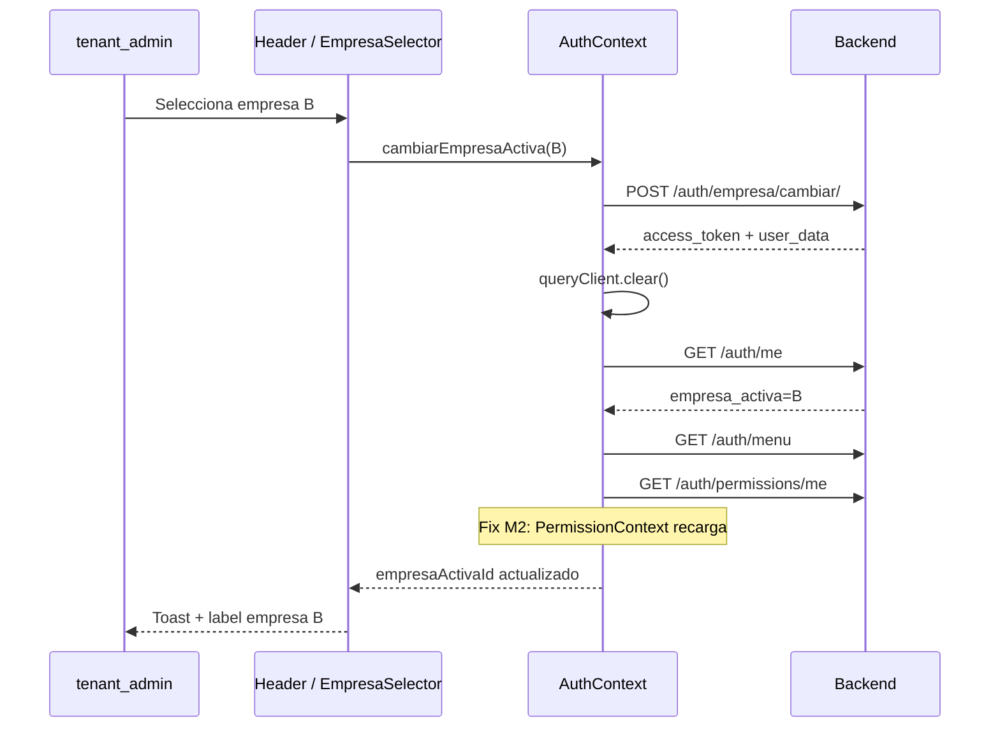

# M2 Frontend Multiempresa — Análisis de impacto y propuesta UX

**Fecha:** 31 mayo 2026  
**Alcance:** Diseño e impacto únicamente. **Sin implementación.**  
**Prerrequisitos validados:** Backend M1, M4, `empresa_default_id`, login multiempresa, `SeleccionarEmpresaPage`, `POST /auth/empresa/cambiar`.

**Documento base:** [`FRONTEND_MULTIEMPRESA_AUDIT.md`](FRONTEND_MULTIEMPRESA_AUDIT.md)

---

## Resumen ejecutivo

El objetivo M2 es exponer **cambio permanente de empresa activa** para `tenant_admin` (`ADMIN_TENANT`) en **ambos shells** (`/app/*` y `/admin/*`).

Hoy el frontend ya tiene el **80% del mecanismo** (`EmpresaSelector`, `cambiarEmpresaActiva`, `applyFullSessionToken`). Lo que falta es **activarlo para `tenant_admin`** eliminando tres bloqueos deliberados:

| Bloqueo actual | Efecto |
|----------------|--------|
| `Header.tsx`: selector solo si `shell === 'app'` | Invisible en `/admin/*` |
| `initializeAuth`: no carga `empresasDisponibles` para `tenant_admin` | Dropdown nunca es multiempresa |
| `PermissionContext`: no recarga permisos al cambiar empresa (mismo `usuario_id`) | Permisos desincronizados tras cambio |

**No se requiere endpoint adicional** si `GET /org/empresa` devuelve el catálogo utilizable por `tenant_admin` y `POST /auth/empresa/cambiar` ya está validado para ese rol.

---

## 1. Header — Empresa activa para `tenant_admin`

### Estado actual

```tsx
// Header.tsx — línea 173
{shell === 'app' && <EmpresaSelector />}
```

| Shell | `tenant_admin` hoy | Usuario operativo hoy |
|-------|-------------------|----------------------|
| `/app/*` | ❌ Sin selector (aunque puede entrar al ERP) | ✅ Selector si `showEmpresaSelector` |
| `/admin/*` | ❌ Sin selector | N/A (no accede) |
| `/super-admin/*` | N/A | N/A |

Elementos relacionados ya presentes para `tenant_admin`:

- `ShellCrossNav` — visible en **app y admin** (línea 170–172).
- Badge de usuario en menú avatar muestra **razón social del cliente** (tenant), no la empresa activa de sesión.

### Comportamiento propuesto por shell

#### `/app/*` (shell operativo)

| Aspecto | Propuesta |
|---------|-----------|
| Mostrar empresa activa | ✅ Sí, siempre que `hasEmpresaActiva` |
| Selector interactivo | ✅ Si `empresasDisponibles.length > 1` |
| Badge estático | ✅ Si una sola empresa |
| Posición | Entre `ShellCrossNav` y controles tema/nav |
| Coexistencia cross-nav | `ShellCrossNav` a la izquierda del selector; orden: `[CrossNav] [Empresa] [Tema] [NavMode] [Avatar]` |

**Impacto ERP:** módulos bajo `/app` ya dependen de `empresa_id` en JWT. El cambio de empresa refresca token y menú; coherente con operativos.

#### `/admin/*` (shell administración tenant)

| Aspecto | Propuesta |
|---------|-----------|
| Mostrar empresa activa | ✅ Sí — **nuevo en M2** |
| Selector interactivo | ✅ Misma lógica que en `/app` |
| Justificación | El admin tenant opera cada vez en contexto de **una empresa activa de sesión** (M4). Usuarios/roles/menú pueden variar por empresa según backend. |
| Páginas admin actuales | No referencian `empresa_id` en FE (`features/admin` sin filtros empresa). El cambio impacta **sesión, menú y permisos**, no formularios admin existentes. |

#### `/super-admin/*`

| Aspecto | Propuesta |
|---------|-----------|
| Selector | ❌ Sin cambios — `platform_admin` no tiene empresa activa operativa |

### Cambio de condición en Header (propuesto)

```tsx
// Pseudocódigo — no implementar aún
const showEmpresaInHeader =
  (shell === 'app' && isOperationalUser) ||
  (shell === 'app' && isTenantAdminUser) ||
  (shell === 'admin' && isTenantAdminUser);

{showEmpresaInHeader && <EmpresaSelector />}
```

Equivalente simplificado:

```tsx
{(shell === 'app' || (shell === 'admin' && isTenantAdminUser)) && (
  <EmpresaSelector />
)}
```

> **Nota:** usuarios operativos siguen restringidos a `shell === 'app'` por router; no verán selector en admin.

---

## 2. Selector permanente

### Componente reutilizable

| Componente | Reutilizar | Motivo |
|------------|------------|--------|
| **`EmpresaSelector`** | ✅ **Sí — base principal** | Dropdown, loading, toast, `cambiarEmpresaActiva` ya implementados |
| `useEmpresaActiva` | ✅ Extender reglas de visibilidad | Centraliza flags `showEmpresaSelector`, `isMultiEmpresa` |
| `SeleccionarEmpresaPage` | ❌ No para M2 | Solo flujo post-login Schema A; `tenant_admin` no pasa por guards de selección |
| `OrgActiveEmpresaBanner` | ❌ No en header | Solo lectura; duplicaría UX en módulo ORG |

**Refactor mínimo recomendado en M2:**

- Mantener un solo `EmpresaSelector`.
- Opcional: prop `compact?: boolean` para móvil (icono + nombre truncado).
- Mover lógica de visibilidad al hook; Header solo decide **si monta** el componente.

### Fuente actual de datos

| Dato | Fuente hoy | Fuente propuesta M2 |
|------|------------|---------------------|
| `empresaActivaId` | `AuthContext` ← `/auth/me` + JWT `empresa_id` | Sin cambio |
| `empresasDisponibles` | `AuthContext` ← `empresaService.list()` **solo operativos** | **Incluir `tenant_admin`** en bootstrap |
| Etiqueta visible | `empresasDisponibles` → fallback store selección → fallback `empresaService.list()` | Sin cambio (fallback ya robusto) |
| `isMultiEmpresa` | `empresasDisponibles.length > 1` | Sin cambio tras cargar lista |

#### Carga de lista — cambio en `initializeAuth`

```typescript
// AuthContext.tsx — condición actual (líneas 628–631)
if (type !== 'platform_admin' && type !== 'tenant_admin' && !isOnboardingAdmin) {
  // empresaService.list → setEmpresasDisponibles
}
```

**Propuesta M2:**

```typescript
// Pseudocódigo
if (type !== 'platform_admin' && !isOnboardingAdmin) {
  // Cargar para user Y tenant_admin
  await loadEmpresasDisponibles();
}
```

| Rol | Carga lista | Endpoint |
|-----|-------------|----------|
| `user` (operativo) | ✅ | `GET /org/empresa?solo_activos=true` |
| `tenant_admin` | ✅ **nuevo** | Mismo endpoint |
| `platform_admin` | ❌ | — |
| Onboarding admin sin empresa | ❌ lista vacía | — |

**Hook alternativo existente:** `useEmpresasTenant()` — React Query sobre el mismo servicio. **No sustituye** `empresasDisponibles` en AuthContext (el selector lee contexto global). Se puede usar como referencia o para prefetch, pero la fuente del dropdown debe seguir siendo AuthContext para coherencia con `cambiarEmpresaActiva`.

### Endpoint utilizado

| Operación | Endpoint | Estado |
|-----------|----------|--------|
| Listar empresas (dropdown) | `GET /api/v1/org/empresa?solo_activos=true` | ✅ Existente |
| Cambiar empresa activa | `POST /api/v1/auth/empresa/cambiar/` | ✅ Validado |
| Perfil post-cambio | `GET /api/v1/auth/me/` | ✅ Existente |
| Menú post-cambio | `GET /api/v1/auth/menu` | ✅ Existente |
| Permisos post-cambio | `GET /api/v1/auth/permissions/me` | ✅ Existente — **requiere fix FE** (ver §3) |

### ¿Requiere endpoint adicional?

| Escenario | ¿Nuevo endpoint? |
|-----------|------------------|
| `tenant_admin` ve todas las empresas activas del tenant vía `/org/empresa` | **No** |
| Backend restringe cambio a subconjunto ≠ catálogo ORG | **Evaluar** `GET /auth/me` ampliado con `empresas_disponibles` o endpoint dedicado — **fuera de M2** si M4 ya validó cambio con lista ORG |
| Marcar `empresa_default_id` en UI | **No** — backend ya resuelve default en login |

**Recomendación M2:** usar **`GET /org/empresa`** sin endpoint auth nuevo. Si `POST cambiar` devuelve 400 (empresa no asignada), el toast de error existente es suficiente.

---

## 3. Cambio de empresa — Cadena de refresco

### Flujo actual (`cambiarEmpresaActiva`)

```
EmpresaSelector.handleSelect
  → authService.cambiarEmpresa(empresaId)
  → applyFullSessionToken(tokenResponse)
       ├─ queryClient.clear()
       ├─ invalidateOrgQueries()
       ├─ setAuth({ token, user })
       ├─ syncImpersonationFromToken
       └─ initializeAuth()
            ├─ GET /auth/me          ✅
            ├─ syncEmpresaSession    ✅ empresaActivaId
            └─ loadMenuAndPermissionsFromAuthMenu  ✅ menú + permisos AuthContext
```

### Matriz de refresco

| Recurso | ¿Se refresca hoy? | ¿Suficiente M2? | Acción M2 |
|---------|-------------------|-----------------|-----------|
| JWT / token | ✅ | ✅ | — |
| `GET /auth/me` | ✅ vía `initializeAuth` | ✅ | — |
| `empresaActivaId` / contexto empresa | ✅ `syncEmpresaSession` | ✅ | — |
| Menú sidebar (`menuModulos`) | ✅ `loadMenuAndPermissionsFromAuthMenu` | ✅ | — |
| Permisos AuthContext (desde menú) | ✅ | ✅ | — |
| Permisos `PermissionContext` (`/auth/permissions/me`) | ❌ **No** — deps solo `usuario_id` | ❌ | **Fix obligatorio** |
| React Query caches ERP/ORG | ✅ `queryClient.clear()` + `invalidateOrgQueries` | ✅ | — |
| Breadcrumbs | ✅ vía `useShellBreadcrumbs` al cambiar ruta/menú | ✅ | — |
| `ShellCrossNav` destinos | ✅ recalcula desde `menuModulos` | ✅ | — |

### Fix propuesto — `PermissionContext`

```typescript
// PermissionContext.tsx — useEffect actual
}, [isAuthenticated, authLoading, loadPermissions, requiereSeleccionEmpresa]);

// Propuesta: añadir dependencia de sesión empresa
}, [
  isAuthenticated,
  authLoading,
  loadPermissions,
  requiereSeleccionEmpresa,
  auth.token,           // cambia en cada cambiarEmpresa
  // o auth.user?.empresa_activa desde contexto extendido
]);
```

Adicionalmente, resetear `permissionsInitialized` cuando cambie `empresa_activa`, no solo `usuario_id`:

```typescript
useEffect(() => {
  setPermissionsInitialized(false);
}, [auth.user?.usuario_id, auth.user?.empresa_activa]);
```

### Flag global de loading (propuesta UX)

Hoy solo `EmpresaSelector` tiene estado local `changing`. Durante `applyFullSessionToken`, las páginas pueden mostrar datos obsoletos un instante.

| Opción | Descripción |
|--------|-------------|
| **A — Mínima (M2)** | Mantener spinner local en selector + toast éxito/error |
| **B — Recomendada** | Exponer `isSwitchingEmpresa` en AuthContext; overlay sutil en `<main>` durante cambio |
| **C — Conservadora** | Tras cambio, `navigate(SHELL_HOME_PATH[shell])` para evitar pantallas con estado local obsoleto |

**Recomendación:** **A + fix PermissionContext** en M2; **B** como mejora opcional si QA detecta parpadeos.

### Navegación post-cambio

| Shell | Comportamiento propuesto |
|-------|-------------------------|
| `/app/*` | Permanecer en ruta actual; caches limpiados fuerzan refetch |
| `/admin/*` | Permanecer en ruta actual (páginas admin son tenant-scoped en FE) |
| Excepción | Si la ruta actual deja de existir en menú → redirect a `SHELL_HOME_PATH[shell]` (mejora futura) |

---

## 4. Compatibilidad por tipo de actor

El frontend define `UserType = 'platform_admin' | 'tenant_admin' | 'user'`. **No existe `user_type: manager`**; en este documento **manager = usuario operativo** con rol supervisor/elevado (`access_level >= 3` o rol equivalente).

### Matriz de impacto

| Actor | Selector M2 | Lista empresas | `POST cambiar` | Riesgo |
|-------|-------------|----------------|----------------|--------|
| **`platform_admin`** | ❌ Sin cambios | No carga | N/A (sin empresa sesión) | 🟢 Nulo |
| **`tenant_admin`** | ✅ **Nuevo** app + admin | ✅ Cargar en bootstrap | ✅ Ya validado BE | 🟡 Medio — probar menú/permisos en ambos shells |
| **Manager** (`user` + rol) | ✅ Sin cambios (ya en `/app`) | Ya cargaba | ✅ Ya funciona | 🟢 Bajo — regresión si se altera condición Header |
| **`user` operativo** | ✅ Sin cambios | Ya cargaba | ✅ Ya funciona | 🟢 Bajo |

### Guards y reglas — sin cambio previsto

| Regla | `tenant_admin` | Operativo |
|-------|----------------|-----------|
| `shouldSelectEmpresa` | `false` — usa `empresa_default_id` en login | `true` si Schema A |
| `canAccessErp` | `false` (flag contexto) | según empresa |
| Acceso `/app/*` | ✅ Permitido (no bloqueado como platform_admin) | ✅ |
| Acceso `/admin/*` | ✅ `requireTenantAdmin` | ❌ |

> M2 **no modifica guards** de selección/onboarding. El flujo login → default empresa para `tenant_admin` permanece.

### Impersonación

Si `platform_admin` impersona tenant con multiempresa, el flujo Schema A existente sigue aplicando. M2 no altera impersonación; el selector aparecerá para el JWT impersonado si `user_type === 'tenant_admin'` o operativo con empresa activa.

---

## 5. Propuesta UX

### 5.1 Ubicación del selector

```
┌─────────────────────────────────────────────────────────────────────────────┐
│ [🏠 Breadcrumb …]     [🔍 Búsqueda]     [Admin↔Módulos] [🏢 Empresa ▾] [☀] [☰] [👤] │
└─────────────────────────────────────────────────────────────────────────────┘
                                          ↑
                              EmpresaSelector (M2: app + admin tenant_admin)
```

**Jerarquía visual:**

1. Breadcrumb (izquierda)
2. Búsqueda global (centro, `sm+`)
3. Cluster derecho: CrossNav → **Empresa** → utilidades → avatar

### 5.2 Estados del componente

| Estado | Condición | UI |
|--------|-----------|-----|
| **Oculto** | Sin `empresaActivaId` o `requiereSeleccionEmpresa` | No montar |
| **Cargando nombre** | Resolviendo etiqueta (`loadingName`) | Skeleton pulse 96px |
| **Empresa única** | `!isMultiEmpresa` | Badge estático: icono + nombre truncado, sin chevron |
| **Multiempresa cerrado** | `isMultiEmpresa && !open` | Botón: icono + nombre + chevron ↓ |
| **Multiempresa abierto** | `open` | Dropdown listbox, empresa actual resaltada |
| **Cambiando** | `changing === true` | Spinner en botón; botón disabled; dropdown cerrado |
| **Error** | catch en `handleSelect` | Toast error; nombre anterior conservado |

### 5.3 Empresa actual vs seleccionada

| Concepto | Definición | Representación UI |
|----------|------------|-------------------|
| **Empresa actual (sesión)** | `empresaActivaId` en AuthContext / JWT | Texto del botón + fila con `aria-selected=true` |
| **Empresa en hover/foco** | Item bajo cursor | Hover `bg-overlay` |
| **Empresa en transición** | Id enviado a `cambiarEmpresa` ≠ `empresaActivaId` hasta respuesta | Spinner; **no** actualizar label hasta éxito |
| **Empresa post-éxito** | Nuevo `empresa_activa` de `/auth/me` | Label + check visual en lista; toast `"Empresa activa: {nombre}"` |

No se propone panel de confirmación modal — cambio inmediato al click (igual que operativos hoy).

### 5.4 Comportamiento responsive

| Breakpoint | CrossNav | EmpresaSelector | Búsqueda |
|------------|----------|-----------------|----------|
| `< md` | Oculto (`hidden md:inline-flex`) | Visible — nombre `max-w-[120px]` truncado | Oculto (`hidden sm:block`) |
| `≥ md` | Visible | `max-w-[160px]` | Visible |
| `< sm` | Oculto | Solo icono + truncado agresivo **(opcional M2+)** | Oculto |

**Accesibilidad:**

- `aria-haspopup="listbox"`, `aria-expanded`, `role="option"`, `aria-selected`
- `title` con nombre completo en truncados
- Teclado: Escape cierra dropdown (mejora opcional; hoy solo click outside)

### 5.5 Copy y microcopy

| Elemento | Texto |
|----------|-------|
| Botón (multi) | `{nombre_comercial \|\| razon_social}` |
| `title` botón | `Cambiar empresa activa` |
| Toast éxito | `Empresa activa: {nombre}` |
| Toast error | Mensaje API o `No se pudo cambiar de empresa` |
| Hint ORG (sin cambio) | `Cambiar en el encabezado` en `OrgActiveEmpresaBanner` |

### 5.6 Diagrama de flujo M2



---

## 6. Archivos afectados (impacto implementación futura)

| Archivo | Tipo cambio | Prioridad |
|---------|-------------|-----------|
| `src/shared/components/layout/Header.tsx` | Ampliar condición render selector | 🔴 Alta |
| `src/shared/context/AuthContext.tsx` | Cargar `empresasDisponibles` para `tenant_admin` | 🔴 Alta |
| `src/core/auth/PermissionContext.tsx` | Recargar permisos al cambiar empresa/token | 🔴 Alta |
| `src/features/auth/hooks/useEmpresaActiva.ts` | Documentar/ampliar `showEmpresaSelector` si hace falta | 🟡 Media |
| `src/shared/components/layout/EmpresaSelector.tsx` | Ajustes responsive opcionales | 🟢 Baja |
| `src/core/auth/utils/empresa-access.ts` | Sin cambio previsto | — |
| `src/shared/components/ProtectedRoute.tsx` | Sin cambio previsto | — |
| `src/features/admin/**` | Sin cambio (tenant-scoped) | — |

**Archivos que NO deben tocarse en M2:**

- `SeleccionarEmpresaPage` — flujo login Schema A
- `Login.tsx` — login ya validado
- Guards `platform_admin`

---

## 7. Riesgos y mitigaciones

| Riesgo | Probabilidad | Mitigación |
|--------|--------------|------------|
| Permisos obsoletos tras cambio | Alta (bug actual) | Fix `PermissionContext` en M2 |
| `tenant_admin` ve empresas en ORG que no puede seleccionar | Media | Toast 400; filtrar lista si BE expone asignables en `/auth/me` (fase posterior) |
| Parpadeo UI con datos viejos | Media | `queryClient.clear()` ya mitiga; overlay opcional |
| Regresión operativos al cambiar condición Header | Baja | Condición explícita: operativos solo `shell === 'app'` |
| Lista vacía para `tenant_admin` (error API) | Baja | Fallback label vía `empresaService.list` en selector (ya existe) |

---

## 8. Criterios de aceptación M2

| # | Criterio |
|---|----------|
| 1 | `tenant_admin` ve empresa activa en header en `/app/home` y `/admin/usuarios` |
| 2 | Con 2+ empresas, dropdown permite cambiar; con 1, badge estático |
| 3 | Tras cambio: `/auth/me` refleja nueva `empresa_activa` |
| 4 | Menú lateral se actualiza (ítems visibles pueden cambiar) |
| 5 | `PermissionContext` refleja permisos de la nueva empresa |
| 6 | `platform_admin` no ve selector en ningún shell |
| 7 | Usuario operativo (`user`) mantiene comportamiento actual en `/app` |
| 8 | Sin endpoint nuevo en FE |

---

## 9. Plan de implementación sugerido (post-aprobación)

| Fase | Entregable | Esfuerzo |
|------|------------|----------|
| **M2.1** | AuthContext: cargar empresas para `tenant_admin` | S |
| **M2.2** | Header: render selector en app + admin tenant_admin | S |
| **M2.3** | PermissionContext: recarga por cambio empresa | S |
| **M2.4** | QA manual checklist §8 + regresión operativos | M |
| **M2.5** (opcional) | Overlay global `isSwitchingEmpresa` | S |

**Estimación total:** 1–2 días dev + QA.

---

## 10. Decisiones explícitas para confirmar con producto

| # | Pregunta | Recomendación |
|---|----------|---------------|
| 1 | ¿`tenant_admin` ve **todas** las empresas del tenant o solo asignadas? | Todas vía `/org/empresa` (M2); refinar si BE indica lo contrario |
| 2 | ¿Redirect a home tras cambiar empresa en admin? | No — permanecer en ruta |
| 3 | ¿Selector en impersonación tenant_admin? | Sí — hereda JWT impersonado |
| 4 | ¿Mostrar UUID en tooltip para soporte? | Opcional — solo en `title` del botón |

---

*Documento de diseño M2. No se modificó código fuente. Pendiente aprobación para implementación.*
