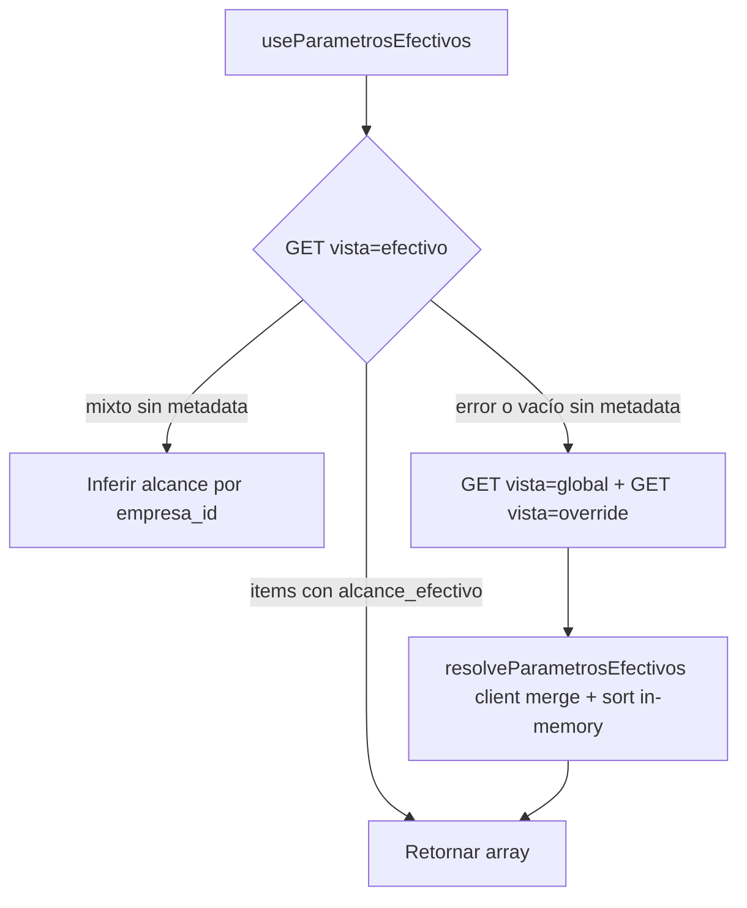

# Spike — Paginación server `GET /org/parametros`

**Fecha:** 13 junio 2026  
**Fase:** PERF F7 Parte B  
**Estado:** Spike estático completado — **migración ParametrosPage bloqueada** hasta validación manual en entorno con datos  
**Contratos:** `docs/api/ORG_API.json`, `FRONTEND_LISTADOS_CONTRACT_V1.md` §4, §5

---

## 1. Objetivo

Validar si el frontend puede migrar `ParametrosPage` a `useErpListQuery` (Tier B) **sin** el fallback híbrido client-side (`resolveParametrosEfectivos`), confirmando:

1. Paginación **después** del merge efectivo (global + override).
2. Sort server sobre el resultado efectivo.
3. Compatibilidad de `vista=efectivo|global|override` con `page`/`limit`.
4. Qué código FE puede eliminarse tras la validación.

**Alcance explícito:** no se migró `ParametrosPage` en F7.

---

## 2. Evidencia OpenAPI (`docs/api/ORG_API.json`)

### 2.1 Endpoint

```
GET /api/v1/org/parametros
```

**Descripción OpenAPI:**

> Lista efectiva para la empresa activa: globales tenant + overrides con precedencia.

### 2.2 Query params documentados

| Parámetro | OpenAPI | Frontend actual (`buildParametroListQuery`) |
|-----------|:-------:|:------------------------------------------:|
| `modulo_codigo` | ✅ | ✅ |
| `solo_activos` | ✅ (default `true`) | ✅ |
| `buscar` | ✅ | ✅ |
| `page` | ✅ | ❌ no usado en listado |
| `limit` | ✅ (default 50, máx 100) | ❌ no usado |
| `sort_by` | ✅ | ❌ no usado |
| `sort_dir` | ✅ (`asc`/`desc`) | ❌ no usado |
| **`vista`** | ❌ **no documentado** | ✅ `efectivo` / `global` / `override` |

### 2.3 Response

```json
Union[
  ParametroRead[],
  PaginatedParametroResponse
]
```

`PaginatedParametroResponse` incluye: `items`, `total`, `pagina_actual`, `total_paginas`, `limit`.

### 2.4 Schema `ParametroRead`

- Incluye `empresa_id` (nullable → global si `null`).
- **No** incluye `alcance_efectivo` en OpenAPI.
- Frontend define `ParametroEfectivo.alcance_efectivo: 'global' | 'override'` en `org.types.ts`.

### 2.5 Contrato listados (`FRONTEND_LISTADOS_CONTRACT_V1.md`)

Footnote §4:

> **Parámetros (híbrido):** merge global + override en service; sort post-merge (`apply_memory_sort`), luego slice paginado.

**Whitelist sort:** `modulo_codigo`, `codigo_parametro`, `nombre_parametro`, `fecha_creacion`, `fecha_actualizacion`.

**Interpretación spike:** el backend debe:

1. Aplicar filtros (`modulo_codigo`, `solo_activos`, `buscar`).
2. Resolver vista/merge efectivo.
3. Ordenar el conjunto resultante (`sort_by` / `sort_dir`).
4. Paginar (`page` / `limit`) sobre ese conjunto.

---

## 3. Estado actual del frontend

### 3.1 Flujo tab «Valores efectivos»



Archivo: `src/features/org/hooks/parametro.hooks.ts` → `fetchParametrosEfectivos`.

### 3.2 Tabs «Globales» / «Overrides»

- `GET ?vista=global|override`
- Fallback: `filterParametrosByVista` client si el backend devuelve listado mixto.

### 3.3 Bloqueo técnico para ErpList hoy

`parametroService.list` **siempre** hace `orgListItems()` → descarta el envelope paginado:

```typescript
// org.service.ts — pierde total/paginas
list: async (params?) => {
  return orgListItems(await orgFetchList<Parametro>('/parametros', buildParametroListQuery(params)));
}
```

Migración requerirá `orgFetchList` directo en un futuro `useParametrosErpList` + `normalizeListResponse` (patrón INV/centros-costo F7A).

### 3.4 ParametrosPage

- Full-load: `listQuery.data ?? []` sin `ErpPagination`.
- Debounce búsqueda: ✅ (`useDebouncedSearch`).
- 3 tabs híbridas sin paginación.

---

## 4. Matriz de pruebas manuales (Network)

Ejecutar con sesión JWT empresa activa, DevTools → Network, filtro `parametros`.

### 4.1 Baseline efectivo paginado

```http
GET /api/v1/org/parametros?vista=efectivo&page=1&limit=50&solo_activos=true
```

| # | Verificación | Pass si |
|---|--------------|---------|
| 1 | Status 200 | Envelope `PaginatedParametroResponse` |
| 2 | `items.length` ≤ 50 | Paginación activa |
| 3 | `total` = cardinalidad efectiva completa | No solo página |
| 4 | Sin segundo request global+override | Fallback FE no disparado |
| 5 | Cada item tiene `alcance_efectivo` o inferible | Badges UI correctos |

### 4.2 Paginación post-merge

Prerrequisito: tenant con **>50** parámetros efectivos (globales + overrides tras merge).

| # | Acción | Pass si |
|---|--------|---------|
| 1 | `page=1&limit=50` vs `page=2&limit=50` | Conjuntos disjuntos; unión = `total` |
| 2 | Override gana sobre global mismo código | En efectivo page=1..N el override aparece, no el global duplicado |
| 3 | `total` estable entre páginas | Mismo filtro → mismo `total` |

### 4.3 Sort sobre efectivo

```http
GET ...?vista=efectivo&page=1&limit=50&sort_by=modulo_codigo&sort_dir=asc
GET ...?vista=efectivo&page=1&limit=50&sort_by=modulo_codigo&sort_dir=desc
```

| # | Verificación | Pass si |
|---|--------------|---------|
| 1 | Orden coherente en `items` | asc ≠ desc |
| 2 | Orden global entre páginas | Último de page=1 ≤ primero de page=2 (asc) |
| 3 | `sort_by` inválido | 422 (manejo F8) o ignorado — documentar |

### 4.4 Filtros + reset página

| Request | Pass si |
|---------|---------|
| `modulo_codigo=ORG&page=1&limit=50` | Solo módulo ORG |
| `buscar=<término>&page=1&limit=50` | Filtrado server; `total` acotado |
| Cambiar `modulo_codigo` con UI futura | Nuevo request `page=1` |

### 4.5 Vistas global / override

```http
GET /api/v1/org/parametros?vista=global&page=1&limit=50
GET /api/v1/org/parametros?vista=override&page=1&limit=50
```

| # | Verificación | Pass si |
|---|--------------|---------|
| 1 | `vista=global` | Solo filas `empresa_id == null` |
| 2 | `vista=override` | Solo filas con `empresa_id` sesión |
| 3 | Envelope paginado | `total` por vista, no full-load |

### 4.6 GET sin `vista` (default OpenAPI)

```http
GET /api/v1/org/parametros?page=1&limit=50
```

| # | Verificación | Pass si |
|---|--------------|---------|
| 1 | Equivalente a efectivo paginado | Mismos `total`/precedencia |
| 2 | Documentar si `vista` es redundante | Decisión migración |

---

## 5. Confirmaciones del spike (análisis estático)

| Pregunta | Resultado | Confianza |
|----------|-----------|-----------|
| ¿OpenAPI permite paginación? | ✅ `page`/`limit` + `PaginatedParametroResponse` | Alta |
| ¿Paginación post-merge según contrato? | ✅ Documentado (`apply_memory_sort` + slice) | Alta (contrato); **requiere prueba manual** |
| ¿Sort sobre efectivo? | ✅ Params `sort_by`/`sort_dir` en OpenAPI | Media — validar orden inter-página |
| ¿`vista` soportado? | ⚠️ Usado en FE; **ausente en OpenAPI repo** | Requiere prueba manual |
| ¿`alcance_efectivo` en response? | ⚠️ No en `ParametroRead` OpenAPI | Requiere prueba manual |

---

## 6. Fallbacks frontend — candidatos a eliminación

**Solo tras PASS manual de §4.**

| Código | Ubicación | Condición eliminación |
|--------|-----------|----------------------|
| `resolveParametrosEfectivos` + dual fetch | `parametro.hooks.ts` | `vista=efectivo&page=1` estable con envelope |
| Rama `catch { /* fallback merge */ }` | `fetchParametrosEfectivos` | Sin errores en vista efectivo paginada |
| `filterParametrosByVista` | `org-parametro-resolve.ts` | `vista=global\|override` paginado correcto |
| Inferencia `alcance_efectivo` por `empresa_id` | `fetchParametrosEfectivos` L54-62 | API devuelve `alcance_efectivo` siempre |
| Sort in-memory en `resolveParametrosEfectivos` | `org-parametro-resolve.ts` L38-41 | Sort server verificado |
| `orgListItems` en listado parámetros | `parametroService.list` | Reemplazar por fetcher ErpList |

**Conservar hasta validar:**

- Tabs híbridas UX (`OrgParametroHybridTabs`).
- RBAC global (`useOrgCanManageGlobalParametros`).
- `buildParametroCreatePayload` / alcance modales.

---

## 7. Recomendación post-spike

### 7.1 Go / No-Go migración

| Escenario | Decisión |
|-----------|----------|
| §4.1–4.3 PASS en staging | **GO** — implementar `useParametrosErpList` (3 variantes por tab) en F7.2 o F8 |
| `vista` ignorado o 422 | **NO-GO** — ticket backend OpenAPI + soporte `vista` |
| Paginación pre-merge (duplicados global/override) | **NO-GO** — bug backend |
| Sin `alcance_efectivo` en items | **GO condicional** — mantener inferencia mínima, eliminar dual-fetch |

### 7.2 Diseño propuesto (no implementado)

```typescript
// Por tab — pseudo
useParametrosErpList({
  vista: 'efectivo' | 'global' | 'override',
  modulo_codigo,
  debouncedBuscar,
  config: PARAMETROS_LIST_CONFIG,
});
```

- `fetcher`: `orgFetchList('/parametros', buildParametroListQuery(params))` sin `orgListItems`.
- `forcePagination: true`, `defaultLimit: 50`.
- Una instancia por tab activa (patrón `useParametrosForTab` actual).

---

## 8. Riesgos

| Riesgo | Impacto | Mitigación |
|--------|---------|------------|
| OpenAPI desactualizado (`vista`) | Medio | Actualizar contrato repo tras QA |
| Volumen bajo en dev (<50 params) | Bajo | Probar con tenant seed o staging |
| Tab efectivo sin `alcance_efectivo` | Medio | Inferencia ligera; no dual-fetch |
| Migrar una tab sin las otras | Alto | Migrar las 3 tabs en mismo PR |

---

## 9. Checklist QA — registrar resultados

| Prueba §4 | Fecha | Entorno | Resultado | Notas |
|-----------|-------|---------|-----------|-------|
| 4.1 Baseline efectivo | | | ☐ PASS ☐ FAIL | |
| 4.2 Post-merge | | | ☐ PASS ☐ FAIL | |
| 4.3 Sort | | | ☐ PASS ☐ FAIL | |
| 4.4 Filtros | | | ☐ PASS ☐ FAIL | |
| 4.5 Vistas G/O | | | ☐ PASS ☐ FAIL | |
| 4.6 Sin vista | | | ☐ PASS ☐ FAIL | |

---

## 10. Conclusión

El contrato backend y el documento de listados **soportan** paginación Tier B post-merge para parámetros. El bloqueo principal era frontend (`orgListItems`); resuelto con `useParametrosErpList`.

**ParametrosPage migrada (enfoque conservador).** Fallback híbrido legacy conservado en código — ver §11. Validación manual: `FRONTEND_PERF_PHASE7_AUDIT.md` §8.

---

## 11. Implementación post-spike (jun 2026)

Migración aplicada sin eliminar fallback:

| Componente | Estado |
|------------|--------|
| `useParametrosErpList` | ✅ `orgFetchList` + `useErpListQuery` |
| `ParametrosPage` | ✅ Tabs + paginación + sort |
| `resolveParametrosEfectivos` | Conservado — candidato limpieza |
| `filterParametrosByVista` | Conservado — candidato limpieza |
| `fetchParametrosEfectivos` | Conservado en hooks `@deprecated` |

**Validación manual:** `FRONTEND_PERF_PHASE7_AUDIT.md` §8.

---

## 10. Conclusión (spike original)
