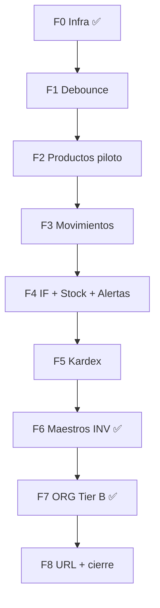

# FRONTEND_PERF_IMPLEMENTATION_PLAN.md

**Fecha:** 15 junio 2026  
**Alcance:** ORG + INV — PERF-01…06  
**Prerequisito:** `FRONTEND_PERF_AUDIT.md` aprobado  
**Estado:** **Fase 0 implementada** — ver `FRONTEND_PERF_PHASE0_AUDIT.md`  
**Fuente de verdad:** `FRONTEND_LISTADOS_CONTRACT_V1.md`

**Restricciones respetadas en este plan:**

- No modificar lógica de negocio, workflows, formularios, RBAC, navegación de rutas, layouts generales ni contratos API
- Solo paginación, búsqueda, filtros, sorting, reutilización de listas y escalabilidad
- ORG/INV como referencia para futuros módulos ERP

---

## 1. Objetivo del plan

Entregar una **plataforma de listados reutilizable** en el stack actual (React Query + Axios + TypeScript) que permita migrar las 16 superficies de listado ORG/INV sin reescribir Plantilla A/B ni romper gates V2 (ME-04, SR-01/02, ES-01, SK-01, RB-ROW).

Al cierre de todas las fases:

| PERF | Criterio de done |
|------|------------------|
| **01** | Tier B/C usan `page`+`limit`; envelope normalizado |
| **02** | Búsquedas server con debounce 350 ms + abort |
| **03** | Toolbar unificada con filtros, limpiar, `solo_activos` |
| **04** | Sort server `sort_by`/`sort_dir`; whitelist por recurso |
| **05** | Componentes/hooks compartidos; tablas sin duplicar shell |
| **06** | Tier C sin full-load; sin filter/sort in-memory en paginados |

---

## 2. Arquitectura propuesta

### 2.1 Principios de diseño

1. **Capa core agnóstica de módulo** — types, normalización, hook base, UI primitivos
2. **Capa módulo delgada** — services existentes extendidos; hooks actuales envuelven `useErpList`
3. **Migración página a página** — cada pantalla conserva su `<tbody>`/columnas; solo extrae shell (toolbar, paginador, sort headers)
4. **Compatibilidad legacy** — sin `page` el backend sigue devolviendo `list[]`; normalizar en cliente para UI única
5. **No tocar** modales CRUD, B-L workflow, B-F forms, `PermissionGuard`, `*CompanyRouteGuard`

### 2.2 Organización de carpetas (propuesta)

```
src/
├── core/
│   └── list/
│       ├── erp-list.types.ts          # ErpPaginatedResponse<T>, ErpListQuery, tier
│       ├── erp-list-normalize.ts      # isPaginated(), normalizeListResponse()
│       ├── useErpListQuery.ts         # Hook genérico React Query
│       ├── useDebouncedSearch.ts      # Wrapper useDebounce + trim
│       ├── useErpListUrlState.ts      # sync page/limit/buscar/sort/filtros ↔ URL
│       └── erp-list.constants.ts      # DEFAULT_LIMIT=50, DEBOUNCE_MS=350
│
└── shared/
    └── components/
        └── erp-list/
            ├── ErpListToolbar.tsx      # Slots: search, filters, actions
            ├── ErpSearchInput.tsx      # Debounced; extiende patrón IamSearchInput
            ├── ErpPagination.tsx       # pagina_actual / total_paginas / total
            ├── ErpSortableHeader.tsx   # Click → sort_by/sort_dir
            ├── ErpListTableShell.tsx   # Skeleton + error + empty wrapper (ES-01/SK-01)
            └── index.ts
```

**Decisión:** ubicar en `shared/components/erp-list/` (alineado con Anexo EXT-01 V2 — prefijo `Erp*`). No mover `IamSearchInput`; `ErpSearchInput` lo compone.

**Decisión aprobada (jun 2026):** **NO** implementar `ErpDataTable` genérico en Fase 0. Reevaluar cuando **Productos**, **Movimientos** y **Kardex** estén migrados. Las tablas actuales conservan markup de columnas; solo se reutiliza infra shell (toolbar, paginador, sort header, skeleton/empty).

### 2.3 Types (`erp-list.types.ts`)

```typescript
/** Contrato FRONTEND_LISTADOS_CONTRACT_V1 §3 */
export interface ErpPaginatedResponse<T> {
  items: T[];
  total: number;
  pagina_actual: number;
  total_paginas: number;
  limit: number;
}

export interface ErpListQueryBase {
  page?: number;
  limit?: number;
  buscar?: string;
  sort_by?: string;
  sort_dir?: 'asc' | 'desc';
  solo_activos?: boolean;
}

export type ErpListTier = 'A' | 'B' | 'C';

export interface ErpListResourceConfig {
  tier: ErpListTier;
  sortableColumns: readonly string[];
  defaultSort?: { sort_by: string; sort_dir: 'asc' | 'desc' };
  defaultLimit?: number;
  forcePagination?: boolean; // true Tier C
  searchPlaceholder?: string;
}
```

### 2.4 Normalización (`erp-list-normalize.ts`)

```typescript
export function isPaginated<T>(data: unknown): data is ErpPaginatedResponse<T> { ... }

export function normalizeListResponse<T>(
  data: T[] | ErpPaginatedResponse<T>,
  tier: ErpListTier,
): ErpPaginatedResponse<T> {
  if (isPaginated<T>(data)) return data;
  // Modo legacy list[] → envelope sintético para UI (Tier A / transición)
  return {
    items: data,
    total: data.length,
    pagina_actual: 1,
    total_paginas: 1,
    limit: data.length,
  };
}
```

### 2.5 Hook `useErpListQuery`

Responsabilidades:

| Responsabilidad | Detalle |
|-----------------|---------|
| Estado lista | `page`, `limit`, `buscar` (debounced), `sort_by`, `sort_dir`, filtros extra |
| queryKey | Incluye tenant + `scopeEmpresaId` (ME-04) + todos los scalars |
| queryFn | Llama service; normaliza respuesta |
| Tier C | Inicializa `page=1`, `limit=50`; `forcePagination: true` |
| Reset | `setBuscar` / filtro → `page=1` |
| enabled | Respeta gate externo (`useInvCompanyQueryGate`, etc.) |
| staleTime | Hereda módulo (30s INV) |

**Firma propuesta:**

```typescript
function useErpListQuery<T, F extends ErpListQueryBase>(options: {
  queryKeyPrefix: readonly unknown[];
  fetcher: (params: F) => Promise<T[] | ErpPaginatedResponse<T>>;
  filters: F;
  config: ErpListResourceConfig;
  enabled?: boolean;
  debouncedBuscar?: string;
}): {
  data: ErpPaginatedResponse<T>;
  items: T[];
  isLoading: boolean;
  isError: boolean;
  error: Error | null;
  page: number;
  setPage: (p: number) => void;
  limit: number;
  setLimit: (n: number) => void;
  sort: { sort_by?: string; sort_dir?: 'asc' | 'desc' };
  setSort: (sort_by: string, sort_dir: 'asc' | 'desc') => void;
  refetch: () => void;
}
```

### 2.6 Servicios — patrón de extensión

**No reemplazar** métodos existentes. Extender params y return type:

```typescript
// org.service.ts — ejemplo centroCostoService.list
list: async (params?: OrgCompanyListParams & ErpListQueryBase): Promise<
  CentroCosto[] | PaginatedCentroCostoResponse
> => {
  const { data } = await api.get(`${BASE}/centros-costo`, { params: buildListQuery(params) });
  return data;
}
```

`buildListQuery` ampliado:

```typescript
function buildListQuery(params?: ...): Record<string, string | number | boolean> {
  const q = { solo_activos: params?.solo_activos ?? true };
  if (params?.buscar) q.buscar = params.buscar;
  if (params?.page != null) { q.page = params.page; q.limit = params.limit ?? 50; }
  if (params?.sort_by) { q.sort_by = params.sort_by; if (params?.sort_dir) q.sort_dir = params.sort_dir; }
  return q;
}
```

Mismo patrón en `inv.service.ts` para los 10 endpoints operativos.

### 2.7 Componentes propuestos

#### `ErpSearchInput`

- Composición sobre `IamSearchInput` (preserva SR-01 estilo)
- Props: `value`, `onDebouncedChange`, `debounceMs=350`
- Estado local `inputValue` + `useDebounce` interno

#### `ErpPagination`

- Props: `pagina_actual`, `total_paginas`, `total`, `limit`, `onPageChange`, `onLimitChange?`
- **Sin** `has_next`/`has_prev` (contrato §2)
- Tokens Capa 1 (`bg-surface`, `border-border-base`, `text-text-base`)

#### `ErpSortableHeader`

- Props: `column`, `label`, `sortableColumns`, `currentSort`, `onSort`
- Ciclo: asc → desc → (opcional) clear
- Solo renderiza indicador si `column ∈ sortableColumns`

#### `ErpListToolbar`

- Layout `flex justify-between` (TB-01 compatible)
- Slots: `left` (search + filters), `right` (actions Crear, etc.)
- Botón «Limpiar filtros» cuando hay estado activo
- **No** incluye selector empresa (ME-02)

#### `ErpListTableShell`

- Envuelve: `InvTableSkeleton` | error | children (tabla) | `IamTableEmptyState`
- Props: `colSpan`, `loading`, `error`, `isEmpty`, `hasSearch`
- Elimina copy-paste skeleton/error/empty en 16 páginas

#### `ErpDataTable` — **fuera de alcance hasta Fase 6+**

Contenedor de alto nivel diferido. **Reevaluar** cuando Productos, Movimientos y Kardex estén migrados.

---

## 3. Estrategia de migración — orden aprobado (jun 2026)

### Fase 0 — Infraestructura compartida ✅ **COMPLETADA**

Ver `FRONTEND_PERF_PHASE0_AUDIT.md`.

| # | Entregable | Estado |
|---|------------|--------|
| 0.1 | Types `ErpPaginatedResponse`, query base | ✅ |
| 0.2 | Normalización list/envelope | ✅ |
| 0.3 | `useErpListQuery` + tests | ✅ 15 tests |
| 0.4 | `ErpSearchInput`, `ErpPagination`, `ErpSortableHeader`, `ErpListToolbar`, `ErpListTableShell` | ✅ |
| 0.5 | `OrgCompanyListParams`, `InvListParams` extendidos | ✅ |
| 0.6 | `buildListQuery` ORG/INV + `orgFetchList` / `invFetchList` | ✅ |

**Sin migración de páginas** en esta fase.

---

### Fase 1 — Debounce ORG + Productos (PERF-02) ✅ COMPLETA

| # | Página | Cambio | Estado |
|---|--------|--------|--------|
| 1.1 | ORG ×6 | `useDebouncedSearch` (350 ms) | ✅ |
| 1.2 | ProductosPage | Debounce antes de `useProductos` | ✅ |

**Auditoría:** `FRONTEND_PERF_PHASE1_AUDIT.md`

**Esfuerzo:** 1–2 días.

---

### Fase 2 — Piloto completo Productos (PERF-01, 02, 04, 05) ✅ COMPLETA

**Página piloto:** `ProductosPage` — page + server `buscar` + sort + `ErpPagination` + shell.

| # | Cambio | Estado |
|---|--------|--------|
| 2.1 | `useErpListQuery` + `invFetchList` vía `useProductosErpList` | ✅ |
| 2.2 | `page=1&limit=50` Tier B (`forcePagination`) | ✅ |
| 2.3 | Sort whitelist: `codigo_sku`, `nombre`, `tipo_producto`, `fecha_creacion` | ✅ |
| 2.4 | Filtros toolbar `categoria_id`, `tipo_producto` | ⏳ Fase posterior |
| 2.5 | `ErpPagination` + `ErpSortableHeader` | ✅ |

**Auditoría:** `FRONTEND_PERF_PHASE2_AUDIT.md`

**Esfuerzo:** 2–3 días.

---

### Fase 3 — Movimientos (Tier C) ✅ COMPLETA

**Página:** `MovimientosPage` — validación oficial Tier C.

| # | Cambio | Estado |
|---|--------|--------|
| 3.1 | `useMovimientosErpList` + `useErpListQuery` | ✅ |
| 3.2 | `page=1&limit=50` forzado (Tier C) | ✅ |
| 3.3 | Default sort `fecha_movimiento desc` | ✅ |
| 3.4 | Filtros dominio intactos + reset `page=1` | ✅ |
| 3.5 | `ErpPagination` + `ErpSortableHeader` | ✅ |
| 3.6 | Workflow B-L sin cambios | ✅ |

**Auditoría:** `FRONTEND_PERF_PHASE3_AUDIT.md`

**Esfuerzo:** 2–3 días.

---

### Fase 4 — Inventario físico + Stock + Alertas (Tier C) ✅ COMPLETA

**Páginas:** `InventarioFisicoPage`, `StockPage` (modos Stock + Alertas).

| # | Cambio | Estado |
|---|--------|--------|
| 4.1 | `useInventariosFisicosErpList` | ✅ |
| 4.2 | `useStocksErpList` + `useStockAlertasErpList` | ✅ |
| 4.3 | `page=1&limit=50` Tier C | ✅ |
| 4.4 | `ErpPagination` + sort whitelist | ✅ |
| 4.5 | Workflows IF intactos | ✅ |

**Auditoría:** `FRONTEND_PERF_PHASE4_AUDIT.md`

**Esfuerzo:** 2–3 días.

---

### Fase 5 — Kardex (Tier C) ✅ COMPLETA

**Orden revisado (post F4):** Kardex con gate `producto_id` obligatorio.

| # | Cambio | Estado |
|---|--------|--------|
| 5.1 | `useKardexErpList` + gate `producto_id` | ✅ |
| 5.2 | `page=1&limit=50` Tier C | ✅ |
| 5.3 | Sort whitelist + default `fecha_movimiento desc` | ✅ |
| 5.4 | Selector producto: `useProductos` legacy (auditoría impacto) | ✅ temporal |
| 5.5 | Sin request sin `producto_id` | ✅ |

**Auditoría:** `FRONTEND_PERF_PHASE5_AUDIT.md`

**Pendiente post-F5:** combobox producto paginado (`buscar`+`page`) — reemplazar `useProductos` full-load en selector.

**Esfuerzo:** 2–3 días.

---

### Fase 6 — Maestros INV restantes ✅

Categorías, UnidadesMedida, Almacenes, TiposMovimiento — migrar client `matchesInvCatalogSearch` → server `buscar`.

| # | Entregable | Estado |
|---|------------|--------|
| 6.1 | `useCategoriasErpList` + `CategoriasPage` | ✅ |
| 6.2 | `useUnidadesMedidaErpList` + `UnidadesMedidaPage` | ✅ |
| 6.3 | `useAlmacenesErpList` + `AlmacenesPage` | ✅ |
| 6.4 | `useTiposMovimientoErpList` + `TiposMovimientoPage` | ✅ |
| 6.5 | `matchesInvCatalogSearch` deprecated (4/4) | ✅ |

**Auditoría:** `FRONTEND_PERF_PHASE6_AUDIT.md`

**Esfuerzo:** 3–4 días.

---

### Fase 7 — Centros de costo + Parámetros ORG (Tier B)

#### Parte A — CentrosCostoPage ✅

| # | Entregable | Estado |
|---|------------|--------|
| 7A.1 | `useCentrosCostoErpList` + `CentrosCostoPage` paginado | ✅ |
| 7A.2 | Sort whitelist + `ErpPagination` | ✅ |

**Auditoría:** `FRONTEND_PERF_PHASE7_AUDIT.md` §7

#### Parte B — Spike ParametrosPage (sin migración) ✅

| # | Entregable | Estado |
|---|------------|--------|
| 7B.1 | `FRONTEND_PARAMETROS_PAGINATION_SPIKE.md` | ✅ |
| 7B.2 | Matriz QA Network `vista` + `page` + `sort` | ✅ (pendiente ejecución manual) |
| 7B.3 | Migración `ParametrosPage` (`useParametrosErpList`) | ✅ |
| 7B.4 | Fallback legacy conservado (candidato limpieza) | ✅ |

**Restricción aprobada:** no eliminar fallback hybrid hasta validar  
`GET /org/parametros?vista=efectivo&page=1&limit=50`

**Esfuerzo:** 3–4 días (7A implementado; 7B spike doc; migración parámetros diferida).

---

### Fase 8 — URL sync, chips, 422 sort, cierre referencia

- `useErpListUrlState` (pendiente implementar)
- Chips filtros + limpiar
- Toast 422 `INVALID_SORT_COLUMN`
- AbortController búsqueda
- Guía `docs/frontend/ERP_LIST_PATTERNS.md`

**Esfuerzo:** 2–3 días.

---

### Orden de fases (diagrama)



**Ruta crítica:** F0 → F2 (Productos) → F3 (Movimientos) → F4 (IF/Stock) → **F5 (Kardex)**.

---

## 3.1 Estrategia anterior (supersedida)

Las fases «Piloto Categorias» y «Tier C antes de Productos» quedan **reemplazadas** por el orden aprobado arriba.

---

## 4. Matriz de impacto por pantalla

Leyenda: **C** = complejidad (Baja/Media/Alta), **R** = riesgo (Bajo/Medio/Alto), **D** = dependencias

| Módulo | Página | Tier | Fase | C | R | D | Cambios principales |
|--------|--------|------|------|---|---|---|---------------------|
| ORG | Empresa | A | 1, 8 | Baja | Bajo | F0 | Debounce; sort opcional; shell |
| ORG | Sucursales | A | 1, 8 | Baja | Bajo | F0 | Idem + aux FK intacto |
| ORG | Departamentos | A | 1, 8 | Baja | Bajo | F0 | Idem |
| ORG | Cargos | A | 1, 8 | Baja | Bajo | F0 | Idem |
| ORG | Centros de costo | B | 7 | Media | Medio | F0, F2 | page/limit/sort/buscar debounced |
| ORG | Parámetros | B/H | 7 | **Alta** | **Alto** | F0, spike API | Paginación hybrid; **no** quitar fallback sin validar |
| INV | Productos | B | 1, **2** | Media | Medio | F0 | **Piloto completo** page+buscar+sort |
| INV | Movimientos | C | **3** | **Alta** | **Alto** | F0, F2 | page obligatorio; **no tocar workflow** |
| INV | Kardex | C | **5** | **Alta** | **Alto** | F0, F4 | ✅ gate producto_id; selector legacy |
| INV | Inventario físico | C | **4** | Alta | Alto | F0, F3 | ✅ page; workflow intacto |
| INV | Stock / Alertas | C | **4** | Media | Medio | F0, F3 | ✅ page ambos modos |
| INV | Categorías | B | 6 | Media | Medio | F0, F2 patrón | client→server buscar |
| INV | Unidades medida | B | 6 | Baja | Bajo | F0, F2 | Replicar Productos patrón |
| INV | Almacenes | B | 6 | Media | Medio | F0, F2 | + filtro `sucursal_id` |
| INV | Tipos movimiento | B | 6 | Baja | Bajo | F0, F2 | Replicar patrón |

---

## 5. Dependencias entre fases

Ver diagrama §3 (orden aprobado F0→F8).

---

## 6. Esfuerzo estimado

| Fase | Descripción | Días dev (estimado) | Acumulado |
|------|-------------|---------------------|-----------|
| **0** | Infra core + componentes base | 3–4 | 4 |
| **1** | Debounce ORG + Productos | 1–2 | 6 |
| **2** | INV Tier B (5 maestros) | 3–5 | 11 |
| **3** | INV Tier C (4 superficies + kardex pre-work) | 5–8 | 19 |
| **4** | ORG Tier B + Tier A polish | 3–4 | 23 |
| **5** | URL sync, chips, 422, abort | 2–3 | 26 |
| **6** | Toolbar unificado, docs, QA | 2 | 28 |
| **QA manual** | Regresión ORG/INV Plantilla A/B | 2–3 | 31 |

**Total estimado:** **25–31 días desarrollador** (1 dev full-time), asumiendo sin bloqueos backend.

**MVP usable (Tier C protegido):** F0 + F1 + F2 + F3.1 ≈ **12–15 días**.

---

## 7. Riesgos y mitigaciones por fase

| Fase | Riesgo | Mitigación |
|------|--------|------------|
| 0 | Tipado union response incorrecto | Tests `normalizeListResponse`; validar con OpenAPI schemas |
| 1 | `hasSearch` desincronizado con debounce | `hasSearch` usa término debounced |
| 2 | Regresión RB-ROW catálogos | QA checklist §5.10; no cambiar lógica fila |
| 3 | Romper B-L stacking PB-13/14 | Diff estricto: solo list fetch + paginador; no modal |
| 3.4 | Kardex 422 sin producto | Gate enabled antes de paginar |
| 4 | Parametros hybrid | Spike 0.5d con API `vista=efectivo&page=1`; fallback temporal |
| 5 | URL sync vs ME-09 reset empresa | Reset página lista en `use*ScopeEmpresaReset` |

---

## 8. Criterios de aceptación global

### PERF-01
- [ ] Tier C siempre envía `page` ≥ 1 y `limit` ≤ 100
- [ ] UI muestra `total`, `pagina_actual`, `total_paginas`
- [ ] `limit` nunca se envía sin `page`

### PERF-02
- [ ] Búsquedas server: debounce 300–400 ms
- [ ] Request anterior abortado al cambiar término (fase 5)

### PERF-03
- [ ] Toolbar con `solo_activos`, filtros dominio, limpiar
- [ ] Cambio filtro resetea `page=1`

### PERF-04
- [ ] Solo columnas whitelist son sortables
- [ ] Sin sort in-memory en listas paginadas
- [ ] 422 sort manejado con feedback

### PERF-05
- [ ] `useErpListQuery` usado en ≥14/16 superficies
- [ ] `ErpPagination` + `ErpSearchInput` compartidos
- [x] `matchesInvCatalogSearch` deprecated en 4/4 catálogos

### PERF-06
- [ ] Ningún Tier C hace full-load en producción
- [ ] Kardex no carga catálogo productos completo
- [ ] Documentación patrón para PUR/SLS

---

## 9. Fuera de alcance (explícito)

| Ítem | Motivo |
|------|--------|
| Batch API enriquecimiento producto | No en contrato v1; ticket separado |
| Migrar módulos fuera ORG/INV | Restricción usuario |
| Cambios workflow B-L / form B-F | Restricción usuario |
| PERF en IAM admin / super-admin | Ya parcialmente implementado |
| Actualizar ERP_FRONTEND_STANDARDS_V2 PERF como MUST | V2.2 dejó PERF fuera; ticket documental post-implementación |
| `DataTable` genérico con columnas declarativas | Opcional fase futura; no bloquea PERF |

---

## 10. Aprobación requerida

Antes de escribir código, confirmar:

1. **Orden de fases** (¿aceptar piloto Categorias → Tier C Movimientos?)
2. **Ubicación carpetas** (`core/list` + `shared/components/erp-list`)
3. **MVP vs plan completo** (¿priorizar F0–F3.1 para release intermedio?)
4. **ParametrosPage** — ¿spike backend `vista=efectivo` paginado antes de F4.2?

Tras aprobación, iniciar **Fase 0** en branch dedicado `feat/perf-listados-org-inv`.

---

*Plan generado sin modificación de código fuente — 2026-06-15*
