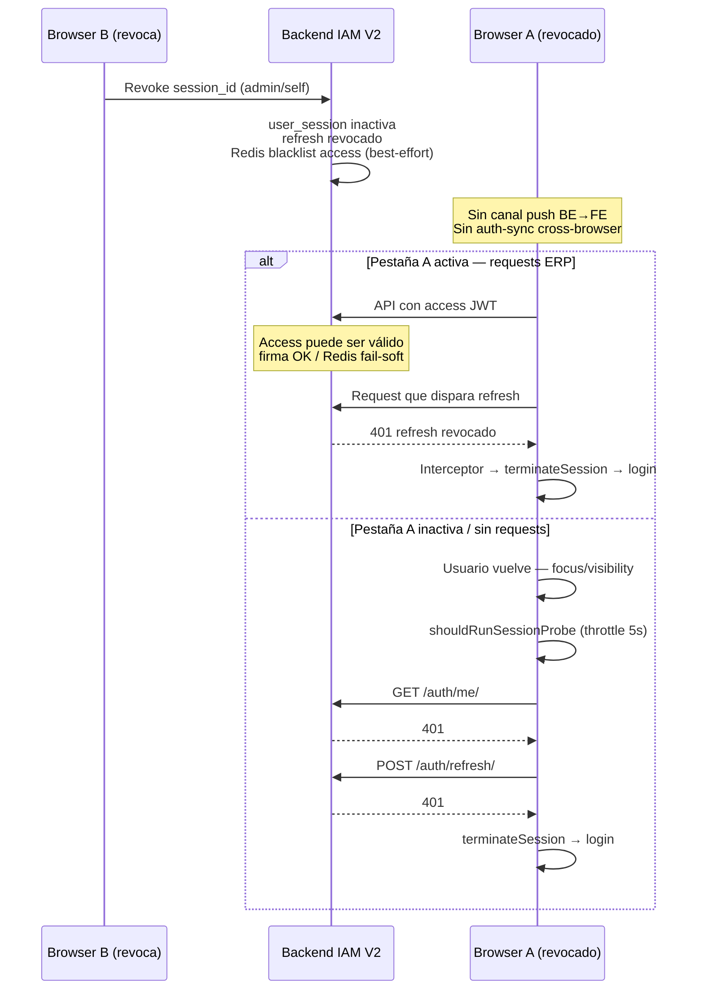

# FRONTEND — Remote Session Detection Architecture Review

**Alcance:** Auditoría arquitectónica READ ONLY — Remote Session Probe  
**Fecha:** 2026-06-23  
**Precedencia:** `IAM_SESSION_MANAGEMENT_V2_BACKEND_SPECIFICATION.md` · `IAM_FE_PHASE_03_TECHNICAL_DESIGN.md` · `POST_CERTIFICATION_FRONTEND_BUG_AUDIT.md` (P1)  
**Modo:** Sin implementación · Sin cambios de código · Sin PR

---

## Resumen ejecutivo

El mecanismo actual de detección de revocación remota es un **patrón híbrido pasivo-proactivo** certificado en IAM-FE-PHASE-03:

1. **Pasivo (primario en pestaña activa):** cualquier request API → 401 → refresh → si refresh revocado → `terminateSession`.
2. **Proactivo (Remote Session Probe):** eventos `visibilitychange` / `focus` → `GET /auth/me/` → misma cadena interceptor.

La latencia observada **~5 segundos** no es un bug: es el **SLA documentado** (`minIntervalMs: 5_000`, criterio V3.3: «≤ 5 s + RTT tras focus/visibility»).

Para un ERP SaaS Enterprise, este diseño es **suficiente y compatible con IAM V2 certificado**, pero **no es la arquitectura óptima** en UX de seguridad cross-browser ni en detección sub-segundo. Se recomienda **mantener el núcleo actual** y **evolucionar en capas** (Fase A sin Backend, Fase B con canal push Backend) en lugar de un reemplazo total inmediato.

**Decisión final:** **MANTENER** Remote Session Probe como baseline V2; **PLANIFICAR EVOLUCIÓN HÍBRIDA** como arquitectura definitiva enterprise.

---

## 1. Auditoría del mecanismo actual

### 1.1 Componentes y responsabilidades

| Componente | Ubicación | Responsabilidad |
|------------|-----------|-----------------|
| **`SessionRemoteProbeBinder`** | `useSessionRemoteProbe.ts` | Componente nulo montado en árbol AuthProvider; delega a `useSessionRemoteProbe`. |
| **`useSessionRemoteProbe`** | `useSessionRemoteProbe.ts` | Registra listeners DOM (`visibilitychange`, `focus`); construye contexto; invoca `evaluateSessionRemoteProbe`. |
| **`shouldRunSessionProbe`** | `session-remote-probe.ts` | Política pura: flags, gates (auth, impersonación, selección, terminating, visible), throttle 5 s, debounce 500 ms. |
| **`evaluateSessionRemoteProbe`** | `useSessionRemoteProbe.ts` | Orquesta skip post-auth-sync-termination + policy + ejecución probe. |
| **`AuthProvider` / `useAuthProvider`** | `useAuthProvider.ts` | Wiring: `remoteProbe.getRuntimeState`, `runSessionValidityProbeForSession`, flag `SESSION_REMOTE_PROBE_ENABLED`. |
| **`AuthProviderPhaseDBinders`** | `auth-provider-telemetry-ux.compositor.tsx` | Monta `SessionRemoteProbeBinder` junto a `AuthSyncListenerBinder`. |
| **`runSessionValidityProbeForSession`** | `auth-provider-termination.compositor.ts` | Callback expuesto en contexto; llama `runSessionValidityProbe` → `authService.me()`. |
| **`runSessionValidityProbe`** | `auth-provider-termination.helpers.ts` | Single-flight; éxito sin mutación; 401 delegado al interceptor. |
| **Interceptor Axios** | `auth-provider-interceptors.compositor.ts` | 401 → refresh → éxito rehidrata; refresh fallido → `terminateSession` (`REFRESH_REVOKED` / `SESSION_EXPIRED`). |
| **`iam-session-revoke.utils`** | admin utils | Post-revoke **solo en cliente que revoca** si `isCurrentSession` → probe inmediato. |
| **`AuthSyncListener` (ortogonal)** | Fase 4 | `BroadcastChannel` `'auth-sync'` — multi-pestaña **mismo navegador**; no cross-browser. |

### 1.2 Flujo completo: Backend revoca → Frontend detecta

#### Escenario A — Browser B revoca sesión de Browser A (cross-browser)



#### Escenario B — Pestaña B revoca; Pestaña A mismo navegador

| Subcaso | Detección en A |
|---------|----------------|
| B revoca **sesión propia** (A es la misma sesión) | Probe en B; A depende de focus/visibility + throttle **o** request pasivo |
| B hace **logout** | A puede recibir `SESSION_TERMINATED` vía auth-sync (Fase 4) — **sub-segundo** |
| B revoca **otra sesión** del listado admin | A **no** recibe auth-sync; solo probe pasivo |

#### Escenario C — Usuario revoca su propia sesión en My Sessions (mismo browser)

`executeSelfSessionRevoke` / `executeActiveSessionRevoke` → si `isCurrentSession` → `runSessionValidityProbe()` **inmediato** (sin esperar 5 s).

### 1.3 Por qué la latencia es aproximadamente 5 segundos

| Factor | Origen | Efecto |
|--------|--------|--------|
| **`minIntervalMs: 5_000`** | `DEFAULT_SESSION_PROBE_POLICY` · `IAM-FE-REMOTE-REVOCATION-THROTTLE-PATCH-01` | Tras un probe, el siguiente no corre hasta ≥ 5 s |
| **`debounceFocusMs: 500`** | Idem | Agrupa ráfagas focus+visibility |
| **Event-driven, no polling** | Fase 03 §14.1 | Sin timer periódico en MVP |
| **`probeOnVisibilityOnly: true`** | Policy | Tab oculta → skip probe |
| **RTT `/auth/me/` + refresh** | Red | Añade ~100–500 ms tras probe permitido |
| **Access JWT residual** | BE fail-soft Redis §12.3 | Requests ERP pueden seguir OK hasta refresh |
| **Criterio V3.3** | Alignment Plan | SLA **aceptado**: «≤ 5 s + RTT» |

**Conclusión:** el ~5 s es **diseño intencional**, no efecto secundario accidental.

### 1.4 Qué NO hace el mecanismo actual

| Capacidad | Estado |
|-----------|--------|
| Polling continuo | ❌ No implementado (P2 opcional 5 min documentado, no cableado) |
| Push Backend → Frontend | ❌ Sin endpoint en contrato V2 |
| Cross-browser sync | ❌ |
| Detección en tab oculta sin requests | ❌ Hasta focus/visibility |
| Probe en impersonación | ❌ Skip explícito (`isImpersonationActive`) |

### 1.5 Coexistencia con Auth-Sync (Fase 4)

| Canal | Alcance | Eventos relevantes |
|-------|---------|-------------------|
| `BroadcastChannel` `'auth-sync'` | Mismo origen, multi-pestaña | `SESSION_TERMINATED`, `SESSION_REFRESHED`, `SESSION_LOGIN`, `EMPRESA_CHANGED` |
| Remote Probe | Por pestaña, cross-browser vía HTTP | Independiente |

Auth-sync **complementa** probe para logout/cambio empresa multi-tab; **no sustituye** revocación remota cross-browser.

---

## 2. Evaluación de alternativas

Escala: ⭐ (1 bajo — 5 alto). «Compat V2» = sin cambiar contrato Backend certificado.

### 2.1 Tabla comparativa

| Alternativa | Complejidad | Escalabilidad BE | Consumo BE | Consumo FE | UX latencia | Multi-tab | Multi-browser | Mobile futuro | Compat V2 |
|-------------|-------------|------------------|------------|------------|-------------|-----------|---------------|---------------|-----------|
| **Actual: Visibility + Focus + `/me/` probe** | ⭐⭐ | ⭐⭐⭐⭐ | ⭐⭐⭐⭐ | ⭐⭐⭐⭐⭐ | ⭐⭐ (~5 s) | ⭐⭐⭐ | ⭐⭐⭐ | ⭐⭐⭐⭐ | ⭐⭐⭐⭐⭐ |
| **BroadcastChannel (auth-sync extendido)** | ⭐⭐ | ⭐⭐⭐⭐⭐ | ⭐⭐⭐⭐⭐ | ⭐⭐⭐⭐⭐ | ⭐⭐⭐⭐⭐ (<100 ms) | ⭐⭐⭐⭐⭐ | ❌ | ⭐⭐⭐ (WebView OK) | ⭐⭐⭐⭐⭐ |
| **Storage events (`localStorage`)** | ⭐⭐ | ⭐⭐⭐⭐⭐ | ⭐⭐⭐⭐⭐ | ⭐⭐⭐⭐ | ⭐⭐⭐⭐ | ⭐⭐⭐⭐ | ❌ | ⭐⭐⭐ | ⭐⭐⭐⭐⭐ |
| **Polling adaptativo (`/me/` intervalo)** | ⭐⭐⭐ | ⭐⭐ | ⭐⭐ | ⭐⭐⭐ | ⭐⭐⭐ (configurable) | ⭐⭐⭐⭐ | ⭐⭐⭐⭐ | ⭐⭐⭐ | ⭐⭐⭐⭐⭐ |
| **Passive-only (solo interceptor 401)** | ⭐ | ⭐⭐⭐⭐⭐ | ⭐⭐⭐⭐⭐ | ⭐⭐⭐⭐⭐ | ⭐ (impredecible) | ⭐⭐⭐ | ⭐⭐⭐ | ⭐⭐⭐⭐ | ⭐⭐⭐⭐⭐ |
| **SSE (Server-Sent Events)** | ⭐⭐⭐⭐ | ⭐⭐⭐ | ⭐⭐⭐ | ⭐⭐⭐⭐ | ⭐⭐⭐⭐⭐ (<1 s) | ⭐⭐⭐⭐⭐ | ⭐⭐⭐⭐⭐ | ⭐⭐⭐ | ⭐ (requiere BE) |
| **WebSockets** | ⭐⭐⭐⭐⭐ | ⭐⭐ | ⭐⭐ | ⭐⭐⭐ | ⭐⭐⭐⭐⭐ | ⭐⭐⭐⭐⭐ | ⭐⭐⭐⭐⭐ | ⭐⭐⭐ | ⭐ (requiere BE) |
| **Push Backend (genérico)** | ⭐⭐⭐⭐ | ⭐⭐⭐ | ⭐⭐⭐ | ⭐⭐⭐ | ⭐⭐⭐⭐⭐ | ⭐⭐⭐⭐⭐ | ⭐⭐⭐⭐⭐ | ⭐⭐⭐⭐ | ⭐ (requiere BE) |
| **Redis Pub/Sub directo FE** | ⭐⭐⭐⭐⭐ | N/A | N/A | N/A | N/A | ❌ | ❌ | ❌ | ❌ inviable |
| **Híbrido A: Probe + auth-sync revoke signal** | ⭐⭐⭐ | ⭐⭐⭐⭐ | ⭐⭐⭐⭐ | ⭐⭐⭐⭐ | ⭐⭐⭐⭐ (same-browser) | ⭐⭐⭐⭐⭐ | ⭐⭐⭐ | ⭐⭐⭐⭐ | ⭐⭐⭐⭐⭐ |
| **Híbrido B: SSE + probe fallback** | ⭐⭐⭐⭐ | ⭐⭐⭐ | ⭐⭐⭐ | ⭐⭐⭐ | ⭐⭐⭐⭐⭐ | ⭐⭐⭐⭐⭐ | ⭐⭐⭐⭐⭐ | ⭐⭐⭐⭐ | ⭐⭐ (extensión BE) |
| **Híbrido C: Polling visible 30–60 s + probe** | ⭐⭐⭐ | ⭐⭐⭐ | ⭐⭐⭐ | ⭐⭐⭐⭐ | ⭐⭐⭐⭐ | ⭐⭐⭐⭐ | ⭐⭐⭐⭐ | ⭐⭐⭐⭐ | ⭐⭐⭐⭐⭐ |

### 2.2 Análisis por alternativa

#### Visibility API + Focus events (componente actual)

**Pros:** Cero infraestructura nueva; compatible V2; bajo consumo; certificado V3.3.  
**Contras:** Latencia acotada inferiormente por 5 s; tab activa sin requests post-revoke sigue operativa; cross-browser lento.

#### BroadcastChannel API

**Pros:** Ya implementado (`auth-sync`); latencia excelente same-browser; sin carga BE adicional.  
**Contras:** No cross-browser; no ayuda Browser B → Browser A distintos; requiere que tab revocadora emita evento (hoy solo probe local en revoke propio).

#### Storage events

**Pros:** Fallback donde BC no existe; patrón similar a tenant-sync.  
**Contras:** Mismos límites multi-browser; más frágil (quota, parsing); duplicación con auth-sync.

#### Polling adaptativo

**Pros:** Acota peor caso cross-browser; configurable; solo `/me/` read-only.  
**Contras:** Carga BE lineal con usuarios conectados; riesgo tormenta si intervalo agresivo; Fase 03 rechazó polling agresivo.

#### SSE / WebSockets / Push Backend

**Pros:** Arquitectura enterprise real-time; cross-browser; UX seguridad superior.  
**Contras:** **Fuera alcance IAM V2 certificado**; requiere diseño BE (canal por usuario/sesión, auth, reconexión, multi-tenant); operación infra (sticky, proxies, mobile background).

#### Redis Pub/Sub

**Pros:** BE ya usa Redis internamente.  
**Contras:** **No expuesto al cliente**; sería anti-patrón conectar FE a Redis; descartado.

#### Passive-only (eliminar probe)

**Pros:** Mínima complejidad.  
**Contras:** Regresión vs GAP-P1-04 cerrado; peor UX V3.3; tab inactiva indefinida.

---

## 3. Compatibilidad IAM Session Management V2

| Requisito V2 | Mecanismo actual | Alternativas compatibles sin BE |
|--------------|------------------|-------------------------------|
| Revocación en BD inmediata | ✅ BE | Todas (detección ≠ revocación) |
| FE detecta vía refresh 401 (FE-05) | ✅ Interceptor | Todas |
| Revoke usa `session_id` (FE-10) | ✅ Admin UI | N/A |
| Sin endpoint push en OpenAPI | ✅ Probe usa `/me/` | BC/polling/probe |
| Fail-soft Redis (L-07) | ⚠ Ventana access residual | Ninguna FE elimina por completo |
| Impersonación sin refresh | ✅ Probe skip soporte | Preservar skip |

**Nota normativa:** El Backend **no garantiza** invalidación instantánea del access JWT en cliente; la detección FE **siempre** será eventual vía validación servidor (`/me/` o refresh).

---

## 4. ¿Sigue siendo la mejor alternativa para Enterprise?

### 4.1 Veredicto por contexto

| Contexto | ¿Mejor alternativa actual? |
|----------|----------------------------|
| **Cumplir contrato IAM V2 certificado** | ✅ Sí — probe + interceptor es la opción correcta |
| **SLA V3.3 documentado (≤ 5 s focus)** | ✅ Sí — cumple por diseño |
| **ERP Enterprise — UX seguridad «instantánea»** | ⚠ No — 5 s + tab activa sin requests es mejorable |
| **Cross-browser admin revoke** | ⚠ No — depende de throttle o actividad API |
| **Multi-tenant SaaS escala 10k+ sesiones concurrentes** | ✅ Sí — bajo coste BE vs push global |
| **Mobile nativo futuro** | ⚠ Parcial — focus/visibility difiere; polling o push más adecuados |

### 4.2 Posición arquitectónica

El diseño actual es la **mejor alternativa dentro del contrato V2 sin extensiones Backend**. No es la **arquitectura definitiva absoluta** para enterprise security UX, pero es **baseline sólida** sobre la que construir.

---

## 5. Recomendación oficial

### 5.1 Arquitectura definitiva propuesta (evolutiva, 3 capas)

```
┌─────────────────────────────────────────────────────────────────┐
│ CAPA 1 — Pasivo (mantener)                                      │
│ Interceptor 401 → refresh → terminateSession                    │
│ Cobertura: toda actividad API natural                           │
└─────────────────────────────────────────────────────────────────┘
                              +
┌─────────────────────────────────────────────────────────────────┐
│ CAPA 2 — Proactivo cliente V2 (mantener + tunear)              │
│ Remote Session Probe: visibility/focus + GET /auth/me/          │
│ Opcional: polling ligero tab visible (30–60 s) — P2 Fase 03     │
│ Auth-sync: SESSION_TERMINATED cross-tab same-browser            │
└─────────────────────────────────────────────────────────────────┘
                              +
┌─────────────────────────────────────────────────────────────────┐
│ CAPA 3 — Push sesión (roadmap BE, no V2)                        │
│ SSE autenticado por usuario/sid: SESSION_REVOKED                │
│ Fallback Capa 1+2 si desconexión                                │
└─────────────────────────────────────────────────────────────────┘
```

### 5.2 Recomendación por fases (sin implementar aquí)

| Fase | Alcance | Backend | Impacto latencia |
|------|---------|---------|------------------|
| **A — Tunear probe V2** | Reducir `minIntervalMs` (ej. 5 s → 2 s); probe al montar tab visible; emitir auth-sync al revocar sesión remota en admin UI (mismo browser) | No | Same-browser: ~instant; cross-browser: 2 s + RTT |
| **B — Polling visible opcional** | `setInterval` condicionado `document.visibilityState === 'visible'` (60 s default, flag) | No | Peor caso cross-browser acotado |
| **C — SSE session events** | `GET /auth/session/events` o similar | **Sí** | Sub-segundo enterprise |

---

## 6. ¿Mantener o reemplazar?

| Pregunta | Respuesta |
|----------|-----------|
| ¿Mantener Remote Session Probe? | **Sí** — como Capa 2 obligatoria mientras no exista push BE |
| ¿Reemplazar totalmente? | **No** — el interceptor pasivo es necesario incluso con SSE |
| ¿Reemplazar throttle 5 s fijo? | **Evaluar en Fase A** — no es sagrado; trade-off carga vs UX |
| ¿Implementar SSE ahora? | **No** — fuera contrato V2; requiere epic Backend |

---

## 7. Impacto y riesgos

### 7.1 Mantener status quo

| Impacto | Detalle |
|---------|---------|
| UX | Usuario revocado puede operar hasta 5 s + ventana access JWT |
| Seguridad | Riesgo acotado — revocación BE efectiva en refresh; fail-soft Redis extiende ventana |
| Certificación | V3.3 cumplido |
| Operaciones | Cero coste infra adicional |

### 7.2 Evolución Fase A (tuning FE)

| Riesgo | Prob. | Mitigación |
|--------|-------|------------|
| Tormenta `/me/` en focus repetido | Media | Mantener single-flight + debounce |
| Carga BE ↑ al bajar throttle | Baja-Media | Métricas; límite mínimo 2 s |
| Regresión Fase 3 tests | Baja | Actualizar V3.3 SLA documental |

### 7.3 Evolución Fase C (SSE)

| Riesgo | Prob. | Mitigación |
|--------|-------|------------|
| Scope creep Backend | Alta | Epic separado post-V2 |
| Conexiones concurrentes | Media | Un stream por usuario autenticado |
| Mobile background | Alta | Fallback probe + push nativo |

---

## 8. Pros y contras consolidados

### Mecanismo actual

| Pros | Contras |
|------|---------|
| Certificado IAM V2 | Latencia ~5 s diseñada |
| Sin dependencia infra push | Cross-browser lento |
| Bajo coste BE/FE | Tab activa sin API post-revoke |
| Single-flight probe | Documentación Architecture V1 §16 parcialmente obsoleta |
| Complementa auth-sync F4 | Polling P2 no implementado |
| Alineado GAP-P1-04 | Fail-soft BE amplía ventana |

---

## 9. Autoauditoría de este documento

| Criterio | Cumple |
|----------|--------|
| READ ONLY — sin cambios código | ✅ |
| Flujo BE → FE documentado | ✅ |
| Responsabilidades por componente | ✅ |
| Explicación latencia ~5 s | ✅ |
| Alternativas evaluadas | ✅ |
| Comparación multidimensional | ✅ |
| Recomendación definitiva | ✅ |
| Mantener vs reemplazar | ✅ |
| Sin propuesta implementación | ✅ |

---

## 10. Decisión final

| # | Decisión |
|---|----------|
| 1 | El mecanismo **Remote Session Probe** cumple el contrato IAM V2 y el SLA V3.3; la latencia ~5 s es **comportamiento diseñado**, no defecto. |
| 2 | Para ERP SaaS Enterprise, **no es la arquitectura óptima absoluta**, pero **sí la mejor opción disponible sin extender Backend**. |
| 3 | **MANTENER** probe + interceptor como baseline obligatorio. |
| 4 | **NO REEMPLAZAR** por push/SSE hasta epic Backend dedicado. |
| 5 | **EVOLUCIONAR** hacia arquitectura híbrida 3 capas: pasivo + probe tunado/auth-sync extendido (Fase A–B, solo FE) → SSE fallback (Fase C, BE). |
| 6 | **Prioridad recomendada:** Fase A (tuning + auth-sync en revoke admin same-browser) antes que SSE; documentar nuevo SLA si se reduce throttle. |
| 7 | Bug P1 post-certificación: **clasificación revisada** — de «bug» a «deuda UX enterprise / SLA V3.3 cumplido»; mejora es **evolución**, no corrección de implementación errónea. |

---

## 11. Referencias

| Documento | Sección relevante |
|-----------|-------------------|
| `src/core/auth/session/session-remote-probe.ts` | `minIntervalMs: 5_000` |
| `src/core/auth/session/useSessionRemoteProbe.ts` | Lifecycle DOM |
| `docs/arquitectura/IAM_FE_PHASE_03_TECHNICAL_DESIGN.md` | §14 Detección proactiva; §26 V3.3 |
| `docs/arquitectura/IAM_SESSION_ALIGNMENT_PLAN_V1.md` | V3.3; ítem 35 |
| `IAM_SESSION_MANAGEMENT_V2_BACKEND_SPECIFICATION.md` | §12.3 fail-soft; §13.4 revocación remota |
| `POST_CERTIFICATION_FRONTEND_BUG_AUDIT.md` | Bug P1 — throttle 5 s |
| `docs/arquitectura/IAM_SESSION_FRONTEND_ARCHITECTURE_V1.md` | §16 (parcialmente pre-Fase 3/4) |

---

*Fin — FRONTEND_REMOTE_SESSION_DETECTION_ARCHITECTURE_REVIEW.md*
