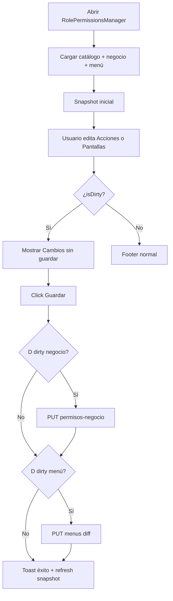

# Plan de implementación — FE-1 IAM UX Foundation

**Fecha:** 31 mayo 2026  
**Fase:** FE-1 (IAM UX Foundation)  
**Estado:** Análisis completado — **sin implementación**  
**Referencias:** `TENANT_ADMIN_IAM_UX_AUDIT.md`, `TENANT_ADMIN_UX_ARCHITECTURE.md`

---

## 1. Objetivo

Mejorar la experiencia UX/UI de **Usuarios**, **Roles** y **Permisos** para un Tenant Admin no técnico, usando **únicamente APIs y contratos existentes**, sin multiempresa avanzada ni cambios en RBAC V1, auth, login ni menús dinámicos.

---

## 2. Restricciones (inviolables)

| Restricción | Implicación en FE-1 |
|-------------|---------------------|
| No modificar APIs | Mismos servicios: `usuario.service`, `rol.service`, `permission.service`, `permisos-negocio.service` |
| No endpoints nuevos | Contadores derivados solo de respuestas actuales o agregación client-side acotada |
| No workarounds multiempresa | Sin campos empresa, filtros empresa ni asignación empresa |
| No cambiar RBAC V1 | Mismos PUT/GET; solo reorganización UI del catálogo y asignación |
| No cambiar login/auth/menú/permisos runtime | Fuera de alcance: `AuthContext`, `PermissionGuard`, `/auth/menu` |
| Compatibilidad backend total | Payloads idénticos en create/update/assign |

---

## 3. Análisis del estado actual

### 3.1 Archivos afectados

| Archivo | Líneas (~) | Problemas principales |
|---------|------------|------------------------|
| `src/features/admin/pages/UserManagementPage.tsx` | 778 | UUID en tabla; `<select multiple>`; modales manuales; empty state plano; error con UUID |
| `src/features/admin/pages/RoleManagementPage.tsx` | 581 | UUID en tabla; sin métricas; modales manuales; sin auth guard en fetch |
| `src/features/admin/components/RolePermissionsManager.tsx` | 642 | Lista plana RBAC; acordeón LBAC; doble guardado; fallo silencioso LBAC |
| Servicios | — | **Sin cambios** de contrato |

### 3.2 Componentes UI reutilizables existentes

| Componente | Ruta | Uso en FE-1 |
|------------|------|-------------|
| `Dialog`, `DialogBody`, `DialogHeader`, `DialogFooter`, `DialogTitle`, `DialogDescription` | `@/shared/components/ui/dialog` | Reemplazar modales `fixed inset-0` manuales |
| `Button` | `@/shared/components/ui/button` | Acciones, tabs, generar contraseña |
| `Checkbox` | `@/shared/components/ui/checkbox` | Lista de roles; permisos RBAC/LBAC |
| `Label`, `TooltipLabel`, `Tooltip` | `@/shared/components/ui/label`, `Tooltip.tsx` | Ayuda nombre_usuario vs correo |
| `ConfirmDialog` | `@/shared/components/ui/ConfirmDialog` | Desactivar usuario / rol |
| `LoadingSpinner` | `@/shared/components/LoadingSpinner` | Carga full-section consistente |
| Patrón tabs | `OrgParametroHybridTabs.tsx` | Modelo para `IamSegmentTabs` (sin radix tabs en repo) |

**No existen en repo:** `Input`, `Tabs`, `Badge`, `ScrollArea`, `EmptyState` shadcn — se crearán **componentes IAM locales mínimos** o clases compartidas, no instalar paquetes nuevos en FE-1 salvo decisión explícita posterior.

### 3.3 Datos disponibles en APIs actuales

| Dato | Fuente | Disponible para tabla roles |
|------|--------|----------------------------|
| Rol `nombre`, `descripcion` | `GET /roles/`, `GET /roles/all-active/` | Sí |
| Rol `descripcion` en assign UI | `getAllActiveRoles()` | Sí (ya en tipo `Rol`) |
| Permisos negocio asignados | `GET /roles/{id}/permisos-negocio/` | Sí — conteo = `array.length` |
| Permisos menú (LBAC) | `GET /permisos/roles/{id}/permisos/` | Sí — conteo = entradas con `puede_ver` |
| Catálogo RBAC agrupable | `GET /permisos-catalogo/` — campos `recurso`, `modulo_id`, `codigo` | Sí — agrupación FE |
| Usuarios por rol | **No en `Rol`**; sí en `UserWithRoles.roles[]` | Agregación client-side acotada |
| `total_usuarios` tenant | `PaginatedUsersResponse.total_usuarios` | Umbral para agregación |

### 3.4 Hallazgos técnicos relevantes para el plan

1. **`useDebounce` duplicado** en User/Role pages; ya existe `@/hooks/useDebounce.ts` y `@/core/utils/debounce.ts`.
2. **LBAC UI** solo expone checkbox `ver`; el backend devuelve `crear/editar/eliminar/exportar/...` — FE-1 **no expande** checkboxes LBAC (fuera del scope explícito); solo reubica en tab “Pantallas”.
3. **`updateRolePermissionsBatch`** envía todos los menús del estado, no solo modificados — FE-1 puede optimizar a **diff** (mismos endpoints PUT individuales).
4. **`puede_crear`** se mapea en GET pero no se envía en PUT batch — **no corregir en FE-1** si implica cambiar semántica RBAC; documentar como deuda FE-2.
5. **RoleManagementPage** no usa guard `authLoading` — alinear con UserManagementPage.

---

## 4. Alcance FE-1

### 4.1 In scope

- UserManagementPage: tabla, modales, roles, contraseña, validaciones, empty states
- RoleManagementPage: tabla, métricas derivadas, modales
- RolePermissionsManager: tabs, búsqueda, agrupación, guardado unificado, dirty state
- Componentes compartidos IAM (`src/features/admin/components/iam/`)
- Utilidades (`password`, agrupación catálogo, contadores)

### 4.2 Out of scope (FE-2+)

- Asignación / columna empresas
- Wizard multi-paso crear usuario
- Filtros por rol/estado en listado
- LBAC checkboxes crear/editar/eliminar
- Invitación por email / reset contraseña
- Reactivar usuario
- Vista “acceso efectivo” agregado
- Page size configurable / paginación numérica
- Tests E2E nuevos (solo checklist manual en FE-1)

---

## 5. Arquitectura propuesta

### 5.1 Nueva estructura de archivos

```
src/features/admin/
├── components/
│   ├── RolePermissionsManager.tsx      # refactor — orquestador
│   └── iam/
│       ├── IamTableEmptyState.tsx        # empty state tabular
│       ├── IamSegmentTabs.tsx            # tabs Acciones | Pantallas
│       ├── IamSearchInput.tsx            # búsqueda con icono
│       ├── RoleCheckboxList.tsx          # selección roles con descripción
│       ├── UserFormFields.tsx            # campos compartidos create/edit
│       ├── RoleStatsCell.tsx             # permisos/usuarios con skeleton
│       └── permissions/
│           ├── RbacPermissionsPanel.tsx  # tab Acciones
│           └── LbacPermissionsPanel.tsx  # tab Pantallas (árbol ver)
├── hooks/
│   ├── useRoleUserCounts.ts              # agregación acotada
│   └── useRolePermissionCounts.ts        # lazy per page
├── utils/
│   ├── generate-secure-password.ts
│   ├── permiso-catalog-groups.ts         # agrupar catálogo RBAC
│   └── permission-dirty-state.ts         # comparar snapshots
└── pages/
    ├── UserManagementPage.tsx            # slim — compone iam/*
    └── RoleManagementPage.tsx            # slim — compone iam/*
```

### 5.2 Principios de diseño

1. **Servicios intactos** — toda lógica HTTP permanece en `services/`.
2. **Presentational components** — componentes `iam/*` reciben datos y callbacks.
3. **Patrón visual ORG** — empty states con icono Lucide 48px + texto + CTA opcional.
4. **Diálogos shadcn** — `DialogContent className="sm:max-w-lg max-h-[90vh] flex flex-col"`.
5. **Accesibilidad mínima** — `role="tablist"`, `aria-selected`, labels en checkboxes.

---

## 6. Especificación por área

### 6.1 UserManagementPage

#### 6.1.1 Tabla — eliminar UUID

| Antes | Después |
|-------|---------|
| Columna `ID` con `usuario_id` UUID | **Eliminar columna** |
| Columna `Usuario` = `nombre_usuario` | Renombrar **“Usuario de acceso”** |
| Columna `Nombre Completo` | Promover a **“Nombre”** (primera columna visible) |

Orden columnas propuesto: **Nombre | Usuario de acceso | Correo | Perfiles (roles) | Estado | Acciones**

#### 6.1.2 RoleCheckboxList (reemplazo select multiple)

**Componente:** `RoleCheckboxList.tsx`

```tsx
interface RoleCheckboxListProps {
  roles: Rol[];
  selectedIds: string[];
  onChange: (ids: string[]) => void;
  disabled?: boolean;
  searchPlaceholder?: string;
}
```

Comportamiento:
- Input búsqueda filtra por `nombre` y `descripcion`
- Cada ítem: `Checkbox` + `nombre` (bold) + `descripcion` (text-sm text-soft, truncada 2 líneas)
- Si `descripcion` vacía: mostrar `codigo_rol` si existe, sino “Sin descripción”
- Scroll `max-h-48 overflow-y-auto border rounded-md p-2`
- Contador: “2 perfiles seleccionados”

APIs: sin cambio — misma lista `getAllActiveRoles()`.

#### 6.1.3 Generar contraseña segura

**Util:** `generate-secure-password.ts`

```ts
export function generateSecurePassword(length = 16): string
```

- `crypto.getRandomValues` — charset `a-z A-Z 0-9 !@#$%&*`
- Botón junto al campo contraseña: icono `RefreshCw` + “Generar”
- Tras generar: input type togglable `password` ↔ `text` (icono `Eye`)
- Hint: “Mínimo 8 caracteres. Comparta la contraseña con el usuario por un canal seguro.”

#### 6.1.4 Validaciones y mensajes

| Campo | Validación FE | Mensaje |
|-------|---------------|---------|
| nombre_usuario | required, trim, min 3 | “El usuario de acceso debe tener al menos 3 caracteres.” |
| correo | required, email regex | Mantener actual |
| contraseña | required create, min 8 | Mantener + hint complejidad opcional |
| nombre/apellido | opcional | — |

**Error parcial create:** reemplazar toast con UUID por:
> “El usuario se creó, pero no se pudieron asignar todos los perfiles. Edite el usuario para completar la asignación.”

Sin mostrar `usuario_id` al admin.

#### 6.1.5 Tooltips (TooltipLabel)

| Campo | Tooltip |
|-------|---------|
| Usuario de acceso | “Identificador para iniciar sesión. Puede ser distinto del correo.” |
| Correo | “Correo electrónico del usuario. Se usa para comunicaciones y recuperación.” |
| Perfiles | “Los perfiles definen qué pantallas y acciones tendrá el usuario.” |

#### 6.1.6 Modales → shadcn Dialog

- **Crear:** `Dialog` + `DialogBody` scroll + `RoleCheckboxList` + botón generar contraseña
- **Editar:** igual; mostrar `nombre_usuario` read-only en `DialogDescription`
- **Desactivar:** migrar a `ConfirmDialog variant="danger"`

#### 6.1.7 Empty state — IamTableEmptyState

Props: `icon`, `title`, `description?`, `actionLabel?`, `onAction?`, `colSpan`

Casos:
- Sin usuarios: icono `Users`, CTA “Crear usuario”
- Búsqueda vacía: icono `Search`, sin CTA, texto diferenciado

#### 6.1.8 Loading

- Tabla: no ocultar toolbar durante carga de roles; spinner solo en tbody o overlay
- Usar `LoadingSpinner` cuando `authLoading`; inline `Loader` en botones submit

**Flujo API create/edit:** sin cambios (POST → N× POST roles / PUT → diff roles).

---

### 6.2 RoleManagementPage

#### 6.2.1 Tabla — eliminar UUID

| Antes | Después |
|-------|---------|
| Columna `ID` | Eliminar |
| `Descripción` truncada | Mantener con `title` tooltip en hover |
| Acciones solo iconos | Añadir `sr-only` labels; opcional texto en `md+` |

Columnas propuestas: **Nombre | Descripción | Perfiles asignados | Permisos | Estado | Acciones**

> “Perfiles asignados” = usuarios con ese rol (ver §6.2.2).

#### 6.2.2 Cantidad de usuarios por rol

**Estrategia (sin API nueva):** hook `useRoleUserCounts`

```ts
function useRoleUserCounts(enabled: boolean): {
  counts: Record<string, number>; // rol_id -> count
  loading: boolean;
  unavailable: boolean; // true si total > umbral
}
```

Algoritmo:
1. Llamar `getUsers(1, 1)` para obtener `total_usuarios`
2. Si `total_usuarios > 100` → `unavailable = true`, celdas muestran “—” + tooltip “Demasiados usuarios para calcular en cliente”
3. Si `total_usuarios <= 100` → paginar con `limit=100` (o loop páginas) y agregar:
   ```ts
   users.forEach(u => u.roles.forEach(r => counts[r.rol_id]++))
   ```
4. Cache en memoria por sesión de página (invalidar tras create/edit user en otra pestaña — aceptable FE-1)

**UI:** `RoleStatsCell` con skeleton mientras `loading`.

#### 6.2.3 Cantidad de permisos

**Hook:** `useRolePermissionCounts(rolIds: string[])`

Para cada `rol_id` visible (máx. 10 por página), en paralelo:
- `getPermisosNegocioByRol(rolId)` → `negocioCount`
- `permissionService.getRolePermissions(rolId)` → `menuCount` = menús con `ver === true`

Mostrar: **`{negocioCount + menuCount}`** o desglosado tooltip: “12 acciones · 8 pantallas”

Optimización:
- Cache `Map<rolId, counts>` 
- No refetch si ya en cache salvo post-save permisos (`onPermissionsUpdate` invalida)

**Riesgo:** 10 roles × 2 requests = 20 calls al cargar página.  
**Mitigación:** skeleton por celda; `Promise.allSettled`; errores → “—”.

#### 6.2.4 Mejoras tabla adicionales

- Descripción: `max-w-md` con line-clamp-2 en lugar de truncate 1 línea
- Botón permisos: label visible “Permisos” en desktop
- Auth guard en `useEffect` fetch (igual que usuarios)
- Empty state con `IamTableEmptyState` + CTA “Crear rol”
- Modales create/edit → shadcn `Dialog`
- Confirm desactivar/reactivar → `ConfirmDialog`

---

### 6.3 RolePermissionsManager

#### 6.3.1 Estructura con tabs

**Componente:** `IamSegmentTabs`

```tsx
type IamPermissionsTab = 'acciones' | 'pantallas';
const TABS = [
  { id: 'acciones', label: 'Acciones' },
  { id: 'pantallas', label: 'Pantallas' },
];
```

Copy actualizado (`DialogDescription`):
> “Configure qué **acciones** puede ejecutar este perfil en el sistema y qué **pantallas** verá en el menú.”

#### 6.3.2 Tab Acciones (RBAC V1) — `RbacPermissionsPanel`

**Agrupación:** `permiso-catalog-groups.ts`

Prioridad de grupo:
1. `recurso` si presente (ej. `inv.producto`)
2. Else prefijo de `codigo` antes del primer `.` (ej. `inv` de `inv.stock.ver`)
3. Else `modulo_id` o “General”

Estructura UI:
```
🔍 [Buscar permiso...]

▼ Inventario (inv)                    [3/12 seleccionados]
  ☑ Crear productos     inv.producto.crear
  ☐ Eliminar productos  inv.producto.eliminar
```

Funciones:
- `groupPermisoCatalog(catalogo: PermisoCatalogoItem[]): Map<string, PermisoCatalogoItem[]>`
- Búsqueda filtra ítems y **auto-expand** grupos con matches
- Checkbox por permiso (igual API toggle)
- Mostrar `descripcion` debajo del nombre si existe (text-xs)

**Errores:** mantener mensaje 403 explícito `admin.rol.leer`.

#### 6.3.3 Tab Pantallas (LBAC) — `LbacPermissionsPanel`

- Mover contenido actual del acordeón “Configuración avanzada”
- Eliminar acordeón; árbol módulo → sección → menú
- **Solo checkbox Ver** (sin cambio de capacidades FE-1)
- Búsqueda filtra menús por `nombre` en todo el árbol
- Si `loadData` falla permisos menú: **error visible** (no `{}` silencioso)
- Botón “Guardar permisos de menú” **eliminado** del panel — pasa al footer unificado

#### 6.3.4 Guardado unificado

**Footer único:**
```
[⚠ Cambios sin guardar]     [Cancelar]  [Guardar]
```

Estado dirty:
```ts
interface DirtySnapshot {
  negocioIds: string[];      // sorted
  menuPermissions: PermissionState; // normalized
}
```

- Al abrir modal: snapshot inicial
- `isDirty = !deepEqual(current, initial)` por tab o global OR
- **Guardar** secuencia:
  1. Si dirty negocio → `updatePermisosNegocioByRol(rolId, { permiso_ids })`
  2. Si dirty menú → `updateRolePermissionsBatch` solo menús **modificados** (diff vs initial)
  3. Toast único: “Permisos del perfil «{nombre}» guardados.”
  4. Actualizar snapshot; cerrar opcional (mantener abierto post-save FE-1)

**Cerrar con cambios pendientes:** confirmación `ConfirmDialog` “Descartar cambios?”.

**onOpenChange Dialog:** bloquear cierre si `isDirty && !confirm`.

#### 6.3.5 Dialog sizing

```tsx
<DialogContent className="sm:max-w-3xl max-h-[85vh] flex flex-col">
```

---

## 7. Consistencia visual

### 7.1 Clases input estándar (IAM)

Extraer constante en `src/features/admin/components/iam/iam-form-classes.ts`:

```ts
export const iamInputClass = "mt-1 block w-full px-3 py-2 border border-border-base rounded-md ...";
export const iamInputErrorClass = "border-error focus:border-error ...";
```

### 7.2 IamTableEmptyState

Alineado con patrón ORG (`SucursalesPage`):

```tsx
<td colSpan={n} className="px-4 py-12 text-center">
  <Icon className="h-12 w-12 mx-auto mb-3 text-text-soft opacity-70" />
  <p className="text-sm font-medium text-text-soft mb-1">{title}</p>
  {description && <p className="text-xs text-text-faint mb-2">{description}</p>}
  {actionLabel && <Button size="sm" ...>{actionLabel}</Button>}
</td>
```

### 7.3 Tabla admin unificada

| Token | Valor |
|-------|-------|
| Header | `bg-subtle`, `text-xs uppercase text-text-soft` |
| Row hover | `hover:bg-overlay/50` |
| Badges estado | Activo `bg-success/10`, Inactivo `bg-error/10` |
| Pills rol | mantener `bg-info/10 text-info` |

### 7.4 Confirmaciones

Migrar todos los `fixed inset-0` de confirmación a `ConfirmDialog` en User y Role pages.

---

## 8. APIs utilizadas (sin modificación)

| Operación | Método | Endpoint (vía service) |
|-----------|--------|-------------------------|
| Listar usuarios | GET | `/usuarios/` |
| Crear usuario | POST | `/usuarios/` |
| Actualizar usuario | PUT | `/usuarios/{id}/` |
| Desactivar usuario | DELETE | `/usuarios/{id}/` |
| Asignar rol | POST | `/usuarios/{id}/roles/{rol_id}/` |
| Revocar rol | DELETE | `/usuarios/{id}/roles/{rol_id}/` |
| Listar roles paginado | GET | `/roles/` |
| Roles activos | GET | `/roles/all-active/` |
| CRUD rol | POST/PUT/DELETE/POST reactivate | `/roles/...` |
| Catálogo RBAC | GET | `/permisos-catalogo/` |
| Permisos negocio rol | GET/PUT | `/roles/{id}/permisos-negocio/` |
| Permisos menú rol | GET | `/permisos/roles/{id}/permisos/` |
| Actualizar menú rol | PUT | `/permisos/roles/{id}/menus/{menu_id}/` |
| Menú estructura | GET | `menuService.getAuthMenu()` |

---

## 9. Orden de implementación

### Sprint A — Fundamentos compartidos (1–2 días)

| # | Tarea | Entregable |
|---|-------|------------|
| A1 | Crear `iam/` utils y clases CSS | `generate-secure-password.ts`, `permiso-catalog-groups.ts`, `iam-form-classes.ts` |
| A2 | `IamTableEmptyState`, `IamSearchInput`, `IamSegmentTabs` | Componentes base |
| A3 | `RoleCheckboxList` | Lista roles con búsqueda |
| A4 | Reemplazar `useDebounce` local por `@/hooks/useDebounce` | DRY |

### Sprint B — UserManagementPage (1–2 días)

| # | Tarea |
|---|-------|
| B1 | Refactor tabla (columnas, sin UUID) |
| B2 | Dialog create/edit con `UserFormFields` + `RoleCheckboxList` |
| B3 | Generar contraseña + toggle visibilidad |
| B4 | TooltipLabels + validaciones mejoradas |
| B5 | Empty states + ConfirmDialog desactivar |
| B6 | Mensajes error sin UUID |

### Sprint C — RoleManagementPage (1–2 días)

| # | Tarea |
|---|-------|
| C1 | Refactor tabla (columnas, descripción) |
| C2 | `useRoleUserCounts` + umbral 100 |
| C3 | `useRolePermissionCounts` + cache |
| C4 | `RoleStatsCell` en tabla |
| C5 | Dialogs shadcn + ConfirmDialog + empty state |
| C6 | Auth guard en fetch |

### Sprint D — RolePermissionsManager (2–3 días)

| # | Tarea |
|---|-------|
| D1 | Split `RbacPermissionsPanel` + `LbacPermissionsPanel` |
| D2 | Tabs + búsqueda + agrupación catálogo |
| D3 | Dirty state + guardado unificado |
| D4 | Confirmación descartar cambios |
| D5 | Error visible carga LBAC; eliminar logs DEV ruidosos o gatear |
| D6 | Diff save menús (solo modificados) |

### Sprint E — QA y pulido (0.5–1 día)

| # | Tarea |
|---|-------|
| E1 | Checklist manual (§11) |
| E2 | Dark mode smoke test |
| E3 | Responsive modales mobile |
| E4 | `read_lints` en archivos tocados |

**Estimación total:** 5–8 días dev.

---

## 10. Riesgos y mitigaciones

| Riesgo | Probabilidad | Mitigación |
|--------|--------------|------------|
| 20+ requests al cargar roles (conteos permisos) | Alta | Cache; skeleton; solo página actual |
| Agregación usuarios lenta (>100) | Media | Umbral 100; mostrar “—” |
| Guardado unificado falla a medias (negocio OK, menú fail) | Media | Toast específico por paso; no resetear dirty del paso fallido |
| Regresión assign/revoke roles usuario | Baja | No tocar lógica diff; tests manuales |
| Dialog shadcn rompe scroll en mobile | Baja | `DialogBody` + `max-h-[85vh]` |

---

## 11. Criterios de aceptación (DoD)

### UserManagementPage
- [ ] No se muestra UUID en tabla ni toasts
- [ ] Roles seleccionables con checkboxes + descripción
- [ ] Botón generar contraseña produce ≥16 chars
- [ ] Modales usan shadcn Dialog
- [ ] Empty state con icono y CTA crear
- [ ] Tooltips en campos clave
- [ ] Create/edit mantiene mismos payloads API

### RoleManagementPage
- [ ] No se muestra UUID
- [ ] Columna permisos visible (con cache o skeleton)
- [ ] Columna usuarios visible si `total_usuarios <= 100`
- [ ] Modales shadcn + ConfirmDialog
- [ ] Empty state con CTA

### RolePermissionsManager
- [ ] Tabs Acciones | Pantallas funcionales
- [ ] Catálogo RBAC agrupado + buscable
- [ ] Un solo botón Guardar
- [ ] Indicador “Cambios sin guardar”
- [ ] Confirmación al cerrar con dirty
- [ ] Mismos PUT/GET que antes

### General
- [ ] Sin cambios en `services/*` signatures
- [ ] Sin campos multiempresa
- [ ] Sin cambios auth/login/menú runtime

---

## 12. Checklist de prueba manual

| # | Escenario | Resultado esperado |
|---|-----------|-------------------|
| 1 | Crear usuario con 2 roles checkbox | POST + 2 assign OK |
| 2 | Crear usuario, fallo assign simulado | Mensaje sin UUID |
| 3 | Generar contraseña | Campo relleno, ≥8 chars |
| 4 | Buscar rol en create user | Filtra lista |
| 5 | Editar roles usuario | Diff assign/revoke OK |
| 6 | Desactivar usuario | ConfirmDialog |
| 7 | Listado roles con ≤100 users | Conteo usuarios correcto |
| 8 | Abrir permisos rol | Tabs; catálogo agrupado |
| 9 | Buscar permiso RBAC | Filtra grupos |
| 10 | Cambiar permiso + Guardar | PUT negocio; toast único |
| 11 | Cambiar ver menú + Guardar | PUT menús; dirty cleared |
| 12 | Cerrar modal permisos con dirty | Confirmación |
| 13 | 403 catálogo permisos | Mensaje admin.rol.leer |

---

## 13. Diagrama de flujo — guardado unificado permisos



---

## 14. Mockup conceptual post FE-1

### Crear usuario (Dialog)

```
┌─ Crear usuario ──────────────────────────────────────── ✕ ─┐
│  Registre una persona que accederá al sistema.             │
├────────────────────────────────────────────────────────────┤
│  Nombre              [________________]                    │
│  Apellido            [________________]                    │
│  Usuario de acceso ⓘ [________________]                    │
│  Correo ⓘ            [________________]                    │
│  Contraseña ⓘ        [________________] [Generar] [👁]    │
│                                                            │
│  Perfiles de acceso ⓘ                                      │
│  🔍 Buscar perfil…                                         │
│  ┌──────────────────────────────────────────────────────┐  │
│  │ ☑ Gerente operaciones                                │  │
│  │   Acceso a inventario y compras                      │  │
│  │ ☐ Consulta general                                   │  │
│  │   Solo lectura en reportes                           │  │
│  └──────────────────────────────────────────────────────┘  │
│  1 perfil seleccionado                                     │
├────────────────────────────────────────────────────────────┤
│                              [Cancelar]  [Crear usuario]   │
└────────────────────────────────────────────────────────────┘
```

### Permisos de rol (Dialog)

```
┌─ Permisos: Gerente operaciones ─────────────────────── ✕ ─┐
│  Acciones = qué puede hacer · Pantallas = qué ve en menú   │
├────────────────────────────────────────────────────────────┤
│  [ Acciones ]  [ Pantallas ]                               │
│  🔍 Buscar…                                                │
│  ▼ inventario (4/12)                                       │
│    ☑ Crear productos                                     │
│    ☐ Eliminar movimientos                                │
├────────────────────────────────────────────────────────────┤
│  ⚠ Cambios sin guardar          [Cancelar]  [Guardar]      │
└────────────────────────────────────────────────────────────┘
```

---

## 15. Deuda diferida (no FE-1)

| ID | Item | Fase |
|----|------|------|
| D1 | LBAC checkboxes crear/editar/eliminar | FE-2 |
| D2 | `puede_crear` en PUT batch | FE-2 |
| D3 | Multiempresa en usuarios | FE-2 |
| D4 | Endpoint dedicado stats rol | BE+FE |
| D5 | Input shadcn global | Design system |
| D6 | Tests unitarios `permiso-catalog-groups` | FE-1 opcional |

---

## 16. Conclusión

FE-1 es **implementable íntegramente en frontend** con extracción de componentes IAM compartidos, migración a shadcn Dialog/Checkbox/ConfirmDialog, y reorganización de `RolePermissionsManager` en tabs con guardado unificado. Los contadores de roles usan **agregación client-side acotada** (usuarios ≤100, permisos lazy por página) sin nuevos endpoints.

**Próximo paso:** ejecutar Sprint A tras aprobación de este plan.

---

*Documento generado tras análisis de código. No incluye implementación ni commits.*
