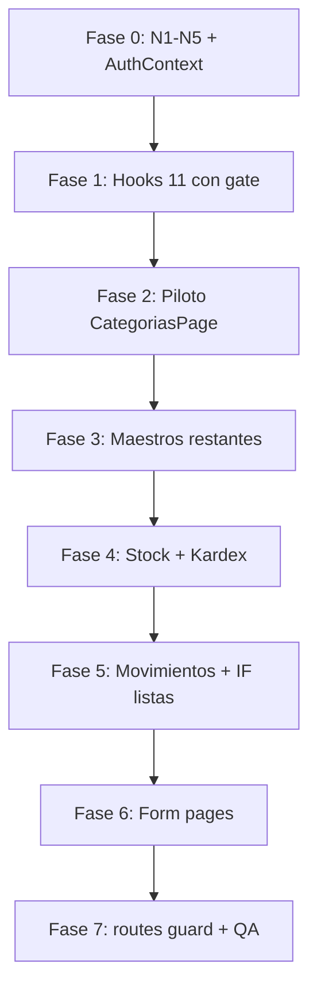

# INV-M0 — Auditoría técnica de implementación (multiempresa JWT)

**Fecha:** 31 mayo 2026  
**Estado:** Solo auditoría — **sin código, sin commit**  
**Norma de referencia:** [`ERP_FRONTEND_STANDARDS_V1.md`](./ERP_FRONTEND_STANDARDS_V1.md)  
**Alcance:** Alineación multiempresa JWT de Inventarios — **exclusivamente** lo listado en INV-M0  
**Fuera de alcance:** B.1.1, `IamTableEmptyState`, toolbar ORG/E-UX, debounce, cambios de contrato API, refactor visual

---

## 1. Objetivo y criterio de éxito

### 1.1 Objetivo

Eliminar la **fuente local** de ámbito empresa en INV y unificar con el patrón ORG:

- `scopeEmpresaId` desde sesión (JWT / `useEmpresaActiva`)
- Sin `<select>` “Todas las empresas” en toolbars
- Sin selector editable de empresa en formularios create (campo sesión readonly)
- Query gates + keys con `scopeEmpresaId`
- Invalidación de caché INV al cambiar empresa
- Guard de ruta equivalente a `OrgCompanyRouteGuard`

### 1.2 Criterio de éxito (comportamiento)

| # | Criterio |
|---|----------|
| E1 | Ninguna página INV muestra selector de empresa en toolbar. |
| E2 | Listados y mutaciones usan `empresa_id` = empresa activa de sesión (mismo valor que header). |
| E3 | Sin empresa activa / `selection_pending` → no queries INV operativas; UI de bloqueo consistente. |
| E4 | Cambiar empresa en header → datos INV corresponden a la nueva empresa (sin filtro local obsoleto). |
| E5 | Formularios create: `empresa_id` en payload = sesión; UI readonly (`OrgSessionEmpresaField` o equivalente). |
| E6 | **Sin cambio** de URLs, métodos, bodies ni responses del API (`inv.service.ts` intacto en forma). |

### 1.3 Cambio de comportamiento aceptado (no es regresión de negocio)

| Antes | Después | Justificación |
|-------|---------|---------------|
| `tenant_admin` podía elegir “Todas las empresas” o otra empresa en toolbar | Solo empresa de sesión | Estándar ME-02; alinea seguridad y JWT |
| `CategoriasPage` / `ProductosPage` podían listar con `empresa_id` vacío (`enabled: true`) | Query deshabilitada sin `scopeEmpresaId` | Cierra fuga cross-company |
| `AlmacenesPage` modal cambiaba `empresaFilter` al cambiar empresa en form | Solo sesión | Elimina desincronización header/lista |

---

## 2. Estado actual (baseline)

### 2.1 Inventario de deuda multiempresa

| Patrón | Ocurrencias INV |
|--------|-----------------|
| `empresaFilter` + `useState` | **11/11** páginas |
| `loadEmpresas` + `empresaService.list` | **11/11** páginas |
| `<option>Todas las empresas</option>` | **9** listados con toolbar select |
| `<select> Empresa *` en modal create | **6** maestros (Categorías, UM, Productos, Almacenes, Tipos mov.) |
| `<select>` empresa en form página | **2** (`MovimientoFormPage`, `InventarioFisicoFormPage`) |
| `useEmpresaActiva` sync parcial | **3** (Categorías, Productos, Stock) |
| Route guard empresa | **0** |
| Query gate en hooks | **0** |
| `invalidateInvQueries` | **0** (solo `queryClient.clear()` global en cambio de token) |

### 2.2 Infraestructura ORG reutilizable (sin mover en M0 — import directo)

| Pieza ORG | Ruta | Uso INV-M0 |
|-----------|------|------------|
| Scope sesión | `useOrgSessionScope` | Fuente de `scopeEmpresaId`, `canQueryCompanyScoped`, `activeEmpresaLabel` |
| Gate queries | `useOrgCompanyQueryGate` | Modelo para `useInvCompanyQueryGate` |
| Acceso company | `canOperateOrgCompanyScope` | Misma regla para `tenant_admin` + `user` |
| Campo sesión | `OrgSessionEmpresaField` | Modales create |
| Body scope | `assertBodyEmpresaMatchesSession` | Submit create maestros |
| Guard UI | `OrgCompanyRouteGuard` | Envolver rutas INV (o wrapper alias) |
| Redirect | `APP_SELECCIONAR_EMPRESA` | Mismo flujo |

**Nota API:** ORG Etapa B omite `?empresa_id` en query (solo JWT). **INV-M0 mantiene** `empresa_id` en query/body vía `inv.service.ts` — valor = `scopeEmpresaId`. No se migra a “solo JWT” en este sprint.

### 2.3 AuthContext y caché

En `cambiarEmpresaActiva` → `applyFullSessionToken`:

```text
queryClient.clear();
invalidateOrgQueries(queryClient);
```

- `clear()` ya vacía queries INV.
- **Falta** `invalidateInvQueries` simétrico a ORG (recomendado para consistencia y futuros cambios sin `clear()` completo).
- `useOrgSessionScope` invalida ORG si `scopeEmpresaId` cambia sin pasar por `clear()` — INV necesita efecto equivalente.

---

## 3. Artefactos nuevos propuestos (INV-M0)

| # | Archivo propuesto | Responsabilidad |
|---|-------------------|-----------------|
| N1 | `src/features/inv/utils/invalidate-inv-queries.ts` | `INV_QUERY_KEY_PREFIX = ['inv']`, `invalidateInvQueries`, opcional `removeInvQueries` |
| N2 | `src/features/inv/hooks/inv-company-query-gate.ts` | `useInvCompanyQueryGate` — espejo de `useOrgCompanyQueryGate` usando `useInvSessionScope` |
| N3 | `src/features/inv/hooks/useInvSessionScope.ts` | Reexporta/adapta `useOrgSessionScope` + `useEffect` → `invalidateInvQueries` al cambiar `scopeEmpresaId` |
| N4 | `src/features/inv/hooks/useInvScopeEmpresaReset.ts` | Espejo `useOrgScopeEmpresaReset` (reset `searchTerm`, filtros locales al cambiar empresa) |
| N5 | `src/features/inv/components/guards/InvCompanyRouteGuard.tsx` | **Opción A:** reexport/wrapper de `OrgCompanyRouteGuard`. **Opción B:** copia con copy “Inventarios” (más desacoplado) |

**Recomendación:** N5 Opción A (wrapper fino) en M0; extraer `ErpCompanyRouteGuard` en v2.

**Modificación AuthContext (1 archivo):** tras `invalidateOrgQueries`, llamar `invalidateInvQueries` — bajo riesgo, alta simetría.

**No crear en M0:** `InvActiveEmpresaBanner` (INV no usa `OrgCompanyToolbar` aún — fuera de alcance UX).

---

## 4. Archivos afectados

### 4.1 Resumen por capa

| Capa | Nuevos | Modificados | Sin cambio |
|------|--------|-------------|------------|
| Infra INV | 4–5 | 0–1 (`AuthContext`) | — |
| `routes.tsx` | 0–1 guard | 1 | — |
| Hooks | 0 | **11** | `inv-query-defaults.ts` |
| Pages | 0 | **11** | — |
| `inv.service.ts` | 0 | 0 | ✅ |
| `inv.types.ts` | 0 | 0 | ✅ |
| Componentes layout | 0 | 0 | `InvPageLayout`, `InvTableSkeleton` |

**Total estimado:** ~**28–30** archivos tocados (5 nuevos + 23–25 modificados).

### 4.2 Hooks (11) — cambio estructural

| Archivo | Cambio |
|---------|--------|
| `categorias.hooks.ts` | Gate interno; `qk.list(scopeEmpresaId, …)`; `enabled` desde gate |
| `unidades-medida.hooks.ts` | Idem |
| `productos.hooks.ts` | Idem |
| `almacenes.hooks.ts` | Idem |
| `stock.hooks.ts` | Idem |
| `tipos-movimiento.hooks.ts` | Idem |
| `movimientos.hooks.ts` | Idem + keys con `scopeEmpresaId` |
| `movimientos-detalle.hooks.ts` | Idem |
| `inventario-fisico.hooks.ts` | Idem |
| `inventario-fisico-detalle.hooks.ts` | Idem |
| `kardex.hooks.ts` | Idem |

**Patrón objetivo (espejo ORG):**

```ts
// Antes (página)
useCategorias({ empresa_id: empresaFilter || undefined, enabled: true });

// Después (página)
useCategorias({ solo_activos: !mostrarInactivos });

// Dentro del hook
const { scopeEmpresaId, enabled } = useInvCompanyQueryGate(options);
queryKey: qk.list(scopeEmpresaId ?? '', soloActivos);
queryFn: () => categoriaService.list({ empresa_id: scopeEmpresaId, solo_activos });
```

**Mutaciones:** mantener `invalidateQueries({ queryKey: ['inv', 'entidad', 'list'] })` — sigue válido; opcional endurecer con prefijo `['inv']` global en invalidación de empresa.

### 4.3 Páginas (11)

| Página | Toolbar | Formulario | Dependencias extra |
|--------|---------|------------|-------------------|
| `CategoriasPage.tsx` | Quitar select + `loadEmpresas` | `OrgSessionEmpresaField`; `assertBody` en create | Columna empresa en tabla: mantener (mismo diseño) |
| `UnidadesMedidaPage.tsx` | Idem | Idem | — |
| `ProductosPage.tsx` | Idem | Idem | Corregir `enabled: true` sin empresa; cascada categorías/UM |
| `AlmacenesPage.tsx` | Idem | Idem; **quitar** `setEmpresaFilter` en onChange empresa modal | `sucursalService.list({ empresa_id: scopeEmpresaId })` |
| `TiposMovimientoPage.tsx` | Idem | Idem | — |
| `StockPage.tsx` | Idem | N/A | Tabs list/alertas |
| `KardexPage.tsx` | Idem | N/A | Filtros producto/almacén gated |
| `MovimientosPage.tsx` | Idem | N/A | Detalle modal; queries dependientes |
| `InventarioFisicoPage.tsx` | Idem | N/A | Aprobar flujo |
| `MovimientoFormPage.tsx` | Quitar `loadEmpresas` | Readonly sesión (create); edit: cargar doc, validar empresa = sesión | Hooks catálogo con `scopeEmpresaId` |
| `InventarioFisicoFormPage.tsx` | Idem | Idem | Idem |

**Eliminar en cada página (cuando aplique):**

- `import { empresaService }` y `useState<Empresa[]>(empresas)`
- `empresaFilter`, `setEmpresaFilter`, `loadEmpresas`, `useEffect` sync
- Bloque JSX `<select>…Todas las empresas…</select>`
- `disabled={!empresaFilter}` en controles → `disabled={!canQueryCompanyScoped}` o confiar en gate

**Añadir en cada página:**

- `const { scopeEmpresaId, canQueryCompanyScoped } = useInvSessionScope()` (o solo en hooks vía gate)
- `useInvScopeEmpresaReset(() => { … })` para resetear búsquedas/filtros locales
- Create: `OrgSessionEmpresaField` + `assertBodyEmpresaMatchesSession` antes de `mutateAsync`

### 4.4 Rutas

| Archivo | Cambio |
|---------|--------|
| `src/features/inv/routes.tsx` | Envolver **todas** las rutas (incl. form pages) con `InvCompanyRouteGuard` + `Suspense` |

Estructura objetivo:

```tsx
<Route path="productos" element={
  <InvCompanyRouteGuard>
    <Suspense>…</Suspense>
  </InvCompanyRouteGuard>
} />
```

### 4.5 Archivos explícitamente fuera de alcance

| Archivo | Motivo |
|---------|--------|
| `inv.service.ts` | Contrato API intacto |
| `inv.types.ts` | Sin cambio de tipos |
| `InvPageLayout.tsx` | Sin cambio visual |
| `InvTableSkeleton.tsx` | INV-M1+ |
| Tests existentes | Solo si fallan por mocks de empresa (evaluar en implementación) |

---

## 5. Plan por entidad / vista

### 5.1 Maestros (modal CRUD)

| Entidad | Página | Hook | Prioridad | Notas |
|---------|--------|------|-----------|-------|
| Categorías | `CategoriasPage` | `useCategorias` | P1 | Hoy `enabled: true` sin empresa — **riesgo alto** |
| Unidades medida | `UnidadesMedidaPage` | `useUnidadesMedida` | P1 | — |
| Productos | `ProductosPage` | `useProductos` + `useCategorias` + `useUnidadesMedida` | P1 | Mayor superficie; validar cascada FK |
| Almacenes | `AlmacenesPage` | `useAlmacenes` | P2 | Sucursales ORG `sucursalService` por `scopeEmpresaId` |
| Tipos movimiento | `TiposMovimientoPage` | `useTiposMovimiento` | P2 | — |

### 5.2 Solo lectura

| Entidad | Página | Hooks | Prioridad |
|---------|--------|-------|-----------|
| Stock | `StockPage` | `useStocks`, `useStockAlertas` | P2 |
| Kardex | `KardexPage` | `useKardex`, `useProductos`, `useAlmacenes` | P3 |

### 5.3 Transaccionales — listas

| Entidad | Página | Hooks | Prioridad |
|---------|--------|-------|-----------|
| Movimientos | `MovimientosPage` | `useMovimientos`, `useTiposMovimiento`, `useAlmacenes`, detalle | P3 |
| Inventario físico | `InventarioFisicoPage` | `useInventarioFisico`, `useAlmacenes`, detalle | P3 |

### 5.4 Transaccionales — formulario página completa

| Entidad | Página | Hooks | Prioridad |
|---------|--------|-------|-----------|
| Movimiento | `MovimientoFormPage` | `useMovimientoConDetalle`, `*ConDetalle`, catálogos | P4 |
| Inventario físico | `InventarioFisicoFormPage` | Análogo | P4 |

**Orden recomendado:** Infra (N1–N5) → P1 (Categorías piloto) → UM → Productos → Almacenes → Tipos → Stock/Kardex → Movimientos/IF lista → Form pages → `routes.tsx` + AuthContext → QA.

---

## 6. Estrategia de migración

### 6.1 Enfoque: “infra primero, piloto, oleadas”



### 6.2 Fase 0 — Infraestructura (bloqueante)

1. Crear `invalidate-inv-queries.ts`, `useInvSessionScope.ts`, `inv-company-query-gate.ts`, `useInvScopeEmpresaReset.ts`.
2. Crear `InvCompanyRouteGuard` (wrapper).
3. (Recomendado) `AuthContext`: `invalidateInvQueries` junto a `invalidateOrgQueries`.

**Verificación:** imports compilan; hook de scope devuelve mismos valores que ORG en página de prueba manual.

### 6.3 Fase 1 — Hooks (sin tocar UI aún)

Actualizar los 11 hooks para usar `useInvCompanyQueryGate` y keys con `scopeEmpresaId`.

**Riesgo:** páginas aún pasan `empresa_id` — ignorar o eliminar en fase 2. Hooks deben **no** depender de `options.empresa_id` externo tras fase 2.

### 6.4 Fase 2 — Piloto `CategoriasPage`

- Menor complejidad; una entidad; columna empresa opcional.
- Validar: guard, create con `OrgSessionEmpresaField`, listado tras cambio header.

### 6.5 Fases 3–6 — Oleadas por tabla §5

Cada página en un PR lógico o commits atómicos por oleada (según preferencia del equipo).

### 6.6 Fase 7 — Rutas + QA

- Envolver todas las rutas en `InvCompanyRouteGuard`.
- Smoke ME-01…ME-06 (§8).

### 6.7 Estrategia de rollback

| Nivel | Acción |
|-------|--------|
| Por página | Revertir commits de página + hook asociado |
| Infra | Mantener archivos nuevos si páginas parciales migradas — feature flag **no** recomendado (complejidad) |
| Preferencia | Migrar **todas** las páginas en una rama INV-M0 antes de merge |

### 6.8 Convivencia temporal (evitar)

No dejar mitades del módulo con `empresaFilter` y mitades con `scopeEmpresaId` en producción — confusión QA y datos mixtos.

---

## 7. Riesgos y mitigaciones

| ID | Riesgo | Sev. | Mitigación |
|----|--------|------|------------|
| R1 | `ProductosPage` / `CategoriasPage` listan sin `empresa_id` hoy | **Alta** | Gate `enabled` false sin scope; priorizar P1 |
| R2 | `tenant_admin` pierde vista “todas las empresas” | Media | Esperado por estándar; cambiar empresa en header |
| R3 | `AlmacenesPage` sucursales vacías si no hay scope | Media | Cargar sucursales solo con `scopeEmpresaId` |
| R4 | Edit movimiento de otra empresa (URL directa) | Media | API 403 + mensaje; guard + validar `d.empresa_id === scopeEmpresaId` |
| R5 | Acoplamiento INV → `features/org` (SessionField, guard) | Baja | Aceptado M0; extraer `erp-shared` en v2 |
| R6 | `queryClient.clear()` en cambio empresa enmascara falta de invalidate INV | Baja | Añadir `invalidateInvQueries` igual que ORG |
| R7 | Columna “Empresa” en Categorías redundante | Baja | Mantener diseño M0; quitar en M1 UX si se desea |
| R8 | Tests / Storybook con mocks `empresaFilter` | Media | Actualizar mocks en mismo sprint |
| R9 | Regresión permisos `tenant_admin` en INV | Media | Reutilizar `canOperateOrgCompanyScope` vía scope hook |
| R10 | Form pages: `empresaId` state vs sesión en edit | Media | Create = sesión; edit = readonly desde documento, no select |

---

## 8. Dependencias

### 8.1 Dependencias internas (hard)

| Dependencia | Motivo |
|-------------|--------|
| `AuthContext` + `useEmpresaActiva` | `scopeEmpresaId` |
| `useOrgSessionScope` / lógica equivalente | Gates y labels |
| `org.service` `sucursalService` | `AlmacenesPage` |
| `OrgSessionEmpresaField` | Modales create |
| `org-body-scope` `assertBodyEmpresaMatchesSession` | Submit create |
| `OrgCompanyRouteGuard` o copia | Rutas |
| `post-login-path` `APP_SELECCIONAR_EMPRESA` | Redirect |

### 8.2 Dependencias que NO se tocan

| Módulo | Relación |
|--------|----------|
| Backend INV API | Sin cambio contrato |
| ORG páginas | Sin refactor |
| IAM / admin | Sin cambio |
| Menú / permisos INV | Sin cambio |

### 8.3 Dependencia posterior (INV-M1+)

| Item | Relación con M0 |
|------|-----------------|
| B.1.1 | Independiente; puede ir después |
| E-UX toolbar/empty | Requiere M0 estable (sin doble fuente empresa) |

---

## 9. Checklist QA INV-M0 (post-implementación)

### 9.1 Multiempresa (estándar §3)

| # | Caso | Perfil | Esperado |
|---|------|--------|----------|
| M1 | Entrar `/app/inv/productos` con empresa en header | `user` / `tenant_admin` | Lista carga; **sin** select empresa en toolbar |
| M2 | Cambiar empresa en header | Multiempresa | Lista refresca datos de nueva empresa |
| M3 | Sin empresa / `selection_pending` | Usuario pendiente | Guard INV; redirect o mensaje igual ORG |
| M4 | `tenant_admin` | — | Acceso INV con empresa activa; no “todas” |
| M5 | Crear categoría | MANAGER | Modal: empresa readonly; payload `empresa_id` = sesión |
| M6 | Hover campos | — | Sin UUID en tooltip (E-ME4 vía `OrgSessionEmpresaField`) |

### 9.2 Por entidad (muestreo)

| # | Vista | Verificar |
|---|-------|-----------|
| E1 | Categorías | CRUD completo una empresa |
| E2 | Productos | Filtros categoría/UM solo de empresa sesión |
| E3 | Almacenes | Sucursales filtradas por sesión |
| E4 | Stock / Kardex | Sin select toolbar; datos coherentes |
| E5 | Movimiento nuevo | Empresa sesión en POST `con-detalle` |
| E6 | IF editar | Misma regla empresa |

### 9.3 No regresión explícita M0

| # | No debe ocurrir |
|---|----------------|
| N1 | Cambio de columnas, skeletons, empty states IAM |
| N2 | B.1.1 / discard dialogs nuevos |
| N3 | Cambio URLs API o servicios |

---

## 10. Estimación y entregables de implementación (referencia)

| Fase | Esfuerzo orientativo |
|------|---------------------|
| Fase 0 Infra | 0.5 día |
| Fase 1 Hooks | 1 día |
| Fases 2–6 Páginas | 2–3 días |
| Fase 7 QA | 0.5–1 día |
| **Total** | **4–5.5 días** (1 dev familiarizado con ORG) |

**Entregables código (futuro, fuera de este documento):**

- PR `feat(inv-m0): multiempresa JWT alignment`
- Actualización breve en `docs/frontend/auditoria/AUDITORIA_FRONTEND_INV.md` (sección multiempresa)
- Sin actualizar `.cursorrules` / PROMPT hasta cierre QA (según `RULES_EVOLUTION_AUDIT.md`)

---

## 11. Confirmación de alcance INV-M0

| Requisito usuario | Cubierto en plan |
|-------------------|------------------|
| Eliminar selectores locales toolbar | §4.3, §5 |
| Eliminar “Todas las empresas” | §2.1, §5 |
| `scopeEmpresaId` desde sesión | §3, N2–N3 |
| Invalidación queries | N1, §2.3, AuthContext |
| Query gates ORG-equivalent | N2, §4.2 |
| Formulario readonly sesión | §4.3, §5 |
| Guards | N5, §4.4 |
| Mantener diseño visual INV | §1.3, fuera E-UX |
| No B.1.1 / empty / toolbar ORG | §1, §4.5 |
| Sin cambio API | §1.2 E6, §4.5 |

---

*Auditoría técnica INV-M0. Sin código. Sin commit. Norma: ERP_FRONTEND_STANDARDS_V1.*
