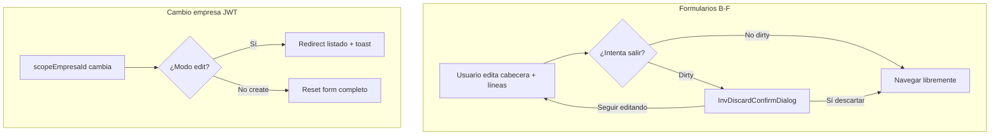

# INV-M2-SEC — Auditoría seguridad UX y protección de datos (formularios transaccionales)

**Fecha:** 31 mayo 2026  
**Estado:** Solo auditoría — sin implementación, sin commit  
**Prerequisitos cerrados:** INV-M0-b (multiempresa JWT), INV-M1-UX-A (catálogos), INV-M1-UX-B (B-O1 Stock UUID, B-O2 Kardex deep-link)  
**Alcance:** Cuatro pantallas transaccionales INV:

| Pantalla | Archivo | Clase |
|----------|---------|-------|
| Movimientos (lista) | `src/features/inv/pages/MovimientosPage.tsx` | B-L |
| Movimiento (formulario) | `src/features/inv/pages/MovimientoFormPage.tsx` | B-F |
| Inventario físico (lista) | `src/features/inv/pages/InventarioFisicoPage.tsx` | B-L |
| Inventario físico (formulario) | `src/features/inv/pages/InventarioFisicoFormPage.tsx` | B-F |

**Referencias:** [`ERP_FRONTEND_STANDARDS_V1.md`](./ERP_FRONTEND_STANDARDS_V1.md) §9 B.1.1 · §11 cabecera+detalle · [`ORG_SPRINT_E_ESEC_AUDIT.md`](./ORG_SPRINT_E_ESEC_AUDIT.md) · [`INV_M1_UX_B_AUDIT.md`](./INV_M1_UX_B_AUDIT.md) §6

**Fuera de alcance:** Catálogos INV (M1-UX-A), Stock/Kardex, cambios API, commits, código.

---

## 1. Resumen ejecutivo

| Métrica | Valor |
|---------|--------|
| Superficies con formulario editable | **2** páginas completas (B-F) + **2** `ConfirmDialog` con campos (aprobar IF, anular movimiento) |
| Superficies solo lectura | **2** modales detalle (B-L) |
| Cumplimiento B.1.1 | **0 / 4** en alcance transaccional |
| Hallazgos **Obligatorio** | **6** |
| Hallazgos **Recomendado** | **7** |
| Hallazgos **Mantener** | **8** grupos |

**Veredicto:** Las pantallas transaccionales INV cumplen el patrón funcional §11 (cabecera + líneas, `con-detalle`, multiempresa JWT en create) pero **no implementan protección de datos al salir** ni **contención de contexto empresa** en edición. El riesgo principal no es RBAC ni API sino **pérdida silenciosa de trabajo** en formularios B-F y **operación sobre documento de otra empresa** tras cambio de sesión.

**Patrón de referencia:** ORG post E-SEC (`DepartamentosPage`, `createOrgDiscardHandlers`, `OrgDiscardConfirmDialog`, `form-dirty/*`). INV no tiene equivalente (`src/features/inv/utils/form-dirty/` inexistente).

---

## 2. Patrón B.1.1 — aplicabilidad en INV transaccional

### 2.1 Definición (estándar §9)

B.1.1 exige confirmación antes de descartar cambios en **modales CRUD multi-campo**: cerrar Radix → `ConfirmDialog` discard; bloqueo ESC/click fuera; snapshot en edit; `discardPending` independiente de confirms destructivos (B11-02).

### 2.2 Mapa de aplicabilidad por superficie

| Superficie | ¿Formulario editable? | ¿Aplica B.1.1? | Estado actual |
|------------|----------------------|----------------|---------------|
| Movimientos — modal detalle | No (lectura + botones workflow) | **No** (B11-01) | Sin B.1.1 — **correcto** |
| Movimientos — ConfirmDialog autorizar/procesar | No (solo mensaje) | **No** (B11-02) | Confirm independiente — **correcto** |
| Movimientos — ConfirmDialog anular | Parcial (textarea motivo opcional) | **Parcial** | Cierra y borra motivo sin confirm — ver §4 |
| IF — modal detalle | No | **No** | Sin B.1.1 — **correcto** |
| IF — ConfirmDialog aprobar | Sí (select tipo + textarea obs) | **Parcial** | Cierra y resetea campos sin dirty guard — ver §4 |
| IF — ConfirmDialog anular/finalizar | No (solo mensaje) | **No** (B11-02) | **Correcto** |
| **MovimientoFormPage** | Sí (cabecera + líneas) | **Sí** (adaptación página completa) | **No implementado** |
| **InventarioFisicoFormPage** | Sí (cabecera + líneas) | **Sí** (adaptación página completa) | **No implementado** |

### 2.3 Adaptación B.1.1 a formulario en página completa (§11 CD-04)

El estándar fija formularios transaccionales en **página completa**, no en modal Radix. La intención B.1.1 sigue siendo obligatoria:

| Mecanismo de salida | Comportamiento requerido |
|---------------------|--------------------------|
| Cancelar / Volver (`Link`) | Interceptar si dirty → confirm discard |
| Navegación in-app (sidebar, otra ruta) | `useBlocker` o equivalente RR 6.x |
| Botón atrás del navegador | Mismo blocker |
| Cierre pestaña / refresh (opcional §9) | `beforeunload` si dirty |
| Post-guardado exitoso | Navegar sin confirm — **OK hoy** |
| Submit en curso | Bloquear salida — **parcial** (`disabled` en Guardar, no en links) |

**Conclusión B.1.1:** INV-M2-SEC debe tratar B-F como **primera prioridad obligatoria**. Modales detalle lectura quedan **fuera**. Confirms workflow con campos son **recomendados**, no bloqueantes de cierre M2.

---

## 3. Inventario de estado y flujos actuales

### 3.1 MovimientosPage (`MovimientosPage.tsx`)

```
Estado modal:
  detailOpen, selectedMovimientoId
  autorizarOpen | procesarOpen | anularOpen
  anularMotivo

Reset empresa (useInvScopeEmpresaReset):
  ✅ filtros lista + productosMap
  ❌ no cierra detailOpen ni confirms workflow
  ❌ no limpia selectedMovimientoId ni anularMotivo

Detalle:
  Dialog read-only, onOpenChange cierra sin guard
  Workflow abre ConfirmDialog encima con detailOpen=true

Anular:
  ConfirmDialog + textarea; onClose resetea motivo
```

### 3.2 MovimientoFormPage (`MovimientoFormPage.tsx`)

```
Estado:
  cabecera (8 campos) + lineas[] (producto, UM, cantidades, costo)
  formHydrated (edit) — sin snapshot para dirty

Reset empresa:
  if (isEdit) return;  ← skip total en edición
  create: reset parcial (tipo, almacenes, líneas; NO número/fechas/obs/moneda)

Navegación:
  Link ArrowLeft + Cancelar → /app/inv/movimientos (sin guard)
  Sin useBlocker / beforeunload

Validación guardar():
  return silencioso si faltan campos o líneas — sin toast
```

### 3.3 InventarioFisicoPage (`InventarioFisicoPage.tsx`)

```
Estado modal:
  detailOpen, selectedId
  aprobarOpen (+ aprobarTipoMovimientoId, aprobarObs)
  anularOpen | finalizarOpen

Reset empresa:
  ✅ filtros + productosMap
  ❌ no cierra modals ni limpia aprobar/anular/finalizar state

Aprobar:
  ConfirmDialog con select + textarea
  cerrarAprobar() resetea campos en onClose

Detalle:
  onOpenChange={setDetailOpen} — cierre directo
  Click fila abre detalle (patrón válido B-L)
```

### 3.4 InventarioFisicoFormPage (`InventarioFisicoFormPage.tsx`)

```
Análogo a MovimientoFormPage:
  cabecera + lineas (producto, cant_sistema, cant_contada)
  formHydrated sin snapshot
  reset empresa skip en edit
  Link cancelar/volver sin dirty guard
```

---

## 4. Hallazgos por objetivo de auditoría

### 4.1 Cumplimiento B.1.1

| ID | Hallazgo | Pantalla | Clasificación |
|----|----------|----------|---------------|
| SEC-B11-01 | Formularios B-F sin dirty guard al cancelar/volver/navegar | MovimientoFormPage, InventarioFisicoFormPage | **Obligatorio** |
| SEC-B11-02 | Sin utilidades `inv-form-dirty/*` ni snapshot post-hidratación en edit | B-F | **Obligatorio** (pieza de implementación O1) |
| SEC-B11-03 | Confirm aprobar IF cierra y resetea select/observaciones sin confirm si hubo entrada | InventarioFisicoPage | **Recomendado** |
| SEC-B11-04 | Confirm anular movimiento pierde motivo escrito al cancelar/X | MovimientosPage | **Recomendado** |
| SEC-B11-05 | Modales detalle lectura sin B.1.1 | MovimientosPage, InventarioFisicoPage | **Mantener** |
| SEC-B11-06 | Confirms autorizar/procesar/finalizar/anular (solo mensaje) independientes | Ambas listas | **Mantener** (B11-02) |

### 4.2 Cierres accidentales y pérdida de información

| ID | Escenario | Riesgo | Clasificación |
|----|-----------|--------|---------------|
| SEC-LOSS-01 | Usuario edita cabecera + varias líneas → Cancelar | Pérdida total sin aviso | **Obligatorio** |
| SEC-LOSS-02 | Usuario edita → navega por sidebar a otra pantalla | Pérdida total | **Obligatorio** |
| SEC-LOSS-03 | Usuario edita → botón atrás del navegador | Pérdida total | **Obligatorio** |
| SEC-LOSS-04 | Usuario en create con datos → cambia empresa (header) | Líneas pueden conservar `producto_id` de empresa anterior; cabecera parcialmente stale | **Obligatorio** |
| SEC-LOSS-05 | Usuario rellena aprobar IF → Cancelar confirm | Pierde tipo/observaciones | **Recomendado** |
| SEC-LOSS-06 | Usuario escribe motivo anular → cierra confirm | Pierde texto | **Recomendado** |
| SEC-LOSS-07 | Cierre modal detalle lectura (ESC/overlay) | Sin datos editables — sin pérdida | **Mantener** |

### 4.3 Modales aprobar / anular / finalizar (workflow)

| Acción | Pantalla | Confirm presente | Loading en submit | Validación previa | Clasificación |
|--------|----------|------------------|-------------------|-------------------|---------------|
| Autorizar | Movimientos | ✅ mensaje + variant danger | ✅ | Estado borrador | **Mantener** |
| Procesar | Movimientos | ✅ | ✅ | Estado autorizado | **Mantener** |
| Anular | Movimientos | ✅ + motivo opcional | ✅ | Estados no procesado/anulado | **Mantener** estructura; **Recomendado** dirty en motivo (SEC-B11-04) |
| Aprobar | IF | ✅ + form hijo | ✅ | toast si falta tipo | **Mantener** flujo; **Recomendado** dirty en form hijo (SEC-B11-03) |
| Finalizar | IF | ✅ mensaje | ✅ | Estado en_proceso | **Mantener** |
| Anular | IF | ✅ mensaje | ✅ | No anulado | **Mantener** |

**Nota:** Los confirms destructivos usan `variant="danger"` — distinto del discard B.1.1 (`variant="warning"`). **Mantener** separación semántica.

### 4.4 Navegación atrás, cambio de ruta y cambio de empresa

| ID | Escenario | Comportamiento actual | Clasificación |
|----|-----------|----------------------|---------------|
| SEC-NAV-01 | B-F: Link Volver/Cancelar | Navegación inmediata | **Obligatorio** — interceptar si dirty |
| SEC-NAV-02 | B-F: cambio ruta in-app | Sin blocker | **Obligatorio** |
| SEC-NAV-03 | B-F: edit + cambio empresa JWT | `resetFormOnEmpresaChange` hace `if (isEdit) return`; `formHydrated` no se resetea al cambiar `scopeEmpresaId`; query nueva por empresa pero UI conserva datos hidratados de empresa anterior | **Obligatorio** — redirigir a listado o bloquear edición con mensaje |
| SEC-NAV-04 | B-F: create + cambio empresa | Reset parcial; número/fechas/observaciones/moneda pueden quedar; líneas con FKs inválidas | **Obligatorio** |
| SEC-NAV-05 | B-L: cambio empresa con detalle abierto | Filtros resetean; modal detalle y `selectedId` persisten; query re-fetch con nuevo scope — riesgo mostrar error o documento ajeno brevemente | **Obligatorio** |
| SEC-NAV-06 | B-L: cambio empresa con confirm workflow abierto | Confirm puede quedar huérfano (detalle cerrado manualmente, confirm abierto) | **Recomendado** |
| SEC-NAV-07 | B-L: Link "Editar" desde modal detalle | Navega a B-F — comportamiento intencional | **Mantener** |
| SEC-NAV-08 | B-F: post-save navigate | OK — no dirty tras éxito | **Mantener** |

### 4.5 Dirty state cabecera + detalle (B-F)

| Aspecto | MovimientoFormPage | InventarioFisicoFormPage | Clasificación |
|---------|-------------------|--------------------------|---------------|
| Snapshot tras hidratación edit | ❌ | ❌ | **Obligatorio** |
| Dirty create (vs estado inicial vacío) | ❌ no calculado | ❌ | **Obligatorio** |
| Dirty incluye líneas (add/remove/edit) | ❌ | ❌ | **Obligatorio** |
| Dirty incluye cabecera | ❌ | ❌ | **Obligatorio** |
| `formHydrated` reset solo en cambio de id URL | ✅ | ✅ | **Mantener** mecanismo; extender reset al cambiar empresa |
| Submit bloqueado sin líneas válidas | ✅ (return silencioso) | ✅ (permite detalles vacíos en update) | **Recomendado** feedback toast en validación cliente |
| `assertBodyEmpresaMatchesSession` en create | ✅ | ✅ | **Mantener** |
| `OrgSessionEmpresaField` read-only | ✅ | ✅ | **Mantener** |

**Campos a incluir en util dirty (propuesta implementación):**

| Entidad | Cabecera | Líneas |
|---------|----------|--------|
| Movimiento | numero, tipo, fechas, almacenes, moneda, observaciones | producto_id, unidad_medida_id, cantidad, cantidad_base, costo_unitario |
| Inventario físico | numero, fecha, almacén, tipo, descripción | producto_id, cantidad_sistema, cantidad_contada |

### 4.6 Overlays, confirmaciones y stack de modales

| ID | Hallazgo | Detalle técnico | Clasificación |
|----|----------|-----------------|----------------|
| SEC-STACK-01 | Dialog detalle + ConfirmDialog workflow simultáneos | Radix Dialog y ConfirmDialog ambos `z-50`; confirm se renderiza encima — usable pero detalle permanece `open` | **Recomendado** — cerrar detalle al abrir confirm workflow o cerrar confirms al cerrar detalle |
| SEC-STACK-02 | Sin `scheduleModalStackValidation` en INV | ORG/IAM validan stack en DEV | **Recomendado** |
| SEC-STACK-03 | Sin `discardPending` que deshabilite acciones de fila/modal | Patrón B11-03 en ORG | **Obligatorio** cuando se implemente B.1.1 en B-F; **Recomendado** en confirms con campos |
| SEC-STACK-04 | ConfirmDialog anular/procesar: X y Cancelar equivalentes | Consistente | **Mantener** |
| SEC-STACK-05 | Submitting deshabilita botón Guardar pero no links salida | Links activos durante mutation | **Recomendado** |

---

## 5. Matriz consolidada por pantalla

| Dimensión | MovimientosPage | MovimientoFormPage | InventarioFisicoPage | InventarioFisicoFormPage |
|-----------|-----------------|--------------------|-----------------------|---------------------------|
| **B.1.1** | N/A (lectura) | ❌ | N/A (lectura); ⚠️ aprobar | ❌ |
| **Dirty guard salida** | N/A | ❌ | N/A | ❌ |
| **Empresa change seguro** | ⚠️ modals abiertos | ❌ edit skip | ⚠️ modals abiertos | ❌ edit skip |
| **Workflow confirms** | ✅ | N/A | ✅ | N/A |
| **Protección datos API create** | N/A | ✅ assert | N/A | ✅ assert |
| **Pérdida info workflow** | ⚠️ motivo anular | — | ⚠️ form aprobar | — |

---

## 6. Clasificación final (Obligatorio / Recomendado / Mantener)

### 6.1 Obligatorio — INV-M2-SEC implementación

| ID | Entregable | Archivos |
|----|------------|----------|
| **M2-O1** | Dirty guard + confirm discard en B-F (cancelar, volver, blocker ruta, bloqueo links durante dirty pending) | `MovimientoFormPage.tsx`, `InventarioFisicoFormPage.tsx` |
| **M2-O2** | Utils `inv-form-dirty/*` + snapshot edit (cabecera + líneas) | Nuevo bajo `src/features/inv/utils/form-dirty/` |
| **M2-O3** | Variante discard UI (`InvDiscardConfirmDialog` o reutilizar ORG con entityLabel INV) | Componente + handlers (patrón `createOrgDiscardHandlers`) |
| **M2-O4** | Cambio empresa en **edición** B-F: redirigir a listado con toast **o** bloquear pantalla hasta salir — nunca conservar form stale | Ambos B-F |
| **M2-O5** | Cambio empresa en **create** B-F: reset completo cabecera+líneas (no solo campos parciales actuales) | Ambos B-F |
| **M2-O6** | Cambio empresa en B-L: cerrar detalle, confirms workflow, limpiar selección y campos auxiliares (`anularMotivo`, `aprobar*`) | `MovimientosPage.tsx`, `InventarioFisicoPage.tsx` |

### 6.2 Recomendado — backlog técnico M2+

| ID | Entregable |
|----|------------|
| **M2-R1** | Dirty guard al cancelar confirms con campos (aprobar IF, anular movimiento con motivo) |
| **M2-R2** | Higiene stack modal: no dejar confirm huérfano; considerar cerrar detalle al abrir workflow confirm |
| **M2-R3** | `scheduleModalStackValidation('inv-…')` en DEV |
| **M2-R4** | Toast en validación cliente de `guardar()` (campos requeridos, sin líneas) |
| **M2-R5** | Deshabilitar links salida durante `submitting` |
| **M2-R6** | `beforeunload` opcional si dirty (refuerzo, no sustituto de blocker) |
| **M2-R7** | Documentar patrón B.1.1 adaptado a página completa en estándar INV |

### 6.3 Mantener — no implementar en M2-SEC

| Grupo | Motivo |
|-------|--------|
| Modales detalle solo lectura sin B.1.1 | B11-01 no aplica; no hay campos editables |
| Confirms workflow solo mensaje (autorizar, procesar, finalizar, anular IF) | B11-02; confirmación destructiva ya presente |
| Separación `ConfirmDialog` danger (workflow) vs warning (discard) | Alineado IAM/ORG |
| Link "Editar cabecera y líneas" / "Editar" desde detalle | Navegación intencional a B-F |
| Loader pantalla completa en carga edit | Conforme §8.3 |
| `assertBodyEmpresaMatchesSession` + `OrgSessionEmpresaField` | Multiempresa ME-05 cerrado |
| Estructura §11 cabecera + líneas en página completa | Patrón transaccional válido |
| `useInvScopeEmpresaReset` en filtros de lista | Correcto; extender en O6, no reemplazar |
| Items backlog M1-UX-B (empty filtros, TABLE_COLSPAN, toAppPath, lookup productos) | Fuera alcance SEC; ya clasificados Mantener/Recomendado en [`INV_M1_UX_B_CLASSIFICATION.md`](./INV_M1_UX_B_CLASSIFICATION.md) §6 |

---

## 7. Propuesta de implementación INV-M2-SEC (solo planificación)

### 7.1 Fase 1 — Obligatorio (cierre sprint)



1. Crear `movimiento-form-dirty.ts` e `inventario-fisico-form-dirty.ts`.
2. En B-F: `useMemo` dirty create/edit; handlers `handleRequestLeave`; `useBlocker` (react-router-dom 6.28).
3. Reemplazar `Link` cancelar/volver por botones con handler o wrapper que consulte dirty.
4. Extender `useInvScopeEmpresaReset` callbacks en listas (O6) siguiendo patrón ORG `resetLocalFilters` en `DepartamentosPage` (cierra modals + `discardPending`).

### 7.2 Fase 2 — Recomendado (post-cierre o mismo sprint si capacidad)

- Dirty en confirms aprobar/anular con campos.
- Stack modal y validación DEV.

### 7.3 Criterios de QA manual (post-implementación)

| # | Caso | Resultado esperado |
|---|------|-------------------|
| QA-01 | Edit movimiento: cambiar una línea → Cancelar | Confirm discard |
| QA-02 | Edit movimiento: sin cambios → Volver | Navega sin confirm |
| QA-03 | Create IF: datos → sidebar otra ruta | Blocker / confirm |
| QA-04 | Edit IF: cambiar empresa header | Redirect listado; no datos stale |
| QA-05 | Create mov: líneas + cambio empresa | Form limpio; selects nueva empresa |
| QA-06 | Movimientos: detalle abierto → cambio empresa | Modal cierra; sin confirm huérfano |
| QA-07 | Guardar exitoso | Navega sin confirm discard |
| QA-08 | Aprobar IF: elegir tipo → Cancelar | (Fase 2) confirm o reset explícito |

---

## 8. Riesgos y dependencias

| Riesgo | Mitigación |
|--------|------------|
| `useBlocker` requiere data router | Verificar `router.tsx` usa `createBrowserRouter` — RR 6.28 ya en proyecto |
| Duplicar lógica ORG discard | Reutilizar `OrgDiscardConfirmDialog` + factory parametrizada o extraer a `@/shared` si crece |
| Edit cross-empresa: backend puede 403/404 | UX debe salir antes de mostrar form mezclado; no confiar solo en API |
| Complejidad dirty líneas dinámicas | Comparar arrays normalizados (orden estable por key); ignorar línea vacía template inicial en create |

---

## 9. Relación con sprints cerrados

| Sprint | Qué NO reabrir |
|--------|----------------|
| INV-M0-b | Guards, hooks gate, JWT scope |
| INV-M1-UX-A | Catálogos, toolbar ORG, búsqueda |
| INV-M1-UX-B | Solo O1/O2 entregados; resto backlog §6 clasificación |

**INV-M2-SEC** es el sprint natural para B.1.1 transaccional + protección datos B-F + contención empresa en modals/forms. Catálogos INV con modales CRUD (Categorías, Productos, etc.) pueden ser **INV-M2-SEC-B** o extensión explícita — **fuera de este documento**.

---

## 10. Veredicto

| Pregunta | Respuesta |
|----------|-----------|
| ¿Listo para implementar M2-SEC? | **Sí** — alcance acotado a 6 obligatorios + 7 recomendados |
| ¿Bloqueante de producción? | **Medio** — pérdida de trabajo en B-F y contexto empresa en edit son riesgos reales en uso intensivo |
| ¿Modales detalle requieren B.1.1? | **No** — Mantener |
| ¿Prioridad #1? | **M2-O1 + M2-O2 + M2-O4** en formularios cabecera-detalle |

---

*Documento generado para decisión de implementación INV-M2-SEC. Sin código. Sin repair. Sin commit.*
