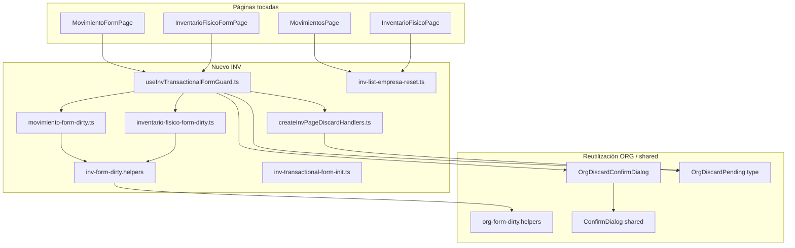
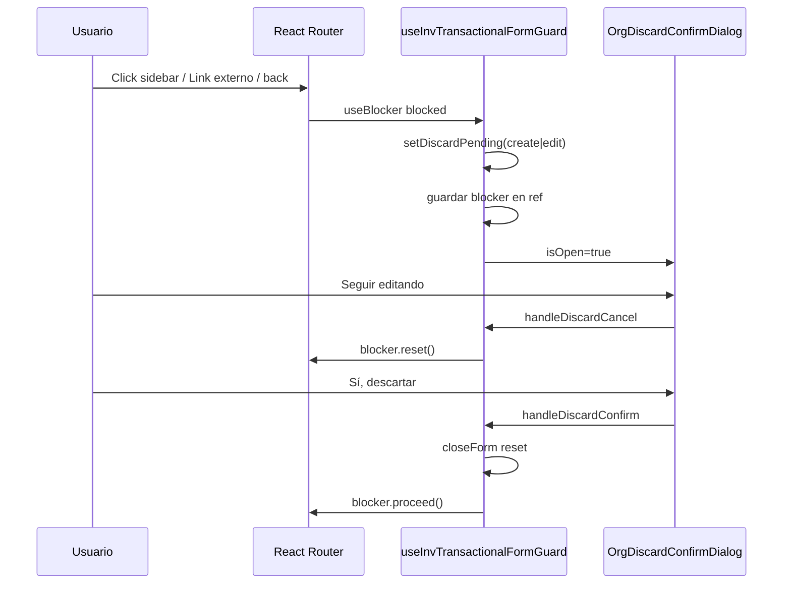

# INV-M2-SEC — Plan técnico de implementación (M2-O1 a M2-O6)

**Fecha:** 31 mayo 2026  
**Estado:** Propuesta aprobada para implementación — **sin código, sin commit**  
**Auditoría base:** [`INV_M2_SEC_AUDIT.md`](./INV_M2_SEC_AUDIT.md)  
**Alcance cerrado:** Solo obligatorios **M2-O1 … M2-O6**. Sin ítems Recomendados. Sin rediseño UX ni refactor funcional.

---

## 1. Objetivo y límites del sprint

| Objetivo | Protección de datos al salir de formularios B-F y consistencia multiempresa en transaccionales INV |
|----------|-----------------------------------------------------------------------------------------------------|
| **In scope** | Dirty guard, discard B.1.1, blocker de rutas, reset empresa create/edit, limpieza UI en listas al cambiar empresa |
| **Out of scope** | Modales detalle lectura, confirms workflow (autorizar/procesar/finalizar/aprobar/anular), layout §11, hooks multiempresa M0-b, backlog M1-UX-B, catálogos INV, `beforeunload`, dirty en confirms con campos, `scheduleModalStackValidation` |

**Principio rector:** Reutilizar el patrón B.1.1 ya validado en IAM/ORG. Adaptar la **superficie** (página completa vs modal Radix), no inventar un tercer flujo de confirmación.

---

## 2. Arquitectura propuesta



### 2.1 Capas

| Capa | Responsabilidad |
|------|-----------------|
| **Utilidades dirty** | Normalización, baseline create, snapshot edit, comparación cabecera + líneas |
| **Handlers discard** | Semántica B.1.1 adaptada a página (sin `setCreateOpen` Radix) |
| **Hook guard** | Orquesta dirty, blocker, discard, navegación pendiente, empresa create/edit |
| **Init / reset** | Estado inicial y reset completo create (O5) |
| **List reset helper** | Cierre modals + estado auxiliar al cambiar empresa (O6) |
| **Páginas** | Cableado mínimo: reemplazar `Link` salida, montar dialog, pasar callbacks al hook |

---

## 3. Inventario de archivos

### 3.1 Crear

| Archivo | Propósito | Obligatorio |
|---------|-----------|-------------|
| `src/features/inv/utils/form-dirty/inv-form-dirty.helpers.ts` | Re-export o thin wrapper sobre `org-form-dirty.helpers` + helpers de líneas | O2 |
| `src/features/inv/utils/form-dirty/movimiento-form-dirty.ts` | Tipos snapshot, dirty create/edit movimiento | O2 |
| `src/features/inv/utils/form-dirty/inventario-fisico-form-dirty.ts` | Idem inventario físico | O2 |
| `src/features/inv/utils/inv-transactional-form-init.ts` | Factories estado inicial create + reset completo | O5 |
| `src/features/inv/utils/createInvPageDiscardHandlers.ts` | Handlers discard página completa (espejo ORG) | O3 |
| `src/features/inv/hooks/useInvTransactionalFormGuard.ts` | Hook unificado B-F: dirty + blocker + discard + empresa | O1, O4, O5 |
| `src/features/inv/utils/inv-list-empresa-reset.ts` | Builders de reset UI para listas B-L | O6 |

### 3.2 Modificar (cambio acotado)

| Archivo | Naturaleza del cambio |
|---------|----------------------|
| `src/features/inv/pages/MovimientoFormPage.tsx` | Integrar hook; botones salida; snapshot; reset init; `OrgDiscardConfirmDialog` |
| `src/features/inv/pages/InventarioFisicoFormPage.tsx` | Idem |
| `src/features/inv/pages/MovimientosPage.tsx` | Extender callback `useInvScopeEmpresaReset` vía helper O6 |
| `src/features/inv/pages/InventarioFisicoPage.tsx` | Idem |

### 3.3 Reutilizar sin mover (M2)

| Pieza | Ubicación actual | Uso en INV |
|-------|------------------|------------|
| `OrgDiscardConfirmDialog` | `src/features/org/components/OrgDiscardConfirmDialog.tsx` | M2-O3 — import directo desde INV (ya existe precedente con `OrgSessionEmpresaField`) |
| `OrgDiscardPending` | `src/features/org/types/org-discard.types.ts` | Tipo `'create' \| 'edit' \| null` — mapear desde `isEdit` de ruta |
| `org-form-dirty.helpers` | `src/features/org/utils/org-form-dirty.helpers.ts` | Normalización `str`, `optId`, etc. |
| `useBlocker` | `react-router-dom` ^6.28 | Blocker in-app + botón atrás |
| `useInvScopeEmpresaReset` | `src/features/inv/hooks/useInvSessionScope.ts` | Sin cambios en el hook; solo callbacks en páginas |

**No extraer a `@/shared` en M2:** evita refactor transversal. Si más módulos adoptan formulario página completa, evaluar extracción post-M2.

---

## 4. M2-O2 — Infraestructura dirty (cabecera + detalle)

### 4.1 Helpers compartidos INV

`inv-form-dirty.helpers.ts`:

- Re-exportar `str`, `optId`, `optStr` desde ORG (una sola fuente de normalización).
- Añadir helpers específicos de líneas:
  - `normalizeLineaMovimiento(linea)` — campos trim; costo vacío → `null` semántico en comparación.
  - `normalizeLineaInventarioFisico(linea)` — cant_contada vacía → `null`.
  - `normalizeLineasArray(lineas, normalizer)` — map + filtrar líneas **vacías plantilla** (sin producto) en modo create baseline.
  - `lineasEqual(a, b, normalizer)` — comparación estable por **orden de array** (el orden de líneas es dato de usuario; no reordenar en compare).

### 4.2 Movimiento — modelo dirty

**Estado fuente (ya en página):** cabecera en 8 `useState` + `lineas: LineaLocal[]`.

**Baseline create (`CREATE_BASELINE`):**

| Campo | Valor baseline |
|-------|----------------|
| numeroMovimiento | `''` |
| tipoMovimientoId | `''` |
| fechaMovimiento | fecha hoy ISO date (valor inicial real del form) |
| fechaContable | fecha hoy |
| almacenOrigenId / almacenDestinoId | `''` |
| monedaId | `''` en baseline; **matiz:** si effect asigna primera moneda automáticamente, baseline debe generarse con la misma regla post-carga monedas **o** excluir `monedaId` del dirty create hasta interacción usuario — preferir **regenerar baseline cuando se auto-setea moneda** vía flag `monedaAutoSet` en hook guard |
| observaciones | `''` |
| lineas | una línea vacía plantilla (equivalente a `newLinea()`) |

**Snapshot edit (`MovimientoFormSnapshot`):**

- Capturar **una sola vez** cuando `formHydrated === true` tras hidratación exitosa.
- Incluir cabecera normalizada + array líneas normalizado (usar `key` de línea solo como identidad interna; comparar contenido de negocio).
- Guardar snapshot en ref o state estable (`editSnapshot`) — no recalcular en cada render.

**Funciones puras:**

| Función | Contrato |
|---------|----------|
| `isCreateMovimientoDirty(state)` | `state` vs `CREATE_BASELINE` |
| `buildMovimientoFormSnapshot(state)` | Produce snapshot desde estado actual |
| `isEditMovimientoDirty(state, snapshot)` | `false` si `snapshot === null` |

### 4.3 Inventario físico — modelo dirty

Análogo a movimiento con campos:

| Cabecera | Línea |
|----------|-------|
| numeroInventario, fechaInventario, almacenId, tipoInventario (`'total'`), descripcion | producto_id, cantidad_sistema, cantidad_contada |

Baseline create: `tipoInventario: 'total'`, una línea vacía plantilla.

### 4.4 Integración con `formHydrated`

| Evento | Acción |
|--------|--------|
| Cambio `movimientoId` / `inventarioFisicoId` | Reset `formHydrated`, `editSnapshot = null` (ya parcialmente existe) |
| Hidratación edit completa | `setEditSnapshot(build*FormSnapshot(...))` |
| Reset create O5 | Regenerar baseline / limpiar snapshot |
| Redirect edit O4 | Salir de página — snapshot se destruye con unmount |

### 4.5 Qué cuenta como dirty

| Cuenta | No cuenta |
|--------|-----------|
| Cualquier cambio cabecera vs baseline/snapshot | Errores de carga API |
| Agregar / eliminar / editar línea | Línea plantilla vacía única en create sin tocar |
| Reorden manual futuro (si existiera) | Diferencias de formato numérico cosmetic (`"1"` vs `"1.0"`) — normalizar en helper |

---

## 5. M2-O3 — Confirm discard (patrón B.1.1 ORG)

### 5.1 Componente UI

**Reutilizar `OrgDiscardConfirmDialog` tal cual** con props:

| Prop | MovimientoFormPage | InventarioFisicoFormPage |
|------|-------------------|--------------------------|
| `entityLabel` | `"el movimiento"` | `"la toma de inventario"` |
| `discardPending` | `'create'` si ruta `/nuevo`; `'edit'` si `/:id/editar` | Idem |
| `onClose` | `handleDiscardCancel` | Idem |
| `onConfirm` | `handleDiscardConfirm` | Idem |

Textos, botones (`Seguir editando` / `Sí, descartar`) y `variant="warning"` quedan centralizados en ORG — **no duplicar**.

### 5.2 Handlers — `createInvPageDiscardHandlers`

Espejo semántico de `createOrgDiscardHandlers`, adaptado a **página completa**:

| Handler ORG (modal) | Equivalente INV (página) |
|---------------------|--------------------------|
| `handleRequestCloseCreate` | `handleRequestLeave(exitPath)` |
| `handleRequestCloseEdit` | `handleRequestLeave(exitPath)` — mismo handler; modo inferido de `isEdit` |
| `handleDiscardCancel` | Limpiar `discardPending`; si hay `blocker` activo → `blocker.reset()`; permanecer en página |
| `handleDiscardConfirm` | Limpiar `discardPending`; reset form vía `closeForm()`; si `blocker.state === 'blocked'` → `blocker.proceed()`; si no → `navigate(exitPath)` |
| `handleCreateDialogOpenChange` | **N/A** — no hay Radix en B-F |

**Config del factory:**

| Parámetro | Descripción |
|-----------|-------------|
| `discardPending` / `setDiscardPending` | Mismo tipo `OrgDiscardPending` |
| `isSubmitting` | `createMutation.isPending \|\| updateMutation.isPending` |
| `isDirty` | Resultado dirty según create vs edit |
| `isEdit` | Deriva `discardPending` label en dialog |
| `closeForm` | Reset completo estado local (init O5 o estado vacío post-edit discard) |
| `navigate` / `pendingExitPath` | Ruta listado destino |
| `blockerRef` | Ref al blocker RR cuando navegación fue interceptada |

**Diferencia vs modal ORG:** no hay paso “cerrar Radix primero”. La página permanece montada; `OrgDiscardConfirmDialog` (`ConfirmDialog` fixed overlay) cubre la vista — equivalente UX al stack ORG post-cierre Radix.

### 5.3 Reglas B.1.1 heredadas (obligatorias)

| Regla | Implementación INV |
|-------|-------------------|
| Submit en curso | `handleRequestLeave` no-op si `isSubmitting` |
| Confirm independiente de workflow | No mezclar con confirms autorizar/aprobar (fuera alcance) |
| Un solo discard confirm por página | Un `OrgDiscardConfirmDialog` en cada B-F |
| Post-guardado | `navigate` directo tras éxito — form ya no dirty |

**Fuera M2 (Recomendado audit):** `scheduleModalStackValidation`, deshabilitar sidebar global durante discard.

---

## 6. M2-O1 — Dirty guard y navegación

### 6.1 Hook `useInvTransactionalFormGuard`

Hook parametrizado por entidad (`'movimiento' | 'inventario-fisico'`) que encapsula O1 + O4 + O5.

**Entradas conceptuales:**

| Input | Uso |
|-------|-----|
| `isEdit` | Modo create vs edit |
| `documentId` | `movimientoId` / `inventarioFisicoId` |
| `listPath` | `/app/inv/movimientos` o `/app/inv/inventario-fisico` |
| `formState` | Objeto con cabecera + lineas + flags hidratación |
| `setFormState` / resetters | Para O5 y discard confirm |
| `isSubmitting` | Mutations pending |
| `formHydrated` | Gate snapshot edit |

**Salidas conceptuales:**

| Output | Uso en página |
|--------|---------------|
| `isDirty` | Debug / deshabilitar acciones opcional |
| `discardPending` | Prop a `OrgDiscardConfirmDialog` |
| `handleRequestLeave` | `onClick` Cancelar, Volver |
| `handleDiscardCancel` / `handleDiscardConfirm` | Dialog callbacks |
| `discardDialogEntityLabel` | String entidad |
| `editSnapshotReady` | Señal interna; opcional exponer |

### 6.2 Sustitución de `Link` por navegación guardada

| Control actual | Cambio |
|----------------|--------|
| `<Link to={listPath}>` Cancelar | `<Button onClick={() => handleRequestLeave(listPath)}>` |
| `<Link aria-label="Volver">` | Mismo handler |
| Guardar → `navigate(listPath)` tras éxito | **Sin cambio** — no pasa por dirty guard |

Estilo visual: mantener `Button variant="outline"` / `ghost` — **sin rediseño**.

### 6.3 Estrategia `useBlocker` (react-router-dom 6.28)

**Precondición verificada:** `createBrowserRouter` + `RouterProvider` en `src/app/router.tsx` — `useBlocker` soportado.

**Condición de bloqueo:**

```
blocked =
  isDirty
  && !isSubmitting
  && discardPending === null
  && !empresaRedirectInProgress
  && currentLocation.pathname !== nextLocation.pathname
```

**Flujo:**



**Casos:**

| Caso | Comportamiento |
|------|----------------|
| Navegación in-app (sidebar, menú) | Blocker intercepta |
| Botón atrás navegador | Blocker intercepta |
| Cancelar/Volver explícito | `handleRequestLeave` — si dirty, abre dialog **sin** depender del blocker (path conocido en ref `pendingExitPath`) |
| Descartar confirmado desde botón | `navigate(pendingExitPath)` si blocker no activo |
| Descartar confirmado desde blocker | `blocker.proceed()` |
| Form limpio | Navegación libre |

**No implementar en M2:** `beforeunload` (Recomendado audit).

### 6.4 Convivencia botón vs blocker

`handleRequestLeave(path)`:

1. Si `!isDirty` → `navigate(path)`.
2. Si `isDirty` → `setPendingExitPath(path)` + `setDiscardPending(isEdit ? 'edit' : 'create')`.
3. No llamar `navigate` hasta confirm.

Si el usuario usó un link que activó blocker, `pendingExitPath` puede omitirse y usar `blocker.location`.

---

## 7. M2-O4 y M2-O5 — Cambio de empresa

### 7.1 Prioridad

**El cambio de empresa JWT prevalece sobre dirty guard.** Motivo: protección de datos cross-tenant > confirmación de descarte.

### 7.2 Modo edición (M2-O4)

**Trigger:** `scopeEmpresaId` cambia mientras la ruta es `/:id/editar`.

**Acción (sin confirm discard):**

1. Marcar `empresaRedirectInProgress` (evita blocker/discard race).
2. Toast informativo: *«La empresa activa cambió. Se cerró el documento en edición.»*
3. `navigate(listPath)` inmediato.
4. Unmount limpia estado form.

**No re-hidratar** form con nuevo `scopeEmpresaId` en la misma vista — prohibido mostrar datos stale.

**Implementación:** `useEffect` en hook guard:

```
deps: [scopeEmpresaId, isEdit, documentId]
skip primera montura (ref prevScopeEmpresaId)
si prev !== current && isEdit && documentId → redirect
```

### 7.3 Modo create (M2-O5)

**Trigger:** mismo cambio `scopeEmpresaId` en ruta `/nuevo`.

**Acción:**

1. Ejecutar **reset completo** vía `inv-transactional-form-init.ts`:
   - Cabecera a valores iniciales (incl. fechas hoy, tipo default IF `'total'`).
   - `lineas = [newLinea()]`.
   - Limpiar snapshot edit (null).
   - Reset `formHydrated` false.
2. **Permanecer en `/nuevo`** — no redirigir.
3. Tras refetch catálogos (productos, almacenes) por invalidate INV existente, selects reflejan nueva empresa.
4. Recalcular baseline dirty create post-reset (form debe quedar **no dirty**).

**Reemplaza** el callback parcial actual:

| Antes (parcial) | Después (completo) |
|-----------------|-------------------|
| Mov: solo tipo, almacenes, lineas | Todos los campos cabecera + lineas |
| IF: solo almacen, lineas | Todos los campos cabecera + lineas |
| `if (isEdit) return` | Edit manejado por O4 redirect, no por este callback |

### 7.4 `inv-transactional-form-init.ts`

Factories por entidad:

| Función | Retorno |
|---------|---------|
| `createInitialMovimientoFormState()` | Objeto con todos los useState iniciales |
| `createInitialInventarioFisicoFormState()` | Idem |
| `applyMovimientoFormReset(setters)` | Aplica reset a callbacks/setters de la página |
| `applyInventarioFisicoFormReset(setters)` | Idem |

Centralizar aquí la lógica duplicada entre discard confirm y O5.

### 7.5 Interacción con `OrgSessionEmpresaField`

**Sin cambios** en el componente. Sigue read-only. El cambio de empresa ocurre en header global → hook detecta vía `useInvSessionScope().scopeEmpresaId`.

---

## 8. M2-O6 — Listas transaccionales al cambiar empresa

### 8.1 Helper `inv-list-empresa-reset.ts`

Funciones puras que reciben setters y resetean UI modal/workflow:

**`resetMovimientosListUiState(setters)`** — cierra y limpia:

| Estado | Reset |
|--------|-------|
| `detailOpen` | `false` |
| `selectedMovimientoId` | `null` |
| `autorizarOpen` / `procesarOpen` / `anularOpen` | `false` |
| `anularMotivo` | `''` |
| Filtros lista | Ya en `resetPageFilters` — **mantener** |
| `productosMap` | Ya reseteado — **mantener** |

**`resetInventarioFisicoListUiState(setters)`** — cierra y limpia:

| Estado | Reset |
|--------|-------|
| `detailOpen` | `false` |
| `selectedId` | `null` |
| `aprobarOpen` / `anularOpen` / `finalizarOpen` | `false` |
| `aprobarTipoMovimientoId` / `aprobarObs` | `''` |
| Filtros + `productosMap` | Mantener lógica existente |

### 8.2 Integración en páginas

Extender el callback existente pasado a `useInvScopeEmpresaReset`:

```
resetPageFilters = () => {
  // filtros existentes
  reset*ListUiState({ setDetailOpen, ... })
}
```

**No modificar** JSX de modales detalle ni confirms workflow — solo garantizar que al cambiar empresa no queden overlays abiertos ni IDs seleccionados de la empresa anterior.

### 8.3 Comportamiento esperado QA

| Escenario | Resultado |
|-----------|-----------|
| Detalle abierto + cambio empresa | Modal cierra; lista refetch nueva empresa |
| Confirm autorizar abierto + cambio empresa | Confirm cierra |
| IF aprobar con campos + cambio empresa | Confirm cierra; campos aprobar reset |

---

## 9. Mapa obligatorio → entregable

| ID | Entregable técnico | Archivos principales |
|----|-------------------|----------------------|
| **M2-O1** | Dirty guard salida + blocker RR | Hook + 2 form pages |
| **M2-O2** | Utils dirty + snapshot | `form-dirty/*` × 3 |
| **M2-O3** | Discard B.1.1 | `createInvPageDiscardHandlers` + `OrgDiscardConfirmDialog` |
| **M2-O4** | Redirect edit al cambiar empresa | Hook guard effect |
| **M2-O5** | Reset completo create | `inv-transactional-form-init` + hook |
| **M2-O6** | Reset UI listas | `inv-list-empresa-reset` + 2 list pages |

---

## 10. Orden de implementación sugerido

| Fase | Tareas | Dependencias |
|------|--------|--------------|
| **1** | O2: utils dirty movimiento + IF + helpers | — |
| **2** | O5: init/reset factories | Fase 1 |
| **3** | O3: `createInvPageDiscardHandlers` | Fase 1–2 |
| **4** | O1: hook guard + blocker + wire MovimientoFormPage | Fase 1–3 |
| **5** | O1: wire InventarioFisicoFormPage | Fase 4 |
| **6** | O4: effect empresa edit en hook | Fase 4 |
| **7** | O5: effect empresa create en hook | Fase 2, 4 |
| **8** | O6: list resets ambas listas | Independiente — puede paralelo a 4–7 |

**Commit sugerido (cuando usuario lo pida):** un commit atómico INV-M2-SEC o dos: (1) infra + hook + forms, (2) list resets.

---

## 11. Criterios de aceptación QA (solo O1–O6)

| # | Caso | Esperado |
|---|------|----------|
| QA-O1 | Create mov: editar cabecera + línea → Cancelar | Confirm discard |
| QA-O2 | Create mov: sin cambios → Volver | Navega sin confirm |
| QA-O3 | Edit IF: cambiar línea → click sidebar otra ruta | Blocker + confirm |
| QA-O4 | Edit IF: sin cambios → botón atrás navegador | Navega sin confirm |
| QA-O5 | Edit mov: cambiar empresa header | Toast + redirect listado; sin form stale |
| QA-O6 | Create mov: llenar form → cambiar empresa | Form reset completo; permanece en `/nuevo`; not dirty |
| QA-O7 | Guardar exitoso mov/IF | Redirect listado sin confirm |
| QA-O8 | Movimientos: detalle + confirm anular abierto → cambiar empresa | Todo cierra; sin overlay huérfano |
| QA-O9 | IF: aprobar dialog abierto → cambiar empresa | Cierra; campos aprobar reset |
| QA-O10 | Durante Guardando… | Salida no descarta ni navega (submitting gate) |

---

## 12. Riesgos y mitigaciones

| Riesgo | Mitigación |
|--------|------------|
| Baseline create desincronizado por auto-set moneda | Regenerar baseline cuando effect asigna moneda default; o incluir en hook guard |
| Carrera blocker + `handleRequestLeave` | Ref `pendingExitPath`; un solo dialog; idempotencia en confirm |
| Edit redirect vs dirty dialog | Flag `empresaRedirectInProgress` cancela blocker/discard |
| Líneas con producto inválido post O5 | Reset deja líneas vacías; catálogos refetch por invalidate M0 existente |
| Import INV → ORG (`OrgDiscardConfirmDialog`) | Acoplamiento aceptado M2; documentado; extracción shared diferida |

---

## 13. Explicitamente no tocar (checklist pre-PR)

- [ ] JSX/layout cabecera + líneas en B-F
- [ ] Modales detalle lectura (Dialog contenido, botones workflow)
- [ ] ConfirmDialog autorizar / procesar / finalizar / anular / aprobar
- [ ] `useInvSessionScope`, `useInvCompanyQueryGate`, `InvCompanyRouteGuard`
- [ ] Hooks mutations / services INV
- [ ] Catálogos M1-UX-A
- [ ] Stock, Kardex, backlog M1-UX-B (empty, TABLE_COLSPAN, toAppPath, lookup)
- [ ] Ítems Recomendados audit (beforeunload, dirty en confirms workflow, toast validación guardar, stack validation DEV)

---

## 14. Veredicto

La implementación propuesta **minimiza superficie** (7 archivos nuevos, 4 modificados), **reutiliza B.1.1 ORG** sin tercer patrón, y separa claramente:

- **Protección salida** (O1–O3) — dirty + discard + blocker  
- **Protección tenant** (O4–O6) — empresa edit redirect, create reset, list UI cleanup  

Lista para codificar en el siguiente paso tras tu OK explícito.

---

*Plan técnico INV-M2-SEC. Sin código. Sin repair. Sin commit.*
