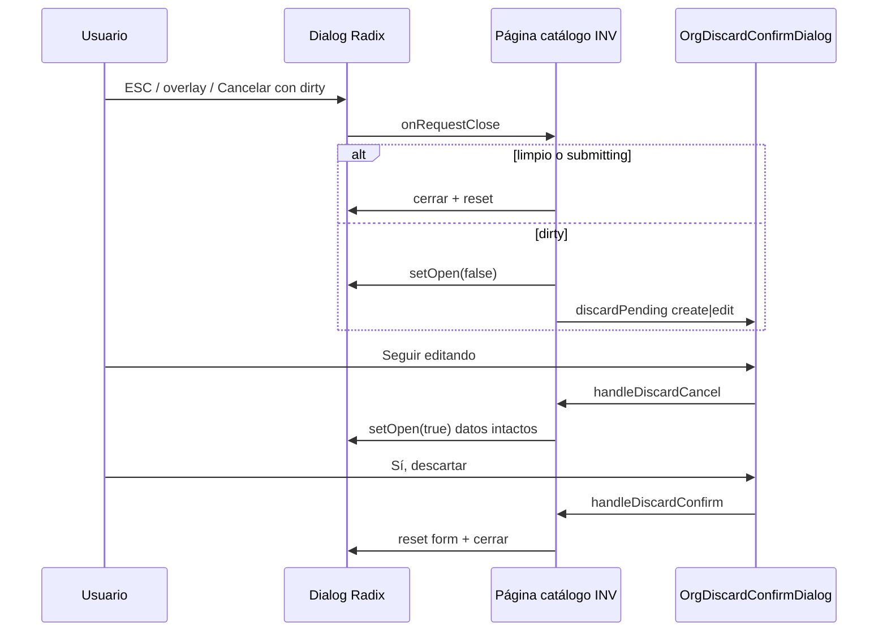

# INV-M3 — Auditoría B.1.1 catálogos INV (E-SEC paridad)

**Fecha:** 31 mayo 2026  
**Estado:** Solo auditoría — **sin código, sin repair, sin commit**  
**Disparador QA:** Cierre modal create/edit en catálogos INV **sin** confirm *Seguir editando / Sí, descartar* — pérdida silenciosa de cambios  
**Deuda referenciada:** **R-01** en [`INV_MODULE_CLOSURE_AUDIT.md`](./INV_MODULE_CLOSURE_AUDIT.md)  
**Referencias:** [`ORG_SPRINT_E_ESEC_AUDIT.md`](./ORG_SPRINT_E_ESEC_AUDIT.md) · [`ERP_FRONTEND_STANDARDS_V1.md`](./ERP_FRONTEND_STANDARDS_V1.md) §9 · [`INV_M2_SEC_IMPLEMENTATION_PLAN.md`](./INV_M2_SEC_IMPLEMENTATION_PLAN.md)

---

## 1. Resumen ejecutivo

| Pregunta | Respuesta |
|----------|-----------|
| ¿La observación QA es válida? | **Sí** — reproducible en los 5 catálogos |
| ¿Coincide con R-01? | **Sí** — paridad E-SEC catálogos INV no implementada |
| ¿Basta replicar patrón ORG E-SEC? | **Sí** — mismo stack modal Radix; **no** inventar patrón tercero |
| ¿Bloquea cierre oficial INV? | **Sí** — hasta cerrar R-01 con QA |
| Diálogos afectados | **10** (5 páginas × create + edit) |

**Veredicto:** INV-M3 debe ser un sprint **mecánico de paridad ORG E-SEC** sobre Plantilla A ya migrada (M1-UX-A). Alcance acotado a B.1.1 en modales CRUD; sin UX adicional, sin refactor Productos a página.

---

## 2. Hallazgo QA — comportamiento actual vs esperado

### 2.1 Anti-patrón confirmado (común a las 5 páginas)

| Mecanismo | Comportamiento actual INV | Comportamiento ORG E-SEC |
|-----------|---------------------------|---------------------------|
| `Dialog` create `onOpenChange` | `setCreateOpen` directo | `handleCreateDialogOpenChange` → dirty check |
| `Dialog` edit `onOpenChange` | `(o) => !o && setEditing(null)` — cierra sin confirm | `handleEditDialogOpenChange` → dirty check |
| Botón **Cancelar** footer | `setCreateOpen(false)` / `setEditOpen(false)` | `handleRequestCloseCreate` / `handleRequestCloseEdit` |
| Overlay / ESC | Cierra vía Radix default | `orgDialogGuardProps` → `preventDefault` + ruta discard |
| Post-guardado OK | `setCreateOpen(false)` directo | `closeCreate()` / `closeEdit()` — **OK en ambos** |
| Cambio empresa JWT | Solo reset filtros búsqueda | ORG: cierra modals + `discardPending` null |

### 2.2 Flujo esperado post-M3 (idéntico ORG)

---

## 3. Inventario por catálogo

### 3.1 Matriz de estado B.1.1

| Página | Ruta | Líneas aprox. | Modal | Campos form (create) | Complejidad dirty | B.1.1 |
|--------|------|---------------|-------|----------------------|-------------------|-------|
| **CategoriasPage** | `/inv/categorias` | ~490 | `max-w-lg` ×2 | 8 (+ FK padre, cuentas) | Media | ❌ |
| **UnidadesMedidaPage** | `/inv/unidades-medida` | ~350 | `max-w-lg` ×2 | 6 | Baja | ❌ |
| **TiposMovimientoPage** | `/inv/tipos-movimiento` | ~500 | `max-w-lg` ×2 | 8 (+ booleans, cuentas) | Media | ❌ |
| **AlmacenesPage** | `/inv/almacenes` | ~410 | `max-w-lg` ×2 | 7 (+ FK sucursal) | Media-baja | ❌ |
| **ProductosPage** | `/inv/productos` | ~1 280 | `max-w-3xl` ×2 | **~35** create / **~20** edit | **Alta** | ❌ |

**Total diálogos formulario:** 10.  
**ConfirmDialog desactivar/reactivar:** 10 (5×2) — **sin cambio** (B11-02 independiente).

### 3.2 Ficha por pantalla

#### CategoriasPage

| Aspecto | Detalle |
|---------|---------|
| Estado | `form`, `editForm`, `createOpen`, `editOpen`, `editing` |
| Anti-patrón L330/L396 | `onOpenChange={setCreateOpen}`; edit cierra con `setEditing(null)` |
| Cancelar L387/L452 | `setCreateOpen(false)` / `setEditOpen(false)` |
| Reset empresa | Solo `buscar` + `mostrarInactivos` — **no cierra modals** |
| Referencia ORG | `DepartamentosPage` (FK padre, campos similares) |

#### UnidadesMedidaPage

| Aspecto | Detalle |
|---------|---------|
| Campos dirty | codigo, nombre, tipo_unidad, es_unidad_base, decimales_permitidos, es_activo |
| Referencia ORG | `CentrosCostoPage` (entidad simple) |
| Nota | Menor superficie — candidato **piloto M3** |

#### TiposMovimientoPage

| Aspecto | Detalle |
|---------|---------|
| Campos dirty | codigo, nombre, clase_movimiento, afecta_costo, requiere_autorizacion, genera_asiento_contable, cuentas contables, es_activo |
| Referencia ORG | `CargosPage` (booleans + selects) |

#### AlmacenesPage

| Aspecto | Detalle |
|---------|---------|
| Campos dirty | sucursal_id, codigo, nombre, tipo_almacen, flags principal/ventas/compras |
| FK | `sucursal_id` desde hook ORG sucursales |
| Referencia ORG | `CargosPage` / `SucursalesPage` (select FK) |

#### ProductosPage

| Aspecto | Detalle |
|---------|---------|
| Modal | `max-w-3xl` scroll — formulario extenso (A+) |
| Create vs edit | Create ~35 campos; edit subconjunto ~20 — **dirty edit ≠ dirty create** |
| Dependencias | categorías, UM, monedas catálogo |
| Riesgo M3 | Solo tamaño util dirty — **mismo patrón mecánico** que ORG `EmpresaPage` |
| Fuera M3 | Migrar a página completa (INV-EMP) — **no** requisito R-01 |

---

## 4. Piezas ORG reutilizables (sin mover a shared en M3)

### 4.1 Reutilización directa — 100% import desde `@/features/org`

| Pieza | Ruta | Uso en INV-M3 |
|-------|------|---------------|
| `OrgDiscardConfirmDialog` | `components/OrgDiscardConfirmDialog.tsx` | 1 instancia por página |
| `OrgDiscardPending` | `types/org-discard.types.ts` | `'create' \| 'edit' \| null` |
| `createOrgDiscardHandlers` | `utils/org-discard-handlers.ts` | Factory handlers create/edit |
| `orgDialogGuardProps` | `utils/org-dialog-guard-props.ts` | Spread en `DialogContent` |
| `org-form-dirty.helpers` | `utils/org-form-dirty.helpers.ts` | `str`, `bool`, `optId`, `numOrUndef` |

**Precedente:** INV ya importa `OrgSessionEmpresaField`, `OrgCompanyToolbar`, `OrgToolbarSearch` desde ORG. M3 extiende el mismo acoplamiento feature→feature.

### 4.2 Crear en INV (form-dirty por entidad)

| Archivo nuevo | Entidad | Funciones |
|---------------|---------|-----------|
| `src/features/inv/utils/form-dirty/categoria-form-dirty.ts` | Categoría | baseline create, snapshot edit, `isCreate*Dirty`, `isEdit*Dirty` |
| `src/features/inv/utils/form-dirty/unidad-medida-form-dirty.ts` | UM | Idem |
| `src/features/inv/utils/form-dirty/tipo-movimiento-form-dirty.ts` | Tipo mov. | Idem |
| `src/features/inv/utils/form-dirty/almacen-form-dirty.ts` | Almacén | Idem |
| `src/features/inv/utils/form-dirty/producto-form-dirty.ts` | Producto | Idem — **mayor superficie campos** |

**Nota:** `inv-form-dirty.helpers.ts` ya existe (M2-SEC transaccional). M3 puede **re-exportar** `org-form-dirty.helpers` desde ahí o importar directo como en ORG.

### 4.3 No reutilizar / no aplicar en M3

| Pieza | Motivo |
|-------|--------|
| `useInvTransactionalFormGuard` | Solo páginas completas B-F (M2-SEC) |
| `createInvPageDiscardHandlers` | Adaptación página; modales usan `createOrgDiscardHandlers` |
| `scheduleModalStackValidation` | Recomendado ORG — fuera alcance mínimo R-01 |
| `FormSection` / `DialogBody` | Opcional cosmético — ORG los usa pero **no obligatorio** para B.1.1 |

---

## 5. ¿Basta replicar el patrón ORG?

### 5.1 Veredicto: **Sí**

Los catálogos INV ya siguen la **misma arquitectura de página** que ORG post E-UX:

- `InvPageLayout` ≈ `OrgPageLayout`
- `OrgCompanyToolbar` + `IamTableEmptyState` + `InvTableSkeleton`
- Estado `form` / `editForm` / `createOpen` / `editOpen`
- `ConfirmDialog` independiente para desactivar/reactivar

La brecha es **exactamente** la implementada en ORG E-SEC: wiring B.1.1 faltante, no divergencia de diseño.

### 5.2 Checklist mecánico por página (copiar de `CentrosCostoPage` / `DepartamentosPage`)

| # | Cambio | Obligatorio R-01 |
|---|--------|------------------|
| 1 | Import discard + dirty util + `orgDialogGuardProps` | ✅ |
| 2 | Estado `discardPending`, `editFormSnapshot` | ✅ |
| 3 | `useMemo` `isCreateDialogDirty` / `isEditDialogDirty` | ✅ |
| 4 | `closeCreate` / `closeEdit` callbacks | ✅ |
| 5 | `createOrgDiscardHandlers({ contextPrefix: 'inv-…' })` | ✅ |
| 6 | `openCreate` / `openEdit`: snapshot en edit + `setDiscardPending(null)` | ✅ |
| 7 | `OrgDiscardConfirmDialog` + `entityLabel` | ✅ |
| 8 | `Dialog` `onOpenChange={handle*DialogOpenChange}` | ✅ |
| 9 | `DialogContent` `{...orgDialogGuardProps}` | ✅ |
| 10 | Cancelar → `handleRequestCloseCreate/Edit` | ✅ |
| 11 | Post-save → `closeCreate()` / `closeEdit()` | ✅ |
| 12 | `discardPending !== null` → disable Crear, Editar, Desactivar, búsqueda | ✅ |
| 13 | Extender `useInvScopeEmpresaReset`: cerrar modals + snapshot + discard | ✅ |

### 5.3 Diferencias INV vs ORG (no bloquean replicación)

| Diferencia | Impacto M3 |
|------------|------------|
| Búsqueda client-side (4 catálogos) | Ninguno — dirty solo modal |
| Productos búsqueda server-side | Ninguno |
| Sin `FormSection` en modales INV | Opcional — no afecta discard |
| `InvPageLayout` vs `OrgPageLayout` | Ninguno |

---

## 6. Alcance mínimo INV-M3 para cerrar R-01

### 6.1 In scope (obligatorio cierre R-01)

| ID | Entregable |
|----|------------|
| **M3-O1** | B.1.1 create + edit en **CategoriasPage** |
| **M3-O2** | B.1.1 create + edit en **UnidadesMedidaPage** |
| **M3-O3** | B.1.1 create + edit en **TiposMovimientoPage** |
| **M3-O4** | B.1.1 create + edit en **AlmacenesPage** |
| **M3-O5** | B.1.1 create + edit en **ProductosPage** |
| **M3-O6** | 5 utilidades `form-dirty/*` (una por entidad) |
| **M3-O7** | Reset empresa: cerrar modals + limpiar discard en las 5 páginas |

**Criterio de cierre R-01:** QA manual en 5 catálogos — editar campo → Cancelar / ESC / overlay → aparece confirm; *Seguir editando* restaura modal con datos; *Sí, descartar* cierra y pierde cambios.

### 6.2 Fuera de alcance M3 (explícito)

| Item | Motivo |
|------|--------|
| Transaccionales B-F / B-L | Cerrados M2-SEC (pendiente QA aparte) |
| `FormSection` / refactor layout modales | Cosmética |
| Productos → página completa | INV-EMP / R-09 |
| `scheduleModalStackValidation` | Recomendado — no R-01 |
| Empty filtros, TABLE_COLSPAN, toAppPath | Backlog M1-UX-B |
| Extraer discard a `@/shared` | Post-M3 si PUR/SLS lo exigen |
| Tests unitarios form-dirty | R-10 backlog |

### 6.3 Orden de implementación sugerido

| Fase | Páginas | Esfuerzo | Motivo |
|------|---------|----------|--------|
| **M3-1 Piloto** | UnidadesMedida | Bajo | Validar plantilla copy-paste |
| **M3-2** | Categorías, Almacenes, Tipos | Medio | Entidades medias |
| **M3-3** | Productos | Alto | Util dirty grande; mismo checklist |

**Estimación global:** ~5 archivos dirty + 5 páginas modificadas (~80–120 LOC netas por página simple; ~150–200 Productos).

---

## 7. Clasificación de hallazgos

### 7.1 Obligatorio (INV-M3)

| ID | Hallazgo |
|----|----------|
| **M3-H01** | Sin confirm discard al cerrar modal create/edit dirty |
| **M3-H02** | ESC/overlay cierran sin guard (sin `orgDialogGuardProps`) |
| **M3-H03** | Cambio empresa no cierra modals catálogo (desalineado ORG DT-10) |
| **M3-H04** | Acciones tabla activas durante `discardPending` (B11-03) |

### 7.2 Recomendado (post-R-01 / no bloquea)

| ID | Hallazgo |
|----|----------|
| **M3-R01** | Añadir `FormSection` + `DialogBody` en modales INV (paridad visual ORG) |
| **M3-R02** | `scheduleModalStackValidation('inv-*')` en DEV |
| **M3-R03** | Tests unitarios `inv/form-dirty/*.ts` |
| **M3-R04** | Helper `createInvCatalogDiscardHandlers` thin wrapper con `contextPrefix` default |

### 7.3 Mantener

| Item | Motivo |
|------|--------|
| `ConfirmDialog` desactivar/reactivar sin mezclar con discard | B11-02 |
| Modal Productos `max-w-3xl` | A+ válido; B.1.1 compatible |
| Búsqueda client/server existente | Fuera M3 |

---

## 8. QA propuesto post-M3 (cerrar R-01)

Por cada catálogo (×5):

| # | Caso | Esperado |
|---|------|----------|
| QA-01 | Create: editar campo → Cancelar | Confirm discard |
| QA-02 | Create: sin cambios → Cancelar | Cierra sin confirm |
| QA-03 | Edit: cambiar campo → ESC | Confirm discard |
| QA-04 | Edit dirty → overlay click | Confirm discard |
| QA-05 | Confirm → Seguir editando | Modal reabre; datos intactos |
| QA-06 | Confirm → Sí, descartar | Modal cierra; form reset |
| QA-07 | Guardar OK | Cierra sin confirm |
| QA-08 | Cambio empresa con modal abierto | Modal cierra; sin overlay huérfano |
| QA-09 | Desactivar fila | `ConfirmDialog` destructivo — **sin** mezclar discard |

**Productos:** repetir QA-01–09 en create (~35 campos) y edit (~20 campos).

---

## 9. Relación con cierre oficial INV

| Gate | Estado |
|------|--------|
| INV-M0-b | ✅ Cerrado |
| INV-M1-UX-A | ✅ Cerrado |
| INV-M1-UX-B | ✅ Cerrado |
| INV-M2-SEC | 🟡 Implementado — QA pendiente |
| **INV-M3 B.1.1 catálogos (R-01)** | ❌ **Pendiente** — bloquea declaración “INV cerrado oficialmente” |
| QA M2 + M3 | Pendiente usuario |

**Secuencia recomendada antes de cierre oficial:**

1. Completar QA M2-SEC (matriz existente).  
2. Implementar INV-M3 (R-01).  
3. QA M3 (§8).  
4. Actualizar `INV_MODULE_CLOSURE_AUDIT.md` → **CERRADO OFICIAL**.

---

## 10. Veredicto final

| Pregunta | Respuesta |
|----------|-----------|
| ¿QA confirma R-01? | **Sí** |
| ¿Solución = replicar ORG E-SEC? | **Sí** — `createOrgDiscardHandlers` + `OrgDiscardConfirmDialog` + `form-dirty/*` INV |
| ¿Alcance mínimo? | **5 páginas, 10 dialogs, 5 utils dirty, reset empresa modals** |
| ¿Involucra patrón M2 transaccional? | **No** — modales Radix ≠ `useInvTransactionalFormGuard` |

INV-M3 es el **último gap funcional de seguridad UX** antes del cierre formal del módulo, asumiendo M2-SEC pase QA.

---

*Auditoría INV-M3 B.1.1 catálogos. Sin código. Sin repair. Sin commit.*
