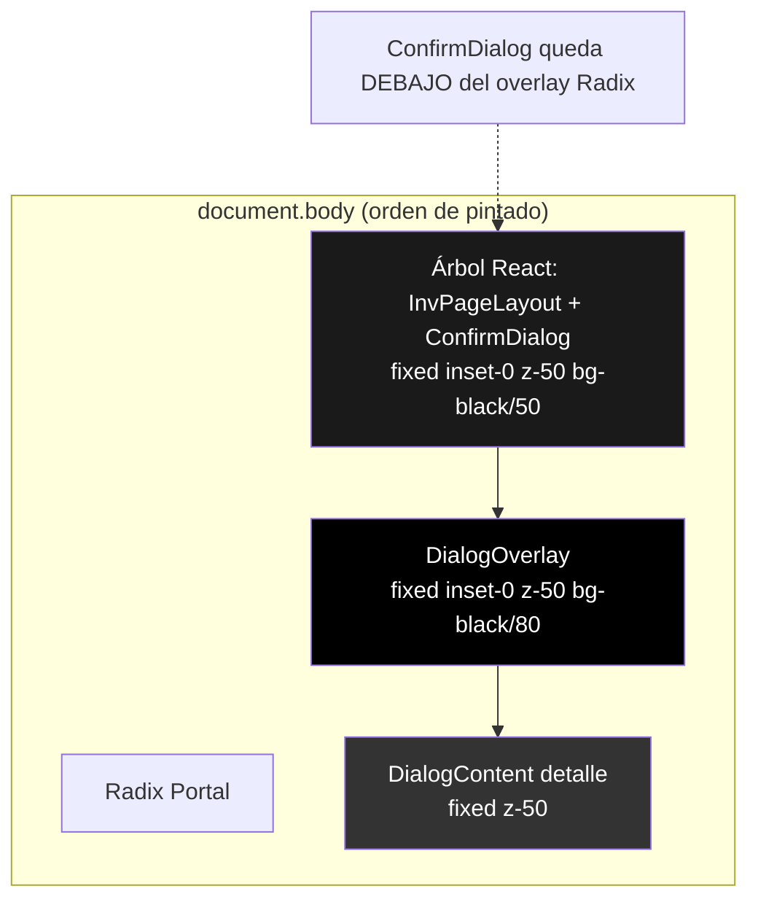
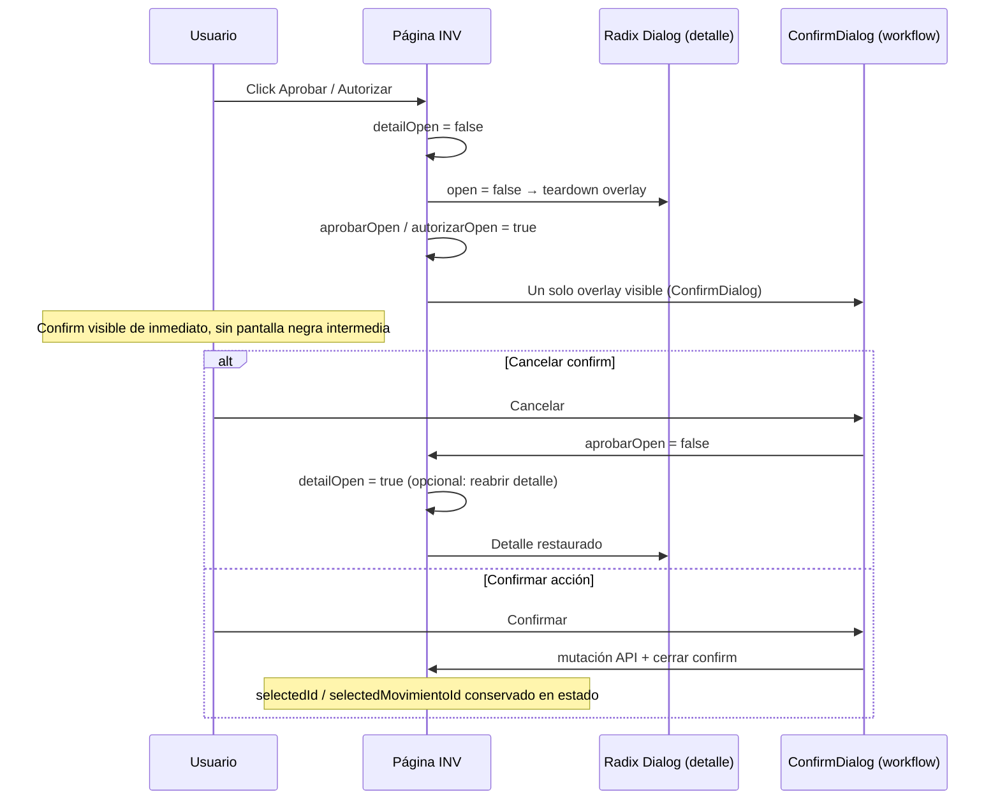

# INV — Auditoría stacking de modales (Aprobar / Autorizar)

**Fecha:** 10 junio 2026  
**Estado:** Solo auditoría — sin implementación, sin commit  
**Alcance:** Flujo de aprobación/autorización en pantallas B-L transaccionales INV:

| Pantalla | Archivo | Acciones auditadas |
|----------|---------|-------------------|
| Inventario Físico (lista) | `src/features/inv/pages/InventarioFisicoPage.tsx` | Aprobar, Finalizar, Anular |
| Movimientos de Inventario (lista) | `src/features/inv/pages/MovimientosPage.tsx` | Autorizar, Procesar, Anular |

**Síntoma reportado:** Al pulsar **Aprobar** o **Autorizar** dentro del modal de detalle, la pantalla queda completamente negra (overlay visible). Solo tras hacer click sobre esa pantalla negra aparece el modal de confirmación.

**Referencias internas:** `SPRINT_D_B11_OVERLAY_FIX_AUDIT.md`, `SPRINT_B1_RUNTIME_FIX_AUDIT.md` §2, `INV_M2_SEC_AUDIT.md` §4.6 SEC-STACK-01, patrón B.1.1 en `UserManagementPage.tsx`.

---

## 1. Resumen ejecutivo

| Métrica | Valor |
|---------|--------|
| Causa raíz | **Radix `Dialog` de detalle permanece `open={true}` mientras se abre `ConfirmDialog` custom encima** |
| Tipo | Bug UX / stacking de modales (no API, no RBAC) |
| Severidad | **Alta** — bloquea o confunde el flujo operativo de aprobación/autorización |
| Pantallas afectadas | **2 / 2** en alcance |
| Acciones afectadas | **6** (3 por pantalla) |
| ¿Ya corregido en otros módulos? | **Sí** — IAM (`UserManagementPage`, `RolePermissionsManager`), Platform Clientes/Modulos (`shellVisible`) |
| Fix mínimo | Cerrar Radix **antes** de abrir `ConfirmDialog` (patrón B.1.1) |
| Riesgo de regresión | **Bajo** si se sigue el patrón ya probado en IAM |

---

## 2. Causa raíz exacta

### 2.1 Enunciado

El proyecto usa **dos sistemas de modal incompatibles en stack**:

1. **Radix Dialog** (`@radix-ui/react-dialog`) — portal a `document.body`, overlay `z-50 bg-black/80`, focus trap, scroll lock en `body`.
2. **ConfirmDialog custom** (`src/shared/components/ui/ConfirmDialog.tsx`) — **sin portal**, overlay `fixed inset-0 z-50 bg-black/50`, renderizado en el árbol React de la página.

En ambas pantallas INV, al pulsar una acción de workflow desde el modal de detalle, el handler **solo abre el confirm** (`setAprobarOpen(true)` / `setAutorizarOpen(true)`) **sin cerrar** el Dialog de detalle (`detailOpen` sigue en `true`).

Resultado: coexisten Radix abierto + ConfirmDialog abierto.

### 2.2 Por qué el síntoma es “pantalla negra” y el confirm “aparece al hacer click”

| Capa | Componente | Portal | z-index | Orden DOM típico |
|------|------------|--------|---------|------------------|
| A | Radix `DialogOverlay` | Sí (`body`) | 50 | **Último** (portal Radix) |
| B | Radix `DialogContent` (detalle) | Sí (`body`) | 50 | Después de A |
| C | `ConfirmDialog` overlay + panel | **No** (dentro de `InvPageLayout`) | 50 | **Antes** del portal Radix |

Con el mismo `z-index`, gana el **orden en DOM**. El portal Radix se monta al final de `body`, por encima del `ConfirmDialog`. El panel de confirmación queda **detrás del overlay Radix** (invisible o apenas perceptible).

Lo que ve el usuario:

1. Pulsa **Aprobar** / **Autorizar** → se monta `ConfirmDialog`, pero su contenido queda oculto bajo el overlay Radix.
2. Ve una pantalla muy oscura: overlay Radix (`80%`) + overlay ConfirmDialog (`50%`) superpuestos; el contenido del detalle puede quedar tapado o en conflicto visual con el focus trap.
3. Hace click en la zona negra → el click impacta el **overlay Radix** → dispara `onOpenChange(false)` → cierra el Dialog de detalle → Radix hace teardown del portal.
4. Tras retirarse la capa Radix, **`ConfirmDialog` (que ya estaba montado) pasa a ser visible** — parece que “aparece” solo después del click.

Esto **no** es un bug de z-index aislado ni un overlay huérfano permanente (como el P0 IAM post-discard con `body pointer-events: none`). Es el **mismo antipatrón estructural** documentado en Sprint B.1 / D: **dos overlays con Radix aún abierto**.

### 2.3 Evidencia en código

**InventarioFisicoPage — abre confirm sin cerrar detalle:**

```335:339:src/features/inv/pages/InventarioFisicoPage.tsx
                  onClick={() => {
                    setAprobarTipoMovimientoId(tiposAjuste[0]?.tipo_movimiento_id ?? '');
                    setAprobarObs('');
                    setAprobarOpen(true);
                  }}
```

```313:314:src/features/inv/pages/InventarioFisicoPage.tsx
      <Dialog open={detailOpen} onOpenChange={setDetailOpen}>
        <DialogContent className="max-w-3xl max-h-[90vh] overflow-y-auto">
```

**MovimientosPage — mismo patrón:**

```374:374:src/features/inv/pages/MovimientosPage.tsx
                  onClick={() => setAutorizarOpen(true)}
```

```353:354:src/features/inv/pages/MovimientosPage.tsx
      <Dialog open={detailOpen} onOpenChange={(open) => { if (!open) setDetailOpen(false); }}>
        <DialogContent className="max-w-xl max-h-[90vh] overflow-y-auto">
```

**ConfirmDialog — sin portal, mismo z-index que Radix:**

```39:63:src/shared/components/ui/ConfirmDialog.tsx
  if (!isOpen) return null;
  // ...
  return (
    <div className="fixed inset-0 bg-black bg-opacity-50 flex items-center justify-center p-4 z-50">
      <div className={`bg-surface rounded-xl shadow-xl w-full ${panelClassName ?? 'max-w-md'}`}>
```

**Radix Dialog — portal + overlay:**

```34:40:src/shared/components/ui/dialog.tsx
  <DialogPortal>
    <DialogOverlay />
    <DialogPrimitive.Content
      ref={ref}
      className={cn(
        "fixed left-[50%] top-[50%] z-50 grid w-full max-w-lg ...
```

### 2.4 Hallazgo previo (no corregido en INV)

`INV_M2_SEC_AUDIT.md` ya clasificó **SEC-STACK-01** como *Recomendado*:

> Dialog detalle + ConfirmDialog workflow simultáneos — Radix Dialog y ConfirmDialog ambos `z-50`; confirm se renderiza encima — usable pero detalle permanece `open`.

La auditoría M2-SEC subestimó el impacto UX: en la práctica el confirm **no** queda usable encima; queda **debajo** del portal Radix. El síntoma reportado confirma severidad **Alta**, no solo “higiene de stack”.

---

## 3. Diagrama del flujo de modales

### 3.1 Flujo actual (defectuoso)

```mermaid
sequenceDiagram
  participant U as Usuario
  participant Page as InventarioFisicoPage / MovimientosPage
  participant Radix as Radix Dialog (detalle)
  participant CD as ConfirmDialog (workflow)

  U->>Page: Click fila / Ver detalle
  Page->>Radix: detailOpen = true
  Radix->>Radix: Portal → overlay z-50 + content

  U->>Page: Click Aprobar / Autorizar
  Page->>Page: aprobarOpen / autorizarOpen = true
  Note over Page: detailOpen NO cambia (sigue true)
  Page->>CD: Monta ConfirmDialog (sin portal, z-50)

  Note over Radix,CD: Stack defectuoso
  Note over Radix: Overlay Radix encima de ConfirmDialog (DOM order)
  Note over U: Pantalla negra; panel confirm invisible

  U->>Radix: Click en overlay negro
  Radix->>Page: onOpenChange(false) → detailOpen = false
  Radix->>Radix: Teardown portal
  Note over CD: ConfirmDialog ya montado → ahora visible
  Note over U: "Aparece" el modal de confirmación
```

### 3.2 Stack visual (capas en DOM)



### 3.3 Flujo objetivo (patrón B.1.1 — referencia IAM)



---

## 4. Inventario de acciones y secuencia de estado

### 4.1 InventarioFisicoPage

| Botón (en Dialog detalle) | Estado confirm | ¿Cierra detalle al abrir? | ¿Afectado? |
|----------------------------|----------------|---------------------------|------------|
| Aprobar | `aprobarOpen` | **No** | **Sí** |
| Finalizar | `finalizarOpen` | **No** | **Sí** |
| Anular | `anularOpen` | **No** | **Sí** |

Estados relacionados: `detailOpen`, `selectedId`, `aprobarTipoMovimientoId`, `aprobarObs`.

Query gate detalle: `enabled: detailOpen && !!selectedId` — al cerrar detalle para abrir confirm, la query se deshabilita pero **`selectedId` persiste** (correcto para la mutación).

Query tipos ajuste: `enabled: aprobarOpen` — independiente de `detailOpen` (correcto).

### 4.2 MovimientosPage

| Botón (en Dialog detalle) | Estado confirm | ¿Cierra detalle al abrir? | ¿Afectado? |
|----------------------------|----------------|---------------------------|------------|
| Autorizar | `autorizarOpen` | **No** | **Sí** |
| Procesar | `procesarOpen` | **No** | **Sí** |
| Anular | `anularOpen` (+ `anularMotivo`) | **No** | **Sí** |

Estados relacionados: `detailOpen`, `selectedMovimientoId`, `anularMotivo`.

---

## 5. Revisión por criterio solicitado

| # | Criterio | Hallazgo |
|---|----------|----------|
| 1 | Secuencia apertura/cierre | **Incorrecta:** confirm abre con detalle aún abierto. Orden requerido: cerrar Radix → abrir ConfirmDialog. |
| 2 | Dialog / ConfirmDialog | Dos sistemas distintos; ConfirmDialog no es Radix AlertDialog. |
| 3 | Overlays huérfanos | Tras click en overlay, Radix cierra limpio; el síntoma principal es **superposición**, no overlay permanente. Riesgo de huérfano **bajo** en este flujo (a diferencia del discard IAM con unmount abrupto). |
| 4 | z-index | Ambos en `z-50`; empate resuelto por **orden DOM** (portal gana). |
| 5 | Stacking context | `InvPageLayout` / `OrgPageLayout` no crean contexto problemático (`w-full` sin transform/isolation). El conflicto es portal vs no-portal, no un padre con `transform`. |
| 6 | Portals Radix | Dialog usa `DialogPortal`; ConfirmDialog **no** usa portal. |
| 7 | Orden ejecución | **Falta** `setDetailOpen(false)` antes de `set*Open(true)`. |
| 8 | Precedentes corregidos | IAM B.1.1, Platform `shellVisible`, ORG discard — ver §6. |

---

## 6. Componentes reutilizados y precedentes

| Patrón / componente | Ubicación | Relación con INV |
|---------------------|-----------|------------------|
| `ConfirmDialog` | `src/shared/components/ui/ConfirmDialog.tsx` | Mismo componente; problema aparece solo cuando se apila sobre Radix abierto |
| `Dialog` (Radix) | `src/shared/components/ui/dialog.tsx` | Modal detalle B-L |
| B.1.1 “cerrar Radix primero” | `UserManagementPage.tsx` L201-206, L387-392 | **Fix de referencia** |
| `dialogOpen = isOpen && !discardPending` | `RolePermissionsManager.tsx` | Variante equivalente |
| `shellVisible` | `useClienteModalDiscard.ts`, modales Platform | Oculta shell custom antes de confirm |
| `scheduleModalStackValidation` | `iam-modal-stack-validation.ts` | Diagnóstico DEV post-cierre; no usado en INV |
| SEC-STACK-01 | `INV_M2_SEC_AUDIT.md` | Identificó el riesgo; **sin fix aplicado** |

**Catálogos INV** (Categorías, TiposMovimiento, Almacenes): usan Radix para CRUD + `ConfirmDialog` para baja/reactivar, pero con guard `!!bajaTarget && discardPending === null` — el confirm de negocio **no** se abre con el Dialog CRUD abierto. **No reproducen** este bug en el flujo estándar.

---

## 7. Archivos involucrados

| Archivo | Rol | ¿Cambio en fix? |
|---------|-----|-----------------|
| `src/features/inv/pages/InventarioFisicoPage.tsx` | Orquestación detalle + confirms aprobar/finalizar/anular | **Sí** (handlers + `Dialog open`) |
| `src/features/inv/pages/MovimientosPage.tsx` | Orquestación detalle + confirms autorizar/procesar/anular | **Sí** |
| `src/shared/components/ui/ConfirmDialog.tsx` | Overlay custom sin portal | **No** (fix en consumidores, no en primitiva) |
| `src/shared/components/ui/dialog.tsx` | Radix wrapper | **No** |
| `src/features/inv/utils/inv-list-empresa-reset.ts` | Reset UI al cambiar empresa | Opcional: ya cierra ambos estados; coherente con fix |
| `src/features/inv/hooks/inventario-fisico.hooks.ts` | Mutaciones aprobar/finalizar/anular | **No** |
| `src/features/inv/hooks/movimientos.hooks.ts` | Mutaciones autorizar/procesar/anular | **No** |

---

## 8. Fix mínimo recomendado (no implementar en esta auditoría)

### 8.1 Opción A — Recomendada (paridad B.1.1 IAM)

**Principio:** Nunca tener Radix Dialog y `ConfirmDialog` con `open=true` simultáneamente.

**Paso 1 — Cerrar detalle al iniciar workflow:**

```tsx
// Ejemplo InventarioFisicoPage — Aprobar
onClick={() => {
  setAprobarTipoMovimientoId(tiposAjuste[0]?.tipo_movimiento_id ?? '');
  setAprobarObs('');
  setDetailOpen(false);
  setAprobarOpen(true);
}}
```

Aplicar el mismo patrón a Finalizar, Anular (IF) y Autorizar, Procesar, Anular (Movimientos).

**Paso 2 — Expresión compuesta en `Dialog open` (defensa en profundidad):**

```tsx
const workflowConfirmOpen = aprobarOpen || anularOpen || finalizarOpen;
// Movimientos: autorizarOpen || procesarOpen || anularOpen

<Dialog
  open={detailOpen && !workflowConfirmOpen}
  onOpenChange={(open) => {
    if (!open && !workflowConfirmOpen) setDetailOpen(false);
  }}
>
```

**Paso 3 — Cancelar confirm (opcional UX):** Reabrir detalle si el usuario cancela:

```tsx
const cerrarAprobar = () => {
  setAprobarOpen(false);
  setAprobarTipoMovimientoId('');
  setAprobarObs('');
  setDetailOpen(true); // restaurar contexto visual
};
```

**Paso 4 — DEV (opcional):** `scheduleModalStackValidation('inv-if-aprobar-open')` tras transiciones para QA.

### 8.2 Opción B — Subir z-index de ConfirmDialog (no recomendada)

Aumentar `ConfirmDialog` a `z-[60]` o portalizarlo podría hacer visible el confirm **encima** de Radix, pero:

- Mantendría **doble overlay + body scroll lock + focus trap** de Radix activos.
- Reproduce el riesgo IAM de `pointer-events: none` en `body`.
- No corrige la causa estructural.

**Veredicto:** solo como parche temporal; **no** sustituye cerrar Radix primero.

### 8.3 Opción C — Migrar confirms a Radix AlertDialog

Alineación con shadcn/Radix stack. Mayor alcance; innecesaria si Opción A basta.

---

## 9. Riesgo de regresión

| Área | Riesgo | Mitigación |
|------|--------|------------|
| Cierre detalle al abrir confirm | **Bajo** | `selectedId` / `selectedMovimientoId` no se pierden; mutaciones siguen funcionando |
| Query `conDetalle` deshabilitada con detalle cerrado | **Bajo** | Datos ya en cache React Query; re-fetch al reabrir detalle |
| Cancelar confirm y reabrir detalle | **Bajo** | Comportamiento deseable; probar manualmente |
| Cambio de empresa con modal abierto | **Medio** (preexistente) | `inv-list-empresa-reset.ts` ya resetea estados; verificar tras fix |
| Anular movimiento (textarea en confirm) | **Bajo** | Mismo patrón de cierre detalle |
| Catálogos INV / otros módulos | **Ninguno** | Fix acotado a 2 archivos |
| Modificar `ConfirmDialog` global | **Alto** | **Evitar** — blast radius en toda la app |

---

## 10. Checklist QA manual (post-fix)

| # | Caso | Resultado esperado |
|---|------|-------------------|
| QA-01 | IF: detalle → Aprobar | Confirm visible **de inmediato**, sin pantalla negra intermedia |
| QA-02 | IF: detalle → Finalizar / Anular | Idem |
| QA-03 | Movimientos: detalle → Autorizar | Idem |
| QA-04 | Movimientos: detalle → Procesar / Anular | Idem |
| QA-05 | Cancelar confirm de aprobar | Vuelve detalle (si se implementa reabrir) o listado usable |
| QA-06 | Confirmar aprobar/autorizar | Toast éxito, confirm cierra, listado actualizado |
| QA-07 | DevTools tras abrir confirm | 0 nodos `[data-radix-dialog-overlay]`; `body.style.overflow` vacío |
| QA-08 | Cambio empresa con detalle abierto → workflow | Sin confirm huérfano (reset O6) |

**Protocolo DevTools** (si persiste anomalía):

```js
document.body.style.overflow
document.body.style.pointerEvents
document.querySelectorAll('[data-radix-dialog-overlay]').length
```

---

## 11. Veredicto

| Pregunta | Respuesta |
|----------|-----------|
| ¿Cuál es la causa raíz? | **Apilamiento Radix Dialog (detalle abierto) + ConfirmDialog (workflow) sin cerrar Radix primero.** El portal Radix oculta el confirm hasta que un click cierra el detalle. |
| ¿Es bug de INV o del design system? | **Antipatrón de consumo** en 2 páginas INV; primitivas compartidas son coherentes si se usan como en IAM. |
| ¿Implementar ahora? | **No** — solo auditoría según solicitud. |
| ¿Prioridad fix? | **Alta** — afecta operación diaria de aprobación/autorización. |
| ¿Esfuerzo estimado? | **Pequeño** (~20–40 líneas en 2 archivos). |

---

*Documento generado para decisión de implementación. Sin código productivo. Sin commit.*
