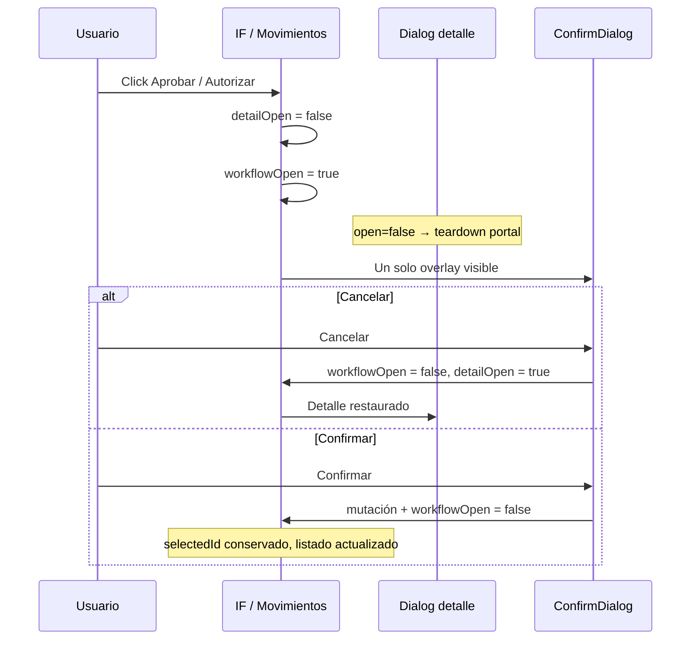

# INV — Reporte de fix stacking modales (Aprobar / Autorizar)

**Fecha:** 10 junio 2026  
**Estado:** Implementado — pendiente QA en navegador por usuario  
**Referencia auditoría:** [`INV_MODAL_STACKING_AUDIT.md`](./INV_MODAL_STACKING_AUDIT.md)  
**Patrón aplicado:** B.1.1 IAM — cerrar Radix Dialog antes de abrir `ConfirmDialog`

---

## 1. Resumen

Se corrigió el apilamiento defectuoso **Radix Dialog (detalle) + ConfirmDialog (workflow)** en las dos pantallas B-L transaccionales INV. El fix garantiza que nunca coexisten ambos overlays con `open=true`, eliminando la pantalla negra intermedia y la necesidad de clicks adicionales.

| Métrica | Valor |
|---------|--------|
| Archivos modificados | **2** |
| Archivos fuera de alcance tocados | **0** |
| `ConfirmDialog` / `dialog.tsx` modificados | **No** |
| Build (`npm run build`) | **OK** |
| TypeScript (`tsc --noEmit`) | **OK** |
| Linter (archivos modificados) | **Sin errores** |

---

## 2. Archivos modificados (lista exacta)

| Archivo | Cambios |
|---------|---------|
| `src/features/inv/pages/InventarioFisicoPage.tsx` | Stack workflow: Aprobar, Finalizar, Anular |
| `src/features/inv/pages/MovimientosPage.tsx` | Stack workflow: Autorizar, Procesar, Anular |

**No modificados (según restricciones):**

- `src/shared/components/ui/ConfirmDialog.tsx`
- `src/shared/components/ui/dialog.tsx`
- Cualquier módulo ORG, IAM, Platform u otro INV

---

## 3. Cambios implementados

### 3.1 Patrón común (ambas páginas)

```tsx
const workflowConfirmOpen = /* flags de confirm activos */;
const detailDialogOpen = detailOpen && !workflowConfirmOpen;

<Dialog
  open={detailDialogOpen}
  onOpenChange={(open) => {
    if (!open && !workflowConfirmOpen) setDetailOpen(false);
  }}
>
```

**Al abrir workflow desde el detalle:**

1. `setDetailOpen(false)` — cierra Radix (teardown overlay/portal).
2. `set*Open(true)` — abre `ConfirmDialog` como único overlay.

**Al cancelar confirm:**

- Cierra confirm y `setDetailOpen(true)` si `selectedId` / `selectedMovimientoId` persiste.
- Restaura el modal de detalle sin perder selección.

**Al confirmar acción (mutación exitosa):**

- Cierra confirm **sin** reabrir detalle (`reopenDetail = false`).
- `selectedId` / `selectedMovimientoId` se mantienen para la mutación.

### 3.2 InventarioFisicoPage

| Acción | Handler apertura | Handler cierre cancel | Handler cierre éxito |
|--------|------------------|----------------------|----------------------|
| Aprobar | `setDetailOpen(false)` + `setAprobarOpen(true)` | `cerrarAprobar()` | `cerrarAprobar(false)` |
| Finalizar | `setDetailOpen(false)` + `setFinalizarOpen(true)` | `cerrarFinalizar()` | `cerrarFinalizar(false)` |
| Anular | `setDetailOpen(false)` + `setAnularOpen(true)` | `cerrarAnular()` | `cerrarAnular(false)` |

`workflowConfirmOpen = aprobarOpen || anularOpen || finalizarOpen`

### 3.3 MovimientosPage

| Acción | Handler apertura | Handler cierre cancel | Handler cierre éxito |
|--------|------------------|----------------------|----------------------|
| Autorizar | `setDetailOpen(false)` + `setAutorizarOpen(true)` | `cerrarAutorizar()` | `cerrarAutorizar(false)` |
| Procesar | `setDetailOpen(false)` + `setProcesarOpen(true)` | `cerrarProcesar()` | `cerrarProcesar(false)` |
| Anular | `setDetailOpen(false)` + `setAnularOpen(true)` | `cerrarAnular()` | `cerrarAnular(false)` |

`workflowConfirmOpen = autorizarOpen || procesarOpen || anularOpen`

---

## 4. QA manual

### 4.1 Verificación estática (ejecutada en implementación)

| # | Caso | Verificación código | Resultado |
|---|------|---------------------|-----------|
| S-01 | IF → Aprobar: no stack simultáneo | `setDetailOpen(false)` antes de `setAprobarOpen(true)` + `detailDialogOpen` | **PASS** |
| S-02 | IF → Finalizar | Idem patrón | **PASS** |
| S-03 | IF → Anular | Idem patrón | **PASS** |
| S-04 | Movimientos → Autorizar | Idem patrón | **PASS** |
| S-05 | Movimientos → Procesar | Idem patrón | **PASS** |
| S-06 | Movimientos → Anular | Idem patrón | **PASS** |
| S-07 | Cancelar confirm reabre detalle | `reopenDetailIfSelected()` en handlers cancel | **PASS** |
| S-08 | Éxito no reabre detalle | `cerrar*(false)` en `.then()` post-mutación | **PASS** |
| S-09 | `selectedId` / `selectedMovimientoId` preservados | No se limpian al abrir/cerrar workflow | **PASS** |
| S-10 | Label confirm con detalle cerrado | React Query cache en `conDetalleQuery.data` | **PASS** |
| S-11 | Build + types | `npm run build`, `tsc --noEmit` | **PASS** |

### 4.2 QA en navegador (pendiente usuario)

Ejecutar con sesión INV activa y permiso `inv.editar`:

| # | Flujo | Pasos | Resultado esperado | Estado |
|---|-------|-------|-------------------|--------|
| QA-01 | IF → Aprobar | Detalle → Aprobar | Confirm visible **de inmediato**, sin pantalla negra | ☐ Pendiente |
| QA-02 | IF → Finalizar | Detalle → Finalizar | Idem | ☐ Pendiente |
| QA-03 | IF → Anular | Detalle → Anular | Idem | ☐ Pendiente |
| QA-04 | Movimientos → Autorizar | Detalle → Autorizar | Idem | ☐ Pendiente |
| QA-05 | Movimientos → Procesar | Detalle (estado autorizado) → Procesar | Idem | ☐ Pendiente |
| QA-06 | Movimientos → Anular | Detalle → Anular | Idem | ☐ Pendiente |
| QA-07 | Cancelar confirm | Cualquier workflow → Cancelar | Vuelve modal detalle del mismo registro | ☐ Pendiente |
| QA-08 | Confirmar acción | Cualquier workflow → Confirmar | Toast éxito, confirm cierra, listado actualizado | ☐ Pendiente |
| QA-09 | DevTools post-abrir confirm | Consola / Elements | `document.querySelectorAll('[data-radix-dialog-overlay]').length === 0` | ☐ Pendiente |
| QA-10 | Cerrar detalle con X (sin workflow) | Abrir detalle → X | Cierra detalle, listado usable | ☐ Pendiente |

**Protocolo DevTools (QA-09):**

```js
document.body.style.overflow
document.body.style.pointerEvents
document.querySelectorAll('[data-radix-dialog-overlay]').length
```

Valores sanos: overflow/pointerEvents vacíos, 0 overlays Radix.

---

## 5. Validación explícita por flujo (objetivo del fix)

| Pantalla | Acción | ¿Implementado? | Comportamiento esperado post-fix |
|----------|--------|----------------|----------------------------------|
| Inventario Físico | Aprobar | **Sí** | Confirm inmediato, un solo overlay |
| Inventario Físico | Finalizar | **Sí** | Confirm inmediato, un solo overlay |
| Inventario Físico | Anular | **Sí** | Confirm inmediato, un solo overlay |
| Movimientos | Autorizar | **Sí** | Confirm inmediato, un solo overlay |
| Movimientos | Procesar | **Sí** | Confirm inmediato, un solo overlay |
| Movimientos | Anular | **Sí** | Confirm inmediato, un solo overlay |

---

## 6. Riesgos residuales

| Riesgo | Severidad | Notas |
|--------|-----------|-------|
| Label confirm vacío si detalle no cargó antes del workflow | **Baja** | Preexistente; cache React Query mitiga en uso normal |
| Query `conDetalle` deshabilitada con `detailOpen=false` durante confirm | **Baja** | Datos en cache; label y mutación usan `selectedId` |
| Cambio de empresa con modal/confirm abierto | **Media** (preexistente) | `inv-list-empresa-reset.ts` resetea estados; no regresión introducida por este fix |
| Reapertura detalle tras cancel puede mostrar loader breve | **Baja** | Query se re-habilita; cache suele evitar flash |
| QA navegador no ejecutado por implementador | **Media** | Validación visual pendiente; build/types OK |

---

## 7. Diagrama flujo post-fix



---

## 8. Veredicto

| Pregunta | Respuesta |
|----------|-----------|
| ¿Fix mínimo implementado? | **Sí** — solo 2 archivos INV, patrón B.1.1 |
| ¿Restricciones respetadas? | **Sí** — sin tocar primitivas ni otros módulos |
| ¿Listo para QA navegador? | **Sí** |
| ¿Commit incluido? | **No** — según protocolo del proyecto |

---

*Reporte generado tras implementación del fix INV modal stacking.*
