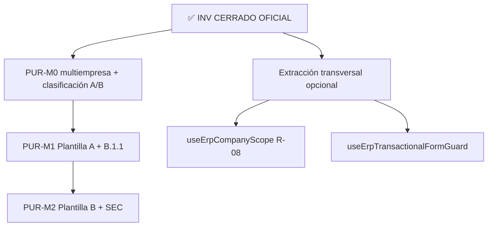

# Auditoría de cierre — Módulo INV (Inventario)

**Fecha:** 31 mayo 2026  
**Estado:** **✅ CERRADO OFICIAL**  
**Sign-off:** QA INV-M2-SEC + QA INV-M3 completados — sin incidencias P0/P1  
**Sin código · sin repair · sin commit**

**Referencias:** [`ERP_FRONTEND_STANDARDS_V1.md`](./ERP_FRONTEND_STANDARDS_V1.md) · [`ERP_MODULE_PATTERN_AUDIT.md`](./ERP_MODULE_PATTERN_AUDIT.md) · [`ORG_SPRINT_CLOSURE_AUDIT.md`](./ORG_SPRINT_CLOSURE_AUDIT.md) · [`INV_UX_CLASSIFICATION_AUDIT.md`](./INV_UX_CLASSIFICATION_AUDIT.md) · [`INV_M3_B11_CATALOGS_AUDIT.md`](./INV_M3_B11_CATALOGS_AUDIT.md)

---

## 1. Veredicto ejecutivo

| Pregunta | Respuesta |
|----------|-----------|
| ¿INV está listo para uso productivo? | **Sí** — multiempresa, catálogos, transaccionales y seguridad UX B.1.1 validados |
| ¿INV puede declararse **Plantilla B (Transaccional)**? | **Sí, oficialmente** — referencia canónica B-F / B-L / B-R para PUR, SLS, FIN, LOG |
| ¿Paridad con ORG cerrado? | **Sí en seguridad UX catálogo** — B.1.1 en 5 modales INV (M3) alineado a ORG E-SEC |
| ¿Cierre formal del módulo? | **✅ CERRADO OFICIAL** — 5/5 sprints implementados y QA cerrados |

### 1.1 Estado por sprint

| Sprint | Alcance | Estado | QA |
|--------|---------|--------|-----|
| **INV-M0-b** | Multiempresa JWT, guards, hooks gate, regresiones REG-001–005 | ✅ **Cerrado** | Validado |
| **INV-M1-UX-A** | 5 catálogos: toolbar ORG, empty IAM, skeleton, búsqueda | ✅ **Cerrado** | Validado |
| **INV-M1-UX-B** | B-O1 Stock UUID, B-O2 Kardex deep-link | ✅ **Cerrado** | Validado |
| **INV-M2-SEC** | Dirty guard B-F, discard B.1.1, empresa create/edit, listas O6 | ✅ **Cerrado** | [`INV_M2_SEC_QA_BEHAVIOR_MATRIX.md`](./INV_M2_SEC_QA_BEHAVIOR_MATRIX.md) §3–§10 |
| **INV-M3** | B.1.1 create/edit en 5 catálogos (R-01), reset empresa modals | ✅ **Cerrado** | QA-01–QA-09 × 5 catálogos × create/edit |

### 1.2 Declaración formal

El módulo **INV (Inventario)** se declara **cerrado oficialmente** al 31 mayo 2026.

INV es el **primer módulo ERP operativo completo** bajo el modelo bifurcado **Plantilla A (catálogo) + Plantilla B (transaccional/consulta)**, con infraestructura multiempresa JWT alineada a ORG y exportable al resto del frontend.

---

## 2. Estado global INV post-cierre

### 2.1 Inventario de pantallas (13 rutas)

| Ruta | Pantalla | Plantilla | Madurez |
|------|----------|-----------|---------|
| `/inv/categorias` | Categorías | **A** | M0-b + M1-UX-A + **M3 B.1.1** ✅ |
| `/inv/unidades-medida` | Unidades | **A** | Idem |
| `/inv/tipos-movimiento` | Tipos movimiento | **A** | Idem |
| `/inv/almacenes` | Almacenes | **A** | Idem |
| `/inv/productos` | Productos (listado) | **A+** | Idem; form modal extenso + B.1.1 |
| `/inv/stock` | Stock | **B-R** | M0-b + M1-UX-B (B-O1) ✅ |
| `/inv/kardex` | Kardex | **B-R** | M0-b + M1-UX-B (B-O2) ✅ |
| `/inv/movimientos` | Movimientos | **B-L** | M0-b + M2-SEC O6 ✅ |
| `/inv/movimientos/nuevo` | Nuevo movimiento | **B-F** | M0-b + M2-SEC ✅ |
| `/inv/movimientos/:id/editar` | Editar movimiento | **B-F** | Idem |
| `/inv/inventario-fisico` | Inventario físico | **B-L** | M0-b + M2-SEC O6 ✅ |
| `/inv/inventario-fisico/nuevo` | Nueva toma | **B-F** | M0-b + M2-SEC ✅ |
| `/inv/inventario-fisico/:id/editar` | Editar toma | **B-F** | Idem |

### 2.2 Madurez por dimensión (escala 1–5)

| Dimensión | Pre-M0 | **Post cierre (M0–M3)** | Referencia |
|-----------|--------|-------------------------|------------|
| Multiempresa JWT | 2.0 | **4.5** | ORG |
| Catálogos UX listado (A) | 2.5 | **4.5** | ORG E-UX + M3 B.1.1 |
| Transaccional §11 (cabecera+detalle) | 3.5 | **4.5** | Estándar §11 |
| Consultas B-R (Stock/Kardex) | 2.5 | **3.5** | Funcional OK; empty inline |
| Seguridad UX formularios B-F (B.1.1 adaptado) | 1.0 | **4.5** | M2-SEC QA ✅ |
| B.1.1 modales catálogo | 1.0 | **4.5** | M3 QA ✅ |
| Performance FK (N× GET producto) | 2.0 | **2.0** | Backlog R-05 |
| **Madurez global INV** | **~2.5** | **~4.2** | **Módulo referencia ERP** |

### 2.3 Infraestructura reutilizable creada

| Pieza | Ubicación | Uso futuro |
|-------|-----------|------------|
| `useInvSessionScope` / `useInvScopeEmpresaReset` | `hooks/useInvSessionScope.ts` | Scope JWT INV → generalizar `useErpCompanyScope` |
| `useInvCompanyQueryGate` | `hooks/inv-company-query-gate.ts` | Gate queries company |
| `InvCompanyRouteGuard` | `components/guards/` | Rutas INV |
| `InvTableSkeleton` | `components/` | Listas INV / A |
| `useInvTransactionalFormGuard` | `hooks/` | **Patrón B-F** — PUR/SLS/FIN transaccionales |
| `form-dirty/*` (movimiento, IF, **5 catálogos**) | `utils/form-dirty/` | Dirty por entidad; extensible ERP |
| `createInvPageDiscardHandlers` | `utils/` | Página completa B-F |
| `createOrgDiscardHandlers` + `OrgDiscardConfirmDialog` | ORG (reutilizado INV-M3) | Modales catálogo A |
| `inv-list-empresa-reset` | `utils/` | Listas B-L al cambiar empresa |
| `inv-catalog-client-search` | `utils/` | Búsqueda client-side catálogos |

---

## 3. Comparación vs `ERP_FRONTEND_STANDARDS_V1`

| Sección estándar | INV catálogo (A) | INV transaccional (B) | Cumplimiento |
|------------------|------------------|----------------------|--------------|
| **§3 Multiempresa JWT** | ✅ | ✅ | **Cumple** — ME-01–ME-05 |
| **§5 Toolbar** | ✅ `OrgCompanyToolbar` | ✅ Toolbar operativa propia | **Cumple** |
| **§6 Búsqueda** | ✅ server (Productos) + client (resto) | N/A en B-R/B-L | **Cumple** |
| **§7 Empty state** | ✅ `IamTableEmptyState` | ⚠️ Inline (válido B) | **Cumple funcional** |
| **§8 Skeleton** | ✅ | ✅ `InvTableSkeleton` | **Cumple** |
| **§9 B.1.1** | ✅ Modales create/edit (M3) | ✅ B-F (M2-SEC) | **Cumple** |
| **§10 CRUD modal** | ✅ B.1.1 + `orgDialogGuardProps` | N/A | **Cumple** |
| **§11 Cabecera+detalle** | N/A | ✅ Página completa, `con-detalle` | **Cumple** — referencia §11.4 |
| **§12 UUID en UI** | ✅ | ✅ (B-O1 Stock) | **Cumple** |
| **§13 Multiempresa UI** | ✅ | ✅ `OrgSessionEmpresaField` | **Cumple** |
| **§14 Árbol ORG vs INV** | Clasificación correcta | Clasificación correcta | **Cumple** |

**Conclusión estándar:** INV cumple el **modelo bifurcado** del estándar v1.0 en todas las dimensiones obligatorias. Brechas restantes son **recomendadas u opcionales** (§6.2–§6.3).

---

## 4. Comparación vs ORG cerrado

| Dimensión | ORG (post E-SEC) | INV (post M3) | Delta |
|-----------|------------------|---------------|-------|
| Multiempresa JWT + guards | ✅ 4.5 | ✅ 4.5 | **Paridad** |
| B.1.1 modales CRUD | ✅ 6 páginas | ✅ 5 catálogos | **Paridad funcional** |
| B.1.1 / dirty formularios página | N/A (modales) | ✅ B-F | **INV extiende patrón** |
| Toolbar + empty + skeleton | 🟡 2.5 (ORG pendiente E-UX) | ✅ Catálogos 4.5 | **INV catálogo adelantado** |
| Reset empresa + modals | 🟡 Sin mensaje (ORG DT-10) | ✅ Catálogos + B-F + B-L | **INV adelantado** |
| Infra discard compartida | `org-discard-*`, `form-dirty/*` | Reutiliza ORG + `inv-form-dirty/*` | **Integración correcta** |

**Conclusión ORG:** INV alcanza **paridad E-SEC en catálogos** (M3). ORG mantiene deuda cosmética propia (E-UX toolbar/empty); no bloquea reutilización INV→PUR.

---

## 5. ¿INV como Plantilla B (Transaccional) oficial?

### 5.1 Veredicto

| Afirmación | Válida |
|------------|--------|
| INV es **referencia canónica Plantilla B** para nuevos módulos ERP transaccionales | **✅ Sí — oficial** |
| El **módulo INV completo** está cerrado sin deuda obligatoria | **✅ Sí** — deuda residual solo Recomendada/Opcional |
| Plantilla A dentro de INV está al mismo nivel que ORG catálogo en B.1.1 | **✅ Sí** — M3 cierra R-01 |
| INV **es** Plantilla B en su totalidad | **No** — es **bifurcado A + B** (correcto según §14 estándar) |

### 5.2 Qué copiar como Plantilla B (referencia canónica)

| Elemento | Archivo / pieza referencia |
|----------|---------------------------|
| Formulario cabecera + líneas | `MovimientoFormPage.tsx`, `InventarioFisicoFormPage.tsx` |
| Hooks `*ConDetalle` | `movimientos.hooks.ts`, `inventario-fisico.hooks.ts` |
| Service deprecated documentado | `inv.service.ts` |
| Lista transaccional + detalle modal | `MovimientosPage.tsx`, `InventarioFisicoPage.tsx` |
| Consulta solo lectura | `StockPage.tsx`, `KardexPage.tsx` |
| Dirty guard página completa | `useInvTransactionalFormGuard.ts` |
| Layout §11.5 | Secciones `bg-surface` cabecera + detalle |

### 5.3 Qué copiar como Plantilla A (desde INV catálogos)

| Elemento | Archivo / pieza referencia |
|----------|---------------------------|
| Listado + modal CRUD | `UnidadesMedidaPage.tsx` (piloto M3), `CategoriasPage.tsx` |
| B.1.1 modal discard | `createOrgDiscardHandlers` + `OrgDiscardConfirmDialog` + `*-form-dirty.ts` |
| Reset empresa modals | Extensión `useInvScopeEmpresaReset` en `resetPageFilters` |
| Toolbar + empty + skeleton | Patrón M1-UX-A en cualquier catálogo INV |

### 5.4 Qué NO exportar como Plantilla B

| Elemento | Motivo |
|----------|--------|
| `OrgCompanyToolbar` en listas B | Es Plantilla A |
| Empty inline en B-R/B-L | Válido pero no obligatorio |
| Modales workflow sin dirty en campos | Alcance Mantener M2 |
| `useInvTransactionalFormGuard` en modales catálogo | Modales usan patrón ORG E-SEC |

---

## 6. Hallazgos clasificados (deuda residual)

### 6.1 Obligatoria — **ninguna pendiente**

| ID | Hallazgo | Estado |
|----|----------|--------|
| ~~O-01~~ | QA manual M2-SEC | ✅ Cerrado |
| ~~O-02~~ | Blocker RR (sidebar / atrás) en B-F | ✅ Cerrado |
| ~~O-03~~ | Cambio empresa edit → redirect sin stale | ✅ Cerrado |
| ~~O-04~~ | Multiempresa JWT en 13 rutas | ✅ Cerrado M0-b |
| ~~M3-H01–H04~~ | B.1.1 catálogos (R-01) | ✅ Cerrado M3 |

**No hay deuda obligatoria que bloquee operación INV ni reutilización ERP.**

### 6.2 Recomendada (backlog técnico — no bloquea cierre)

| ID | Hallazgo | Origen | Esfuerzo |
|----|----------|--------|----------|
| **R-02** | Empty con filtros activos (4 listas B) | M1-UX-B BL-B1 | Bajo |
| **R-03** | `TABLE_COLSPAN` compartido | M1-UX-B BL-B2 | Bajo |
| **R-04** | `toAppPath` en links hardcoded | M1-UX-B BL-B3 | Bajo |
| **R-05** | Batch lookup productos (N× GET) | BL-B6 / M2 audit | Medio |
| **R-06** | Dirty en confirms workflow (aprobar IF, motivo anular) | M2 excluido | Bajo |
| **R-07** | `beforeunload` en form dirty | M2 excluido | Bajo |
| **R-08** | Extraer `useErpCompanyScope` compartido ORG/INV | Estándar ME-07 | Medio-alto |
| **R-09** | Productos form modal → página (A+) | INV-EMP | Alto |
| **R-10** | Tests unitarios `inv-form-dirty/*.ts` | Calidad | Medio |
| **M3-R01** | `FormSection` + `DialogBody` en modales INV | Cosmética ORG | Bajo |
| **M3-R02** | `scheduleModalStackValidation('inv-*')` en DEV | Diagnóstico | Bajo |
| **M3-R04** | Wrapper `createInvCatalogDiscardHandlers` | DRY opcional | Bajo |

### 6.3 Opcional / Mantener

| ID | Item | Clasificación | Motivo |
|----|------|---------------|--------|
| **M-01** | Modales detalle lectura sin B.1.1 | **Mantener** | Sin formulario editable |
| **M-02** | Confirms workflow solo mensaje | **Mantener** | B11-02 |
| **M-03** | Toolbar operativa B sin wrapper | **Mantener** | Cumple prompt maestro |
| **M-04** | Empty inline en transaccionales | **Mantener** | Patrón B válido |
| **M-05** | `InvPageLayout` ausente en B-F | **Mantener** | Full-bleed transaccional |
| **M-06** | Filtro `producto_id` en Stock UI | **Opcional** | API disponible |
| **M-07** | Migración `IamTableEmptyState` en B | **Opcional** | Cosmética |
| **M-08** | `REG-007` hooks detalle legacy | **Opcional** | Limpieza técnica M0 |

---

## 7. Deuda técnica consolidada

### 7.1 Cerrada en ciclo INV (no reabrir)

| Ítem | Sprint |
|------|--------|
| Selector empresa local / “Todas las empresas” | M0-b |
| REG-001–005 regresiones | M0-b |
| Toolbar/empty/skeleton catálogos | M1-UX-A |
| Stock UUID fallback | M1-UX-B B-O1 |
| Kardex deep-link | M1-UX-B B-O2 |
| Dirty guard + empresa B-F + list reset | M2-SEC |
| QA M2-SEC (matriz comportamiento) | M2-SEC |
| **B.1.1 en 5 modales catálogo (R-01)** | **M3** |
| QA M3 (QA-01–09 × 5 catálogos) | M3 |

### 7.2 Abierta post-cierre (prioridad sugerida)

```
P2 — R-05 performance FK; R-02/R-03/R-04 UX menor
P3 — R-08 shared scope; R-09 Productos página; R-10 + M3-R03 tests
P4 — M3-R01 cosmética modales; R-06/R-07/R-07 hardening SEC
```

Ningún ítem P2+ bloquea declaración de cierre ni arranque PUR/SLS.

---

## 8. Incorporación a `.cursorrules` y `PROMPT_FRONTEND_MAESTRO`

**Desbloqueado** tras cierre QA M2 + M3. Propuesta de incorporación:

### 8.1 Añadir a `.cursorrules`

| Regla | Contenido resumido |
|-------|-------------------|
| **Clasificación INV** | 5 catálogos = Plantilla A; Stock/Kardex = B-R; Mov/IF = B-L + B-F |
| **Multiempresa INV** | `useInvSessionScope` + `useInvCompanyQueryGate` + `InvCompanyRouteGuard` |
| **Transaccional** | POST/PUT `con-detalle` único; página completa §11; referencia `MovimientoFormPage` |
| **Dirty guard B-F** | `useInvTransactionalFormGuard` + `OrgDiscardConfirmDialog` |
| **Dirty guard catálogo A** | `createOrgDiscardHandlers` + `orgDialogGuardProps` + `*-form-dirty.ts` |
| **Consultas B-R** | Sin toolbar ORG; fallback FK `—` nunca UUID |

### 8.2 Añadir a `PROMPT_FRONTEND_MAESTRO.md`

| Bloque | Contenido |
|--------|-----------|
| **Árbol decisión plantilla** | §14 `ERP_FRONTEND_STANDARDS_V1` |
| **Referencias canónicas INV** | Tabla rutas B-F / B-L / B-R + catálogos A |
| **Formulario transaccional** | Dirty guard + cambio empresa + §11.5 |
| **CRUD modal catálogo** | Patrón M3: ORG E-SEC reutilizado |
| **Checklist pre-PR** | Dirty B-F + B.1.1 modales + asserts `empresa_id` |

---

## 9. Reutilización futura para módulos ERP

### 9.1 Confirmación

INV queda habilitado como **módulo plantilla de referencia** para:

| Destino | Plantilla a copiar | Referencia INV |
|---------|-------------------|----------------|
| **PUR / SLS catálogos** | A | M1-UX-A + **M3 B.1.1** |
| **PUR / SLS documentos** | B-F / B-L | M2-SEC (`useInvTransactionalFormGuard`) |
| **FIN asientos** | B-F | `MovimientoFormPage` pattern |
| **LOG guías** | B-L + B-F | `MovimientosPage` + form page |

### 9.2 Secuencia recomendada post-INV



| Fase | Acción |
|------|--------|
| **Inmediato** | Arrancar **PUR-M0-b** (scope JWT + guards) |
| **Corto** | PUR-M1-UX-A catálogos + M3-equivalent B.1.1 desde día 1 |
| **Medio** | PUR-M2-SEC transaccionales (OC, recepciones) |
| **Paralelo INV** | R-05 performance FK si Mov/IF en producción intensiva |

### 9.3 Extracción transversal (cuando PUR/SLS arranque)

| Extraer | Desde | Beneficio |
|---------|-------|-----------|
| `useErpTransactionalFormGuard` | `useInvTransactionalFormGuard` | PUR/SLS/FIN |
| `useErpCompanyScope` | `useInvSessionScope` + ORG | ME-07 |
| `erp-form-dirty.helpers` | `inv-form-dirty` + `org-form-dirty` | Un solo normalizador |
| Patrón discard catálogo | INV-M3 + ORG E-SEC | PUR/SLS catálogos |

---

## 10. Criterios de cierre formal INV

| Criterio | Estado |
|----------|--------|
| QA manual M2-SEC sin P0/P1 | ✅ |
| QA manual M3 (R-01) sin P0/P1 | ✅ |
| Sign-off producto/técnico | ✅ (31 mayo 2026) |
| Deuda obligatoria = 0 | ✅ |

**Estado:** **5/5 sprints implementados · 5/5 sprints QA cerrados · CERRADO OFICIAL**

---

## 11. Documentos de trazabilidad

| Documento | Rol |
|-----------|-----|
| `INV_M0_B_CLOSURE.md` | Cierre multiempresa |
| `INV_M1_UX_A_AUDIT.md` / `INV_M1_UX_A_SEARCH_AUDIT.md` | Catálogos UX |
| `INV_M1_UX_B_CLASSIFICATION.md` | Transaccional UX mínimo |
| `INV_M2_SEC_AUDIT.md` | Auditoría seguridad UX |
| `INV_M2_SEC_IMPLEMENTATION_PLAN.md` | Plan técnico M2 |
| `INV_M2_SEC_QA_BEHAVIOR_MATRIX.md` | Fuente verdad QA M2 |
| `INV_M3_B11_CATALOGS_AUDIT.md` | Auditoría + alcance R-01 |
| **`INV_MODULE_CLOSURE_AUDIT.md`** | **Este documento — cierre oficial módulo** |

---

## 12. Veredicto final

INV evolucionó de **piloto multiempresa parcial** (~2.5) a **módulo referencia ERP** (~4.2) con modelo bifurcado **Plantilla A + Plantilla B** completamente operativo y auditado.

| Declaración | Estado |
|-------------|--------|
| **Plantilla B (Transaccional) oficial** | ✅ **Sí** — referencia canónica exportable |
| **Plantilla A (Catálogo) en INV** | ✅ **Sí** — paridad ORG E-SEC en B.1.1 |
| **Módulo INV cerrado oficialmente** | ✅ **CERRADO OFICIAL** — 31 mayo 2026 |
| **Listo para enseñar a PUR/SLS** | ✅ **Sí** — §5.2, §5.3, §9 |

---

*Auditoría de cierre módulo INV — **CERRADO OFICIAL**. Sin código. Sin repair. Sin commit.*
