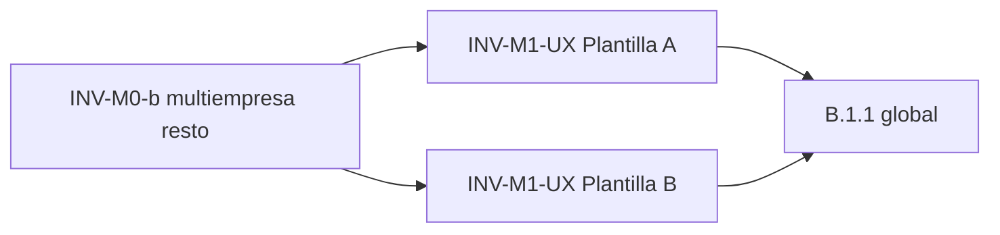

# Auditoría UX/UI y clasificación funcional — Módulo INV

**Fecha:** 31 mayo 2026  
**Estado:** Solo auditoría — sin implementación, sin commit  
**Referencias:** [`ERP_FRONTEND_STANDARDS_V1.md`](./ERP_FRONTEND_STANDARDS_V1.md) · [`INV_M0_IMPLEMENTATION_AUDIT.md`](./INV_M0_IMPLEMENTATION_AUDIT.md) · [`INVENTORY_MULTIEMPRESA_AUDIT.md`](./INVENTORY_MULTIEMPRESA_AUDIT.md)  
**Contexto:** ORG cerrado (E-UX + multiempresa). INV-M0 piloto **Categorías** (scope JWT + guard); resto INV pendiente M0/UX.

---

## 1. Objetivo y criterios de clasificación

Definir qué pantallas INV adoptan **Plantilla A — Catálogo** (paridad ORG E-UX + maestros) y cuáles **Plantilla B — Transaccional** (operaciones de inventario propias).

| Plantilla | Naturaleza | Referencia estándar |
|-----------|------------|---------------------|
| **A — Catálogo** | Maestro company-scoped: listar, filtrar texto, activos/inactivos, CRUD en modal | ORG (`DepartamentosPage`, `CentrosCostoPage`) + `ERP_FRONTEND_STANDARDS_V1` §5–10 |
| **B — Transaccional** | Documentos, consultas analíticas, flujos de estado, cabecera+detalle | INV (`MovimientoFormPage`, listas con filtros operativos) + estándar §11 |

**Variantes documentadas en esta auditoría:**

| Variante | Descripción |
|----------|-------------|
| **A** | Catálogo estándar |
| **A+** | Catálogo en listado; formulario modal **grande** (candidato a página en fase posterior, sin cambiar clasificación de listado) |
| **B-L** | Listado transaccional (filtros múltiples, sin “Ver inactivos” típico) |
| **B-F** | Formulario página completa cabecera + detalle |
| **B-R** | Consulta solo lectura (sin Crear ni baja lógica) |

---

## 2. Resumen ejecutivo

| Clasificación | Pantallas | Cantidad |
|---------------|-----------|----------|
| **A / A+** (patrón ORG catálogo) | Categorías, Unidades medida, Tipos movimiento, Almacenes, **Productos** | 5 |
| **B-L** (lista transaccional) | Movimientos, Inventario físico | 2 |
| **B-R** (consulta) | Stock, Kardex | 2 |
| **B-F** (formulario documento) | Movimiento (nuevo/editar), Inventario físico (nuevo/editar) | 2 (rutas) |

**Conclusión:** **5 pantallas → patrón ORG (catálogo)** para toolbar, empty, skeleton, B.1.1 y multiempresa. **4 pantallas de lista + 2 formularios → patrón INV (transaccional)** con toolbar operativa propia (no forzar Plantilla A literal en Movimientos/Kardex/Stock/IF).

---

## 3. Inventario de rutas INV

| Ruta | Pantalla | Tipo UI |
|------|----------|---------|
| `/inv/categorias` | Categorías | Lista + modales |
| `/inv/unidades-medida` | Unidades de medida | Lista + modales |
| `/inv/productos` | Productos | Lista + modales (form extenso) |
| `/inv/almacenes` | Almacenes | Lista + modales |
| `/inv/tipos-movimiento` | Tipos de movimiento | Lista + modales |
| `/inv/stock` | Stock | Lista solo lectura |
| `/inv/movimientos` | Movimientos | Lista + detalle modal + acciones estado |
| `/inv/movimientos/nuevo` | Nuevo movimiento | Página form |
| `/inv/movimientos/:id/editar` | Editar movimiento | Página form |
| `/inv/inventario-fisico` | Inventario físico | Lista + detalle modal + workflow |
| `/inv/inventario-fisico/nuevo` | Nueva toma | Página form |
| `/inv/inventario-fisico/:id/editar` | Editar toma | Página form |
| `/inv/kardex` | Kardex | Lista solo lectura |

---

## 4. Ficha por pantalla

### 4.1 Categorías (`CategoriasPage.tsx`)

| Campo | Valor |
|-------|--------|
| **Clasificación** | **A** |
| **Justificación funcional** | Maestro de clasificación de productos: entidad estable, pocos campos, alta/baja lógica, sin flujo documental ni líneas. |
| **UX actual** | Post INV-M0 piloto: sin selector empresa; toolbar `[Ver inactivos] [Crear]`; skeleton `InvTableSkeleton`; empty inline; modales create/edit; **sin buscador**; sin B.1.1; sin `IamTableEmptyState`. |
| **UX objetivo** | `[OrgToolbarSearch] [Ver inactivos] ——————— [Crear]` + `IamTableEmptyState` + B.1.1 + toolbar `justify-between` (E-UX.1). |
| **¿Buscador?** | **Sí — recomendado** (ver §6). API: `GET /inv/categorias` sin `buscar` hoy; ampliar hook/servicio solo si backend expone `buscar` (validar contrato). Si no hay `buscar` en API: búsqueda **client-side** temporal o ticket backend. |
| **¿Ver inactivos?** | **Sí** (`solo_activos` invertido). |
| **CRUD** | **Modal** (`max-w-lg`). |
| **Prioridad migración** | **P1** — M0 hecho; siguiente **INV-M1-UX** (catálogo piloto UX). |

---

### 4.2 Unidades de medida (`UnidadesMedidaPage.tsx`)

| Campo | Valor |
|-------|--------|
| **Clasificación** | **A** |
| **Justificación funcional** | Catálogo maestro reutilizado por productos y movimientos; CRUD simple. |
| **UX actual** | Selector empresa + “Todas las empresas”; checkbox inactivos; modal CRUD; skeleton; empty inline; sin búsqueda. |
| **UX objetivo** | Plantilla A completa post M0 + E-UX ORG. |
| **¿Buscador?** | **Opcional** — pocos registros por empresa; útil si >30 UM. Prioridad baja. |
| **¿Ver inactivos?** | **Sí** |
| **CRUD** | **Modal** |
| **Prioridad migración** | **P1** — INV-M0 (multiempresa) luego M1-UX. |

---

### 4.3 Tipos de movimiento (`TiposMovimientoPage.tsx`)

| Campo | Valor |
|-------|--------|
| **Clasificación** | **A** |
| **Justificación funcional** | Maestro de configuración (clase movimiento, flags); no es documento transaccional. |
| **UX actual** | Igual familia UM/Categorías pre-M0; modal con más campos (~8 cols tabla); sin buscador. |
| **UX objetivo** | Plantilla A; modal puede ser `max-w-lg` o `max-w-xl` según campos. |
| **¿Buscador?** | **Recomendado sí** — lista puede crecer; API list sin `buscar` en service actual — validar OpenAPI. |
| **¿Ver inactivos?** | **Sí** |
| **CRUD** | **Modal** |
| **Prioridad migración** | **P2** — M0 luego UX. |

---

### 4.4 Almacenes (`AlmacenesPage.tsx`)

| Campo | Valor |
|-------|--------|
| **Clasificación** | **A** |
| **Justificación funcional** | Maestro logístico (sucursal, tipo almacén); prerequisito de stock/movimientos. |
| **UX actual** | Selector empresa; modal create con sucursal dependiente de empresa; sin buscador. |
| **UX objetivo** | Plantilla A; en modal: `OrgSessionEmpresaField` + select sucursal filtrado por `scopeEmpresaId`. |
| **¿Buscador?** | **Sí** — por código/nombre/dirección; API `almacenes.list` sin `buscar` hoy — validar contrato o filtro local. |
| **¿Ver inactivos?** | **Sí** |
| **CRUD** | **Modal** |
| **Prioridad migración** | **P1** — M0 (depende sucursal ORG scope) + UX. |

---

### 4.5 Productos (`ProductosPage.tsx`)

| Campo | Valor |
|-------|--------|
| **Clasificación** | **A+** (catálogo en listado; forma excepcional) |
| **Justificación funcional** | Es el **maestro central de INV**: alta/baja, SKU, categorías, precios, flags — conceptualmente catálogo, no documento con líneas. |
| **UX actual** | Selector empresa; **buscador texto** (`searchTerm` → API `buscar`); Ver inactivos; modal create/edit **~1200 líneas**, `max-w-3xl`, scroll — UX de formulario transaccional metido en modal. |
| **UX objetivo** | **Listado: Plantilla A** (toolbar ORG, empty IAM, skeleton, M0). **Formulario: evaluar página completa o modal XL** en fase **INV-EMP** (fuera de M1-UX mínimo). |
| **¿Buscador?** | **Sí — obligatorio** (ya existe; migrar a `IamSearchInput`). |
| **¿Ver inactivos?** | **Sí** |
| **CRUD** | **Modal hoy** → **recomendación futura: página** `/inv/productos/nuevo` y `/:id/editar` si el form sigue creciendo (no bloquea clasificación A en lista). |
| **Prioridad migración** | **P0** — INV-M0 + **P1** UX (alto uso); refactor form **P3** opcional. |
| **¿Layout incorrecto?** | **Parcialmente sí** — el **listado** es catálogo correcto; el **modal** es demasiado grande para patrón ORG estándar (`max-w-lg`). No es transaccional B (no hay líneas embebidas en listado). |

---

### 4.6 Stock (`StockPage.tsx`)

| Campo | Valor |
|-------|--------|
| **Clasificación** | **B-R** (consulta transaccional) |
| **Justificación funcional** | Vista **derivada/calculada**; sin CRUD; lectura de existencias y alertas mín/máx. |
| **UX actual** | Selector empresa; filtros almacén; toggle Stock/Alertas; sin Crear; sin inactivos; skeleton; enlace a Kardex por fila. |
| **UX objetivo** | Toolbar B: `[Almacén ▼] [Stock | Alertas]` + hint rendimiento; **sin** Plantilla A (no hay Crear ni Ver inactivos). Multiempresa JWT sin selector empresa. |
| **¿Buscador?** | **Opcional** — búsqueda por producto vía filtro producto en Kardex; en Stock podría añadirse filtro producto o texto si API lo soporta. |
| **¿Ver inactivos?** | **No** (no aplica) |
| **CRUD** | **Ninguno** (solo lectura + navegación) |
| **Prioridad migración** | **P2** — M0 primero; UX B-lite después. |

---

### 4.7 Kardex (`KardexPage.tsx`)

| Campo | Valor |
|-------|--------|
| **Clasificación** | **B-R** |
| **Justificación funcional** | Traza histórica de movimientos por producto/almacén/fecha; consulta analítica. |
| **UX actual** | Empresa, almacén, producto, fechas; sin Crear; mensaje hint fechas; skeleton; empty simple. |
| **UX objetivo** | Toolbar B compacta; filtros alineados a sesión; empty IAM opcional con mensaje “acote fechas”; **no** Ver inactivos. |
| **¿Buscador?** | **No** como texto libre — filtros estructurados (producto, fechas) son el patrón correcto. |
| **¿Ver inactivos?** | **No** |
| **CRUD** | **Ninguno** |
| **Prioridad migración** | **P3** — M0 + mejoras empty. |

---

### 4.8 Movimientos — listado (`MovimientosPage.tsx`)

| Campo | Valor |
|-------|--------|
| **Clasificación** | **B-L** |
| **Justificación funcional** | Documentos con **ciclo de vida** (borrador → autorizado → procesado → anulado); filtros operativos; detalle con líneas; acciones en modal. |
| **UX actual** | Empresa, almacén, tipo, estado, fechas; CTA `Link` a página nuevo; detalle modal grande; autorizar/procesar/anular; skeleton; sin Ver inactivos de maestro. |
| **UX objetivo** | `[Fecha desde] [Fecha hasta] [Almacén ▼] [Tipo ▼] [Estado ▼] ——— [Nuevo movimiento]`; JWT scope; edición en `MovimientoFormPage`. |
| **¿Buscador?** | **Opcional** — búsqueda por número de movimiento si API expone filtro; hoy no en toolbar. |
| **¿Ver inactivos?** | **No** (estados de documento ≠ activo/inactivo maestro) |
| **CRUD** | **Crear/editar: página completa**; consulta detalle: modal |
| **Prioridad migración** | **P2** — M0; B.1.1 en modal detalle opcional; no forzar Plantilla A. |
| **¿Layout incorrecto?** | **No** — lista transaccional + form página es patrón INV correcto (`ERP_FRONTEND_STANDARDS_V1` §11). |

---

### 4.9 Movimiento — formulario (`MovimientoFormPage.tsx`)

| Campo | Valor |
|-------|--------|
| **Clasificación** | **B-F** |
| **Justificación funcional** | Cabecera + líneas en un submit (`con-detalle`); patrón canónico INV. |
| **UX actual** | Header compacto volver/guardar; sección Cabecera grid; tabla líneas editable; selector empresa editable en create. |
| **UX objetivo** | Layout INV §11; `OrgSessionEmpresaField` en create; líneas embebidas; B.1.1 en salida con dirty (fase posterior). |
| **¿Buscador?** | **No** en formulario |
| **¿Ver inactivos?** | **No** |
| **CRUD** | **Página completa** |
| **Prioridad migración** | **P2** — M0 multiempresa en form. |

---

### 4.10 Inventario físico — listado (`InventarioFisicoPage.tsx`)

| Campo | Valor |
|-------|--------|
| **Clasificación** | **B-L** |
| **Justificación funcional** | Documento de conteo con estados (en proceso, finalizado, ajustado, anulado); workflow aprobar/finalizar/anular. |
| **UX actual** | Filtros empresa, almacén, estado, fechas; fila click → detalle modal con líneas; CTA nueva toma (página). |
| **UX objetivo** | Toolbar B alineada a Movimientos; sin Plantilla A. |
| **¿Buscador?** | **Opcional** por número de inventario |
| **¿Ver inactivos?** | **No** |
| **CRUD** | **Nueva/edición: página**; detalle: modal |
| **Prioridad migración** | **P2** — M0 luego UX. |

---

### 4.11 Inventario físico — formulario (`InventarioFisicoFormPage.tsx`)

| Campo | Valor |
|-------|--------|
| **Clasificación** | **B-F** |
| **Justificación funcional** | Toma física con líneas de conteo; `con-detalle` API. |
| **UX actual** | Similar a MovimientoFormPage; selector empresa. |
| **UX objetivo** | Patrón INV transaccional; sesión JWT en empresa. |
| **¿Buscador?** | **No** |
| **¿Ver inactivos?** | **No** |
| **CRUD** | **Página completa** |
| **Prioridad migración** | **P2** — M0. |

---

## 5. Matriz consolidada

| Pantalla | Clase | Buscador | Ver inactivos | CRUD | M0 | UX ORG (A) | Prioridad |
|----------|-------|----------|---------------|------|-----|------------|-----------|
| Categorías | A | Sí † | Sí | Modal | ✅ Piloto | Pendiente | P1 UX |
| Unidades medida | A | Opcional | Sí | Modal | Pendiente | Pendiente | P1 |
| Tipos movimiento | A | Sí † | Sí | Modal | Pendiente | Pendiente | P2 |
| Almacenes | A | Sí † | Sí | Modal | Pendiente | Pendiente | P1 |
| Productos | A+ | **Sí** | Sí | Modal (→página?) | Pendiente | Pendiente | **P0** |
| Stock | B-R | Opcional | No | — | Pendiente | No aplica | P2 |
| Kardex | B-R | No | No | — | Pendiente | No aplica | P3 |
| Movimientos (lista) | B-L | Opcional | No | Página + modal | Pendiente | No aplica | P2 |
| Movimiento (form) | B-F | No | No | Página | Pendiente | No aplica | P2 |
| Inv. físico (lista) | B-L | Opcional | No | Página + modal | Pendiente | No aplica | P2 |
| Inv. físico (form) | B-F | No | No | Página | Pendiente | No aplica | P2 |

† Confirmar parámetro `buscar` en `INV_API.json` antes de implementar; Productos ya lo tiene.

---

## 6. Análisis focal: Categorías y Productos

### 6.1 ¿Categorías debe incorporar buscador?

| Criterio | Evaluación |
|----------|-----------|
| Volumen esperado | Medio-bajo por empresa, pero crece con jerarquía (padre/hijo) |
| Paridad ORG | Todas las listas ORG E-UX llevan `IamSearchInput` |
| Paridad INV | Productos, futuros maestros con `buscar` en API |
| Histórico INV | No tenía buscador — **gap de estandarización**, no de negocio |
| API actual (`categorias.list`) | Solo `empresa_id` + `solo_activos` en `inv.service.ts` |

**Recomendación:** **Sí, incluir buscador en UX objetivo (Plantilla A)** en INV-M1-UX para Categorías.

- Si el contrato admite `buscar`: implementar como Productos (server-side).
- Si no: ticket backend o filtro local temporal documentado como deuda.

**No bloquea** INV-M0 (ya cerrado en Categorías sin buscador).

### 6.2 ¿Productos es catálogo o transaccional?

| Dimensión | Catálogo (A) | Transaccional (B) |
|-----------|--------------|-------------------|
| Entidad | Maestro reutilizable | Documento con flujo |
| Listado | Tabla + filtros maestro | Filtros de documento |
| Alta/baja | `es_activo` | estados borrador/procesado |
| Líneas en submit | No | Sí (`con-detalle`) |
| Formulario | Modal o página simple | Cabecera + grid líneas |

**Veredicto:** **Catálogo (A+)** para **listado, toolbar, multiempresa, empty, skeleton, B.1.1**.

La **complejidad del formulario** no reclasifica Productos como B; reclasifica el **contenedor del form** como candidato a **página dedicada** (mejora de layout, sprint aparte).

---

## 7. Pantallas con layout incorrecto para su naturaleza

| Pantalla | ¿Incorrecto? | Comentario |
|----------|-------------|------------|
| Categorías | No | Modal acorde a maestro simple. |
| Unidades / Tipos / Almacenes | No | — |
| **Productos** | **Parcial** | Listado correcto; **modal XL** desalineado con ORG `max-w-lg` — usar página o wizard en sprint futuro. |
| Stock / Kardex | No | Consulta con filtros propios. |
| Movimientos / IF lista | No | B-L correcto. |
| Forms movimiento / IF | No | B-F correcto. |
| **Todas con selector empresa** | **Sí (pre-M0)** | Anti-patrón ME-02; solo Categorías corregido. |

---

## 8. Qué NO mezclar (anti-patrones)

| Anti-patrón | Dónde evitarlo |
|-------------|----------------|
| Plantilla A literal en Movimientos/Kardex/Stock | Filtros de fecha/estado/almacén no son “Ver inactivos” |
| Selector empresa en toolbar catálogo | Todas las A post-M0 |
| Modal con líneas embebidas para maestros simples | Usar B-F |
| Forzar `IamTableEmptyState` sin variante búsqueda en consultas vacías por filtros | B-R: mensaje “ajuste filtros” |
| B.1.1 en listados solo lectura sin formulario editable | Stock/Kardex: no prioritario |

---

## 9. Conclusión final

### 9.1 Patrón ORG (Plantilla A — catálogo)

Aplicar en:

1. **Categorías** (UX pendiente; M0 piloto listo)  
2. **Unidades de medida**  
3. **Tipos de movimiento**  
4. **Almacenes**  
5. **Productos** (listado; form aparte)

Incluye tras oleadas: multiempresa JWT (INV-M0), `InvCompanyRouteGuard`, `OrgSessionEmpresaField`, toolbar E-UX.1, `IamSearchInput`, `IamTableEmptyState`, `InvTableSkeleton`, B.1.1 en modales.

### 9.2 Patrón INV (Plantilla B — transaccional)

Mantener diseño propio en:

1. **Stock** (B-R)  
2. **Kardex** (B-R)  
3. **Movimientos** listado (B-L) + **MovimientoFormPage** (B-F)  
4. **Inventario físico** listado (B-L) + **InventarioFisicoFormPage** (B-F)

Toolbar tipo: `[Filtros operativos…] ————— [Acción primaria (Nuevo / Nueva toma)]`  
Sin “Todas las empresas”; filtros de almacén/producto/estado **permanecen** como selects de dominio (no confundir con selector de empresa de sesión).

### 9.3 Orden recomendado de implementación (post INV-M0 piloto Categorías)

| Fase | Alcance | Objetivo |
|------|---------|----------|
| **INV-M0-b** | UM, Tipos, Almacenes, Productos, Stock, Kardex, Movimientos, IF + forms + guards rutas | Multiempresa JWT en todo INV |
| **INV-M1-UX-A1** | Categorías (completar UX A) + UM + Tipos | Paridad ORG E-UX en maestros simples |
| **INV-M1-UX-A2** | Almacenes + **Productos** (listado) | Buscador + empty + B.1.1 |
| **INV-M1-UX-B1** | Stock, Kardex | Empty/skeleton coherente; toolbar compacta sin empresa local |
| **INV-M1-UX-B2** | Movimientos lista, IF lista | Toolbar B refinada; modales detalle |
| **INV-M2-SEC** | B.1.1 en modales catálogo restantes + forms transaccionales | Paridad E-SEC |
| **INV-EMP** (opcional) | Producto form → página completa | Corregir A+ layout modal |

---

## 10. Checklist de validación (para cierre de clasificación)

- [x] Las 11 rutas/pantallas INV analizadas  
- [x] Clasificación A vs B con justificación por pantalla  
- [x] Categorías + buscador analizados  
- [x] Productos catálogo vs transaccional resuelto  
- [x] Layout incorrecto identificado (empresa local; modal Productos)  
- [x] Orden de implementación post M0 definido  
- [x] Sin código ni commit en este entregable  

---

*Documento generado como auditoría UX/UI previa a migración INV. Sin implementación. Sin commit.*
