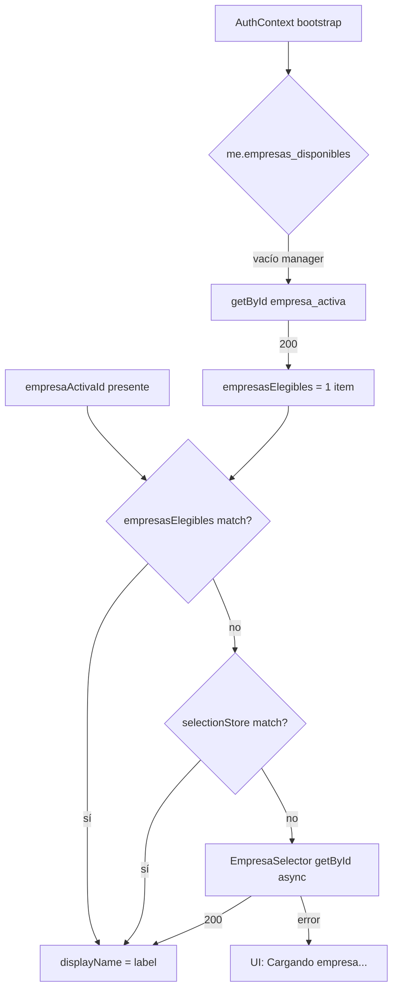

# M2 — Fix EmpresaSelector (manager header)

**Fecha:** 31 mayo 2026  
**Referencia:** [`MANAGER_EMPRESA_HEADER_RUNTIME_AUDIT.md`](MANAGER_EMPRESA_HEADER_RUNTIME_AUDIT.md)  
**Estado:** Implementado — sin commit

---

## 1. Problema

`manager` con `empresaActivaId` válido montaba `EmpresaSelector`, pero el componente ejecutaba:

```typescript
if (!displayName) return null;
```

Sin `empresasElegibles` ni `getById` exitoso, `displayName` quedaba `null` → **Header vacío**.

`tenant_admin` funcionaba por fallback `GET /org/empresa` en `AuthContext`.

---

## 2. Cambios implementados

### 2.1 `EmpresaSelector.tsx`

| Antes | Después |
|-------|---------|
| Ocultar si `!displayName` | Visible si `showEmpresaActiva && empresaActivaId` |
| Skeleton anónimo | Texto **"Cargando empresa..."** + spinner |
| `find` estricto UUID | `findEmpresaById` case-insensitive |
| Sin logs | `[EmpresaSelector][diag]` en DEV |

**Visibilidad:**

```typescript
if (!showEmpresaActiva || !empresaActivaId) return null;
// Nunca: if (!displayName) return null
```

**Label pendiente:**

```typescript
const labelText = displayName ?? 'Cargando empresa...';
```

### 2.2 `AuthContext.loadEmpresasElegiblesForSession()`

Cadena ampliada para operativos (`manager` / `user`):

```
1. GET /auth/me → empresas_disponibles
2. Zustand selectionStore (login Schema A residual)
3. tenant_admin → GET /org/empresa
4. operativo → GET /org/empresa/{empresa_activa}  ← NUEVO
```

Si `getById` responde 200, `empresasElegibles` incluye la empresa activa con nombres → `EmpresaSelector` resuelve label sin espera.

Logs DEV:

- `[AuthContext] loadEmpresasElegibles: getById operativo OK`
- `[AuthContext] loadEmpresasElegibles: getById fallback operativo falló`

### 2.3 `empresa-eligibles.ts`

Utilidades nuevas:

- `normalizeEmpresaId`
- `isSameEmpresaId` (UUID case-insensitive)
- `findEmpresaById`

---

## 3. Flujo de resolución de nombre (corregido)



### Por qué manager fallaba y tenant_admin no

| Paso | tenant_admin | manager (antes) | manager (después) |
|------|--------------|-----------------|-------------------|
| `/auth/me`.empresas_disponibles | null | null | null |
| Fallback AuthContext | `GET /org/empresa` ✅ | ninguno ❌ | `getById(activa)` ✅ |
| empresasElegibles | N items | `[]` | ≥1 si getById OK |
| displayName | inmediato | null → oculto | label o loading |

---

## 4. Logs temporales (DEV)

Consola al interactuar con header:

```javascript
[EmpresaSelector][diag] {
  empresaActivaId: "<uuid>",
  displayName: "Mi Empresa SA" | null,
  empresasElegiblesLength: 0 | 1 | N,
  showEmpresaActiva: true,
  canSwitchEmpresa: false | true,
  userType: "user" | "tenant_admin",
  loadingName: boolean,
  resolveFailed: boolean
}
```

AuthContext:

```javascript
[AuthContext] loadEmpresasElegibles: getById operativo OK { activaId, razon_social }
```

> Retirar o reducir logs en commit de producción si se desea.

---

## 5. Evidencia QA runtime

### Verificación estática

| Check | Resultado |
|-------|-----------|
| Eliminado `if (!displayName) return null` | ✅ |
| Guard por `empresaActivaId` | ✅ |
| Loading label definido | ✅ |
| Fallback operativo AuthContext | ✅ |
| UUID case-insensitive | ✅ |
| Linter archivos tocados | ✅ Sin errores |

### Matriz casos QA

#### Caso 1 — tenant_admin → nombre visible

| Paso | Esperado |
|------|----------|
| Login tenant_admin | `empresasElegibles` vía org list o /me |
| Header | Nombre real, no loading permanente |
| Log | `empresasElegiblesLength >= 1` |

**Runtime:** `[ ] tenant_admin /app → razón social visible`

#### Caso 2 — manager → nombre visible

| Paso | Esperado |
|------|----------|
| Login manager Schema B | `empresaActivaId` OK |
| Bootstrap | `getById` → `empresasElegibles[0]` o selector async |
| Header | Nombre o breve "Cargando..." → nombre |
| **No desaparece** | ✅ |

**Runtime:** `[ ] manager /app → badge visible con nombre`

#### Caso 3 — 1 empresa → badge sin dropdown

| Condición | UI |
|-----------|-----|
| `empresasElegibles.length === 1` | `canSwitchEmpresa === false` |
| Chevron | Ausente |
| Interacción | `div` estático |

**Runtime:** `[ ] 1 empresa → sin chevron`

#### Caso 4 — 2+ empresas → dropdown

| Condición | UI |
|-----------|-----|
| `empresasElegibles.length > 1` | `canSwitchEmpresa === true` |
| Requiere | `/auth/me.empresas_disponibles` poblado o lista completa |

**Runtime:** `[ ] 2+ empresas → dropdown + POST cambiar`

#### Caso 5 — empresaActivaId + displayName pendiente → loading

| Estado | UI |
|--------|-----|
| `empresaActivaId` set, fetch en curso | 🏢 **Cargando empresa...** + spinner |
| Componente | **Siempre visible** |

**Runtime:** `[ ] Throttle network → ver loading antes del nombre`

---

## 6. Network esperado (manager)

Tras login manager en `/app/home`:

```
GET /auth/me                           → empresa_activa: uuid
GET /org/empresa/{uuid}                → 200 (AuthContext +/o Selector)
```

Si `getById` → 403 en entorno QA:

- UI muestra **"Cargando empresa..."** (no desaparece)
- Log: `getById fallback operativo falló`
- Requiere BE permiso lectura empresa o `/auth/me` con nombres (fuera alcance FE)

---

## 7. Archivos modificados

| Archivo | Cambio |
|---------|--------|
| `src/shared/components/layout/EmpresaSelector.tsx` | Visibilidad, loading, logs, UUID match |
| `src/shared/context/AuthContext.tsx` | Fallback getById operativo + logs |
| `src/core/auth/utils/empresa-eligibles.ts` | Helpers ID/label |

---

## 8. Conclusión

El fix FE ataca dos capas:

1. **UX:** nunca ocultar el badge si hay `empresaActivaId`; loading explícito.
2. **Datos:** poblar `empresasElegibles` para operativos vía `getById(empresa_activa)` en bootstrap (misma API existente, sin cambios backend).

**Commit:** pendiente aprobación post-QA runtime.

---

*Generado tras implementación fix manager header.*
