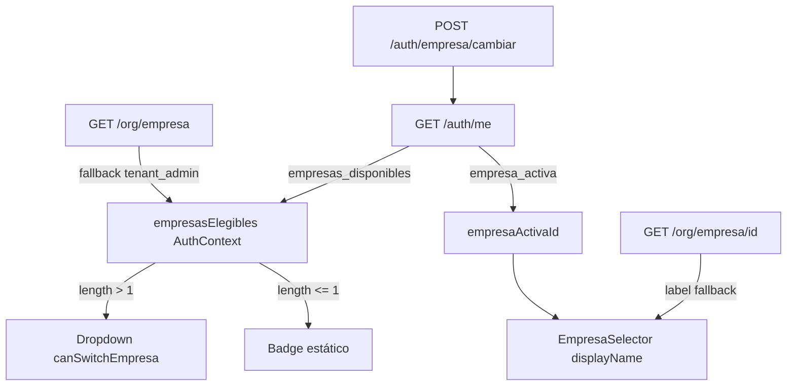

# M2 Frontend Multiempresa — Implementación (modelo congelado)

**Fecha:** 31 mayo 2026  
**Estado:** Implementado — sin commit  
**Referencias:** M1/M4 backend validados, [`FRONTEND_MULTIEMPRESA_M2_UX.md`](FRONTEND_MULTIEMPRESA_M2_UX.md)

---

## 1. Modelo congelado aplicado

| Regla | Implementación FE |
|-------|-------------------|
| `ADMIN_TENANT` tenant-wide | Fallback `GET /org/empresa` si `/auth/me` no trae lista |
| `MANAGER` / `USER` empresa-scoped | Fuente primaria: `GET /auth/me` → `empresas_disponibles` (usuario_rol) |
| Elegibilidad | `empresasElegibles` en AuthContext |
| JWT `empresa_id` | `empresaActivaId` (sin cambio) |
| Selector visible | `empresasElegibles.length > 1` — **sin depender de user_type** |
| Selector oculto (interactivo) | `empresasElegibles.length <= 1` — badge con nombre sí visible |
| `platform_admin` | Excluido de badge y selector |
| Cambio sesión | `POST /auth/empresa/cambiar/` → refresh completo (sin cambio de contrato) |

---

## 2. Archivos modificados

| Archivo | Cambio |
|---------|--------|
| `src/core/auth/utils/empresa-eligibles.ts` | **Nuevo** — normalización, labels, mapeo ORG |
| `src/features/auth/types/auth.types.ts` | `UserData.empresas_disponibles`, `empresasElegibles` en contexto |
| `src/features/auth/services/auth.service.ts` | Normaliza `empresas_disponibles` desde `/auth/me` |
| `src/shared/context/AuthContext.tsx` | `empresasElegibles`, `loadEmpresasElegiblesForSession()` |
| `src/features/auth/hooks/useEmpresaActiva.ts` | `showEmpresaActiva`, `canSwitchEmpresa`, sin user_type en regla dropdown |
| `src/shared/components/layout/EmpresaSelector.tsx` | Labels reales vía elegibles/`getById`; sin texto `"Empresa"` |
| `src/shared/components/layout/Header.tsx` | App + admin tenant_admin; excluye platform_admin |
| `src/core/auth/PermissionContext.tsx` | *(M2.3 previo)* reload por `empresaActivaId` + `auth.token` |
| `src/features/org/hooks/useOrgSessionScope.ts` | Aliases `empresasElegibles`, `canSwitchEmpresa` |
| `src/features/org/components/OrgActiveEmpresaBanner.tsx` | Sin fallback `"Empresa"` |

**No modificados (restricción):** Login, SeleccionarEmpresaPage, guards, backend.

---

## 3. Detalle por objetivo

### 3.1 Header — nombre de empresa activa

**Problema:** manager/user mostraban `"Empresa"` porque `GET /org/empresa` (lista) fallaba o no incluía su empresa asignada.

**Solución:**

1. Elegibles desde `/auth/me` (usuario_rol) con nombres incluidos.
2. Resolución de label en `EmpresaSelector`:
   - `empresasElegibles` → store selección → `GET /org/empresa/{id}` (`getById`).
3. Eliminados todos los fallbacks al string fijo `"Empresa"`.
4. Si no hay nombre resoluble: componente oculto (skeleton mientras carga).

### 3.2 Selector — regla `empresasElegibles.length`

```typescript
// useEmpresaActiva.ts
showEmpresaActiva = hasEmpresaActiva && !requiereSeleccionEmpresa && userType !== 'platform_admin';
canSwitchEmpresa = empresasElegibles.length > 1;
```

| `empresasElegibles` | UI |
|-------------------|-----|
| 0 | Sin badge (o sin nombre resuelto) |
| 1 | Badge con razón social / nombre comercial, **sin** chevron |
| 2+ | Badge + dropdown |

### 3.3 Shell App / Admin

```tsx
// Header.tsx
{!isSuperAdminUser &&
  (shell === 'app' || (shell === 'admin' && isTenantAdminUser)) && (
    <EmpresaSelector />
  )}
```

| Actor | `/app` | `/admin` |
|-------|--------|----------|
| tenant_admin | ✅ | ✅ |
| manager / user | ✅ | ❌ |
| platform_admin | ❌ | ❌ |

### 3.4 Cambio de empresa — cadena de refresco

Sin cambios en contrato; verificado en código:

```
cambiarEmpresaActiva
  → POST /auth/empresa/cambiar/
  → applyFullSessionToken
       → queryClient.clear()
       → invalidateOrgQueries()
       → initializeAuth()
            → GET /auth/me (empresa_activa + empresas_disponibles)
            → loadEmpresasElegiblesForSession()
            → GET /auth/menu
       → PermissionContext reload (token + empresaActivaId)
```

### 3.5 Carga de `empresasElegibles`

```typescript
// AuthContext.loadEmpresasElegiblesForSession
1. platform_admin → []
2. normalize(me.empresas_disponibles) → si length > 0, usar
3. tenant_admin → fallback GET /org/empresa?solo_activos=true
4. manager/user → [] si /auth/me no trae lista (elegibilidad estricta usuario_rol)
```

---

## 4. Evidencia de validación

### 4.1 Verificación estática

| Check | Resultado |
|-------|-----------|
| Linter archivos M2 | ✅ Sin errores |
| Fallback `"Empresa"` en EmpresaSelector | ✅ Eliminado |
| Regla dropdown por `length > 1` | ✅ `canSwitchEmpresa` |
| platform_admin excluido | ✅ `userType !== 'platform_admin'` + Header `!isSuperAdminUser` |
| PermissionContext post-cambio | ✅ deps `auth.token`, `empresaActivaId` |
| Login / SeleccionarEmpresa / guards | ✅ Sin diff |

### 4.2 Matriz QA (casos oficiales)

#### Caso 1 — 1 empresa → sin selector

| Verificación | Esperado | Evidencia código |
|--------------|----------|------------------|
| `empresasElegibles.length === 1` | Badge estático | `!canSwitchEmpresa` → `div` no interactivo |
| Chevron | Ausente | `canSwitchEmpresa ? ChevronDown : null` |
| Nombre | razón social / nombre comercial | `resolveEmpresaLabel` |

**Runtime:** `[ ] Login usuario 1 empresa → header muestra nombre, sin dropdown`

#### Caso 2 — 2 empresas → selector visible

| Verificación | Esperado | Evidencia código |
|--------------|----------|------------------|
| `empresasElegibles.length === 2` | Botón + dropdown | `canSwitchEmpresa === true` |
| Lista | 2 empresas con nombres | `empresasElegibles.map` |

**Runtime:** `[ ] Dropdown con 2 opciones, cambio invoca POST cambiar`

#### Caso 3 — tenant_admin, >1 empresa

| Verificación | Esperado | Evidencia código |
|--------------|----------|------------------|
| `/admin` | Selector visible | Header condición admin + tenant |
| Lista | me o fallback org | `loadEmpresasElegiblesForSession` tenant branch |

**Runtime:** `[ ] tenant_admin en /admin/usuarios → selector si N>1`

#### Caso 4 — manager, >1 empresa

| Verificación | Esperado | Evidencia código |
|--------------|----------|------------------|
| Fuente lista | `/auth/me` empresas_disponibles | `fromMe` primero |
| Nombre header | No genérico | `getById` fallback |
| `/app` only | Sí | Header shell === 'app' |

**Runtime:** `[ ] manager ve nombres reales + dropdown si N>1`

#### Caso 5 — user, >1 empresa

| Verificación | Esperado | Evidencia código |
|--------------|----------|------------------|
| Igual manager | usuario_rol vía /auth/me | Misma rama no tenant_admin |
| SeleccionarEmpresaPage | Sin cambio | No tocado |

**Runtime:** `[ ] user multiempresa post-login o post-selección`

#### Caso 6 — platform_admin → sin selector

| Verificación | Esperado | Evidencia código |
|--------------|----------|------------------|
| Header | No monta EmpresaSelector | `!isSuperAdminUser` |
| Hook | `showEmpresaActiva === false` | `isPlatformAdmin` |
| Lista | `[]` | `loadEmpresasElegiblesForSession` early return |

**Runtime:** `[ ] super-admin shell sin badge empresa`

### 4.3 Regresiones adicionales

| Escenario | Esperado |
|-----------|----------|
| Cambio desde `/app` | me + menu + permissions/me en Network |
| Cambio desde `/admin` tenant_admin | Idem |
| tenant_admin 1 empresa en admin | Badge nombre, sin dropdown |
| Operativo 1 empresa | Badge nombre, sin dropdown |
| Error POST cambiar | Toast error, label anterior conservado |

---

## 5. Diagrama de fuentes de datos



---

## 6. Pendientes / fuera de alcance

| Item | Nota |
|------|------|
| Commit git | Pendiente aprobación usuario |
| QA runtime | Ejecutar checklists §4.2 en entorno integrado |
| Páginas ERP con `empresaFilter` local | Migración incremental (no M2) |
| `OrgSessionEmpresaField` getById async | Label vía scope; banner ORG actualizado |

---

## 7. Conclusión

M2 cierra la UX multiempresa según modelo congelado:

- ✅ Nombre real de empresa en header (manager/user corregido)
- ✅ Selector solo si `empresasElegibles.length > 1`
- ✅ tenant_admin en `/app` y `/admin`
- ✅ platform_admin excluido
- ✅ Refresh completo post-cambio
- ✅ Sin endpoints nuevos ni cambios backend

**Commit:** no generado.
