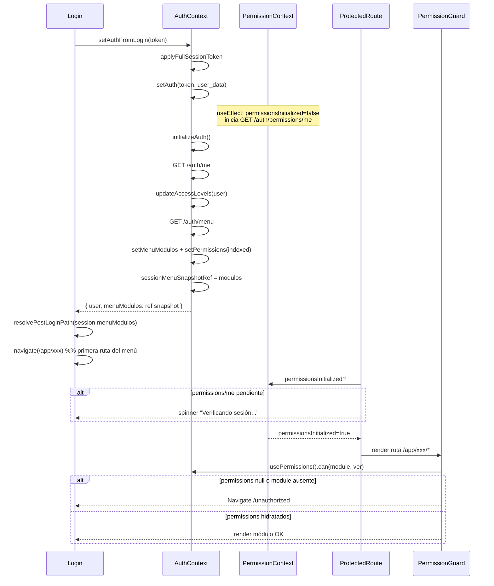

# Auditoría runtime — MANAGER post-login → `/unauthorized`

**Fecha:** 31 mayo 2026  
**Alcance:** Solo diagnóstico runtime frontend. **Sin modificación de código. Sin backend.**  
**Síntoma QA:** Login MANAGER → redirección inicial a `/unauthorized` → sin errores backend ni visibles en UI → al pulsar **"Volver a mi página principal"** ingresa correctamente.

---

## 1. Resumen ejecutivo

| Pregunta | Respuesta |
|----------|-----------|
| ¿`PermissionGuard` evalúa antes de `GET /auth/permissions/me`? | **Sí, potencialmente.** `PermissionGuard` **no usa** `permissionsInitialized` ni `/auth/permissions/me`. Usa permisos indexados de `/auth/menu` en `AuthContext`. |
| ¿`ProtectedRoute` espera `permissions/me`? | **Sí.** Bloquea con spinner hasta `permissionsInitialized === true`. |
| ¿Hay desacople entre las dos fuentes de permisos? | **Sí.** `ProtectedRoute` espera una señal; `PermissionGuard` usa otra señal distinta (`AuthContext.loading`, que en `/login` ya es `false`). |
| ¿Race condition confirmada? | **Probable (alta confianza).** Escenario coherente con el síntoma: destino post-login es una ruta con `PermissionGuard` mientras `AuthContext.permissions` aún no está commiteado en React → `can()` → `false` → `/unauthorized`. |
| URL visible al usuario | **`/unauthorized`** |
| URL que dispara el redirect | **Primera ruta visible de `GET /auth/menu`** (p. ej. `/app/inv/...`, `/app/org/...`), **no** `/app/home` salvo menú vacío. |

**Causa raíz inferida:** ventana de carrera entre (a) navegación post-login basada en snapshot síncrono del menú (`sessionMenuSnapshotRef`) y (b) hidratación React de `permissions` indexados desde `/auth/menu`. `PermissionGuard` no tiene gate equivalente a `permissionsInitialized`.

---

## 2. Escenario QA reproducible

```
1. Usuario MANAGER (user_type ≈ "user") hace login Schema B (sesión completa).
2. Login.tsx calcula destino y navega.
3. ProtectedRoute deja pasar tras /auth/permissions/me.
4. PermissionGuard en la ruta destino evalúa can(module, "ver") → false.
5. Navigate → /unauthorized (replace).
6. Usuario pulsa "Volver a mi página principal".
7. Segunda navegación → éxito (/app/home o misma ruta con permisos ya hidratados).
```

---

## 3. Flujo completo post-login

### 3.1 Diagrama de secuencia



### 3.2 Paso a paso (archivos)

| # | Paso | Componente | Detalle |
|---|------|------------|---------|
| 1 | Submit login | `Login.tsx` | `authService.login()` → token Schema B |
| 2 | Hidratar sesión | `AuthContext.setAuthFromLogin` → `applyFullSessionToken` | `queryClient.clear()`, `setAuth({ token, user })`, `syncImpersonationFromToken` |
| 3 | Perfil | `initializeAuth` | `GET /auth/me` → merge JWT claims → `setAuth({ user: sessionUser })` |
| 4 | Menú + permisos ruta | `loadMenuAndPermissionsFromAuthMenu` | `GET /auth/menu` → `setMenuModulos(modulos)` + `setPermissions(indexRoutePermissionsFromMenu(modulos))` |
| 5 | Snapshot menú | `sessionMenuSnapshotRef` | Ref síncrono devuelto a Login como `session.menuModulos` |
| 6 | Empresas elegibles | `loadEmpresasElegiblesForSession` | Paralelo tardío; no bloquea navigate |
| 7 | Permisos UI | `PermissionContext` | Efecto paralelo: `GET /auth/permissions/me` → `permissionsInitialized=true` |
| 8 | Destino | `resolvePostLoginPath` | Primera ruta `/app/*` visible del menú (manager) |
| 9 | Navegación | `Login.tsx` | `navigate(destination, { replace: true })` |
| 10 | Shell ERP | `ProtectedRoute requireOperationalUser` | Espera `authInitialized`, `!authLoading`, **`permissionsInitialized`** |
| 11 | Guard módulo | `PermissionGuard` | `can(module, action)` sobre **`AuthContext.permissions`**; solo espera `AuthContext.loading` |
| 12 | Denegado | `PermissionGuard` | `<Navigate to="/unauthorized" state={{ requiredPermission }} />` |

---

## 4. ¿`PermissionGuard` evalúa antes de `permissions/me`?

### 4.1 Dos sistemas de permisos (intencionalmente separados)

| Sistema | Fuente API | Consumidor | Propósito |
|---------|-----------|------------|-----------|
| **A — Permisos de ruta (LBAC módulo)** | `GET /auth/menu` → `indexRoutePermissionsFromMenu` | `PermissionGuard`, `usePermissions().can()` | Acceso a prefijos `/app/{modulo}/*` |
| **B — Permisos granulares (string)** | `GET /auth/permissions/me` | `PermissionContext.hasPermission()`, `ProtectedRoute` gate | UI fina + señal "sesión lista" |

Comentario explícito en código:

```7:9:src/core/auth/PermissionContext.tsx
 * Nota: el menú lateral y PermissionGuard usan permisos derivados de GET /auth/menu
 * (AuthContext). Este provider solo inicializa `permissionsInitialized` para ProtectedRoute
 * y `hasPermission(codigo)` granular; no sustituye la visibilidad del menú.
```

### 4.2 Respuesta directa

- **`PermissionGuard` no espera `GET /auth/permissions/me`.** Nunca consulta `PermissionContext`.
- **`PermissionGuard` puede evaluar en el primer render útil tras `ProtectedRoute`**, que ocurre cuando `permissionsInitialized === true` (fin de `/auth/permissions/me`).
- En ese instante, **`/auth/permissions/me` ya terminó**, pero **`AuthContext.permissions` (de `/auth/menu`) puede seguir siendo `null` en el render** si React aún no commiteó el `setPermissions` de `initializeAuth`.

Es decir: no es una carrera *menu vs permissions/me en red*, sino una carrera **`permissionsInitialized` (B) vs commit React de `permissions` indexados (A)**.

### 4.3 Gate de loading en `PermissionGuard`

```59:62:src/app/router/guards/PermissionGuard.tsx
  if (loading) {
    return <LoadingSpinner fullScreen message="Verificando permisos..." />;
  }
```

`loading` proviene de `AuthContext.loading`, que en ruta `/login`:

```1041:1048:src/shared/context/AuthContext.tsx
			if (window.location.pathname === '/login') {
				setLoading(false);
				setAuthInitialized(true);
				setIsBootstrapped(true);
				// ...
				return;
			}
```

**`AuthContext.loading` queda `false` antes del login.** Durante `setAuthFromLogin`, **no se vuelve a poner `loading=true`**. Por tanto, `PermissionGuard` **nunca muestra** "Verificando permisos..." en el flujo post-login.

---

## 5. Estado inicial en el primer render post-login

### 5.1 Valores en el instante crítico (render tras `permissionsInitialized=true`)

| Estado | Valor probable 1er render | Origen | Notas |
|--------|---------------------------|--------|-------|
| `AuthContext.loading` | `false` | Bootstrap `/login` | No refleja carga de menú post-login |
| `AuthContext.authInitialized` | `true` | `initializeAuth` | OK |
| `PermissionContext.permissionsInitialized` | `true` | fin `loadPermissions` | `ProtectedRoute` deja pasar |
| `PermissionContext.permissions` | `string[]` de `/auth/permissions/me` | PermissionContext | **No lo usa PermissionGuard** |
| `AuthContext.menuModulos` | `null` → `AuthMenuModulo[]` | `setMenuModulos` async | Puede ir retrasado vs ref |
| `AuthContext.permissions` (indexed) | **`null`** (estado previo logout/login) | `useState(null)` inicial | **Crítico para `can()`** |
| `sessionMenuSnapshotRef` | **poblado** | post `/auth/menu` | Usado por Login; no visible en hooks |

### 5.2 Comportamiento de `usePermissions().can()`

```44:56:src/core/auth/hooks/usePermissions.ts
    if (!permissions) {
      return false;
    }
    const modulePermissions = permissions[module];
    if (!modulePermissions) {
      return false;
    }
    return modulePermissions[action] ?? false;
```

Con `permissions === null` → **`can()` siempre `false`** → redirect `/unauthorized`.

Con `permissions === {}` (error menú / sin roles) → mismo resultado para cualquier módulo.

### 5.3 Por qué Login sí tiene menú pero el guard no

Login recibe menú desde **ref síncrono**, no desde React state:

```1205:1205:src/shared/context/AuthContext.tsx
			return { user: me, menuModulos: sessionMenuSnapshotRef.current };
```

```110:114:src/features/auth/pages/Login.tsx
        const destination = resolvePostLoginPath({
          isSuperAdmin,
          userType,
          menuModulos: session.menuModulos,
          fromPathname: from ?? APP_HOME,
        });
```

`resolvePostLoginPath` elige destino con datos **ya disponibles en memoria**, pero `PermissionGuard` lee **`useAuth().permissions`**, que depende del ciclo de commit de React.

---

## 6. `SmartRedirect` vs `resolvePostLoginPath` en login MANAGER

### 6.1 ¿Interviene `SmartRedirect`?

**No en el flujo directo de login.** `SmartRedirect` solo monta en `/` bajo `ProtectedRoute`:

```26:29:src/app/router.tsx
  {
    element: <ProtectedRoute />,
    children: [{ path: '/', element: <SmartRedirect /> }],
  },
```

Login navega explícitamente:

```121:121:src/features/auth/pages/Login.tsx
        navigate(destination, { replace: true });
```

### 6.2 ¿Se envía a ruta protegida antes de permisos?

**Sí, por diseño**, para MANAGER con menú no vacío:

```69:70:src/core/routing/resolve-post-login-from-menu.ts
  const appRoute = routes.find((r) => r.startsWith('/app/') || r.startsWith('/app'));
  if (appRoute) return mapLegacyErpPath(appRoute);
```

La primera ruta visible del menú casi siempre cae bajo un prefijo con `PermissionGuard` en `app-route-tree.tsx` (`org`, `inv`, `pur`, etc.). **`/app/home` no tiene `PermissionGuard`**, pero solo se usa si el menú no aporta rutas `/app/*`.

Prioridad en `resolvePostLoginPath`:

1. `findFirstNavigableRouteFromMenu` → **gana si hay menú**
2. Fallback `fromPathname` (Login pasa `from ?? APP_HOME`, irrelevante si hay menú)
3. `APP_HOME` (`/app/home`)

---

## 7. URL exacta del incidente

### 7.1 URL que ve el usuario

**`/unauthorized`** — ruta pública, sin layout ERP:

```17:20:src/app/router.tsx
  {
    path: '/unauthorized',
    element: <UnauthorizedPage />,
  },
```

### 7.2 URL que provoca el redirect (ruta disparadora)

No es fija: es **`destination` calculado en login** = primera ruta visible de `GET /auth/menu` con prefijo `/app/`, en orden backend (`modulo.orden` → `menu.orden`).

**Inferencia por rol MANAGER (user_type `"user"`):**

| Orden menú backend (ejemplo) | URL disparadora | PermissionGuard |
|------------------------------|-----------------|-----------------|
| 1º módulo INV | `/app/inv/productos` o similar | `module="inv" action="ver"` |
| 1º módulo ORG | `/app/org/...` | `module="org" action="ver"` |
| 1º HCM/autorizacion | `/app/autorizacion/...` | `module="autorizacion" action="ver"` |
| Menú vacío / sin rutas app | `/app/home` | **Sin guard** → no debería ir a unauthorized por este bug |

**Evidencia runtime (DEV):**

```
[Login] navigate → <DESTINO> (user_type: user, from: ...)
🚫 [PermissionGuard] Acceso denegado a <module>.ver - Usuario no tiene el permiso requerido
```

El state de navegación a `/unauthorized` incluye:

```76:79:src/app/router/guards/PermissionGuard.tsx
      <Navigate 
        to={redirectTo} 
        state={{ from: location, requiredPermission: `${module}.${action}` }} 
```

Inspeccionar en React Router DevTools: `location.state.requiredPermission` → p. ej. `inv.ver`.

### 7.3 Por qué "Volver a mi página principal" funciona

`UnauthorizedPage` recalcula destino con estado React ya estabilizado:

```11:12:src/pages/UnauthorizedPage.tsx
  const getReturnPath = (): string =>
    resolvePostLoginPath({ isSuperAdmin, userType, menuModulos });
```

**Escenario A (más probable — race):** `menuModulos` y `permissions` ya commiteados → misma ruta destino → `can()` ahora `true` → acceso OK.

**Escenario B (fallback silencioso):** si en `/unauthorized` `menuModulos` aún fuera `null` en hook, `findFirstNavigableRouteFromMenu` devuelve `null` → **`APP_HOME` (`/app/home`)** sin `PermissionGuard` → acceso OK aunque el race persista en rutas guardadas.

El label **"Volver a mi página principal"** corresponde a `userType !== tenant_admin && !isSuperAdmin` — coherente con MANAGER.

---

## 8. Análisis de carrera — timeline detallado

```
T0  Bootstrap en /login
    authLoading=false, permissions=null, menuModulos=null
    PermissionContext: !isAuthenticated → permissionsInitialized=true

T1  setAuthFromLogin: setAuth(token, user_data)
    isAuthenticated=true
    PermissionContext effect: permissionsInitialized=false, GET /auth/permissions/me ▶

T2  initializeAuth: GET /auth/me → setAuth(user merged)

T3  loadMenuAndPermissionsFromAuthMenu: GET /auth/menu
    setMenuModulos(modulos)      ─┐ updates React (async commit)
    setPermissions(indexed)      ─┘
    sessionMenuSnapshotRef = modulos (sync)

T4  initializeAuth return → Login resolvePostLoginPath(ref) → navigate(/app/xxx)

T5  ProtectedRoute: permissionsInitialized=false → spinner

T6  GET /auth/permissions/me complete → permissionsInitialized=true

T7  ProtectedRoute render children → PermissionGuard
    READ permissions from useAuth()
    ┌─ Si commit T3 no aplicado aún: permissions=null → /unauthorized  ⚠️
    └─ Si commit T3 aplicado: can(module,ver) según indexed → OK
```

**Condición necesaria para el bug:** T7 ocurre con `permissions === null` (o módulo ausente en índice) pese a T3 haber ejecutado `setPermissions` en la misma cadena async pre-navigate.

Factores que aumentan probabilidad:

- React 18 batching + navegación inmediata post-`await`
- `StrictMode` en dev (`main.tsx`) — doble montaje de efectos
- Segundo `setAuth` dentro de `initializeAuth` (re-render intermedio)
- Efecto `PermissionContext` que resetea `permissionsInitialized` en cambio de `empresaActivaId` / `usuario_id` durante `initializeAuth`

---

## 9. Hipótesis alternativas (menor probabilidad)

| Hipótesis | ¿Explica "segundo click OK"? | Comentario |
|-----------|------------------------------|------------|
| Desajuste `permissionModule` vs `PermissionGuard module` (p. ej. `INV_BILL` → `inv-bill`, HCM vs `autorizacion`) | **No** de forma fiable | Fallaría siempre en la misma ruta |
| Manager sin `ver` en menú para 1er ítem pero menú visible | **No** | `isMenuVisibleInPayload` y `permisos.ver` deberían alinearse; fallo persistente |
| Destino `from` previo a login apuntando a ruta sin permiso | Parcial | Login prioriza menú sobre `from`; solo si menú vacío |
| `/auth/menu` error → `permissions={}` | Parcial | Fallo persistente en guards, no solo primer intento |

La hipótesis de **estado React desincronizado** es la que mejor encaja con **fallo transitorio + recuperación sin reload**.

---

## 10. Matriz de gates (quién espera qué)

| Capa | Espera `authInitialized` | Espera `authLoading=false` | Espera `permissionsInitialized` | Espera `AuthContext.permissions` |
|------|--------------------------|----------------------------|--------------------------------|----------------------------------|
| `ProtectedRoute` `/app/*` | ✅ | ✅ | ✅ (`/auth/permissions/me`) | ❌ |
| `PermissionGuard` | ❌ | ❌ (usa `loading` inerte post-login) | ❌ | **Implícito vía `can()`** |
| `Login` navigate | ❌ (usa ref menú) | ❌ | ❌ | ❌ |
| `SmartRedirect` `/` | ✅ | ✅ | ❌ (no usa PermissionContext) | ❌ |

**Hueco:** entre fin de `permissions/me` y commit de `permissions` indexados del menú no hay gate unificado.

---

## 11. Evidencia a capturar en QA (sin cambiar código)

Para confirmar en una sesión MANAGER afectada:

1. **Console DEV**
   - `[Login] navigate → ...`
   - `[ProtectedRoute] spinner` con `permissionsInitialized`
   - `🚫 [PermissionGuard] Acceso denegado a X.ver`

2. **React Router state en `/unauthorized`**
   - `location.state.requiredPermission` → módulo exacto
   - `location.state.from.pathname` → URL disparadora

3. **React DevTools — AuthContext en `/unauthorized`**
   - `permissions`: ¿`null`, `{}` u objeto con claves?
   - `menuModulos`: ¿array poblado?

4. **Network (orden temporal)**
   - `/auth/me` → `/auth/menu` → (navigate) → `/auth/permissions/me`
   - Verificar que `/auth/menu` **completa antes** del primer render de `PermissionGuard`

5. **Comparar destinos**
   - Destino `[Login] navigate`
   - Destino link Unauthorized (`getReturnPath()`)
   - Si difieren → escenario B (fallback `/app/home`)

---

## 12. Conclusión

| # | Hallazgo |
|---|----------|
| 1 | El flujo post-login MANAGER **sí navega a rutas protegidas por `PermissionGuard`** cuando el menú tiene ítems `/app/*`; no usa `/app/home` por defecto. |
| 2 | **`PermissionGuard` no espera `GET /auth/permissions/me`** ni expone un flag de "menú indexado listo". |
| 3 | **`ProtectedRoute` sí espera `permissions/me`**, pero eso **no garantiza** que `AuthContext.permissions` (de `/auth/menu`) esté disponible en el mismo render. |
| 4 | **`AuthContext.loading` es inútil como gate post-login** (ya `false` en `/login`). |
| 5 | Login usa **snapshot ref del menú** para navegar; el guard usa **state React** para autorizar → **desincronización clásica**. |
| 6 | URL visible: **`/unauthorized`**. URL disparadora: **primera ruta del menú** (log `[Login] navigate → ...`). |
| 7 | Recuperación vía Unauthorized: **re-navegación con contexto estabilizado** y/o **fallback a `/app/home`**. |

**Veredicto:** race condition **probable** en frontend, no requiere fallo backend. Es un problema de **orquestación de señales de "listo"** entre AuthContext (menú) y PermissionContext (permissions/me), con `PermissionGuard` acoplado solo al primero sin gate fiable.

---

## 13. Direcciones de fix (solo referencia — fuera de alcance)

No implementadas en esta auditoría. Opciones conceptuales para revisión posterior:

1. Gate en `PermissionGuard`: esperar `menuModulos !== null && permissions !== null` (o flag `menuPermissionsReady`).
2. Alinear `AuthContext.loading=true` durante `initializeAuth` / post-login.
3. Defer `navigate` en Login hasta confirmar commit de permisos (callback/`flushSync` — evaluar impacto).
4. Destino post-login MANAGER por defecto a `/app/home` (evita guard en primer paint; UX distinta).
5. Unificar señal "sesión operativa lista" que incluya menú indexado **y** permissions/me.

---

*Documento generado por auditoría estática de código. Validación runtime recomendada con logs DEV de la sección 11.*
