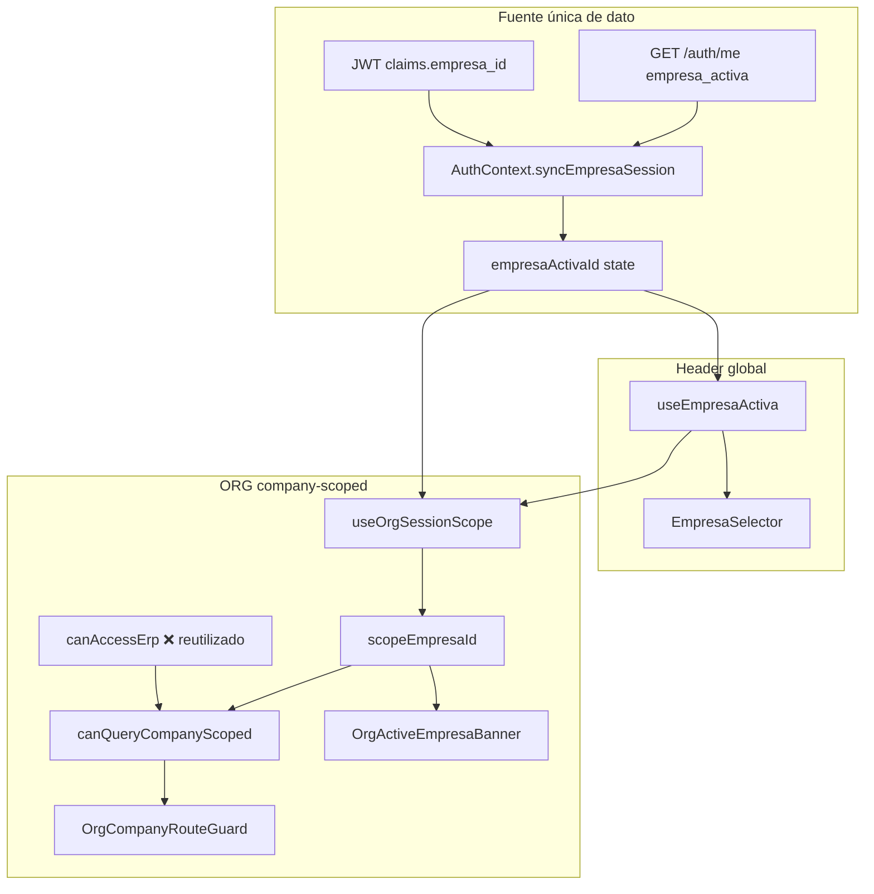

# Auditoría técnica — Contexto empresa activa ORG (multiempresa)

**Fecha:** 31 mayo 2026  
**Estado:** Análisis completado — **sin implementación**  
**Motivación QA:** Inconsistencias entre header global y páginas ORG company-scoped pese a `ORG_MULTIEMPRESA_AUDIT.md` (alineación estructural del modelo JWT).

**Casos reportados:**

| Caso | Perfil | Síntoma |
|------|--------|---------|
| **1** | MANAGER (`user_type: user`) | Banner «Empresa activa: XXXX» en ORG duplicando el selector del header |
| **2** | ADMIN (`user_type: tenant_admin`) | Header muestra empresa seleccionada; ORG muestra «Empresa activa requerida» |

---

## 1. Resumen ejecutivo

| Pregunta | Respuesta |
|----------|-----------|
| ¿Hay dos fuentes de verdad para `empresa_id`? | **No en persistencia** — una sola: `AuthContext.empresaActivaId` (JWT + `/auth/me`). **Sí en reglas de acceso UI** — ORG usa `canAccessErp`, semántica distinta al header. |
| ¿El banner es redundante? | **Sí**, cuando el header ya muestra `EmpresaSelector` (caso MANAGER y tenant_admin en `/app` o `/admin`). |
| ¿Por qué ADMIN ve empresa en header pero ORG bloquea? | **Bug de composición:** `canAccessCompanyOrg = canAccessErp && …` y `canAccessErp` devuelve **siempre `false`** para `tenant_admin`, aunque `empresaActivaId` esté definido. |
| ¿Contradice M1–M6? | El **dato** no; la **puerta de acceso ORG** para `tenant_admin` sí contradice el modelo operativo esperado. |

**Corrección definitiva (principio):** Una sola fuente de verdad (`empresaActivaId` / JWT) + **reglas de habilitación ORG explícitas** (no reutilizar `canAccessErp`) + **contexto visible solo en header** (eliminar banner duplicado).

---

## 2. Mapa de fuentes — quién lee qué



### 2.1 Tabla de componentes

| Capa | Archivo | Campo / señal | Origen del dato | Uso |
|------|---------|---------------|-----------------|-----|
| **AuthContext** | `AuthContext.tsx` | `empresaActivaId` | `user.empresa_activa ?? JWT.empresa_id` en `syncEmpresaSession` | Estado global sesión |
| | | `requiereSeleccionEmpresa` | `JWT.empresa_selection_pending` | Bloqueo selección |
| | | `empresasElegibles` | `/auth/me` → `empresas_disponibles`; fallback `tenant_admin`: `GET /org/empresa` | Lista cambio empresa |
| | | `canAccessErp` | `empresa-access.canAccessErp()` | **Shell ERP operativo**, no ORG |
| **Header** | `EmpresaSelector.tsx` | Muestra nombre | `empresaActivaId` + resolución label (`empresasElegibles` → `getById`) | **Única UI de cambio** |
| | | Visible si | `showEmpresaActiva && empresaActivaId` | Ver §4 |
| **useEmpresaActiva** | `useEmpresaActiva.ts` | Reexporta Auth | Mismo `empresaActivaId` | Hooks consumidores |
| **useOrgSessionScope** | `useOrgSessionScope.ts` | `scopeEmpresaId` | `empresaActivaId` si `hasEmpresaActiva` | Scope API ORG |
| | | `canAccessCompanyOrg` | **`canAccessErp && hasEmpresaActiva && !pending`** | ⚠ **Aquí el bug ADMIN** |
| | | `activeEmpresaLabel` | Solo `empresasElegibles.find(id)` | Banner; sin fallback `getById` |
| **OrgCompanyRouteGuard** | `OrgCompanyRouteGuard.tsx` | Bloquea si | `!canQueryCompanyScoped \|\| !scopeEmpresaId` | Pantalla «Empresa activa requerida» |
| **OrgActiveEmpresaBanner** | `OrgActiveEmpresaBanner.tsx` | Muestra label | `activeEmpresaLabel` + `scopeEmpresaId` | Duplica header |

### 2.2 Sincronización de `empresaActivaId` (única fuente de dato)

```263:274:src/shared/context/AuthContext.tsx
	const syncEmpresaSession = useCallback((user: UserData | null, token: string | null) => {
		const claims = decodeAccessToken(token);
		const activaRaw = user?.empresa_activa ?? claims?.empresa_id ?? null;
		const activa =
			activaRaw !== null && activaRaw !== undefined && String(activaRaw).trim().length > 0
				? String(activaRaw).trim()
				: null;
		const pending = Boolean(claims?.empresa_selection_pending);
		const admin = Boolean(user?.es_admin_cliente) || Boolean(claims?.es_admin_cliente);
		setEmpresaActivaId(activa);
		setRequiereSeleccionEmpresa(pending);
```

**Conclusión:** Header y ORG leen el **mismo** `empresaActivaId`. No hay segundo store de empresa activa para operación ORG.

---

## 3. Semántica de `canAccessErp` (desacople incorrecto)

```39:59:src/core/auth/utils/empresa-access.ts
export function canAccessErp({
  userType,
  empresaActivaId,
  esAdminCliente,
  requiereSeleccionEmpresa,
}: CanAccessErpInput): boolean {
  if (requiereSeleccionEmpresa) return false;

  if (userType === 'platform_admin' || userType === 'tenant_admin') return false;

  if (hasEmpresaActiva(empresaActivaId)) return true;

  if (esAdminCliente) return true;

  return false;
}
```

| `user_type` | `canAccessErp` | Significado intencionado |
|-------------|----------------|---------------------------|
| `user` (MANAGER) | `true` si hay `empresaActivaId` | Operativo puede usar shell `/app` ERP |
| `tenant_admin` (ADMIN tenant) | **`false` siempre** | Admin **no** es usuario ERP operativo por esta función |
| `platform_admin` | `false` | Super-admin |

**Uso en ORG (incorrecto):**

```69:75:src/features/org/hooks/useOrgSessionScope.ts
  const canAccessCompanyOrg =
    canAccessErp && hasEmpresaActiva(scopeEmpresaId) && !empresaSelectionPending;

  const canAccessHybridOrg = canAccessCompanyOrg;

  const canQueryCompanyScoped = canAccessCompanyOrg;
```

**Efecto para `tenant_admin` con JWT `empresa_id` válido:**

| Variable | Valor |
|----------|-------|
| `empresaActivaId` / `scopeEmpresaId` | ✅ Definido |
| `canAccessErp` | ❌ `false` |
| `canQueryCompanyScoped` | ❌ `false` |
| `OrgCompanyRouteGuard` | ❌ Bloquea (`!canQuery`) |
| `EmpresaSelector` (header) | ✅ Puede mostrarse (`showEmpresaActiva` no depende de `canAccessErp`) |

→ **Caso 2 explicado.**

---

## 4. Caso 1 — MANAGER: banner redundante

### 4.1 Cuándo se muestra el header

```173:176:src/shared/components/layout/Header.tsx
          {!isSuperAdminUser &&
            (shell === 'app' || (shell === 'admin' && isTenantAdminUser)) && (
              <EmpresaSelector />
            )}
```

```23:24:src/features/auth/hooks/useEmpresaActiva.ts
  const showEmpresaActiva =
    hasEmpresaActivaFlag && !requiereSeleccionEmpresa && !isPlatformAdmin;
```

**MANAGER** en `/app/org/*`: `shell === 'app'` → **EmpresaSelector visible** con nombre de empresa.

### 4.2 Cuándo se muestra el banner ORG

Todas las páginas company-scoped usan `OrgCompanyToolbar` → `OrgActiveEmpresaBanner`:

```12:16:src/features/org/components/OrgCompanyToolbar.tsx
export function OrgCompanyToolbar({ children, actions }: OrgCompanyToolbarProps) {
  return (
    <div className="mb-4 flex flex-wrap items-center gap-3">
      <OrgActiveEmpresaBanner />
```

El banner muestra el mismo contexto: «Empresa activa: {nombre}» + «Cambiar en el encabezado».

### 4.3 Veredicto caso 1

| Criterio | Evaluación |
|----------|------------|
| ¿Contradice M1 (solo header)? | **UX sí** — doble indicador del mismo contexto |
| ¿Contradice M1–M6 en datos? | **No** — mismo `empresaActivaId` |
| ¿Redundante? | **Sí** — eliminar banner cuando header ya muestra selector |

**Clasificación:** ⚠ **Ajuste UX** (no bug de datos). Alineado al principio «fuente única de contexto visible = header».

---

## 5. Caso 2 — ADMIN (`tenant_admin`): bloqueo con empresa en header

### 5.1 Reproducción lógica (sin backend)

1. Login `tenant_admin` con `empresa_id` en JWT y `empresa_selection_pending = false`.
2. `syncEmpresaSession` → `empresaActivaId = <uuid>`.
3. Header: `showEmpresaActiva && empresaActivaId` → muestra empresa (resuelve label vía catálogo `empresaService.list` para tenant_admin).
4. Usuario navega a `/app/org/sucursales` (vía menú + `PermissionGuard module=org`).
5. `useOrgSessionScope` → `canQueryCompanyScoped = false` por `canAccessErp === false`.
6. `OrgCompanyRouteGuard` → pantalla **«Empresa activa requerida»** aunque `scopeEmpresaId` existe.

### 5.2 Mensaje guard confuso

```32:46:src/features/org/components/guards/OrgCompanyRouteGuard.tsx
  if (!canQuery || !scopeEmpresaId) {
    ...
        {showEmpresaSelector ? (
          <p className="text-xs text-text-soft mt-4">
            Use el selector de empresa en la barra superior
            {activeEmpresaLabel ? ` (actual: ${activeEmpresaLabel})` : ''}.
```

Para `tenant_admin`, `showEmpresaSelector` (alias `showEmpresaActiva`) puede ser **true** en header, pero `activeEmpresaLabel` en ORG puede ser **null** si la empresa activa no está en `empresasElegibles` con match exacto (race o lista vacía temporal) — mensaje aún más contradictorio.

### 5.3 Veredicto caso 2

| Criterio | Evaluación |
|----------|------------|
| ¿Dos estados de empresa? | **No** — mismo `empresaActivaId` |
| ¿Bug? | **Sí** — regla de acceso ORG incorrecta |
| ¿Contradice M1–M6? | **Sí** — impide operar ORG con empresa JWT válida |
| Severidad | **P0** funcional para `tenant_admin` |

**Clasificación:** 🔴 **DESALINEADA** (lógica de acceso, no modelo multiempresa de datos).

---

## 6. Tercera inconsistencia menor — resolución de etiqueta

| Componente | Resolución de nombre |
|------------|---------------------|
| `EmpresaSelector` | `empresasElegibles` → store selección → **`empresaService.getById`** fallback |
| `OrgActiveEmpresaBanner` | **Solo** `empresasElegibles.find` — si falla, **no renderiza** (`!activeEmpresaLabel`) |
| Guard | Usa `canQuery` (bug) **o** `!scopeEmpresaId` |

Operativo cuya empresa no está aún en `empresasElegibles`: header puede mostrar nombre (getById) y banner ORG oculto, pero lista ORG podría funcionar si `canAccessErp` es true.

No explica caso ADMIN; refuerza unificar resolución de label o eliminar banner.

---

## 7. Respuestas a objetivos de la solicitud

### 7.1 Fuente real por capa

| Capa | Fuente |
|------|--------|
| Selector header | `AuthContext.empresaActivaId` + `cambiarEmpresaActiva` → API cambio sesión |
| `useEmpresaActiva` | Proxy de AuthContext |
| `useOrgSessionScope.scopeEmpresaId` | Mismo `empresaActivaId` |
| `OrgCompanyRouteGuard` | Derivado de `canQueryCompanyScoped` + `scopeEmpresaId` (**primero bugueado**) |
| AuthContext | JWT + `/auth/me` en `syncEmpresaSession` |

### 7.2 ¿Dos estados distintos?

**No** para el identificador de empresa activa. **Sí** para «¿puedo operar ORG company-scoped?»:

- Header: presencia de `empresaActivaId`.
- ORG queries: `canQueryCompanyScoped` (hoy erroneamente ligado a `canAccessErp`).

### 7.3 ¿Banner redundante?

**Sí**, eliminar en condiciones:

| Condición | Banner |
|-----------|--------|
| Header muestra `EmpresaSelector` (`showEmpresaActiva && empresaActivaId` en shell `app` o `admin` tenant) | **No mostrar** |
| Sin empresa / solo guard blocking | Mantener mensaje del **guard**, no banner duplicado |
| Futuro: shell sin header empresa (poco probable) | Hint mínimo opcional |

### 7.4 Por qué ADMIN ve empresa en header pero ORG dice «requerida»

**Causa raíz:** `useOrgSessionScope` usa `canAccessErp`, que excluye `tenant_admin` por diseño de acceso al ERP operativo, no por falta de empresa activa.

### 7.5 Corrección alineada a «una sola fuente de verdad»

Ver §8 (plan).

---

## 8. Plan de corrección definitivo (sin implementar)

### 8.1 P0 — Desacoplar acceso ORG de `canAccessErp`

**Archivo:** `src/features/org/hooks/useOrgSessionScope.ts` (y opcional util dedicada).

**Nueva regla propuesta** `canOperateOrgCompanyScope`:

```ts
// Pseudocódigo — contrato deseado
function canOperateOrgCompanyScope(input: {
  userType: string;
  scopeEmpresaId: string | null;
  empresaSelectionPending: boolean;
}): boolean {
  if (input.empresaSelectionPending) return false;
  if (!hasEmpresaActiva(input.scopeEmpresaId)) return false;

  // Admin de tenant: ORG company-scoped con empresa en JWT (catálogo tenant)
  if (input.userType === 'tenant_admin') return true;

  // Operativo: misma sesión que ERP (ya validada por negocio)
  if (input.userType === 'user') return true;

  // platform_admin no opera ORG tenant vía /app (ya redirigido en ProtectedRoute)
  return false;
}
```

**Reemplazar:**

```ts
const canAccessCompanyOrg = canOperateOrgCompanyScope({ userType, scopeEmpresaId, empresaSelectionPending });
```

**No modificar** `canAccessErp` (sigue válido para `ProtectedRoute` / shell ERP).

**Criterios de aceptación:**

- [ ] `tenant_admin` + `empresaActivaId` + `org.ver` → accede a Sucursales/Parámetros sin pantalla bloqueo.
- [ ] `user` MANAGER sin empresa → sigue bloqueado / redirect selección.
- [ ] `empresa_selection_pending` → redirect sin queries.

---

### 8.2 P1 — Fuente única de contexto visible (header)

**Archivos:** `OrgCompanyToolbar.tsx`, `OrgActiveEmpresaBanner.tsx` (o eliminar uso).

**Opción recomendada:** No renderizar `OrgActiveEmpresaBanner` cuando el header ya expone contexto.

Implementación sugerida:

- Hook compartido `useHeaderEmpresaContextVisible()` con **misma** lógica que `Header.tsx` + `useEmpresaActiva` (`showEmpresaActiva && empresaActivaId` y shell).
- `OrgCompanyToolbar`: solo filtros/acciones; sin banner si hook true.

**Criterios de aceptación:**

- [ ] MANAGER en `/app/org/sucursales`: una sola mención de empresa (header).
- [ ] Contexto sigue claro al cambiar empresa (solo header cambia; listas invalidan vía `useOrgScopeEmpresaReset`).

---

### 8.3 P2 — Guard y mensajes honestos

**Archivo:** `OrgCompanyRouteGuard.tsx`

Separar causas en UI:

| Condición | Mensaje |
|-----------|---------|
| `empresaSelectionPending` | Redirect (ya existe) |
| `!scopeEmpresaId` | «Seleccione empresa en el encabezado» |
| `scopeEmpresaId && !canQuery` (no debería ocurrir post-P0) | Error técnico / permiso ORG, no «falta empresa» |

Eliminar copy que pide usar el header cuando el header **ya** muestra la empresa.

---

### 8.4 P2 — Quitar fuga UUID en UI (regla M4)

**Archivos:** `OrgActiveEmpresaBanner.tsx`, `OrgSessionEmpresaField.tsx`

- Quitar `title={scopeEmpresaId}`.
- Si se mantiene campo readonly en modales, solo nombre comercial.

(Alineado con `ORG_MULTIEMPRESA_AUDIT.md` E-ME4.)

---

### 8.5 P3 — Unificar resolución de label (si queda algún hint)

Si tras P1 queda hint contextual mínimo, reutilizar helper compartido con `EmpresaSelector` (`resolveEmpresaLabel` + fallback `getById`).

---

## 9. Impacto en auditoría previa `ORG_MULTIEMPRESA_AUDIT.md`

| Afirmación previa | Ajuste |
|-------------------|--------|
| «Las 6 pantallas ✅ ALINEADA multiempresa» | **Datos/JWT/API:** sigue válido. **Acceso `tenant_admin`:** 🔴 hasta P0. |
| Sprint E solo UX | Incluir **P0 contexto** antes o junto a E-SEC (B.1.1) |

**Orden recomendado antes/durante Sprint E:**

1. **P0** — `canOperateOrgCompanyScope` (1 archivo + tests manuales ADMIN/MANAGER).
2. **P1** — Quitar banner redundante.
3. **E-SEC** — B.1.1 dialogs.
4. Resto Sprint E sin cambios de modelo multiempresa.

---

## 10. Matriz QA post-corrección

| Escenario | Header | ORG listado | Banner ORG |
|-----------|--------|-------------|------------|
| MANAGER, 1 empresa, `/app/org/sucursales` | Muestra empresa | Carga datos | **Ausente** |
| MANAGER, cambia empresa en header | Actualiza | Refetch queries | — |
| ADMIN tenant, empresa en JWT, `/app/org/sucursales` | Muestra empresa | **Carga datos** (hoy falla) | Ausente |
| Sin empresa, operativo | Oculto / redirect | Guard o redirect | — |
| `selection_pending` | — | Redirect selección | — |

---

## 11. Conclusión

La auditoría multiempresa **a nivel de contrato JWT y payloads** sigue siendo correcta. Los casos QA exponen:

1. **Bug P0:** ORG reutiliza `canAccessErp` y **bloquea indebidamente a `tenant_admin`** con empresa activa válida.
2. **Deuda UX P1:** Banner «Empresa activa» **duplica** el header en perfiles operativos (MANAGER).

La corrección definitiva no requiere nuevos endpoints ni selector local: **una fuente de dato** (ya existe) + **regla de acceso ORG propia** + **contexto visible solo en header**.

---

*Auditoría técnica y plan de corrección. Sin cambios de código. Sin commit.*
