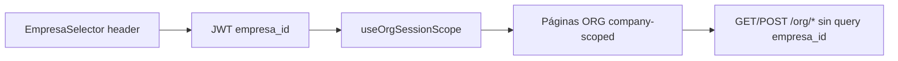

# Auditoría ORG — Modelo multiempresa definitivo + UX (pre Sprint E)

**Fecha:** 31 mayo 2026  
**Estado:** Análisis completado — **sin implementación**  
**Metodología:** Revisión del código actual en `src/features/org/**` bajo las reglas oficiales multiempresa y ORG. **No** se usan decisiones pre-multiempresa como verdad; se contrasta el **comportamiento presente** con las reglas entregadas.

**Referencias cruzadas (contexto, no presupuestos):** `docs/frontend/modulos/ORG_ETAPA_C_UX.md`, `TENANT_ADMIN_GLOBAL_UX_AUDIT.md`, patrones IAM Sprints B–D.

**Excluido:** Módulos ERP operativos; cambios de contrato API; AuthContext / PermissionGuard / RBAC runtime.

---

## 1. Resumen ejecutivo

| Pantalla | Clasificación multiempresa | Clasificación UX (vs IAM) |
|----------|---------------------------|---------------------------|
| **Mi Empresa** | ✅ ALINEADA | ⚠ AJUSTE MENOR |
| **Sucursales** | ✅ ALINEADA | ⚠ AJUSTE MENOR |
| **Departamentos** | ✅ ALINEADA | ⚠ AJUSTE MENOR |
| **Cargos** | ✅ ALINEADA | ⚠ AJUSTE MENOR |
| **Centros de costo** | ✅ ALINEADA | ⚠ AJUSTE MENOR |
| **Parámetros** | ✅ ALINEADA | ⚠ AJUSTE MENOR |

**Veredicto multiempresa:** El módulo ORG en código **cumple el modelo JWT-driven definitivo** en operación (sin `?empresa_id` en listados company-scoped, sin selector cross-company, sin columna Empresa en tablas company-scoped, scope vía `useOrgSessionScope` + `assertBodyEmpresaMatchesSession`).

**Veredicto UX:** No hay desalineación estructural multiempresa que obligue rediseño. Los ajustes recomendados para Sprint E son **consolidación IAM** (búsqueda, empty component compartido, dirty B.1.1, quitar fuga de UUID en UI) y **mantenibilidad** (`EmpresaPage`), no corrección del modelo de ámbito.

**🔴 DESALINEADA:** Ninguna pantalla en el sentido de las reglas críticas multiempresa.

---

## 2. Marco de evaluación (reglas oficiales)

### 2.1 Multiempresa

| # | Regla | Cómo se verifica en código |
|---|-------|---------------------------|
| M1 | Empresa activa solo en header global | Sin `<select>` de empresa en páginas ORG; `OrgActiveEmpresaBanner` remite al encabezado |
| M2 | Sin selector propio de empresa activa en páginas ORG | `useOrgSessionScope` lee JWT/`useEmpresaActiva`; guards redirigen a selección global |
| M3 | Sin cambio de empresa desde formularios/filtros/tablas | Sin filtros `empresa_id`; create inyecta scope en body, no UI de otra empresa |
| M4 | No exponer `empresa_id` como dato funcional al usuario | Ver hallazgos ⚠ en tooltips/`title` |
| M5 | Operaciones asumen empresa activa global | `useOrgCompanyQueryGate` / `useOrgHybridQueryGate` |
| M6 | Sin modificar contratos API | `org.service.ts`: listados sin `?empresa_id` |

### 2.2 Organización (company-scoped)

Sucursales, Departamentos, Cargos, Centros de costo → solo contexto global; sin asignación manual de empresa.

### 2.3 Mi Empresa (tenant-scoped)

Catálogo multi-empresa del tenant; sin selector de empresa activa; sin duplicar header. Excepción de negocio: **bootstrap** tras crear la primera empresa en onboarding (activación JWT programática, no selector en página).

### 2.4 UX IAM (solo si contradice)

`IamSearchInput`, `IamTableEmptyState`, skeleton, `ConfirmDialog`, dirty B.1.1, overlays.

---

## 3. Infraestructura ORG compartida (transversal)

| Componente | Rol multiempresa | Estado |
|------------|------------------|--------|
| `useOrgSessionScope` | `scopeEmpresaId` desde JWT; invalida queries al cambiar empresa | ✅ |
| `useOrgScopeEmpresaReset` | Reset filtros/modales al cambiar empresa en header | ✅ |
| `OrgCompanyRouteGuard` | Bloquea company/hybrid sin empresa; copy → header | ✅ |
| `OrgTenantRouteGuard` | `/org/empresa` con onboarding / selection_pending | ✅ |
| `OrgActiveEmpresaBanner` | Solo lectura; “Cambiar en el encabezado” | ✅ (⚠ `title` con UUID) |
| `OrgSessionEmpresaField` | Solo lectura en create; body vía `assertBodyEmpresaMatchesSession` | ✅ (⚠ redundancia + UUID en `title`) |
| `assertBodyEmpresaMatchesSession` | Fuerza `empresa_id` = sesión en POST | ✅ |
| `org.service.ts` | Sin `empresa_id` en query company-scoped | ✅ |
| `useOrgEmpresaScopeErrorHandler` | Errores de scope empresa desde API | ✅ |

---

## 4. Análisis por pantalla

---

### 4.1 Mi Empresa (`EmpresaPage.tsx` — `/app/org/empresa`)

**Clasificación:** ✅ **ALINEADA** (multiempresa) · ⚠ **AJUSTE MENOR** (UX)

#### 1. Estado actual

- **Ámbito:** Tenant-wide (`OrgTenantRouteGuard`). Lista todas las empresas del tenant (`empresaService.list`).
- **Toolbar:** Búsqueda local + “Ver inactivos” + “Crear empresa”. **Sin** `OrgCompanyToolbar` ni banner de empresa activa (correcto: no es pantalla company-scoped).
- **Tabla:** Código, razón social, RUC, moneda, estado, acciones. **Sin** columna ni filtro de “empresa activa”.
- **CRUD:** Dialogs shadcn create/edit muy extensos (~1 570 líneas); `ConfirmDialog` en desactivar.
- **Onboarding:** `?onboarding=true` → tras `create`, llama `completeEmpresaSelection` o `cambiarEmpresaActiva(created.empresa_id)` y navega a home. **No** hay botón “usar esta empresa” en filas del listado.
- **Permisos:** `can('org', crear|editar|eliminar)` vía LBAC.
- **Empty state:** Icono `Building2` + CTA crear (patrón similar a IAM, no usa `IamTableEmptyState`).

#### 2. Riesgos multiempresa

| Riesgo | Nivel | Evidencia |
|--------|-------|-----------|
| Selector de empresa activa en página | **Ninguno** | No existe |
| Filtro por otra empresa | **Ninguno** | Solo `buscar` textual |
| Cambio arbitrario de contexto desde tabla | **Ninguno** | Solo onboarding bootstrap |
| Query `?empresa_id` | **Ninguno** | `empresaService.list` sin empresa en query |

**Nota bootstrap (regla Mi Empresa):** La activación JWT tras **primera** empresa creada en onboarding **no** es un selector ni un “cambio de empresa” desde el catálogo; es establecimiento de sesión inicial. **Compatible** con el espíritu de las reglas si se documenta como flujo auth, no como acción recurrente en Mi Empresa.

#### 3. Riesgos UX

| Riesgo | Nivel |
|--------|-------|
| Formulario create/edit abrumador (monolito) | Alto mantenimiento |
| Dialogs sin dirty confirm B.1.1 (`onOpenChange` cierra directo) | Alto — overlay (lección Sprint D) |
| Búsqueda con `<input>` local vs `IamSearchInput` | Bajo |
| Sin skeleton de tabla (solo `Loader` página) | Bajo |
| Sin aviso si usuario cambia empresa en header con modal abierto | Medio |

#### 4. Cambios recomendados (Sprint E)

| ID | Cambio | Tipo |
|----|--------|------|
| ME-UX-1 | Dirty + discard B.1.1 en dialogs create/edit | UX P1 |
| ME-UX-2 | Extraer secciones del formulario (identidad, fiscal, contacto, branding) | UX P2 |
| ME-UX-3 | `IamSearchInput` en toolbar | UX P3 |
| ME-UX-4 | Opcional: `IamTableEmptyState` para paridad componente | UX P3 |
| ME-ME-1 | Documentar en copy onboarding que la activación post-create es automática (no selector) | Copy P3 |

**No recomendado:** Quitar `cambiarEmpresaActiva` en onboarding sin sustituto en capa auth (rompería primer acceso).

#### 5. Prioridad

| Área | Prioridad |
|------|-----------|
| Multiempresa | — (sin trabajo) |
| UX B.1.1 modales | **P1** |
| Refactor formulario | **P2** |

---

### 4.2 Sucursales (`SucursalesPage.tsx`)

**Clasificación:** ✅ **ALINEADA** · ⚠ **AJUSTE MENOR**

#### 1. Estado actual

- `OrgCompanyRouteGuard` + `OrgCompanyToolbar` + `OrgActiveEmpresaBanner`.
- Listado: `useSucursales({ enabled: canQueryCompanyScoped })` — scope JWT en hook keys, API sin `?empresa_id`.
- Tabla **sin** columna Empresa (eliminada Etapa C).
- Create: `OrgSessionEmpresaField` (solo lectura) + `assertBodyEmpresaMatchesSession` en submit.
- `useOrgScopeEmpresaReset` al cambiar empresa en header.
- Empty: icono + CTA. `ConfirmDialog` en delete.

#### 2. Riesgos multiempresa

| Riesgo | Nivel |
|--------|-------|
| Selector / filtro empresa | **Ninguno** |
| Asignación manual otra empresa | **Ninguno** — body forzado a sesión |
| Exponer UUID | **Bajo** — `title` en banner/campo empresa |

#### 3. Riesgos UX

| Riesgo | Nivel |
|--------|-------|
| Dialogs sin B.1.1 | **P1** |
| Campo “Empresa” redundante si ya hay banner | **P2** |
| Búsqueda no `IamSearchInput` | **P3** |
| Formulario create largo (geo + flags) sin dirty | **P1** |

#### 4. Cambios recomendados

| ID | Cambio |
|----|--------|
| SU-UX-1 | B.1.1 create/edit |
| SU-UX-2 | Valorar eliminar `OrgSessionEmpresaField` y dejar solo banner + copy corto en modal |
| SU-UX-3 | Quitar `title={scopeEmpresaId}` de banner/campo (regla M4) |
| SU-UX-4 | `IamSearchInput` |

#### 5. Prioridad

Multiempresa **—** · UX **P1** (overlay) · **P2** (UUID/redundancia)

---

### 4.3 Departamentos (`DepartamentosPage.tsx`)

**Clasificación:** ✅ **ALINEADA** · ⚠ **AJUSTE MENOR**

#### 1. Estado actual

- Mismo patrón que Sucursales: toolbar, gate, hooks con `scopeEmpresaId`, sin columna empresa.
- Dependencias: sucursales y centros de costo cargados con `enabled: !!scopeEmpresaId`.
- `OrgSessionEmpresaField` solo en create.
- Empty: `Layers` + CTA.

#### 2–3. Riesgos

Idénticos a Sucursales (multiempresa ✅; UX: B.1.1, UUID tooltip, búsqueda).

#### 4. Cambios recomendados

| ID | Cambio |
|----|--------|
| DE-UX-1 | B.1.1 create/edit |
| DE-UX-2 | UUID / redundancia campo empresa |
| DE-UX-3 | `IamSearchInput` |

#### 5. Prioridad

UX **P1** / **P2** (igual que Sucursales)

---

### 4.4 Cargos (`CargosPage.tsx`)

**Clasificación:** ✅ **ALINEADA** · ⚠ **AJUSTE MENOR**

#### 1. Estado actual

- Patrón company-scoped estándar.
- Tabla muestra `departamento_id` resuelto a nombre — **no** es selector de empresa (relación organizativa interna). ✅
- `OrgSessionEmpresaField` en create.
- Empty: `Briefcase` + CTA.

#### 2. Riesgos multiempresa

Ninguno estructural. `departamento_id` en formulario es FK organizacional dentro de la misma empresa activa — alineado.

#### 3. Riesgos UX

Mismos que Sucursales/Departamentos.

#### 4–5. Cambios y prioridad

| ID | Cambio | Prioridad |
|----|--------|-----------|
| CA-UX-1 | B.1.1 | P1 |
| CA-UX-2 | UUID / campo empresa | P2 |
| CA-UX-3 | `IamSearchInput` | P3 |

---

### 4.5 Centros de costo (`CentrosCostoPage.tsx`)

**Clasificación:** ✅ **ALINEADA** · ⚠ **AJUSTE MENOR**

#### 1. Estado actual

- Patrón company-scoped estándar; formulario más simple que Sucursales.
- Empty: `DollarSign` + CTA.

#### 2–5. Riesgos y cambios

Equivalentes a Cargos/Departamentos (`CC-UX-1`…`CC-UX-3`, prioridades P1–P3).

---

### 4.6 Parámetros (`ParametrosPage.tsx`)

**Clasificación:** ✅ **ALINEADA** · ⚠ **AJUSTE MENOR**

#### 1. Estado actual

- `OrgCompanyRouteGuard scope="hybrid"`.
- **Tabs:** Valores efectivos | Globales tenant | Overrides empresa activa — **no** son selector de otra empresa; son **vistas de alcance** sobre el mismo tenant/JWT.
- `OrgParametroAlcanceField`: radio **Global (tenant)** vs **Override (empresa activa)** — inyecta `empresa_id` en body solo para override vía `buildParametroCreatePayload`, sin elegir otra empresa.
- `OrgHybridPrecedenceHint`: copy precedencia override > global.
- Columna **Alcance** con `OrgParametroAlcanceBadge` (GLOBAL / OVERRIDE), no UUID.
- `canMutateParametroRow`: globales solo `tenant_admin`.
- API: `vista` en query (`effective`/`global`/`override`); sin `?empresa_id`.
- Empty: `Settings` + CTA.

#### 2. Riesgos multiempresa

| Riesgo | Nivel | Notas |
|--------|-------|-------|
| Confundir tabs con “elegir empresa” | Bajo | Copy ya dice “empresa activa” |
| Crear override sin empresa en JWT | Mitigado | Toast + guard `scopeEmpresaId` |
| Listar empresa de otro tenant en override | **Backend** | FE solo muestra lo que API devuelve para JWT |
| Selector cross-company | **Ninguno** | ✅ |

#### 3. Riesgos UX

| Riesgo | Nivel |
|--------|-------|
| Complejidad híbrida (tabs + alcance) — ya alineada conceptualmente | Aceptable |
| Dialogs sin B.1.1 | P1 |
| Tab “Valores efectivos” sin UI explícita valor global vs override lado a lado (doc Etapa D residual) | P2 |
| Búsqueda / tabs no reutilizan `IamSegmentTabs` | P3 |
| UUID en banner | P2 |

#### 4. Cambios recomendados

| ID | Cambio |
|----|--------|
| PA-UX-1 | B.1.1 create/edit |
| PA-UX-2 | Quitar UUID en `title` banner |
| PA-UX-3 | Mejorar fila “efectivo” si API expone campos (sin cambiar contrato) |
| PA-UX-4 | Opcional: `IamSegmentTabs` para paridad con IAM/Permisos |

#### 5. Prioridad

Multiempresa **—** · UX **P1** B.1.1 · **P2** claridad efectivo · **P3** componentes

---

## 5. Hallazgos transversales

### 5.1 Multiempresa — ✅ Sin 🔴

| ID | Hallazgo | Clasificación |
|----|----------|---------------|
| T-ME-01 | Listados company-scoped sin `?empresa_id` | ✅ |
| T-ME-02 | Sin columna “Empresa” en tablas company-scoped | ✅ |
| T-ME-03 | Cambio de empresa solo vía header + guards | ✅ |
| T-ME-04 | `useOrgScopeEmpresaReset` en todas las páginas company-scoped | ✅ |
| T-ME-05 | Parámetros: alcance global/override sin cross-company | ✅ |

### 5.2 Multiempresa — ⚠ Ajustes menores

| ID | Hallazgo | Pantallas | Regla |
|----|----------|-----------|-------|
| T-ME-A1 | `title={scopeEmpresaId}` en `OrgActiveEmpresaBanner` y `OrgSessionEmpresaField` | Company-scoped + banner en Parámetros | M4 |
| T-ME-A2 | `OrgSessionEmpresaField` duplica banner en modales create | Sucursales, Deptos, Cargos, CC | UX (no contradice M2 si es readonly) |
| T-ME-A3 | Hidden `empresa_id_session` en DOM (no enviado a API si submit usa assert) | Create modals | Técnico bajo |

### 5.3 UX — ⚠ vs IAM (Sprint E)

| ID | Hallazgo | Impacto | Prioridad |
|----|----------|---------|-----------|
| T-UX-01 | **Ninguna** página ORG con dirty B.1.1 en dialogs | Overlay bloqueado (probado en IAM) | **P1** |
| T-UX-02 | Búsqueda: `<input>` local vs `IamSearchInput` | Consistencia | P3 |
| T-UX-03 | Empty states custom vs `IamTableEmptyState` | Ya tienen icono+CTA; bajo ROI | P3 |
| T-UX-04 | Loading: `Loader` full page vs skeleton filas | Percepción | P3 |
| T-UX-05 | `EmpresaPage` monolito | Mantenimiento / onboarding UX | P2 |
| T-UX-06 | Cambio empresa header con modal abierto sin warn | Datos perdidos | P2 |

---

## 6. Matriz de cumplimiento reglas críticas

| Regla | Mi Empresa | Sucursales | Deptos | Cargos | CC | Parámetros |
|-------|------------|------------|--------|--------|-----|------------|
| M1 Header único | ✅ | ✅ | ✅ | ✅ | ✅ | ✅ |
| M2 Sin selector página | ✅ | ✅ | ✅ | ✅ | ✅ | ✅ |
| M3 Sin cambio en forms/filtros/tablas | ✅ | ✅ | ✅ | ✅ | ✅ | ✅ |
| M4 Sin empresa_id funcional UI | ⚠ tooltips | ⚠ | ⚠ | ⚠ | ⚠ | ⚠ |
| M5 Contexto automático | N/A tenant | ✅ | ✅ | ✅ | ✅ | ✅ |
| M6 Sin cambio API | ✅ | ✅ | ✅ | ✅ | ✅ | ✅ |
| ORG sin selector empresa | N/A | ✅ | ✅ | ✅ | ✅ | ✅ |
| Mi Empresa reglas especiales | ✅ | — | — | — | — | — |

---

## 7. Sprint E — alcance recomendado (post-auditoría)

Dado que **no hay pantallas 🔴 DESALINEADA** en multiempresa, Sprint E debe ejecutarse como **consolidación UX IAM**, no como corrección de modelo.

### 7.1 In scope (autorizable)

| Bloque | Entregables | Prioridad |
|--------|-------------|-----------|
| **E-SEC** | B.1.1 en todos los dialogs ORG (6 páginas) | **P1** |
| **E-ME4** | Eliminar `title` con UUID; revisar necesidad de `OrgSessionEmpresaField` | **P2** |
| **E-SEARCH** | `IamSearchInput` donde hay búsqueda | P3 |
| **E-EMP** | Refactor parcial `EmpresaPage` + B.1.1 | P2 |
| **E-RESET** | Warn o cierre modal si cambia `scopeEmpresaId` con dialog abierto | P2 |

### 7.2 Out of scope (esta auditoría)

- Reintroducir selector/filtro empresa en ORG.
- `?empresa_id` en queries.
- Columna Empresa en tablas company-scoped.
- Cambios AuthContext / PermissionGuard / contratos API.
- Rediseño funcional de tabs Parámetros (solo copy/UI si API ya trae datos).

### 7.3 Criterios de aceptación Sprint E (multiempresa)

- [ ] Ninguna página ORG con `<select>` de empresa activa ni filtro por empresa ajena al JWT.
- [ ] Listados company-scoped siguen sin `empresa_id` en query (regresión).
- [ ] Usuario no ve UUID de empresa en UI (hover/tooltip/columnas).
- [ ] Cambiar empresa en header sigue invalidando queries y reseteando filtros locales.
- [ ] Parámetros: crear override solo con empresa activa; global solo según rol.

---

## 8. Priorización global (solo ORG)

| Prioridad | Ítem | Tipo |
|-----------|------|------|
| **P1** | Dirty B.1.1 dialogs (todas las pantallas) | UX / riesgo overlay |
| **P2** | Quitar UUID en `title`; simplificar campo empresa en modales | Multiempresa UX |
| **P2** | Refactor `EmpresaPage` (secciones) | Mantenimiento |
| **P2** | Aviso cambio empresa con modal abierto | Multiempresa UX |
| **P3** | `IamSearchInput`, `IamTableEmptyState`, skeleton | Paridad IAM |

---

## 9. Conclusión

1. **El modelo multiempresa definitivo ya está implementado en ORG** para las seis pantallas auditadas: JWT como única fuente de ámbito operativo, guards, body assert, y separación correcta Mi Empresa (catálogo tenant) vs recursos company-scoped.

2. **No se requiere rediseño multiempresa** antes de Sprint E; se requiere **endurecer UX** al estándar IAM (especialmente B.1.1) y **pulir exposición de UUID** y redundancias de copy.

3. **Sprint E propuesto en `TENANT_ADMIN_GLOBAL_UX_AUDIT.md` permanece válido**, acotado explícitamente a mejoras que **no contradicen** las reglas M1–M6.

---

*Auditoría generada para aprobación de alcance Sprint E. Sin cambios de código. Sin commit.*
