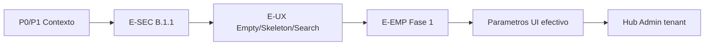

# Auditoría de cierre — Módulo ORG (post E-SEC)

**Fecha:** 31 mayo 2026  
**Estado:** **ORG E-SEC cerrado en QA** — auditoría y roadmap únicamente (sin código, sin commit)  
**Referencias:** `ORG_MULTIEMPRESA_AUDIT.md`, `ORG_CONTEXT_AUDIT.md`, `ORG_CONTEXT_P0_P1_IMPLEMENTATION_AUDIT.md`, `ORG_SPRINT_E_ESEC_AUDIT.md`, `TENANT_ADMIN_GLOBAL_UX_AUDIT.md`

---

## 1. Veredicto ejecutivo

| Frente | Estado | Evidencia |
|--------|--------|-----------|
| **Multiempresa JWT (M1–M6)** | ✅ Cerrado | QA P0/P1; guards, scope, sin selectores locales |
| **Contexto empresa visible** | ✅ Cerrado | Header único; banner condicional (P1) |
| **E-SEC — B.1.1 modales** | ✅ Cerrado | QA en 6 páginas (create/edit, overlay, onboarding) |
| **Paridad visual IAM** | 🟡 Pendiente | Empty states, skeleton, búsqueda unificada |
| **Mantenibilidad páginas** | 🟡 Pendiente | `EmpresaPage` y `SucursalesPage` monolíticas |

**Conclusión:** ORG pasa de **“funcional con deuda UX crítica en modales”** a **“operativamente maduro y seguro en sesión multiempresa”**. El siguiente retorno ya no está en corregir pérdida de datos al cerrar dialogs, sino en **percepción de calidad (loading/empty/search)** y **reducción de deuda estructural** en las pantallas más grandes.

---

## 2. Estado de madurez UX actual de ORG

Escala **1–5** (1 = placeholder, 5 = paridad IAM / producción pulida).

| Dimensión | Antes (pre P0/P1/E-SEC) | **Ahora** | Notas |
|-----------|-------------------------|-----------|--------|
| **Modelo multiempresa** | 4.0 | **4.5** | JWT + `canOperateOrgCompanyScope`; tenant_admin operativo |
| **Contexto empresa en UI** | 2.5 | **4.5** | Header + toolbar sin duplicar; guard coherente |
| **Seguridad de modales (B.1.1)** | 1.5 | **4.5** | 12 dialogs; confirm discard; sin overlay negro (QA) |
| **Feedback carga / vacío** | 2.0 | **2.5** | `Loader` full-page; empty = celda texto + icono inline |
| **Búsqueda y filtros** | 3.0 | **3.0** | Input nativo; sin `IamSearchInput` |
| **Formularios / densidad** | 2.5 | **2.5** | Modales largos; `EmpresaPage` abrumadora |
| **Parámetros hybrid** | 3.5 | **3.5** | Tabs + badges; sin vista “efectivo vs definición” |
| **Onboarding primera empresa** | 2.0 | **2.5** | `?onboarding=true` + B.1.1 OK; sin wizard post-create |
| **Mantenibilidad código** | 2.0 | **3.0** | Infra B.1.1 compartida (`org-discard-*`, `form-dirty/*`) |
| **Madurez global ORG** | **~3.0** | **~4.0** | Listo para uso productivo admin; pulido visual pendiente |

### 2.1 Lo que está al nivel “production-ready”

- Rutas company-scoped con `OrgCompanyRouteGuard` + `useOrgCompanyQueryGate`.
- Cambio de empresa en header → invalidación React Query + reset filtros locales.
- CRUD completo con permisos `can('org', …)` y `ConfirmDialog` en desactivaciones.
- **B.1.1** en: `CentrosCostoPage`, `DepartamentosPage`, `CargosPage`, `ParametrosPage`, `SucursalesPage`, `EmpresaPage`.
- Onboarding: crear empresa con discard confirm; flujo post-guardado sin regresión reportada en QA.

### 2.2 Lo que sigue por debajo del estándar IAM

| Gap | Impacto usuario | Referencia histórica |
|-----|-----------------|----------------------|
| Empty states genéricos (texto en `<td>`) | Medio | ORG-01 |
| Sin skeleton de tabla | Medio | ORG-02 |
| Búsqueda sin componente IAM | Bajo | E-SEARCH |
| `title={scopeEmpresaId}` en banner fallback | Bajo | M4 / E-ME4 |
| Sin aviso explícito al cambiar empresa con modal abierto | Medio | ORG-08 / E-RESET |
| Parámetros: sin comparativa efectivo vs override en UI | Medio | ORG-06 |

---

## 3. Deuda técnica restante

### 3.1 Por severidad

| ID | Deuda | Severidad | Esfuerzo | Bloque sugerido |
|----|-------|-----------|----------|-----------------|
| **DT-01** | `EmpresaPage.tsx` ~1 581 líneas, formularios inline duplicados | Alta | Alto | E-EMP (fases) |
| **DT-02** | `SucursalesPage.tsx` ~760 líneas (geo + form en página) | Media | Medio | E-EMP / extract dialogs |
| **DT-03** | 6 páginas con patrón B.1.1 **copiado** (handlers + state) sin componente dialog compartido | Media | Medio | Post E-UX |
| **DT-04** | `inputClass` y markup de inputs repetidos vs `iam-form-classes` | Baja | Bajo | E-STYLE |
| **DT-05** | `parametro-query-keys.ts` — error TS `ParametroHybridTab` vs `ParametroVista` | Media | Bajo | Tech debt TS |
| **DT-06** | `OrgActiveEmpresaBanner` — `title={scopeEmpresaId}` (UUID en tooltip) | Baja | Muy bajo | E-ME4 |
| **DT-07** | `scheduleModalStackValidation` importado desde `features/admin` en ORG | Baja | Bajo | Mover a `shared/utils` |
| **DT-08** | Sin tests unitarios en `form-dirty/*.ts` | Media | Medio | Calidad |
| **DT-09** | `useHeaderEmpresaContextVisible` debe mantenerse alineado con `Header.tsx` | Media | Continuo | Documentación + QA |
| **DT-10** | Cambio empresa cierra modales vía reset **sin mensaje** al usuario | Media | Bajo | E-RESET |
| **DT-11** | Sin `OrgTableEmptyState` / skeleton (contraste INV/IAM) | Media | Bajo–medio | E-UX |
| **DT-12** | Documentación auditorías múltiples; falta “fuente única” post-cierre | Baja | Bajo | Docs |

### 3.2 Deuda **cerrada** en este ciclo (no reabrir)

| Ítem | Cierre |
|------|--------|
| ORG-03 / B.1.1 dialogs | ✅ E-SEC QA |
| P0 `tenant_admin` bloqueado en company-scoped | ✅ `org-company-scope-access.ts` |
| P1 banner duplicado vs header | ✅ `useHeaderEmpresaContextVisible` |
| Overlay negro Radix + ConfirmDialog | ✅ Patrón IAM + QA |

---

## 4. Páginas aún monolíticas

Umbral orientativo: **>400 líneas** en un solo archivo de página = monolito de mantenimiento.

| Página | Líneas (aprox.) | Responsabilidades mezcladas | Prioridad refactor |
|--------|-----------------|----------------------------|-------------------|
| **`EmpresaPage.tsx`** | **1 581** | Lista, CRUD, catálogos geo, monedas, onboarding, 2 dialogs enormes, validación | **P0 estructural** |
| **`SucursalesPage.tsx`** | **760** | Lista, geo cascada, CRUD, 2 dialogs | **P1** |
| **`ParametrosPage.tsx`** | **603** | Tabs hybrid, alcance, tipos dato, JSON, CRUD | **P2** (extraer dialogs primero) |
| **`CargosPage.tsx`** | **470** | Lista, monedas catálogo, deptos, CRUD | **P3** |
| **`CentrosCostoPage.tsx`** | **437** | Lista, jerarquía padre, CRUD | **P3** |
| **`DepartamentosPage.tsx`** | **389** | Lista, FKs, CRUD | **P4** (más manejable) |

**No monolíticas (infra modular):**

- `components/guards/*`, `hooks/useOrgSessionScope.ts`, `utils/form-dirty/*`, `utils/org-discard-handlers.ts`, `OrgDiscardConfirmDialog.tsx` — **patrón reutilizable** introducido en E-SEC.

**Recomendación de extracción (sin implementar ahora):**

1. `OrgEntityListPage` shell (toolbar + table + empty slot) — opcional, alto coste.
2. **Pragmático:** `EmpresaCreateDialog` / `EmpresaEditDialog` + `useGeoCatalogSelectors` — máximo ROI en `EmpresaPage`.
3. `SucursalFormDialog` compartiendo geo hook con Empresa.

---

## 5. Riesgos pendientes

| Riesgo | Prob. | Impacto | Mitigación actual | Acción recomendada |
|--------|-------|---------|-------------------|-------------------|
| **Regresión B.1.1** al tocar dialogs | Media | Alto | Infra compartida; QA manual | Tests smoke + opcional Vitest en `form-dirty` |
| **Desalineación Header ↔ `useHeaderEmpresaContextVisible`** | Baja | Medio | Comentario en hook | Checklist en PR que toque `Header.tsx` |
| **Refactor `EmpresaPage` introduce bugs onboarding** | Media | Alto | QA onboarding obligatorio | Refactor por fases; no mezclar con E-UX |
| **TS `parametro-query-keys` en build estricto** | Media | Bajo | Preexistente; build global ya falla | Fix aislado 1 PR |
| **Cambio empresa con modal abierto** — datos perdidos sin explicación | Media | Medio | `useOrgScopeEmpresaReset` cierra todo | E-RESET: toast o confirm si `discardPending`/dirty |
| **UUID en tooltip** (`OrgActiveEmpresaBanner`) | Baja | Bajo | Solo si banner visible | E-ME4: quitar `title` |
| **Acoplamiento ORG → admin** (`iam-modal-stack-validation`) | Baja | Bajo | Solo DEV logs | Mover a shared cuando convenga |
| **Nuevos CRUD ORG sin B.1.1** | Media | Alto | Convención documentada | Plantilla en `ORG_SPRINT_E_ESEC_AUDIT.md` como checklist obligatorio |

**Riesgos bajos / cerrados en QA:**

- Overlay negro post-discard.
- `tenant_admin` sin acceso company-scoped.
- Doble fuente visible de empresa en rutas con header.

---

## 6. Recomendación — siguiente sprint (mejor ROI)

### 6.1 Opciones evaluadas

| Opción | Valor usuario | Riesgo | Esfuerzo | ROI |
|--------|---------------|--------|----------|-----|
| **A — E-UX (empty + skeleton + search)** | Alto (visible cada visita) | Bajo | 2–4 días | **★★★★★** |
| **B — E-ME4 + E-RESET (pulido multiempresa)** | Medio | Bajo | 1–2 días | ★★★★☆ |
| **C — E-EMP refactor `EmpresaPage`** | Medio (dev + UX largo plazo) | Alto | 1–2 semanas | ★★★☆☆ |
| **D — Hub admin `/admin` + navegación** | Alto (tenant_admin) | Medio | 3–5 días | ★★★★☆ (fuera ORG puro) |
| **E — Parámetros “efectivo vs definición”** | Medio (power users) | Medio | 3–5 días | ★★★☆☆ (depende API/datos) |

### 6.2 Sprint recomendado: **ORG E-UX (paridad visual IAM)**

**Por qué ahora:** E-SEC eliminó el riesgo P0; el gap más visible en uso diario es **tabla vacía / carga / búsqueda**, ya resuelto en IAM y reutilizable sin tocar contratos.

**Alcance propuesto (orden):**

| # | Entregable | Páginas | Componentes |
|---|------------|---------|-------------|
| 1 | `OrgTableEmptyState` (wrapper de `IamTableEmptyState` o alias ORG) | 6 listados | Reuso IAM |
| 2 | Skeleton de tabla (patrón `InvTableSkeleton` o filas IAM) | 6 listados | Mientras `isLoading` |
| 3 | `IamSearchInput` en toolbar búsqueda | 6 listados | Sustituir `<input>` local |
| 4 | **E-ME4** rápido: quitar `title={scopeEmpresaId}` en `OrgActiveEmpresaBanner` | 1 componente | Incluir en mismo sprint si cabe |
| 5 | Smoke QA multiempresa + modales (regresión E-SEC) | Todas | Checklist corto |

**Fuera de alcance del sprint E-UX:**

- Refactor estructural `EmpresaPage`.
- Wizard onboarding completo.
- Hub `/admin`.
- Cambios API / AuthContext.

### 6.3 Sprint siguiente (E+1): **E-EMP fase 1 + E-RESET**

Tras E-UX:

1. Extraer **dialogs** de `EmpresaPage` (create/edit) — reducir ~40% líneas sin cambiar UX.
2. Hook compartido **geo selectors** (Empresa + Sucursales).
3. **E-RESET:** si `createOpen || editOpen` y dirty → toast al cambiar `scopeEmpresaId` (“Se cerró el formulario por cambio de empresa”) o confirm previo.

### 6.4 Roadmap trimestral ORG (referencia)

---

## 7. Checklist de cierre E-SEC (registro QA)

| Validación | Resultado |
|------------|-----------|
| Dirty create/edit (6 páginas) | ✅ |
| Confirmación descarte | ✅ |
| Seguir editando / Sí, descartar | ✅ |
| Click fuera bloqueado | ✅ |
| Escape bloqueado | ✅ |
| Sin overlay negro | ✅ |
| Sin body lock residual | ✅ |
| Cambio empresa sin regresiones | ✅ |
| Onboarding Empresa sin regresiones | ✅ |

**Firmas de cierre:** E-SEC **APROBADO** — no bloquea inicio de **ORG E-UX**.

---

## 8. Documentos relacionados (historial)

| Documento | Rol |
|-----------|-----|
| `ORG_MULTIEMPRESA_AUDIT.md` | Modelo JWT — sigue vigente |
| `ORG_CONTEXT_AUDIT.md` | P0/P1 — implementado |
| `ORG_SPRINT_E_ESEC_AUDIT.md` | Diseño B.1.1 — implementado |
| `TENANT_ADMIN_GLOBAL_UX_AUDIT.md` | Contexto admin global — actualizar madurez ORG §3.4 a ~4.0 |
| **Este documento** | **Fuente de cierre ORG + roadmap post E-SEC** |

---

*Auditoría de cierre generada tras QA E-SEC completo. Sin implementación. Sin commit.*
