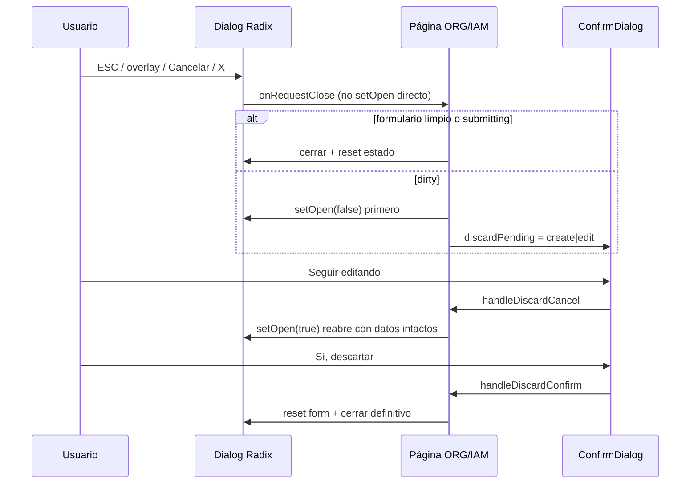

# Sprint E — E-SEC: Auditoría B.1.1 en páginas ORG

**Fecha:** 31 mayo 2026  
**Estado:** Aprobado para implementación — **sin código, sin commit**  
**Prerequisitos cerrados:** P0/P1 contexto empresa (QA manual OK).  
**Alcance E-SEC:** Solo patrón **B.1.1** (dirty + confirm al cerrar crear/editar).  
**Referencia canónica:** `UserManagementPage`, `RoleManagementPage`, `RolePermissionsManager`, `SPRINT_B1_RUNTIME_FIX_AUDIT.md`.

**Fuera de alcance E-SEC:** empty states, `IamSearchInput`, skeletons, refactor estructural `EmpresaPage`, navegación, onboarding, APIs, multiempresa, `ConfirmDialog` de desactivar/eliminar (ya existen).

---

## 1. Resumen ejecutivo

| Métrica | Valor |
|---------|--------|
| Páginas ORG en alcance | **6** |
| Diálogos de formulario (crear + editar) | **12** |
| `ConfirmDialog` destructivos existentes | **6** (sin cambio en E-SEC) |
| Patrón objetivo | IAM **Opción 1** (confirm en página; cerrar Radix antes del confirm) |
| Riesgo global | **Medio** — `EmpresaPage` y formularios con cascada geo |

**Hallazgo confirmado en QA:** en todas las páginas ORG, `onOpenChange={setCreateOpen}` y botones Cancelar cierran el diálogo sin preguntar, aunque exista `ConfirmDialog` solo para desactivar filas.

---

## 2. Patrón B.1.1 canónico (IAM)

### 2.1 Flujo (UserManagement / RoleManagement)



### 2.2 Reglas obligatorias (checklist implementación)

| # | Regla | IAM referencia |
|---|--------|----------------|
| 1 | `dirty` vía `useMemo` + util pura (create vs edit con **snapshot** en edit) | `iam-user-form.utils.ts`, `iam-role-form.utils.ts` |
| 2 | **No** pasar `setCreateOpen` directo a `onOpenChange` | `UserCreateDialog.handleDialogOpenChange` |
| 3 | Al cerrar con dirty: **cerrar Dialog** → luego `discardPending` (no apilar overlays) | `handleRequestCloseCreate` |
| 4 | `ConfirmDialog`: `cancelText="Seguir editando"`, `confirmText="Sí, descartar"`, `variant="warning"` | UserManagement L798–812 |
| 5 | `DialogContent`: `onInteractOutside` / `onPointerDownOutside` / `onEscapeKeyDown` → `preventDefault()` | UserCreateDialog L69–71 |
| 6 | Durante `submitting`, no permitir cierre con confirm | `if (isSubmittingCreate) return` |
| 7 | `discardPending !== null` → deshabilitar acciones de tabla que abran otro modal | RoleManagement acciones |
| 8 | `scheduleModalStackValidation` tras cierre/discard (DEV) | `iam-modal-stack-validation.ts` |
| 9 | **Un** `ConfirmDialog` discard por página; destructivo con `isOpen` independiente | IAM dos confirms separados |

### 2.3 Variante RolePermissionsManager (no copiar tal cual a ORG)

- Usa `dialogOpen = isOpen && !discardPending` (oculta dialog mientras confirm está abierto sin bajar `isOpen` del padre).
- ORG debe seguir **patrón página** (User/Role): `setCreateOpen(false)` + `discardPending === 'create'`.

---

## 3. Inventario de diálogos afectados

### 3.1 Matriz por página

| Página | Ruta típica | Crear | Editar | Confirm destructivo | Estado B.1.1 |
|--------|-------------|-------|--------|---------------------|--------------|
| `EmpresaPage.tsx` | `/app/org/empresa` | ✅ Dialog ~L448 | ✅ Dialog ~L994 | Desactivar empresa | ❌ |
| `SucursalesPage.tsx` | `/app/org/sucursales` | ✅ ~L396 | ✅ ~L543 | Desactivar sucursal | ❌ |
| `DepartamentosPage.tsx` | `/app/org/departamentos` | ✅ ~L277 | ✅ ~L306 | Desactivar departamento | ❌ |
| `CargosPage.tsx` | `/app/org/cargos` | ✅ ~L300 | ✅ ~L358 | Desactivar cargo | ❌ |
| `CentrosCostoPage.tsx` | `/app/org/centros-costo` | ✅ ~L290 | ✅ ~L333 | Desactivar centro | ❌ |
| `ParametrosPage.tsx` | `/app/org/parametros` | ✅ ~L470 | ✅ ~L510 | Desactivar parámetro | ❌ |

**Total E-SEC: 12 diálogos de formulario.**

### 3.2 Anti-patrones actuales (todas las páginas)

| Mecanismo | Comportamiento actual | Debe ser |
|-----------|----------------------|----------|
| `onOpenChange={setCreateOpen}` | Cierra sin dirty check | `handleCreateOpenChange` → `handleRequestCloseCreate` |
| `onOpenChange={(o) => !o && setEditing(null)}` | Cierra edit sin confirm | `handleRequestCloseEdit` + limpiar `editing` solo en `handleCloseEditModal` |
| Botón Cancelar | `setCreateOpen(false)` / `setEditOpen(false)` | `onRequestClose` |
| Overlay / ESC | Cierra vía Radix default | Bloqueado + ruta `onRequestClose` |
| Post-guardado exitoso | `setCreateOpen(false)` directo | OK (no dirty tras save) |

### 3.3 Estado de formulario por página (impacto dirty)

| Página | Estado principal | Estado auxiliar (incluir en dirty) | Complejidad dirty |
|--------|------------------|-----------------------------------|-------------------|
| **CentrosCosto** | `form`, `editForm` | — | Baja |
| **Departamentos** | `form`, `editForm` | selects FK en form | Baja |
| **Cargos** | `form`, `editForm` | relaciones sucursal/depto en form | Media-baja |
| **Parámetros** | `form`, `editForm` | `createAlcance`, `valorJsonStr` (edit/create JSON) | Media |
| **Sucursales** | `form`, `editForm` | `selectedPaisId`, `selectedDepartamentoId`, `selectedProvinciaId`, `selectedDistritoId` | Alta |
| **Empresa** | `form`, `editForm` | Geo selectors + `fieldErrors` / `editFieldErrors` (errores no cuentan como dirty) | **Muy alta** |

### 3.4 Casos especiales

| Caso | Página | Nota E-SEC |
|------|--------|------------|
| Onboarding `?onboarding=true` | Empresa | Auto-abre crear; B.1.1 aplica igual al cerrar con datos |
| `useOrgScopeEmpresaReset` | Company-scoped (no Empresa) | En `resetLocalFilters` añadir `setDiscardPending(null)` y cerrar modales |
| Parámetros hybrid tabs | Parametros | Dirty solo del modal abierto; no mezclar tab list con form state |
| `empresa_id` en create | Sucursales, etc. | Inyectado al abrir; dirty create = campos usuario (no contar `empresa_id` default como dirty si coincide sesión) |

---

## 4. Estrategia de reutilización

### 4.1 Principio

Reutilizar **comportamiento** IAM, no extraer aún diálogos ORG gigantes (`EmpresaPage` ~1500 líneas). Infra compartida + utils dirty por entidad; wiring en cada página.

### 4.2 Artefactos propuestos (nuevos)

| Artefacto | Ubicación sugerida | Responsabilidad |
|-----------|-------------------|-----------------|
| `OrgDiscardPending` type | `src/features/org/types/org-discard.types.ts` | `'create' \| 'edit' \| null` |
| `useOrgFormDiscard` hook | `src/features/org/hooks/useOrgFormDiscard.ts` | `discardPending`, handlers cancel/confirm genéricos con callbacks `onResumeCreate/Edit`, `onDiscardCreate/Edit` |
| Dirty utils (por entidad) | `src/features/org/utils/form-dirty/*.ts` | `isCreateXDirty`, `buildEditXSnapshot`, `isEditXDirty` |
| `orgDialogGuardProps` | `src/features/org/utils/org-dialog-guard-props.ts` | Constante props Radix anti-cierre accidental |
| Validación stack (opcional) | Import desde `@/features/admin/utils/iam-modal-stack-validation` | O mover a `@/shared/utils/modal-stack-validation` en implementación |

### 4.3 Hook `useOrgFormDiscard` (contrato propuesto)

```ts
// Pseudocódigo — espejo IAM
const {
  discardPending,
  setDiscardPending,
  isDiscardConfirmOpen,
  handleDiscardCancel,
  handleDiscardConfirm,
  requestCloseCreate,  // (isDirty, isSubmitting, closeCreate, openCreate)
  requestCloseEdit,
} = useOrgFormDiscard({
  onCloseCreate: () => void,
  onCloseEdit: () => void,
  onResumeCreate: () => void,
  onResumeEdit: () => void,
});
```

Cada página implementa `onClose*` con reset de formulario ya existente (`openCreate` inverso).

### 4.4 Dirty — convenciones

**Create:** dirty si cualquier campo relevante difiere del `DEFAULT` (trim strings; ignorar `empresa_id` cuando solo refleja `scopeEmpresaId`).

**Edit:** al abrir `openEdit`, `setEditFormSnapshot(buildEditXSnapshot(...))` incluyendo estado auxiliar (geo, `valorJsonStr`, `createAlcance`).

**Comparación:** funciones puras testeables (mismo estilo que `iam-user-form.utils.ts`).

### 4.5 Wiring Dialog (por cada create/edit)

```tsx
const createDialogOpen = createOpen; // IAM: false cuando discardPending==='create' ya forzado por setCreateOpen(false)

const handleCreateDialogOpenChange = (next: boolean) => {
  if (submitting) return;
  if (next) { setCreateOpen(true); return; }
  requestCloseCreate(isCreateDirty);
};

<Dialog open={createDialogOpen} onOpenChange={handleCreateDialogOpenChange}>
  <DialogContent {...orgDialogGuardProps}>
    ...
    <Button onClick={() => requestCloseCreate(isCreateDirty)}>Cancelar</Button>
```

```tsx
<ConfirmDialog
  isOpen={discardPending !== null}
  onClose={handleDiscardCancel}
  onConfirm={handleDiscardConfirm}
  title="Descartar cambios"
  message={discardPending === 'create' ? '...crear...' : '...guardar...'}
  confirmText="Sí, descartar"
  cancelText="Seguir editando"
  variant="warning"
/>
```

Mensajes alineados IAM:

- Crear: *«Hay cambios sin guardar. ¿Desea cerrar sin crear …?»*
- Editar: *«Hay cambios sin guardar. ¿Desea cerrar sin guardar?»* (sustituir entidad: sucursal, departamento, etc.)

### 4.6 Orden de implementación recomendado

1. Infra: types + hook + `orgDialogGuardProps` + util dirty **CentrosCosto** (piloto).
2. **Departamentos** → **Cargos** (patrón repetible).
3. **Parametros** (alcance + JSON).
4. **Sucursales** (geo).
5. **Empresa** (mayor superficie; validar onboarding al final).

### 4.7 Lo que NO se hace en E-SEC

- Extraer `EmpresaCreateDialog` / componentes IAM-style (opcional sprint posterior).
- Cambiar `ConfirmDialog` global ni `dialog.tsx`.
- Unificar mensajes de desactivar con discard.
- Tests Vitest (recomendados post-E-SEC para utils dirty).

---

## 5. Riesgos

| Riesgo | Severidad | Mitigación |
|--------|-----------|------------|
| **Overlay negro / body lock** (Radix + ConfirmDialog) | **Alta** | Patrón IAM estricto: cerrar Dialog antes de confirm; `scheduleModalStackValidation` en DEV |
| **`onOpenChange` olvidado en un path** | Alta | Checklist por página; QA ESC + overlay + Cancelar |
| **Dirty incompleto** (geo selectors fuera de snapshot) | Media | Snapshot explícito `{ form, selectedPaisId, ... }` en Sucursales/Empresa |
| **Falso positivo dirty** (`empresa_id` pre-rellenado) | Baja | Util create ignora campos solo-set por sesión |
| **Dos ConfirmDialog abiertos** (discard + delete) | Media | `deleteTarget` solo si `discardPending === null`; bloquear delete mientras discard |
| **EmpresaPage regresión onboarding** | Media | QA `?onboarding=true` tras implementar |
| **`useOrgScopeEmpresaReset` deja discard colgado** | Media | Reset `discardPending` en callback |
| **Acoplamiento import admin validation** | Baja | Mover util a `shared` si molesta dependencia feature→feature |
| **Tamaño diff EmpresaPage** | Media | Implementar al final; utils dirty aisladas |

---

## 6. Compatibilidad y restricciones (confirmación)

| Restricción | E-SEC |
|------------|--------|
| Sin cambios API / payloads | ✓ Solo handlers de cierre UI |
| Sin multiempresa / JWT / guards | ✓ |
| Sin AuthContext | ✓ |
| Mi Empresa funcional igual (solo B.1.1 en modales) | ✓ |
| `ConfirmDialog` desactivar sin cambio de copy | ✓ |

---

## 7. Plan QA (post-implementación)

### 7.1 Matriz por diálogo (×12)

Para cada página y modo **Crear** y **Editar**:

| # | Paso | Esperado |
|---|------|----------|
| A | Abrir modal sin tocar campos → Cancelar / ESC / overlay | Cierra **sin** confirm |
| B | Modificar un campo → Cancelar | Dialog cierra → Confirm «Descartar cambios» |
| C | Confirm → «Seguir editando» | Dialog **reabre** con datos intactos |
| D | Repetir B → «Sí, descartar» | Cierra; datos no persistidos; **sin** pantalla negra |
| E | Modificar → Guardar exitoso | Cierra sin confirm; lista actualizada |
| F | Modificar → Guardar falla (si reproducible) | Dialog permanece abierto |
| G | Durante `submitting`, intentar cerrar | No cierra / no confirm |
| H | Con discard abierto, intentar abrir otro modal / desactivar fila | Bloqueado o no interfiere |

### 7.2 Páginas — smoke específico

| Página | Casos extra |
|--------|-------------|
| **Empresa** | Onboarding auto-open; edit con cambio geo (país→distrito) |
| **Sucursales** | Dirty al cambiar solo cascada geo |
| **Parámetros** | Create con `createAlcance`; edit tipo `json` + `valorJsonStr` |
| **CentrosCosto** | Piloto primero en QA dev |

### 7.3 Regresión multiempresa (smoke)

| # | Caso | Esperado |
|---|------|----------|
| 1 | tenant_admin cambia empresa con modal cerrado | Sin modal abierto; listas OK |
| 2 | Con modal **abierto** y dirty → cambiar empresa en header | `useOrgScopeEmpresaReset` cierra y limpia discard |
| 3 | P0/P1 header único contexto | Sin regresión |

### 7.4 DEV — stack modales

Tras cada escenario B→D, consola filtro `[IAM Modal Cleanup]` o equivalente ORG:

- `body.overflow` no `hidden` residual
- `radix overlays` = 0

### 7.5 Criterios de cierre E-SEC

- [ ] 12/12 diálogos pasan matriz §7.1 A–H  
- [ ] 0 pantallas negras en 6 páginas  
- [ ] Copy confirm = «Seguir editando» / «Sí, descartar»  
- [ ] Sin cambios en requests ORG  
- [ ] P0/P1 QA smoke §7.3 OK  

---

## 8. Estimación e impacto

| Concepto | Estimación |
|----------|------------|
| Archivos nuevos | 8–10 (hook, types, 6 dirty utils, guard props) |
| Archivos modificados | 6 páginas |
| Líneas netas aprox. | 900–1400 (concentrado en Empresa + Sucursales) |
| Tiempo sugerido | 1–2 sesiones (piloto + rollout) |

**Impacto futuro:** utils dirty + hook reutilizables para nuevos CRUD ORG; patrón alineado con IAM para auditorías UX unificadas.

---

## 9. Checklist pre-implementación

- [x] Inventario 12 diálogos  
- [x] Patrón IAM documentado  
- [x] Estrategia hook + utils  
- [x] Riesgos y QA  
- [ ] Aprobación usuario para iniciar código  
- [ ] Commit solo si se solicita explícitamente  

---

*Documento generado tras QA P0/P1 y hallazgo B.1.1 en ORG. Siguiente paso: implementar E-SEC según §4.6.*
