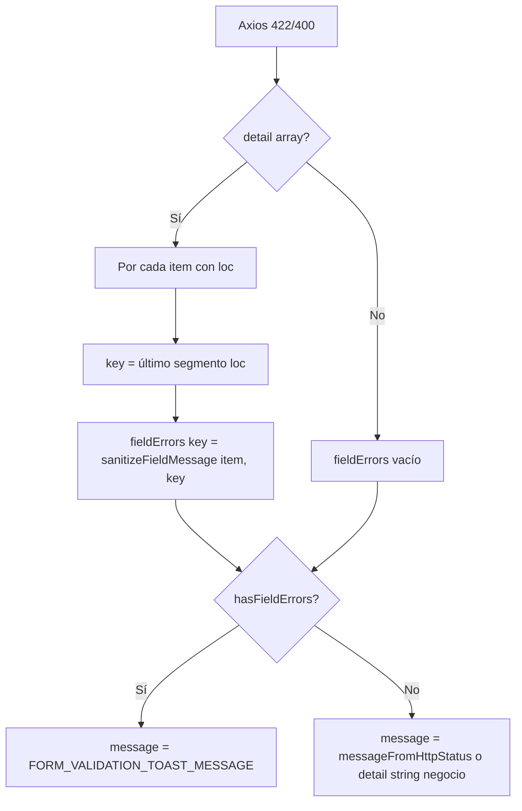

# PAUX_PHASE_B_IMPLEMENTATION_PLAN.md

**Fase:** PAUX-Convergence — Phase B  
**Fecha:** 2026-06-03  
**Base:** `PLATFORM_422_UX_AUDIT.md`, `PLATFORM_TOOLBAR_CONSISTENCY_AUDIT.md`, `PAUX_CONVERGENCE_PHASE_A_IMPLEMENTATION_REPORT.md`  
**Tipo:** Plan de implementación — **sin código en esta entrega**

**Alcance aprobado:**

| ID | Ítem |
|----|------|
| **P1-04b** | Sanitización UX 422 — mensajes amigables Platform, toast genérico, sin duplicidad técnica |
| **TB-B** | Toolbar 2 zonas — Clientes, Países, Monedas |

**Restricciones:**

- No modificar Backend.
- No modificar Dashboard.
- No modificar Auditoría Global.
- No modificar Departamentos, Provincias, Distritos, Módulos (toolbar).
- No crear `PlatformListToolbar` ni componentes shared nuevos.
- Cambios mínimos; sin alterar funcionalidades existentes.

---

## 0. Resumen ejecutivo

| Aspecto | Decisión |
|---------|----------|
| **Objetivo** | Cerrar gap UX post-QA manual (422 Pydantic + filtro toolbar aislado) |
| **Estrategia P1-04b** | Capa central en `error.service.ts`; hooks Clientes suprimen toast duplicado |
| **Estrategia TB-B** | Reestructurar JSX toolbar a **2 hijos** (left cluster + right cluster) en 3 páginas |
| **Esfuerzo estimado** | **0.5–1 día** FE |
| **Riesgo global** | **Bajo** |

**Entregables post-implementación:** código + `PAUX_PHASE_B_IMPLEMENTATION_REPORT.md` (fuera de este plan).

---

## 1. Alcance exacto

### 1.1 Incluido

#### P1-04b — Sanitización UX 422

| Entrega | Descripción |
|---------|-------------|
| `sanitizeFieldMessage()` | Exportable o interna; normaliza un ítem Pydantic / string con prefijo técnico |
| Eliminación prefijos | `body.`, `query.`, `path.`, índices numéricos en path |
| Heurísticas Pydantic | Email, required, length, duplicate, color hex → español |
| Catálogo Platform | Fallbacks por campo API (`contacto_email`, `subdominio`, catálogos, módulos) |
| `getValidationErrors()` | `fieldErrors` sanitizados; `message` genérico si hay campos mapeados |
| Toast genérico | Sin texto Pydantic cuando existen `fieldErrors` |
| Anti-duplicidad Clientes | `useCreateCliente` / `useUpdateCliente`: no toast técnico si modal ya mapeó 422 |

#### TB-B — Toolbar 2 zonas

| Página | Cambio |
|--------|--------|
| `ClientManagementPage.tsx` | Agrupar search + select Registro en left cluster |
| `PaisesPage.tsx` | Agrupar search + «Ver inactivos» en left cluster |
| `MonedasPage.tsx` | Idem Países |

**Patrón oficial:**

```text
[left cluster]  búsqueda + filtros (flex-wrap gap-3)
[right cluster] refresh + acción principal (shrink-0)
```

Solo cambio de **estructura DOM / clases**; mismos handlers, state y copy.

### 1.2 Excluido explícitamente

| Área | Motivo |
|------|--------|
| Backend / OpenAPI | Restricción usuario |
| Dashboard | Restricción usuario |
| Auditoría Global | Restricción usuario |
| Toolbars Dept / Prov / Dist / Módulos | Ya conformes o fuera de alcance |
| `PlatformListToolbar` shared | Diferido |
| P1-02 convergencia semántica filtros | Fuera de Phase B |
| Endurecer regex email FE (`EmailStr`) | Opcional B5; no incluido |
| Texto bajo input en catálogos (solo `border-error` hoy) | Opcional; no requerido para cierre P1-04b |
| `CreateConnectionModal`, tabs Cliente | Fuera de alcance 422 Platform forms |

### 1.3 Efecto colateral aceptable (sin diff adicional)

Superficies que ya usan `getValidationErrors()` **heredan** mensajes sanitizados al centralizar en `error.service.ts`:

- `EditClientModal`, modales Módulos, catálogos ×5, `EmpresaPage` (ORG)

No se modifican archivos ORG/Módulos/Catálogos salvo tests si fallan expects. **Comportamiento mejora sin tocar cada modal.**

---

## 2. P1-04b — Diseño técnico

### 2.1 Archivos afectados

| Archivo | Acción | Cambio |
|---------|--------|--------|
| `src/core/services/error.service.ts` | **Modificar** | `sanitizeFieldMessage`, stripping, catálogo Platform, lógica `getValidationErrors` |
| `src/core/services/__tests__/error.service.test.ts` | **Modificar** | Tests sanitización + expects actualizados |
| `src/core/hooks/useClienteMutations.ts` | **Modificar** | Suprimir toast en 422 con `fieldErrors` mapeados (create/update) |

**No crear** archivos shared/componentes. El catálogo de mensajes Platform vive **en el mismo** `error.service.ts` (const `PLATFORM_FIELD_MESSAGES` + heurísticas) para diff mínimo.

### 2.2 Funciones propuestas

```typescript
/** Quita prefijos body.campo:, query.campo:, path. y ruido inicial */
function stripTechnicalPrefix(raw: string, fieldKey?: string): string;

/** Mensaje amigable para un ítem de validación o string detail */
export function sanitizeFieldMessage(
  input: string | PydanticValidationItem,
  fieldKey?: string,
): string;

/** Mensaje toast/banner cuando hay errores de campo en formulario */
const FORM_VALIDATION_TOAST_MESSAGE =
  'Revisa los campos indicados en el formulario.';
```

### 2.3 Flujo `getValidationErrors()` (post-cambio)



**Regla crítica:** cuando `hasFieldErrors === true`, **no** usar `messageFromDetail(detail)` (evita Pydantic en toast de catálogos/modales).

### 2.4 Catálogo Platform (fallbacks por campo)

Prioridad de resolución por campo:

1. Heurística sobre `msg` / `type` (email, required, length…)
2. `PLATFORM_FIELD_MESSAGES[fieldKey]` si existe
3. Fallback genérico: *«Revisa el valor ingresado en este campo.»*

| Campo | Mensaje fallback |
|-------|------------------|
| `contacto_email` | El email de contacto no es válido. |
| `codigo_cliente` | El código de cliente no es válido o ya existe. |
| `subdominio` | El subdominio no es válido o no está disponible. |
| `razon_social` | La razón social es obligatoria o no cumple el formato esperado. |
| `ruc` | El RUC debe contener solo números (8–15 dígitos). |
| `servidor_api_local` | La URL debe comenzar con http:// o https://. |
| `color_primario`, `color_secundario` | Usa un color en formato #RRGGBB. |
| `tema_personalizado` | El JSON del tema no es válido. |
| `codigo`, `nombre`, `categoria`, `color`, `orden` | Mensajes Módulos (auditoría 422) |
| `codigo_iso2`, `codigo_iso3`, `nombre` | Código ISO o nombre no válido. |
| `simbolo`, `decimales` | Revisa el símbolo o los decimales. |
| `ubigeo` | El ubigeo debe tener 6 dígitos. |
| `pais_id`, `departamento_id`, `provincia_id` | Selecciona un valor válido. |

### 2.5 Heurísticas Pydantic (msg / type)

| Patrón (case insensitive) | Mensaje |
|---------------------------|---------|
| `valid email` / `email address` | El email no es válido. Usa un dominio real (ej. `@empresa.com`). |
| `special-use or reserved name` | El dominio del email no es válido para correo electrónico. |
| `field required` / `missing` | Este campo es obligatorio. |
| `string_too_short` / `at least` | El valor es demasiado corto. |
| `string_too_long` / `at most` | El valor es demasiado largo. |
| `already exists` / `duplicate` | Este valor ya está registrado. |
| Prefijo `body.xxx:` en string detail | Strip + re-aplicar heurísticas |

**Caso QA:** `body.contacto_email: value is not a valid email address: … special-use …`  
→ strip → heurística email → *«El email de contacto no es válido.»* (catálogo campo gana si heurística genérica).

### 2.6 Política toast — anti-duplicidad

| Canal | Comportamiento |
|-------|----------------|
| **Inline** (`errors.contacto_email`) | Mensaje sanitizado de `fieldErrors` |
| **Toast hook** (`useCreateCliente` / `useUpdateCliente`) | Si `422` y `Object.keys(fieldErrors).length > 0` → **return** (sin toast) |
| **Toast catálogo/modulo catch** | `toast.error(getValidationErrors(err).message)` → genérico |
| **409 / 404 / 500** | Sin cambio: `detail` string de negocio vía `getErrorMessage` |

**Justificación:** el modal Clientes ya pinta error bajo campo; un toast genérico adicional sería redundante. Catálogos sin texto bajo campo pueden mantener toast genérico único.

### 2.7 `getErrorMessage()` — alcance en Phase B

**Cambio mínimo opcional recomendado:** si status 422/400 y `getValidationErrors(error).fieldErrors` no vacío, devolver mensaje genérico en lugar de concat Pydantic.

Beneficio: cualquier `toast.error(getErrorMessage(err))` residual no filtra técnico.  
Riesgo: bajo; validar que no oculte `detail` string útil en 422 sin `loc`.

---

## 3. TB-B — Diseño toolbar

### 3.1 Archivos afectados

| Archivo | Líneas aprox. | Cambio |
|---------|---------------|--------|
| `src/features/super-admin/clientes/pages/ClientManagementPage.tsx` | ~197–247 | 3 hijos → 2 hijos |
| `src/features/super-admin/catalogos/pages/PaisesPage.tsx` | ~172–203 | Idem |
| `src/features/super-admin/catalogos/pages/MonedasPage.tsx` | ~173–214 | Idem |

**Total:** 3 archivos, ~30–45 líneas netas (reindentación JSX).

### 3.2 Estructura objetivo (referencia)

```tsx
<div className="flex flex-col sm:flex-row gap-4 justify-between items-start sm:items-center">
  {/* Left cluster */}
  <div className="flex flex-col sm:flex-row gap-3 w-full sm:w-auto flex-wrap items-center">
    {/* search w-64 */}
    {/* filtros: select Registro | checkbox Ver inactivos */}
  </div>
  {/* Right cluster */}
  <div className="flex gap-2 shrink-0">
    {/* refresh */}
    {/* primary CTA */}
  </div>
</div>
```

Alineado con `DepartamentosPage.tsx` (patrón ya validado en codebase).

### 3.3 Sin cambios funcionales

| Control | Comportamiento preservado |
|---------|---------------------------|
| Clientes — select Registro | `activeFilter` all / active / inactive |
| Clientes — búsqueda | debounce + reset página |
| Clientes — refresh / Nuevo | `refetch()`, `openCreateModal` |
| Países/Monedas — Ver inactivos | `showInactivos` → `solo_activos` API |
| Países/Monedas — búsqueda | client-side filter |
| Disabled states | `pageActionsLocked` (Clientes), `loading` (catálogos) |

---

## 4. Análisis de riesgos

| ID | Riesgo | Prob. | Impacto | Mitigación |
|----|--------|-------|---------|------------|
| R-01 | Heurística email demasiado genérica oculta detalle útil | Media | Bajo | Catálogo por campo + heurística; QA caso QA explícito |
| R-02 | Tests Phase A fallan por expects Pydantic crudo | Alta | Bajo | Actualizar `error.service.test.ts` en mismo PR |
| R-03 | ORG `EmpresaPage` cambia copy 422 sin QA | Media | Bajo | Aceptado como mejora colateral; smoke ORG opcional |
| R-04 | Suprimir toast hook oculta error 422 sin loc | Baja | Medio | Solo suprimir si `fieldErrors` no vacío; else toast `getErrorMessage` |
| R-05 | Toolbar mobile wrap rompe layout | Baja | Bajo | `flex-wrap` en left cluster; QA sm/md/lg |
| R-06 | Regresión filtros Clientes | Muy baja | Alto | No tocar state/handlers; solo mover nodos DOM |
| R-07 | 409 con detail array confundido con 422 | Muy baja | Medio | Sanitizar solo status 400/422 en `getValidationErrors` |

---

## 5. Orden de implementación

| Paso | Entrega | Dependencia |
|------|---------|-------------|
| 1 | `sanitizeFieldMessage` + catálogo + tests unitarios | — |
| 2 | Integrar en `getValidationErrors` (message priority) | Paso 1 |
| 3 | Ajuste `useClienteMutations` anti-duplicidad | Paso 2 |
| 4 | (Opcional) `getErrorMessage` guard 422 con fields | Paso 2 |
| 5 | Toolbar Clientes 2 zonas | Independiente |
| 6 | Toolbar Países + Monedas 2 zonas | Paso 5 (mismo patrón) |
| 7 | QA manual + reporte | Pasos 1–6 |

**Recomendación:** implementar P1-04b completo antes de toolbar (desbloquea cierre auditoría 422); toolbar en segundo commit o mismo PR si diff pequeño.

---

## 6. Checklist QA

### 6.1 P1-04b — 422 UX

| ID | Caso | Pasos | Resultado esperado |
|----|------|-------|-------------------|
| QA-422-01 | **Caso QA email** | Crear cliente con email dominio reservado (ej. `admin@localhost`) | Bajo campo: *«El email de contacto no es válido.»* (o heurística email); **sin** `body.` ni inglés Pydantic |
| QA-422-02 | Sin toast técnico | Mismo caso | **Sin** toast con texto Pydantic; idealmente sin toast (hook suprimido) |
| QA-422-03 | Borde rojo | Mismo caso | Input `contacto_email` con `border-error` |
| QA-422-04 | Editar cliente | PUT con email inválido | Mismo sanitizado en `EditClientModal` |
| QA-422-05 | 409 subdominio duplicado | Crear subdominio existente | Toast conserva `detail` negocio (*«El subdominio ya está registrado»*) |
| QA-422-06 | 422 sin loc | Simular/forzar 422 body vacío | Toast: *«Los datos enviados no son válidos.»* |
| QA-422-07 | Catálogo crear país | Duplicar ISO2 (422) | Toast genérico; campos con borde si mapeados |
| QA-422-08 | Unit tests | `npm test -- error.service.test.ts` | Todos verdes; nuevos tests sanitización |

### 6.2 TB-B — Toolbar

| ID | Caso | Viewport | Resultado esperado |
|----|------|----------|-------------------|
| QA-TB-01 | Clientes layout | ≥640px (sm+) | Search + select Registro **agrupados a la izquierda**; refresh + Nuevo a la derecha |
| QA-TB-02 | Clientes layout | &lt;640px | Stack vertical; filtros no «flotando» en centro aislado |
| QA-TB-03 | Países layout | sm+ | Search + Ver inactivos agrupados izquierda |
| QA-TB-04 | Monedas layout | sm+ | Idem Países |
| QA-TB-05 | Filtro Clientes Activos | Cambiar select | Lista filtra igual que antes |
| QA-TB-06 | Ver inactivos Países | Toggle checkbox | Lista incluye/excluye inactivos |
| QA-TB-07 | Regresión Dept/Prov/Dist | Visual rápido | Sin cambios |
| QA-TB-08 | Regresión Módulos | Visual rápido | Sin cambios |

### 6.3 Regresión transversal

| ID | Verificación |
|----|--------------|
| QA-RG-01 | Dashboard no modificado (git diff) |
| QA-RG-02 | Auditoría Global no modificado |
| QA-RG-03 | No aparece `PlatformListToolbar` ni nuevos shared components |
| QA-RG-04 | `npm test` suite error.service verde |

---

## 7. Criterios de aceptación (cierre Phase B)

| CA | Criterio |
|----|----------|
| CA-B-01 | P1-04b: caso QA `contacto_email` cerrado en auditoría |
| CA-B-02 | Ningún mensaje visible Platform contiene `body.` / Pydantic inglés en 422 mapeado |
| CA-B-03 | Toast no duplica mensaje técnico en create/update Cliente |
| CA-B-04 | TB-B: Clientes, Países, Monedas usan patrón 2 zonas |
| CA-B-05 | Funcionalidad filtros/búsqueda/acciones sin regresión |
| CA-B-06 | Tests unitarios actualizados y verdes |
| CA-B-07 | Alcance excluido respetado (diff acotado) |

---

## 8. Commits sugeridos (post-implementación)

| Commit | Mensaje propuesto |
|--------|-------------------|
| 1 | `fix(platform): sanitize 422 field messages and suppress duplicate client toasts` |
| 2 | `fix(platform): align Clientes and catalog leaf toolbars to two-zone layout` |

Alternativa: **un solo commit** si el diff total &lt; 200 líneas.

---

## 9. Referencias

| Documento | Uso |
|-----------|-----|
| `PLATFORM_422_UX_AUDIT.md` | Diseño sanitización + catálogo campos |
| `PLATFORM_TOOLBAR_CONSISTENCY_AUDIT.md` | Patrón 2 zonas + wireframes |
| `PAUX_CONVERGENCE_PHASE_A_IMPLEMENTATION_REPORT.md` | Baseline P1-04 parcial |
| `DepartamentosPage.tsx` | Referencia implementación toolbar correcta |

**Estado:** plan listo para implementación tras esta entrega.
