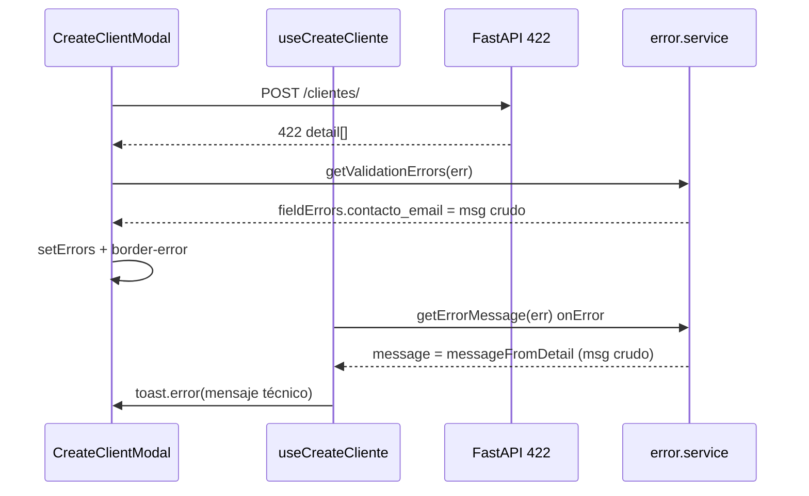

# PLATFORM_422_UX_AUDIT.md

**Tema:** Experiencia UX de errores 422 — validación por campo en Platform Administration  
**Fecha:** 2026-06-03  
**Tipo:** Auditoría exclusiva Frontend — **sin implementación, sin Backend, sin Dashboard**

**Disparador:** QA manual post PAUX Phase A (P1-04). Caso reproducido: `contacto_email` inválido al crear cliente.

**Referencias:**

- `PAUX_CONVERGENCE_PHASE_A_IMPLEMENTATION_REPORT.md` — P1-04 / P1-05 declarados cerrados
- `PLATFORM_ERROR_EXPERIENCE_AUDIT.md` — deuda ER-01/02/03 (Clientes)
- `ERP_FRONTEND_STANDARDS_V2.md` — §8.5 ER-03, §10 `getErrorMessage` / validación
- Patrón existente ORG: `EmpresaPage.tsx` + `getValidationErrors()`

---

## 1. Resumen ejecutivo

| Pregunta | Respuesta |
|----------|-----------|
| ¿P1-04 está cerrado funcionalmente? | **Parcial.** El wiring `fieldErrors` + `border-error` existe. |
| ¿P1-04 está cerrado en UX? | **No.** Los mensajes mostrados al usuario son técnicos (Pydantic/FastAPI). |
| ¿Cuál es la causa raíz? | **No hay capa de sanitización** entre `detail[].msg` y la UI; el FE reenvía texto crudo. |
| ¿El caso QA es un bug de mapping? | **No.** El campo se mapea bien (`contacto_email`); falla el **copy**, no la clave. |
| ¿Hay doble feedback? | **Sí** en Clientes: toast del hook + error inline en modal. |
| **Veredicto** | Abrir **P1-04b — Sanitización UX 422** antes de cerrar Phase A en auditoría. |

### Caso QA reproducido

**Acción:** Crear cliente con email inválido (dominio reservado / special-use, p. ej. `admin@localhost`).

**Mensaje observado:**

```text
body.contacto_email: value is not a valid email address: The part after the @-sign is a special-use or reserved name that cannot be used with email.
```

**Problemas UX confirmados:**

| # | Problema | Evidencia |
|---|----------|-----------|
| U-01 | Expone ruta técnica `body.contacto_email` | Prefijo no amigable |
| U-02 | Expone mensaje interno Pydantic / EmailStr | Texto en inglés, detalle de implementación |
| U-03 | No orienta al usuario sobre qué corregir | Frase larga, jerga («special-use or reserved name») |
| U-04 | Inconsistente con validación local del modal | FE local: *«El formato del email es inválido»*; API: texto Pydantic |

---

## 2. Flujo actual (trazabilidad)

### 2.1 Cadena Clientes — crear



### 2.2 Código relevante

**Extracción de clave (correcta):**

```138:146:src/core/services/error.service.ts
  if (Array.isArray(detail) && detail.length > 0) {
    for (const item of detail) {
      if (item && typeof item === 'object' && 'msg' in item) {
        const msg = (item as { msg: string }).msg;
        const loc = (item as { loc?: (string | number)[] }).loc;
        if (loc && Array.isArray(loc)) {
          const key = typeof loc[loc.length - 1] === 'string' ? loc[loc.length - 1] : String(loc[loc.length - 1]);
          if (key && key !== 'body') fieldErrors[key] = msg;
```

**Sin sanitización:** `fieldErrors[key] = msg` asigna el string Pydantic tal cual.

**Mensaje global prioriza detail crudo:**

```151:157:src/core/services/error.service.ts
  const fromDetail = messageFromDetail(detail);
  const hasFieldErrors = Object.keys(fieldErrors).length > 0;
  const message =
    fromDetail ??
    (hasFieldErrors && (status === 422 || status === 400)
      ? 'Revisa los campos indicados en el formulario.'
      : messageFromHttpStatus(status));
```

Cuando `detail` es array con `msg`, **`fromDetail` gana siempre** → toast y catálogos muestran texto técnico concatenado, aunque existan `fieldErrors`.

**Toast duplicado en Clientes:**

```27:30:src/core/hooks/useClienteMutations.ts
    onError: (error) => {
      const errorData = getErrorMessage(error);
      toast.error(errorData.message || 'Error al crear el cliente');
    },
```

`CreateClientModal` captura el error y pinta campo, pero **no suprime** el `onError` del hook → el usuario recibe toast + inline.

**Validación local bypass:**

```179:182:src/features/super-admin/clientes/components/CreateClientModal.tsx
    if (!formData.contacto_email.trim()) {
      newErrors.contacto_email = 'El email de contacto es requerido';
    } else if (!/\S+@\S+\.\S+/.test(formData.contacto_email)) {
      newErrors.contacto_email = 'El formato del email es inválido';
```

Regex permisiva vs `EmailStr` del backend → emails que pasan FE pero fallan API exponen 422 Pydantic.

---

## 3. Análisis de `getValidationErrors()`

### 3.1 Fortalezas actuales

| Aspecto | Estado |
|---------|--------|
| Parseo Axios 422 | ✅ |
| Normalización JSON string body | ✅ |
| Mapa `fieldErrors` por último segmento de `loc` | ✅ |
| Ignora clave `body` | ✅ |
| Fallback HTTP sin «rojo» (P1-05) | ✅ |
| Tests unitarios básicos | ✅ (11 tests; no cubren sanitización UX) |

### 3.2 Gaps identificados

| ID | Gap | Impacto |
|----|-----|---------|
| G-01 | **Sin `sanitizeFieldMessage()`** | Mensajes Pydantic en español/inglés mixto, rutas `body.*` |
| G-02 | **`messageFromDetail` sin filtro UX** | Toast global técnico cuando hay errores de campo |
| G-03 | **No usa `type` de Pydantic** (`value_error`, `string_too_short`, etc.) | Pierde oportunidad de mapping determinista |
| G-04 | **No usa catálogo de labels** por módulo | Usuario ve `contacto_email`, no «Email de contacto» |
| G-05 | **Política toast vs inline no definida** | Clientes: doble canal; catálogos: solo toast técnico |
| G-06 | **EmpresaPage ORG hereda el mismo gap** | Mismo servicio; misma deuda transversal |
| G-07 | **Tests no validan copy amigable** | Falso positivo de cierre P1-04 |

### 3.3 Formatos de payload observables (FastAPI / Pydantic)

El FE debe tolerar **al menos** estas variantes sin asumir una sola:

| Formato | Ejemplo | Comportamiento actual |
|---------|---------|------------------------|
| A — Array estándar | `{ detail: [{ loc: ['body','contacto_email'], msg: '...', type: 'value_error' }] }` | `fieldErrors` OK; `msg` crudo |
| B — String con prefijo loc | `"body.contacto_email: value is not a valid email..."` | `messageFromDetail` devuelve string completo; `fieldErrors` vacío si no es array |
| C — Múltiples items | Varios campos en un 422 | Concat con `; ` en toast; cada campo con msg crudo |
| D — Sin `loc` reconocible | Item sin `loc` o solo `['body']` | `fieldErrors` vacío → solo toast genérico o técnico |

**Nota QA:** El mensaje reportado con prefijo `body.contacto_email:` puede corresponder a formato A (msg ya incluye prefijo) o B (detail string). En ambos casos la remediación FE es la misma: **normalizar antes de renderizar**.

---

## 4. Propuesta: sanitización de mensajes (sin implementar)

### 4.1 Principios de diseño

1. **Nunca mostrar** `body.`, `query.`, índices numéricos ni nombres snake_case crudos al usuario final.
2. **Prioridad de mensaje:** catálogo por campo+tipo → heurística por patrón → fallback genérico por tipo de error.
3. **Toast vs inline:** si `fieldErrors` no vacío en formulario modal/página, toast = *«Revisa los campos indicados en el formulario.»* (sin repetir Pydantic).
4. **Un solo lugar:** extender `error.service.ts` (no duplicar en cada modal).
5. **Sin Backend:** mapping FE-only; opcional enriquecer con `type` cuando exista.

### 4.2 Funciones propuestas (contrato)

```typescript
// Propuesta — no implementada

/** Normaliza msg Pydantic: quita prefijo body.campo:, recorta ruido técnico */
function stripPydanticNoise(raw: string, fieldKey?: string): string;

/** Mensaje amigable para un campo; usa type/loc/msg */
function sanitizeFieldMessage(
  item: { msg?: string; type?: string; loc?: (string | number)[] },
  options?: { fieldLabels?: Record<string, string> }
): string;

/** getValidationErrors: fieldErrors[key] = sanitizeFieldMessage(item) */
/** getValidationErrors.message: si hasFieldErrors → copy genérico, NO fromDetail crudo */
```

### 4.3 Heurísticas de stripping (Pydantic → español)

| Patrón en `msg` (case insensitive) | Mensaje amigable propuesto |
|--------------------------------------|----------------------------|
| `value is not a valid email` / `valid email address` | El email no es válido. Usa un dominio real (ej. `@empresa.com`). |
| `special-use or reserved name` | El dominio del email no es válido para correo electrónico. |
| `field required` / `missing` | Este campo es obligatorio. |
| `string_too_short` / `at least` | El valor es demasiado corto. |
| `string_too_long` / `at most` | El valor es demasiado largo. |
| `already exists` / `duplicate` | Este valor ya está registrado. |
| `invalid` + hex/color | El color debe ser un código hexadecimal válido (#RRGGBB). |
| Prefijo `body.campo:` o `campo:` al inicio | Eliminar prefijo; aplicar reglas anteriores al resto |
| Sin match | Revisa el valor ingresado en este campo. |

### 4.4 Catálogo de mensajes amigables por campo (Platform)

#### Clientes — `CreateClientModal` / `EditClientModal`

| Campo API | Label UI | 422 genérico propuesto | Notas |
|-----------|----------|------------------------|-------|
| `codigo_cliente` | Código de cliente | El código de cliente no es válido o ya existe. | 409 posible |
| `subdominio` | Subdominio | El subdominio no es válido o no está disponible. | Alinear con validate FE |
| `razon_social` | Razón social | La razón social es obligatoria o no cumple el formato esperado. | |
| `contacto_email` | Email de contacto | **El email de contacto no es válido.** | Caso QA |
| `ruc` | RUC | El RUC debe contener solo números (8–15 dígitos). | |
| `servidor_api_local` | Servidor API local | La URL del servidor debe comenzar con http:// o https://. | |
| `color_primario` / `color_secundario` | Color | Usa un color en formato #RRGGBB. | |
| `tema_personalizado` | Tema personalizado | El JSON del tema no es válido. | |
| `plan_suscripcion` | Plan | Selecciona un plan de suscripción válido. | |
| `estado_suscripcion` | Estado | Selecciona un estado de suscripción válido. | |

#### Módulos — modales create/edit

| Campo | Mensaje genérico propuesto |
|-------|----------------------------|
| `codigo` | El código debe usar solo mayúsculas, números y guiones bajos. |
| `nombre` | El nombre del módulo es obligatorio. |
| `categoria` | La categoría es obligatoria. |
| `color` | El color debe ser hexadecimal (#RRGGBB). |
| `orden` | El orden debe ser un número mayor o igual a 0. |

#### Catálogos globales

| Entidad | Campos frecuentes | Mensaje genérico propuesto |
|---------|-------------------|----------------------------|
| País | `codigo_iso2`, `codigo_iso3`, `nombre` | Código ISO o nombre no válido. |
| Moneda | `codigo`, `nombre`, `simbolo`, `decimales` | Revisa código, nombre, símbolo o decimales. |
| Dept / Prov / Dist | `codigo`, `nombre`, FK padre, `ubigeo` | Revisa código, nombre o relación geográfica. |
| Distrito | `ubigeo` | El ubigeo debe tener 6 dígitos. |

---

## 5. Política de canales de error (propuesta)

| Contexto | Inline campo | Toast |
|----------|--------------|-------|
| Modal con `errors` state (Clientes, Módulos) | Mensaje sanitizado bajo campo | Solo genérico si hay `fieldErrors`; **no** msg Pydantic |
| Página catálogo (Dialog) | `border-error` (sin texto hoy en varios) | Genérico sanitizado; opcional añadir `<p class="text-error">` bajo input |
| Hook `useCreateCliente` / `useUpdateCliente` | — | Suprimir toast si el modal ya manejó 422 con campos (flag o `meta`) |
| Lista / query error | Banner | `getErrorMessage` sanitizado para 422 array |

**Alineación ER-03:** con sanitización, el fallback *«Revisa los campos indicados en el formulario.»* pasa a ser el mensaje **correcto** en toast cuando hay UI de campo, no un sustituto de textos técnicos.

---

## 6. Superficies afectadas (alcance remediación futura)

| Superficie | Usa `getValidationErrors` | Riesgo UX actual |
|------------|---------------------------|------------------|
| CreateClientModal | ✅ | **Alto** — caso QA |
| EditClientModal | ✅ | **Alto** |
| CreateModuleModal | ✅ | Medio |
| EditModuleModal | ✅ | Medio |
| Catálogos ×5 | ✅ | Medio (toast técnico; poco texto bajo campo) |
| EmpresaPage (ORG) | ✅ | Medio (fuera Platform pero mismo servicio) |
| Hooks `useClienteMutations` | `getErrorMessage` only | **Alto** — toast técnico duplicado |

**Fuera de alcance inmediato:** Dashboard, Auditoría Global, interceptors axios globales.

---

## 7. Criterios de aceptación propuestos (P1-04b)

| CA | Criterio |
|----|----------|
| CA-01 | Caso QA `contacto_email` inválido muestra bajo campo: *«El email de contacto no es válido.»* (o equivalente aprobado) |
| CA-02 | Ningún mensaje visible contiene `body.` ni texto Pydantic en inglés |
| CA-03 | Toast en create/edit cliente con 422 por campo = copy genérico, no concat Pydantic |
| CA-04 | Tests unitarios cubren sanitización email, required, prefijo `body.campo:` |
| CA-05 | `getValidationErrors.message` con `fieldErrors` no usa `fromDetail` crudo |
| CA-06 | Regresión: 409/404/500 siguen mostrando `detail` string de negocio cuando aplique |

---

## 8. Recomendación de implementación (orden sugerido)

| Fase | Entrega | Riesgo |
|------|---------|--------|
| **B1** | `sanitizeFieldMessage` + ajuste `getValidationErrors` message priority | Bajo — centralizado |
| **B2** | Tests + catálogo campos Clientes | Bajo |
| **B3** | Política toast hooks Clientes (suprimir duplicado 422) | Medio |
| **B4** | Extender catálogos Módulos + Catálogos + texto bajo input | Medio |
| **B5** | (Opcional) Endurecer validación email FE para acercar a EmailStr | Bajo |

**Estimación:** 1 PR focalizado (B1+B2+B3) cierra el caso QA; B4 en PR separado.

---

## 9. Veredicto

| Dimensión | Estado post QA manual |
|-----------|------------------------|
| Wiring técnico P1-04 | ✅ |
| UX comprensible P1-04 | ❌ |
| Cierre Phase A P1-04 en auditoría | **Reabierto** — pendiente P1-04b |

**Acción solicitada:** aprobar propuesta de sanitización antes de implementar. **No implementar en este ticket.**
