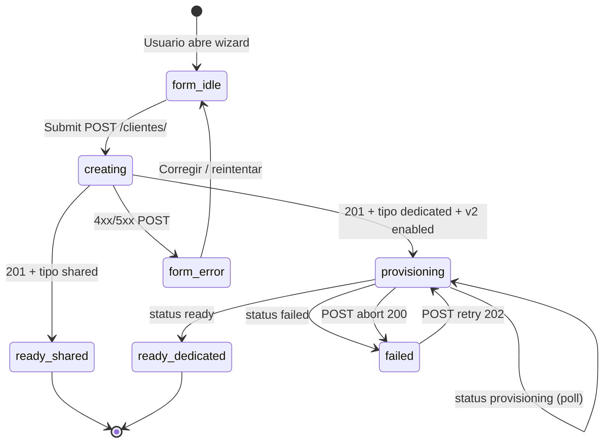

# PLATFORM ADMIN — Tenant Onboarding UI Contract

**Documento:** `PLATFORM_ADMIN_TENANT_ONBOARDING_UI_CONTRACT.md`  
**Versión:** 1.0  
**Fecha:** 2026-06-25  
**Estado:** APPROVED — base refactorización Frontend Platform Admin post-F4  
**Audiencia:** Equipo Frontend Platform Admin, QA, Producto

---

## 1. Objetivo del documento

Definir el **comportamiento funcional completo** que el Frontend Platform Admin debe implementar para el alta de tenants (**Shared** y **Dedicated**) tras el cierre de Backend F4 (Dedicated Provisioning).

Este documento es el **contrato UI único** para refactorización Frontend. No introduce reglas de negocio nuevas: deriva exclusivamente de:

- `DEDICATED_PROVISIONING_API_CONTRACT.md`
- `CONNECTION_CREATION_API_CONTRACT.md`
- Arquitectura F4 implementada (IP-2.0.1, BL-F4-1.0, AR-F01)

**Fuera de alcance:** implementación Backend, cambios OpenAPI, diseño visual (colores, tipografía), módulos ERP tenant.

---

## 2. Alcance

### In scope

| Área | Descripción |
|------|-------------|
| Wizard / flujo alta tenant Shared | `POST /api/v1/clientes/` con `tipo_instalacion=shared` |
| Wizard / flujo alta tenant Dedicated | `POST /api/v1/clientes/` con `tipo_instalacion=dedicated` + saga |
| Polling provisioning Dedicated | `GET .../provisioning-status/` |
| Operaciones ops Dedicated | `POST .../provisioning/retry`, `POST .../provisioning/abort` |
| Pantallas de progreso, error, credenciales | Estados UI §6–§8 |
| Compatibilidad legacy Dedicated | §12 |
| Migración desde FE actual | §13 |

### Out of scope

| Área | Referencia |
|------|------------|
| Login tenant / JWT post-Ready | Contratos auth existentes |
| Migración Shared→Dedicated | F7 |
| ERP operativo dentro del tenant | Módulos ERP |
| Detalle interno saga S1–S10 (DDL, scripts) | BL-F4-1.0 — no expuesto |
| Listado/edición conexiones (salvo repair ops) | Otros contratos |

---

## 3. Relación con contratos Backend

| Contrato | Rol para el Frontend |
|----------|---------------------|
| **`DEDICATED_PROVISIONING_API_CONTRACT.md`** | **Canónico** para happy path Dedicated: crear cliente → polling → ready / failed / retry / abort |
| **`CONNECTION_CREATION_API_CONTRACT.md`** | **Canónico** para creación manual `cliente_conexion`: repair, legacy, on-prem — **prohibido** en happy path Dedicated F4 |

### Jerarquía normativa

```
AR-F01 (flujo canónico Dedicated)
    └── DEDICATED_PROVISIONING_API_CONTRACT.md  →  UI Dedicated
    └── CONNECTION_CREATION_API_CONTRACT.md     →  UI repair/legacy únicamente
            └── PLATFORM_ADMIN_TENANT_ONBOARDING_UI_CONTRACT.md (este documento)
```

### Endpoints que el Frontend debe consumir

| Operación | Método | Ruta | Modalidad |
|-----------|--------|------|-----------|
| Crear tenant | `POST` | `/api/v1/clientes/` | Shared + Dedicated |
| Consultar provisioning | `GET` | `/api/v1/clientes/{cliente_id}/provisioning-status/` | Solo Dedicated |
| Reintentar provisioning | `POST` | `/api/v1/clientes/{cliente_id}/provisioning/retry` | Solo Dedicated (ops) |
| Abortar provisioning | `POST` | `/api/v1/clientes/{cliente_id}/provisioning/abort` | Solo Dedicated (ops) |
| Crear conexión manual | `POST` | `/api/v1/conexiones/clientes/{cliente_id}/` | **No** happy path — ver §9 |

---

## 4. Flujo oficial Shared

### Diagrama

```
Platform Admin
    │
    ▼
Formulario alta cliente (tipo_instalacion = "shared")
    │
    ▼
POST /api/v1/clientes/
    │  HTTP 201 — respuesta inmediata
    │  Onboarding síncrono en BD central (backend)
    │
    ▼
Tenant Ready (operativo de inmediato)
    │
    ▼
Mostrar credenciales admin + acceso permitido
```

### Reglas explícitas Shared

| Regla | Comportamiento UI obligatorio |
|-------|----------------------------|
| **No existe provisioning** | No mostrar estados `provisioning` / `failed` ni barra de progreso saga |
| **No existe polling** | No invocar `GET .../provisioning-status/` para tenants Shared |
| **No existe creación automática de conexión** | El backend **no** crea `cliente_conexion` en el onboarding Shared estándar |
| **No se llama `POST /conexiones/`** | El wizard Shared **no** incluye paso de conexión ni invoca creación de conexión |
| **Tenant Ready** | Tras HTTP 201 exitoso, el tenant está operativo; habilitar acceso admin según credenciales 201 |
| **Respuesta 201** | Incluye `credenciales_iniciales`; **no** incluye objeto `provisioning` ni `provisioning_state` |

### Campos relevantes formulario Shared

Conforme `ClienteCreate` — sin campos obligatorios nuevos. `tipo_instalacion` default `"shared"` o explícito.

---

## 5. Flujo oficial Dedicated

### Diagrama

```
Platform Admin
    │
    ▼
Formulario alta cliente (tipo_instalacion = "dedicated")
    │  Requiere: DEDICATED_ENABLED=true en plataforma (flag backend)
    │
    ▼
POST /api/v1/clientes/
    │  HTTP 201 inmediato (< 500 ms p95 — no bloquear UI)
    │  credenciales_iniciales en respuesta
    │  saga S1…S10 encolada async (backend)
    │
    ▼
Pantalla progreso — polling GET .../provisioning-status/
    │
    ├─ provisioning_state = "provisioning"  →  continuar polling
    ├─ provisioning_state = "ready"         →  Tenant Ready
    └─ provisioning_state = "failed"        →  pantalla error + retry ops
```

### Saga backend (solo referencia UI — steps visibles en polling)

| Step API (`code`) | Etiqueta UI sugerida |
|-------------------|---------------------|
| `registry` | Registro tenant |
| `storage_allocation` | Asignación almacén |
| `create_database` | Creación base de datos |
| `apply_schema_erp` | Esquema ERP |
| `apply_schema_rbac` | Esquema RBAC dedicated (incl. DTSP) |
| `apply_catalogs` | Catálogos |
| `seed_tenant` | Datos iniciales tenant |
| `register_metadata` | Registro conexión |
| `activate_routing` | Activación routing |
| `mark_ready` | Tenant Ready |

> **DTSP:** el paso `apply_schema_rbac` agrupa bootstrap DTSP + RBAC dedicated (PR-F4-05b). El Frontend **no** expone DTSP como paso separado.

### Provisioning

- Inicia automáticamente tras `POST /clientes/` dedicated 201 cuando plataforma tiene provisioning v2 habilitado (`DEDICATED_ENABLED=true`).
- El Frontend **no** dispara pasos individuales; solo observa estado vía polling.

### Polling

- Ver §10.

### Ready

- `provisioning_state = "ready"` en `GET provisioning-status/`.
- Habilitar acceso operativo admin/ERP.
- Mostrar confirmación de tenant operativo.

### Failed

- `provisioning_state = "failed"`.
- Mostrar `last_error_code` y `last_error_message` (mensaje sanitizado por backend).
- Tráfico ERP **bloqueado** (fail-closed routing — RN-04).
- Ofrecer **Reintentar** si `retry_allowed = true`.

### Retry

- `POST .../provisioning/retry` — solo cuando `provisioning_state = "failed"` y `retry_allowed = true`.
- Permiso RBAC: `tenant.cliente.actualizar` + Super Admin.
- Respuesta `202` → transición UI a estado `provisioning` → reanudar polling.
- Efecto backend: continúa desde último step incompleto; no duplica tenant ni BD.

### Abort

- `POST .../provisioning/abort` — solo cuando `provisioning_state = "provisioning"` y `abort_allowed = true`.
- Body opcional: `{ "reason": "string" }` (max 500 chars).
- Permiso RBAC: `tenant.cliente.actualizar` + Super Admin.
- Efecto: transición a `failed` + compensación semi-automática backend.
- El Frontend **no** elimina el tenant; muestra estado failed y mensaje de cancelación.

### Prohibición explícita Dedicated

**El Frontend no debe invocar `POST /conexiones/`** tras crear un cliente Dedicated nuevo en el flujo estándar F4 (AR-F01, RN-01).

La conexión principal se registra automáticamente en step `register_metadata` (S8).

---

## 6. Máquina de estados Frontend

### Estados locales UI

El Frontend mantiene una máquina de estados **de presentación** alineada con el backend:



### Mapeo UI ↔ Backend

| Estado UI | Condición | `provisioning_state` backend |
|-----------|-----------|------------------------------|
| `form_idle` | Formulario visible, sin submit | — |
| `creating` | `POST /clientes/` en vuelo | — |
| `ready_shared` | 201 + `tipo_instalacion=shared` | — (no aplica) |
| `provisioning` | Dedicated + polling activo | `provisioning` |
| `ready_dedicated` | Polling o status final | `ready` |
| `failed` | Polling o abort | `failed` |
| `form_error` | Error en creación | — |

### Estados backend (solo Dedicated)

| Estado | Terminal | Descripción |
|--------|----------|-------------|
| `provisioning` | No | Saga en curso |
| `ready` | Sí (éxito) | Tenant operativo |
| `failed` | Sí (error) | Requiere retry ops o soporte |

---

## 7. Comportamiento esperado de la UI por estado

### 7.1 `form_idle`

| Elemento | Comportamiento |
|----------|----------------|
| **Botón Crear** | Habilitado si formulario válido |
| **Botón Cancelar** | Habilitado — vuelve a listado |
| **Selector tipo instalación** | `shared` (default) \| `dedicated` |
| **Mensaje** | Informativo según tipo seleccionado |
| **Polling / retry / abort** | Ocultos |

### 7.2 `creating`

| Elemento | Comportamiento |
|----------|----------------|
| **Botón Crear** | Deshabilitado + spinner |
| **Formulario** | Deshabilitado |
| **Mensaje** | "Creando tenant…" |
| **Polling** | No iniciado aún |

### 7.3 `ready_shared`

| Elemento | Comportamiento |
|----------|----------------|
| **Credenciales** | Mostrar `credenciales_iniciales` de 201 — **única oportunidad** |
| **Botón acceso tenant** | **Habilitado** — login admin permitido |
| **Botón Crear conexión** | **No mostrar** en flujo estándar |
| **Polling** | **No** |
| **Mensaje** | "Cliente creado exitosamente" (mensaje 201) |

### 7.4 `provisioning` (Dedicated)

| Elemento | Comportamiento |
|----------|----------------|
| **Credenciales** | Mostrar `credenciales_iniciales` de 201 con advertencia: **guardar ahora; login bloqueado hasta Ready** |
| **Botón acceso tenant** | **Deshabilitado** hasta `ready` (RN-05) |
| **Barra progreso / steps** | Renderizar `steps[]` del status; resaltar `current_step` |
| **Botón Abortar** | Habilitado si `abort_allowed = true` |
| **Botón Reintentar** | **Deshabilitado** |
| **Botón Crear conexión** | **Oculto / deshabilitado** |
| **Mensaje** | "Provisionando tenant dedicated…" |

### 7.5 `ready_dedicated`

| Elemento | Comportamiento |
|----------|----------------|
| **Credenciales** | Mostrar recordatorio (ya entregadas en 201); no re-fetch password |
| **Botón acceso tenant** | **Habilitado** |
| **Progreso** | Todos los steps `completed` |
| **Polling** | **Detenido** |
| **Botón Abortar / Reintentar** | **Deshabilitados** |
| **Mensaje** | "Tenant dedicated operativo" |

### 7.6 `failed` (Dedicated)

| Elemento | Comportamiento |
|----------|----------------|
| **Botón acceso tenant** | **Deshabilitado** |
| **Botón Reintentar** | Habilitado si `retry_allowed = true` |
| **Botón Abortar** | **Deshabilitado** (ya failed) |
| **Botón Crear conexión** | **No** en flujo estándar — solo vía pantalla repair ops (§8.5) |
| **Error** | Mostrar `last_error_code` + `last_error_message` |
| **Mensaje** | "Provisioning falló" + guía contacto soporte |
| **Polling** | **Detenido** |

### 7.7 `form_error`

| Elemento | Comportamiento |
|----------|----------------|
| **Formulario** | Habilitado para corrección |
| **Mensaje** | Mapear `error_code` / `detail` según §11 |
| **409** | Subdominio o código duplicado — destacar campo |
| **503 `PROVISIONING_DISABLED`** | Si aplica — ver nota §12.1 |

---

## 8. Pantallas

### 8.1 Listado tenants (`/platform/admin/clientes`)

| Función | Descripción |
|---------|-------------|
| Listar clientes | `GET /api/v1/clientes/` existente |
| Indicador Dedicated | Badge si `tipo_instalacion=dedicated` |
| Indicador provisioning | Si dedicated con estado conocido: `provisioning` \| `ready` \| `failed` |
| Acción "Ver provisioning" | Navega a §8.3 — solo dedicated |

### 8.2 Wizard alta tenant (`/platform/admin/clientes/nuevo`)

| Paso | Shared | Dedicated |
|------|--------|-----------|
| 1. Datos cliente | Formulario `ClienteCreate` | Igual |
| 2. Confirmación tipo | `shared` — sin paso extra | `dedicated` — advertencia: provisioning automático, sin paso conexión |
| 3. Submit | `POST /clientes/` | `POST /clientes/` |
| 4. Post-201 | Pantalla éxito Shared (§7.3) | Redirigir a §8.3 Progreso |

**Eliminar del happy path Dedicated:** paso "Configurar conexión BD" post-creación cliente.

### 8.3 Progreso provisioning (`/platform/admin/clientes/{id}/provisioning`)

| Función | Descripción |
|---------|-------------|
| Polling status | `GET .../provisioning-status/` |
| Timeline steps | 10 steps §5 — estados `pending/running/completed/failed/skipped` |
| Credenciales | Panel con advertencia login bloqueado |
| Abort | Modal confirmación + campo `reason` opcional |
| Auto-redirect | A §8.4 cuando `ready` |

**Acceso:** Super Admin con `tenant.cliente.leer` o `tenant.cliente.crear`.

### 8.4 Tenant Ready (`/platform/admin/clientes/{id}` — detalle)

| Función | Descripción |
|---------|-------------|
| Estado | `ready` — badge verde |
| Acceso | Link/botón login tenant habilitado |
| Shared | Misma pantalla sin sección provisioning |

### 8.5 Repair / Legacy — Conexión manual (ops)

**Ruta sugerida:** `/platform/admin/clientes/{id}/conexion/repair`  
**No forma parte del wizard estándar.**

| Caso de uso | Endpoint |
|-------------|----------|
| Dedicated legacy sin provisioning_state | `POST /conexiones/` manual |
| Dedicated failed — repair SRE | `POST /conexiones/` solo si BD ya existe fuera de saga |
| On-prem futuro | Manual |

Permisos: `tenant.conexion.crear` + Super Admin (`CONNECTION_CREATION_API_CONTRACT.md`).

**Prerequisitos UI repair Dedicated:** BD física ya provisionada; `es_conexion_principal=true`.

---

## 9. Reglas de negocio

| ID | Regla | Implicación UI |
|----|-------|----------------|
| RN-UI-01 | Shared **nunca** crea `cliente_conexion` en onboarding estándar | Sin paso conexión Shared |
| RN-UI-02 | Dedicated **nunca** ejecuta `POST /conexiones/` en flujo estándar F4 | Eliminar paso conexión happy path |
| RN-UI-03 | `POST /conexiones/` reservado para repair, legacy, on-prem | Solo pantalla ops §8.5 |
| RN-UI-04 | Credenciales admin solo en respuesta 201 | Modal "copiar/guardar" obligatorio |
| RN-UI-05 | Login tenant bloqueado hasta `provisioning_state=ready` (Dedicated) | Deshabilitar acceso en `provisioning` y `failed` |
| RN-UI-06 | `estado_suscripcion=suspendido` bloquea acceso comercial independiente de `ready` | Respetar flag comercial en detalle tenant |
| RN-UI-07 | Una saga activa por tenant | No permitir doble submit ni retry mientras `provisioning` |
| RN-UI-08 | 201 no se revierte si saga falla después | Tras 201, siempre navegar a progreso Dedicated |
| RN-UI-09 | Shared onboarding síncrono — tenant operativo en 201 | Sin polling Shared |
| RN-UI-10 | Abort no borra tenant | UI no muestra "eliminado"; muestra `failed` |
| RN-UI-11 | Reintento idempotente — no segundo tenant | UI puede reintentar sin advertencia de duplicado |
| RN-UI-12 | Legacy dedicated sin `provisioning_state` → `ready` sintético en GET status | Tratar como operativo; ocultar retry/abort |

---

## 10. Polling

### Cuándo inicia

| Condición | Acción |
|-----------|--------|
| `POST /clientes/` → 201 + `tipo_instalacion=dedicated` + plataforma v2 habilitada | Iniciar polling inmediatamente al montar pantalla §8.3 |
| `POST retry` → 202 | Reiniciar polling |
| Usuario abre §8.3 con tenant en `provisioning` | Iniciar polling al montar |

### Cuándo termina

| Condición | Acción |
|-----------|--------|
| `provisioning_state = "ready"` | Detener polling; navegar a Ready |
| `provisioning_state = "failed"` | Detener polling; mostrar error |
| Timeout UI alcanzado (§10.3) | Detener polling; mostrar mensaje timeout + opción refrescar manual |
| Usuario abandona pantalla | Detener polling (cleanup `useEffect` / abort controller) |

### URL de polling

Prioridad:

1. `provisioning.status_url` de respuesta 201 — si presente (`DEDICATED_PROVISIONING_API_CONTRACT.md` §6).
2. Fallback canónico: `GET /api/v1/clientes/{cliente_id}/provisioning-status/` construido con `data.cliente_id` del 201.

### Intervalo recomendado

| Fase | Intervalo |
|------|-----------|
| Inicial (0–2 min) | **5 s** |
| Media (2–10 min) | **10 s** |
| Larga (>10 min) | **15 s** con backoff |

Conforme contrato API §12: "Polling recomendado cada 5–15 s con backoff".

### Timeout UI recomendado

| Parámetro | Valor |
|-----------|-------|
| Timeout total sugerido | **30 minutos** |
| Comportamiento al timeout | Mensaje: "El provisioning continúa en segundo plano. Puede verificar el estado más tarde." + botón "Refrescar estado" |

> `estimated_duration_seconds` en 201 (si presente) es **orientativo** — no SLA; usar solo para barra de progreso estimada opcional.

### Tratamiento errores de polling

| HTTP | Acción UI |
|------|-----------|
| **200** | Actualizar estado normalmente |
| **401 / 403** | Detener polling; redirigir login / permisos |
| **404** | Detener polling; "Tenant no encontrado" |
| **400 `NOT_DEDICATED_TENANT`** | Detener polling; error configuración |
| **400 `LEGACY_TENANT_NO_PROVISIONING`** | No aplica si backend devuelve `ready` sintético (implementación preferida §18 contrato API) |
| **5xx / red** | Reintentar poll con backoff; tras 3 fallos consecutivos mostrar banner "Error de conexión" sin cambiar estado local |

---

## 11. Manejo de errores

### POST `/clientes/` — Dedicated

| HTTP | `error_code` | Acción UI |
|------|--------------|-----------|
| **401** | — | Sesión expirada |
| **403** | — | Sin permiso Super Admin |
| **409** | `SUBDOMAIN_CONFLICT` | Resaltar campo subdominio |
| **409** | `CLIENT_CODE_CONFLICT` | Resaltar campo código cliente |
| **409** | `IDEMPOTENCY_CONFLICT` | Mensaje: misma clave, body distinto |
| **422** | `VALIDATION_ERROR` | Errores campo a campo |
| **503** | `PROVISIONING_DISABLED` | Ver §12.1 |
| **500** | `INTERNAL_SERVICE_ERROR` | Error genérico; reintentar |

### GET `provisioning-status`

Ver §10 — errores de polling.

### POST `retry`

| HTTP | `error_code` | Acción UI |
|------|--------------|-----------|
| **202** | — | Transición a `provisioning`; reiniciar polling |
| **409** | `INVALID_PROVISIONING_STATE` | Refrescar status |
| **409** | `PROVISIONING_ALREADY_RUNNING` | Refrescar status |
| **404** | `CLIENT_NOT_FOUND` | Error fatal |

### POST `abort`

| HTTP | `error_code` | Acción UI |
|------|--------------|-----------|
| **200** | — | Transición a `failed`; detener polling |
| **409** | `INVALID_PROVISIONING_STATE` | Refrescar status |
| **404** | `CLIENT_NOT_FOUND` | Error fatal |

### Errores de saga (en status, no en 201)

| `last_error_code` | Mensaje UI sugerido |
|-------------------|---------------------|
| `PROVISIONING_CREATE_DATABASE_FAILED` | Error al crear base de datos |
| `PROVISIONING_SCHEMA_FAILED` | Error al aplicar esquema |
| `PROVISIONING_CATALOG_FAILED` | Error al cargar catálogos |
| `PROVISIONING_SEED_FAILED` | Error al inicializar datos tenant |
| `PROVISIONING_METADATA_FAILED` | Error al registrar conexión |
| `PROVISIONING_ACTIVATION_FAILED` | Error al activar routing |
| `PROVISIONING_ABORTED` | Provisioning cancelado por operador |
| Otros / sanitizado | Mostrar `last_error_message` o mensaje genérico |

**Nunca mostrar en UI:** passwords SQL, connection strings, stack traces (backend sanitiza — contrato §22).

---

## 12. Compatibilidad hacia atrás

### 12.1 Plataforma sin provisioning v2 (`DEDICATED_ENABLED=false`)

| Aspecto | Comportamiento backend actual | Comportamiento UI |
|---------|------------------------------|-------------------|
| `POST /clientes/` dedicated | Ejecuta onboarding **Shared** (síncrono CP) — sin saga | Tratar como **Shared**: sin polling, tenant ready en 201 |
| Feature flag FE | Alinear con `DEDICATED_PROVISIONING_V2` / entorno | Ocultar wizard Dedicated o mostrar aviso "no disponible en este entorno" según producto |

> El contrato API documenta `503 PROVISIONING_DISABLED` para dedicated deshabilitado. El Frontend debe manejar **ambos** escenarios si el backend los expone; hoy el path sin flag ejecuta onboarding shared.

### 12.2 Dedicated legacy (pre-F4)

| Aspecto | Comportamiento |
|---------|----------------|
| Definición | `tipo_instalacion=dedicated` + `cliente_conexion` manual + sin `provisioning_state` |
| `GET provisioning-status` | Backend devuelve respuesta sintética `ready` (implementación preferida) |
| UI | Mostrar tenant operativo; **sin** retry/abort |
| Sin conexión | Mostrar enlace a pantalla repair §8.5 (`POST /conexiones/`) |

### 12.3 Coexistencia

Prohibido en UI: guiar al usuario a crear conexión manual **y** provisioning automático para el mismo tenant nuevo.

### 12.4 Idempotency-Key

Opcional en `POST /clientes/` header `Idempotency-Key` (UUID v4) — recomendado para reintentos ante timeout de red.

---

## 13. Migración desde el Frontend actual

### Flujo legacy a eliminar (happy path Dedicated)

| Pantalla / paso actual (legacy) | Acción migración |
|--------------------------------|------------------|
| Wizard: Crear cliente Dedicated | **Mantener** — simplificar a un paso |
| Wizard: Paso 2 "Crear conexión" post-cliente Dedicated | **Eliminar** del happy path |
| Navegación automática a formulario `POST /conexiones/` tras crear Dedicated | **Eliminar** |
| Pantalla éxito sin progreso | **Reemplazar** por §8.3 Progreso provisioning |
| Botón "Probar conexión" inmediato post-creación Dedicated | **Mover** a repair ops o post-Ready |

### Pantallas a modificar

| Pantalla | Cambio |
|----------|--------|
| Alta cliente | Bifurcación Shared / Dedicated según §4–§5 |
| Detalle cliente Dedicated | Añadir badge estado provisioning + link §8.3 |
| Formulario conexión | Restringir a ruta ops §8.5; banner "Legacy / Repair" |
| Listado clientes | Columna o badge estado provisioning |

### Pantallas a crear

| Pantalla | Descripción |
|----------|-------------|
| Progreso provisioning §8.3 | Timeline + polling + abort |
| Modal credenciales 201 | Guardar antes de continuar (Dedicated: advertencia login bloqueado) |

### Sin cambios

| Área | Motivo |
|------|--------|
| Flujo alta Shared completo | Contrato §17 — sin cambio |
| Auth Platform Admin | Sin cambio |
| Listado / edición cliente (salvo badges) | Aditivo |

---

## 14. Checklist equipo Frontend

### Flujos

- [ ] Shared: `POST /clientes/` → éxito inmediato → **sin** polling → **sin** `POST /conexiones/`
- [ ] Dedicated: `POST /clientes/` → 201 → polling → `ready` \| `failed`
- [ ] Dedicated: **no** invocar `POST /conexiones/` en happy path
- [ ] Credenciales mostradas solo en 201; no persistir password en localStorage
- [ ] Login tenant deshabilitado hasta `ready` (Dedicated)
- [ ] Retry solo si `failed` + `retry_allowed`
- [ ] Abort solo si `provisioning` + `abort_allowed`
- [ ] Polling: 5–15 s backoff; timeout 30 min UI
- [ ] Legacy dedicated: `ready` sintético; sin retry/abort
- [ ] Repair: `POST /conexiones/` solo en ruta ops con prerequisitos

### Permisos

- [ ] Crear: `tenant.cliente.crear` + Super Admin
- [ ] Status: `tenant.cliente.leer` o `tenant.cliente.crear` + Super Admin
- [ ] Retry/Abort: `tenant.cliente.actualizar` + Super Admin
- [ ] Conexión manual: `tenant.conexion.crear` + Super Admin

### Errores

- [ ] Mapeo 409 subdominio/código
- [ ] Errores saga desde `last_error_code` / `last_error_message`
- [ ] Sin mostrar secrets en UI/logs

### Feature flags

- [ ] Alinear `DEDICATED_PROVISIONING_V2` con entorno backend
- [ ] Comportamiento degradado cuando v2 deshabilitado (§12.1)

### QA

- [ ] E2E Shared: crear → login admin inmediato
- [ ] E2E Dedicated mock/staging: crear → poll → ready
- [ ] E2E Dedicated failed → retry → ready
- [ ] E2E Dedicated abort → failed
- [ ] Regresión: flujo Shared idéntico a pre-F4

---

## 15. Trazabilidad

| Referencia | Mapeo en este documento |
|------------|-------------------------|
| **BL-F4-1.0 §4** Estados CP | §6, §7 |
| **BL-F4-1.0 §5** Saga S1–S10 | §5 steps, §8.3 |
| **BL-F4-1.0 §8** State machine | §6 |
| **BL-F4-1.0 §9** Rollback / compensación | §5 Abort, §7.6 |
| **BL-F4-1.0 §10** Cache / routing | §5 Ready, RN-UI-05 |
| **BL-F4-1.0 §13** Activación Ready | §5 Ready, §7.5 |
| **BL-F4-1.0 §15** Idempotencia | §5 Retry, §12.4 |
| **BL-F4-1.0 §16** Observabilidad | §8.3 timeline (steps expuestos API) |
| **IP-2.0.1 §3.1** Tenant Ready vs saga | §5, §6 |
| **IP-2.0.1 PR-F4-11** | §3 endpoints status/retry/abort |
| **IP-2.0.1 §10.1** Shared onboarding | §4, §14 QA regresión Shared |
| **IP-2.0.1 §20** Impacto FE | §13 migración |
| **DEDICATED_PROVISIONING_API_CONTRACT** §3–§20 | §4–§11 integral |
| **CONNECTION_CREATION_API_CONTRACT** banner + Shared | §4, §8.5, §9 |
| **DTSP** (PR-F4-05b) | §5 — step `apply_schema_rbac`; no paso UI separado |
| **AR-F01** Flujo canónico | §5 prohibición `POST /conexiones/`; §13 eliminación paso legacy |

---

## Versionado

| Campo | Valor |
|-------|-------|
| **Version** | v1.0 |
| **Fecha** | 2026-06-25 |
| **Estado** | APPROVED |
| **Depende de** | Backend F4 merged; contratos API v1 |
| **Supersede** | Flujo FE legacy «crear cliente → crear conexión» happy path Dedicated |

---

*Contrato funcional Frontend — derivado de arquitectura F4. Sin comportamiento inventado.*
