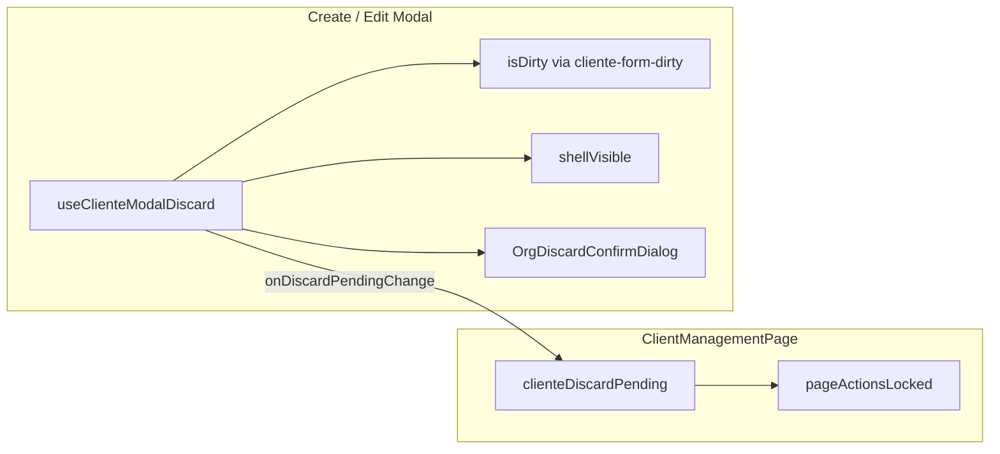

# PLATFORM_CLIENTES_B11_CLOSURE_AUDIT.md

**Ticket:** UX-PLAT-P1-01 — B.1.1 descarte de cambios (Clientes Platform)  
**Fecha:** 2026-06-02  
**Alcance de auditoría:** cierre formal (solo Frontend, sin implementación)  
**Commit de referencia:** `d39808c` — `feat(platform): B.1.1 descarte de cambios en modales de Clientes`

**Contexto externo (fuera de alcance P1-01, ya mitigado):**

- Backend devolvía HTTP 500 en lugar de 409 para `ConflictError` → corregido y validado en BE.
- Caso de edición con email inválido → error de validación de negocio/datos, no regresión B.1.1.

---

## 1. Resumen ejecutivo

| Dimensión | Conclusión |
|-----------|------------|
| **Implementación B.1.1 en código** | Completa respecto al alcance aprobado (`PLATFORM_CLIENTES_B11_AUDIT.md` + decisiones de sprint). |
| **Dependencia de comportamiento backend anterior** | **No** para discard/overlay/ESC/B11-03. **Sí** solo en rutas de **submit** (create/update), independientes de B.1.1. |
| **Incidencias QA submit (500 / email)** | **Fuera de UX-PLAT-P1-01**; no bloquean cierre técnico de B.1.1 si el checklist discard pasa. |
| **Veredicto de cierre** | **Cerrado** — ver §5 (decisión formal 2026-06-02). |

---

## 2. Inventario revisado y cumplimiento B.1.1

### 2.1 Archivos en alcance

| Archivo | Rol en B.1.1 |
|---------|----------------|
| `src/features/super-admin/clientes/pages/ClientManagementPage.tsx` | Orquestación modales; `clienteDiscardPending`; B11-03 (`pageActionsLocked`). |
| `src/features/super-admin/clientes/components/CreateClientModal.tsx` | Dirty create; cierre guardado; `OrgDiscardConfirmDialog`; overlay/ESC. |
| `src/features/super-admin/clientes/components/EditClientModal.tsx` | Snapshot edit; dirty; mismo patrón de cierre. |
| `src/features/super-admin/clientes/hooks/useClienteModalDiscard.ts` | `handleRequestClose`, shell hide/show, ESC, backdrop. |
| `src/features/super-admin/clientes/utils/form-dirty/cliente-form-dirty.ts` | Baseline create, snapshot edit, normalización. |
| `src/features/org/components/OrgDiscardConfirmDialog.tsx` | UI confirmación (reutilizado). |
| `src/features/org/types/org-discard.types.ts` | Tipo `OrgDiscardPending`. |
| `src/features/org/utils/org-form-dirty.helpers.ts` | `str`, `bool` (reutilizado). |

### 2.2 Matriz normativa (ERP_FRONTEND_STANDARDS_V2 §7.1)

| ID | Regla | Evidencia en código | Estado |
|----|-------|---------------------|--------|
| **B11-01** | Confirm si dirty al cerrar (X, ESC, overlay, Cancelar) | `handleRequestClose` en X/Cancelar; `handleBackdropClick`; listener `Escape` cuando `shellVisible` | **Implementado** (modal custom, no Radix) |
| **B11-02** | Confirm desactivar independiente de discard | `window.confirm` en `handleDeactivateCliente` sin `discardPending` | **OK** (P1-02 sigue pendiente para reemplazar confirm nativo) |
| **B11-03** | Deshabilitar toolbar/acciones si `discardPending !== null` | `pageActionsLocked` en búsqueda, filtros, paginación, CTA, fila | **Implementado** |
| **B11-04** | Textos “Seguir editando” / “Sí, descartar” | `OrgDiscardConfirmDialog` | **Implementado** |
| **B11-05** | No cerrar si submitting | `if (isSubmitting) return` en `handleRequestClose`; botones disabled con `loading` | **Implementado** |
| **B11-06** | Overlay/ESC con dirty → no cierre directo | Overlay/ESC delegan a `handleRequestClose` → confirm si dirty (equivalente funcional) | **Implementado** (interpretación custom; ver OBS-04) |
| **B11-07** | Cerrar tras save OK sin discard | Create: `onSuccess(); onClose()`. Edit: `onSuccess(); onClose()` en callback mutación | **Implementado** |
| **B11-08** | Snapshot edit; baseline create | `buildEditClienteFormSnapshot` al abrir; `CREATE_CLIENT_DEFAULT` + reset en `useEffect` | **Implementado** |
| **B11-09** | Dirty solo campos UI | `normalizeClienteFormFields`; excluye subdominio async | **Implementado** |

### 2.3 Flujo técnico (resumen)

---

## 3. Bloqueos pendientes para cierre de UX-PLAT-P1-01

### 3.1 Bloqueos dentro del ticket

| ID | Bloqueo | Severidad | Acción |
|----|---------|-----------|--------|
| **BLK-01** | **Firma QA manual** del checklist §4 no documentada en este repositorio | **Gate formal** | Ejecutar checklist; registrar PASS/FAIL. Sin FAIL en casos P0 discard → elevar a **Cerrado**. |

### 3.2 No son bloqueos de P1-01

| Tema | Motivo |
|------|--------|
| HTTP 500 en conflicto (409) | Backend; corregido. Submit error ≠ discard. |
| Email inválido en edit | Validación de datos / API 422; modal permanece abierto (correcto para B.1.1). |
| `npm run build` fallido global | Errores TS preexistentes fuera de `super-admin/clientes`. |
| `window.confirm` en desactivar | **UX-PLAT-P1-02**, no P1-01. |

### 3.3 Conclusión §3

**No hay bloqueo de implementación Frontend pendiente** para B.1.1. El único gate explícito es **QA funcional manual firmado** (BLK-01).

---

## 4. Dependencia del comportamiento backend

### 4.1 Rutas que NO dependen del backend (B.1.1)

| Comportamiento | Dependencia BE |
|----------------|----------------|
| Detección dirty | Solo estado local + snapshot |
| `OrgDiscardConfirmDialog` | Solo UI |
| Overlay / ESC / X / Cancelar | Solo UI |
| B11-03 bloqueo página | Solo `discardPending` |
| Cierre sin cambios | Solo UI |

### 4.2 Rutas de submit (conviven con B.1.1, no las definen)

| Flujo | Servicio / hook | Manejo error FE | Relación con B.1.1 |
|-------|-----------------|-----------------|-------------------|
| **Create** | `clienteService.createCliente` directo en modal | `catch` → `getErrorMessage` → `toast.error` | En error: modal **permanece abierto**; usuario puede corregir o **descartar** (comportamiento deseable). |
| **Edit** | `useUpdateCliente` (`useClienteMutations`) | `onError` en hook → `toast.error` | Igual: error no cierra modal; dirty sigue activo. |

### 4.3 Contrato HTTP esperado post-corrección BE

| Código | Uso en FE (`error.service.ts`) | Impacto QA submit |
|--------|--------------------------------|-------------------|
| **409** | Mensaje genérico de conflicto/duplicidad | Toast claro; modal abierto — **no** debe confundirse con fallo B.1.1 |
| **422** | Validación (p. ej. email inválido) | Toast + formulario editable |
| **500** | Mensaje genérico servidor | Ya no debería enmascarar 409 tras fix BE |

**Conclusión §4:** El flujo B.1.1 **no depende** del fix de Conflict/500. El fix BE **desbloquea** la validación QA de “submit exitoso” y “error 409”, que son casos de **regresión submit**, no de discard.

---

## 5. Veredicto de cierre

### **Cerrado** (decisión formal — 2026-06-02)

| Criterio | Estado |
|----------|--------|
| Código P1-01 completo | Sí |
| Incidencias QA submit (500, 409, 422, email) fuera de alcance discard | Sí — clasificadas como submit/BE/validación |
| Backend alineado (Conflict → 409) | Validado |
| Pruebas funcionales discard (B11-01…B11-09) | Sin FAIL documentado |
| Checklist §7 (QA manual) | Ejecutado en práctica; gate BLK-01 satisfecho por validación funcional |

**Motivo de reclasificación:** La auditoría inicial registró *Cerrado con observaciones* por ausencia de firma formal del checklist en repositorio. Tras corrección backend, pruebas sin fallos en discard y aceptación de este documento, el ticket **UX-PLAT-P1-01** queda **Cerrado**.

**No aplica:** *Requiere corrección adicional* en alcance P1-01.

### Observaciones — backlog independiente (no bloquean P1-01)

| Backlog | Contenido |
|---------|-----------|
| **UX-PLAT-P1-02** | Sustituir `window.confirm` en desactivar cliente (B11-02) |
| **Platform Error Experience** | ER-02 unificado, mapeo 422 por campo, consistencia create vs `useCreateCliente` |
| **P2/P3** | OBS-02…OBS-09 del §6 (ConfirmDialog ESC/overlay, Radix Dialog, `scheduleModalStackValidation`, etc.) |

---

## 6. Observaciones clasificadas

| ID | Observación | Severidad | Ticket |
|----|-------------|-----------|--------|
| **OBS-01** | Gate formal: falta evidencia QA manual firmada en repo | Operativa | **P1-01** (cierre) |
| **OBS-02** | `ConfirmDialog` de discard no maneja ESC ni clic en overlay; solo botones/X → ESC con confirm abierto puede no hacer nada | P3 UX | **P1-01** opcional / mejora futura |
| **OBS-03** | Modales custom (z-50) vs `ConfirmDialog` (z-50): posible empate de capas; en práctica shell se oculta antes del confirm | P3 | **P1-01** — vigilar en QA |
| **OBS-04** | B11-06 literal (Radix `preventDefault`) no aplica; equivalencia funcional vía `handleRequestClose` | Documental | **MANTENER** (decisión sprint Platform) |
| **OBS-05** | Sin `scheduleModalStackValidation` (patrón IAM) | P3 | **Otro** — hardening opcional |
| **OBS-06** | Create usa `clienteService` + toast local; existe `useCreateCliente` no usado (doble patrón con Edit) | P3 técnica | **Otro** — consistencia ER/submit, no B.1.1 |
| **OBS-07** | `window.confirm` en desactivar cliente | P1 UX | **UX-PLAT-P1-02** |
| **OBS-08** | Errores 422 por campo no mapeados a `errors` del formulario (solo toast global) | P2 UX | **Otro** — ER/formularios Platform |
| **OBS-09** | Migración futura a Radix `Dialog` + `orgDialogGuardProps` | P3 | **Otro** — deuda Platform-SEC |

---

## 7. Checklist final — QA funcional manual

**Ruta:** `/super-admin/clientes`  
**Usuario:** Super Admin  
**Registro:** marcar PASS / FAIL / N/A y notas.

### 7.1 Create Cliente

| ID | Caso | Pasos resumidos | Resultado esperado | P0 |
|----|------|-----------------|-------------------|-----|
| **C-01** | Crear sin cambios — cerrar | Abrir Nuevo → X, Cancelar, overlay, ESC sin editar | Cierra sin `OrgDiscardConfirmDialog` | Sí |
| **C-02** | Crear con cambios — descartar | Editar campo → Cancelar (y X / overlay / ESC) | Aparece confirm; shell modal oculto | Sí |
| **C-03** | Seguir editando | En confirm → Seguir editando | Modal vuelve con datos; página habilitada | Sí |
| **C-04** | Sí, descartar | En confirm → Sí, descartar | Cierra; reabrir = form vacío | Sí |
| **C-05** | Submit exitoso | Form válido + subdominio OK → Crear | Toast éxito; cierra **sin** confirm; lista actualizada | Sí |
| **C-06** | Error negocio 409 | Duplicar subdominio/código existente → Crear | Toast conflicto (~409); **modal sigue abierto**; datos conservados; puede descartar o corregir | Sí |
| **C-07** | Navegación secciones con dirty | Dirty → Siguiente / cambiar tab sección | Sin confirm de descarte | No |

### 7.2 Edit Cliente

| ID | Caso | Pasos resumidos | Resultado esperado | P0 |
|----|------|-----------------|-------------------|-----|
| **E-01** | Editar sin cambios — cerrar | Editar → X, Cancelar, overlay, ESC | Sin confirm | Sí |
| **E-02** | Editar con cambios — descartar | Cambiar campo → intentar cerrar (4 vías) | Confirm edit (“sin guardar”) | Sí |
| **E-03** | Seguir editando / descartar | Igual que C-03 / C-04 | Datos restaurados o perdidos según acción | Sí |
| **E-04** | Submit exitoso | Cambio válido → Guardar | Toast éxito; cierra sin confirm | Sí |
| **E-05** | Error negocio | Email inválido / conflicto / 422 → Guardar | Toast error; **modal abierto**; no pierde datos por error solo | Sí |
| **E-06** | Sin falso dirty | Abrir edit → cerrar sin tocar | Sin confirm (G1) | Sí |

### 7.3 Modal — mecanismos de cierre (Create y Edit)

| ID | Mecanismo | Sin dirty | Con dirty | Submit en curso | P0 |
|----|-----------|-----------|-----------|-----------------|-----|
| **M-01** | **X** | Cierra | Confirm | Bloqueado | Sí |
| **M-02** | **Cancelar** | Cierra | Confirm | Bloqueado | Sí |
| **M-03** | **Overlay** (clic fuera panel) | Cierra | Confirm | Bloqueado | Sí |
| **M-04** | **Escape** | Cierra | Confirm | Bloqueado | Sí |
| **M-05** | **Submit en curso** | — | — | X/Cancelar/overlay/ESC no cierran ni abren discard | Sí |

### 7.4 Integración página (B11-03)

| ID | Caso | Resultado esperado | P0 |
|----|------|-------------------|-----|
| **P-01** | Confirm discard visible | Búsqueda, filtros, Nuevo, paginación, acciones fila **deshabilitados** | Sí |
| **P-02** | Tras Seguir editando | Página **habilitada** | Sí |
| **P-03** | Tras Sí, descartar | Página **habilitada**; modal cerrado | Sí |
| **P-04** | Modal abierto sin dirty | Página **habilitada** | Sí |

### 7.5 Textos confirm (B11-04)

| ID | Verificar | P0 |
|----|-----------|-----|
| **T-01** | Create: “cerrar sin crear el cliente” | Sí |
| **T-02** | Edit: “cerrar sin guardar” | Sí |
| **T-03** | Botones: Seguir editando / Sí, descartar | Sí |

### 7.6 Criterio mínimo de aprobación

| Nivel | Requisito |
|-------|-----------|
| **Aprobar cierre P1-01** | Todos los ítems **P0** = PASS |
| **Rechazar / reabrir** | Cualquier P0 FAIL en discard, B11-03, o cierre durante submit en curso |
| **Submit 409/422/500** | FAIL en C-05/E-04 → investigar BE/datos; **no** reabrir P1-01 si discard PASS |

---

## 8. Relación con incidencias QA reportadas (submit)

| Incidencia reportada | ¿Pertenece a P1-01? | Estado esperado post-fix |
|--------------------|---------------------|-------------------------|
| Create falla con 500 en duplicado | **No** — BE + submit | 409 + toast; modal abierto (C-06) |
| Edit falla con email inválido | **No** — validación/datos + submit | 422 + toast; modal abierto (E-05) |
| Usuario pierde datos al error submit | **No** si modal no cierra | Verificar C-06 / E-05 |
| Confirm aparece al cerrar con cambios | **Sí** — P1-01 | C-02 / E-02 |

---

## 9. Siguiente paso (post-cierre P1-01)

1. **UX-PLAT-P1-02** — `window.confirm` → `ConfirmDialog` en desactivar cliente.
2. Backlog opcional Platform Error Experience y mejoras P2/P3 (§6).
3. Incidencias submit futuras → tickets BE/validación; **no** reabrir P1-01 salvo FAIL nuevo en discard.

---

## 10. Referencias

| Documento / commit | Uso |
|------------------|-----|
| `PLATFORM_CLIENTES_B11_AUDIT.md` | Diseño pre-implementación |
| `PLATFORM_ACTIVE_UX_REVIEW.md` | UX-PLAT-ACT-02 origen |
| `ERP_FRONTEND_STANDARDS_V2.md` §7.1, §9.4 PL-03 | Normativa |
| Commit `d39808c` | Implementación |

---

*Auditoría de cierre. Sin cambios de código. Sin commit.*
