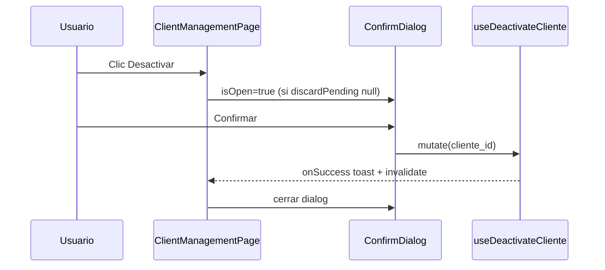

# PLATFORM_CLIENTES_CONFIRM_DIALOG_AUDIT.md

**Ticket:** UX-PLAT-P1-02 — Sustituir `window.confirm` por `ConfirmDialog` en Clientes Platform  
**Fecha:** 2026-06-02  
**Alcance de auditoría:** exclusivamente Frontend, sin implementación  
**Referencias:** `PLATFORM_ACTIVE_UX_REVIEW.md` (UX-PLAT-ACT-01), `PLATFORM_CLIENTES_B11_CLOSURE_AUDIT.md`, commit `d39808c` (P1-01 cerrado)

**Archivos en foco (solicitud):**

- `ClientManagementPage`
- `CreateClientModal`
- `EditClientModal`
- Acciones activar / desactivar cliente

---

## 1. Resumen ejecutivo

| Pregunta | Respuesta |
|----------|-----------|
| **¿UX-PLAT-P1-02 sigue vigente?** | **Sí.** El hallazgo original no fue absorbido por P1-01 ni por catálogos P1-03. |
| **¿Qué quedó pendiente?** | Un único `window.confirm` en **desactivar** en `ClientManagementPage`. |
| **¿Create/Edit requieren cambios para P1-02?** | **No** para activar/desactivar de listado; solo usan `OrgDiscardConfirmDialog` (B.1.1, ticket cerrado). |
| **Patrón objetivo** | `ConfirmDialog` de `@/shared/components/ui/ConfirmDialog`, alineado a **Catálogos globales** e **INV** (desactivar/reactivar con `loading`). |
| **Complejidad** | **Baja** — cambio acotado a `ClientManagementPage` si se mantiene alcance estricto. |
| **Veredicto del ticket** | **Proceder con implementación** en alcance definido §6. |

---

## 2. Inventario — confirmaciones en alcance solicitado

### 2.1 `ClientManagementPage.tsx`

| Acción UI | Handler | Confirmación actual | Endpoint / mutación |
|-----------|---------|-------------------|---------------------|
| **Desactivar** (fila, `es_activo === true`) | `handleDeactivateCliente` | **`window.confirm`** (nativo) | `useDeactivateCliente` → `DELETE /clientes/{id}/` |
| **Activar** (fila, `es_activo === false`) | `handleActivateCliente` | **Ninguna** — mutación directa | `useActivateCliente` → `PUT /clientes/{id}/activar/` |
| Nuevo cliente | `openCreateModal` | N/A | Abre `CreateClientModal` |
| Editar | `openEditModal` | N/A | Abre `EditClientModal` |

**Evidencia (desactivar):**

```typescript
// ClientManagementPage.tsx — línea ~126
if (!window.confirm(`¿Estás seguro de desactivar al cliente ${cliente.nombre_comercial || cliente.razon_social}?`)) {
  return;
}
deactivateMutation.mutate(cliente.cliente_id);
```

**Evidencia (activar):**

```typescript
const handleActivateCliente = (cliente: Cliente) => {
  if (pageActionsLocked) return;
  activateMutation.mutate(cliente.cliente_id);
};
```

**Otros en la misma página:**

| Elemento | Tipo | Relación P1-02 |
|----------|------|----------------|
| `OrgDiscardConfirmDialog` (vía modales hijos) | Discard B.1.1 | **No** — P1-01 cerrado; independiente (B11-02) |
| `clienteDiscardPending` / `pageActionsLocked` | Bloqueo página | Compatible con futuro `ConfirmDialog` de negocio |

---

### 2.2 `CreateClientModal.tsx`

| Mecanismo | Propósito | ¿P1-02? |
|-----------|-----------|---------|
| `OrgDiscardConfirmDialog` | Descarte de cambios al cerrar formulario | **No** — B.1.1 (P1-01) |
| `useClienteModalDiscard` | Overlay, ESC, X, Cancelar con dirty | **No** |
| `window.confirm` / `confirm()` | — | **No encontrado** |
| Activar/desactivar tenant | — | **No existe** en este modal |

**Conclusión:** Sin trabajo P1-02 en Create.

---

### 2.3 `EditClientModal.tsx`

| Mecanismo | Propósito | ¿P1-02? |
|-----------|-----------|---------|
| `OrgDiscardConfirmDialog` | Descarte de cambios | **No** — P1-01 |
| Checkbox **`es_activo`** (sección Suscripción) | Cambio vía **Guardar** → `ClienteUpdate` | **No** es la acción de listado “Activar” |
| `window.confirm` | — | **No encontrado** |
| `PUT .../activar/` | — | **No** — solo en listado |

**Conclusión:** Sin trabajo P1-02 en Edit para confirm de fila. El toggle `es_activo` en formulario es otro flujo (guardar edición).

---

### 2.4 Resumen inventario (alcance estricto)

| Patrón | Ubicación | Cantidad |
|--------|-----------|----------|
| **`window.confirm`** | `ClientManagementPage` — solo desactivar | **1** |
| **Confirmación nativa otra** | Create / Edit | **0** |
| **`ConfirmDialog` negocio** (activar/desactivar listado) | Clientes listado | **0** |
| **`OrgDiscardConfirmDialog`** | Create / Edit | 2 (discard — **fuera de P1-02**) |

---

## 3. ¿Fue absorbido parcialmente por cambios recientes?

| Cambio reciente | ¿Absorbe P1-02? | Motivo |
|-----------------|-----------------|--------|
| **UX-PLAT-P1-03** — Catálogos `ConfirmDialog` desactivar/reactivar | **No** | Otro módulo (`catalogos/pages/*`). |
| **UX-PLAT-P1-01** — `OrgDiscardConfirmDialog` en Create/Edit | **No** | Resuelve **discard**, no desactivar tenant en tabla. Cumple B11-02 (independiente). |
| **`ClientModulesTab`** ya usa `ConfirmDialog` para desactivar módulo | **No** | Detalle cliente (`/clientes/:id`), fuera del alcance solicitado. |
| Cierre B11 en modales | **No** | No tocó `handleDeactivateCliente`. |

**Conclusión:** **UX-PLAT-P1-02 permanece íntegramente vigente** para el listado de clientes.

---

## 4. Comparativa con referencias (Catálogos, ORG, INV)

### 4.1 Catálogos globales Platform (post P1-03)

**Referencia:** `PaisesPage.tsx` (patrón replicado en Monedas, Departamentos, Provincias, Distritos).

| Aspecto | Catálogos | Clientes (actual) |
|---------|-----------|-------------------|
| Confirm desactivar | `ConfirmDialog` `variant="danger"` | `window.confirm` |
| Confirm reactivar | `ConfirmDialog` `variant="info"` | Activar **sin** confirm |
| Estado | `activeTarget` + `activeAction` | Inline en handler |
| `loading` en confirm | `togglingActive` | No aplicable (nativo) |
| Copy | “Desactivar / Reactivar {entidad}” | “¿Estás seguro de desactivar…?” |
| `cancelText` | “Cancelar” | Botones nativos del browser |

---

### 4.2 ORG

**Referencia:** `DepartamentosPage.tsx` (Plantilla A + B.1.1).

| Aspecto | ORG | Clientes (actual) |
|---------|-----|-------------------|
| Desactivar | `ConfirmDialog` + `deleteTarget` | `window.confirm` |
| Coexistencia B.1.1 | `isOpen={!!deleteTarget && discardPending === null}` | Debe replicar guard al implementar |
| Reactivar | Botón/acción con endpoint dedicado | Activar sin confirm |
| Mutación | Hooks React Query + `isPending` en dialog | Hooks ya existen (`useActivateCliente` / `useDeactivateCliente`) |

---

### 4.3 INV

**Referencia:** `AlmacenesPage.tsx`.

| Aspecto | INV | Clientes (actual) |
|---------|-----|-------------------|
| Desactivar | `ConfirmDialog` `bajaTarget` | `window.confirm` |
| Reactivar | `ConfirmDialog` `reactivarTarget` `variant="info"` | Sin confirm |
| `loading` | `deleteMutation.isPending` / `reactivarMutation.isPending` | Posible con mutaciones actuales |
| Guard discard | `discardPending === null` en `isOpen` | Recomendado igual |

---

### 4.4 Platform Clientes — otras superficies (contexto, fuera de alcance estricto)

| Superficie | Patrón desactivar | Nota |
|------------|-------------------|------|
| `ClientModulesTab` | `ConfirmDialog` | Buena referencia **dentro del dominio Clientes** (detalle). |
| `ClientConnectionsTab` | **`window.confirm`** | Candidato **otro ticket** (conexiones). |
| `ModuleManagementPage` (módulos globales) | Toggle **sin** confirm | Inconsistencia Platform; no P1-02. |

---

## 5. Acciones afectadas y alcance de implementación

### 5.1 Alcance mínimo (UX-PLAT-P1-02 estricto — UX-PLAT-ACT-01)

| ID | Acción | Archivo | Cambio |
|----|--------|---------|--------|
| **A-01** | Desactivar cliente (listado) | `ClientManagementPage.tsx` | Reemplazar `window.confirm` por `ConfirmDialog` |

**Archivos sin cambio en alcance mínimo:**

- `CreateClientModal.tsx`
- `EditClientModal.tsx`

---

### 5.2 Alcance recomendado (paridad Catálogos / INV)

| ID | Acción | Archivo | Cambio |
|----|--------|---------|--------|
| **A-02** | Reactivar cliente (listado) | `ClientManagementPage.tsx` | Añadir `ConfirmDialog` antes de `activateMutation` (hoy sin confirm) |

**Justificación:** Catálogos e INV confirman **ambas** direcciones. Activar tenant es sensible; paridad reduce clics accidentales. **No** era texto explícito del hallazgo UX-PLAT-ACT-01 (solo desactivar), pero mejora consistencia Platform.

**Fuera de alcance P1-02 (backlog aparte):**

| ID | Acción | Archivo | Ticket sugerido |
|----|--------|---------|-----------------|
| **O-01** | Desactivar conexión BD | `ClientConnectionsTab.tsx` | Platform conexiones / P2 |
| **O-02** | `es_activo` vía Edit modal | `EditClientModal.tsx` | Flujo formulario, no listado |
| **O-03** | Toggle módulos globales sin confirm | `ModuleManagementPage.tsx` | Platform módulos P2 |

---

## 6. Patrón objetivo único (propuesta)

### 6.1 Componente y estado

```text
Import: ConfirmDialog from '@/shared/components/ui/ConfirmDialog'

Estado (opción A — como catálogos):
  activeTarget: Cliente | null
  activeAction: 'deactivate' | 'reactivate' | null

Estado (opción B — como INV):
  deactivateTarget: Cliente | null
  reactivateTarget: Cliente | null

Handlers:
  openDeactivateConfirm(cliente) → set target + action
  openReactivateConfirm(cliente)   → set target + action (si A-02)
  closeActiveConfirm()             → clear state
  handleActiveConfirm()          → mutate + clear on success
```

### 6.2 Reglas de integración (normativa + P1-01)

| Regla | Implementación |
|-------|----------------|
| **B11-02** | `ConfirmDialog` de negocio **independiente** de `OrgDiscardConfirmDialog` |
| Guard coexistencia | `isOpen={!!activeTarget && clienteDiscardPending === null}` (patrón ORG/INV) |
| **B11-03** | Opcional: bloquear página también con `activeTarget !== null` (catálogos no bloquean; INV/ORG tampoco siempre — **recomendado** extender `pageActionsLocked` si hay doble interacción) |
| **loading** | `loading={deactivateMutation.isPending}` / `activateMutation.isPending` |
| **variant** | `danger` desactivar; `info` reactivar |
| **cancelText** | `Cancelar` (negocio; distinto de “Seguir editando” del discard) |
| **confirmText** | `Desactivar` / `Reactivar` |
| **Vocabulario** | No usar “Eliminar” (alineado P1-03 / soft delete) |

### 6.3 Copy propuesto (listado)

| Acción | title | message (ejemplo) |
|--------|-------|-------------------|
| Desactivar | Desactivar cliente | `¿Desactivar el cliente "{nombre}"?` donde `nombre = nombre_comercial \|\| razon_social` |
| Reactivar (A-02) | Reactivar cliente | `¿Reactivar el cliente "{nombre}"?` |

Alinear tono con `PaisesPage` / `AlmacenesPage` (pregunta directa, sin “¿Estás seguro de…” genérico).

### 6.4 Flujo



---

## 7. Complejidad y estimación

| Bloque | Esfuerzo | Archivos |
|--------|----------|----------|
| Alcance mínimo (solo A-01) | **0.25–0.5 d** | `ClientManagementPage.tsx` |
| Alcance recomendado (A-01 + A-02) | **0.5–1 d** | `ClientManagementPage.tsx` |
| QA manual | **0.25 d** | Listado + convivencia con modal discard abierto |
| **Total recomendado** | **~1 d** | Un archivo principal |

**No requiere:** cambios en servicios, hooks de mutación, rutas, Create/Edit (alcance estricto).

---

## 8. Riesgos

| ID | Riesgo | Severidad | Mitigación |
|----|--------|-----------|------------|
| **R-01** | Doble dialog (discard + desactivar) | Media | Guard `clienteDiscardPending === null` en `isOpen` del ConfirmDialog negocio |
| **R-02** | Activar sin confirm deja asimetría | Baja UX | Incluir A-02 en mismo sprint |
| **R-03** | `pageActionsLocked` solo con discard | Baja | Considerar `pageActionsLocked \|\| activeTarget` durante confirm negocio |
| **R-04** | Mensaje nativo vs copy nuevo | Baja | Validar copy con catálogos |
| **R-05** | Confundir `OrgDiscardConfirmDialog` con confirm negocio | Media | Títulos distintos: “Descartar cambios” vs “Desactivar cliente” |
| **R-06** | Mutación en curso + doble clic confirm | Baja | `loading` + `disabled` en ConfirmDialog |
| **R-07** | Regresión P1-01 discard | Baja | QA: abrir edit dirty + intentar desactivar fila con discard pendiente |

**Riesgos descartados para P1-02:**

- Dependencia backend activate/deactivate — contrato ya usado por mutaciones actuales.
- Cambios en Create/Edit — no requeridos para listado.

---

## 9. Checklist QA propuesto (post-implementación)

| # | Caso | Esperado |
|---|------|----------|
| 1 | Desactivar → Confirm → Cancelar | No muta; dialog cierra |
| 2 | Desactivar → Confirm → Desactivar | Mutación + toast; fila pasa a inactivo |
| 3 | Reactivar (si A-02) → Confirm → Reactivar | Mutación + toast |
| 4 | Con modal create/edit dirty + discard abierto | Confirm negocio no compite / no abre encima |
| 5 | `loading` en confirm durante mutación | Botones deshabilitados |
| 6 | Sin `window.confirm` en listado | Solo `ConfirmDialog` UI sistema |
| 7 | Activar (si no A-02) | Comportamiento actual documentado |

---

## 10. Veredicto y recomendación de sprint

| Ítem | Decisión |
|------|----------|
| **UX-PLAT-P1-02** | **Vigente — implementar** |
| **Alcance commit sugerido** | `ClientManagementPage.tsx` únicamente (mínimo); **+ A-02** recomendado |
| **CreateClientModal / EditClientModal** | **Sin cambios** para este ticket |
| **Relación P1-01** | Cerrado; implementar P1-02 respetando B11-02 (dialogs independientes) |

### Criterios de done (P1-02)

- [ ] Cero `window.confirm` en `ClientManagementPage` para desactivar cliente.
- [ ] `ConfirmDialog` con `variant`, `loading`, copy Desactivar/Reactivar.
- [ ] Guard `clienteDiscardPending === null` al abrir confirm de negocio.
- [ ] QA §9 sin regresión discard (P1-01).

---

## 11. Referencias de código

| Referencia | Ruta |
|------------|------|
| Hallazgo origen | `PLATFORM_ACTIVE_UX_REVIEW.md` — UX-PLAT-ACT-01 |
| Objetivo desactivar | `src/features/super-admin/clientes/pages/ClientManagementPage.tsx` |
| Mutaciones | `src/core/hooks/useClienteMutations.ts` |
| Patrón catálogo | `src/features/super-admin/catalogos/pages/PaisesPage.tsx` |
| Patrón INV | `src/features/inv/pages/AlmacenesPage.tsx` |
| Patrón ORG | `src/features/org/pages/DepartamentosPage.tsx` |
| Patrón Clientes detalle | `src/features/super-admin/clientes/components/ClientModulesTab.tsx` |
| UI confirm | `src/shared/components/ui/ConfirmDialog.tsx` |
| B.1.1 cerrado | `PLATFORM_CLIENTES_B11_CLOSURE_AUDIT.md` |

---

*Auditoría de alcance UX-PLAT-P1-02. Sin código. Sin commit.*
