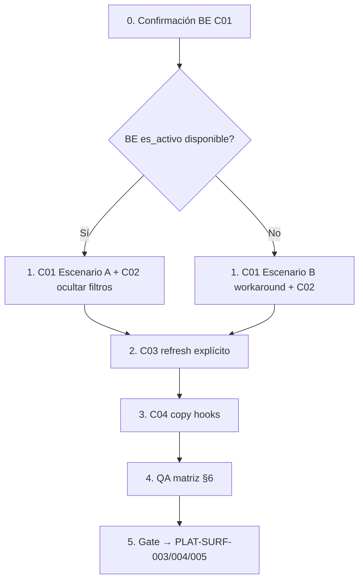

# PLATFORM_CLIENTES_P0_P1_REMEDIATION_PLAN.md

**Ticket:** Platform Clientes — remediación UX-PLAT-C01 / C02 / C03 / C04  
**Fecha:** 2026-06-02  
**Tipo:** Plan de implementación pre-código — **sin código, sin repair, sin commit**  
**Decisión previa:** Opción **D (híbrida)** aprobada en `PLATFORM_UX_CONSISTENCY_AUDIT.md`  
**Referencias:**

- `PLATFORM_UX_CONSISTENCY_AUDIT.md` — hallazgos C01–C04
- `PLATFORM_MODULES_IMPLEMENTATION_PLAN.md` — **no ejecutar** en esta fase
- `docs/backend_openapi.json` — contrato `GET /api/v1/clientes/`
- Commits base: `5639084` (ConfirmDialog), `87dcd38` (FIX-ERR propagación Axios)

**Alcance aprobado:**

| ID | Entrega |
|----|---------|
| UX-PLAT-C01 | Filtro «Inactivos» muestra **solo** clientes inactivos |
| UX-PLAT-C02 | Filtros Plan / Estado suscripción conectados o **ocultos** |
| UX-PLAT-C03 | Refresco visual post Reactivar/Desactivar sin F5 |
| UX-PLAT-C04 | Vocabulario Desactivar / Reactivar / Desactivado / Reactivado |

**Fuera de alcance:**

- PLAT-SURF-003/004/005 (Módulos)
- Convergencia visual IAM (toolbar, empty states, skeletons)
- Tabs detalle cliente (Módulos, Conexiones, Auditoría)
- Errores 422 / `getValidationErrors` (backlog ER)
- Dashboard, Auditoría Global, Catálogos

---

## 1. Resumen ejecutivo

| ID | Severidad | Causa raíz | Solución | Tipo |
|----|-----------|------------|----------|------|
| **C01** | P0 | Mapeo incorrecto `es_activo` → `solo_activos`; BE no expone «solo inactivos» | **Mixta** — BE param `es_activo` + FE remapeo; workaround FE si BE demora | **Mixta** |
| **C02** | P1 | UI envía filtros que OpenAPI **no documenta** | **Ocultar** selects Plan/Estado (FE) hasta soporte BE | **FE** |
| **C03** | P1 | Mutaciones invalidan cache sin `refetch` explícito; interacción con filtro C01 | **FE** — contrato refresh PAUX-1 | **FE** |
| **C04** | P2 | Toasts/errores en hooks usan «activar/activado» | **FE** — copy en `useClienteMutations` | **FE** |

**Veredicto:** 3 de 4 ítems son **100% Frontend**. **C01 requiere acuerdo BE** para paginación correcta en modo «Inactivos»; existe workaround FE acotado a super-admin.

**Esfuerzo estimado:** 1–2 días FE (+ 0.5–1 día BE si se opta por solución ideal C01).

---

## 2. Contrato API actual (fuente de verdad)

Extraído de `docs/backend_openapi.json` — `GET /api/v1/clientes/`:

| Query param | Tipo | Default | Descripción OpenAPI |
|-------------|------|---------|---------------------|
| `skip` | integer | 0 | Paginación |
| `limit` | integer | 100 | Máx. 1000 |
| `solo_activos` | boolean | **true** | «Filtrar solo clientes activos» |
| `buscar` | string \| null | — | Búsqueda texto |

**No documentados:** `plan_suscripcion`, `estado_suscripcion`, `es_activo`, `solo_inactivos`.

### 2.1 Semántica inferida de `solo_activos`

| Valor enviado | Comportamiento esperado BE |
|---------------|----------------------------|
| `true` (default) | Solo registros con `es_activo = true` |
| `false` | **No restringir a activos** → devuelve activos **e** inactivos |
| *(omitido)* | BE aplica default `true` → solo activos |

**Implicación:** no existe modo «solo inactivos» en el contrato actual.

---

## 3. Análisis por hallazgo

### 3.1 UX-PLAT-C01 — Filtro «Inactivos»

#### Problema observado

Usuario selecciona **Inactivos** y ve clientes activos e inactivos mezclados.

#### Causa raíz (código FE)

**UI** (`ClientManagementPage.tsx` L236–245):

```typescript
// "Inactivos" → handleFilterChange('es_activo', false)
<option value="false">Inactivos</option>
```

**Servicio** (`cliente.service.ts` L32–40):

```typescript
if (filtros.es_activo !== undefined) {
  params.append('solo_activos', filtros.es_activo.toString());
}
// es_activo: false  →  solo_activos=false  →  API devuelve TODOS
```

**Sin filtro client-side** sobre `clientes[].es_activo`.

#### Defecto adicional detectado (mismo filtro)

| Opción UI | `es_activo` state | Param enviado | Resultado real |
|-----------|-------------------|---------------|----------------|
| **Activos** | `true` | `solo_activos=true` | ✅ Solo activos |
| **Inactivos** | `false` | `solo_activos=false` | ❌ Todos mezclados |
| **Todos** | `undefined` | *(ninguno)* → BE default `true` | ❌ Solo activos (no «todos») |

El select 3-way está **roto en 2 de 3 opciones**.

#### Tipo de solución: **Mixta (BE ideal + FE obligatorio)**

##### Escenario A — Solución ideal (recomendada)

**Backend:** añadir query param opcional:

```text
es_activo: boolean | null   # true = solo activos, false = solo inactivos, omit = todos
```

O alternativa equivalente: `solo_inactivos: boolean`.

**Frontend:**

1. Introducir enum explícito en lugar de `boolean | undefined` ambiguo:

```typescript
type ClienteActiveFilter = 'active' | 'inactive' | 'all';
```

2. Mapeo servicio:

| UI | Params API (post-BE) |
|----|----------------------|
| Activos | `es_activo=true` *(o `solo_activos=true` legacy)* |
| Inactivos | `es_activo=false` |
| Todos | omitir ambos filtros de activo |

3. Incluir `activeFilter` en `queryKey` de React Query.

**Confirmación:** **Mixta** — BE define semántica; FE remapea UI y servicio.

##### Escenario B — Workaround FE-only (si BE no disponible en el sprint)

1. **Activos:** `solo_activos=true` — sin cambio.
2. **Todos:** enviar explícitamente `solo_activos=false`.
3. **Inactivos:**
   - Request `solo_activos=false` con `limit` elevado (p. ej. 1000, máx. OpenAPI).
   - Filtrar en FE: `clientes.filter(c => !c.es_activo)`.
   - Paginar **en memoria** sobre el subconjunto filtrado (`slice` por página).

**Limitaciones workaround:**

| Riesgo | Impacto |
|--------|---------|
| >1000 clientes totales | Inactivos incompletos |
| Doble carga red | Aceptable en super-admin |
| `total_clientes` del BE incorrecto para UI | Recalcular `total` local en modo inactive |
| Dos fuentes de verdad paginación | Solo aplica en modo inactive/all |

**Confirmación workaround:** **FE-only**, válido como **interim** si volumen super-admin es bajo (decisión producto).

##### Escenario C — No recomendado

Filtrar client-side **solo la página actual** (10 ítems) sin refetch global → paginación incoherente y filas activas residuales.

#### Archivos a modificar (implementación futura)

| Archivo | Cambio |
|---------|--------|
| `cliente.types.ts` | `ClienteActiveFilter` o extender `ClienteFilters` |
| `cliente.service.ts` | Mapeo params API correcto |
| `ClientManagementPage.tsx` | Select → enum; opcional paginación client-side (escenario B) |
| `useClientes.ts` | `queryKey` incluye filtro activo normalizado |
| `docs/backend_openapi.json` | Actualizar cuando BE entregue param *(repo FE)* |

#### QA esperado C01

| Caso | Resultado |
|------|-----------|
| Activos | 0 filas con badge Inactivo |
| Inactivos | 0 filas con badge Activo |
| Todos | Mezcla coherente; conteo = activos + inactivos |
| Inactivos + búsqueda | Intersección correcta |
| Paginación en Inactivos | Totales/páginas coherentes (escenario A o B) |
| Reactivar estando en Inactivos | Fila desaparece tras refresh (depende C03) |

---

### 3.2 UX-PLAT-C02 — Filtros Plan y Estado suscripción

#### Problema observado

Selects visibles en toolbar sin efecto en la lista.

#### Causa raíz

**UI** (`ClientManagementPage.tsx` L211–234): actualiza `filters.plan_suscripcion` y `filters.estado_suscripcion`.

**Servicio** (`cliente.service.ts` L32–38): **solo** envía `solo_activos` y `buscar`.

**OpenAPI** `GET /api/v1/clientes/`: **no** incluye esos params.

#### Tipo de solución: **FE (ocultar)**

No hay evidencia en OpenAPI ni en servicio de soporte BE. **No conectar** sin contrato.

#### Acción propuesta

1. **Remover** (o comentar con flag) los dos `<select>` de Plan y Estado en toolbar.
2. **Mantener** tipos `ClienteFilters` — preparados para futuro wire-up.
3. **Documentar** en comentario de servicio / tipos: «pendiente BE».

#### Alternativa descartada

Enviar params no documentados «por si acaso» — riesgo de silencio (BE los ignora) igual que hoy, sin beneficio.

#### Escenario futuro (fuera de este ticket)

Si BE añade `plan_suscripcion` y `estado_suscripcion` a OpenAPI:

1. Wire-up en `cliente.service.ts`.
2. Re-exponer selects.
3. Añadir a `queryKey`.

#### Archivos a modificar

| Archivo | Cambio |
|---------|--------|
| `ClientManagementPage.tsx` | Eliminar selects Plan/Estado del JSX |
| *(opcional)* `cliente.types.ts` | Comentario `@deprecated UI` en campos hasta BE |

#### QA esperado C02

| Caso | Resultado |
|------|-----------|
| Toolbar | No aparecen selects Plan/Estado |
| Regresión búsqueda / filtro activo | Sin cambios adversos |
| Layout toolbar | Sin huecos rotos (flex-wrap OK) |

#### Riesgos

| Riesgo | Mitigación |
|--------|------------|
| Usuario usaba filtros creyendo que funcionaban | Comportamiento mejora (menos confusión) |
| BE ya soporta params no documentados en OpenAPI | Verificar con equipo BE antes de ocultar; si soportados, cambiar plan a wire-up |

**Acción pre-implementación:** confirmación BE explícita (1 mensaje / ticket) — si responden que ya filtran, pivotar a wire-up en lugar de ocultar.

---

### 3.3 UX-PLAT-C03 — Refresco post-mutación

#### Problema observado

Tras Reactivar/Desactivar, badge y botones de fila no siempre reflejan el nuevo estado sin F5.

#### Causa raíz

**Handler página** (`ClientManagementPage.tsx` L138–145):

```typescript
const onSuccess = () => closeActiveConfirm();
// Sin refetch()
```

**Hooks** (`useClienteMutations.ts` L69–73, L91–94):

```typescript
onSuccess: () => {
  queryClient.invalidateQueries({ queryKey: ['clientes', tenantId] });
  toast.success('...');
},
```

**Query** (`useClientes.ts` L39–44):

```typescript
queryKey: ['clientes', tenantId, pagina, limite, filtros],
staleTime: 2 * 60 * 1000,
```

#### Análisis técnico React Query v5

| Factor | Efecto |
|--------|--------|
| `invalidateQueries` con prefijo `['clientes', tenantId]` | Debe invalidar queries activas que extienden la key ✅ |
| `staleTime: 2min` | **No debería** bloquear refetch post-invalidate en queries activas |
| Falta `await refetch()` en página | UX depende de timing async; usuario puede percibir lag |
| Bug C01 (filtro Inactivos) | Tras reactivar, fila **debería** salir de vista Inactivos — si filtro roto, parece «no refrescó» |
| `deactivateMutation` retorna `{ message }` | Sin update optimista de cache |

**Conclusión:** C03 es **primariamente FE**; parte del síntoma es **efecto colateral de C01**.

#### Tipo de solución: **FE**

##### Cambios propuestos (capas)

**Capa 1 — Página (obligatoria, PAUX-1):**

```typescript
const handleActiveConfirm = async () => {
  ...
  const onSuccess = async () => {
    closeActiveConfirm();
    await refetch();
  };
  ...
};
```

Exponer `refetch` desde `useClientes` (ya disponible L66).

**Capa 2 — Hook (recomendada):**

En `useActivateCliente` / `useDeactivateCliente`:

```typescript
onSuccess: async () => {
  await queryClient.invalidateQueries({
    queryKey: ['clientes', tenantId],
    refetchType: 'active',
  });
},
```

**Capa 3 — Query config (opcional, reforzar):**

- Reducir `staleTime` a `0` o `30_000` para listado super-admin **o**
- Añadir opción `staleTime` en `useClientes` usada solo desde `ClientManagementPage`.

**Capa 4 — Optimistic update (opcional, no P0):**

`queryClient.setQueryData` para togglear `es_activo` del row afectado — mejora percepción instantánea; añade complejidad con paginación/filtros.

##### Orden de implementación interno C03

1. `await refetch()` en `handleActiveConfirm` onSuccess.
2. Ajustar `invalidateQueries` en hooks (async await).
3. Evaluar `staleTime` tras QA — solo si persiste lag.
4. Optimistic update — **defer** salvo necesidad.

#### Archivos a modificar

| Archivo | Cambio |
|---------|--------|
| `ClientManagementPage.tsx` | `await refetch()` post-mutación toggle |
| `useClienteMutations.ts` | `invalidateQueries` async; aplicar mismo patrón a create/update si se desea consistencia |
| `useClientes.ts` | *(opcional)* `staleTime` configurable / reducido |

#### QA esperado C03

| Caso | Resultado |
|------|-----------|
| Desactivar cliente activo | Badge → Inactivo; icono → Reactivar; **<1s** |
| Reactivar cliente inactivo | Badge → Activo; icono → Desactivar |
| Vista Activos + desactivar | Fila desaparece de lista |
| Vista Inactivos + reactivar | Fila desaparece (requiere C01 correcto) |
| Confirm loading | Botones disabled; no doble submit |
| Sin F5 | Ningún caso requiere reload manual |

#### Riesgos C03

| Riesgo | Sev. | Mitigación |
|--------|------|------------|
| C01 sin fix → reactivar en Inactivos deja fila | Alta | Implementar C01 antes o junto a C03 |
| Doble fetch (invalidate + refetch) | Baja | Aceptable; o solo refetch si invalidate redundante |
| Race si usuario cambia página durante refetch | Baja | React Query cancela/refetch con key actual |

---

### 3.4 UX-PLAT-C04 — Vocabulario Desactivar / Reactivar

#### Problema observado

UI de listado ya usa Reactivar/Desactivar (P1-02), pero **toasts y errores** en hooks conservan «activar/activado».

#### Inventario de copy (alcance listado + hooks)

| Ubicación | Texto actual | Texto objetivo | Estado UI |
|-----------|--------------|----------------|-----------|
| `ClientManagementPage` tooltip Desactivar | Desactivar | Desactivar | ✅ |
| `ClientManagementPage` tooltip Reactivar | Reactivar | Reactivar | ✅ |
| `ConfirmDialog` title/confirmText | Reactivar / Desactivar | — | ✅ |
| `useActivateCliente` toast success | «Cliente **activado** exitosamente» | «Cliente **reactivado** exitosamente» | ❌ |
| `useActivateCliente` toast error | «Error al **activar** el cliente» | «Error al **reactivar** el cliente» | ❌ |
| `useDeactivateCliente` toast success | «Cliente **desactivado** exitosamente» | — | ✅ |
| `useDeactivateCliente` toast error | «Error al desactivar…» | — | ✅ |
| `cliente.service.ts` endpoint | `PUT …/activar/` | *(sin cambio — contrato API)* | N/A |
| `cliente.service.ts` deactivate message fallback | «desactivado» | — | ✅ |

#### Fuera de alcance C04 (explicit)

| Ubicación | Motivo |
|-----------|--------|
| `ClientModulesTab` — «Activar Módulo» | Tab detalle; acción distinta (alta módulo, no soft-delete tenant) |
| `ClientConnectionsTab` | Fuera alcance ticket |
| Endpoint `/activar/` | Nombre técnico BE — no visible al usuario |

#### Tipo de solución: **FE**

Cambio de strings en `useClienteMutations.ts` (2 líneas activate success/error).

**Opcional coherencia:** revisar `EditClientModal` checkbox `es_activo` — si label dice «Activo», es estado booleano OK; no confundir con acción «Activar cliente».

#### Archivos a modificar

| Archivo | Cambio |
|---------|--------|
| `useClienteMutations.ts` | Copy reactivar en success/error de `useActivateCliente` |

#### QA esperado C04

| Caso | Resultado |
|------|-----------|
| Reactivar → toast | «Cliente reactivado exitosamente» |
| Error reactivar | «Error al reactivar el cliente» |
| Desactivar → toast | «Cliente desactivado exitosamente» (sin regresión) |
| Grep en alcance | 0 ocurrencias user-facing «activar cliente» / «activado exitosamente» en listado+hooks |

---

## 4. Matriz de riesgos consolidada

| ID | Riesgo | Prob. | Impacto | Mitigación |
|----|--------|-------|---------|------------|
| **R-C01-01** | BE no entrega `es_activo` a tiempo | Media | Paginación incorrecta en Inactivos | Workaround escenario B + ticket BE |
| **R-C01-02** | Workaround B con >1000 clientes | Baja | Inactivos incompletos | Monitorear; migrar a escenario A |
| **R-C01-03** | «Todos» sigue roto si no se envía `solo_activos=false` | Alta | Confusión | Incluir fix «Todos» en mismo PR C01 |
| **R-C02-01** | BE ya soportaba filtros no documentados | Baja | Ocultamos UI innecesariamente | Confirmación BE pre-merge |
| **R-C03-01** | Síntoma persiste por C01 | Alta | Falso negativo QA C03 | Orden: C01 → C03 |
| **R-C03-02** | Doble refetch performance | Baja | Latencia +100–300ms | Medir; consolidar invalidate/refetch |
| **R-C04-01** | Copy «activar» en otros tabs | Baja | Inconsistencia residual | Documentar fuera alcance |

---

## 5. Plan de implementación

### 5.1 Orden recomendado



| Paso | IDs | Entrega | Depende de | Esfuerzo |
|------|-----|---------|------------|----------|
| **0** | C01 | Confirmar con BE: ¿existe o planean `es_activo` / `solo_inactivos`? | — | 0.5 h |
| **1a** | C01, C02 | Filtro activo corregido (A o B) + ocultar Plan/Estado | Paso 0 | 3–5 h |
| **2** | C03 | `await refetch()` + invalidate async | Paso 1 | 1–2 h |
| **3** | C04 | Copy hooks reactivar | — | 0.5 h |
| **4** | — | QA manual §6 | 1–3 | 2–3 h |
| **5** | — | Actualizar OpenAPI doc si BE cambió | BE | 0.5 h |

**Total FE:** ~1–1.5 días (+ BE 0.5–1 d si escenario A).

### 5.2 Archivos tocados (resumen)

| Archivo | C01 | C02 | C03 | C04 |
|---------|-----|-----|-----|-----|
| `ClientManagementPage.tsx` | ✓ | ✓ | ✓ | — |
| `cliente.service.ts` | ✓ | — | — | — |
| `cliente.types.ts` | ✓ | ○ | — | — |
| `useClientes.ts` | ○ | — | ○ | — |
| `useClienteMutations.ts` | — | — | ✓ | ✓ |
| `docs/backend_openapi.json` | ○ | — | — | — |

○ = opcional

### 5.3 Definition of Done

- [ ] «Inactivos» lista solo clientes con `es_activo === false`
- [ ] «Todos» lista activos e inactivos (no default oculto)
- [ ] «Activos» sin regresión
- [ ] Sin selects Plan/Estado **o** conectados si BE confirma soporte
- [ ] Toggle Reactivar/Desactivar actualiza fila sin F5
- [ ] Toasts usan reactivado/desactivado
- [ ] QA §6 P0 completo
- [ ] Sin cambios en Módulos ni convergencia IAM

### 5.4 Commit sugerido (post-implementación)

```
fix(platform): corregir filtros y refresh en gestión de Clientes

UX-PLAT-C01/C02/C03/C04: filtro inactivos, ocultar filtros sin API,
refetch post toggle, vocabulario reactivar/desactivar.
```

---

## 6. Matriz QA manual

| ID | Caso | P0 |
|----|------|-----|
| **Q-C01-01** | Filtro Activos — solo badges Activo | Sí |
| **Q-C01-02** | Filtro Inactivos — solo badges Inactivo | Sí |
| **Q-C01-03** | Filtro Todos — mezcla presente | Sí |
| **Q-C01-04** | Inactivos + buscar — intersección | Sí |
| **Q-C01-05** | Paginación coherente en Inactivos | Sí |
| **Q-C02-01** | No hay selects Plan/Estado (o funcionan si wired) | Sí |
| **Q-C03-01** | Desactivar — badge cambia sin F5 | Sí |
| **Q-C03-02** | Reactivar — badge cambia sin F5 | Sí |
| **Q-C03-03** | Activos + desactivar — fila sale | Sí |
| **Q-C03-04** | Inactivos + reactivar — fila sale | Sí |
| **Q-C04-01** | Toast «reactivado» | Sí |
| **Q-C04-02** | Toast «desactivado» | Sí |
| **Q-C04-03** | Sin «activado exitosamente» en flujo listado | Sí |

---

## 7. Gate hacia PLAT-SURF-003/004/005

**Criterio de salida:** todos los QA **P0** de §6 en PASS.

Tras cerrar este ticket:

1. Ejecutar `PLATFORM_MODULES_IMPLEMENTATION_PLAN.md` (ConfirmDialog + B11 Módulos).
2. Opcional mismo sprint: renombrar checkbox Módulos «Solo activos» → «Ver inactivos» (UX-PLAT-M03) — independiente de este plan.

---

## 8. Decisión requerida antes de codificar

| # | Pregunta | Opciones | Recomendación |
|---|----------|----------|---------------|
| **D1** | ¿BE puede añadir `es_activo` a `GET /clientes/`? | A) Sí → escenario A / B) No → escenario B | **A** si plazo ≤1 semana |
| **D2** | ¿Ocultar Plan/Estado o verificar soporte oculto BE? | Ocultar / Wire-up | **Ocultar** salvo respuesta BE positiva |
| **D3** | ¿Reducir `staleTime` global en `useClientes`? | Sí / Solo refetch explícito | **Solo refetch** primero; staleTime si QA falla |

---

*Fin — PLATFORM_CLIENTES_P0_P1_REMEDIATION_PLAN.md*
