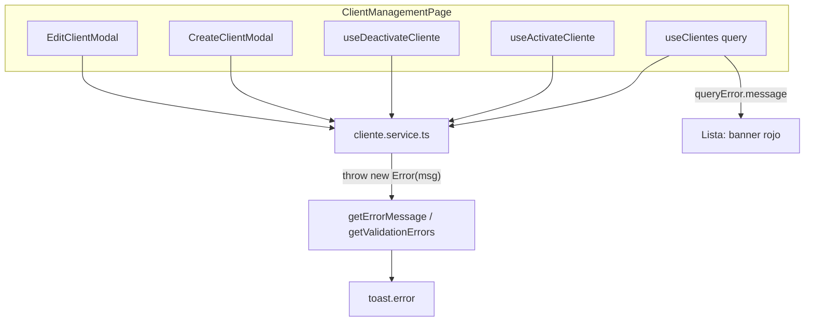

# PLATFORM_ERROR_EXPERIENCE_AUDIT.md

**Tema:** Platform Error Experience — errores de negocio y validación en Platform Administration (Clientes)  
**Fecha:** 2026-06-02  
**Tipo:** Auditoría exclusiva Frontend — **sin implementación, sin repair, sin commit**  
**Alcance aprobado:**

| Incluido | Excluido |
|----------|----------|
| `/super-admin/clientes` (`ClientManagementPage`) | `ClientDetailPage`, tabs (Módulos, Conexiones, Usuarios, Auditoría) |
| `CreateClientModal` | Catálogos globales, IAM, ORG tenant, INV |
| `EditClientModal` | Conexiones / `ClientConnectionsTab` |
| `cliente.service.ts`, `useClientes`, `useClienteMutations` (`@/core/hooks`) | |

**Referencias:**

- `ERP_FRONTEND_STANDARDS_V2.md` — §8.5 (ER-01, ER-02, ER-03), §9.4 (PL-xx), §10 (`getErrorMessage`), AP-11
- `PLATFORM_ACTIVE_UX_REVIEW.md` — UX-PLAT-ACT-08 (feedback mixto)
- `PLATFORM_CLIENTES_B11_CLOSURE_AUDIT.md` — C-06 / E-05 (errores 409/422 en submit; modal abierto)
- Commits de cierre recientes: `d39808c` (P1-01), `5639084` (P1-02), `79ed66b` (P1-03)

**Estado tickets UX Platform (contexto):** P1-01, P1-02, P1-03 → **Cerrados**. Este documento abre el backlog **Platform Error Experience**.

---

## 1. Resumen ejecutivo

| Pregunta | Respuesta |
|----------|-----------|
| ¿Existe estrategia unificada de errores en Clientes? | **No.** Coexisten validación cliente en modal, toasts en hook y en componente, y un servicio que reenvuelve errores. |
| ¿Se cumple ER-01 (`getErrorMessage`)? | **Parcial.** La utilidad central es correcta; la cadena `cliente.service` → `throw new Error(...)` → segundo `getErrorMessage` **rompe** la jerarquía para mutaciones y create. |
| ¿Se cumple ER-02 (toast solo en hook)? | **No en create.** `CreateClientModal` hace toast en `catch`; edit/activar/desactivar usan `onError` en hooks. |
| ¿Hay errores 422 mapeados a campos? | **No.** `getValidationErrors` no se usa en Clientes (sí en `EmpresaPage` ORG). |
| ¿El usuario entiende 409/422 sin consola? | **A menudo no** en submit y mutaciones de listado; **sí** en error de carga de lista (banner usa `error.message` directo). |
| ¿Riesgo principal? | Mensaje genérico **«Ocurrió un error inesperado en la aplicación.»** en flujos CRUD frecuentes pese a que el backend sí envió `detail`. |
| **Veredicto** | **Deuda P1** acotada a capa Clientes Platform; reparación mecánica (no rediseño de producto). |

---

## 2. Inventario de superficie de error

### 2.1 Mapa de flujos



### 2.2 Archivos y responsabilidad

| Archivo | Rol en errores | Mecanismo UI |
|---------|----------------|--------------|
| `src/core/services/error.service.ts` | ER-01: `getErrorMessage`, `getValidationErrors` | Central |
| `src/features/super-admin/clientes/services/cliente.service.ts` | Captura Axios, `console.error`, `throw new Error(getErrorMessage(...))` | Oculta Axios aguas abajo |
| `src/core/hooks/useClientes.ts` | Query sin `onError` toast | — |
| `src/core/hooks/useClienteMutations.ts` | `onError` → `getErrorMessage` + toast | ER-02 (intención) |
| `src/features/super-admin/clientes/hooks/useClienteMutations.ts` | Duplicado del anterior (misma API) | No referenciado por páginas auditadas |
| `ClientManagementPage.tsx` | `queryError.message` en banner; mutaciones vía hooks | Banner + toast (hooks) |
| `CreateClientModal.tsx` | Validación local `errors`; submit `catch` + toast | Inline + toast (componente) |
| `EditClientModal.tsx` | Validación local; `useUpdateCliente` sin `catch` de API | Inline + toast (hook) |

---

## 3. Utilidad central — comportamiento esperado vs real

### 3.1 `getErrorMessage` (ER-01)

**Jerarquía implementada** (`src/core/services/error.service.ts`):

1. Si es `AxiosError` con `response`: `detail` (string o array Pydantic) → si vacío, fallback por **status HTTP**.
2. Si es error de red (`request` sin `response`): mensaje de conectividad.
3. Cualquier otro caso: `console.error("Error no manejado por Axios:", error)` y mensaje fijo **«Ocurrió un error inesperado en la aplicación.»**

**Fallbacks por status (sin `detail`):**

| Status | Mensaje fallback |
|--------|------------------|
| **400** | «Los datos enviados son incorrectos. Revisa los campos marcados en rojo…» |
| **409** | «El recurso ya existe o hay un conflicto de duplicidad… (ej: subdominio, código)» |
| **422** | «Los datos enviados no son válidos. Revisa el formato de los campos…» |
| **500** | «Error interno del servidor (500). Revise los logs del backend…» |

### 3.2 `getValidationErrors` (422 por campo)

- Extrae `fieldErrors` desde `detail[]` con `loc` / `msg`.
- **Uso en repo:** solo `EmpresaPage.tsx` (ORG) en `handleUpdate` catch.
- **Uso en Clientes:** **ninguno.**

### 3.3 Anti-patrón crítico en `cliente.service.ts`

Todos los métodos mutantes y de lectura (salvo stats con manejo especial) siguen:

```typescript
} catch (error) {
  console.error('❌ Error creating client:', error);
  throw new Error(getErrorMessage(error).message || 'Error al crear el cliente');
}
```

**Efecto:** el consumidor recibe un `Error` plano, **no** `AxiosError`. Una segunda llamada a `getErrorMessage` en modal o hook **no** lee `error.message` y cae en el caso genérico.

| Flujo | Primera pasada `getErrorMessage` (en service) | Segunda pasada (modal/hook) | Lo que ve el usuario |
|-------|-----------------------------------------------|----------------------------|----------------------|
| Create submit | OK (Axios → mensaje API o fallback 409/422) | Falla (Error plano) | **Genérico inesperado** |
| Edit submit (`useUpdateCliente`) | OK en service | Falla en `onError` | **Genérico inesperado** |
| Activar / desactivar | OK en service | Falla en `onError` | **Genérico inesperado** |
| Listado `useClientes` | OK en service → `throw Error(msg)` | UI usa `queryError.message` | **Mensaje correcto** en banner |

**Contraste ORG (referencia V2):** `empresaService` **no** envuelve en `try/catch`; Axios llega intacto a `toastOrgApiError` / `getValidationErrors`.

**Contraste Catálogos globales (P1-03):** `catalogosGlobalService` sin wrap; páginas hacen `getErrorMessage(err)` sobre Axios en `catch` → mensaje coherente.

---

## 4. Análisis por código HTTP

### 4.1 Error 400 (Bad Request)

| Aspecto | Estado actual |
|---------|----------------|
| **Backend → FE** | Si `detail` es string, primera pasada en service lo muestra; segunda pasada lo pierde en mutaciones/create. |
| **Sin `detail`** | Fallback ER-01 menciona «campos marcados en rojo», pero **no** hay mapeo automático a `errors{}` del modal. |
| **Validación cliente** | `validateForm()` en Create/Edit cubre requeridos, formato email, RUC, subdominio, URL, HEX, JSON. Toast: «Por favor, corrige los errores en el formulario» (ER-03 MAY — OK). |
| **UX** | Usuario puede ver errores inline **solo** si falló validación local; un 400 de negocio del BE sin `detail` estructurado → toast genérico tras doble wrap. |

**Hallazgo:** UX-PLAT-ERR-02 (P1) — desalineación mensaje 400 vs realidad (no siempre hay campos en rojo).

### 4.2 Error 409 (Conflict)

| Aspecto | Estado actual |
|---------|----------------|
| **Expectativa QA** (`PLATFORM_CLIENTES_B11_CLOSURE_AUDIT` C-06) | Toast de conflicto (~409); modal abierto; datos conservados. |
| **Implementación** | C-06 asume mensaje útil; con doble wrap el toast puede ser **«Ocurrió un error inesperado…»** aunque el service ya resolvió un 409 con `detail` (p. ej. subdominio/código duplicado). |
| **Subdominio** | Validación async solo en **Create**; formato local + stub `validateSubdominio` (sin API BE); conflicto real suele llegar en **POST create** como 409. |
| **Edit** | Sin re-validación de unicidad de subdominio al editar; 409 posible en PUT. |

**Hallazgo:** UX-PLAT-ERR-01 (P0) — regresión de mensaje en 409 en submit/mutaciones por cadena service + `getErrorMessage`.

### 4.3 Error 422 (Unprocessable Entity)

| Aspecto | Estado actual |
|---------|----------------|
| **`detail` array Pydantic** | `messageFromDetail` concatena `msg` con `; ` en primera pasada; **no** se reparte a campos del formulario. |
| **`getValidationErrors`** | No importado en Clientes. |
| **Modal multi-sección** | Aunque se mapeara, el usuario en tab «Suscripción» no vería error en campo de tab «Básica» sin navegación guiada. |
| **Expectativa QA** E-05 | Toast error + modal abierto — **cumple** persistencia; **no cumple** claridad si toast es genérico. |

**Hallazgo:** UX-PLAT-ERR-03 (P1) — sin mapeo 422 → `errors` / `fieldErrors` (desvío respecto a `EmpresaPage` ORG).

### 4.4 Error 500 y otros

| Aspecto | Estado actual |
|---------|----------------|
| **500** | Fallback explícito menciona logs del backend (orientado a operador, no a usuario Platform). Tras wrap → genérico «inesperado» en toast de mutación. |
| **401/403** | Mismos fallbacks ER-01; Platform super-admin rara vez en estos paths en Clientes. |
| **Red** | Mensaje claro si Axios llega directo; tras wrap, degrada a genérico en hooks. |

### 4.5 Mensaje «Ocurrió un error inesperado»

| Origen | Cuándo aparece en Clientes |
|--------|----------------------------|
| `error.service.ts` L109 | Segunda `getErrorMessage` sobre `Error` lanzado por `cliente.service` |
| No aparece | Banner de lista (`queryError.message` preserva texto del `throw`) |

**Frecuencia estimada:** alta en **crear**, **editar**, **activar**, **desactivar**; baja en **carga inicial** de lista.

---

## 5. Errores por campo (backend → UI)

### 5.1 Validación cliente (pre-mutación)

| Modal | Estado `errors` | Campos con inline error |
|-------|-----------------|-------------------------|
| **Create** | `Record<string, string>` | `codigo_cliente`, `subdominio`, `razon_social`, `contacto_email`, `ruc`, `servidor_api_local`, colores, `tema_personalizado` |
| **Edit** | Igual patrón | Mismos + sin check live de subdominio |

**Fortalezas:** borde `border-error`, texto bajo campo, limpieza al `onChange`.

**Limitaciones:**

- No hay banner resumen de errores de servidor.
- No hay scroll/foco al primer error de servidor.
- Subdominio en create: fallo de `validateSubdominio` → solo `console.error` (L111), sin toast ni mensaje (UX-PLAT-ERR-04, P2).

### 5.2 Validación servidor (post-mutación)

| Mecanismo | Clientes | Referencia ORG |
|-----------|----------|----------------|
| `getValidationErrors` + `setFieldErrors` | **No** | `EmpresaPage` update |
| Toast único con `detail` concatenado | Teórico en 1ª pasada; **perdido** en 2ª | `toastOrgApiError` sobre Axios |
| Mapeo `loc` → nombre campo formulario | **No** | Parcial en ORG (último segmento de `loc`) |

**Riesgo de desajuste `loc`:** campos anidados FastAPI (`body`, `cliente`) vs `name` HTML del modal (`codigo_cliente`, etc.) requerirían normalización (no existe hoy).

---

## 6. Consistencia con `ERP_FRONTEND_STANDARDS_V2.md`

| ID | Regla | Clientes (estado) | Evidencia |
|----|-------|-------------------|-----------|
| **ER-01** | MUST `getErrorMessage` con jerarquía `detail` | **FAIL** en cadena service → hook/modal | §3.3 |
| **ER-02** | MUST toast error solo en hook `onError` | **FAIL** create (toast en `CreateClientModal` catch) | L256-259 CreateClientModal |
| **ER-03** | MAY toast validación cliente | **PASS** | `validateForm` + toast genérico |
| **AP-11** | Toast duplicado hook + componente | **Riesgo** — existe `useCreateCliente` con `onError` pero Create no lo usa; si migran sin quitar catch → duplicación | core/hooks vs modal |
| **PL-04** | SHOULD paginación patrón clientes | N/A errores | — |
| **§10** | `getErrorMessage` en `@/core/services/error.service` | Import correcto | — |

**Desvío adicional (fuera error pero V2 §8.6):** `EditClientModal` expone checkbox `es_activo` en tab Suscripción — UX-03 / PL debería usar Desactivar/Reactivar en listado (ya P1-02), no en modal.

---

## 7. Comparativa con módulos de referencia

| Criterio | ORG `EmpresaPage` | INV listados A | Catálogos globales | Clientes Platform |
|----------|-------------------|----------------|--------------------|-------------------|
| Servicio propaga Axios | Sí | Sí (hooks/servicios sin wrap) | Sí | **No** (wrap universal) |
| Toast error en hook | `toastOrgApiError` | `onError` en hooks | `catch` en página | Mixto |
| 422 → campos | Update sí | No en catálogo simple | No | **No** |
| Error listado | Query / banner | `getErrorMessage(query.error)` inline | `setError` estado | `queryError.message` (OK) |
| `console.error` en submit | Mínimo | Variable | En catches | **Sí** (service + Create) |

**Patrón objetivo recomendado (documental, no implementado):** alinear Clientes a **ORG + Catálogos** (Axios crudo + `toastOrgApiError` equivalente Platform o `getErrorMessage` una sola vez + `getValidationErrors` en modales largos).

---

## 8. ¿Qué obliga hoy a revisar la consola?

| # | Escenario | Qué ve el usuario | Qué queda en consola | ¿Consola necesaria para entender? |
|---|-----------|-------------------|----------------------|-----------------------------------|
| 1 | Create/Edit submit 409/422/500 con `detail` | Toast «Ocurrió un error inesperado…» | `❌ Error creating/updating client:` + objeto `Error` con `.message` correcto | **Sí** — el mensaje útil está en `.message` del Error logueado, no en toast |
| 2 | Activar / desactivar fallido | Toast genérico | `❌ Error activating/deactivating` en service | **Sí** |
| 3 | Create: fallo `validateSubdominio` | Sin feedback | `Error validating subdomain:` | **Sí** (silencio UI) |
| 4 | Carga lista fallida | Banner con texto del `throw` | `❌ Error en getClientes` | **No** — banner suficiente |
| 5 | Error no-Axios (bug JS) | Genérico | `Error no manejado por Axios` | **Sí** (desarrollo) |
| 6 | QA C-06 / E-05 «toast conflicto» | Puede no coincidir con realidad si aplica fila 1 | Network tab + console | **Sí** para diagnóstico operador |

---

## 9. Hallazgos priorizados

| ID | Prioridad | Hallazgo | Impacto usuario |
|----|-----------|----------|-----------------|
| **UX-PLAT-ERR-01** | **P0** | Doble procesamiento `getErrorMessage` tras `throw new Error` en `cliente.service` | Mensaje API/business perdido; toast genérico en CRUD y toggles |
| **UX-PLAT-ERR-02** | **P1** | Fallback 400/422 promete «campos en rojo» sin mapeo BE | Confusión; usuario no sabe qué corregir |
| **UX-PLAT-ERR-03** | **P1** | Sin `getValidationErrors` en modales multi-sección | 422 como texto largo en toast (si se arregla ERR-01) o genérico; sin foco en campo/tab |
| **UX-PLAT-ERR-04** | **P2** | `validateSubdominio` falla en silencio (`console.error` only) | Subdominio «sin verificar» sin explicación |
| **UX-PLAT-ERR-05** | **P2** | ER-02 inconsistente: create en componente, edit en hook; `useCreateCliente` huérfano | Deuda mantenimiento; riesgo AP-11 al migrar |
| **UX-PLAT-ERR-06** | **P2** | Duplicación `useClienteMutations` (core vs feature) | Riesgo de divergencia futura en mensajes |
| **UX-PLAT-ERR-07** | **P3** | Copy 500 orientado a logs backend | Tono incorrecto para admin Platform |
| **UX-PLAT-ERR-08** | **P3** | Relacionado ACT-08: éxito duplicado potencial si Create usa hook sin retirar toast local | Percepción de spam (éxito, no error) |

---

## 10. Matriz de cumplimiento QA B11 vs experiencia de error

| Caso QA | Expectativa documentada | Compatible con código actual |
|---------|------------------------|------------------------------|
| **C-06** | Toast conflicto ~409; modal abierto | Modal OK; toast **puede fallar** (ERR-01) |
| **E-05** | Toast error 422; modal abierto | Modal OK; toast **puede fallar** (ERR-01) |
| **C-05 / E-04** | Toast éxito | OK (create toast local; edit hook) |

**Nota:** Los FAIL de submit en QA manual reportados en cierre B11 (500/409/422/email) se clasificaron como BE/datos; esta auditoría **no los reabre**, pero documenta que parte del síntoma «mensaje poco claro» puede ser **FE** (ERR-01), no solo BE.

---

## 11. Backlog propuesto (solo documentación — sin implementar)

### 11.1 Reparación mínima (recomendada primero)

| ID | Acción | Archivos | Esfuerzo |
|----|--------|----------|----------|
| **FIX-ERR-01** | Dejar propagar `AxiosError` en `cliente.service` (patrón ORG) **o** en `getErrorMessage` usar `error instanceof Error && error.message` antes del genérico | `cliente.service.ts`, opcional `error.service.ts` | Bajo |
| **FIX-ERR-02** | Unificar toast de error create: migrar a `useCreateCliente` y quitar toast en `catch` (ER-02) | `CreateClientModal.tsx`, `useClienteMutations.ts` | Bajo |
| **FIX-ERR-03** | Eliminar duplicado `super-admin/.../useClienteMutations.ts` o reexportar desde core | hooks | Bajo |

### 11.2 Mejora experiencia (segundo sprint)

| ID | Acción | Referencia |
|----|--------|------------|
| **FIX-ERR-04** | En Create/Edit `catch` / `onError`: `getValidationErrors` → `setErrors` + toast corto «Revisa los campos marcados» | `EmpresaPage` |
| **FIX-ERR-05** | Helper `toastPlatformApiError` (análogo `toastOrgApiError`) | `org-api-error.ts` |
| **FIX-ERR-06** | Tras 422, navegar a sección del primer campo con error | UX modal largo |
| **FIX-ERR-07** | Toast o inline si falla validación subdominio | Create |

### 11.3 Fuera de alcance de este ticket

- Tabs detalle cliente, conexiones, módulos.
- Catálogos globales (ya mejor patrón Axios directo).
- Cambios backend OpenAPI / contratos `detail`.

---

## 12. Veredicto

| Dimensión | Resultado |
|-----------|-----------|
| **Estado Platform Clientes — Error Experience** | **No cerrado** |
| **Bloqueante operativo** | Mensajes incorrectos/genéricos en mutaciones y modales (ERR-01) |
| **Alineación V2** | ER-01 parcial, ER-02 violado en create, sin 422 por campo |
| **Referencia a copiar** | ORG (`empresaService` + `getValidationErrors` + `toastOrgApiError`) y Catálogos (Axios en `catch` de página) |
| **Acción siguiente sugerida** | Ticket **UX-PLAT-ERR** (o Platform-SEC Error) con FIX-ERR-01..03 antes de FIX-ERR-04 |

---

## 13. Anexo — evidencia de código (líneas representativas)

**Service wrap (causa raíz ERR-01):**

```84:87:src/features/super-admin/clientes/services/cliente.service.ts
    } catch (error) {
      console.error('❌ Error creating client:', error);
      throw new Error(getErrorMessage(error).message || 'Error al crear el cliente');
    }
```

**Create — segundo `getErrorMessage` + ER-02:**

```256:259:src/features/super-admin/clientes/components/CreateClientModal.tsx
    } catch (error) {
      console.error('Error creating client:', error);
      const errorData = getErrorMessage(error);
      toast.error(errorData.message || 'Error al crear el cliente');
```

**Hook mutación — mismo problema:**

```53:56:src/core/hooks/useClienteMutations.ts
    onError: (error) => {
      const errorData = getErrorMessage(error);
      toast.error(errorData.message || 'Error al actualizar el cliente');
    },
```

**Lista — camino que sí funciona:**

```77:77:src/features/super-admin/clientes/pages/ClientManagementPage.tsx
  const error = queryError ? queryError.message : null;
```

**Genérico central:**

```106:111:src/core/services/error.service.ts
  console.error("Error no manejado por Axios:", error);
  return {
    message: 'Ocurrió un error inesperado en la aplicación.',
    status: 0
  };
```

**ORG — update con field errors (referencia):**

```347:349:src/features/org/pages/EmpresaPage.tsx
    } catch (err) {
      const { fieldErrors: nextErrors } = getValidationErrors(err);
      setEditFieldErrors(nextErrors);
```

---

*Fin de auditoría — Platform Error Experience (Clientes /super-admin/clientes).*
