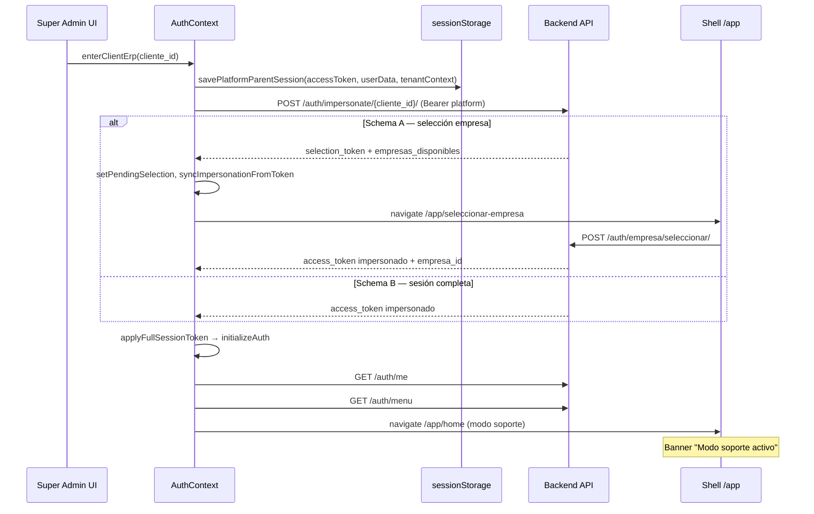

# Auditoría — Impersonación y modo soporte (Platform Admin)

**Fecha:** 31 mayo 2026  
**Estado:** Solo auditoría — **sin código, sin repair, sin commit**  
**Síntoma QA:** Impersonación operativa (tenant, empresa, menú OK; catálogos generales 200) pero módulo **ORG** falla con `403` y mensajes `Se requiere: org.empresa.leer` / `org.sucursal.leer`.  
**Referencias:** `ERP_FRONTEND_STANDARDS_V2.md` §4.8 IMP-xx · `docs/FLUJO_AUTH_MULTIEMPRESA_FE.md` · código `src/shared/context/AuthContext.tsx`

---

## 1. Resumen ejecutivo

| Pregunta | Respuesta |
|----------|-----------|
| ¿La impersonación FE está implementada? | **Sí** — flujo completo platform → tenant → ERP `/app` |
| ¿El síntoma ORG 403 es bug de guards FE? | **No (probable)** — el usuario **entra** a rutas ORG; el fallo ocurre en **API** (`GET /org/sucursales`, `/org/centros-costo`) |
| ¿Dónde está la causa raíz más probable? | **Backend RBAC** — desalineación entre visibilidad de menú (`/auth/menu`) y permisos LBAC de API (`org.*.leer`) en sesión `is_impersonation=true` |
| ¿Hay riesgo FE relevante? | **Sí, secundario** — F5 pierde sesión impersonada; triple fuente de permisos (menú / permissions/me / API); docs antiguos desactualizados |
| ¿Bloquea PUR-M0? | **Sí, indirectamente** — soporte platform no puede validar ORG/scope multiempresa en cliente real hasta corregir permisos impersonados |

### Veredicto de la incidencia ORG

```
Menú ORG visible  →  PermissionGuard org.ver OK  →  OrgCompanyRouteGuard OK
                                                          ↓
                                              GET /org/* → 403
                                              detail: "Se requiere: org.sucursal.leer"
```

**Clasificación:** **Backend (P0)** con posible **gap de contrato (P1)**. El frontend **expone correctamente** el error del API vía `getErrorMessage`; no hay bypass ni guard roto evidente.

---

## 2. Síntoma reportado (QA)

| Observación | Estado |
|-------------|--------|
| Impersonación inicia correctamente | ✅ |
| Cambio de tenant | ✅ |
| Selección de empresa | ✅ |
| Menú lateral carga | ✅ |
| Catálogos generales responden 200 | ✅ (p. ej. INV u otros módulos) |
| Navegación ORG | ❌ |
| Mensajes UI / consola | `Se requiere: org.empresa.leer`, `Se requiere: org.sucursal.leer` |
| Network | `GET /org/sucursales → 403`, `GET /org/centros-costo → 403` |

**Interpretación:** La sesión impersonada tiene **navegación** al módulo ORG pero **no autorización LBAC** en endpoints de negocio ORG. Es el patrón clásico **menú ≠ API RBAC**, acentuado en impersonación si el backend emite menú amplio y token con permisos granulares vacíos o incompletos.

---

## 3. Flujo completo Platform Admin → Impersonation

### 3.1 Diagrama



### 3.2 Pasos detallados (archivos)

| # | Paso | Componente | Detalle |
|---|------|------------|---------|
| 1 | Entrada UI | `ClientDetailPage` → `useImpersonation.enterClientErp` | Botón modo soporte desde detalle cliente super-admin |
| 2 | Guardar padre | `savePlatformParentSession` | `sessionStorage` key `platform_parent_session` — token platform + userData + tenantContext |
| 3 | API impersonate | `authService.startImpersonation` | `POST /auth/impersonate/{cliente_id}/` con Bearer **platform** |
| 4 | Schema A | `startImpersonationHandler` | `setPendingSelection`, `syncImpersonationFromToken(selection_token)`, redirect selección |
| 5 | Schema B | `applyFullSessionToken` | Token completo → bootstrap inmediato |
| 6 | Hidratar sesión | `applyFullSessionToken` | `queryClient.clear()`, invalidate ORG/INV, `setAuth`, `initializeAuth()` |
| 7 | Perfil | `initializeAuth` | `GET /auth/me` — merge JWT claims + user_data |
| 8 | Menú | `loadMenuAndPermissionsFromAuthMenu` | `GET /auth/menu` → `indexRoutePermissionsFromMenu` |
| 9 | Permisos string | `PermissionContext` (paralelo) | `GET /auth/permissions/me` |
| 10 | Shell ERP | `ProtectedRoute requireOperationalUser` | Bypass bloqueo `platform_admin` si `isImpersonation` |
| 11 | Banner | `NewLayout` + `ImpersonationSupportBanner` | Visible en variant `app` cuando `isImpersonation` |
| 12 | Salida | `endImpersonation` → `restorePlatformSession` | `POST /auth/impersonate/end/` + restaurar parent |

**Contrato documentado:** `docs/FLUJO_AUTH_MULTIEMPRESA_FE.md` — respuesta idéntica a login; **sin refresh token**; TTL ~2h; claims `is_impersonation`, `impersonated_by`, `impersonated_by_username` persisten tras seleccionar empresa.

---

## 4. Verificación JWT impersonado

### 4.1 Claims decodificados en FE

Fuente: `src/core/auth/utils/decodeAccessToken.ts`

| Claim | Uso FE |
|-------|--------|
| `is_impersonation` | `isImpersonationToken`, banner, bypass `/app`, interceptor |
| `impersonated_by` | Banner operador |
| `impersonated_by_username` | Banner operador |
| `empresa_id` | `scopeEmpresaId`, gates company-scoped |
| `empresa_selection_pending` | Bloqueo menú/API ERP |
| `user_type` | Guards shell, `canAccessErp`, ORG scope |
| `es_admin_cliente` | Onboarding / tenant ORG |
| `cliente_id` | TenantContext |

### 4.2 Generación (responsabilidad backend)

El FE **no genera** JWT. Solo consume respuesta de:

- `POST /auth/impersonate/{cliente_id}/`
- `POST /auth/empresa/seleccionar/` (si Schema A)
- `POST /auth/empresa/cambiar/` (cambio empresa en sesión impersonada)

**Logs DEV:** `[IMPERSONATE-FE]`, `[IMPERSONATION-FE]`, `logAuthSessionSnapshot` en `applyFullSessionToken` y `completeEmpresaSelection`.

### 4.3 Validaciones FE sobre token

| Regla | Implementación |
|-------|----------------|
| Sesión completa vs selection | `canInitializeFullSession` — bloquea menú si `empresa_selection_pending` |
| Impersonación activa | `isImpersonationToken` \|\| state `isImpersonation` |
| Modo soporte (interceptors) | `isImpersonationSupportMode` = parent en sessionStorage **o** token impersonado |
| Super-admin flag | `isSuperAdmin = platform_admin && !impersonating` |

### 4.4 Gap JWT no visible en FE

El FE **no decodifica** lista de permisos LBAC desde JWT. Los códigos `org.sucursal.leer` solo aparecen en **respuesta 403 del backend**. No hay claim `permissions[]` en cliente.

**Implicación:** Imposible diagnosticar ORG 403 solo con decode JWT en FE; hay que comparar `GET /auth/permissions/me` vs respuesta 403 en Network.

---

## 5. Roles y permisos efectivos

### 5.1 Tres capas de autorización (crítico)

| Capa | Fuente | Consumidor | Granularidad | Impersonación |
|------|--------|------------|--------------|---------------|
| **A — Menú / rutas** | `GET /auth/menu` → `indexRoutePermissionsFromMenu` | `PermissionGuard`, sidebar | Módulo + acciones `ver/crear/...` | Misma lógica que login normal |
| **B — Permisos string** | `GET /auth/permissions/me` | `PermissionContext.hasPermission` | Códigos `org.sucursal.leer`, etc. | Recarga al cambiar `empresaActivaId` |
| **C — API negocio** | RBAC backend por endpoint | Cada `GET/POST /org/*` | Códigos LBAC por recurso | **403 si falta permiso** |

**Norma V2:** PermissionGuard usa capa **A**, no **B** (`PermissionContext.tsx` comentario explícito).

### 5.2 Comportamiento platform_admin vs impersonado

| Estado | `isSuperAdmin` | `PermissionGuard.can()` | `/auth/menu` permisos indexados |
|--------|----------------|-------------------------|----------------------------------|
| Platform admin real | `true` | **Siempre true** | `permissions = null` (bypass) |
| Impersonación activa | **`false`** | Evalúa capa A | Objeto indexado desde menú |
| Usuario operativo normal | `false` | Evalúa capa A | Objeto indexado desde menú |

**Consecuencia:** En impersonación el super-admin **pierde bypass** de PermissionGuard — correcto según IMP-01. Pero si el menú muestra ORG con `ver: true` y la API niega `org.sucursal.leer`, el soporte ve pantallas vacías con error 403.

### 5.3 Hipótesis principal incidencia ORG

| Hipótesis | Probabilidad | Evidencia |
|-----------|--------------|-----------|
| **H1:** Token impersonado sin roles LBAC ORG asignados | **Alta** | 403 con códigos explícitos; menú aún visible |
| **H2:** `/auth/menu` usa reglas distintas a API (módulo habilitado ≠ permiso leer) | **Alta** | Patrón documentado en auditorías RBAC IAM |
| **H3:** `GET /auth/permissions/me` vacío en impersonación pero menú no | **Media** | Verificar en Network QA |
| **H4:** `empresa_id` JWT incorrecto para ORG company-scoped | **Baja** | Usuario reporta selección empresa OK; guard FE pasaría |
| **H5:** FE envía token/platform incorrecto | **Baja** | INV 200 en mismo flujo; interceptor usa `authRef.current.token` |

---

## 6. Refresh de permisos al impersonar

### 6.1 Secuencia post-impersonate

| Evento | Acción FE |
|--------|-----------|
| `applyFullSessionToken` | `setMenuPermissionsReady(false)` → `initializeAuth` → `loadMenuAndPermissionsFromAuthMenu` |
| `completeEmpresaSelection` (Schema A) | Igual vía `applyFullSessionToken` |
| `cambiarEmpresaActiva` | `applyFullSessionToken` tras `POST /auth/empresa/cambiar/` |
| Cambio `empresaActivaId` | `PermissionContext`: reset `permissionsInitialized` → reload `/auth/permissions/me` |
| Cambio `scopeEmpresaId` ORG | `invalidateOrgQueries` en `useOrgSessionScope` |

### 6.2 ¿Se refrescan permisos correctamente en FE?

**Sí, mecánicamente.** Tras impersonate el FE vuelve a llamar `/auth/me`, `/auth/menu` y `/auth/permissions/me` con el **nuevo** Bearer impersonado.

**Si ORG sigue en 403 tras refresh:** el backend **devuelve** menú con ORG visible pero **no incluye** códigos `org.*.leer` en el sujeto del token — no es fallo de refresh FE.

### 6.3 Gap: no hay invalidación explícita tras `startImpersonation` Schema B parcial

`reloadMenuAndPermissions` existe en AuthContext pero el flujo estándar ya pasa por `initializeAuth`. No se detecta omisión sistemática.

---

## 7. Restore parent (salir modo soporte)

### 7.1 Flujo

```
exitSupportMode / logout con impersonación activa
  → POST /auth/impersonate/end/ (Bearer impersonado; errores tolerados)
  → restorePlatformSession()
       → queryClient.clear()
       → setAuth(parent.accessToken, parent.userData)
       → clearPlatformParentSession()
       → initializeAuth() con token platform
```

### 7.2 Bootstrap F5 con parent session

| Condición al F5 | Comportamiento |
|-----------------|----------------|
| `platform_parent_session` + token impersonado **en memoria** | Rehidrata impersonación vía `initializeAuth` (sin refresh platform) |
| `platform_parent_session` + **sin** token en memoria | **`restorePlatformSession`** — sale de modo soporte automáticamente |
| Impersonación sin refresh cookie | **Token access solo en memoria** — F5 típicamente **pierde** sesión impersonada |

**Riesgo operativo:** Soporte que refresca página durante diagnóstico cliente puede **salir involuntariamente** del modo soporte o perder contexto.

### 7.3 Interceptors en modo soporte

`auth-http.utils.ts`:

- **401/403** en impersonación: **no** refresh cookie platform, **no** restore parent automático (solo reject)
- **401** genérico: omitir refresh si `isImpersonationSupportMode`

Correcto según IMP-03 (restore solo vía acción explícita).

---

## 8. Comportamiento multiempresa en impersonación

### 8.1 Reglas FE (alineadas V2 ME-xx / IMP-xx)

| Regla | Estado FE |
|-------|-----------|
| IMP-02: selección empresa igual que login | ✅ Schema A soportado |
| ME-01: `scopeEmpresaId` desde JWT | ✅ `useEmpresaActiva` / `useOrgSessionScope` |
| ME-02: sin filtro empresa toolbar | ✅ ORG post-Etapa B |
| IMP-01: no bypass guards por parent session | ✅ Guards ORG activos |
| AUTH-04: empresa persiste en JWT tras seleccionar | ✅ `applyFullSessionToken` |

### 8.2 OrgCompanyRouteGuard en impersonación

`canOperateOrgCompanyScope` permite company-scoped si:

- No `empresaSelectionPending`
- `scopeEmpresaId` presente
- `userType` ∈ `{ tenant_admin, user }` — **excluye** `platform_admin` puro

En impersonación, `user_type` del JWT impersonado suele ser **`user`** o **`tenant_admin`** (no platform_admin), por lo que el guard **habilita queries** si hay empresa activa.

**Si QA llega a pantalla Sucursales y ve 403 en Network:** el guard FE cumplió; falla capa C (API).

### 8.3 Cambio de empresa en header durante soporte

`cambiarEmpresaActiva` → `POST /auth/empresa/cambiar/` → `applyFullSessionToken` → invalidación queries ORG/INV.

**Nota contrato:** Impersonación documentada **sin refresh token**. Cambio empresa en modo soporte depende de que backend acepte `cambiar` con token impersonado — verificar en QA (riesgo P2 si 409/401).

---

## 9. Guards frontend

### 9.1 Mapa de guards en ruta ORG

```
/app/*  →  ProtectedRoute (operational + isImpersonation bypass platform block)
  →  PermissionGuard module="org" action="ver"   [Capa A]
    →  OrgRouter
      →  /empresa     → OrgTenantRouteGuard
      →  /sucursales  → OrgCompanyRouteGuard
      →  /centros-costo → OrgCompanyRouteGuard
      ...
```

### 9.2 Evaluación por guard (incidencia ORG)

| Guard | ¿Puede causar 403 API? | Notas |
|-------|------------------------|-------|
| `ProtectedRoute` | No | Redirige a login/unauthorized/onboarding — no llama `/org/*` |
| `PermissionGuard org.ver` | No directamente | Si falla → `/unauthorized`, no pantalla con 403 API |
| `OrgTenantRouteGuard` | No | Redirect onboarding/selección |
| `OrgCompanyRouteGuard` | No | Mensaje "Empresa activa requerida" — no 403 |
| React Query hooks | Dispara API | **`enabled` true** → expone 403 backend |

### 9.3 Conclusión guards

La incidencia reportada (**pantalla ORG con error 403 en consola/Network**) indica que **guards de ruta pasaron**. El mensaje `Se requiere: org.sucursal.leer` proviene del **backend**, mostrado por `getErrorMessage` en páginas ORG.

---

## 10. Diferencias usuario normal vs impersonado

| Aspecto | Usuario normal | Impersonado (modo soporte) |
|---------|----------------|----------------------------|
| Token refresh | Cookie HttpOnly + `POST /auth/refresh/` | **Sin refresh** documentado |
| `platform_parent_session` | Ausente | Presente en sessionStorage |
| Banner UI | No | `ImpersonationSupportBanner` |
| `/app/*` para platform_admin | Bloqueado | Permitido si impersonating |
| `isSuperAdmin` | Según user_type | **Forzado false** |
| `PermissionGuard` bypass | No (salvo platform real fuera impersonación) | No |
| Logout | `doLogout` estándar | `endImpersonation` → restore parent |
| F5 en `/app` | Refresh cookie restaura sesión | **Riesgo:** restore parent o pérdida token |
| Interceptor 401 | Intenta refresh | **Omite** refresh platform |
| Destino post-selección | `resolvePostLoginPath` menú | `APP_HOME` (`resolvePostEmpresaSelectionPath`) |
| Empresas elegibles | `/auth/me`, selection, fallbacks | Misma lógica; platform_admin type → lista vacía en loader |

---

## 11. Análisis de capa — Frontend vs Backend vs Contrato

### 11.1 Frontend

| Hallazgo | Sev. | ¿Causa ORG 403? |
|----------|------|-----------------|
| Triple fuente permisos (menú / permissions/me / API) sin reconciliación | 🟡 | No directamente — diseño conocido |
| No pre-valida `hasPermission('org.sucursal.leer')` antes de query | 🟡 | Expone 403 backend en UI — mejorable UX |
| F5 pierde impersonación | 🟡 | No causa 403 |
| `AUDITORIA_IMPERSONACION.md` obsoleto ("no implementada") | 🟢 | Confusión documental |
| Flujo impersonate + selección + menú | 🟢 | Correcto |
| Guards ORG multiempresa | 🟢 | Correcto post-Etapa B |

**Veredicto FE:** **No root cause** del 403 ORG; posibles mejoras UX/defensivas.

### 11.2 Backend (inferido — sin código FastAPI en repo)

| Hallazgo | Sev. | ¿Causa ORG 403? |
|----------|------|-----------------|
| API `/org/*` exige `org.sucursal.leer`, `org.empresa.leer` | 🔴 | **Sí** — mensaje explícito |
| `/auth/menu` probablemente incluye ORG sin mismos códigos LBAC | 🔴 | **Sí** — menú visible + API denegada |
| Token impersonado: identidad sintética sin rol ORG | 🔴 | **Hipótesis H1** |
| Falta política documentada: permisos efectivos en `is_impersonation` | 🟡 | Gap contrato |

**Veredicto BE:** **Causa raíz probable (P0).**

### 11.3 Contrato / OpenAPI

| Hallazgo | Sev. |
|----------|------|
| `docs/FLUJO_AUTH_MULTIEMPRESA_FE.md` describe impersonate | 🟢 |
| OpenAPI parcheado (`scripts/patch-openapi-impersonation.mjs`) — sin matriz permisos impersonación | 🟡 |
| Sin especificación: "menú impersonado = permisos API efectivos" | 🔴 |
| Códigos LBAC ORG no vinculados a visibilidad menú en docs FE | 🟡 |

**Veredicto contrato:** **Gap P1** — falta definir permisos efectivos del sujeto impersonado.

---

## 12. Matriz de riesgos

| ID | Riesgo | Sev. | Capa | Prob. | Impacto |
|----|--------|------|------|-------|---------|
| **PI-01** | ORG (y otros módulos) 403 en impersonación por RBAC incompleto | 🔴 P0 | Backend | Alta | Soporte no puede diagnosticar clientes |
| **PI-02** | Menú muestra módulos no operables en API | 🔴 P0 | Backend + contrato | Alta | UX engañosa en modo soporte |
| **PI-03** | F5 termina impersonación (token solo memoria) | 🟡 P2 | FE + diseño | Media | Pérdida contexto soporte |
| **PI-04** | Sin refresh impersonación — TTL 2h expira sin aviso | 🟡 P2 | Backend | Media | Corte sesión abrupta |
| **PI-05** | `permissions/me` ≠ menú ≠ API — triple desalineación | 🟡 P2 | Arquitectura | Media | Bugs intermitentes post-login |
| **PI-06** | Cambio empresa en impersonación sin refresh | 🟡 P2 | Backend | Baja | 401/409 al cambiar empresa |
| **PI-07** | Docs `AUDITORIA_IMPERSONACION.md` dicen "no existe" | 🟢 P3 | Docs | Alta | Confusión equipo |
| **PI-08** | Auditoría legal: `impersonated_by` sin evento audit dedicado | 🟡 P2 | Backend | Media | Compliance |
| **PI-09** | PUR-M0 validación scope imposible vía soporte platform | 🟡 P1 | Producto | Alta | Retraso módulos |

---

## 13. Plan de corrección (sin implementación)

### Fase 0 — Confirmación QA (1 sesión Network)

Checklist mínimo antes de codificar:

- [ ] Capturar JWT impersonado decodificado: `user_type`, `empresa_id`, `is_impersonation`, `sub`
- [ ] `GET /auth/permissions/me` — ¿contiene `org.sucursal.leer`, `org.empresa.leer`?
- [ ] `GET /auth/menu` — ¿ORG con `permisos.ver: true`?
- [ ] Comparar mismo cliente con **usuario operativo real** (mismos endpoints ORG)
- [ ] Repetir tras `POST /auth/empresa/seleccionar/` si Schema A

**Criterio:** Si `permissions/me` **no** incluye códigos ORG pero menú sí → confirma **PI-01/PI-02 backend**.

### Fase 1 — Backend P0 (bloqueante soporte)

| # | Acción | Owner |
|---|--------|-------|
| 1.1 | Definir política impersonación: ¿sujeto = rol soporte con LBAC tenant-wide? ¿espejo tenant_admin? | Producto + Backend |
| 1.2 | Alinear **`/auth/menu`**, **`/auth/permissions/me`** y **RBAC API** para `is_impersonation=true` | Backend |
| 1.3 | Garantizar mínimo ORG: `org.empresa.leer`, `org.sucursal.leer`, `org.departamento.leer`, etc., si módulo ORG activo en tenant | Backend |
| 1.4 | Tests integración: impersonate → seleccionar empresa → `GET /org/sucursales` = 200 | Backend QA |
| 1.5 | Eventos audit `impersonation_start` / `impersonation_end` (deuda I5 histórica) | Backend |

### Fase 2 — Contrato P1

| # | Acción |
|---|--------|
| 2.1 | Documentar en OpenAPI respuesta impersonate + matriz permisos esperados |
| 2.2 | Ampliar `FLUJO_AUTH_MULTIEMPRESA_FE.md` sección "Permisos efectivos modo soporte" |
| 2.3 | Marcar `docs/frontend/auditoria/AUDITORIA_IMPERSONACION.md` como **obsoleto** o reemplazar por este documento |

### Fase 3 — Frontend P2 (post-backend, defensivo)

| # | Acción | Notas |
|---|--------|-------|
| 3.1 | En modo soporte: si `GET /org/*` 403 LBAC, banner secundario "Permisos insuficientes en sesión soporte — contacte backend" | UX |
| 3.2 | Opcional: ocultar ítems menú ORG si `!hasPermission('org.sucursal.leer')` cuando `is_impersonation` | Requiere capa B |
| 3.3 | Documentar limitación F5 impersonación en runbook soporte | Docs |
| 3.4 | Evaluar persistir access impersonado en `sessionStorage` cifrado (tradeoff seguridad) | Arquitectura |

### Fase 4 — Gates antes PUR-M0

| Gate | Criterio |
|------|----------|
| **G-IMP-ORG** | Impersonate cliente piloto → ORG sucursales/centros-costo **200** |
| **G-IMP-ME** | Cambio empresa header → invalidate queries + ORG **200** |
| **G-IMP-EXIT** | Salir soporte → restore platform + super-admin OK |
| **G-IMP-INV** | Regresión INV catálogos 200 en impersonación (ya OK según QA) |

**No iniciar PUR-M0** hasta **G-IMP-ORG** verde o decisión explícita de producto de limitar soporte platform fuera de ORG.

---

## 14. Respuestas a los 10 objetivos del encargo

| # | Objetivo | Conclusión |
|---|----------|------------|
| 1 | Flujo Platform → Impersonation | §3 — implementado y trazable |
| 2 | JWT impersonado | §4 — claims FE OK; generación backend |
| 3 | Roles y permisos efectivos | §5 — triple capa; bypass super-admin off en impersonación |
| 4 | Refresh permisos al impersonar | §6 — FE refresca; contenido depende backend |
| 5 | Restore parent | §7 — correcto; F5 frágil |
| 6 | Multiempresa | §8 — alineado ME/IMP V2 |
| 7 | Guards frontend | §9 — no causan 403 API reportado |
| 8 | Normal vs impersonado | §10 |
| 9 | Frontend / backend / contrato | §11 — **backend P0**, FE OK, contrato gap P1 |
| 10 | Matriz riesgos + plan | §12–§13 |

---

## 15. Archivos clave revisados

```
src/shared/context/AuthContext.tsx
src/features/auth/services/auth.service.ts
src/features/auth/hooks/useImpersonation.ts
src/core/auth/utils/impersonation-session.ts
src/core/auth/utils/platform-parent-session.ts
src/core/auth/utils/impersonation-fe-log.ts
src/core/auth/utils/decodeAccessToken.ts
src/core/api/auth-http.utils.ts
src/core/auth/PermissionContext.tsx
src/core/auth/hooks/usePermissions.ts
src/core/auth/utils/index-route-permissions-from-menu.ts
src/app/router/guards/PermissionGuard.tsx
src/shared/components/ProtectedRoute.tsx
src/features/org/components/guards/OrgCompanyRouteGuard.tsx
src/features/org/hooks/useOrgSessionScope.ts
src/features/org/services/org.service.ts
src/shared/components/layout/NewLayout.tsx
src/shared/components/layout/ImpersonationSupportBanner.tsx
src/features/super-admin/clientes/pages/ClientDetailPage.tsx
docs/FLUJO_AUTH_MULTIEMPRESA_FE.md
ERP_FRONTEND_STANDARDS_V2.md §4.8
docs/frontend/auditoria/AUDITORIA_IMPERSONACION.md (obsoleto)
MANAGER_POST_LOGIN_UNAUTHORIZED_AUDIT.md (contexto permisos dual)
```

---

## 16. Veredicto final

La impersonación **funciona a nivel de flujo FE** (platform parent, token impersonado, selección empresa, menú, shell ERP, banner, salida). La incidencia ORG **no indica degradación arquitectónica FE** post-IAM/ORG/INV; indica que el **backend emite una sesión de soporte navegable pero sin LBAC ORG efectivo** en API.

**Acción inmediata recomendada:** Fase 0 Network + Fase 1 backend (alinear permisos impersonación con menú y endpoints ORG). Frontend puede permanecer congelado hasta ver **G-IMP-ORG**.

---

*Auditoría impersonación platform. Sin código. Sin repair. Sin commit.*
