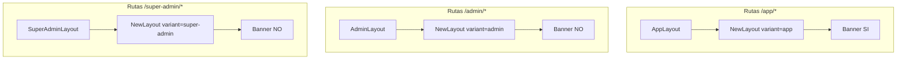

# Auditoría — Banner “Modo soporte” y shells (impersonación)

**Fecha:** 31 mayo 2026  
**Alcance:** Solo frontend (repositorio actual).  
**Estado:** Auditoría y recomendación — **sin código, sin repair, sin commit**.

**Síntoma QA:** El banner “Modo soporte activo” se muestra en `/app/*` y desaparece al cambiar a Administración (`/admin/*`), aunque la sesión impersonada no cambia. Al volver a Módulos, el banner reaparece.

**Contexto normativo:** **Modelo A acotado** aprobado (`PLATFORM_IMPERSONATION_CONTEXT_SWITCH_AUDIT.md`) — paridad con el sujeto impersonado en shells ERP y Administración tenant.

---

## 1. Resumen ejecutivo

| Pregunta | Respuesta |
|----------|-----------|
| ¿La sesión deja de ser impersonada en `/admin`? | **No** — `AuthContext.isImpersonation` y JWT `is_impersonation` persisten |
| ¿Por qué desaparece el banner? | Condición explícita **`variant === 'app'`** en `NewLayout` |
| ¿Admin usa otro layout distinto? | **No** — mismo `NewLayout`, `variant="admin"` |
| ¿Es bug visual? | **Sí** — incumple IMP-04 y Modelo A (indicador de soporte debe ser transversal al shell tenant) |
| Punto correcto de corrección | **`NewLayout.tsx`** — criterio de visibilidad del banner, no duplicar en `AdminLayout` |

---

## 2. Dónde se renderiza hoy el banner

### 2.1 Componente UI

| Pieza | Archivo | Rol |
|-------|---------|-----|
| Banner | `src/shared/components/layout/ImpersonationSupportBanner.tsx` | Texto “Modo soporte activo”, cliente, operador, botón “Salir del modo soporte” |
| Datos | `useAuth()` | `impersonationClienteLabel`, `impersonatedByUsername` |
| Salida | `useImpersonation().exitSupportMode` | `endImpersonation` + navigate super-admin |

### 2.2 Único punto de montaje

**Archivo:** `src/shared/components/layout/NewLayout.tsx`

```tsx
const showSupportBanner = variant === 'app' && isImpersonation;

{showSupportBanner ? (
  <ImpersonationSupportBanner onExit={exitSupportMode} exiting={exiting} />
) : null}
```

El banner es **hijo directo** del contenedor raíz `flex min-h-screen flex-col`, **por encima** de sidebar + header + main. No está en `Header`, `AppLayout` ni rutas hijas.

### 2.3 Cadena de layouts por shell



| Wrapper | Archivo | `variant` | Banner impersonación |
|---------|---------|-----------|----------------------|
| `AppLayout` | `AppLayout.tsx` | `app` | **Visible** si `isImpersonation` |
| `AdminLayout` | `AdminLayout.tsx` | `admin` | **Oculto** (aunque `isImpersonation`) |
| `SuperAdminLayout` | `SuperAdminLayout.tsx` | `super-admin` | Oculto |

`AppLayout` y `AdminLayout` son **thin wrappers** del mismo `NewLayout`; no hay segunda implementación de banner en admin.

### 2.4 Rutas especiales bajo `/app`

`NewLayout` define `hideChrome` para `/app/onboarding` y `/app/seleccionar-empresa` (oculta sidebar/header), pero **no** oculta el banner:

```tsx
const hideChrome =
  location.pathname.startsWith('/app/onboarding') ||
  location.pathname.startsWith('/app/seleccionar-empresa');
```

**Coherente con QA:** banner visible en selección de empresa (ruta bajo `/app` + `variant === 'app'`).

---

## 3. Por qué solo aparece en shell ERP

### 3.1 Causa raíz (una línea)

```tsx
showSupportBanner = variant === 'app' && isImpersonation;
```

La impersonación **no** se evalúa sola; exige **además** shell operativo `app`. Al navegar a `/admin/*`, `LayoutShellProvider` recibe `variant="admin"` → expresión **false** → banner desmontado.

### 3.2 La sesión impersonada no se pierde

| Señal | ¿Cambia al ir a `/admin`? | Fuente |
|-------|--------------------------|--------|
| JWT `is_impersonation` | No | Mismo token en memoria |
| `AuthContext.isImpersonation` | No | `syncImpersonationFromToken` no se reinicia por ruta |
| `platform_parent_session` | No | `sessionStorage` intacto |
| `user_type` (ej. `tenant_admin`) | No | `/auth/me` ya cargado |
| `ShellCrossNav` | Sigue visible | `Header` — `isTenantAdminUser` |

Solo el **componente banner** se desmonta por condición de presentación en layout.

### 3.3 Origen de `isImpersonation` en layout

`NewLayout` usa `useImpersonation()` → `useAuth().isImpersonation`, sincronizado con JWT vía `AuthContext` (`impersonation-session.ts`, `decodeAccessToken`).

No hay rama que ponga `isImpersonation = false` al cambiar de shell.

---

## 4. ¿El shell Administración es distinto?

| Aspecto | Shell `app` | Shell `admin` |
|---------|-------------|---------------|
| Layout base | `NewLayout` | **Mismo** `NewLayout` |
| Sidebar | `NewSidebar` + menú `filterModulosForShell(..., 'app')` | `NewSidebar` + menú `filterModulosForShell(..., 'admin')` |
| Header | `Header` compartido | **Mismo** `Header` |
| `ShellCrossNav` | Visible (tenant_admin) | Visible (tenant_admin) |
| Banner soporte | Montado | **No montado** (única diferencia relevante) |
| Router padre | `ProtectedRoute requireOperationalUser` | `ProtectedRoute requireTenantAdmin` |

**Conclusión:** Administración no tiene implementación paralela del banner; comparte layout y **hereda** la omisión por `variant === 'app'`.

---

## 5. Punto correcto para banner común a ambos shells

### 5.1 Ubicación recomendada (única)

**`NewLayout.tsx`** — mantener un solo montaje para shells tenant (`app` + `admin`).

Razones:

1. Ya concentra chrome común (sidebar, header, banner potencial).
2. `AppLayout` / `AdminLayout` no deben duplicar lógica.
3. El banner está **fuera** de `hideChrome` y **fuera** del área con padding del sidebar → aplica igual a ambos shells.
4. `sticky top-0 z-[60]` en el banner sigue siendo válido en admin.

### 5.2 Criterio de visibilidad recomendado (conceptual, sin implementar)

Sustituir la condición acoplada al shell ERP por una alineada a **sesión de soporte en contexto tenant**:

| Opción | Condición conceptual | Cubre |
|--------|----------------------|-------|
| **Recomendada** | `isImpersonation && (variant === 'app' \|\| variant === 'admin')` | Modelo A — ERP + SYS_ADMIN tenant |
| Alternativa mínima | `isImpersonation` en cualquier `NewLayout` | Incluiría `super-admin` si platform impersonara (caso raro; salida lleva a super-admin dashboard) |
| No recomendada | Banner solo en `AppLayout.tsx` | Duplicación y desincronización con admin |

**Excluir `super-admin`:** la sesión impersonada operativa vive en tenant (`/app`, `/admin`); el panel CAXIS global no es parte del Modelo A acotado para diagnóstico cliente.

### 5.3 Qué no mover

| Ubicación | Motivo |
|-----------|--------|
| `Header.tsx` | El banner es de **sesión global**, no de página; debe preceder al chrome |
| `ProtectedRoute` | Mezcla routing con UI |
| `AuthContext` | Responsabilidad de estado, no de layout |
| Duplicar en `AdminLayout` | Dos fuentes de verdad |

### 5.4 Interacción con `hideChrome`

Rutas `/app/seleccionar-empresa` y `/app/onboarding` deben **seguir** mostrando banner si impersonación activa (comportamiento QA actual deseable). Con criterio `variant === 'app' \|\| variant === 'admin'`, **sin cambios** en `hideChrome`.

---

## 6. Alineación con Modelo A e IMP-04

### 6.1 Modelo A acotado

| Requisito Modelo A | Estado actual banner |
|--------------------|----------------------|
| Soporte en ERP como el tenant admin | OK en `/app/*` |
| Soporte puede usar Administración si el menú lo permite | **UX rota** — sin banner en `/admin/*` parece “sesión normal” |
| Salida explícita modo soporte en cualquier shell tenant | Botón solo visible en `app` |
| No confundir con sesión operativa real | Riesgo **mayor** en admin (sin franja ámbar) |

**Veredicto:** El comportamiento actual **contradice** Modelo A en indicadores visuales, aunque la sesión JWT sí sea impersonada.

### 6.2 ERP_FRONTEND_STANDARDS_V2 — IMP-04

| ID | Texto | Lectura |
|----|-------|---------|
| **IMP-04** | SHOULD UI visible “modo soporte” sin exponer tokens ni UUID cliente | Aplica a **toda** navegación impersonada relevante, no solo `/app` |

El banner ya cumple IMP-04 en contenido (cliente label, operador, sin tokens). Falla en **alcance geográfico** (solo shell `app`).

### 6.3 Relación con auditoría context switch

Problemas **independientes** pero suman mala UX en admin:

| Issue | Auditoría previa |
|-------|------------------|
| Sidebar admin vacío | `PLATFORM_IMPERSONATION_CONTEXT_SWITCH_AUDIT.md` |
| Banner ausente en admin | **Este documento** |

**Modelo A** exige corregir **ambos** para experiencia coherente: menú admin + banner persistente.

---

## 7. Matriz de evidencias

| ID | Afirmación | Estado |
|----|------------|--------|
| B-01 | Banner solo se monta en `NewLayout` | Confirmado |
| B-02 | Condición `variant === 'app' && isImpersonation` | Confirmado |
| B-03 | `AdminLayout` usa mismo `NewLayout` | Confirmado |
| B-04 | Sesión impersonada persiste en `/admin` | Confirmado (AuthContext/JWT) |
| B-05 | Desaparición es desmontaje React, no logout | Confirmado |
| B-06 | `ImpersonationSupportBanner` no se usa en otro archivo | Confirmado (grep) |
| B-07 | IMP-04 no limita banner a shell `app` en V2 | Confirmado (texto norma) |
| B-08 | Corrección natural: ampliar condición en `NewLayout` | Recomendación arquitectónica |

---

## 8. Criterios de aceptación QA (post-corrección futura)

1. Impersonar tenant admin → banner visible en `/app/home`.
2. Seleccionar empresa → banner **sigue** visible.
3. Navegar ORG/INV → banner visible.
4. Switch a **Administración** → banner **sigue** visible; texto cliente/operador correcto.
5. “Salir del modo soporte” desde **admin** → restaura sesión platform (mismo comportamiento que desde app).
6. Volver a Módulos → banner visible (regresión cero).
7. Sesión **no** impersonada en `/admin` → **sin** banner (sin regresión).

---

## 9. Recomendación final

| Decisión | Detalle |
|----------|---------|
| **Diagnóstico** | Bug de **alcance de UI** en `NewLayout`, no de auth ni de shell distinto |
| **Solución arquitectónica única** | Mostrar `ImpersonationSupportBanner` cuando `isImpersonation && (variant === 'app' \|\| variant === 'admin')` en el **mismo** `NewLayout` |
| **Modelo A** | **Sí** — el operador de soporte debe ver modo soporte en ERP **y** en Administración tenant |
| **IMP-04** | **Sí** — extiende visibilidad sin cambiar contenido del banner |
| **No hacer** | Segundo banner en `AdminLayout`; banner en `Header` (se pierde jerarquía sticky global) |

Documentar tras implementación (futuro): nota en V2 §4.8 **IMP-04** — “banner en shells tenant `app` y `admin`”.

---

## 10. Archivos revisados

```
src/shared/components/layout/NewLayout.tsx
src/shared/components/layout/AppLayout.tsx
src/shared/components/layout/AdminLayout.tsx
src/shared/components/layout/SuperAdminLayout.tsx
src/shared/components/layout/ImpersonationSupportBanner.tsx
src/features/auth/hooks/useImpersonation.ts
src/shared/context/AuthContext.tsx
src/app/router.tsx
ERP_FRONTEND_STANDARDS_V2.md §4.8 IMP-04
PLATFORM_IMPERSONATION_CONTEXT_SWITCH_AUDIT.md
```

---

*Auditoría banner impersonación por shell. Sin código. Sin repair. Sin commit.*
