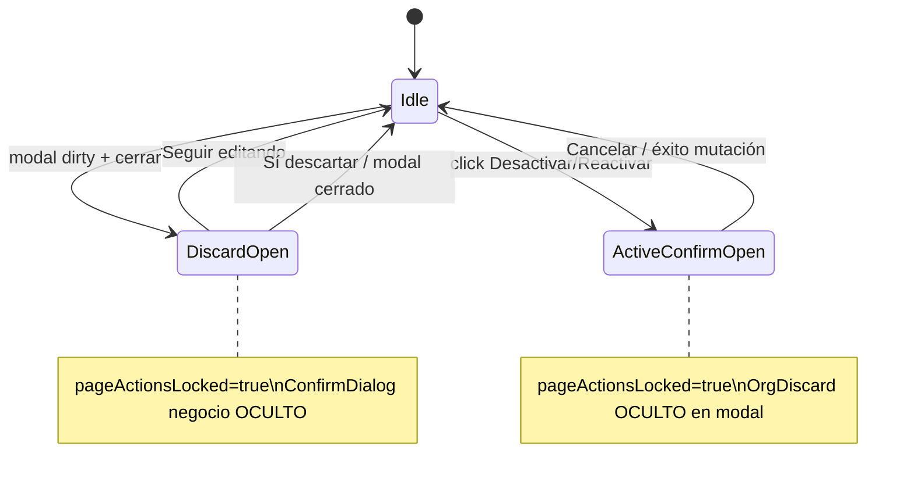

# PLATFORM_MODULES_IMPLEMENTATION_PLAN.md

**Ticket:** Platform Módulos — PLAT-SURF-003 / 004 / 005  
**Fecha:** 2026-06-02  
**Tipo:** Diseño técnico pre-implementación — **sin código, sin repair, sin commit**  
**Referencias:**

- `PLATFORM_NEXT_PHASE_IMPLEMENTATION_AUDIT.md` (viabilidad, orden de fases)
- `PLATFORM_FINAL_SURFACE_AUDIT.md` (hallazgos 003/004/005)
- `PLATFORM_CLIENTES_B11_AUDIT.md` / `PLATFORM_CLIENTES_B11_CLOSURE_AUDIT.md` (patrón B.1.1)
- `PLATFORM_CLIENTES_CONFIRM_DIALOG_AUDIT.md` (patrón P1-02)
- Commit `5639084` — ConfirmDialog Clientes (P1-02)
- Commit `d39808c` — B.1.1 Clientes (P1-01)

**Alcance aprobado:**

| ID | Entrega |
|----|---------|
| PLAT-SURF-003 | `ConfirmDialog` Desactivar / Reactivar en listado |
| PLAT-SURF-004 | Vocabulario UX-01: Desactivar / Reactivar (no «Activar») |
| PLAT-SURF-005 | B.1.1 en `CreateModuleModal` + `EditModuleModal` + `pageActionsLocked` |

**Fuera de alcance:**

- Auditoría Global, Dashboard, Catálogos, Clientes
- Convergencia visual (IAM toolbar, skeletons, empty states)
- Migración a React Query / hooks de mutación Módulos
- Eliminar checkbox `es_activo` en modales (deuda UX-03/04 — **no tocar** en este ticket)
- `es_core` / guardas BE para módulos no desactivables (tipo existe en `ModuloV2`; UI no lo usa hoy)

---

## 1. Resumen ejecutivo

| Objetivo | Estrategia |
|----------|------------|
| Confirmación de baja lógica | Copiar **patrón exacto** `ClientManagementPage` post-P1-02 (`activeTarget`, `activeAction`, `ConfirmDialog`) |
| Vocabulario | Mismos textos que Clientes/Catálogos: Desactivar / Reactivar / Cancelar |
| B.1.1 | Copiar **patrón exacto** Clientes P1-01: `useModuloModalDiscard` + `OrgDiscardConfirmDialog` + dirty utils |
| Coexistencia B11 + confirm negocio | **B11-02:** `isOpen={!!activeTarget && !!activeAction && moduloDiscardPending === null}` |
| Vistas tabla + grid | **Un solo handler** `openActiveConfirm(modulo)` en ambas ramas JSX |

**Veredicto de diseño:** 100% Frontend. Sin contratos API nuevos. Esfuerzo estimado **2.5–3.5 días** (dev + QA manual).

---

## 2. Estado actual (baseline)

### 2.1 `ModuleManagementPage.tsx`

| Aspecto | Hoy |
|---------|-----|
| Toggle activo | `handleToggleActivation` → `moduloV2Service.activateModulo` / `deactivateModulo` **directo** |
| Confirmación | Ninguna |
| Copy | `title="Desactivar"` / `"Activar"`; toast «Módulo activado…» |
| Vistas | `viewMode: 'table' \| 'grid'` — **dos** bloques con botones duplicados (~L704 y ~L765) |
| Modales | `onClose={() => setIsCreateModalOpen(false)}` — sin discard |
| `pageActionsLocked` | **No existe** |
| Toasts éxito create | **Doble:** modal L111 + `handleCreateSuccess` L168 |

### 2.2 Modales

| Modal | Cierre | Dirty | B11 |
|-------|--------|-------|-----|
| `CreateModuleModal` | X → `onClose` directo | No | No |
| `EditModuleModal` | X / Cancel → `onClose` directo | No | No |

Formulario **single-panel** (~15 campos); más simple que Clientes multi-tab.

### 2.3 Referencia cerrada — Clientes

```59:59:src/features/super-admin/clientes/pages/ClientManagementPage.tsx
  const pageActionsLocked = clienteDiscardPending !== null || activeTarget !== null;
```

```504:516:src/features/super-admin/clientes/pages/ClientManagementPage.tsx
      <ConfirmDialog
        isOpen={!!activeTarget && !!activeAction && clienteDiscardPending === null}
        ...
        confirmText={activeAction === 'reactivate' ? 'Reactivar' : 'Desactivar'}
        variant={activeAction === 'reactivate' ? 'info' : 'danger'}
```

---

## 3. Diseño técnico

### 3.1 Arquitectura de estado (página)



**Estado nuevo en `ModuleManagementPage`:**

```typescript
type ModuloActiveAction = 'deactivate' | 'reactivate';

const [moduloDiscardPending, setModuloDiscardPending] = useState<OrgDiscardPending>(null);
const [activeTarget, setActiveTarget] = useState<ModuloV2 | null>(null);
const [activeAction, setActiveAction] = useState<ModuloActiveAction | null>(null);
const [togglingActive, setTogglingActive] = useState(false);

const pageActionsLocked = moduloDiscardPending !== null || activeTarget !== null;
```

**Handlers negocio (PLAT-SURF-003/004):**

```typescript
const moduloDisplayName = (m: ModuloV2) => m.nombre;

const closeActiveConfirm = () => { setActiveTarget(null); setActiveAction(null); };

const openActiveConfirm = (modulo: ModuloV2) => {
  if (moduloDiscardPending !== null) return;
  if (pageActionsLocked && !activeTarget) return; // defensivo
  setActiveTarget(modulo);
  setActiveAction(modulo.es_activo ? 'deactivate' : 'reactivate');
};

const handleActiveConfirm = async () => {
  if (!activeTarget || !activeAction) return;
  setTogglingActive(true);
  try {
    if (activeAction === 'deactivate') {
      await moduloV2Service.deactivateModulo(activeTarget.modulo_id);
      toast.success('Módulo desactivado.');
    } else {
      await moduloV2Service.activateModulo(activeTarget.modulo_id);
      toast.success('Módulo reactivado.');  // PLAT-SURF-004
    }
    closeActiveConfirm();
    fetchModulos();
  } catch (err) {
    toast.error(getErrorMessage(err).message);
  } finally {
    setTogglingActive(false);
  }
};
```

**`ConfirmDialog` (final de página, hermano de modales):**

| Prop | Valor |
|------|-------|
| `isOpen` | `!!activeTarget && !!activeAction && moduloDiscardPending === null` |
| `title` | `Reactivar módulo` / `Desactivar módulo` |
| `message` | `¿Reactivar el módulo "{nombre}"?` / `¿Desactivar…?` |
| `confirmText` | `Reactivar` / `Desactivar` |
| `cancelText` | `Cancelar` |
| `variant` | `info` / `danger` |
| `loading` | `togglingActive` |

Patrón alineado a `PaisesPage` / `ClientManagementPage` (mutación async en handler, no React Query).

### 3.2 Impacto tabla vs grid

| Ubicación | Cambio |
|-----------|--------|
| **Table** (~L704–713) | `onClick={() => handleToggleActivation(modulo)}` → `openActiveConfirm(modulo)` |
| **Grid** (~L765–778) | Idem |
| `title` botón | `Desactivar` / `Reactivar` (PLAT-SURF-004) |
| `disabled` | `pageActionsLocked` en botones Editar + toggle |
| Iconos | Mantener `Trash2` / `RefreshCw` (igual Clientes); **no** cambio iconográfico en este ticket |

**Validación diseño:** un único code path de confirmación evita divergencia table/grid.

### 3.3 B.1.1 — modales (PLAT-SURF-005)

#### 3.3.1 Archivos nuevos

| Archivo | Responsabilidad |
|---------|-----------------|
| `src/features/super-admin/modulos/utils/form-dirty/modulo-form-dirty.ts` | Defaults create, normalización, `isCreateModuloDirty`, `isEditModuloDirty`, `buildEditModuloFormSnapshot` |
| `src/features/super-admin/modulos/hooks/useModuloModalDiscard.ts` | **Copia adaptada** de `useClienteModalDiscard.ts` (misma API) |

**Reutilización de `@/features/org`:**

- `OrgDiscardConfirmDialog` — sin fork
- `OrgDiscardPending` — tipo `'create' \| 'edit' \| null`
- Helpers `str`, `bool` desde `@/features/org/utils/org-form-dirty.helpers`

**NO reutilizar** `useClienteModalDiscard` directamente (evita dependencia super-admin/clientes → modulos circular y acoplamiento de dominio).

#### 3.3.2 Defaults create (`CREATE_MODULO_DEFAULT`)

Alineado a reset actual de `CreateModuleModal`:

```typescript
{
  codigo: '',
  nombre: '',
  descripcion: '',
  icono: 'Package',
  color: '#6366f1',
  categoria: '',
  orden: 0,
  es_activo: true,
}
```

**Normalización dirty:**

- `codigo`, `nombre`, `categoria`, `icono`: trim
- `descripcion`: trim → `null` si vacío (match payload submit)
- `color`: trim, lowercase hex
- `orden`: number ≥ 0
- `es_activo`: boolean

**Edit snapshot:** construir desde prop `modulo` al abrir (incl. `es_activo` aunque no se compare en dirty si checkbox no se edita — incluir en snapshot para paridad con form state).

#### 3.3.3 Cambios por modal

| Componente | Cambios |
|------------|---------|
| **CreateModuleModal** | Props: `onDiscardPendingChange?`; hook `useModuloModalDiscard`; `shellVisible` envuelve overlay; X/Cancel/backdrop/ESC → `handleRequestClose`; `OrgDiscardConfirmDialog` `entityLabel="el módulo"`; `isSubmitting` bloquea cierre; reset form en `useEffect(isOpen)` |
| **EditModuleModal** | Idem + `editFormSnapshot` en `useEffect(isOpen, modulo)`; `isDirty` vs snapshot |

**Props página → modales:**

```typescript
<CreateModuleModal
  ...
  onDiscardPendingChange={setModuloDiscardPending}
/>
<EditModuleModal
  ...
  onDiscardPendingChange={setModuloDiscardPending}
/>
```

**Handlers cierre/success (patrón Clientes):**

```typescript
const handleCreateModalClose = () => {
  setModuloDiscardPending(null);
  setIsCreateModalOpen(false);
};
const handleCreateSuccess = () => {
  setModuloDiscardPending(null);
  setIsCreateModalOpen(false);
  fetchModulos();
  // sin toast aquí — evitar duplicado AP-11
};
```

Eliminar `toast.success` duplicado en modal **o** en página (elegir **uno**; recomendado: mantener en modal submit + quitar L168/L175 en página).

#### 3.3.4 `pageActionsLocked` — elementos a bloquear

Aplicar `disabled={pageActionsLocked}` (o guard early return) en:

| Zona | Controles |
|------|-----------|
| Toolbar | búsqueda, categoría, solo activos, límite, vista table/grid, exportar, refresh, **Nuevo Módulo** |
| Tabla / Grid | Editar, Desactivar/Reactivar |
| Paginación | Anterior / Siguiente |
| Abrir modales | `openCreateModal` / `openEditModal` con guard |

**No bloquear:** cierre de modales ya abiertos vía discard flow interno.

### 3.4 Coexistencia ConfirmDialog ↔ B11 (B11-02)

| Escenario | Comportamiento esperado |
|-----------|------------------------|
| Modal create dirty + usuario cierra | `OrgDiscardConfirmDialog` visible; shell modal oculto; **ConfirmDialog negocio no visible** |
| Confirm Desactivar abierto | `pageActionsLocked`; modales no abren; discard no interfiere |
| `moduloDiscardPending !== null` | `ConfirmDialog` `isOpen={false}` aunque `activeTarget` residual — limpiar `activeTarget` al abrir discard si hiciera falta (no debería si página locked) |
| Submit en curso | X/Cancel/overlay/ESC no cierran ni abren discard (`isSubmitting`) |

**Prioridad de capas z-index:** `OrgDiscardConfirmDialog` / `ConfirmDialog` usan mismo componente base — discard vive **dentro** del modal; confirm negocio **en página** — sin conflicto de overlay si shell modal se oculta (`shellVisible=false`) durante discard.

### 3.5 ER-02 / errores (alcance mínimo)

- Mantener `getErrorMessage` en catch de modales (servicio aún no migrado a patrón FIX-ERR Clientes).
- **Opcional mismo PR:** quitar toast error duplicado si se introduce hook más adelante — **no obligatorio** en 003/004/005.

---

## 4. Archivos a modificar / crear

| Acción | Ruta |
|--------|------|
| **Crear** | `src/features/super-admin/modulos/utils/form-dirty/modulo-form-dirty.ts` |
| **Crear** | `src/features/super-admin/modulos/hooks/useModuloModalDiscard.ts` |
| **Modificar** | `src/features/super-admin/modulos/pages/ModuleManagementPage.tsx` |
| **Modificar** | `src/features/super-admin/modulos/components/CreateModuleModal.tsx` |
| **Modificar** | `src/features/super-admin/modulos/components/EditModuleModal.tsx` |

**Sin modificar:** `modulo-v2.service.ts`, `routes.tsx`, otros modales Platform (`CreateSectionModal`, etc.), Clientes, Catálogos.

**Imports nuevos esperados (página):**

```typescript
import { ConfirmDialog } from '@/shared/components/ui/ConfirmDialog';
import type { OrgDiscardPending } from '@/features/org/types/org-discard.types';
```

**Imports nuevos (modales):**

```typescript
import { OrgDiscardConfirmDialog } from '@/features/org/components/OrgDiscardConfirmDialog';
import { useModuloModalDiscard } from '../hooks/useModuloModalDiscard';
import { CREATE_MODULO_DEFAULT, isCreateModuloDirty, ... } from '../utils/form-dirty/modulo-form-dirty';
```

---

## 5. Estrategia de reutilización

| Componente / util | Origen | Uso en Módulos |
|-------------------|--------|----------------|
| `ConfirmDialog` | `@/shared/components/ui/ConfirmDialog` | Confirm negocio listado |
| `OrgDiscardConfirmDialog` | `@/features/org/components/OrgDiscardConfirmDialog` | Discard create/edit |
| `OrgDiscardPending` | `@/features/org/types/org-discard.types` | Estado página + hook |
| `org-form-dirty.helpers` | `@/features/org/utils/org-form-dirty.helpers` | Normalización campos |
| Patrón hook discard | `useClienteModalDiscard` | **Clonar** → `useModuloModalDiscard` |
| Patrón dirty | `cliente-form-dirty.ts` | **Inspiración** → `modulo-form-dirty.ts` |
| Patrón página | `ClientManagementPage` post-5639084 / d39808c | Estado + handlers + locks |

**Principio:** reutilizar **componentes ORG/shared**; duplicar **hooks/utils de dominio** en `super-admin/modulos` (igual que Clientes) para no acoplar features.

---

## 6. Orden de implementación sugerido

| Paso | Contenido | IDs |
|------|-----------|-----|
| 1 | Crear `modulo-form-dirty.ts` + `useModuloModalDiscard.ts` | 005 |
| 2 | Integrar B11 en `CreateModuleModal` + `EditModuleModal` | 005 |
| 3 | Cablear `moduloDiscardPending`, handlers close/success, `pageActionsLocked` en toolbar/table/grid/pagination | 005 |
| 4 | Añadir `activeTarget` / `activeAction` / `ConfirmDialog` / reemplazar `handleToggleActivation` | 003, 004 |
| 5 | QA manual matriz §7 | — |

**Rationale:** B11 primero permite probar `pageActionsLocked` y coexistencia antes de confirm negocio; alternativamente 003+004 antes de modales — **recomendado B11 primero** para no tocar dos veces los handlers de botones en modales.

---

## 7. QA esperado

### 7.1 PLAT-SURF-003 / 004 — ConfirmDialog

| ID | Caso | Resultado esperado | P0 |
|----|------|-------------------|-----|
| **M-C-01** | Desactivar módulo activo (tabla) | Confirm danger; loading; toast éxito; lista refresca | Sí |
| **M-C-02** | Desactivar módulo activo (grid) | Igual M-C-01 | Sí |
| **M-C-03** | Reactivar módulo inactivo (tabla/grid) | Confirm info; copy **Reactivar** | Sí |
| **M-C-04** | Cancelar confirm | Sin mutación; cierra dialog | Sí |
| **M-C-05** | Error API en confirm | Dialog permanece; toast error | Sí |
| **M-C-06** | No existe `window.confirm` en página | grep 0 | Sí |

### 7.2 PLAT-SURF-005 — B.1.1 Create

| ID | Caso | Resultado esperado | P0 |
|----|------|-------------------|-----|
| **M-B-C-01** | Cerrar sin cambios (X, Cancel, overlay, ESC) | Sin OrgDiscardConfirmDialog | Sí |
| **M-B-C-02** | Cerrar con cambios (4 vías) | Confirm discard; shell oculto | Sí |
| **M-B-C-03** | Seguir editando | Restaura modal + datos | Sí |
| **M-B-C-04** | Sí, descartar | Cierra; reabrir = form vacío | Sí |
| **M-B-C-05** | Submit en curso | No cierra por X/overlay/ESC | Sí |
| **M-B-C-06** | Submit OK | Cierra sin discard; **un** toast éxito | Sí |

### 7.3 PLAT-SURF-005 — B.1.1 Edit

| ID | Caso | Resultado esperado | P0 |
|----|------|-------------------|-----|
| **M-B-E-01** | Cerrar sin cambios | Sin confirm | Sí |
| **M-B-E-02** | Cerrar con cambios | Confirm «sin guardar» | Sí |
| **M-B-E-03** | Submit OK | Cierra; lista actualizada | Sí |
| **M-B-E-04** | Sin falso dirty al abrir | Sin confirm al cerrar inmediato | Sí |

### 7.4 Integración página (B11-03) + coexistencia (B11-02)

| ID | Caso | Resultado esperado | P0 |
|----|------|-------------------|-----|
| **M-P-01** | Discard visible | Toolbar, grid/table, paginación, Nuevo **disabled** | Sí |
| **M-P-02** | Confirm negocio visible | Idem + no abrir modales | Sí |
| **M-P-03** | Discard visible | ConfirmDialog negocio **no** visible | Sí |
| **M-P-04** | Tras Seguir editando / descartar | Página habilitada | Sí |
| **M-P-05** | Cambiar table ↔ grid con lock | Toggle vista disabled cuando locked | No |

### 7.5 Textos (B11-04 / UX-01)

| ID | Verificar | P0 |
|----|-----------|-----|
| **M-T-01** | Create discard: «cerrar sin crear el módulo» | Sí |
| **M-T-02** | Edit discard: «cerrar sin guardar» | Sí |
| **M-T-03** | Negocio: Desactivar / Reactivar / Cancelar | Sí |
| **M-T-04** | **No** «Activar», «Eliminar», «Borrar» en confirm | Sí |

**Criterio de cierre:** todos los ítems **P0** = PASS.

---

## 8. Riesgos y mitigaciones

| ID | Riesgo | Sev. | Mitigación |
|----|--------|------|------------|
| **R-M-01** | Divergencia table/grid si no se unifica handler | Media | Solo `openActiveConfirm`; QA M-C-01/02 |
| **R-M-02** | Falso dirty (`IconSelector`, color picker) | Media | Normalización en `modulo-form-dirty`; QA M-B-E-04 |
| **R-M-03** | Doble toast create (AP-11) | Baja | Quitar toast en `handleCreateSuccess` |
| **R-M-04** | `modulo-v2.service` wrap errores → toast genérico | Media | Fuera ticket; documentar si QA falla mensajes |
| **R-M-05** | Overlay discard vs confirm negocio z-index | Baja | Patrón probado Clientes; shell oculto en discard |
| **R-M-06** | `es_activo` en modal vs toggle listado | Baja | **No tocar** checkbox; operador puede usar ambos — documentar |
| **R-M-07** | Módulo `es_core` desactivable en UI | Baja | Backlog; BE debería rechazar — toast error aceptable |
| **R-M-08** | Export CSV durante `pageActionsLocked` | Baja | Deshabilitar botón export en lock (M-P-01) |

---

## 9. Criterios de aceptación (Definition of Done)

- [ ] `ConfirmDialog` en Desactivar/Reactivar (tabla + grid) con loading y variantes danger/info
- [ ] Vocabulario **Reactivar** en title, confirmText, tooltips y toasts de éxito
- [ ] B.1.1 operativo en Create y Edit (4 vías cierre + submit guard)
- [ ] `pageActionsLocked` durante `moduloDiscardPending` y confirm negocio abierto
- [ ] `isOpen` confirm negocio exige `moduloDiscardPending === null`
- [ ] Cero `window.confirm` en `ModuleManagementPage`
- [ ] Sin regresión en paginación, filtros, export (cuando unlocked)
- [ ] QA §7 P0 completo
- [ ] Sin cambios fuera archivos §4

---

## 10. Estimación

| Bloque | Esfuerzo |
|--------|----------|
| Utils + hook discard | 3–4 h |
| Modales B11 (×2) | 4–6 h |
| Página locks + handlers success | 2–3 h |
| ConfirmDialog 003/004 | 2–3 h |
| QA manual | 3–4 h |
| **Total** | **~2.5–3.5 días** |

---

## 11. Commit sugerido (post-implementación)

```
feat(platform): ConfirmDialog y B.1.1 en gestión de Módulos

PLAT-SURF-003/004/005: confirm Desactivar/Reactivar, discard en modales,
pageActionsLocked alineado a Clientes P1-01/P1-02.
```

---

*Fin — PLATFORM_MODULES_IMPLEMENTATION_PLAN.md*
