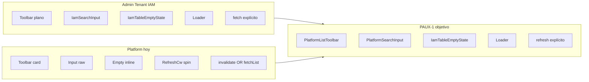

# PLATFORM_UX_CONSISTENCY_AUDIT.md

**Tema:** Consistencia UX/UI — Platform Administration vs Admin Tenant  
**Fecha:** 2026-06-02  
**Tipo:** Auditoría focalizada — **sin implementación, sin repair, sin commit**  
**Referencias:**

- `ERP_FRONTEND_STANDARDS_V2.md` — §8 (ER), §9 (UX), §10 (utilidades)
- `PLATFORM_MODULES_IMPLEMENTATION_PLAN.md` — diseño aprobado PLAT-SURF-003/004/005
- `PLATFORM_ERROR_EXPERIENCE_AUDIT.md` — deuda ER Clientes
- `PLATFORM_CATALOGOS_FRONTEND_ALIGNMENT_AUDIT.md` — alineación catálogos previa
- Commits cerrados: `d39808c` (P1-01), `5639084` (P1-02), `79ed66b` (P1-03), `87dcd38` (FIX-ERR)

**Alcance auditado:**

| Superficie | Archivo principal | Estado |
|------------|-------------------|--------|
| Dashboard | `src/features/super-admin/dashboard/pages/SuperAdminDashboard.tsx` | Mock, sin API |
| Gestión de Clientes | `src/features/super-admin/clientes/pages/ClientManagementPage.tsx` | API + React Query |
| Módulos | `src/features/super-admin/modulos/pages/ModuleManagementPage.tsx` | API + fetch manual |
| Auditoría Global | **Sin ruta** — proxy: `ClientAuditTab.tsx` | API parcial |
| Países | `src/features/super-admin/catalogos/pages/PaisesPage.tsx` | API |
| Monedas | `src/features/super-admin/catalogos/pages/MonedasPage.tsx` | API |
| Departamentos | `src/features/super-admin/catalogos/pages/DepartamentosPage.tsx` | API |
| Provincias | `src/features/super-admin/catalogos/pages/ProvinciasPage.tsx` | API |
| Distritos | `src/features/super-admin/catalogos/pages/DistritosPage.tsx` | API |

**Patrón de referencia (Admin Tenant canónico):**

- `UserManagementPage.tsx` / `RoleManagementPage.tsx` + kit `src/features/admin/components/iam/`
- Shell: `AdminLayout` → `NewLayout variant="admin"` → `LayoutWrapper`
- Toolbar IAM: fila plana `mb-6 flex … gap-4` — **sin** card contenedora
- Búsqueda: `IamSearchInput` (`iam-form-classes.ts`)
- Tabla: `px-6 py-4`, badges `rounded-full`, `IamTableEmptyState`, spinner `Loader h-8`
- Confirmaciones: `ConfirmDialog` (negocio + discard)
- Post-mutación: `fetch*(currentPage, debouncedSearch)` explícito
- Errores lista: banner `text-error bg-error/10 p-3 rounded-md`
- **Nota:** IAM no usa filtro activo/inactivo en listado; ORG sí (`Ver inactivos` en `OrgCompanyToolbar`)

---

## 1. Resumen ejecutivo

| Dimensión | Estado Platform | vs Admin Tenant |
|-----------|-----------------|-----------------|
| Toolbar | Card contenedora compartida en listados CRUD | IAM: fila plana sin card |
| Filtro activo/inactivo | **3 modelos distintos** + bug Clientes | ORG: checkbox «Ver inactivos» |
| Confirm Desactivar/Reactivar | Clientes + Catálogos ✓; Módulos ✗ | IAM ✓ |
| Refresco post-mutación | **2 contratos** (invalidate vs fetchList) | IAM: refetch explícito |
| Badges de estado | Clientes/Módulos: pills; Catálogos: Sí/No | IAM: pills |
| Empty / loading | Texto + icono inline; RefreshCw | IAM: `IamTableEmptyState`, `Loader` |
| Errores 422 | Toast con msg Pydantic crudo | ORG `EmpresaPage`: `getValidationErrors` |
| Dashboard / Auditoría Global | Placeholder o inexistente | N/A |

**Veredicto:** Platform comparte un **sub-patrón interno** (card toolbar + tabla) pero **no converge** con IAM Tenant. Dentro de Platform hay **divergencias estructurales** (toolbars geográficos, filtros, refresh) y al menos **un defecto funcional P0** (filtro «Inactivos» en Clientes). Antes de PLAT-SURF-003/004/005 conviene cerrar **P0 + refresh Clientes**; la convergencia visual completa puede ser fase separada.

---

## 2. Matriz de inconsistencias

Leyenda severidad: **P0** defecto funcional / confianza rota · **P1** fricción alta · **P2** inconsistencia visual/comportamental · **P3** deuda cosmética

| ID | Superficie | Categoría | Hallazgo | Sev. | Impacto UX | Referencia canónica |
|----|------------|-----------|----------|------|------------|---------------------|
| **UX-PLAT-C01** | Clientes | Filtro | Opción «Inactivos» envía `solo_activos=false` → API devuelve **todos**, no solo inactivos. Sin filtro client-side. | **P0** | Usuario elige «Inactivos» y ve activos e inactivos mezclados; pierde confianza en filtros | Semántica ORG `includeInactive` o param dedicado BE |
| **UX-PLAT-C02** | Clientes | Filtro | Selects **Plan** y **Estado suscripción** no se envían al servicio (`cliente.service.ts` solo `buscar` + `solo_activos`) | **P1** | Controles visibles sin efecto — falsa expectativa | Ocultar hasta wire-up o conectar API |
| **UX-PLAT-C03** | Clientes | Refresh | Tras reactivar/desactivar: solo `invalidateQueries`; **sin** `refetch()` en `onSuccess`. `staleTime: 2min` en `useClientes.ts` | **P1** | Badge/acciones pueden quedar obsoletos hasta refetch async; percepción de «Reactivar no funcionó» | IAM: `fetchUsers` post-confirm; Catálogos: `fetchList()` |
| **UX-PLAT-C04** | Clientes | Copy | Toast mutación: «Cliente **activado**» (`useActivateCliente`) vs UI «**Reactivar**» | **P2** | Mensaje inconsistente con vocabulario UX-01 | P1-02/P1-03: «reactivado» |
| **UX-PLAT-C05** | Clientes | Visual | Toolbar en **card** (`bg-surface border p-4`); IAM sin card | **P2** | Aspecto más «pesado» que Admin Tenant | `UserManagementPage` L560–580 |
| **UX-PLAT-C06** | Clientes | Visual | Sin `IamSearchInput`, `IamTableEmptyState`, `Loader` | **P2** | Densidad/spacing distinta; empty genérico | Kit IAM |
| **UX-PLAT-C07** | Clientes | Errores | 422 en modals: toast vía `getErrorMessage`; **sin** `getValidationErrors` ni errores por campo | **P1** | Mensajes técnicos; usuario no sabe qué campo corregir | `EmpresaPage.tsx` ORG |
| **UX-PLAT-M01** | Módulos | Confirmación | `handleToggleActivation` directo — **sin** `ConfirmDialog` (PLAT-SURF-003 pendiente) | **P1** | Acción destructiva sin confirmación | Clientes P1-02, Catálogos |
| **UX-PLAT-M02** | Módulos | Copy | Toast «Módulo **activado**»; tooltip «Activar» en grid/table | **P2** | Desalineado UX-01 Reactivar | Catálogos P1-03 |
| **UX-PLAT-M03** | Módulos | Filtro | Checkbox «**Solo activos**» (checked = restrict) vs Catálogos «**Ver inactivos**» (checked = include) | **P1** | Mismo control mental invertido entre pantallas Platform | Unificar etiqueta + semántica |
| **UX-PLAT-M04** | Módulos | Visual | Toolbar más rica (export, grid/table, page size, KPI strip) — única en Platform | **P3** | Expectativa distinta al entrar a otras listas | Decidir si Módulos es excepción documentada |
| **UX-PLAT-M05** | Módulos | B11 | Modales create/edit sin discard guard (PLAT-SURF-005 pendiente) | **P1** | Pérdida accidental de datos | Clientes P1-01 |
| **UX-PLAT-M06** | Módulos | Refresh | `fetchModulos()` explícito post-mutación — **predecible** | — | ✅ Patrón deseado | Catálogos / IAM |
| **UX-PLAT-CAT01** | Países, Monedas | Toolbar | Layout **plano**: `[search] [Ver inactivos] [refresh|create]` en una fila | **P2** | En viewport estrecho checkbox queda entre search y acciones | Dept/Prov/Dist: grupo izquierdo |
| **UX-PLAT-CAT02** | Dept, Prov, Dist | Toolbar | Layout **agrupado**: `[search + FK select + Ver inactivos]` \| `[refresh|create]` | **P2** | Países/Monedas no siguen mismo grouping que jerárquicos | Unificar `PlatformListToolbar` |
| **UX-PLAT-CAT03** | Todos catálogos | Visual | Columna Activo: texto **Sí/No** vs pills Clientes/IAM | **P2** | Escaneo visual más lento | Badges `bg-success/10` |
| **UX-PLAT-CAT04** | Todos catálogos | Empty | Empty inline (`Flag` icon + texto) vs `IamTableEmptyState` | **P2** | Sin CTA contextual «Crear primer país» | IAM empty state |
| **UX-PLAT-CAT05** | Todos catálogos | Errores | Banner error **sin** botón Reintentar (Clientes sí tiene) | **P2** | Recuperación menos obvia | ClientManagementPage L287–291 |
| **UX-PLAT-CAT06** | Todos catálogos | Filtro | Doble filtro API (`solo_activos`) + client-side `.filter(es_activo)` redundante | **P3** | Complejidad innecesaria; riesgo de drift | Un solo layer |
| **UX-PLAT-CAT07** | Dept/Prov/Dist | FK dropdowns | `listPaises()` / parents **sin** `solo_activos` — pueden listar inactivos | **P2** | Crear registro bajo padre inactivo | Filtrar activos en combos |
| **UX-PLAT-CAT08** | Catálogos | Confirm | Desactivar/Reactivar + `fetchList()` — **alineado** P1-03 | — | ✅ Referencia Platform | — |
| **UX-PLAT-D01** | Dashboard | Funcional | Datos **mock** hard-coded; quick actions **sin** `navigate` | **P1** | Entrada principal engañosa; no refleja sistema real | N/A producto |
| **UX-PLAT-D02** | Dashboard | Visual | Cards `rounded-xl p-6`; listados usan `rounded-lg` | **P3** | Micro-inconsistencia radius/padding | Unificar tokens |
| **UX-PLAT-D03** | Dashboard | Estructura | Sin toolbar, sin patrón listado | **P2** | No comparable al resto Platform | Definir cuando haya API |
| **UX-PLAT-A01** | Auditoría Global | Ruta | **No existe** en `super-admin/routes.tsx`; wildcard → dashboard | **P0** | Ítem menú (si existe en BD) lleva a redirect / 404 lógico | Ruta dedicada |
| **UX-PLAT-A02** | Auditoría Global | UX | Solo `ClientAuditTab` embebido en detalle cliente | **P1** | No hay vista global cross-tenant | Servicio `superadmin-auditoria.service.ts` listo |
| **UX-PLAT-A03** | Auditoría (tab) | Toolbar | Filtros en **grid 4 cols**; sin refresh dedicado; sin card actions estándar | **P2** | Patrón audit ≠ patrón CRUD | Adaptar al estándar lectura |
| **UX-PLAT-A04** | Auditoría (tab) | Tabla | `px-6` estilo IAM; resto Platform catálogos `px-4` | **P3** | Spacing mixto | Token tabla único |
| **UX-PLAT-X01** | Transversal | Errores 422 | `getErrorMessage` prioriza `detail[].msg` Pydantic (**inglés/técnico**) sobre fallback ES | **P1** | «value is not a valid email address» al usuario final | Capa traducción / `getValidationErrors` |
| **UX-PLAT-X02** | Transversal | ER-03 | Fallback 400/422 menciona «campos en rojo» pero Platform **no pinta** campos | **P1** | Promesa incumplida en copy | Mapeo campo o copy honesto |
| **UX-PLAT-X03** | Transversal | Refresh | **Contrato A:** React Query invalidate (Clientes) vs **Contrato B:** fetch explícito (resto) | **P1** | Comportamiento impredecible entre pantallas | Estándar único §4 |
| **UX-PLAT-X04** | Transversal | Modales | Clientes: overlay custom; Catálogos: shadcn `Dialog`; IAM: Radix dialogs | **P2** | Animaciones, ESC, focus trap pueden diferir | Wrapper modal Platform |
| **UX-PLAT-X05** | Transversal | Loading | IAM `Loader h-8 py-10`; Platform `RefreshCw h-6 py-8/12` | **P2** | Ritmo visual distinto | `PlatformTableLoading` |
| **UX-PLAT-X06** | Transversal | Reactivar variant | Clientes/Catálogos: `variant="info"`; IAM Roles: `variant="warning"` | **P3** | Color semántico distinto mismo acto | Unificar en danger/info/warning matrix |

---

## 3. Análisis de observaciones reportadas

### 3.1 Gestión de Clientes vs Admin Tenant

| Aspecto | Admin Tenant (IAM) | Clientes Platform | Gap |
|---------|-------------------|-------------------|-----|
| Contenedor toolbar | Fila plana | Card con borde/sombra | Visual |
| Search | `IamSearchInput` reutilizable | Input raw duplicando clases | Componente |
| Primary CTA | shadcn `Button` | `<button>` nativo | Componente |
| Tabla padding | `px-6 py-4` | `px-6 py-4` | ✅ Alineado |
| Estado | Badge pill | Badge pill | ✅ Alineado |
| Empty | `IamTableEmptyState` contextual | Texto «No hay clientes» | UX |
| Loading | `Loader` centrado | `RefreshCw` + texto | Visual |
| Discard / confirm | ConfirmDialog + page lock | Implementado P1-01/02 | ✅ Comportamiento |
| Post-toggle refresh | `fetchUsers()` síncrono | Solo invalidate | **Funcional** |

**Conclusión:** Clientes está **alineado en tabla y flujos de confirmación** recién cerrados, pero **no en shell de toolbar, empty/loading ni kit IAM**. La brecha más grave no es visual sino **filtro roto + refresh débil**.

### 3.2 Países/Monedas vs Departamentos/Provincias/Distritos

**Países / Monedas** (`PaisesPage.tsx` L159–190, `MonedasPage.tsx` L160–201):

```
[ Search w-64 ] [ Ver inactivos checkbox ]     [ Refresh ] [ Create ]
```

**Departamentos / Provincias / Distritos** (`DepartamentosPage.tsx` L179–216):

```
[ Search ] [ FK select ] [ Ver inactivos ]  |  [ Refresh ] [ Create ]
     └────────── grupo izquierdo flex-wrap ──────────┘
```

**Diferencias concretas:**

1. **Agrupación:** jerárquicos encapsulan filtros en `flex flex-col sm:flex-row gap-3 flex-wrap`; leaf catálogos reparten elementos sueltos en la fila principal.
2. **Responsive:** en móvil, Países puede mostrar checkbox entre bloques; Dept mantiene grupo coherente.
3. **Controles:** mismos tokens CSS (`rounded-lg`, `border-border-base`) — la inconsistencia es **layout**, no color.

**Monedas** sigue el layout de **Países** (leaf), no el de **Departamentos** — confirma la observación del usuario.

### 3.3 Reactivar Cliente — refresco visual

**Flujo actual:**

```138:145:src/features/super-admin/clientes/pages/ClientManagementPage.tsx
  const handleActiveConfirm = () => {
    if (!activeTarget || !activeAction) return;
    const onSuccess = () => closeActiveConfirm();
    if (activeAction === 'deactivate') {
      deactivateMutation.mutate(activeTarget.cliente_id, { onSuccess });
    } else {
      activateMutation.mutate(activeTarget.cliente_id, { onSuccess });
    }
  };
```

```69:73:src/core/hooks/useClienteMutations.ts
    onSuccess: () => {
      queryClient.invalidateQueries({ 
        queryKey: ['clientes', tenantId] 
      });
      toast.success('Cliente activado exitosamente');
```

**Causas probables del síntoma:**

| # | Causa | Evidencia |
|---|-------|-----------|
| 1 | Invalidación asíncrona sin `await refetch()` | No hay `refetch` en handler éxito |
| 2 | `staleTime: 2 * 60 * 1000` | Datos considerados frescos; invalidation puede no refetch inmediato si componente no remonta |
| 3 | Filtro «Inactivos» roto | Tras reactivar, fila **permanece** en vista (correcto si filtro = todos, confuso si usuario cree que filtra solo inactivos) |
| 4 | Sin optimistic update | Badge `es_activo` espera round-trip completo |

**Contraste positivo:** Catálogos llaman `fetchList()` inmediatamente tras confirm (p. ej. `PaisesPage.tsx` L91–92).

### 3.4 Filtro inactivos Clientes — ambigüedad

**UI** (`ClientManagementPage.tsx` L236–245): Todos | Activos | **Inactivos**

**Mapping** (`cliente.service.ts` L32–40):

```typescript
if (filtros.es_activo !== undefined) {
  params.append('solo_activos', filtros.es_activo.toString());
}
// es_activo: false  →  solo_activos=false  →  "no restringir a activos" ≠ "solo inactivos"
```

**Default sin filtros:** `solo_activos=true` (solo activos) — coherente.  
**Opción Inactivos:** semántica invertida respecto a la etiqueta — **defecto P0**.

### 3.5 Mensajes 422 técnicos

**Mecanismo** (`error.service.ts` L19–32, L92–94):

- Si `detail[]` trae `msg`, se expone **tal cual** (Pydantic, often English).
- Fallback español L62 solo aplica cuando `messageFromDetail` retorna null.

**Uso Platform:**

| Superficie | 422 handling |
|------------|--------------|
| Clientes modals | `getErrorMessage` → toast |
| Catálogos forms | Idem |
| Módulos modals | Idem |
| **Ninguna** Platform | `getValidationErrors` |

**Ejemplo usuario:** `"String should have at least 3 characters"` en toast en lugar de «El código debe tener al menos 3 caracteres».

**Referencia existente:** `EmpresaPage.tsx` (ORG) mapea `fieldErrors` a inputs.

---

## 4. Propuesta de estandarización — Platform Administration UX Standard (PAUX-1)

### 4.1 Principios

1. **Comportamiento antes que píxeles:** confirmaciones, filtros correctos y refresh predecible primero.
2. **Reutilizar kit IAM** donde no exista equivalente Platform: search, empty, loading, badges.
3. **Un contrato de datos** post-mutación en todas las superficies.
4. **Vocabulario UX-01:** Desactivar / Reactivar / Cancelar (nunca Activar/Eliminar para soft-delete).
5. **Errores en dos capas:** toast resumido ES + errores por campo cuando 422.

### 4.2 Componentes propuestos (nuevos wrappers, sin fork IAM)

| Componente | Responsabilidad | Basado en |
|------------|-----------------|-----------|
| `PlatformListToolbar` | Card opcional + slots: `filtersLeft`, `filtersRight`, `actions` | Unifica CAT01/CAT02 + Clientes |
| `PlatformSearchInput` | Alias/wrapper `IamSearchInput` | IAM |
| `PlatformStatusBadge` | Pill Activo/Inactivo | IAM badge classes |
| `PlatformTableShell` | Loading / error / table / empty unificados | IAM + Clientes Reintentar |
| `PlatformActiveFilter` | Checkbox **«Ver inactivos»** único contrato | ORG `OrgCompanyToolbar` |
| `PlatformConfirmActiveDialog` | Confirm Desactivar/Reactivar parametrizado | Clientes P1-02 |
| `usePlatformListRefresh` | Hook: `{ refresh, isRefreshing }` — unifica RQ refetch y fetch manual | Nuevo |

### 4.3 Contrato toolbar PAUX-1

```
┌─ PlatformListToolbar (card mb-6 p-4) ─────────────────────────────────────┐
│  LEFT (flex-wrap gap-3)          │  RIGHT (gap-2)                          │
│  • PlatformSearchInput           │  • Refresh (icon)                       │
│  • Filtros de dominio (selects)  │  • Primary create (Button brand)        │
│  • PlatformActiveFilter          │  • Acciones extra (export — opcional)   │
└───────────────────────────────────────────────────────────────────────────┘
```

**Reglas:**

- Filtros de jerarquía (país, depto, prov) van en **LEFT**, nunca entre search y acciones sueltos.
- Leaf catálogos (País, Moneda) omiten FK select pero **mantienen** mismo layout LEFT/RIGHT.
- `pageActionsLocked` deshabilita LEFT+RIGHT (patrón Clientes P1-01).

### 4.4 Contrato filtro activo/inactivo PAUX-1

| Control | Semántica | API param ( acordar BE ) |
|---------|-----------|--------------------------|
| Checkbox «Ver inactivos» **off** (default) | Solo activos | `solo_activos=true` |
| Checkbox **on** | Activos + inactivos | omit param o `solo_activos=false` |
| *(Opcional futuro)* Segment «Activos / Inactivos / Todos» | Tres modos explícitos | `es_activo=true/false` + omit |

**Prohibido:** etiqueta «Inactivos» que envíe `solo_activos=false` sin filtrar client-side.

**Clientes:** migrar de select 3-way a checkbox OR implementar filtro client-side + param BE `solo_inactivos`.

### 4.5 Contrato refresh PAUX-1

Tras mutación exitosa (create, update, activate, deactivate):

```
1. Cerrar modal/confirm
2. toast.success (único origen: hook o página, no ambos)
3. refreshList() — OBLIGATORIO explícito:
   - React Query: await refetch() además de invalidateQueries
   - Manual fetch: await fetchList()
4. (Opcional) Optimistic patch para toggle es_activo
```

### 4.6 Contrato errores PAUX-1

| Capa | Comportamiento |
|------|----------------|
| `getErrorMessage` | Preferir mensaje ES amigable; mapa de traducción Pydantic → ES para msgs conocidos |
| `getValidationErrors` | Obligatorio en formularios Platform create/edit |
| Toast | Resumen ES: «Revisa los campos marcados» |
| Inline | `fieldErrors` → input border-error + texto bajo campo |
| Lista | Banner + **Reintentar** en todas las superficies |

### 4.7 Matriz ConfirmDialog PAUX-1

| Acción | title | confirmText | variant |
|--------|-------|-------------|---------|
| Desactivar | Desactivar {entidad} | Desactivar | danger |
| Reactivar | Reactivar {entidad} | Reactivar | info |
| Discard create | Descartar cambios | Sí, descartar | warning |
| Discard edit | Descartar cambios | Sí, descartar | warning |

Coexistencia B11-02: `businessConfirmOpen && discardPending === null`.

### 4.8 Tabla PAUX-1

| Token | Valor |
|-------|-------|
| Wrapper | `overflow-x-auto shadow-md rounded-lg border border-border-base` |
| th/td listados paginados | `px-6 py-3` / `px-6 py-4` |
| th/td catálogos compactos | `px-4 py-3` (o migrar a px-6) |
| Estado | `PlatformStatusBadge` siempre |
| Empty | `IamTableEmptyState` |
| Loading | `Loader h-8` + mensaje contextual |

---

## 5. Mapa de divergencia visual (resumen)



---

## 6. QA de regresión UX (post-convergencia)

| ID | Caso | Superficies |
|----|------|-------------|
| **QA-UX-01** | «Ver inactivos» off → solo activos en lista | Clientes, Catálogos, Módulos |
| **QA-UX-02** | Reactivar → badge y acciones actualizan **sin F5** | Clientes, Catálogos, Módulos |
| **QA-UX-03** | Toolbar responsive: filtros LEFT, acciones RIGHT | 5 catálogos + Clientes |
| **QA-UX-04** | 422 duplicado subdominio → mensaje ES + campo resaltado | Clientes create |
| **QA-UX-05** | Error lista → Reintentar funciona | Todas |
| **QA-UX-06** | Confirm Desactivar/Reactivar + loading | Todas con toggle |
| **QA-UX-07** | Dashboard quick action navega (cuando exista API) | Dashboard |
| **QA-UX-08** | Ruta Auditoría Global carga (cuando exista) | Auditoría |

---

## 7. Recomendación de orden de corrección

### Fase 0 — Defectos P0 (bloqueantes confianza)

| Orden | ID | Entrega | Esfuerzo |
|-------|-----|---------|----------|
| 0.1 | UX-PLAT-C01 | Corregir filtro Inactivos Clientes (BE param o FE filter) | 0.5–1 d |
| 0.2 | UX-PLAT-C02 | Wire-up o remover filtros Plan/Estado muertos | 0.5 d |
| 0.3 | UX-PLAT-A01 | Ruta Auditoría Global o ocultar ítem menú | 1–2 d |

### Fase 1 — Comportamiento transversal P1

| Orden | ID | Entrega | Esfuerzo |
|-------|-----|---------|----------|
| 1.1 | UX-PLAT-C03, X03 | Contrato refresh: `refetch()` post-mutación Clientes | 0.5 d |
| 1.2 | UX-PLAT-X01, X02, C07 | Capa 422: traducción + `getValidationErrors` en Clientes modals | 1.5–2 d |
| 1.3 | UX-PLAT-M01, M02, M05 | **PLAT-SURF-003/004/005** (plan aprobado) | 2.5–3.5 d |
| 1.4 | UX-PLAT-M03 | Unificar checkbox «Ver inactivos» en Módulos | 0.5 d |

### Fase 2 — Convergencia toolbar catálogos P2

| Orden | ID | Entrega | Esfuerzo |
|-------|-----|---------|----------|
| 2.1 | UX-PLAT-CAT01, CAT02 | `PlatformListToolbar` + migrar 5 catálogos | 1.5–2 d |
| 2.2 | UX-PLAT-CAT03, CAT04, CAT05 | Badges, empty IAM, Reintentar | 1 d |
| 2.3 | UX-PLAT-C05, C06, X05 | Clientes → kit IAM (toolbar, empty, loading) | 1.5 d |

### Fase 3 — Superficies incompletas

| Orden | ID | Entrega | Esfuerzo |
|-------|-----|---------|----------|
| 3.1 | UX-PLAT-A02, A03 | Página Auditoría Global (reusar ClientAuditTab) | 2–3 d |
| 3.2 | UX-PLAT-D01, D02, D03 | Dashboard con API real | TBD backend |

### Fase 4 — Pulido P3

| Orden | ID | Entrega |
|-------|-----|---------|
| 4.1 | UX-PLAT-X06 | Unificar variant Reactivar info vs warning |
| 4.2 | UX-PLAT-C04 | Copy «reactivado» en toasts Clientes |
| 4.3 | UX-PLAT-CAT06, CAT07 | Limpiar doble filtro; FK solo activos |

---

## 8. Decisión: ¿Convergencia UX antes de PLAT-SURF-003/004/005?

| Opción | Qué incluye | Pros | Contras |
|--------|-------------|------|---------|
| **A — Módulos primero (plan aprobado)** | Solo PLAT-SURF-003/004/005 en Módulos | Entrega cerrada; no bloqueada por refactor visual | Módulos queda con toolbar distinta; checkbox «Solo activos» persiste |
| **B — P0 + Módulos** | Fase 0.1–0.2 + PLAT-SURF-003/004/005 | Corrige bug Clientes sin retrasar mucho Módulos | Convergencia visual sigue pendiente |
| **C — Convergencia completa primero** | Fases 0–2 antes de Módulos | Platform uniforme antes de tocar Módulos | +5–7 d antes de 003/004/005; riesgo scope creep |
| **D — P0 + refresh + Módulos + convergencia catálogos** | 0 + 1.1 + 1.3 + 2.1 | Equilibrio: bugs críticos, Módulos cerrado, toolbars catálogo alineadas | Clientes visual IAM queda para Fase 2.3 |

### Recomendación

**Opción D (híbrida):**

1. **Inmediato (pre o paralelo a Módulos):** Fase **0.1** filtro Clientes + **1.1** refresh explícito — son los síntomas que reportaste en pruebas.
2. **Siguiente:** Ejecutar **PLAT-SURF-003/004/005** según `PLATFORM_MODULES_IMPLEMENTATION_PLAN.md` — es comportamiento, no rediseño visual; incluir **UX-PLAT-M03** (renombrar a «Ver inactivos») en el mismo PR si coste bajo.
3. **Después:** Fase **2.1–2.2** convergencia toolbar catálogos (Países/Monedas vs Dept/Prov/Dist) — responde directamente a tu observación de toolbars.
4. **Diferir:** Convergencia visual Clientes ↔ IAM (Fase 2.3) y Dashboard/Auditoría Global producto completo — acordados como fuera de alcance inmediato.

**No bloquear** PLAT-SURF-003/004/005 por convergencia visual **si** se acepta que Módulos seguirá temporalmente con toolbar «rica» hasta Fase 2.

---

## 9. Definition of Done — convergencia PAUX-1

- [ ] Un solo contrato filtro activo/inactivo documentado y aplicado
- [ ] Cero filtros UI sin efecto en API
- [ ] Refresh explícito tras toda mutación de listado
- [ ] ConfirmDialog en todo toggle es_activo
- [ ] Vocabulario Desactivar/Reactivar en UI + toasts
- [ ] 422 con mensaje ES + campos marcados en formularios CRUD Platform
- [ ] Toolbar LEFT/RIGHT consistente en 5 catálogos + Clientes
- [ ] Badges de estado unificados
- [ ] Empty/loading IAM en listados paginados
- [ ] Ruta Auditoría Global o ítem menú oculto
- [ ] Dashboard con datos reales o marcado «preview» explícito

---

## 10. Archivos clave (referencia rápida)

| Tema | Archivos |
|------|----------|
| Referencia IAM | `src/features/admin/pages/UserManagementPage.tsx`, `RoleManagementPage.tsx`, `components/iam/*` |
| Clientes | `ClientManagementPage.tsx`, `cliente.service.ts`, `useClientes.ts`, `useClienteMutations.ts` |
| Módulos | `ModuleManagementPage.tsx`, `CreateModuleModal.tsx`, `EditModuleModal.tsx` |
| Catálogos | `catalogos/pages/PaisesPage.tsx`, `MonedasPage.tsx`, `DepartamentosPage.tsx`, `ProvinciasPage.tsx`, `DistritosPage.tsx` |
| Auditoría | `ClientAuditTab.tsx`, `superadmin-auditoria.service.ts`, `super-admin/routes.tsx` |
| Errores | `src/core/services/error.service.ts` |
| ORG referencia filtro | `src/features/org/components/OrgCompanyToolbar.tsx` |

---

*Fin — PLATFORM_UX_CONSISTENCY_AUDIT.md*
