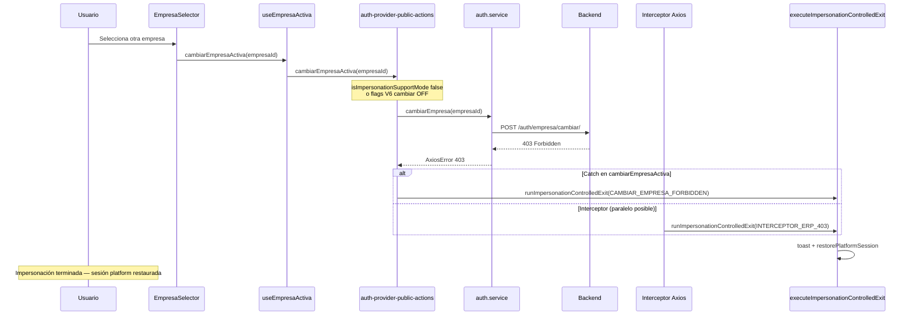
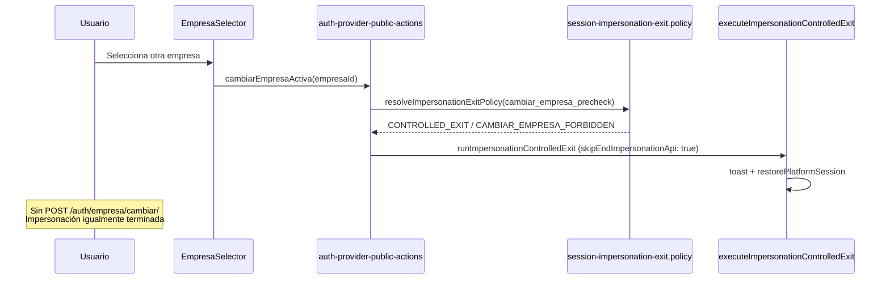
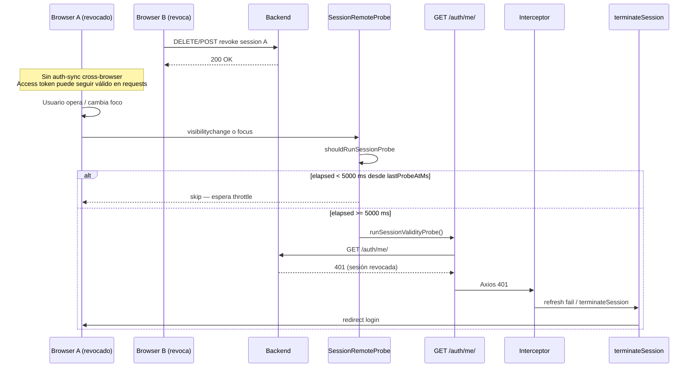

# POST-CERTIFICATION FRONTEND BUG AUDIT

**Alcance:** IAM Session Management V2 — investigación post-certificación (READ ONLY)  
**Fecha:** 2026-06-23  
**Precedencia:** `IAM_SESSION_MANAGEMENT_V2_BACKEND_SPECIFICATION.md` · `FRONTEND_IAM_V2_COMPLIANCE_CERTIFICATE.md`  
**Modo:** Dictamen técnico — sin implementación, sin fixes, sin PR

---

## Resumen ejecutivo

| Bug | Severidad | Clasificación | ¿Exclusivo Frontend? |
|-----|-----------|---------------|------------------------|
| **P0** — Cambio de empresa durante impersonación | **P0** | Regresión funcional / desalineación UX post-cert vs comportamiento certificado F6 | **Sí** (causa raíz y mecanismo de salida); Backend 403 es respuesta correcta §13.5 |
| **P1** — Revocación remota ~5 s | **P1** | Comportamiento diseñado (throttle probe) + ventana operativa access token | **Mayormente Frontend** (timer 5 s); **contribución Backend** posible vía fail-soft Redis §12.3 |

---

## Bug P0 — Cambio de empresa durante impersonación

### Comportamiento esperado (incidencia)

Con `is_impersonation=true`, al pulsar **Cambiar Empresa**:

- Bloqueo inmediato en cliente con mensaje al usuario.
- Sin llamada a `POST /auth/empresa/cambiar/`.
- Sin refresh.
- Sin terminar la impersonación.

### Comportamiento observado

1. Usuario en modo soporte (impersonación).
2. Click en selector de empresa.
3. Frontend invoca `POST /auth/empresa/cambiar/`.
4. Backend responde **403** (correcto según spec §13.5).
5. Frontend abandona la impersonación de forma brusca (restore sesión platform).

---

### Causa raíz

La causa raíz es **Frontend**, compuesta por tres capas acopladas:

#### 1. Política Fase 6 certificada: salida controlada, no bloqueo in-place

El diseño implementado y certificado en **IAM-FE-PHASE-06** no define un guard de «rechazar y permanecer en impersonación». Define **`CONTROLLED_EXIT`**: toast + `restorePlatformSession` + redirect opcional a Platform Admin.

| Contexto | Política (`session-impersonation-exit.policy.ts`) | Acción |
|----------|-----------------------------------------------------|--------|
| `cambiar_empresa_precheck` | `CONTROLLED_EXIT` → source `CAMBIAR_EMPRESA_FORBIDDEN` | Termina impersonación **sin** llamar API (si flags ON y modo soporte detectado) |
| `cambiar_empresa_forbidden` | Idem (403 en catch) | Termina impersonación tras 403 |
| Interceptor 403 ERP en soporte | `CONTROLLED_EXIT` → `INTERCEPTOR_ERP_403` | Termina impersonación |

Documento de diseño: `docs/arquitectura/IAM_FE_PHASE_06_TECHNICAL_DESIGN.md` §6.2, §7.2, §12.1 (ME-02: «Prohibido `cambiarEmpresaActiva` en soporte — pre-check F6»).

**Conclusión:** El mensaje *«Cambio de empresa no permitido en modo soporte.»* existe, pero está acoplado a **`executeImpersonationControlledExit`**, que **siempre** ejecuta `restorePlatformSession`. No existe rama de política «bloquear sin salir de impersonación».

#### 2. Capa UI sin guard de impersonación

La UI permite la interacción durante impersonación:

| Componente | Comportamiento actual | Guard impersonación |
|------------|----------------------|---------------------|
| `Header.tsx` | Renderiza `<EmpresaSelector />` sin condicionar `isImpersonation` | **Ausente** (contrasta con `showLogoutAllOption` que sí usa `!isImpersonation`) |
| `useEmpresaActiva.ts` | `canSwitchEmpresa = empresasElegibles.length > 1` | **Ausente** — no consulta `isImpersonation` |
| `EmpresaSelector.tsx` | `handleSelect` → `cambiarEmpresaActiva(nextId)` directo | **Ausente** |

El dropdown permanece interactivo en impersonación si el usuario tiene más de una empresa elegible.

#### 3. Por qué se observa la llamada HTTP (cuando el pre-check F6 no corta el flujo)

El pre-check en `cambiarEmpresaActiva` **solo** evita la API si se cumplen **simultáneamente**:

1. `isImpersonationSupportMode(authRef.current.token) === true`  
   (`hasPlatformParentSession() || isImpersonationToken(token)` — `impersonation-fe-log.ts`)
2. Flags V6 activos: `SESSION_IMPERSONATION_V6_ENABLED` y `SESSION_IMPERSONATION_CAMBIAR_EMPRESA_V6_ENABLED`
3. `resolveImpersonationExitPolicy` devuelve `action: 'CONTROLLED_EXIT'`

Si cualquiera falla → flujo cae al `try` y ejecuta `authService.cambiarEmpresa` → **403 Backend** → catch o interceptor → salida controlada.

Escenarios que explican la llamada HTTP observada:

| Escenario | Efecto |
|-----------|--------|
| Flags V6 / sub-flag cambiar empresa desactivados en build (`VITE_*` = false) | Pre-check → `REJECT_LEGACY`; API se invoca |
| `isImpersonationSupportMode()` false en el instante del click (token ref sin claim + parent session ausente en `sessionStorage`) | Bloque pre-check omitido; API se invoca |
| Flags ON + soporte detectado | **No debería** llamar API, pero **sí** termina impersonación vía pre-check (misma UX brusca, sin 403) |

---

### Respuestas a objetivos de auditoría P0

| # | Pregunta | Respuesta |
|---|----------|-----------|
| 1 | ¿Dónde se originaba el guard en la versión anterior? | El guard certificado F6 vive en **`auth-provider-public-actions.ts`** → `cambiarEmpresaActiva`, contexto `cambiar_empresa_precheck` (IMPL-07, regresión `auth-phase-06-regression.test.ts`). **No** existió guard en `EmpresaSelector` / `useEmpresaActiva` en el árbol actual (historial git: un solo commit base). Pre-F6 (flags OFF): flujo legacy sin pre-check → API directa. |
| 2 | ¿Qué componente eliminó o dejó de ejecutar dicho guard? | **Ningún componente UI eliminó un guard de impersonación** — nunca existió en la capa UI. Si la incidencia implica llamada HTTP, el pre-check F6 **no se ejecutó como `CONTROLLED_EXIT` antes del POST** (flags OFF o `isImpersonationSupportMode` false). No hay evidencia de regresión por borrado de guard UI. |
| 3 | ¿Qué componente invoca `POST /auth/empresa/cambiar/`? | Cadena: **`EmpresaSelector.handleSelect`** → **`useEmpresaActiva.cambiarEmpresaActiva`** (proxy `useAuth`) → **`auth-provider-public-actions.ts`** L302-303 → **`auth.service.ts`** `cambiarEmpresa` → `api.post('/auth/empresa/cambiar/')`. |
| 4 | ¿Por qué tras el 403 la UI abandona impersonación? | **`resolveImpersonationExitPolicy`** (`cambiar_empresa_forbidden`) → **`runImpersonationControlledExit`** → **`executeImpersonationControlledExit`** (`session-impersonation-exit.ts`): toast + **`restorePlatformSession`**. Alternativa paralela: **interceptor** (`auth-provider-interceptors.compositor.ts` L268-297) ante 403 en modo soporte. |
| 5 | ¿Interceptor / refresh / AuthContext / efectos secundarios? | **Sí.** Interceptor Axios 403 en soporte dispara el mismo orchestrator F6. **No** hay refresh plataforma en soporte (IM-01/IM-02). **`EmpresaSelector`** puede emitir toast de error adicional solo si el error se propaga (`REJECT_LEGACY`); con `CONTROLLED_EXIT` retorna `null` sin throw. |
| 6 | Componente / archivo responsable | **Decisión de invocar API:** `auth-provider-public-actions.ts` (`cambiarEmpresaActiva`). **Decisión de terminar impersonación:** `session-impersonation-exit.policy.ts` + `session-impersonation-exit.ts` + wiring en `auth-provider-public-actions.ts` e `auth-provider-interceptors.compositor.ts`. **Habilitación UI sin bloqueo:** `useEmpresaActiva.ts` + `EmpresaSelector.tsx` + `Header.tsx`. |

---

### Flujo completo P0 (ruta observada — API + 403)



### Flujo alterno P0 (pre-check F6 activo — sin API, misma UX de salida)



---

### Archivos involucrados P0

| Archivo | Rol |
|---------|-----|
| `src/shared/components/layout/EmpresaSelector.tsx` | Dispara cambio de empresa; sin guard impersonación |
| `src/shared/components/layout/Header.tsx` | Monta selector sin condicionar `isImpersonation` |
| `src/features/auth/hooks/useEmpresaActiva.ts` | `canSwitchEmpresa` sin `isImpersonation` |
| `src/core/auth/provider/auth-provider-public-actions.ts` | `cambiarEmpresaActiva` — pre-check, catch 403, invocación API |
| `src/features/auth/services/auth.service.ts` | `cambiarEmpresa` → POST `/auth/empresa/cambiar/` |
| `src/core/auth/session/session-impersonation-exit.policy.ts` | Política `CONTROLLED_EXIT` para cambiar empresa |
| `src/core/auth/session/session-impersonation-exit.ts` | Orchestrator — toast + `restorePlatformSession` |
| `src/core/auth/session/session-impersonation.flags.ts` | Flags V6 compile-time |
| `src/core/auth/utils/impersonation-fe-log.ts` | `isImpersonationSupportMode` |
| `src/core/auth/provider/auth-provider-interceptors.compositor.ts` | 401/403 ERP en soporte → controlled exit |
| `docs/arquitectura/IAM_FE_PHASE_06_TECHNICAL_DESIGN.md` | Diseño certificado F6 (pre-check = exit, no block) |

---

### Severidad y clasificación P0

| Atributo | Valor |
|----------|-------|
| **Severidad** | **P0** — acción prohibida en modo soporte provoca terminación no deseada de impersonación |
| **Clasificación** | **Bug funcional Frontend** + **desalineación semántica** entre expectativa post-cert (bloqueo in-place) y diseño F6 certificado (controlled exit). Backend cumple contrato §13.5 (403). |
| **Dependencia Backend** | **No** para la causa del abandono brusco; el 403 es la respuesta esperada. El Frontend **no debería depender** del 403 si el pre-check V6 está activo, pero la política F6 interpreta tanto pre-check como 403 como **salida**, no como rechazo local. |

---

## Bug P1 — Revocación de sesión tarda ~5 segundos

### Escenario

| Paso | Actor |
|------|-------|
| 1 | Browser A — sesión activa operando |
| 2 | Browser B — revoca sesión de Browser A |
| 3 | Browser A — continúa operativo ~5 s |
| 4 | Browser A — detecta cierre y redirige |

---

### Causa raíz

La latencia observada (~5 s) corresponde al **throttle intencional** del probe remoto de sesión introducido en **IAM-FE-PHASE-03** (`IAM-FE-REMOTE-REVOCATION-THROTTLE-PATCH-01`).

Constante:

```typescript
// src/core/auth/session/session-remote-probe.ts
DEFAULT_SESSION_PROBE_POLICY.minIntervalMs: 5_000  // 5 segundos
```

Documentación de aceptación alineada: `IAM_SESSION_ALIGNMENT_PLAN_V1.md` ítem 35 / V3.3 — *«Detección y terminación ≤ 5 s + RTT tras focus/visibility»*.

**No es polling continuo.** Es detección **reactiva** a eventos DOM con throttle.

---

### Mecanismo de detección actual

| Mecanismo | ¿Existe? | Detalle |
|-----------|----------|---------|
| `setInterval` / polling periódico | **No** | — |
| Heartbeat dedicado | **No** | — |
| React Query refetch interval sesión | **No** | — |
| **`SessionRemoteProbe`** focus + visibility | **Sí** | `useSessionRemoteProbe.ts` — listeners `visibilitychange` + `window.focus` |
| Throttle **5 s** entre probes | **Sí** | `shouldRunSessionProbe` + `minIntervalMs: 5_000` |
| Debounce focus **500 ms** | **Sí** | `debounceFocusMs: 500` |
| Probe vía `GET /auth/me/` | **Sí** | `runSessionValidityProbe` → `authService.me()` |
| Interceptor 401 → refresh → terminate | **Sí** | Path pasivo en cualquier request API cuando el access/refresh ya no es válido |
| Post-revoke probe inmediato | **Solo en el browser que revoca** | `iam-session-revoke.utils.ts` — probe si `isCurrentSession(target)` en **ese** cliente |
| Auth-sync cross-browser | **No** | `session-auth-sync-channel` — multi-pestaña mismo origen; **no** sincroniza Browser A ↔ Browser B distintos |
| Timer cliente idle | **No** | Spec: detección transparente vía refresh 401 (`IAM_SESSION_FRONTEND_ARCHITECTURE_V1.md` §8) |

---

### Respuestas a objetivos de auditoría P1

| # | Pregunta | Respuesta |
|---|----------|-----------|
| 1 | ¿Cómo detecta el FE que una sesión fue revocada? | (a) **Probe remoto** en focus/visibility → `GET /auth/me/` → 401 manejado por interceptor → `terminateSession`. (b) **Pasivo:** cualquier request ERP que dispare refresh fallido → 401 → terminación. (c) **Post-revoke local:** solo si el mismo browser revoca su propia sesión actual. |
| 2 | ¿Polling / heartbeat / timer? | **No polling.** **Sí timer de política:** throttle **5000 ms** entre probes permitidos. Eventos: `visibilitychange`, `focus`. |
| 3 | ¿Por qué ~5 segundos? | **`minIntervalMs: 5_000`** en `DEFAULT_SESSION_PROBE_POLICY`. Si el último probe fue hace menos de 5 s, `shouldRunSessionProbe` retorna false hasta cumplir el intervalo + debounce 500 ms + RTT del `/me/`. |
| 4 | ¿Origen del tiempo? | **Frontend — diseño explícito** (`session-remote-probe.ts`, Fase 03). Contribución adicional **Backend:** access token puede seguir aceptándose brevemente si Redis blacklist falla (fail-soft §12.3), extendiendo operatividad más allá del probe. |
| 5 | ¿Diseñado o efecto secundario? | **Diseñado.** Documentado en `IAM_FE_PHASE_03_TECHNICAL_DESIGN.md` (throttle 5 s post THROTTLE-01), `IAM_FE_PHASE_04/05` (sin cambio), criterio V3.3 alignment plan. |
| 6 | Componente responsable | **`SessionRemoteProbeBinder`** (`auth-provider-telemetry-ux.compositor.tsx`) → **`useSessionRemoteProbe`** → **`evaluateSessionRemoteProbe`** → **`shouldRunSessionProbe`** (`session-remote-probe.ts`) → **`runSessionValidityProbeForSession`** (`auth-provider-termination.compositor.ts`) → interceptor en 401. |

---

### Flujo completo P1 (Browser B revoca → Browser A detecta)



---

### Archivos involucrados P1

| Archivo | Rol |
|---------|-----|
| `src/core/auth/session/session-remote-probe.ts` | Política throttle **5 s** |
| `src/core/auth/session/useSessionRemoteProbe.ts` | Lifecycle DOM + evaluación probe |
| `src/core/auth/provider/auth-provider-telemetry-ux.compositor.tsx` | Monta `SessionRemoteProbeBinder` |
| `src/core/auth/provider/auth-provider-termination.compositor.ts` | `runSessionValidityProbeForSession` |
| `src/core/auth/provider/auth-provider-termination.helpers.ts` | `runSessionValidityProbe` → `authService.me()` |
| `src/core/auth/provider/auth-provider-interceptors.compositor.ts` | 401 → refresh / terminate |
| `src/core/auth/session/session-logout-v3.flags.ts` | `SESSION_REMOTE_PROBE_ENABLED` |
| `src/features/admin/utils/iam-session-revoke.utils.ts` | Probe post-revoke **solo cliente local** |
| `docs/arquitectura/IAM_FE_PHASE_03_TECHNICAL_DESIGN.md` | Diseño throttle 5 s |
| `docs/arquitectura/IAM_SESSION_ALIGNMENT_PLAN_V1.md` | Criterio V3.3 latencia ≤ 5 s |

---

### Severidad y clasificación P1

| Atributo | Valor |
|----------|-------|
| **Severidad** | **P1** — ventana operativa post-revocación remota; no bloquea certificación pero impacta seguridad percibida |
| **Clasificación** | **Comportamiento diseñado Frontend** (throttle probe Fase 03). No es bug de implementación accidental del timer. La incidencia reportada coincide con el SLA documentado «≤ 5 s + RTT». |
| **Dependencia Backend** | Revocación en BD es inmediata. Latencia de **detección** es responsabilidad Frontend. Backend puede **ampliar** ventana operativa si el access JWT sigue válido (fail-soft Redis §12.3) — factor secundario, no origen del «~5 s» reproducible. |

---

## Conclusión

### Bug P0

| Pregunta | Dictamen |
|----------|----------|
| ¿Exclusivo Frontend? | **Sí** en causa raíz y mecanismo de abandono brusco. |
| ¿Depende del Backend? | El **403** es respuesta correcta §13.5; el Frontend **no debería necesitarlo** si el pre-check V6 corta antes del POST, pero la política certificada F6 trata cambiar empresa (pre-check **y** 403) como **`CONTROLLED_EXIT`**, no como bloqueo local sin terminar impersonación. |
| Causa raíz en una línea | **Ausencia de guard UI + política F6 `CONTROLLED_EXIT` en `cambiarEmpresaActiva`/interceptor** en lugar de rechazo cliente in-place; la llamada HTTP observada indica además que el pre-check no impidió el POST (flags V6 off o `isImpersonationSupportMode` false). |

### Bug P1

| Pregunta | Dictamen |
|----------|----------|
| ¿Exclusivo Frontend? | **Mayormente sí** — el intervalo ~5 s proviene del throttle **`minIntervalMs: 5_000`** en `session-remote-probe.ts`, diseño Fase 03 certificado. |
| ¿Depende del Backend? | **Parcialmente** — fail-soft Redis puede mantener access válido tras revocación BD; no explica por sí solo el patrón «~5 s» alineado al throttle FE. |
| Causa raíz en una línea | **Detección reactiva (focus/visibility) con throttle intencional de 5 segundos**; no hay polling cross-browser; Browser A no recibe evento de Browser B. |

### Veredicto global

| Bug | Frontend | Backend |
|-----|----------|---------|
| **P0** | **Responsable principal** — UI, política F6, orchestrator exit | Solo emite 403 esperado; no causa la salida brusca |
| **P1** | **Responsable del delay ~5 s** — throttle probe | Revocación inmediata en BD; posible extensión access por fail-soft |

**Ambos bugs se manifiestan y se resuelven en el plano Frontend para su comprensión operativa.** Ninguno indica defecto del contrato Backend IAM V2 certificado. P0 refleja desalineación entre expectativa operativa post-cert y diseño F6 implementado. P1 refleja comportamiento dentro del SLA documentado de detección remota (≤ 5 s + RTT).

---

*Fin del dictamen — POST-CERTIFICATION FRONTEND BUG AUDIT*
