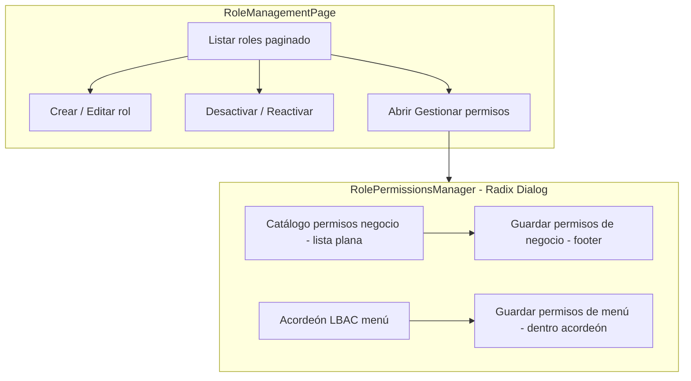

# Sprint C — Auditoría previa RBAC / Roles / Permisos (frontend)

**Fecha:** 31 mayo 2026  
**Estado:** Análisis completado — **sin implementación**  
**Alcance:** Solo código de este repositorio frontend  
**Contexto externo (validado en QA, no auditable aquí):** RBAC V1 estable — `ADMIN_TENANT` (OWNER_FULL), `MANAGER_TENANT` (MANAGER_STANDARD), `USER_TENANT` (USER_STANDARD), multiempresa M1/M4, CRUD usuarios/roles, asignación/revocación, 403 sin roles.

**Referencias internas:** `IAM_UX_FOUNDATION_IMPLEMENTATION_PLAN.md` (FE-1), `TENANT_ADMIN_IAM_UX_AUDIT.md`, `SPRINT_B1_RUNTIME_FIX_AUDIT.md` (patrón modales), infra IAM Sprint A/B (`src/features/admin/components/iam/`).

**Excluido:** Repositorio backend, cambios de contrato API, `AuthContext`, `PermissionGuard`, menú runtime `/auth/menu`.

---

## 1. Resumen ejecutivo

| Área | Estado UX | Listo para Tenant Admin no técnico |
|------|-----------|-------------------------------------|
| **UserManagementPage** | Mejorado (Sprint B/B.1) | Parcial — multiempresa fuera de alcance |
| **RoleManagementPage** | **Pre-Sprint C** — deuda alta vs usuarios | **No** |
| **RolePermissionsManager** | Funcional pero confuso | **No** |
| **Infra IAM reutilizable** | Disponible (Sprint A) | Lista para adoptar en C/D |
| **Utilidades RBAC** | `permiso-catalog-groups.ts` **existe pero no se usa** | Pendiente Sprint D |

**Veredicto:** Sprint C debe **igualar la madurez de RoleManagementPage a UserManagementPage** (tabla, modales, guards, nomenclatura). La experiencia RBAC profunda (catálogo agrupado, guardado único, LBAC claro) corresponde a **Sprint D** sobre `RolePermissionsManager`, pero esta auditoría la documenta ahora para no repetir hallazgos y para ordenar dependencias.

---

## 2. Inventario de código analizado

| Archivo / módulo | Rol en el sistema |
|------------------|-------------------|
| `src/features/admin/pages/RoleManagementPage.tsx` | Listado CRUD roles, modales legacy, apertura permisos |
| `src/features/admin/components/RolePermissionsManager.tsx` | Modal Radix: RBAC negocio + LBAC menú |
| `src/features/admin/services/rol.service.ts` | GET/POST/PUT/DELETE `/roles/` |
| `src/features/admin/services/permisos-negocio.service.ts` | Catálogo + PUT `permisos-negocio` |
| `src/features/admin/services/permission.service.ts` | GET/PUT permisos menú por rol |
| `src/features/admin/utils/permiso-catalog-groups.ts` | Agrupación catálogo (**no consumida**) |
| `src/features/admin/types/rol.types.ts` | `codigo_rol`, `cliente_id` en modelo |
| `src/features/admin/types/permisos-negocio.types.ts` | Catálogo RBAC V1 |
| `src/features/admin/types/permission.types.ts` | `MenuPermissions` (7 acciones) |
| `src/features/admin/components/iam/*` | Componentes Sprint A/B (reutilizables) |
| `src/config/adminMenu.ts` | Ruta `/admin/roles` |

---

## 3. Flujos Tenant Admin actuales



**Observación:** El administrador percibe **dos sistemas de permisos** con **dos guardados**, mientras el copy dice que el menú “se configura automáticamente” según permisos de negocio.

---

## 4. Hallazgos P0 (críticos)

| ID | Hallazgo | Componente | Impacto |
|----|----------|------------|---------|
| **P0-C1** | **Columna `ID` con UUID completo** en tabla de roles | `RoleManagementPage` | Admin no técnico copia/confunde IDs; inconsistencia vs usuarios (Sprint B ya ocultó UUID) |
| **P0-C2** | **Dos botones de guardado** sin estado “cambios pendientes” global | `RolePermissionsManager` | Guardado parcial (solo negocio o solo menú); sensación de bug; riesgo de configuración incompleta |
| **P0-C3** | **LBAC: solo “Ver” es editable**; `crear`/`editar`/`eliminar` se cargan en estado pero **no hay UI** para cambiarlos | `RolePermissionsManager` | Admin cree que configuró CRUD en pantalla; desalineación con copy del acordeón |
| **P0-C4** | **`puede_crear` no se envía al guardar menú** — el array incluye `puede_crear` pero `updateRolePermissionsBatch` solo PUT `puede_ver`, `puede_editar`, `puede_eliminar` | `RolePermissionsManager` + `permission.service.ts` | Deriva silenciosa: permisos cargados ≠ permisos persistidos |
| **P0-C5** | **Fallo al cargar permisos menú → `{}` silencioso** (catch en `loadData` retorna objeto vacío) | `RolePermissionsManager` | Matriz LBAC vacía sin explicar; admin puede marcar “Ver” sobre árbol incorrecto |
| **P0-C6** | **Modales create/edit/desactivar en RoleManagement** son `fixed inset-0` legacy (click fuera cierra, **sin dirty confirm**) | `RoleManagementPage` | Misma clase de riesgo que Sprint B pre-B.1; al abrir encima `RolePermissionsManager` (Radix) aumenta complejidad de overlays |
| **P0-C7** | **Sin vista de permisos efectivos** al asignar roles a usuarios | IAM global | Admin no valida “¿qué podrá hacer Juan con Gerente + Consulta?” sin abrir cada rol |

---

## 5. Hallazgos P1 (importantes)

| ID | Hallazgo | Componente |
|----|----------|------------|
| **P1-C1** | Nomenclatura **“Rol”** en UI vs **“Perfil”** en usuarios (Sprint B) | `RoleManagementPage`, `RolePermissionsManager` |
| **P1-C2** | Catálogo RBAC **lista plana** sin agrupar — util `groupPermisoCatalog` **no integrada** | `RolePermissionsManager` |
| **P1-C3** | Copy principal invierte prioridad: dice menú automático; lo visible primero es lista plana de códigos API | `RolePermissionsManager` |
| **P1-C4** | Tras **crear rol**, no hay guía a **configurar permisos** (paso huérfano) | `RoleManagementPage` |
| **P1-C5** | **Sin métricas en tabla:** usuarios por rol, permisos asignados | `RoleManagementPage` |
| **P1-C6** | `RoleManagementPage` **no espera `authLoading`** antes de `fetchRoles` (race vs usuarios) | `RoleManagementPage` |
| **P1-C7** | Acciones solo iconos (`Edit3`, `KeyRound`, `EyeOff`) sin texto visible | `RoleManagementPage` |
| **P1-C8** | Guardado LBAC: **N× PUT** en paralelo (`updateRolePermissionsBatch` — uno por menú) | `permission.service.ts` |
| **P1-C9** | Mensajes 403 con códigos técnicos (`admin.rol.leer`, `admin.rol.actualizar`) | `RolePermissionsManager` |
| **P1-C10** | Desactivar rol **sin advertencia** de usuarios afectados ni efecto en sesiones | `RoleManagementPage` |
| **P1-C11** | Campo `codigo_rol` en tipo `Rol` pero **no visible** en UI — roles sistema (`ADMIN_TENANT`, etc.) no distinguibles de custom | `RoleManagementPage` |
| **P1-C12** | `getAuthMenu()` para árbol LBAC — estructura del **menú del tenant**, no vista “solo lo que vería este rol” hasta marcar Ver | `RolePermissionsManager` |
| **P1-C13** | Cerrar `RolePermissionsManager` sin confirmación si hay cambios sin guardar | `RolePermissionsManager` |
| **P1-C14** | Error TypeScript en build: `map` sobre permisos con tipo incompatible (línea ~294) | `RolePermissionsManager` |

---

## 6. Hallazgos P2 (mejoras)

| ID | Hallazgo |
|----|----------|
| **P2-C1** | Empty state roles: solo texto, sin icono ni CTA (usuarios ya usa `IamTableEmptyState`) |
| **P2-C2** | Descripción truncada a una línea (`max-w-xs truncate`) |
| **P2-C3** | `console.log` de debug en `RolePermissionsManager` (carga, permisos, render) |
| **P2-C4** | Sin filtros: activo/inactivo, “solo personalizados”, búsqueda por `codigo_rol` |
| **P2-C5** | Sin duplicar rol / plantilla desde rol existente |
| **P2-C6** | Sin mostrar `fecha_creacion` / última modificación de permisos |
| **P2-C7** | Sin audit trail UI (“quién cambió permisos del perfil X”) |
| **P2-C8** | Paginación roles solo prev/next (aceptable FE-1; mejora futura) |
| **P2-C9** | `useDebounce` ya canónico en roles; modales roles aún no usan patrón discard padre (B.1.1) |

---

## 7. Gaps vs modelo RBAC empresarial moderno (solo FE observable)

| Capacidad moderna | Estado en frontend |
|-------------------|-------------------|
| Perfiles/plantillas predefinidos (`OWNER_FULL`, `MANAGER_STANDARD`, …) | Backend validado por QA; **FE no muestra plantillas ni bloquea edición de roles sistema** |
| Separación clara **acciones API (RBAC)** vs **pantallas (LBAC)** | Existe en código; **UX mezcla prioridades** |
| Vista **permisos efectivos** (unión de roles del usuario) | **Ausente** |
| Agrupación por módulo/recurso/acción | Util preparada; **no usada** |
| Guardado atómico / transaccional | Dos saves independientes; riesgo estado mixto |
| Principio de mínimo privilegio asistido | Sin warnings al otorgar permisos amplios |
| Alcance multiempresa en IAM | **Fuera de alcance** — gap documentado globalmente |
| Herencia rol → menú coherente con negocio | Copy afirma automatización; LBAC sigue siendo manual opcional |
| Impacto de desactivar rol (usuarios, sesiones) | **No calculado en UI** |
| Historial / compliance | **No visible** |

---

## 8. Información que hoy no se muestra al administrador

| Dato | Disponible en API/tipos | Mostrado en UI |
|------|-------------------------|----------------|
| `codigo_rol` (rol sistema vs custom) | `Rol.codigo_rol` | No |
| Usuarios con este perfil | Agregable vía `GET /usuarios/` | No |
| Conteo permisos negocio + menú | `permisos-negocio` + `permisos/roles/...` | No |
| `descripcion` de permiso en catálogo | `PermisoCatalogoItem.descripcion` | No (solo nombre/código) |
| `recurso` / `accion` estructurados | Catálogo | No (solo en agrupador no usado) |
| Permisos extra menú (`exportar`, `imprimir`, `aprobar`) | GET los trae | No editables ni visibles |
| Último acceso / confirmación correo usuario | En usuarios | N/A en roles |
| Qué pantallas resultan visibles tras marcar acciones RBAC | Inferencia backend | No preview FE |

---

## 9. Riesgos de configuración incorrecta

### 9.1 Roles (`RoleManagementPage`)

| Riesgo | Escenario | Consecuencia |
|--------|-----------|--------------|
| Rol vacío de permisos | Crear rol → no abrir “Gestionar permisos” | Usuarios asignados → **403** (comportamiento RBAC V1 correcto pero sorprendente) |
| Desactivar rol con usuarios | Desactivar sin ver cuántos usuarios | Usuarios pierden capacidades sin mensaje claro en esta pantalla |
| Nombres duplicados / ambiguos | Solo validación `nombre` requerido | Confusión al asignar en usuarios |
| UUID como referencia | Columna ID visible | Errores al comunicar soporte |

### 9.2 Permisos (`RolePermissionsManager`)

| Riesgo | Escenario | Consecuencia |
|--------|-----------|--------------|
| Solo guardó “negocio” | Footer principal | Menú LBAC desactualizado → pantallas faltantes o de más |
| Solo guardó “menú” | Acordeón secundario | Acciones API insuficientes → **403** en operaciones |
| Marcó “Ver” sin entender árbol completo | LBAC masivo | Exposición de módulos enteros |
| Lista plana de 100+ permisos | Sin grupos/búsqueda | Omisiones o sobre-asignación por fatiga |
| Guardado parcial por red | N PUTs menú | Algunos menús actualizados, otros no — **sin rollback FE** |
| Cree que configuró CRUD en menú | Copy menciona crear/editar/eliminar | Solo `ver` persiste |

---

## 10. Escalabilidad

| Escenario | Comportamiento actual | Severidad |
|-----------|----------------------|-----------|
| **Muchos roles** (50+) | Paginación 10/página OK; sin filtros estado | Media |
| **Conteos permisos** (plan Sprint C) | Hasta 10 roles × 2 GET = 20 requests/página | Media — mitigar con cache + skeleton |
| **>100 usuarios** | Conteo usuarios/rol en cliente inviable | Media — umbral 100 planificado |
| **Catálogo grande** (RBAC V1) | Scroll lista plana `max-h-[50vh]` | Alta |
| **Menú profundo** | Árbol módulo → sección → menú sin virtualizar | Media-Alta |
| **Guardar menú** | `Promise.all` sobre todos los menús del estado, no solo diff | Alta (tiempo + fallos parciales) |

---

## 11. Comprensión para administradores no técnicos

| Fricción | Evidencia en código |
|----------|-------------------|
| Jerga “permisos de negocio” | Título sección en `RolePermissionsManager` |
| “Configuración avanzada” suena opcional/riesgosa | Acordeón LBAC |
| Códigos `inv.producto.crear` visibles | Labels con `(codigo)` |
| Dos guardados | Footer + botón interno acordeón |
| Iconos sin etiqueta | `RoleManagementPage` acciones |
| Rol ≠ Perfil | Inconsistencia cross-pantalla |
| Sin resumen “este perfil permite X” | Solo checklists |

**Quick wins de copy (Sprint C/D):** “Perfil de acceso”, “Qué puede hacer”, “Pantallas visibles”, ocultar códigos detrás de tooltip opcional.

---

## 12. Quick wins — alto impacto, bajo riesgo

| # | Quick win | Esfuerzo | Sprint sugerido |
|---|-----------|----------|-----------------|
| QW-1 | Eliminar columna UUID roles | Bajo | **C** |
| QW-2 | `IamSearchInput` + `IamTableEmptyState` en roles | Bajo | **C** |
| QW-3 | `ConfirmDialog` desactivar/reactivar (reemplazar modales confirm) | Bajo | **C** |
| QW-4 | Auth guard en `fetchRoles` | Bajo | **C** |
| QW-5 | Renombrar UI “Rol” → “Perfil” (copy) | Bajo | **C** |
| QW-6 | Tras crear perfil → toast con CTA “Configurar permisos” | Bajo | **C** |
| QW-7 | Integrar `groupPermisoCatalog` + búsqueda en catálogo | Medio | **D** |
| QW-8 | Un solo botón Guardar + indicador dirty | Medio | **D** |
| QW-9 | Aclarar LBAC: “Solo control de visibilidad (Ver)” hasta ampliar API/UI | Bajo | **D** |
| QW-10 | Error visible si falla GET permisos menú (no `{}`) | Bajo | **D** |
| QW-11 | Mostrar `descripcion` del permiso bajo el nombre | Bajo | **D** |
| QW-12 | Badge “Sistema” si `codigo_rol` presente (solo lectura) | Medio | **C** |

---

## 13. Qué refactorizar antes de nuevas funcionalidades

### 13.1 Orden de dependencias (recomendado)

```
Sprint A (hecho) → Sprint B (hecho) → Sprint C (RoleManagementPage)
                                      → Sprint D (RolePermissionsManager)
                                      → Sprint E (QA)
```

### 13.2 RoleManagementPage — refactor primero (Sprint C)

| Prioridad | Refactor | Por qué antes |
|-----------|----------|---------------|
| 1 | Tabla IAM (sin UUID, empty state, búsqueda) | Base visual alineada con usuarios |
| 2 | Modales → shadcn `Dialog` + **confirmación discard en padre** (patrón B.1.1) | Evitar regresión overlay |
| 3 | `ConfirmDialog` para desactivar/reactivar | Eliminar 2 modales duplicados |
| 4 | Auth guard | Estabilidad fetch |
| 5 | Hooks métricas (`useRoleUserCounts`, `useRolePermissionCounts`) + `RoleStatsCell` | Nueva funcionalidad sobre base sólida |

**No hacer aún en C:** tabs RBAC/LBAC, guardado unificado — pertenece a `RolePermissionsManager` (Sprint D).

### 13.3 RolePermissionsManager — refactor estructural (Sprint D, post-C)

| Bloque | Acción |
|--------|--------|
| Split | `RbacPermissionsPanel.tsx` + `LbacPermissionsPanel.tsx` |
| Tabs | `IamSegmentTabs`: Acciones \| Pantallas |
| Catálogo | Consumir `permiso-catalog-groups.ts` |
| Save | Footer único, dirty snapshot, confirm al cerrar |
| LBAC | Solo Ver (documentado); diff save menús modificados |
| Deuda | Corregir tipado TS línea ~294; gatear logs DEV |

### 13.4 No tocar en Sprint C

- `permission.service.ts` / `permisos-negocio.service.ts` (contratos)
- Lógica `updateRolePermissionsBatch` (salvo Sprint D acotado a diff)
- `RolePermissionsManager` estructura grande (solo abrir desde página ya funciona)

---

## 14. Evidencia técnica clave (código)

### 14.1 UUID en tabla roles

```301:312:src/features/admin/pages/RoleManagementPage.tsx
                <th scope="col" ...>ID</th>
                ...
                    <td ...>{rol.rol_id}</td>
```

### 14.2 Doble guardado permisos

```601:635:src/features/admin/components/RolePermissionsManager.tsx
                      <Button ... onClick={handleSaveChanges} ...>
                        ... Guardar permisos de menú
                      </Button>
...
          <Button ... onClick={handleSavePermisosNegocio} ...>
            ... Guardar permisos de negocio
```

### 14.3 Solo checkbox Ver en LBAC

```430:437:src/features/admin/components/RolePermissionsManager.tsx
            <Checkbox
              id={`perm-${node.menu_id}-ver`}
              checked={nodePermissions.ver}
              onCheckedChange={(checked) => handleViewPermissionChange(node.menu_id, !!checked)}
```

### 14.4 `puede_crear` omitido en PUT batch

```113:119:src/features/admin/services/permission.service.ts
        const payload: PermisoCreateUpdate = {
          puede_ver: permiso.puede_ver,
          puede_editar: permiso.puede_editar,
          puede_eliminar: permiso.puede_eliminar,
        };
```

### 14.5 Agrupador no usado

`src/features/admin/utils/permiso-catalog-groups.ts` exporta `groupPermisoCatalog` — **ningún import** desde `RolePermissionsManager.tsx`.

### 14.6 Infra IAM disponible para Sprint C

| Componente | Uso propuesto en C |
|------------|-------------------|
| `IamSearchInput` | Búsqueda roles |
| `IamTableEmptyState` | Tabla vacía |
| `IamSegmentTabs` | Reservado D |
| `iam-form-classes` | Modales create/edit |
| Patrón discard padre | Modales roles (como B.1.1) |

---

## 15. Riesgos de implementación Sprint C

| Riesgo | Prob. | Mitigación |
|--------|-------|------------|
| 20+ GET al cargar conteos permisos | Alta | Cache por `rol_id`, skeleton, `Promise.allSettled` |
| Conteo usuarios >100 | Media | Umbral + “—” + tooltip |
| Regresión overlay modales roles | Media | Patrón B.1.1 obligatorio; no anidar `ConfirmDialog` sobre Radix abierto |
| Confundir métricas con permisos efectivos usuario | Media | Copy: “resumen del perfil”, no “acceso efectivo del usuario” |
| Romper flujo abrir `RolePermissionsManager` | Baja | No modificar props `isOpen/rolId/rolName` en C |

---

## 16. Roadmap recomendado — Sprint C

Alineado con `IAM_UX_FOUNDATION_IMPLEMENTATION_PLAN.md` §9, ajustado post-cierre Sprint B.

### Sprint C — RoleManagementPage (1–2 días dev)

| Orden | ID | Entregable | Criterio de aceptación |
|-------|-----|------------|------------------------|
| **C1** | Tabla | Sin columna UUID; columnas: Nombre, Descripción, Usuarios, Permisos, Estado, Acciones | Paridad visual con usuarios |
| **C2** | IAM UX | `IamSearchInput`, `IamTableEmptyState`, descripción `line-clamp-2` | Empty con CTA “Crear perfil” |
| **C3** | Modales | `RoleCreateDialog` / `RoleEditDialog` (shadcn) + discard en **padre** | Sin overlay atrapado |
| **C4** | Confirm | `ConfirmDialog` desactivar/reactivar | Sin modales `fixed` duplicados |
| **C5** | Auth | Guard `authLoading \|\| !isAuthenticated` en fetch | Paridad usuarios |
| **C6** | Copy | “Perfil” en UI; botón “Permisos” visible en `md+` | Nomenclatura unificada |
| **C7** | Métricas | `useRoleUserCounts` (umbral 100) + `RoleStatsCell` | Celda usuarios o “—” |
| **C8** | Métricas | `useRolePermissionCounts` + cache sesión | Celda permisos con skeleton |
| **C9** | Flujo | Post-create: toast + opción abrir permisos del perfil creado | Cierra P1-C4 |
| **C10** | QA | Checklist §17 + lint/build archivos C | Sin regresión assign usuario |

**Estimación:** 1–2 días.

### Sprint D — RolePermissionsManager (siguiente, 2–3 días)

| Orden | Entregable |
|-------|------------|
| D1 | Tabs Acciones / Pantallas + `RbacPermissionsPanel` con `groupPermisoCatalog` |
| D2 | `LbacPermissionsPanel` + copy “solo visibilidad (Ver)” |
| D3 | Guardado unificado + dirty + confirm cerrar |
| D4 | Diff save menús; error visible si falla GET LBAC |
| D5 | Fix TS build; reducir logs DEV |

### Sprint E — QA IAM completo

Checklist FE-1 §11 + regresión RBAC V1 (perfiles estándar tenant).

---

## 17. Checklist QA — Sprint C (previsto)

### RoleManagementPage

- [ ] Tabla sin UUID
- [ ] Búsqueda con debounce
- [ ] Empty state con icono y CTA
- [ ] Crear perfil: modal Dialog; cancelar dirty → confirm padre; sin overlay negro
- [ ] Editar perfil: idem
- [ ] Desactivar / reactivar: `ConfirmDialog`
- [ ] Abrir permisos: `RolePermissionsManager` sigue funcionando
- [ ] Con ≤100 usuarios: columna usuarios muestra conteo coherente
- [ ] Con >100 usuarios: “—” + tooltip
- [ ] Columna permisos: skeleton luego número (o “—” si error)
- [ ] Sin fetch roles antes de auth listo
- [ ] Crear rol → invitación a configurar permisos

### No regresión (RBAC V1 validado en entorno)

- [ ] Asignar perfil a usuario (desde usuarios) sin cambios
- [ ] Usuario sin perfiles → 403 esperado
- [ ] Perfiles `ADMIN_TENANT` / `MANAGER_TENANT` / `USER_TENANT` listados (si existen en tenant)

### Instrumentación UPDATE_USER (pendiente QA post-B)

- [ ] Tras Sprint C, repetir edición usuario y capturar `[IAM UserManagement] UPDATE_USER` (sin cambios en C)

---

## 18. Oportunidades (post FE-1)

| Oportunidad | Valor negocio |
|-------------|---------------|
| Vista permisos efectivos por usuario | Reduce tickets “no puede entrar” |
| Plantillas de perfil alineadas a `OWNER_FULL` / `MANAGER_STANDARD` | Onboarding tenant más rápido |
| Preview “pantallas visibles” tras cambiar acciones | Confianza del admin |
| Duplicar perfil como plantilla | Menos trabajo repetitivo |
| Filtro “solo perfiles personalizados” | Menos ruido con roles sistema |
| Multiempresa en IAM (fase posterior) | Alineación M1/M4 |

---

## 19. Conclusión para aprobación de Sprint C

| Pregunta | Respuesta |
|----------|-----------|
| ¿Listo Sprint C? | **Sí** — alcance acotado a `RoleManagementPage` con infra IAM existente |
| ¿Incluir RolePermissionsManager en C? | **No** — riesgo alto; reservar **Sprint D** |
| ¿Bloqueantes heredados de B? | Overlay resuelto en usuarios; **replicar patrón en modales roles** en C |
| ¿Backend requerido para C? | **No** — agregación client-side según plan FE-1 |

**Criterio de cierre Sprint C:** Tenant Admin puede gestionar perfiles (listar, crear, editar, activar/desactivar, ver métricas básicas, abrir permisos) con UX alineada a usuarios, sin UUID ni modales legacy frágiles.

---

*Documento generado para aprobación de alcance Sprint C. Sin cambios de código. Sin commit.*
