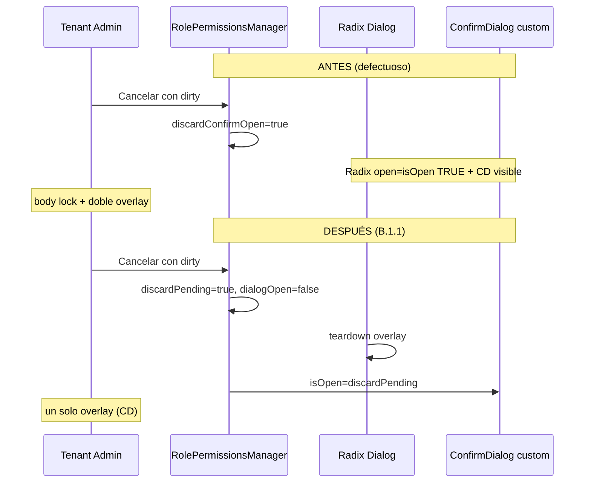

# Sprint D — B.1.1 Overlay fix (RolePermissionsManager)

**Fecha:** 31 mayo 2026  
**Estado:** Corregido — pendiente re-QA  
**Sin commit.**

---

## 1. Síntoma

Tras modificar permisos en `RolePermissionsManager` y pulsar **Cancelar** o **X** con cambios sin guardar: overlay negro persistente, página no interactiva, a veces requiere F5.

Mismo patrón que Sprint B pre-B.1.1 en `UserManagementPage`.

---

## 2. Flujo auditado



| Paso | Antes (bug) | Después (fix) |
|------|-------------|---------------|
| Dirty + cancelar | `Dialog open={isOpen}` + `ConfirmDialog` | `Dialog open={isOpen && !discardPending}` |
| Confirm visible | Radix aún montado con `open=true` | Radix `open=false`, solo ConfirmDialog |
| Seguir editando | CD cierra, Radix nunca cerró limpio | `discardPending=false` → Radix `open=true` |
| Sí, descartar | CD cierra + `onClose()` | Reset estado + `onClose()` padre |

---

## 3. Causa raíz

`ConfirmDialog` es un `fixed inset-0` **fuera** del portal Radix. Con el **Dialog Radix aún abierto** (`isOpen` del padre = true), coexisten:

1. Overlay Radix (`data-radix-dialog-overlay`) + focus trap + `body` `overflow:hidden` / `pointer-events:none`
2. Overlay custom de `ConfirmDialog`

Al cerrar solo el confirm, Radix puede dejar **body lock** u **overlay huérfano** (ver `SPRINT_B1_RUNTIME_FIX_AUDIT.md` §4).

---

## 4. Corrección aplicada

Patrón idéntico a `UserManagementPage` Sprint B.1.1:

```ts
const [discardPending, setDiscardPending] = useState(false);
const dialogOpen = isOpen && !discardPending;

// Dirty cancel → cerrar Radix primero
if (isDirty) {
  setDiscardPending(true);
  scheduleModalStackValidation('permissions-request-close-dirty');
  return;
}
```

- `Dialog open={dialogOpen}`
- `ConfirmDialog isOpen={discardPending}`
- Instrumentación: `scheduleModalStackValidation` en request-close, resume y confirm

**Archivo:** `src/features/admin/components/RolePermissionsManager.tsx`

**No se elevó al padre** (`RoleManagementPage`): el estado dirty vive en el manager; `isOpen` del padre permanece `true` durante el confirm para conservar el formulario (equivalente a mantener datos en create/edit con modal cerrado visualmente).

---

## 5. Checklist re-QA

- [ ] Marcar acción → Cancelar → un solo overlay (confirm)
- [ ] Seguir editando → vuelve modal permisos, cambios intactos, página usable
- [ ] Sí, descartar → vuelve tabla, sin overlay, sin F5
- [ ] Mismo flujo con X del Dialog y click fuera (si aplica)
- [ ] Tab Pantallas: dirty Ver → mismo flujo cancel
- [ ] Consola DEV: `[IAM Modal Cleanup] permissions-request-close-dirty` → `ok: true`
- [ ] Guardar exitoso → cierra sin regresión overlay

---

*Fix acotado a overlay stack. Sin cambios API ni runtime RBAC.*
