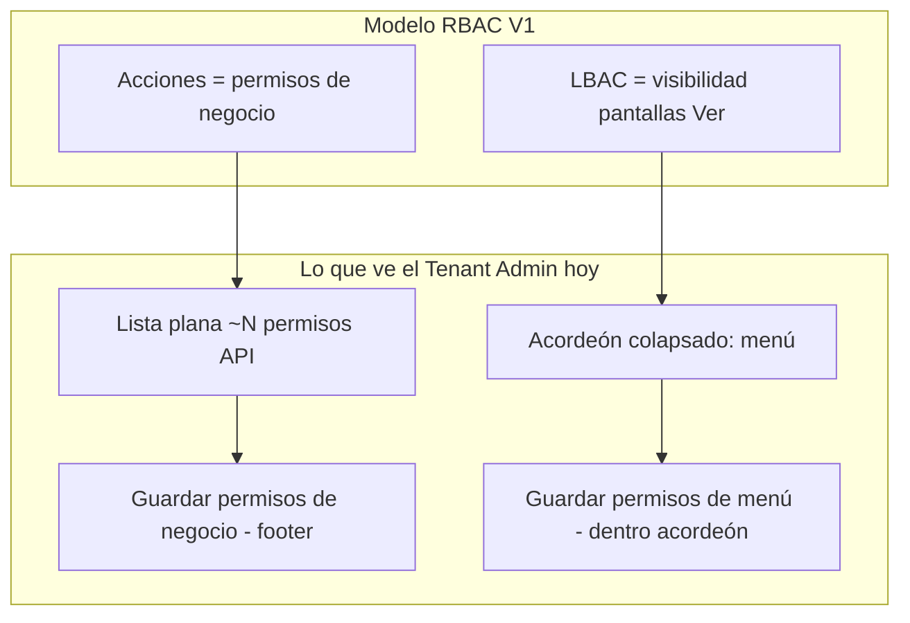

# Sprint D — Auditoría `RolePermissionsManager` y propuesta UX RBAC/LBAC

**Fecha:** 31 mayo 2026  
**Estado:** Análisis completado — **sin implementación**  
**Contexto:** Sprint C cerrado y validado en QA. Este documento responde a observaciones post-QA y define Sprint D exclusivamente en frontend.

**Referencias:** `SPRINT_C_RBAC_UX_AUDIT.md`, `IAM_UX_FOUNDATION_IMPLEMENTATION_PLAN.md` §6.3, `src/features/admin/utils/permiso-catalog-groups.ts`, `src/features/admin/components/RolePermissionsManager.tsx`.

**Excluido (restricciones explícitas):** AuthContext, PermissionGuard, menú dinámico runtime, RBAC runtime, multiempresa, contratos API, nuevos endpoints, cambios backend, refactor de reglas de autorización en servidor.

---

## 1. Resumen ejecutivo

| Área | Estado post Sprint C | Acción propuesta |
|------|----------------------|------------------|
| **RoleManagementPage** | Alineada a usuarios (B/B.1) | Mantener; micro-ajustes en D0 |
| **RolePermissionsManager** | Funcional; UX confusa | **Sprint D** (refactor UI, mismo wire-up API) |
| **Utilidad agrupación** | `groupPermisoCatalog` lista, **no usada** | Integrar en D2 |
| **Cierre modal tras guardar** | Inconsistente (menú sí, negocio no) | D0 o D3 |
| **Checkbox “Perfil activo” en crear** | Redundante | D0 |

**Veredicto:** Sprint D debe convertir `RolePermissionsManager` en un flujo de **dos dimensiones claras** (Acciones RBAC + Pantallas LBAC), con **un solo guardado**, **catálogo agrupado**, **copy alineado a RBAC V1**, y **paridad de cierre/refresh** con lo que el admin ya espera tras Sprint C.

---

## 2. Observaciones QA post Sprint C → trabajo propuesto

### 2.1 Modal de permisos abierto tras guardar

**Comportamiento actual (código):**

| Flujo | `onPermissionsUpdate` | `onClose` |
|-------|----------------------|-----------|
| Guardar **permisos de negocio** (`handleSavePermisosNegocio`) | Sí | **No** |
| Guardar **permisos de menú** (`handleSaveChanges`) | Sí | **Sí** |

```335:349:src/features/admin/components/RolePermissionsManager.tsx
  const handleSavePermisosNegocio = async () => {
    ...
      await updatePermisosNegocioByRol(rolId, { permiso_ids: selectedPermisoIds });
      toast.success(`Permisos de negocio para el rol "${rolName}" actualizados.`);
      onPermissionsUpdate?.();
    ...
  };
```

```385:390:src/features/admin/components/RolePermissionsManager.tsx
        await permissionService.updateRolePermissionsBatch(rolId, permisosArray);
        toast.success(`Permisos para el rol "${rolName}" actualizados.`);
        onPermissionsUpdate?.();
        onClose();
```

**Impacto UX:** El admin guarda acciones (flujo principal) y el modal sigue abierto; percibe que “no guardó” o debe cerrar manualmente.

**Propuesta:**

| Opción | Descripción | Recomendación |
|--------|-------------|---------------|
| **A — D0 rápido** | Tras éxito en `handleSavePermisosNegocio`, llamar `onClose()` igual que menú | Parche hasta D3 |
| **B — D3 definitivo** | Un solo botón “Guardar”; tras secuencia exitosa (negocio ± menú dirty), toast único + `onClose()` | Objetivo Sprint D |

**Métricas en tabla:** `RoleManagementPage` invalida caché en `handlePermissionsUpdate` pero **no** al cerrar sin guardar:

```163:174:src/features/admin/pages/RoleManagementPage.tsx
  const handleClosePermissionsModal = () => {
    setIsPermissionsModalOpen(false);
    ...
  };

  const handlePermissionsUpdate = () => {
    if (permissionsTargetRol) {
      invalidateRolePermissionCountsCache(permissionsTargetRol.id);
    }
  };
```

**Propuesta complementaria (D0):** En `handleClosePermissionsModal`, si hubo sesión de edición con al menos un guardado exitoso en la visita, invalidar de nuevo (flag `permissionsDirtySaved` en padre o callback `onClose` con `didSave`). Alternativa simple: invalidar siempre al cerrar el modal (coste: posible re-fetch de conteos al reabrir lista — aceptable con cache por `rol_id`).

---

### 2.2 Lista plana extensa de permisos de negocio

**Estado:** `catalogo.map` en lista única scroll ~50vh; sin búsqueda ni acordeones.

```506:533:src/features/admin/components/RolePermissionsManager.tsx
            {!loadingNegocio && !errorNegocio && catalogo.length > 0 && (
              <div className="space-y-2">
                ...
                <div className="max-h-[50vh] overflow-y-auto ...">
                  {catalogo.map((perm) => {
```

**Infra lista (Sprint A):** `groupPermisoCatalog`, `filterPermisoCatalog`, `groupFilteredPermisoCatalog` en `permiso-catalog-groups.ts` — **cero imports** desde `RolePermissionsManager`.

**Propuesta Sprint D:** Panel `RbacPermissionsPanel` con grupos colapsables por `recurso` → prefijo `codigo` → `modulo_id` → “General”, más `IamSearchInput` y contador “N/M seleccionados” por grupo.

---

### 2.3 Campo “Perfil activo” en creación

**Estado:** `RoleCreateDialog` expone checkbox; payload puede enviar `es_activo: false`.

```100:111:src/features/admin/components/iam/RoleCreateDialog.tsx
            <div className="flex items-center gap-2">
              <Checkbox id="create_es_activo" ... />
              <label ...>Perfil activo</label>
            </div>
```

**Propuesta D0 (fuera del modal permisos, ~15 min):**

- Eliminar checkbox del dialog de creación.
- Forzar `es_activo: true` en submit (`RoleManagementPage` / `initialCreateFormData`).
- Mantener activación/desactivación solo desde acciones de tabla (ya con `ConfirmDialog`).

**Nota:** `RoleEditDialog` puede conservar `es_activo` para correcciones puntuales sin ir a desactivar.

---

## 3. Auditoría técnica — `RolePermissionsManager` (estado actual)

### 3.1 Responsabilidades y APIs (sin cambio de contrato en D)

| Responsabilidad | Servicio | Endpoint (existente) |
|-----------------|----------|------------------------|
| Estructura menú tenant | `menuService.getAuthMenu()` | Auth menu |
| Permisos menú del rol (LBAC) | `permissionService.getRolePermissions` | `GET /permisos/roles/{id}/permisos/` |
| Actualizar menú (LBAC) | `permissionService.updateRolePermissionsBatch` | `PUT /permisos/roles/{id}/menus/{menu_id}/` (N llamadas) |
| Catálogo RBAC | `getPermisosCatalogo()` | `GET /permisos-catalogo/` |
| Permisos negocio del rol | `getPermisosNegocioByRol` / `updatePermisosNegocioByRol` | `GET/PUT .../permisos-negocio/` |

**Props públicas (no romper en D):** `isOpen`, `rolId`, `rolName`, `onClose`, `onPermissionsUpdate?`.

---

### 3.2 Modelo mental RBAC V1 vs UI actual



**Desalineación copy vs UI:**

- `DialogDescription` dice que el menú se configura “automáticamente” según permisos, pero lo **primero visible** es la lista plana de códigos API.
- Acordeón etiquetado “Configuración **avanzada**” sugiere opcional/secundario, cuando para muchos tenants la visibilidad de pantallas sigue siendo necesaria.

**Objetivo Sprint D:** Tabs **“Acciones”** / **“Pantallas”** con copy explícito (plan FE-1 §6.3.1).

---

### 3.3 Hallazgos P0 (bloquean confianza del admin)

| ID | Hallazgo | Evidencia | Sprint D |
|----|----------|-----------|----------|
| **D-P0-1** | **Doble guardado** sin estado global “cambios pendientes” | Footer negocio + botón menú en acordeón | D3 guardado unificado |
| **D-P0-2** | **LBAC: solo “Ver” editable**; copy del acordeón menciona crear/editar/eliminar | `renderMenuNode` un checkbox | D2 copy honesto; checkboxes extra = **FE-2** (requiere validar PUT) |
| **D-P0-3** | **`puede_crear` cargado en GET, no enviado en PUT batch** | `permission.service.ts` payload sin `puede_crear` | **Documentar** en UI LBAC; no “arreglar” en D sin confirmación backend |
| **D-P0-4** | **Fallo GET permisos menú → `{}` silencioso** | `.catch(() => ({}))` en `loadData` | D4 error visible + deshabilitar edición |
| **D-P0-5** | **Cerrar modal sin confirmar** si hay cambios sin guardar | `onOpenChange` solo bloquea si saving | D4 dirty + `ConfirmDialog` |
| **D-P0-6** | **Error TypeScript build** en `map` de permisos asignados | Línea ~294 | D5 fix tipado (`PermisoAsignadoItem`) |

---

### 3.4 Hallazgos P1 (importantes UX)

| ID | Hallazgo | Notas |
|----|----------|-------|
| **D-P1-1** | Sin búsqueda en catálogo ni en árbol menú | Plan: `IamSearchInput` en ambos tabs |
| **D-P1-2** | `_groupedMenuItems` calculado y no usado | Eliminar o reemplazar por jerarquía ya existente (`hierarchicalStructure`) |
| **D-P1-3** | `console.log` extensos en DEV (carga, render por nodo) | D5 gatear o eliminar |
| **D-P1-4** | Mensajes 403 con códigos `admin.rol.leer` | D2 copy amigable + enlace “contacte soporte” |
| **D-P1-5** | Título “rol” vs “perfil” | D1 copy: “Gestionar permisos del perfil «{nombre}»” |
| **D-P1-6** | Guardado menú envía **todos** los menús del estado, no diff | D3 solo menús modificados (mismos PUT) |
| **D-P1-7** | Carga negocio al abrir modal aunque el admin solo quiera pantallas | D1 lazy load por tab (opcional P2) |

---

### 3.5 Hallazgos P2 (pulido)

| ID | Hallazgo |
|----|----------|
| **D-P2-1** | Sin resumen “X acciones · Y pantallas” en header del modal |
| **D-P2-2** | Sin “Seleccionar todo / Ninguno” por grupo RBAC |
| **D-P2-3** | Dialog `sm:max-w-2xl` estrecho para árbol grande → `sm:max-w-3xl` |
| **D-P2-4** | Sin indicador de progreso en batch PUT (N menús) |

---

### 3.6 Deuda explícita fuera de Sprint D (FE-2+)

| Tema | Motivo |
|------|--------|
| UI checkboxes crear/editar/eliminar en LBAC | PUT actual no incluye `puede_crear`; ampliar payload = validar contrato |
| Vista “permisos efectivos” por usuario | Nueva superficie IAM |
| Preview “como vería el usuario X” | Requiere diseño y posible API |
| Agrupación por módulo con **nombres** de módulo (no solo prefijo código) | Catálogo expone `modulo_id` UUID; mapping opcional vía menú |

---

## 4. Propuesta Sprint D — alcance autorizado

### 4.1 Objetivo

Reorganizar **solo la capa de presentación e interacción** de `RolePermissionsManager` para que un Tenant Admin no técnico configure perfiles con claridad RBAC V1, **sin nuevos endpoints** y **sin alterar evaluación de permisos en runtime**.

### 4.2 Fuera de alcance (igual que Sprint C)

- AuthContext, PermissionGuard, `/auth/menu` runtime
- Multiempresa / headers empresa
- Cambios en `rol.service`, `permisos-negocio.service`, contratos OpenAPI
- Nuevos permisos backend / seeds
- Refactor de `RoleManagementPage` salvo hooks de invalidación (D0)

---

### 4.3 Fases recomendadas

#### D0 — Micro-ajustes post-QA Sprint C (~0.5 h, opcional previo a D1)

| ID | Entregable | Archivos | Criterio |
|----|------------|----------|----------|
| **D0-1** | Cerrar modal tras guardar negocio OK **o** unificar cierre en D3 | `RolePermissionsManager.tsx` | QA: guardar acciones → modal cierra |
| **D0-2** | Invalidar métricas permisos al cerrar modal (y/o flag post-save) | `RoleManagementPage.tsx` | Columna permisos actualizada sin F5 |
| **D0-3** | Quitar “Perfil activo” en crear; `es_activo: true` fijo | `RoleCreateDialog.tsx`, `RoleManagementPage.tsx` | Crear siempre activo |

**Recomendación:** Aprobar D0 antes de D1 si se quiere alivio inmediato; si se aprueba D completo, **D0-1 se absorbe en D3** (no duplicar cierre).

---

#### D1 — Estructura y copy (0.5–1 d)

| ID | Entregable | Detalle |
|----|------------|---------|
| **D1-1** | Extraer orquestador delgado | `RolePermissionsManager.tsx` coordina tabs y footer |
| **D1-2** | `IamSegmentTabs`: **Acciones** \| **Pantallas** | Reutilizar componente Sprint A |
| **D1-3** | Copy RBAC V1 | Título “perfil”; descripción: acciones = API; pantallas = visibilidad menú |
| **D1-4** | Header resumen opcional | “{nAcciones} acciones · {nPantallas} pantallas con acceso” (desde estado local) |
| **D1-5** | Dialog `sm:max-w-3xl max-h-[85vh]` | Más espacio para árbol |

**Archivos nuevos sugeridos:**

```
src/features/admin/components/iam/permissions/
  RbacPermissionsPanel.tsx
  LbacPermissionsPanel.tsx
  useRolePermissionsDirty.ts
  role-permissions.types.ts
```

---

#### D2 — Panel Acciones (RBAC) (1 d)

| ID | Entregable | Detalle |
|----|------------|---------|
| **D2-1** | Integrar `groupPermisoCatalog` + `groupFilteredPermisoCatalog` | Acordeón por grupo |
| **D2-2** | `IamSearchInput` en tab Acciones | Auto-expand grupos con matches |
| **D2-3** | Fila permiso: nombre, código secundario, `descripcion` si existe | Sin cambiar payload PUT |
| **D2-4** | Contador por grupo “k/m seleccionados” | Solo UI |
| **D2-5** | 403: mensaje sin jerga + código en `<code>` colapsable | Misma API |

**No hacer:** Cambiar forma de `permiso_ids` en PUT.

---

#### D3 — Panel Pantallas (LBAC) + guardado unificado (1–1.5 d)

| ID | Entregable | Detalle |
|----|------------|---------|
| **D3-1** | Mover árbol `hierarchicalStructure` a `LbacPermissionsPanel` | Eliminar acordeón “avanzado” |
| **D3-2** | Banner informativo | “Solo controla si el perfil **ve** cada pantalla. Las acciones (crear, editar…) se definen en la pestaña Acciones.” |
| **D3-3** | Búsqueda filtra menús por `nombre` en árbol | Client-side |
| **D3-4** | `useRolePermissionsDirty` snapshot inicial | `negocioIds` ordenados + `PermissionState` normalizado |
| **D3-5** | Footer único: `[Cambios sin guardar]` · Cancelar · **Guardar** | Secuencia: PUT negocio si dirty → batch menú diff si dirty |
| **D3-6** | Toast único + `onPermissionsUpdate` + **`onClose()`** | Paridad observación QA |
| **D3-7** | Quitar botones “Guardar permisos de negocio” y “Guardar permisos de menú” | Un solo CTA |

**Diff menús (misma API):**

```ts
function diffMenuPermissions(
  initial: PermissionState,
  current: PermissionState,
): BackendPermissionItemUpdateRequest[] {
  // Solo menús cuya tupla ver|editar|eliminar cambió vs initial
}
```

**Importante:** El array enviado a `updateRolePermissionsBatch` sigue usando los mismos campos que hoy (`puede_ver`, `puede_editar`, `puede_eliminar`) — **no** añadir `puede_crear` en D sin validación backend.

---

#### D4 — Cerrar con dirty y errores de carga (0.5 d)

| ID | Entregable | Detalle |
|----|------------|---------|
| **D4-1** | `ConfirmDialog` al cerrar con dirty | Patrón Sprint B.1.1: cerrar Dialog Radix antes del confirm si hace falta |
| **D4-2** | Si `getRolePermissions` falla: error en tab Pantallas, no `{}` | Deshabilitar checkboxes |
| **D4-3** | Bloquear `onOpenChange(false)` mientras `isSaving` | Ya parcialmente existe |

---

#### D5 — Calidad de código (0.5 d)

| ID | Entregable | Detalle |
|----|------------|---------|
| **D5-1** | Fix TS línea ~294: `permisosList.map((p: PermisoAsignadoItem) => p.permiso_id)` | Build limpio en admin |
| **D5-2** | Eliminar `_groupedMenuItems` muerto | |
| **D5-3** | Reducir logs DEV o `if (import.meta.env.DEV)` único helper | |

---

### 4.4 Estimación y orden

| Fase | Esfuerzo | Dependencias |
|------|----------|--------------|
| D0 | 0.5 h | Ninguna (opcional) |
| D1 | 0.5–1 d | — |
| D2 | 1 d | D1 |
| D3 | 1–1.5 d | D1, D2 |
| D4 | 0.5 d | D3 |
| D5 | 0.5 d | Paralelo a D2–D4 |

**Total:** 2.5–3.5 días dev + 0.5 d QA.

**Orden sugerido:** D1 → D2 → D3 → D4 → D5 (D0 solo si se necesita release intermedio).

---

## 5. Matriz de riesgos

| Riesgo | Prob. | Mitigación |
|--------|-------|------------|
| Regresión overlay Radix + ConfirmDialog dirty | Media | Mismo patrón B.1.1; tests manuales checklist §7 |
| Batch PUT parcial (falla menú 3 de 40) | Media | `Promise.allSettled` + toast con resumen; no cerrar modal si falla |
| Admin confunde Acciones vs Pantallas | Media | Tabs + banner LBAC + copy en plan |
| Performance catálogo grande | Baja | Virtualización solo si >200 ítems (P2) |
| Re-fetch métricas excesivo al cerrar | Baja | Cache `useRolePermissionCounts` ya por `rol_id` |
| Intentar “arreglar” `puede_crear` y romper backend | Alta si se toca | **Explícitamente excluido de D** |

---

## 6. Archivos previstos (implementación D)

| Archivo | Acción |
|---------|--------|
| `RolePermissionsManager.tsx` | Refactor orquestador |
| `iam/permissions/RbacPermissionsPanel.tsx` | Nuevo |
| `iam/permissions/LbacPermissionsPanel.tsx` | Nuevo |
| `iam/permissions/useRolePermissionsDirty.ts` | Nuevo |
| `utils/permiso-catalog-groups.ts` | Sin cambio API; consumo |
| `iam/index.ts` | Exports opcionales |
| `RoleCreateDialog.tsx` | D0: quitar checkbox activo |
| `RoleManagementPage.tsx` | D0: invalidación al cerrar permisos |
| `permission.service.ts` | **Sin cambio de contrato**; opcional helper `diff` en mismo archivo o utils |

**No tocar:** `PermissionGuard`, `AuthContext`, `permisos-negocio.service` payloads, OpenAPI.

---

## 7. Checklist QA — Sprint D

### Flujo principal

- [ ] Abrir permisos desde tabla → modal título “perfil”
- [ ] Tab **Acciones**: grupos colapsables, búsqueda filtra y expande grupos
- [ ] Tab **Pantallas**: árbol módulo → sección → menú; solo checkbox Ver
- [ ] Banner LBAC visible; no promete CRUD en pantalla si no hay UI
- [ ] Un solo **Guardar** en footer; indicador “Cambios sin guardar”
- [ ] Guardar solo acciones dirty → PUT negocio; no PUT menú
- [ ] Guardar solo pantallas dirty → batch diff; no PUT negocio
- [ ] Guardar ambos → secuencia correcta; toast único; **modal cierra**
- [ ] Columna permisos en tabla se actualiza sin F5

### Dirty / overlays

- [ ] Cambiar checkbox → cerrar X → confirm descartar / seguir editando
- [ ] Sin overlay negro atrapado (patrón B.1.1)
- [ ] No cerrar con click fuera si dirty (o confirm)

### Errores

- [ ] 403 catálogo: mensaje claro; no lista editable
- [ ] Fallo GET permisos menú: error visible; no matriz vacía silenciosa
- [ ] Fallo guardado: modal permanece abierto; mensaje error

### D0 (si se implementa aparte)

- [ ] Crear perfil sin checkbox activo; siempre activo en lista
- [ ] Guardar negocio (pre-D3): cierra modal + métricas OK

### No regresión

- [ ] Asignación perfil ↔ usuario sin cambios
- [ ] Perfiles sistema (`ADMIN_TENANT`, etc.) siguen listándose
- [ ] `RolePermissionsManager` props compatibles con `RoleManagementPage`

---

## 8. Criterios de aceptación (cierre Sprint D)

1. Tenant Admin configura **acciones** y **pantallas** en tabs separados con copy RBAC V1 comprensible.
2. Catálogo RBAC agrupado con búsqueda; no lista plana única.
3. **Un** botón Guardar; cierre modal tras éxito; métricas tabla coherentes.
4. Dirty state y confirmación al descartar; sin overlays huérfanos.
5. Errores de carga LBAC visibles.
6. Build sin error TS en `RolePermissionsManager` (línea 294).
7. **Sin** cambios de contrato API ni lógica runtime de permisos.

---

## 9. Decisión solicitada

| Pregunta | Recomendación |
|----------|---------------|
| ¿Aprobar D0 antes de D1? | **Opcional** — solo si se necesita fix cierre/métricas/crear activo esta semana |
| ¿Absorber D0-1 en D3? | **Sí** — evitar doble implementación de cierre |
| ¿Incluir checkboxes LBAC crear/editar/eliminar? | **No en D** — FE-2 tras validación PUT |
| ¿Incluir `puede_crear` en PUT? | **No en D** — documentar en banner LBAC |

---

## 10. Conclusión

Sprint C dejó **gestión de perfiles** al nivel de usuarios. La deuda restante está **concentrada en `RolePermissionsManager`**: doble guardado, lista plana, copy invertido, cierre inconsistente y utilidades de agrupación sin usar.

Sprint D propuesto es **acotado, solo frontend**, reutiliza infra Sprint A (`IamSegmentTabs`, `IamSearchInput`, `permiso-catalog-groups`) y el plan maestro FE-1 §6.3, y atiende las tres observaciones QA sin tocar backend ni runtime RBAC.

---

*Documento generado para aprobación de alcance Sprint D. Sin cambios de código. Sin commit.*
