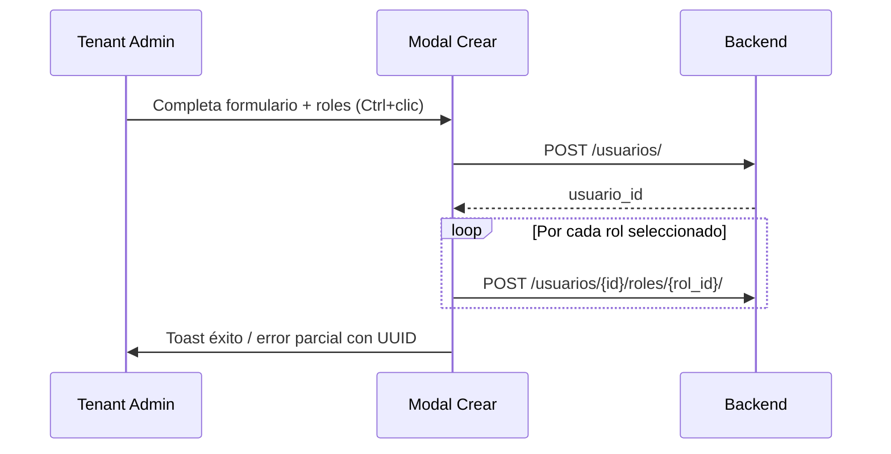

# Auditoría UX/UI — IAM Tenant Admin

**Fecha:** 31 mayo 2026  
**Alcance:** `/admin/usuarios`, `/admin/roles`, `RolePermissionsManager`  
**Audiencia evaluada:** Tenant Admin **no técnico**  
**Excluido:** Módulos ERP, inventario, manufactura, ventas, etc.  
**Restricción:** Propuestas compatibles con backend y **RBAC V1** estabilizado.

---

## 1. Veredicto ejecutivo

| Dimensión | Evaluación | Comentario |
|-----------|------------|------------|
| **Adecuación para Tenant Admin no técnico** | **Insuficiente** | Funcional en happy path, pero fricción alta y gaps multiempresa |
| **Flujos crear/editar usuario** | Parcial | CRUD básico OK; roles y multiempresa mal resueltos |
| **Gestión de roles** | Aceptable | CRUD simple; permisos en modal separado |
| **Gestión de permisos (RBAC V1)** | Confusa | Dos capas (negocio + menú) mal explicadas; menú LBAC incompleto en UI |
| **Multiempresa** | **Crítico** | Sin UI de asignación ni visualización |
| **Escalabilidad 50–200 usuarios** | Limitada | Paginación básica; sin filtros ni bulk |
| **Escalabilidad multiempresa** | No preparada | Sin columnas, filtros ni formularios de empresa |

**Conclusión:** El módulo permite operar en tenants pequeños con admin tolerante a fricción técnica. **No es adecuado** para un administrador de negocio que gestiona usuarios, roles y accesos en un entorno multiempresa sin soporte IT.

---

## 2. Inventario de la experiencia actual

### 2.1 `/admin/usuarios` — `UserManagementPage`

| Elemento | Implementación actual |
|----------|----------------------|
| Listado | Tabla paginada (10/página), búsqueda debounced 500 ms |
| Columnas | ID (UUID), usuario, correo, nombre, roles (pills), activo, acciones |
| Crear | Modal: nombre_usuario, correo, contraseña, nombre, apellido, roles (`<select multiple>`) |
| Editar | Modal: correo, nombre, apellido, activo, roles (`<select multiple>`) |
| Desactivar | Confirmación; icono Trash2 (soft delete) |
| Reactivar | **No existe** |
| Empresas | **No existe** |
| Permisos efectivos | **No visible** (solo roles asignados) |

### 2.2 `/admin/roles` — `RoleManagementPage`

| Elemento | Implementación actual |
|----------|----------------------|
| Listado | Tabla paginada (10/página), búsqueda por nombre/descripción |
| Columnas | ID (UUID), nombre, descripción (truncada), estado, acciones |
| Crear/editar | Modal: nombre, descripción, activo |
| Permisos | Botón llave → `RolePermissionsManager` (modal aparte) |
| Usuarios por rol | **No visible** |
| Plantillas | **No referenciadas** (existen en super-admin) |

### 2.3 `RolePermissionsManager`

| Capa | API | UI |
|------|-----|-----|
| **RBAC V1 — permisos de negocio** | `GET /permisos-catalogo/`, `GET/PUT /roles/{id}/permisos-negocio/` | Sección principal; lista plana de checkboxes |
| **LBAC — permisos de menú** | `GET /permisos/roles/{id}/permisos/`, `PUT /permisos/roles/{id}/menus/{menu_id}/` | Acordeón “Configuración avanzada”; solo checkbox **Ver** |

**Guardado:** dos botones independientes — “Guardar permisos de negocio” (footer) y “Guardar permisos de menú” (dentro del acordeón).

---

## 3. Análisis por flujo

### 3.1 Flujo: Crear usuario



**Pasos actuales:** 1 modal → 1+N requests.

| Aspecto | Evaluación |
|---------|------------|
| Campos obligatorios | nombre_usuario, correo, contraseña — admin debe inventar contraseña |
| Asignación de roles | Opcional; `<select multiple>` nativo |
| Asignación de empresas | Ausente |
| Feedback | Toast “Creando…” → “Asignando roles…”; error parcial muestra UUID técnico |
| Validación | Solo frontend: email regex, contraseña ≥ 8 chars |

**Problemas para admin no técnico:**
- No entiende diferencia entre **nombre de usuario** y **correo** (dos identificadores).
- Debe **generar y comunicar contraseña** manualmente; no hay invitación por email ni “generar contraseña”.
- Instrucción *“Mantén Ctrl para seleccionar múltiples roles”* es patrón de power user de los años 90.
- Sin preview de **qué acceso otorga cada rol** al asignarlo.
- Sin paso de **empresa(s)** → usuario operativo puede quedar sin acceso post-login.

### 3.2 Flujo: Editar usuario

**Pasos:** Icono editar → modal con datos + roles → PUT usuario + diff roles (assign/revoke en paralelo).

| Campo editable | Sí / No |
|----------------|---------|
| nombre_usuario | **No** |
| correo | Sí |
| nombre / apellido | Sí |
| contraseña / reset | **No** |
| activo | Sí (checkbox) |
| roles | Sí (`<select multiple>`) |
| empresas | **No** |

**Problemas:**
- Mezcla **datos personales**, **estado** y **autorización (roles)** en un solo modal — sobrecarga cognitiva.
- Datos útiles del backend (`correo_confirmado`, `fecha_ultimo_acceso`) **no se muestran**.
- Usuario inactivo: botón desactivar deshabilitado pero **sin acción de reactivar**.
- Cambio de roles sin confirmación ni resumen de impacto (“este usuario perderá acceso a X”).

### 3.3 Flujo: Asignar rol

Ocurre en create/edit usuario y en gestión de roles (indirectamente vía usuarios).

| Mecanismo | UX |
|-----------|-----|
| Control | `<select multiple size={5}>` |
| Información del rol | Solo `nombre`; sin descripción en opciones |
| Multi-selección | Requiere Ctrl/Cmd — no descubierto por usuarios ocasionales |
| Roles inactivos | `getAllActiveRoles()` — OK, solo activos en dropdown |
| Sincronización | Edit calcula diff y llama N endpoints assign/revoke |

**Problema central:** asignar rol ≠ entender permisos. El admin no ve el efecto hasta abrir otro módulo o que el usuario reporte “no veo el menú”.

### 3.4 Flujo: Gestión de roles

**Happy path:** Crear rol → botón llave → configurar permisos → asignar rol a usuarios.

| Fricción | Detalle |
|----------|---------|
| Permisos desacoplados | Crear rol no invita a configurar permisos |
| Sin métricas | No hay “12 usuarios con este rol” |
| UUID visible | Columna ID en tabla |
| Descripción truncada | `max-w-xs truncate` — difícil comparar roles similares |
| Iconografía | Editar / Permisos / Desactivar solo iconos — sin labels en mobile |

### 3.5 Flujo: Gestión de permisos (`RolePermissionsManager`)

#### RBAC V1 — Permisos de negocio (capa principal)

- Catálogo plano de checkboxes con `nombre` y `(codigo)`.
- Sin agrupación por módulo, recurso o acción pese a que el tipo `PermisoCatalogoItem` incluye `recurso`, `accion`, `modulo_id`.
- Sin búsqueda ni filtros.
- Guardado: PUT reemplaza lista completa `{ permiso_ids: [...] }` — correcto para API.
- Error 403 con mensaje explícito `admin.rol.leer` — **buen patrón**.

#### LBAC — Permisos de menú (acordeón “avanzado”)

- Árbol módulo → sección → menú → submenús.
- **Solo editable el permiso “Ver”** (`handleViewPermissionChange`).
- `crear`, `editar`, `eliminar` se cargan del API pero **no tienen checkbox en UI**.
- Al guardar, `updateRolePermissionsBatch` envía `puede_ver`, `puede_editar`, `puede_eliminar` — **omite `puede_crear`** en payload PUT.
- Guardado dispara **un PUT por cada menú** en el estado — escalabilidad pobre con menús extensos.

#### Copy confuso (invierte el modelo mental)

> *“El menú y los accesos se configuran automáticamente según los permisos. Aquí defines los permisos de negocio del rol; la configuración avanzada de menú es opcional.”*

Para un admin no técnico, lo “automático” sugiere que no debe tocar nada; lo “opcional avanzado” desincentiva configurar visibilidad de pantallas — justo lo que más le importa ver.

#### Dos botones de guardado

El admin puede guardar negocio sin menú o viceversa, cerrar el modal, y creer que “ya configuró todo el rol”.

---

## 4. Compatibilidad RBAC V1

RBAC V1 estabilizado en frontend usa:

| Capa | Endpoint | Propósito |
|------|----------|-----------|
| Catálogo | `GET /permisos-catalogo/` | Permisos atómicos (`codigo`, `recurso`, `accion`) |
| Asignación rol | `PUT /roles/{id}/permisos-negocio/` | `permiso_ids[]` |
| Menú LBAC | `GET/PUT /permisos/roles/{id}/...` | Visibilidad y CRUD por pantalla |
| Runtime ERP | `GET /auth/menu` + `PermissionGuard` | Acceso efectivo operativo |

### 4.1 Alineaciones correctas

- Permisos de negocio como flujo principal en modal — coherente con RBAC V1 como fuente de acciones API.
- Servicios `permisos-negocio.service.ts` documentados y tipados.
- Mensajes de error 403 referenciando `admin.rol.leer` / `admin.rol.actualizar`.

### 4.2 Desalineaciones / deuda respecto a RBAC V1

| # | Problema | Impacto |
|---|----------|---------|
| R1 | UI menú solo expone **Ver**; backend soporta crear/editar/eliminar/exportar/imprimir/aprobar | Admin no puede configurar LBAC completo sin otro canal |
| R2 | `puede_crear` se lee del API pero **no se envía** en PUT batch | Estado inconsistente FE/BE |
| R3 | Permisos de negocio sin agrupar por `recurso`/`modulo_id` del catálogo | Catálogo grande = lista inutilizable |
| R4 | No hay vista de **permisos efectivos del usuario** (unión de roles) | Admin no valida RBAC V1 sin inferencia manual |
| R5 | Dos sistemas de guardado independientes | Rol “medio configurado” frecuente |
| R6 | Fallo silencioso en carga LBAC → `{}` y continúa | Admin cree que no hay permisos de menú |

---

## 5. Experiencia multiempresa

| Capacidad esperada | Estado UI |
|--------------------|-----------|
| Asignar empresa(s) al crear usuario | **Ausente** |
| Editar empresas del usuario | **Ausente** |
| Ver empresas en listado | **Ausente** |
| Filtrar usuarios por empresa | **Ausente** |
| Indicar que roles son tenant-wide | **Ausente** |
| Relacionar rol + empresa (usuario_rol) | **Ausente** |

**Evidencia en código:**
- `UserFormData` / `UserWithRoles` sin campos `empresa_id` / `empresas`.
- Ninguna referencia a “empresa” en `src/features/admin/`.
- Backend expone `empresas_disponibles` en `/auth/me` (modelo `usuario_rol`) pero IAM no lo administra.

**Consecuencia operativa:** Tenant Admin crea usuario + rol pero el operativo puede quedar en **“No hay empresas disponibles”** al login.

---

## 6. Escalabilidad

### 6.1 ~50 usuarios

| Área | Comportamiento | Riesgo |
|------|----------------|--------|
| Listado | 5 páginas × 10 | Aceptable |
| Búsqueda | Por nombre/apellido/correo | Suficiente |
| Roles en dropdown | `getAllActiveRoles()` una vez | OK si < ~30 roles |
| Permisos rol | Lista plana catálogo | Empieza a doler si catálogo > ~40 ítems |

### 6.2 ~200 usuarios

| Área | Comportamiento | Riesgo |
|------|----------------|--------|
| Paginación | 20 páginas, solo prev/next | **Alto** — sin salto de página, sin page size |
| Sin filtros | Por rol, estado, empresa | **Alto** — administración reactiva inviable |
| Sin export | — | Operaciones masivas imposibles |
| Asignación roles | Select multiple sin buscador | **Medio** con muchos roles |
| Guardado LBAC | N PUTs paralelos (todos los menús) | **Alto** — lento, frágil en red mala |

### 6.3 Múltiples empresas

| Área | Comportamiento | Riesgo |
|------|----------------|--------|
| IAM sin dimensión empresa | Todo tenant-flat | **Crítico** |
| tenant_admin con selector global | No contextualiza usuarios admin | Confusión de ámbito |
| Roles compartidos entre empresas | Correcto en modelo, invisible en UI | Admin no sabe si rol aplica a todas las empresas |

---

## 7. Hallazgos priorizados

### P0 — Crítico (bloquea operación o genera usuarios inválidos)

| ID | Hallazgo | Tipo |
|----|----------|------|
| P0-1 | **Sin asignación de empresa(s) en crear/editar usuario** — incompatible con multiempresa | UX funcional |
| P0-2 | **`<select multiple>` + Ctrl/Cmd** para roles — patrón inaccesible para admin no técnico | UX |
| P0-3 | **Sin vista de permisos efectivos del usuario** — admin no puede validar acceso | UX / RBAC |
| P0-4 | **Error parcial al crear usuario muestra UUID** (`Usuario creado (ID: …)`) | UI / nomenclatura |
| P0-5 | **Columna ID (UUID) prominente** en tablas usuarios y roles | UI |
| P0-6 | **LBAC menú: solo “Ver” editable**; crear/editar/eliminar cargados pero no configurables | RBAC V1 / deuda |
| P0-7 | **Dos botones de guardado** en permisos de rol sin indicador de “cambios pendientes” | UX |

### P1 — Importante (fricción alta, errores frecuentes)

| ID | Hallazgo | Tipo |
|----|----------|------|
| P1-1 | Admin debe **definir contraseña** al crear usuario; sin invitación, reset ni generador | UX seguridad |
| P1-2 | **nombre_usuario vs correo** sin ayuda contextual — duplicidad confusa | Nomenclatura |
| P1-3 | Editar mezcla perfil + roles + estado en un modal | UX / formulario |
| P1-4 | **No reactivar usuarios** inactivos desde UI | Flujo incompleto |
| P1-5 | Crear rol **no guía** a configurar permisos (paso huérfano) | Navegación |
| P1-6 | Catálogo RBAC V1 **lista plana** sin agrupar por módulo/recurso | Escalabilidad / UI |
| P1-7 | Copy de `RolePermissionsManager` **invierte** prioridad menú vs negocio | Nomenclatura |
| P1-8 | Fallo silencioso carga permisos menú → matriz vacía | Deuda técnica visible |
| P1-9 | Guardado LBAC: **N requests PUT** (uno por menú) | Escalabilidad / deuda |
| P1-10 | Sin filtros (rol, activo, empresa) ni tamaño de página configurable | Escalabilidad |
| P1-11 | `RoleManagementPage` **no espera auth ready** antes de fetch (race vs usuarios) | Deuda técnica |
| P1-12 | Datos útiles no mostrados: `correo_confirmado`, `fecha_ultimo_acceso` | Información faltante |
| P1-13 | Acciones solo iconos (editar, permisos, desactivar) sin texto | UI / accesibilidad |

### P2 — Mejora (calidad, pulido, preparación futura)

| ID | Hallazgo | Tipo |
|----|----------|------|
| P2-1 | Modales custom en usuarios/roles vs shadcn `Dialog` en permisos — **inconsistencia visual** | UI |
| P2-2 | `useDebounce` duplicado en ambas páginas | Deuda técnica |
| P2-3 | Sin page header/título; depende de breadcrumbs | UI |
| P2-4 | Empty states solo texto plano (sin icono ni CTA) | UI |
| P2-5 | Sin contador “usuarios con este rol” en tabla roles | Información faltante |
| P2-6 | Sin duplicar rol / plantilla desde super-admin | Productividad |
| P2-7 | Búsqueda usuarios no incluye `nombre_usuario` explícitamente en placeholder (sí en API `search`) | UX menor |
| P2-8 | `console.log` de debug en producción en `RolePermissionsManager` | Deuda técnica |
| P2-9 | Sin bulk: activar/desactivar, asignar rol masivo | Escalabilidad |
| P2-10 | Sin audit trail visible (“quién cambió permisos del rol X”) | Gobernanza |

---

## 8. Deuda técnica visible (resumen)

| Área | Manifestación |
|------|---------------|
| Permisos menú | Solo UI para `ver`; payload incompleto (`puede_crear` omitido) |
| Permisos menú save | Batch de PUTs individuales por menú |
| Tipos vs UI | `MenuPermissions` define 7 acciones; UI expone 1 |
| Páginas monolíticas | `UserManagementPage` ~780 líneas; modales inline |
| Auth guards | Inconsistente entre usuarios (sí) y roles (no) |
| Componentes | Mezcla modal manual + shadcn Dialog |
| Multiempresa | Cero integración en feature admin pese a modelo `usuario_rol` en auth |

---

## 9. Nomenclatura confusa

| Término actual | Problema | Propuesta UX |
|----------------|----------|--------------|
| Nombre de Usuario | vs correo/login | “Usuario de acceso” + tooltip |
| Permisos de negocio | Jerga técnica | “Permisos de acciones” o “Qué puede hacer” |
| Configuración avanzada de menú | Suena opcional/riesgoso | “Pantallas visibles” |
| Roles | No comunica alcance | “Perfiles de acceso” (copy) + descripción visible |
| ID (columna) | UUID crudo | Ocultar; mostrar solo en detalle/debug |
| Desactivar (icono basura) | Implica borrado | “Desactivar acceso” + icono UserX |
| Activo: Sí/No | Genérico | “Con acceso” / “Sin acceso” |

---

## 10. Mockup conceptual recomendado

Diseño orientado a **Tenant Admin no técnico**, respetando APIs actuales (sin cambiar contratos RBAC V1).

### 10.1 Vista listado usuarios

```
┌─────────────────────────────────────────────────────────────────────────┐
│  Usuarios                                    [+ Invitar usuario]        │
│  Personas que pueden acceder a su organización                          │
├─────────────────────────────────────────────────────────────────────────┤
│  🔍 Buscar…          [Empresa ▾] [Rol ▾] [Estado ▾]     Mostrar: 25 ▾  │
├─────────────────────────────────────────────────────────────────────────┤
│  Nombre          Correo              Empresas        Roles      Estado  │
│  ─────────────────────────────────────────────────────────────────────  │
│  Ana García      ana@acme.com        ACME, ACME Log.  Gerente    ● Activo │
│  Luis Pérez      luis@acme.com       ACME Norte       Consulta   ○ Inact.│
│  …                                                                      │
├─────────────────────────────────────────────────────────────────────────┤
│  200 usuarios · Página 3 de 8                        [< 1 2 3 4 5 … >]  │
└─────────────────────────────────────────────────────────────────────────┘
```

**Cambios clave:** sin UUID; columna empresas; filtros; “Invitar” en lugar de “Crear con contraseña”.

### 10.2 Wizard crear usuario (3 pasos)

```
 Paso 1 de 3 — Datos básicos
 ┌──────────────────────────────────────┐
 │ Nombre *        [ Ana              ] │
 │ Apellido        [ García           ] │
 │ Correo *        [ ana@acme.com     ] │
 │ ℹ️ Enviaremos invitación para activar │
 └──────────────────────────────────────┘
                    [Cancelar]  [Siguiente →]

 Paso 2 de 3 — Empresas
 ┌──────────────────────────────────────┐
 │ ☑ ACME S.A.C.                        │
 │ ☑ ACME Logística                     │
 │ ☐ ACME Norte                         │
 │ ℹ️ El usuario elegirá empresa al     │
 │   ingresar si tiene más de una.      │
 └──────────────────────────────────────┘
              [← Atrás]  [Siguiente →]

 Paso 3 de 3 — Perfil de acceso
 ┌──────────────────────────────────────┐
 │ Perfiles (roles)                     │
 │ ☑ Gerente operaciones                │
 │   → Ve inventario, compras (resumen) │
 │ ☐ Consulta general                   │
 │                                      │
 │ [Ver detalle de permisos del rol]    │
 └──────────────────────────────────────┘
              [← Atrás]  [Crear e invitar]
```

**Nota implementación sin romper BE:** si invitación no existe aún, paso 1 puede mantener contraseña temporal con botón “Generar contraseña segura” — mejora UX sin nuevo endpoint.

### 10.3 Detalle / editar usuario (pestañas)

```
┌─────────────────────────────────────────────────────────────────────────┐
│  ← Usuarios    Ana García                           ● Activo  [Acciones▾]│
├─────────────────────────────────────────────────────────────────────────┤
│  [Perfil]  [Empresas]  [Perfiles de acceso]  [Acceso efectivo]          │
├─────────────────────────────────────────────────────────────────────────┤
│  Perfil de acceso                                                        │
│  ┌─────────────────────────────────────────────────────────────────┐    │
│  │ ☑ Gerente operaciones     [Ver permisos]              [Quitar]  │    │
│  │ ☑ Supervisor bodega       [Ver permisos]              [Quitar]  │    │
│  │ [+ Añadir perfil]                                               │    │
│  └─────────────────────────────────────────────────────────────────┘    │
│                                                                          │
│  Acceso efectivo (solo lectura)                                          │
│  • Pantallas: Inventario, Compras, Organización > Sucursales             │
│  • Acciones: inv.producto.crear, inv.stock.ver, …                        │
└─────────────────────────────────────────────────────────────────────────┘
```

**Acceso efectivo:** agregación read-only en FE desde roles + catálogo RBAC V1 (sin nuevo endpoint idealmente; o endpoint dedicado si BE lo expone).

### 10.4 Gestión de permisos de rol (RBAC V1 alineado)

```
┌─────────────────────────────────────────────────────────────────────────┐
│  Permisos del perfil: Gerente operaciones                          [X]  │
├─────────────────────────────────────────────────────────────────────────┤
│  [Pantallas]  [Acciones]  ← tabs claros, no “avanzado”                 │
├─────────────────────────────────────────────────────────────────────────┤
│  Tab ACCIONES (RBAC V1)                                                  │
│  🔍 Buscar permiso…                                                      │
│                                                                          │
│  ▼ Inventario                                                            │
│    ☑ Crear productos          inv.producto.crear                         │
│    ☑ Ver stock                inv.stock.ver                              │
│    ☐ Eliminar movimientos     inv.movimiento.eliminar                    │
│  ▼ Compras                                                               │
│    ☑ Ver órdenes              pur.orden.ver                              │
│    …                                                                     │
├─────────────────────────────────────────────────────────────────────────┤
│  Tab PANTALLAS (LBAC)                                                    │
│  Árbol con columnas: Ver | Crear | Editar | Eliminar                    │
│  (checkboxes completos, no solo Ver)                                     │
├─────────────────────────────────────────────────────────────────────────┤
│  ⚠ Tienes cambios sin guardar          [Cancelar]  [Guardar todo]       │
└─────────────────────────────────────────────────────────────────────────┘
```

**Un solo guardado** que orquesta PUT negocio + batch menú (orden secuencial si BE lo requiere).

---

## 11. Roadmap de mejora (sin romper backend ni RBAC V1)

### Fase 1 — Quick wins UX (solo FE, APIs actuales)

| # | Entrega | APIs usadas | Riesgo |
|---|---------|-------------|--------|
| 1.1 | Ocultar columna UUID; mostrar nombre completo primero | — | Nulo |
| 1.2 | Reemplazar `<select multiple>` por **checkbox list** con búsqueda para roles | `/roles/all-active/` | Bajo |
| 1.3 | Tooltips: nombre_usuario vs correo; descripción de rol bajo nombre | — | Nulo |
| 1.4 | Unificar modales usuarios/roles a shadcn `Dialog` | — | Bajo |
| 1.5 | Tabs en `RolePermissionsManager`: “Acciones” / “Pantallas” + copy corregido | Sin cambio API | Bajo |
| 1.6 | Agrupar catálogo RBAC por `recurso` o prefijo de `codigo` | `GET /permisos-catalogo/` | Bajo |
| 1.7 | Error visible si falla carga LBAC (no `{}` silencioso) | — | Bajo |
| 1.8 | Botón “Generar contraseña” en crear usuario | POST `/usuarios/` igual | Bajo |
| 1.9 | Mostrar `fecha_ultimo_acceso`, `correo_confirmado` en detalle | GET usuario existente | Bajo |

### Fase 2 — Multiempresa IAM (requiere endpoints BE; UI preparada)

| # | Entrega | Dependencia BE |
|---|---------|----------------|
| 2.1 | Paso “Empresas” en wizard crear/editar | API asignación `usuario ↔ empresa` (usuario_rol) |
| 2.2 | Columna + filtro empresas en listado | GET usuarios incluye empresas o join |
| 2.3 | Copy contextual: “Los perfiles aplican a todo el tenant; las empresas limitan dónde opera” | — |
| 2.4 | Validación: operativo requiere ≥1 empresa | — |

**Compatibilidad:** campos opcionales; usuarios legacy sin empresas siguen listándose.

### Fase 3 — RBAC V1 completo en UI

| # | Entrega | Notas |
|---|---------|-------|
| 3.1 | LBAC: checkboxes Ver/Crear/Editar/Eliminar (+ exportar si aplica) | Usar campos ya en `PermissionState` |
| 3.2 | Incluir `puede_crear` en PUT batch | Alinear `permission.service.ts` con BE |
| 3.3 | **Un solo “Guardar”** con indicador cambios pendientes | Orquestación FE |
| 3.4 | Vista read-only “Acceso efectivo” en detalle usuario | Agregación FE desde roles |
| 3.5 | Optimizar save menú: solo menús **modificados** (diff) | Reduce N PUTs; mismo contrato API |

### Fase 4 — Escala 200+ usuarios

| # | Entrega |
|---|---------|
| 4.1 | Page size 25/50/100 |
| 4.2 | Filtros: rol, estado, empresa |
| 4.3 | Paginación numérica (no solo prev/next) |
| 4.4 | Acciones masivas (desactivar, asignar rol) — si BE soporta batch |
| 4.5 | Export CSV listado usuarios |

### Fase 5 — Flujos guiados (producto)

| # | Entrega |
|---|---------|
| 5.1 | Wizard post-crear rol → “Configurar permisos ahora” |
| 5.2 | Hub “Primer empleado”: usuario + empresa + rol mínimo |
| 5.3 | Invitación por email (si BE expone endpoint) reemplaza contraseña manual |
| 5.4 | Reactivar usuario (si BE expone reactivate) |

---

## 12. Matriz de adecuación por escenario

| Escenario | ¿Adecuado hoy? | Bloqueador principal |
|-----------|----------------|----------------------|
| Tenant 10 users, 1 empresa, 3 roles | Aceptable con capacitación | Select multiple roles |
| Tenant 50 users, 2 empresas | **No** | Sin asignación empresa |
| Tenant 200 users, 5 empresas | **No** | Paginación + filtros + multiempresa |
| Admin configura rol RBAC V1 | Parcial | Catálogo plano; menú solo “Ver” |
| Admin valida “¿por qué no entra Luis?” | **No** | Sin acceso efectivo ni empresas visibles |

---

## 13. Conclusión

El módulo IAM del tenant admin es **funcionalmente mínimo** pero **UX insuficiente** para un administrador no técnico en un SaaS multiempresa con RBAC V1:

1. **Multiempresa está ausente** en la interfaz de usuarios — fallo estructural (P0).
2. **Asignación de roles** usa patrones obsoletos incompatibles con usuarios ocasionales (P0).
3. **Permisos de rol** mezclan RBAC V1 y LBAC con copy invertido, doble guardado y LBAC incompleto (P0–P1).
4. **Escalabilidad** a 200 usuarios requiere filtros, paginación mejorada y agrupación del catálogo (P1).

El **mockup conceptual** (§10) y el **roadmap en 5 fases** (§11) permiten evolucionar la experiencia **sin romper contratos API ni RBAC V1**, priorizando quick wins de frontend y completando multiempresa cuando el backend exponga asignación `usuario_rol`.

---

## 14. Anexo — referencias de código

| Tema | Archivo |
|------|---------|
| Usuarios | `src/features/admin/pages/UserManagementPage.tsx` |
| Roles | `src/features/admin/pages/RoleManagementPage.tsx` |
| Permisos rol | `src/features/admin/components/RolePermissionsManager.tsx` |
| API usuarios | `src/features/admin/services/usuario.service.ts` |
| API permisos menú | `src/features/admin/services/permission.service.ts` |
| API RBAC V1 negocio | `src/features/admin/services/permisos-negocio.service.ts` |
| Tipos RBAC catálogo | `src/features/admin/types/permisos-negocio.types.ts` |
| Arquitectura tenant admin | `TENANT_ADMIN_UX_ARCHITECTURE.md` |
| Auditoría multiempresa | `FRONTEND_TENANT_MULTIEMPRESA_UX_AUDIT.md` |

---

*Documento de auditoría UX/UI. No incluye implementación ni cambios de código.*
