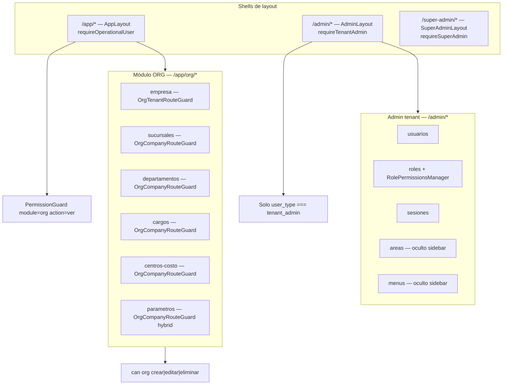
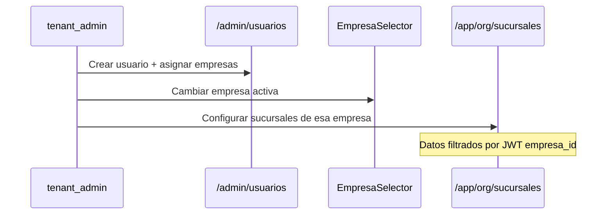

# Arquitectura UX — Tenant Administration

**Fecha:** 31 mayo 2026  
**Alcance:** Administración del tenant (empresas, usuarios, roles, permisos, sesiones, parámetros organizacionales, multiempresa)  
**Excluido:** Módulos ERP operativos (INV, MFG, SLS, HCM, QMS, BI, etc.)  
**Restricción:** Propuesta compatible con backend, RBAC, menús dinámicos y multiempresa actuales — sin ruptura funcional.

---

## 1. Resumen ejecutivo

La administración del tenant está **fragmentada en dos shells** con dominios distintos pero sin un modelo mental explícito para el usuario:

| Shell | Ruta base | Dominio actual |
|-------|-----------|----------------|
| ERP | `/app/org/*` | Datos organizacionales (empresas, estructura, parámetros) |
| Administración | `/admin/*` | Identidad y acceso (usuarios, roles, sesiones) |

Esta separación es **técnicamente coherente** (permisos por módulo `org` vs. guard `requireTenantAdmin`), pero **UX inconsistente** para `tenant_admin`, que debe alternar shells mediante `ShellCrossNav`.

**Arquitectura recomendada:** mantener **dos shells físicos** (no mover rutas de forma agresiva), pero adoptar **un dominio lógico unificado: “Administración del tenant”** con navegación consolidada, reglas de ubicación claras por ámbito (tenant vs. empresa) y eliminación de funcionalidades mal ubicadas.

> **Principio rector:** *IAM en `/admin` · Organización en `/app/org` · Navegación unificada para tenant_admin · Acceso operativo preservado para usuarios con `org.ver`.*

---

## 2. Arquitectura actual

### 2.1 Mapa de shells y guards



### 2.2 Inventario funcional actual

#### Shell ERP — `/app/org/*`

| Ruta | Página | Ámbito | Guard adicional | Permisos UI |
|------|--------|--------|-----------------|-------------|
| `/app/org/empresa` | `EmpresaPage` | **Tenant-wide** (catálogo de empresas) | `OrgTenantRouteGuard` | `can('org', …)` |
| `/app/org/sucursales` | `SucursalesPage` | **Empresa activa (JWT)** | `OrgCompanyRouteGuard` | `can('org', …)` |
| `/app/org/departamentos` | `DepartamentosPage` | **Empresa activa** | `OrgCompanyRouteGuard` | `can('org', …)` |
| `/app/org/cargos` | `CargosPage` | **Empresa activa** | `OrgCompanyRouteGuard` | `can('org', …)` |
| `/app/org/centros-costo` | `CentrosCostoPage` | **Empresa activa** | `OrgCompanyRouteGuard` | `can('org', …)` |
| `/app/org/parametros` | `ParametrosPage` | **Híbrido** (global tenant + override empresa) | `OrgCompanyRouteGuard scope=hybrid` | `can('org', …)` + `useOrgCanManageGlobalParametros` |

**Características ORG:**
- Acceso vía `PermissionGuard module="org" action="ver"` (LBAC desde `/auth/menu`).
- Usuarios operativos (`user_type: user`) **pueden** acceder si tienen `org.ver` en menú.
- Contexto multiempresa: `useOrgSessionScope` + banner read-only; cambio de empresa solo en header.
- Onboarding primera empresa: `/app/org/empresa?onboarding=true` (flujo crítico).

#### Shell Administración — `/admin/*`

| Ruta | Página | Ámbito | Guard | Permisos UI |
|------|--------|--------|-------|-------------|
| `/admin/usuarios` | `UserManagementPage` | **Tenant-wide** | `requireTenantAdmin` | Ninguno (solo shell) |
| `/admin/roles` | `RoleManagementPage` | **Tenant-wide** | `requireTenantAdmin` | Ninguno |
| `/admin/roles` → modal | `RolePermissionsManager` | **Tenant-wide** | — | LBAC menú + RBAC negocio |
| `/admin/sesiones` | `ActiveSessionsPage` | **Tenant-wide** | `requireTenantAdmin` | Ninguno |
| `/admin/areas` | `AreaManagementPage` | **Tenant-wide** | `requireTenantAdmin` | Ninguno — **oculto en sidebar** |
| `/admin/menus` | `MenuManagementPage` | **Tenant-wide** | `requireTenantAdmin` | Ninguno — **oculto en sidebar** |

**Características Admin:**
- Sin `PermissionGuard` por módulo; acceso binario por `user_type === 'tenant_admin'`.
- Menú lateral desde `/auth/menu` filtrado por `menu_scope=admin` o prefijo `/admin/*`.
- **No hay UI de asignación de empresa** en gestión de usuarios (gap multiempresa).

#### Super-admin — `/super-admin/*` (referencia, no tenant)

Estructura de módulos, secciones, menús y plantillas de roles vive en platform admin (`/super-admin/modulos`, `/super-admin/menus`, `/super-admin/plantillas-roles`). Es la fuente de verdad de la estructura de navegación global.

### 2.3 Partición del menú (presentación)

`menu-shell.utils.ts` divide el payload de `GET /auth/menu` por shell:

| `menu_scope` / prefijo ruta | Shell renderizado |
|----------------------------|-------------------|
| `/app/*`, legacy `/org/*` | `app` — sidebar “Módulos” |
| `/admin/*` | `admin` — sidebar “Administración General” |
| `/super-admin/*` | `super-admin` — “Administración Global” |

**Consecuencia:** Un `tenant_admin` con acceso a ORG ve esas entradas en el sidebar **ERP**, no en el sidebar **Admin**. Debe usar `ShellCrossNav` (“Administración” ↔ “Módulos”) para alternar.

### 2.4 Multiempresa en cada área

| Área | Comportamiento actual |
|------|----------------------|
| **Empresas** | CRUD tenant-wide; onboarding selecciona empresa activa post-creación |
| **Estructura org** | Filtrada por `scopeEmpresaId` del JWT |
| **Parámetros** | Tabs: efectivos / globales tenant / overrides empresa |
| **Usuarios** | Sin campo empresa en UI; backend expone `empresas_disponibles` en `/auth/me` |
| **Roles / permisos** | Tenant-wide; no distinguen empresa en UI |
| **Sesiones** | Tenant-wide |
| **Header** | `EmpresaSelector`: tenant_admin ve catálogo completo ORG; operativo ve solo elegibles |

### 2.5 Quién accede a qué

| Actor | `/admin/*` | `/app/org/*` |
|-------|------------|--------------|
| `tenant_admin` | ✅ Todo admin | ✅ Si menú incluye módulo `org` + permisos |
| `user` operativo con `org.ver` | ❌ `/unauthorized` | ✅ Según LBAC |
| `user` sin `org.ver` | ❌ | ❌ `PermissionGuard` |
| `platform_admin` | ❌ (va a super-admin) | ❌ (bloqueado en `/app`) |

---

## 3. Problemas detectados

### 3.1 Fragmentación de dominio

| # | Problema | Impacto |
|---|----------|---------|
| P1 | **Dos shells para una sola responsabilidad** (“administrar mi tenant”) | tenant_admin pierde contexto; curva de aprendizaje alta |
| P2 | **ORG aparece como “módulo ERP”** en sidebar app | Empresas y estructura se perciben como operación, no administración |
| P3 | **`ShellCrossNav` es el único puente** entre IAM y Organización | Navegación frágil; destino depende del orden del menú backend |
| P4 | **Sin hub / dashboard de administración** | No hay punto de entrada orientativo |

### 3.2 Funcionalidades mal ubicadas

| # | Funcionalidad | Ubicación actual | Problema |
|---|---------------|------------------|----------|
| M1 | **Gestión de menús** (`/admin/menus`) | Admin tenant | Duplica `/super-admin/menus`; riesgo de editar estructura global |
| M2 | **Gestión de áreas** (`/admin/areas`) | Admin tenant | Modelo deprecado; super-admin usa secciones/módulos v2 |
| M3 | **Empresas (CRUD tenant-wide)** | `/app/org/empresa` | Dominio tenant-admin en shell ERP; correcto en RBAC, confuso en UX |
| M4 | **Asignación empresa ↔ usuario** | *Inexistente* | Debería estar en IAM (`/admin/usuarios`); gap multiempresa |

### 3.3 Inconsistencias de permisos y acceso

| # | Problema |
|---|----------|
| I1 | `/admin/*` usa solo `requireTenantAdmin`; `/app/org/*` usa LBAC `org.ver/crear/...` — **modelos distintos** para acciones admin |
| I2 | `useUserType.canManageUsers` incluye roles `admin`/`supervisor`, pero `/admin` exige `tenant_admin` |
| I3 | Páginas admin **no muestran empresa activa** ni aclaran ámbito tenant vs. empresa |
| I4 | `RolePermissionsManager` mezcla LBAC (menú) y RBAC (negocio) sin guía clara |

### 3.4 Multiempresa

| # | Problema |
|---|----------|
| E1 | Usuarios creados sin UI de empresa → operativos pueden quedar sin `empresas_disponibles` |
| E2 | Admin IAM no indica que roles/permisos son tenant-wide pero **datos ORG son por empresa activa** |
| E3 | tenant_admin cambia empresa en header pero `/admin/usuarios` no reacciona visualmente al contexto |

---

## 4. Arquitectura recomendada

### 4.1 Modelo de dominios (definitivo)

Separar por **responsabilidad de negocio** y **ámbito de datos**, no por accidente histórico de rutas:

```
┌─────────────────────────────────────────────────────────────────┐
│                 ADMINISTRACIÓN DEL TENANT (lógica)               │
├────────────────────────────┬────────────────────────────────────┤
│   A. IDENTIDAD Y ACCESO    │   B. ORGANIZACIÓN Y CONFIGURACIÓN   │
│   (IAM / Gobernanza)       │   (Master Data + Parámetros)       │
├────────────────────────────┼────────────────────────────────────┤
│ • Usuarios                 │ • Empresas (tenant-wide)           │
│ • Roles                    │ • Sucursales (empresa)             │
│ • Permisos (LBAC + RBAC)   │ • Departamentos (empresa)        │
│ • Sesiones activas         │ • Cargos (empresa)                 │
│                            │ • Centros de costo (empresa)       │
│                            │ • Parámetros (híbrido)           │
├────────────────────────────┴────────────────────────────────────┤
│  Ámbito tenant-wide          │  Ámbito empresa activa (JWT)     │
│  Shell: /admin/*             │  Shell: /app/org/*               │
└─────────────────────────────────────────────────────────────────┘
```

### 4.2 Reglas de ubicación (decisión definitiva)

#### Permanecen en `/app/org/*`

| Funcionalidad | Razón |
|---------------|-------|
| Sucursales, departamentos, cargos, centros de costo | **Company-scoped**; operativos con `org.ver` deben acceder sin entrar a `/admin` |
| Parámetros organizacionales | **Híbrido** ligado a `scopeEmpresaId`; guards y queries ORG dependen del JWT |
| Empresas (CRUD) | Módulo backend `org`; onboarding usa esta ruta; `PermissionGuard module="org"` ya validado |
| Onboarding `/app/org/empresa?onboarding=true` | Flujo crítico post-login; **no mover** |

#### Permanecen en `/admin/*`

| Funcionalidad | Razón |
|---------------|-------|
| Usuarios | Dominio IAM; tenant-wide; guard `requireTenantAdmin` |
| Roles | Dominio IAM; tenant-wide |
| Permisos (via `RolePermissionsManager`) | Configuración de acceso tenant-wide |
| Sesiones activas | Gobernanza de seguridad tenant-wide |

#### Mal ubicadas — acción recomendada

| Funcionalidad | Acción | Destino |
|---------------|--------|---------|
| `/admin/menus` | **Retirar del tenant admin** | Solo `/super-admin/menus` (redirect o 403 amigable) |
| `/admin/areas` | **Deprecar y retirar** | `/super-admin` si aún se necesita legacy |
| Asignación empresa en usuarios | **Agregar en `/admin/usuarios`** | Permanece admin; extensión UI sobre API existente |

#### Unificar (lógica / UX, no rutas)

| Qué unificar | Cómo |
|--------------|------|
| **Navegación tenant_admin** | Sidebar admin muestra sección “Organización” con enlaces a `/app/org/*` (vía menú backend `menu_scope=admin`) |
| **Identidad visual** | Misma familia de componentes (toolbar, empty states, badges de ámbito) en admin y org |
| **Permisos en roles** | Wizard o tabs explícitos: “Acceso a pantallas (menú)” vs “Acciones de negocio (RBAC)” |
| **Contexto multiempresa** | Banner “Empresa activa” también en páginas `/admin/*` cuando aplique |
| **Hub de administración** | Landing `/admin` o `/admin/inicio` con tarjetas IAM + Organización |

### 4.3 Qué NO mover (restricciones RBAC / multiempresa)

| Restricción | Motivo |
|-------------|--------|
| No mover sucursales/departamentos/cargos/CC a `/admin` | Operativos perderían acceso (`requireTenantAdmin` bloquea `/admin`) |
| No eliminar `PermissionGuard module="org"` | RBAC LBAC depende del módulo `org` en menú |
| No fusionar shells en una sola ruta base a corto plazo | Rompe partición de menú, guards y `ProtectedRoute` actuales |
| No cambiar onboarding fuera de `/app/org/empresa` | Flujo validado con `OrgTenantRouteGuard` y `ProtectedRoute` |
| No exponer CRUD de menús globales al tenant | Estructura la define platform admin |

### 4.4 Opción avanzada (fase tardía, opcional)

**Alias de rutas** sin cambiar componentes ni RBAC:

```
/admin/organizacion/empresas  →  mismo componente EmpresaPage
/admin/organizacion/*         →  redirect a /app/org/* equivalente
```

- Mantiene `PermissionGuard module="org"`.
- URLs más intuitivas para tenant_admin.
- Rutas legacy `/app/org/*` **permanecen** para operativos y onboarding.
- Requiere solo registro de rutas adicionales bajo `requireTenantAdmin` + `PermissionGuard`.

---

## 5. Mapa de navegación propuesto

### 5.1 Vista lógica unificada (tenant_admin)

```
Administración del tenant                    [Empresa activa: ACME ▾]
├── Inicio                                   /admin/inicio  (nuevo hub)
│
├── Identidad y acceso                       shell /admin
│   ├── Usuarios                             /admin/usuarios
│   ├── Roles y permisos                     /admin/roles
│   └── Sesiones activas                     /admin/sesiones
│
└── Organización                             shell /app (enlaces desde admin sidebar)
    ├── Empresas                             /app/org/empresa
    ├── Sucursales                           /app/org/sucursales
    ├── Departamentos                        /app/org/departamentos
    ├── Cargos                               /app/org/cargos
    ├── Centros de costo                     /app/org/centros-costo
    └── Parámetros                           /app/org/parametros
```

### 5.2 Vista operativa (MANAGER / USER con org.ver)

```
Módulos                                      [Empresa activa: ACME ▾]
└── Organización                             (solo ítems con permiso)
    ├── Sucursales                           /app/org/sucursales
    ├── …                                    (según LBAC)
    └── Parámetros                           /app/org/parametros
    ✗ Sin acceso a /admin/*
    ✗ Empresas solo si org.crear (poco común para operativo)
```

### 5.3 Wireframe de sidebar admin (tenant_admin)

```
┌──────────────────────────────┐
│  [Logo tenant]               │
├──────────────────────────────┤
│  ADMINISTRACIÓN DEL TENANT   │
│  ○ Inicio                    │
│                              │
│  IDENTIDAD Y ACCESO          │
│  ○ Usuarios                  │
│  ○ Roles y permisos          │
│  ○ Sesiones activas          │
│                              │
│  ORGANIZACIÓN  →             │  ← enlaces cross-shell a /app/org/*
│  ○ Empresas                  │
│  ○ Sucursales                │
│  ○ Departamentos             │
│  ○ Cargos                    │
│  ○ Centros de costo          │
│  ○ Parámetros                │
└──────────────────────────────┘
```

**Implementación sin romper backend:** ítems “Organización” en payload `/auth/menu` con `menu_scope=admin` y `ruta=/app/org/...`. El sidebar admin ya renderiza cualquier ruta del payload filtrado por shell.

### 5.4 Flujo multiempresa recomendado (tenant_admin)



---

## 6. Matriz de decisión — respuestas directas

| Pregunta | Respuesta |
|----------|-----------|
| **¿Qué permanece en `/app/org/*`?** | Sucursales, departamentos, cargos, centros de costo, parámetros, empresas (CRUD), onboarding |
| **¿Qué vive en `/admin/*`?** | Usuarios, roles, permisos (modal), sesiones, hub inicio (nuevo) |
| **¿Qué está mal ubicado?** | `/admin/menus`, `/admin/areas`; asignación empresa ausente en usuarios |
| **¿Qué debería moverse?** | Nada crítico de ORG company-scoped; opcional alias `/admin/organizacion/*` → `/app/org/*` en fase tardía |
| **¿Qué retirar?** | `/admin/menus` y `/admin/areas` del alcance tenant |
| **¿Qué unificar?** | Navegación sidebar, contexto multiempresa en admin, UX permisos LBAC/RBAC, empty states, hub administración |

---

## 7. Roadmap de migración UX (sin ruptura)

### Fase 0 — Alineación documental y restricciones (0 dev crítico)

- [ ] Publicar este documento como contrato UX interno.
- [ ] Confirmar con backend que ítems `/auth/menu` pueden usar `menu_scope=admin` con rutas `/app/org/*`.
- [ ] Inventariar payloads de menú actuales por tenant.

**Riesgo:** Ninguno. **Rollback:** N/A.

---

### Fase 1 — Consolidación navegacional (bajo riesgo)

| # | Acción | Archivos / sistema | Compatibilidad |
|---|--------|-------------------|----------------|
| 1.1 | Agregar ítems “Organización” al menú admin vía backend (`menu_scope=admin`, rutas `/app/org/*`) | Backend menú + verificación FE sidebar | Rutas ORG sin cambios |
| 1.2 | Crear **hub** `/admin/inicio` (dashboard cards: Usuarios, Roles, Empresas, Sesiones) | Nuevo page + ruta admin | Rutas existentes intactas |
| 1.3 | Post-login `tenant_admin` → hub o primer ítem admin (ya parcialmente en `resolvePostLoginPath`) | `post-login-path.ts` | Fallback a `/admin/usuarios` |
| 1.4 | Reducir prominencia de `ShellCrossNav` (mantener como atajo, no como puente principal) | `Header.tsx` | Atajo sigue funcionando |
| 1.5 | Banner “Empresa activa” en layout admin para tenant_admin | `AdminLayout` o `Header` | Solo presentación |

**Criterio de éxito:** tenant_admin configura tenant sin descubrir accidentalmente “Módulos ERP”.

**Rollback:** Revertir ítems de menú backend; hub es additive.

---

### Fase 2 — Limpieza de funcionalidades mal ubicadas (riesgo bajo-medio)

| # | Acción | Detalle |
|---|--------|---------|
| 2.1 | **Retirar `/admin/menus`** del router tenant o redirect → `/super-admin/menus` con mensaje | Evita edición estructura global |
| 2.2 | **Retirar `/admin/areas`** o marcar deprecated con redirect | Elimina modelo legacy |
| 2.3 | Eliminar código muerto `adminMenu.ts` estático (duplicado) | Sidebar ya es dinámico |

**Compatibilidad:** Bookmarks a `/admin/menus` → redirect explícito, no 404.

**Rollback:** Restaurar rutas en `admin/routes.tsx`.

---

### Fase 3 — Completar IAM multiempresa (riesgo medio, alto valor)

| # | Acción | Detalle |
|---|--------|---------|
| 3.1 | UI asignación empresa(s) en crear/editar usuario | Extender formularios; API según contrato backend existente |
| 3.2 | Columna “Empresas” en tabla usuarios | Visibilidad asignaciones |
| 3.3 | Copy contextual en admin: “Los usuarios operativos acceden según empresas asignadas” | Reduce confusión |
| 3.4 | Unificar UX `RolePermissionsManager`: tabs “Pantallas (menú)” / “Acciones (RBAC)” | Sin cambiar APIs |

**Compatibilidad:** Usuarios existentes sin empresas en UI → sin cambio hasta edición.

**Rollback:** Campos opcionales; feature flag si necesario.

---

### Fase 4 — Consistencia visual y estados (riesgo bajo)

| # | Acción |
|---|--------|
| 4.1 | Componente `EmptyState` compartido admin + org |
| 4.2 | Badges de ámbito: `Tenant-wide` / `Empresa activa` en toolbars |
| 4.3 | Alinear guards de carga (auth ready) en `RoleManagementPage` |
| 4.4 | Fallback label empresa en `OrgActiveEmpresaBanner` (= header) |

---

### Fase 5 — Opcional: alias de rutas admin (riesgo medio, post-estabilización)

| # | Acción |
|---|--------|
| 5.1 | Registrar `/admin/organizacion/*` como alias lazy a mismos componentes ORG |
| 5.2 | Mantener `/app/org/*` canónico para operativos y onboarding |
| 5.3 | Redirect 301 UX de alias ↔ canónico según actor |
| 5.4 | Actualizar menú admin a rutas alias si se desea URL “toda en admin” |

**No ejecutar** hasta Fases 1–3 estables.

---

### Cronograma sugerido

| Fase | Duración estimada | Dependencias |
|------|-------------------|--------------|
| 0 | 1 sprint | — |
| 1 | 1–2 sprints | Backend menú (ítems org en scope admin) |
| 2 | 0.5 sprint | — |
| 3 | 2 sprints | Contrato API usuario-empresa |
| 4 | 1 sprint | — |
| 5 | 1 sprint (opcional) | Fases 1–3 en producción |

---

## 8. Criterios de aceptación arquitectónicos

La arquitectura se considerará **implementada** cuando:

1. **tenant_admin** accede a IAM y Organización desde **un solo sidebar lógico** (admin), sin depender de `ShellCrossNav`.
2. **Operativos con `org.ver`** siguen accediendo a estructura org en `/app/org/*` sin ver `/admin`.
3. **`PermissionGuard module="org"`** y `requireTenantAdmin` siguen siendo las fuentes de acceso validadas.
4. **Onboarding** (`/app/onboarding` → `/app/org/empresa?onboarding=true`) funciona sin cambios.
5. **Multiempresa**: header selector + scope JWT en ORG + asignación empresa en usuarios (Fase 3).
6. **`/admin/menus` y `/admin/areas`** no son alcanzables por tenant admin salvo redirect informativo.
7. **Menús dinámicos** siguen siendo la única fuente de sidebar; sin catálogos estáticos en FE.

---

## 9. Anexo — referencias de código

| Tema | Archivo |
|------|---------|
| Rutas ORG | `src/features/org/routes.tsx` |
| Rutas admin | `src/features/admin/routes.tsx` |
| Router shells | `src/app/router.tsx` |
| Guard ORG módulo | `src/app/router/app-route-tree.tsx` |
| Partición menú | `src/core/auth/utils/menu-shell.utils.ts` |
| Scope ORG | `src/features/org/hooks/useOrgSessionScope.ts` |
| Cross-nav | `src/shared/components/layout/ShellCrossNav.tsx` |
| Menú admin dinámico | `src/shared/components/layout/MenuSelector.tsx` |
| Config estática (deprecated) | `src/shared/config/adminMenu.ts` |
| Auditoría UX previa | `FRONTEND_TENANT_MULTIEMPRESA_UX_AUDIT.md` |
| Alineación menú | `docs/frontend/MENU_SIDEBAR_ALINEACION.md` |

---

## 10. Conclusión

La arquitectura UX definitiva **no requiere un solo shell físico**, sino **un dominio lógico unificado** con reglas claras:

- **`/admin/*` = Identidad, acceso y gobernanza** (tenant-wide).
- **`/app/org/*` = Organización y configuración** (tenant-wide + empresa activa).
- **Navegación consolidada** para `tenant_admin` vía menú dinámico (`menu_scope=admin` apuntando a rutas ORG).
- **Retiro de `/admin/menus` y `/admin/areas`** del tenant.
- **Completar IAM multiempresa** en usuarios sin alterar RBAC backend.

Este diseño respeta el funcionamiento validado de guards, LBAC por módulo `org`, sesión multiempresa JWT y menús dinámicos, mientras elimina la fragmentación percibida por el administrador del tenant.

---

*Documento de arquitectura UX. No incluye implementación ni cambios de código.*
