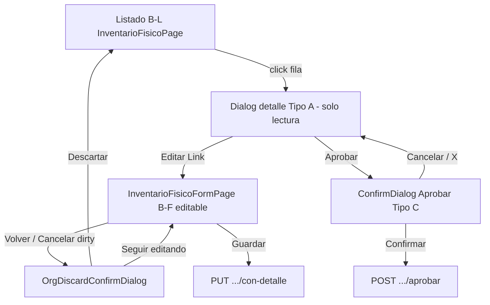

# UX-003 — Auditoría: Dirty Guard en Aprobar Inventario Físico

**Fecha:** 10 junio 2026  
**Estado:** Solo auditoría — sin implementación, sin commits  
**ID:** UX-003  
**Alcance:** `InventarioFisicoPage`, flujo Aprobar, `ConfirmDialog`, estados dirty/B.1.1, hooks relacionados  
**Norma de referencia:** ERP Frontend Standards **V2.1**  
**Auditorías previas:** `ERP_MODAL_AND_WORKFLOW_UX_AUDIT.md` (D-INV-03), `INV_M2_SEC_AUDIT.md` (SEC-LOSS-05, SEC-B11-03)

---

## 1. Resumen ejecutivo

| Dimensión | Veredicto |
|-----------|-----------|
| **Stacking modal (B11-10/11, PB-13/14)** | ✅ **Conforme** post-fix P0 |
| **Semántica variant Aprobar (UX-05)** | ✅ **Conforme** (`warning`) |
| **Dirty guard en confirm Aprobar (tipo + obs)** | ❌ **No implementado** — hallazgo **D-INV-03** |
| **Dirty guard B-F → Aprobar sin guardar** | ⚠️ **Parcial** — no hay botón Aprobar en formulario; salida sí tiene guard |
| **Severidad global UX-003** | **P2** — pérdida silenciosa de datos en confirm; riesgo funcional bajo en flujo edit→aprobar |
| **Recomendación** | Implementar dirty guard **local** en confirm Aprobar (SEC-10 / R-06); no elevar a B.1.1 completo en workflow |

---

## 2. Alcance y archivos analizados

| Archivo | Rol en flujo Aprobar |
|---------|----------------------|
| `src/features/inv/pages/InventarioFisicoPage.tsx` | B-L listado, detalle Tipo A, workflow Aprobar Tipo C |
| `src/features/inv/pages/InventarioFisicoFormPage.tsx` | B-F edición documento (referencia cruzada dirty → listado) |
| `src/features/inv/hooks/inventario-fisico.hooks.ts` | `useAprobarInventarioFisico`, queries con-detalle |
| `src/features/inv/hooks/useInvTransactionalFormGuard.ts` | Guard B-F (no usado en listado) |
| `src/features/inv/utils/form-dirty/inventario-fisico-form-dirty.ts` | Dirty B-F (no usado en confirm Aprobar) |
| `src/features/inv/utils/inv-list-empresa-reset.ts` | Reset estados UI al cambiar empresa |
| `src/shared/components/ui/ConfirmDialog.tsx` | Primitiva confirm workflow |
| `src/features/org/components/OrgDiscardConfirmDialog.tsx` | B.1.1 discard (solo B-F / catálogos) |

**Fuera de alcance explícito:** `MovimientosPage`, catálogos ORG, backend API.

---

## 3. Flujo actual documentado

### 3.1 Diagrama de superficies



### 3.2 Escenario A — Usuario en listado/detalle intenta Aprobar

| Paso | Qué ocurre | Evidencia |
|------|------------|-----------|
| 1 | Abre listado IF | `InventarioFisicoPage` |
| 2 | Click fila → abre detalle Radix | `setSelectedId`, `setDetailOpen(true)` |
| 3 | Detalle es **solo lectura** — no hay campos editables de documento | Tabla líneas + labels; sin inputs cabecera/líneas |
| 4 | Click **Aprobar** | `setDetailOpen(false)` → `setAprobarOpen(true)` |
| 5 | Radix detalle oculto; confirm visible | `detailDialogOpen = detailOpen && !workflowConfirmOpen` |
| 6 | Usuario completa tipo movimiento + observaciones en **children** del confirm | `aprobarTipoMovimientoId`, `aprobarObs` |
| 7a | **Confirmar** con tipo válido | `handleAprobarConfirm` → `useAprobarInventarioFisico` |
| 7b | **Cancelar / X** | `cerrarAprobar(true)` → reset campos + reabre detalle |

**Respuestas escenario A (detalle sin edición previa):**

| Pregunta | Respuesta |
|----------|-----------|
| ¿Se permite Aprobar? | **Sí**, si `canEditar` y `puedeAprobar` (estado ≠ anulado/ajustado) |
| ¿Se pierde información del documento? | **No** — detalle no es editable |
| ¿Se pierde información del confirm? | **Sí** — al cancelar, tipo/obs se resetean sin aviso |
| ¿Existe ConfirmDialog? | **Sí** — con formulario hijo (select + textarea) |
| ¿Existe guard dirty en confirm? | **No** |
| ¿B11-10 / B11-11? | **No violados** — detalle cierra antes del confirm |
| ¿Overlays simultáneos? | **No** — `detailDialogOpen` false mientras `aprobarOpen` |

### 3.3 Escenario B — Usuario modifica documento (B-F) e intenta Aprobar sin guardar

| Paso | Qué ocurre | Evidencia |
|------|------------|-----------|
| 1 | Desde detalle → **Editar** (`Link` a `/inv/inventario-fisico/{id}/editar`) | Líneas 390–395 |
| 2 | `InventarioFisicoFormPage` — edita cabecera/líneas | Estado local + `isDirty` via `inventario-fisico-form-dirty` |
| 3 | Formulario queda **dirty** | `useInvTransactionalFormGuard({ isDirty, ... })` |
| 4 | Usuario intenta **Aprobar** | **No existe acción Aprobar** en FormPage — solo Guardar / Cancelar / Volver |
| 5 | Para llegar a Aprobar debe **salir** al listado | `handleRequestLeave(LIST_PATH)` |
| 6 | Si dirty → `OrgDiscardConfirmDialog` (variant warning, B11-04) | SEC-01…03 en FormPage |
| 7 | Si confirma descarte → navega a listado; **cambios no persistidos se pierden** | `handleDiscardConfirm` |
| 8 | Desde listado puede abrir detalle y Aprobar | Aprobar opera sobre **datos persistidos en servidor**, no borrador local |

**Respuestas escenario B:**

| Pregunta | Respuesta |
|----------|-----------|
| ¿Se permite Aprobar con dirty en formulario? | **No directamente** — no hay UI Aprobar en B-F |
| ¿Se pierde información? | **Sí**, si el usuario descarta al salir del formulario; **no** si guarda antes |
| ¿Existe ConfirmDialog al salir dirty? | **Sí** — `OrgDiscardConfirmDialog` (UX-08) |
| ¿Existe guard dirty en confirm Aprobar? | **N/A** hasta llegar al listado |
| ¿B11-10 / B11-11 en transición Form→List→Aprobar? | **N/A** — flujos separados |
| ¿Overlays simultáneos? | **No** en flujo Aprobar listado |

### 3.4 Escenario C — Usuario rellena confirm Aprobar y cancela (núcleo UX-003)

| Paso | Comportamiento | Código |
|------|----------------|--------|
| 1 | Abre confirm, selecciona tipo, escribe observaciones | Estado local |
| 2 | Click **Cancelar** o **X** | `onClose={cerrarAprobar}` |
| 3 | `cerrarAprobar` ejecuta | `setAprobarOpen(false)`, `setAprobarTipoMovimientoId('')`, `setAprobarObs('')` |
| 4 | Reabre detalle | `reopenDetailIfSelected()` → `setDetailOpen(true)` |
| 5 | **Sin** `OrgDiscardConfirmDialog` intermedio | — |

**Hallazgo UX-003:** pérdida silenciosa de entradas del confirm — alineado con **D-INV-03** / **SEC-LOSS-05**.

---

## 4. Evidencia de código

### 4.1 Stacking y defensa PB-13 / PB-14 (conforme V2.1)

```162:163:src/features/inv/pages/InventarioFisicoPage.tsx
  const workflowConfirmOpen = aprobarOpen || anularOpen || finalizarOpen;
  const detailDialogOpen = detailOpen && !workflowConfirmOpen;
```

```358:363:src/features/inv/pages/InventarioFisicoPage.tsx
                  onClick={() => {
                    setAprobarTipoMovimientoId(tiposAjuste[0]?.tipo_movimiento_id ?? '');
                    setAprobarObs('');
                    setDetailOpen(false);
                    setAprobarOpen(true);
                  }}
```

```331:335:src/features/inv/pages/InventarioFisicoPage.tsx
      <Dialog
        open={detailDialogOpen}
        onOpenChange={(open) => {
          if (!open && !workflowConfirmOpen) setDetailOpen(false);
        }}
```

### 4.2 Cierre confirm sin dirty guard

```171:176:src/features/inv/pages/InventarioFisicoPage.tsx
  const cerrarAprobar = (reopenDetail = true) => {
    setAprobarOpen(false);
    setAprobarTipoMovimientoId('');
    setAprobarObs('');
    if (reopenDetail) reopenDetailIfSelected();
  };
```

```467:506:src/features/inv/pages/InventarioFisicoPage.tsx
      <ConfirmDialog
        isOpen={aprobarOpen}
        onClose={cerrarAprobar}
        ...
        variant="warning"
        ...
      >
        <div className="space-y-4">
          <select value={aprobarTipoMovimientoId} onChange={...} />
          <textarea value={aprobarObs} onChange={...} />
        </div>
      </ConfirmDialog>
```

### 4.3 ConfirmDialog — cierre solo Cancelar/X (MD-04)

```72:78:src/shared/components/ui/ConfirmDialog.tsx
          <button
            onClick={onClose}
            disabled={loading}
            ...
          >
            <X className="h-5 w-5 text-text-soft" />
```

Backdrop sin handler de cierre — coherente con Tipo C.

### 4.4 B-F dirty guard (FormPage — no en flujo confirm)

```379:407:src/features/inv/pages/InventarioFisicoFormPage.tsx
  } = useInvTransactionalFormGuard({
    isEdit,
    documentId: inventarioFisicoId,
    listPath: LIST_PATH,
    entityLabel: 'la toma de inventario',
    isDirty,
    isSubmitting: submitting,
    onResetForm: resetFormToCreateInitial,
  });
```

```881:891:src/features/inv/pages/InventarioFisicoFormPage.tsx
      <OrgDiscardConfirmDialog
        discardPending={discardPending}
        entityLabel={discardDialogEntityLabel}
        onClose={handleDiscardCancel}
        onConfirm={handleDiscardConfirm}
      />
```

### 4.5 Hook aprobar — sin lógica dirty

```212:233:src/features/inv/hooks/inventario-fisico.hooks.ts
export function useAprobarInventarioFisico() {
  ...
  return useMutation<...>({
    mutationFn: ({ inventarioFisicoId, payload }) =>
      inventarioFisicoService.aprobar(inventarioFisicoId, payload),
    onSuccess: (...) => { ... toast.success('Inventario físico aprobado y stock ajustado.'); },
    onError: (err) => toast.error(getErrorMessage(err).message),
  });
}
```

Toast error solo en hook — **ER-02** conforme.

### 4.6 Validación cliente pre-mutación

```188:192:src/features/inv/pages/InventarioFisicoPage.tsx
    if (!aprobarTipoMovimientoId) {
      toast.error('Selecciona un tipo de movimiento (ajuste).');
      return;
    }
```

Toast en componente antes de mutación — permitido **ER-03**.

---

## 5. Cumplimiento V2.1

| Regla | Aplica a IF Aprobar | Estado | Notas |
|-------|---------------------|--------|-------|
| **B11-01…09** | Detalle / confirm workflow | **N/A / Parcial** | SEC-08: detalle sin B.1.1 — ✅ |
| **B11-10** | Aprobar desde detalle | ✅ | Detalle Radix cerrado antes confirm |
| **B11-11** | Idem | ✅ | `setDetailOpen(false)` antes `setAprobarOpen(true)` |
| **PB-13** | Idem | ✅ | |
| **PB-14** | Idem | ✅ SHOULD implementado |
| **PB-08** | Workflow vs B.1.1 página | ✅ | No mezcla discard FormPage con confirm |
| **UX-05** | Variant Aprobar | ✅ | `variant="warning"` |
| **UX-06** | Anular IF | ✅ | `danger` en anular (misma página) |
| **UX-08** | Discard confirm Aprobar | ❌ | UX-08 es `OrgDiscardConfirmDialog`; **no** usado en confirm Aprobar |
| **MD-01** | Clasificación | ✅ | Detalle A, confirm C |
| **MD-02** | — | N/A | |
| **MD-03** | Detalle | ✅ | Sin `orgDialogGuardProps` |
| **MD-04** | Confirm | ✅ | Página + B11-10 |
| **SEC-08** | Detalle lectura | ✅ | |
| **SEC-09** | Confirm workflow | ⚠️ | **MUST NOT** B.1.1 en confirm one-shot — implementar dirty guard **ligero** no contradice SEC-09 si no es B.1.1 completo de modal CRUD |
| **SEC-10** | Campos en confirm | ❌ | **MAY** dirty en campos — **no implementado** (Anexo R-06) |

**Interpretación normativa:** V2.1 **no exige** B.1.1 completo en confirm Aprobar (SEC-09). **Sí** documenta backlog **SEC-10 / R-06** como mejora MAY para campos del confirm. UX-003 es alineación con SEC-10, no violación de SEC-09.

---

## 6. Hallazgos clasificados

| ID | Hallazgo | Severidad | Tipo |
|----|----------|-----------|------|
| **UX-003-01** | Confirm Aprobar resetea tipo/obs al cancelar sin confirmación dirty | **P2** | UX / deuda SEC-10 |
| **UX-003-02** | No hay snapshot/baseline de campos confirm al abrir | **P2** | Técnico |
| **UX-003-03** | FormPage dirty → Aprobar requiere descartar o guardar primero (by design) | **Info** | Flujo correcto |
| **UX-003-04** | Edge case: dos pestañas (form dirty + list approve) no coordinadas | **P3** | Técnico / bajo |
| **UX-003-05** | Stacking B11-10/11 + PB-13/14 | **Mantener** | Conforme post-P0 |
| **UX-003-06** | UX-05 warning en Aprobar | **Mantener** | Conforme P1 |

---

## 7. Riesgos

### 7.1 Riesgo funcional

| Riesgo | Prob. | Impacto | Descripción |
|--------|-------|---------|-------------|
| Aprobar versión servidor ignorando borrador B-F | Baja | Medio | Mitigado: guard en salida FormPage; usuario debe descartar o guardar |
| Aprobar sin tipo movimiento | Media | Bajo | Mitigado: toast ER-03 |
| Aprobar documento obsoleto tras editar y descartar | Baja | Medio | Comportamiento esperado post-descarte |

### 7.2 Riesgo UX

| Riesgo | Prob. | Impacto |
|--------|-------|---------|
| Pérdida silenciosa tipo/obs en confirm | **Alta** | Medio — reclicks, re-selección |
| Confusión edit vs approve | Media | Bajo — flujos en rutas distintas |
| Usuario espera guardar borrador al cancelar confirm | Media | Bajo |

### 7.3 Riesgo técnico

| Riesgo | Prob. | Impacto |
|--------|-------|---------|
| Segundo `OrgDiscardConfirmDialog` + `discardPending` en B-L | Media | Medio — colisión con patrón catálogo si se copia mal |
| `tiposAjuste[0]` pre-seleccionado oculta dirty aparente | Baja | Bajo — usuario puede no cambiar select |
| Reapertura automática detalle post-approve (`detailOpen` sigue true) | Baja | Bajo — UX aceptable |

---

## 8. Solución propuesta (NO IMPLEMENTAR)

### 8.1 Alternativa A — Dirty guard local en confirm (recomendada)

**Descripción:** Al abrir Aprobar, snapshot `{ tipoId, obs }` inicial. En `cerrarAprobar`, si valores ≠ snapshot → interceptar con `OrgDiscardConfirmDialog` (UX-08) o confirm secundario inline; solo reset tras confirmar descarte.

| Pros | Contras |
|------|---------|
| Alineado SEC-10 / D-INV-03 | ~40–60 LOC en `InventarioFisicoPage` |
| Reutiliza primitiva discard existente | Segundo estado `discardPending` o flag local |
| Paridad futura con Anular Movimientos (D-INV-04) | Debe no violar B11-02 si hay `discardPending` catálogo (N/A aquí) |

**Impacto:** Solo `InventarioFisicoPage.tsx`. Sin cambios API/hooks/ConfirmDialog global.

### 8.2 Alternativa B — Persistir campos hasta éxito o cambio de `selectedId`

**Descripción:** No resetear `aprobarTipoMovimientoId` / `aprobarObs` en cancel; conservar hasta approve OK o cambio de fila/empresa.

| Pros | Contras |
|------|---------|
| Implementación mínima (~15 LOC) | No avisa al usuario — comportamiento implícito |
| Mejor UX re-apertura rápida | Puede confundir si cambió contexto documento |
| Sin segundo dialog | No cumple espíritu B.1.1 “Seguir editando” |

**Impacto:** Bajo. **No recomendada** como única solución normativa.

### 8.3 Alternativa C — B.1.1 completo en confirm Aprobar

**Descripción:** Tratar children del confirm como Tipo B con `orgDialogGuardProps`.

| Pros | Contras |
|------|---------|
| Máxima paridad B.1.1 | **Conflicta SEC-09** (MUST NOT B.1.1 en workflow one-shot) |
| | Over-engineering para 2 campos |

**Impacto:** Alto. **No recomendada.**

### 8.4 Alternativa D — Mover Aprobar a FormPage B-F

**Descripción:** Botón Aprobar en formulario con guard unificado dirty documento + approve.

| Pros | Contras |
|------|---------|
| Un solo guard transaccional | Refactor arquitectónico B-L/B-F |
| | Mezcla Plantilla B-F con workflow B-L |
| | Fuera alcance UX-003 mínimo |

**Impacto:** Alto. **No recomendada** en P2.

### 8.5 Recomendación final

**Implementar Alternativa A** en sprint UX-003:

1. Snapshot al abrir confirm (`useRef` o estado `aprobarBaseline`).
2. Función `isAprobarConfirmDirty()` comparando tipo/obs vs baseline (considerar pre-fill `tiposAjuste[0]` como baseline).
3. `requestCloseAprobar`: si dirty → abrir `OrgDiscardConfirmDialog` local; si no → `cerrarAprobar`.
4. Textos B11-04 en discard secundario.
5. **No** modificar `ConfirmDialog.tsx` global.
6. Documentar paridad con `MovimientosPage` anular (D-INV-04) en mismo sprint opcional.

**Compatibilidad V2.1:** Cumple **SEC-10 MAY**; respeta **SEC-09** (guard ligero ≠ B.1.1 modal CRUD); mantiene **B11-10/11**, **PB-13/14**, **UX-05**.

---

## 9. Estimación de implementación

| Tarea | Esfuerzo | Archivos |
|-------|----------|----------|
| Snapshot + dirty compare confirm | 2–3 h | `InventarioFisicoPage.tsx` |
| Integrar `OrgDiscardConfirmDialog` local | 1–2 h | Idem |
| QA manual (matriz abajo) | 1–2 h | — |
| Paridad Anular Mov (opcional D-INV-04) | +2–3 h | `MovimientosPage.tsx` |
| **Total UX-003 solo IF** | **~4–7 h** | 1 archivo |

---

## 10. Checklist QA manual (post-implementación futura)

| # | Caso | Esperado actual | Esperado post-fix |
|---|------|-----------------|-------------------|
| QA-1 | Aprobar sin editar confirm → Cancelar | Cierra sin fricción | Igual |
| QA-2 | Cambiar tipo/obs → Cancelar | Pierde datos silencioso | Confirm discard |
| QA-3 | Cambiar campos → Seguir editando | N/A | Vuelve al confirm |
| QA-4 | Aprobar éxito | Toast hook; cierra confirm | Igual |
| QA-5 | Aprobar sin tipo | Toast ER-03 | Igual |
| QA-6 | Abrir Aprobar con detalle | Sin overlay doble | Igual (B11-10) |
| QA-7 | Form B-F dirty → Volver | OrgDiscardConfirmDialog | Igual |
| QA-8 | Form dirty → intentar Aprobar | No hay botón; vía listado | Igual |
| QA-9 | Cambio empresa con confirm abierto | Reset vía `inv-list-empresa-reset` | Verificar + post-fix |

---

## 11. Veredicto

| Pregunta | Respuesta |
|----------|-----------|
| ¿UX-003 es bug bloqueante? | **No** — P2 deuda UX |
| ¿Stacking V2.1 OK? | **Sí** |
| ¿Dirty guard confirm Aprobar? | **No** — gap SEC-10 |
| ¿Dirty guard impide aprobar sin guardar B-F? | **Indirectamente sí** (sin botón Aprobar en form) |
| ¿Listo para implementación? | **Sí** — Alternativa A acotada |

---

*Auditoría UX-003 completada. Sin cambios de código, commits ni documentación normativa.*
