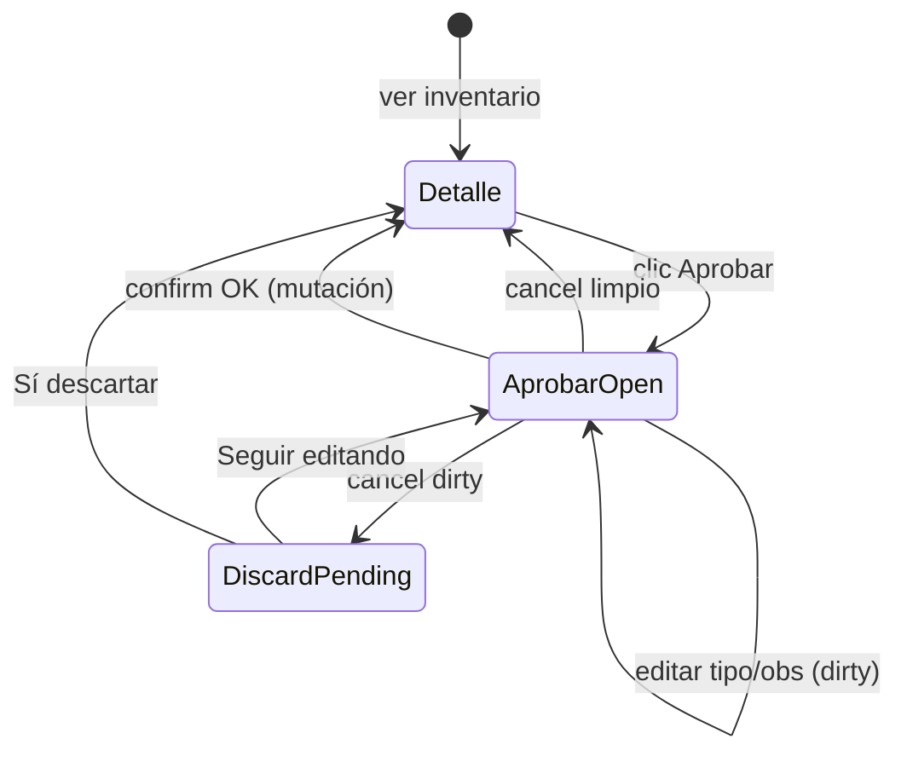

# UX-003 — Plan de implementación técnico

**Alternativa A (aprobada):** Dirty guard local en `ConfirmDialog` Aprobar de Inventario Físico.

**Estado:** Plan pre-implementación — **sin cambios de código**.

**Alcance:** `InventarioFisicoPage.tsx`, estados locales de Aprobar, `ConfirmDialog` Aprobar, reutilización de `OrgDiscardConfirmDialog`.

**Referencias:** `UX_003_DIRTY_GUARD_APROBAR_IF_AUDIT.md`, `ERP_FRONTEND_STANDARDS_V2.md` v2.1 (B11-10/11, PB-13/14, UX-05/08, MD-04, SEC-09/10).

---

## 1. Resumen ejecutivo

Hoy, cancelar el `ConfirmDialog` Aprobar resetea `aprobarTipoMovimientoId` y `aprobarObs` sin aviso (D-INV-03 / SEC-LOSS-05). La Alternativa A introduce:

1. **Snapshot baseline** al abrir el confirm de Aprobar.
2. **Detección dirty** comparando estado actual vs baseline.
3. **Confirmación de descarte** reutilizando `OrgDiscardConfirmDialog`, con patrón **cerrar primero el confirm primario** (B11-10) antes de mostrar el discard (B11-11 extendido a B-L).

El flujo de confirmación exitosa (`handleAprobarConfirm` → mutación → `cerrarAprobar`) permanece intacto.

---

## 2. Diseño técnico

### 2.1 Estados propuestos

| Estado | Tipo | Propósito |
|--------|------|-----------|
| `aprobarOpen` | `boolean` | *(existente)* ConfirmDialog Aprobar visible |
| `aprobarTipoMovimientoId` | `string` | *(existente)* Valor editado del select |
| `aprobarObs` | `string` | *(existente)* Valor editado del textarea |
| `aprobarBaseline` | `AprobarConfirmBaseline \| null` | **Nuevo.** Snapshot inmutable al abrir / estabilizar valores iniciales |
| `aprobarDiscardPending` | `OrgDiscardPending` | **Nuevo.** `'edit' \| null` — discard secundario activo (mismo tipo que ORG) |

```typescript
/** Snapshot de valores iniciales del confirm Aprobar (local a la página). */
interface AprobarConfirmBaseline {
  tipoMovimientoId: string;
  obs: string;
}
```

**No se requiere** estado `isAprobarDirty` explícito: se deriva con `useMemo` para evitar desincronización.

```typescript
const isAprobarConfirmDirty = useMemo(() => {
  if (!aprobarBaseline) return false;
  return (
    aprobarTipoMovimientoId !== aprobarBaseline.tipoMovimientoId ||
    aprobarObs.trim() !== aprobarBaseline.obs.trim()
  );
}, [aprobarBaseline, aprobarTipoMovimientoId, aprobarObs]);
```

### 2.2 Baseline — cuándo y cómo capturarlo

**Problema actual:** al hacer clic en Aprobar, el código asigna `tiposAjuste[0]?.tipo_movimiento_id` **antes** de `setAprobarOpen(true)`, pero `useTiposMovimiento` tiene `enabled: aprobarOpen`. En el primer open, `tiposAjuste` suele estar vacío → `aprobarTipoMovimientoId = ''` hasta que llegue la query.

**Estrategia baseline (evita falsos positivos):**

1. **Abrir sesión Aprobar** (`handleOpenAprobar`): cerrar detalle, `setAprobarOpen(true)`, resetear `aprobarBaseline = null`, `aprobarDiscardPending = null`. **No** confiar en `tiposAjuste[0]` en el handler de clic.
2. **`useEffect` de estabilización** — ejecutar cuando `aprobarOpen === true` y la query de tipos terminó (`!tiposMovimientoQuery.isLoading` y `tiposMovimientoQuery.isFetched`):
   - Si `aprobarBaseline === null` (primera estabilización de esta sesión):
     - Calcular `defaultTipoId = tiposAjuste[0]?.tipo_movimiento_id ?? ''`.
     - Si `aprobarTipoMovimientoId === ''` y `defaultTipoId !== ''`, asignar `setAprobarTipoMovimientoId(defaultTipoId)` **solo en este momento**.
     - Capturar baseline con los valores **finales** que ve el usuario:
       ```typescript
       setAprobarBaseline({
         tipoMovimientoId: defaultTipoId || aprobarTipoMovimientoId,
         obs: aprobarObs, // '' al abrir
       });
       ```
   - Usar ref `aprobarBaselineCapturedRef` por sesión para evitar re-capturas si `tiposAjuste` cambia por refetch sin intención del usuario.

**Regla de falsos positivos:** dirty solo es `true` si el usuario **modificó** respecto al baseline ya capturado. El prefill async de `tiposAjuste[0]` forma parte del baseline, no del delta del usuario.

| Escenario | Baseline | Dirty tras estabilización |
|-----------|----------|----------------------------|
| Abrir, no tocar nada | `{ tipo: id[0], obs: '' }` | `false` |
| Abrir, cambiar tipo | baseline fijo | `true` |
| Abrir, escribir obs | baseline fijo | `true` |
| Abrir, tipos vacíos (error API) | `{ tipo: '', obs: '' }` | `false` hasta editar |
| Reabrir tras "Seguir editando" | Re-captura en nuevo open | baseline = valores restaurados |

### 2.3 Detección de cambios por campo

| Campo | Comparación | Normalización |
|-------|-------------|---------------|
| `aprobarTipoMovimientoId` | Igualdad estricta `!==` | Sin trim (UUID) |
| `aprobarObs` | `trim()` en ambos lados | Espacios leading/trailing no cuentan como cambio |

**Observaciones vacías vs baseline `''`:** `''.trim() === ''.trim()` → no dirty.

### 2.4 Funciones de cierre propuestas

Reemplazar uso directo de `cerrarAprobar` en `onClose` del ConfirmDialog por **`handleRequestCloseAprobar`**:

```typescript
const handleRequestCloseAprobar = () => {
  if (aprobarMutation.isPending) return; // no cerrar durante submit
  if (isAprobarConfirmDirty) {
    setAprobarOpen(false);           // B11-10: cerrar overlay primario
    setAprobarDiscardPending('edit'); // B11-11: abrir discard secundario
    return;
  }
  cerrarAprobar(true); // limpio: reset + reopen detail
};

const cerrarAprobar = (reopenDetail = true) => {
  setAprobarOpen(false);
  setAprobarTipoMovimientoId('');
  setAprobarObs('');
  setAprobarBaseline(null);
  setAprobarDiscardPending(null);
  aprobarBaselineCapturedRef.current = false;
  if (reopenDetail) reopenDetailIfSelected();
};
```

**Handlers discard secundario** (patrón ORG):

```typescript
const handleAprobarDiscardCancel = () => {
  setAprobarDiscardPending(null);
  setAprobarOpen(true); // restaurar confirm con valores intactos en state
};

const handleAprobarDiscardConfirm = () => {
  cerrarAprobar(true); // descarta campos y reabre detalle
};
```

### 2.5 Reutilización de `OrgDiscardConfirmDialog`

**Sí, reutilizar** sin modificar el componente compartido:

```tsx
<OrgDiscardConfirmDialog
  discardPending={aprobarDiscardPending}
  entityLabel="la aprobación"
  onClose={handleAprobarDiscardCancel}
  onConfirm={handleAprobarDiscardConfirm}
/>
```

- `discardPending='edit'` → mensaje: *"Hay cambios sin guardar. ¿Desea cerrar sin guardar?"* (apropiado para workflow B-L).
- `entityLabel` no altera el mensaje en modo `'edit'`; se mantiene por consistencia API del componente.

**No** extender `OrgDiscardPending` ni `OrgDiscardConfirmDialog` en este ticket (alcance mínimo).

### 2.6 Ajustes de flags de visibilidad (stacking)

Estado actual:

```typescript
const workflowConfirmOpen = aprobarOpen || anularOpen || finalizarOpen;
const detailDialogOpen = detailOpen && !workflowConfirmOpen;
```

Propuesta:

```typescript
const aprobarUiActive = aprobarOpen || aprobarDiscardPending !== null;
const workflowConfirmOpen = aprobarOpen || anularOpen || finalizarOpen;
const detailDialogOpen = detailOpen && !workflowConfirmOpen && !aprobarDiscardPending;
```

Durante discard pending: `aprobarOpen = false`, `aprobarDiscardPending = 'edit'` → un solo overlay (`OrgDiscardConfirmDialog`). Valores editados permanecen en state React.

### 2.7 Reset empresa (`resetInventarioFisicoListUiState`)

Extender el helper en `inv-list-empresa-reset.ts` para incluir:

- `setAprobarBaseline(null)` *(o reset inline en `resetPageFilters`)*
- `setAprobarDiscardPending(null)`

**Opción preferida:** añadir setters al interface `InventarioFisicoListUiSetters` (~4 líneas) para mantener INV-M2-SEC O6 coherente.

---

## 3. Flujo completo

### 3.1 Diagrama de estados



### 3.2 Secuencia paso a paso

#### A. Abrir Aprobar → snapshot baseline

1. Usuario en detalle → clic **Aprobar**.
2. `setDetailOpen(false)`, `setAprobarOpen(true)`, `aprobarBaseline = null`.
3. Query tipos se habilita; skeleton/loader en select si aplica.
4. `useEffect` estabiliza: aplica default tipo si corresponde, captura baseline.
5. ConfirmDialog Aprobar visible (`variant="warning"`, UX-05).

#### B. Modificar datos → dirty = true

1. Usuario cambia select o textarea.
2. `isAprobarConfirmDirty` pasa a `true` (derivado).
3. ConfirmDialog Aprobar sigue visible; botón confirmar sin cambios.

#### C. Cancelar (X / Cancelar / overlay) → confirm discard

1. `handleRequestCloseAprobar` detecta dirty.
2. `setAprobarOpen(false)` — **cierra** ConfirmDialog Aprobar (0 overlays primarios).
3. `setAprobarDiscardPending('edit')` — abre `OrgDiscardConfirmDialog` (1 overlay total).

#### D. Seguir editando → volver al confirm

1. Usuario elige **Seguir editando** en discard.
2. `setAprobarDiscardPending(null)`, `setAprobarOpen(true)`.
3. Valores `aprobarTipoMovimientoId` / `aprobarObs` **preservados**; baseline **sin cambiar** (sigue dirty si había cambios).

#### E. Descartar → cerrar confirm y limpiar estado

1. Usuario elige **Sí, descartar**.
2. `cerrarAprobar(true)`: limpia campos, baseline, flags; reabre detalle si `selectedId`.

#### F. Confirmar Aprobar → comportamiento actual intacto

1. Validación cliente: tipo requerido → `toast.error` (sin cambio).
2. `aprobarMutation.mutateAsync(...)` → éxito toast en hook.
3. `cerrarAprobar(false)` — no reabrir detalle obsoleto; lista se invalida vía React Query (comportamiento existente).

**Durante `isPending`:** `onClose` de Aprobar debe no-op (igual que ORG `isSubmitting` guard).

---

## 4. Compatibilidad V2.1

| ID | Requisito | Cómo cumple la solución |
|----|-----------|-------------------------|
| **B11-10** | No apilar Radix Dialog + ConfirmDialog | Aprobar usa ConfirmDialog; detalle ya se cierra al abrir Aprobar (`detailOpen=false`). Discard: solo un ConfirmDialog a la vez. |
| **B11-11** | Discard secundario tras cerrar primario | `handleRequestCloseAprobar`: `aprobarOpen=false` → luego `aprobarDiscardPending='edit'`. Idéntico a `createOrgDiscardHandlers`. |
| **PB-13** | Workflow confirm B-L con dirty guard local | Snapshot + compare en página; no hook transaccional B-F. |
| **PB-14** | Cancelar workflow confirm con datos → confirmar descarte | `OrgDiscardConfirmDialog` con flujo Seguir editando / Descartar. |
| **UX-05** | ConfirmDialog destructivo/warning coherente | Aprobar mantiene `variant="warning"`; discard usa `variant="warning"` (OrgDiscardConfirmDialog). |
| **UX-08** | No pérdida silenciosa de datos en confirms workflow | Cancel dirty siempre pasa por discard confirm. |
| **MD-04** | Máximo un overlay modal activo | Secuencia estricta: nunca `aprobarOpen && aprobarDiscardPending`. |
| **SEC-09** | Guard de salida en contextos con edición embebida | Aplica al confirm Aprobar (select + textarea editables). |
| **SEC-10** | Baseline explícito vs estado live | `aprobarBaseline` capturado en open estabilizado. |

### 4.1 Demostración: sin overlays simultáneos

| Fase | `detailOpen` | `aprobarOpen` | `aprobarDiscardPending` | Overlays visibles |
|------|--------------|---------------|-------------------------|-------------------|
| Detalle | true | false | null | 1× Dialog detalle |
| Aprobar editando | false | true | null | 1× ConfirmDialog Aprobar |
| Cancel dirty (transición) | false | false | null | 0 (frame intermedio) |
| Discard pending | false | false | `'edit'` | 1× OrgDiscardConfirmDialog |
| Seguir editando | false | true | null | 1× ConfirmDialog Aprobar |
| Descartar / cancel limpio | true | false | null | 0 o 1× Dialog detalle |

**Invariante:** `!(aprobarOpen && aprobarDiscardPending !== null)` — enforced en handlers, no solo en UI.

**Anular / Finalizar:** fuera de alcance UX-003; no se modifican. No comparten estado con Aprobar discard.

---

## 5. Riesgos

### 5.1 Funcionales

| Riesgo | Prob. | Impacto | Mitigación |
|--------|-------|---------|------------|
| Baseline capturado antes de default tipo → falso dirty al auto-prefill | Media | Medio | `useEffect` post-fetch; baseline solo tras estabilización |
| Baseline re-capturado en refetch tipos → pierde dirty | Baja | Alto | Ref `aprobarBaselineCapturedRef` por sesión open |
| Submit durante dirty close | Baja | Medio | Guard `isPending` en `handleRequestCloseAprobar` |
| Cambio empresa con discard pending | Baja | Medio | Extender `resetInventarioFisicoListUiState` |

### 5.2 UX

| Riesgo | Prob. | Impacto | Mitigación |
|--------|-------|---------|------------|
| Parpadeo al cerrar Aprobar y abrir discard | Baja | Bajo | Patrón estándar ORG; transición aceptada en auditoría |
| Usuario confunde discard con cancelar aprobación | Baja | Medio | Textos OrgDiscardConfirmDialog ya probados en catálogos |
| Select vacío si tipos fallan → dirty solo si editó | Baja | Bajo | Baseline `{ '', '' }`; validación submit existente |

### 5.3 Regresión

| Riesgo | Prob. | Impacto | Mitigación |
|--------|-------|---------|------------|
| `handleAprobarConfirm` / mutación rota | Baja | Alto | No tocar lógica mutación; solo interceptar `onClose` |
| `detailDialogOpen` reabre detalle durante discard | Media | Alto | Flag `aprobarDiscardPending` en cálculo visibilidad |
| Reset filtros empresa deja discard colgado | Baja | Medio | Reset extendido en helper |

### 5.4 Stacking

| Riesgo | Prob. | Impacto | Mitigación |
|--------|-------|---------|------------|
| Dos ConfirmDialog simultáneos | Media si mal implementado | Alto | Cerrar `aprobarOpen` antes de discard; invariante documentada |
| Dialog detalle + ConfirmDialog Aprobar | Baja | Alto | Ya resuelto: `setDetailOpen(false)` al abrir Aprobar |
| Escape cierra discard pero deja state huérfano | Baja | Medio | `onClose` discard = `handleAprobarDiscardCancel` (reabre Aprobar) |

---

## 6. Matriz QA

### 6.1 Flujo Aprobar — dirty guard

| # | Precondición | Acción | Resultado esperado |
|---|--------------|--------|-------------------|
| Q1 | IF en_proceso, tipos cargados | Abrir Aprobar, no editar, Cancelar | Cierra sin discard; detalle reabre; campos reset |
| Q2 | Aprobar abierto | Cambiar tipo, Cancelar | Discard visible; Aprobar cerrado |
| Q3 | Q2 + discard visible | Seguir editando | Aprobar reabre; tipo conservado; dirty sigue true |
| Q4 | Q2 + discard visible | Sí, descartar | Todo cerrado; campos reset; detalle reabre |
| Q5 | Aprobar abierto | Escribir obs, Cancelar | Discard (igual Q2) |
| Q6 | Aprobar abierto | Solo espacios en obs | No dirty; cancel limpio |
| Q7 | Aprobar abierto, dirty | Confirmar Aprobar OK | Mutación OK; cierra sin discard; toast éxito |
| Q8 | Aprobar abierto | Confirmar sin tipo | toast.error cliente; confirm permanece |
| Q9 | Aprobar abierto, pending | Cancelar / X | No cierra (guard isPending) |
| Q10 | Primera apertura (cache tipos fría) | Abrir Aprobar, esperar load, cancel | Sin falso dirty; default tipo en baseline |

### 6.2 Stacking / visibilidad

| # | Acción | Resultado esperado |
|---|--------|-------------------|
| Q11 | Abrir Aprobar desde detalle | Solo ConfirmDialog Aprobar; detalle no visible |
| Q12 | Cancel dirty | Nunca 2 dialogs visibles a la vez |
| Q13 | Seguir editando | Solo ConfirmDialog Aprobar |
| Q14 | Abrir Anular mientras Aprobar abierto | No aplicable — Aprobar bloquea detalle; no hay acceso paralelo |

### 6.3 Regresión workflow

| # | Acción | Resultado esperado |
|---|--------|-------------------|
| Q15 | Finalizar / Anular cancel | Sin discard (sin cambios UX-003) |
| Q16 | Cambiar empresa en header con Aprobar abierto | Reset cierra todo; sin discard colgado |
| Q17 | Aprobar → éxito | Lista refresca; estado coherente |

### 6.4 Accesibilidad / teclado

| # | Acción | Resultado esperado |
|---|--------|-------------------|
| Q18 | Escape en Aprobar limpio | Cierra igual que Cancelar |
| Q19 | Escape en discard | Seguir editando (onClose → cancel handler) |

### 6.5 RBAC / edge

| # | Precondición | Resultado esperado |
|---|--------------|-------------------|
| Q20 | Sin permiso editar | Botón Aprobar disabled (sin cambio) |
| Q21 | IF ya ajustado/anulado | Botón Aprobar disabled |
| Q22 | tiposAjuste = [] | Baseline vacío; submit blocked con toast |

---

## 7. Estimación

| Métrica | Valor |
|---------|-------|
| **Archivos afectados** | 2 |
| | `src/features/inv/pages/InventarioFisicoPage.tsx` (principal) |
| | `src/features/inv/utils/inv-list-empresa-reset.ts` (reset empresa) |
| **Archivos reutilizados sin cambio** | `OrgDiscardConfirmDialog.tsx`, `ConfirmDialog.tsx`, hooks existentes |
| **Líneas aproximadas** | +70–95 netas en página; +8–12 en reset helper |
| **Complejidad** | **Baja–media** — patrón conocido (ORG B11), lógica local, sin contrato API |
| **Tiempo estimado** | **2–3 h** implementación + **1 h** QA manual |
| **Tests automatizados** | Opcional P3 — no requerido por alcance; smoke manual suficiente |

### 7.1 Orden de implementación sugerido

1. Tipos locales + estados `aprobarBaseline`, `aprobarDiscardPending`, ref captura.
2. `useEffect` estabilización baseline + refactor `handleOpenAprobar`.
3. `isAprobarConfirmDirty` + `handleRequestCloseAprobar` + handlers discard.
4. Wire `ConfirmDialog` `onClose` → `handleRequestCloseAprobar`.
5. Render `OrgDiscardConfirmDialog` + ajuste `detailDialogOpen`.
6. Extender `resetInventarioFisicoListUiState`.
7. QA matriz §6.

### 7.2 Fuera de alcance (explícito)

- Dirty guard en Anular / Finalizar (PB-14 no exige si no hay campos editables).
- Refactor global `ConfirmDialog` con dirty integrado.
- Cambios en `useAprobarInventarioFisico`.
- Modificación de documentación normativa V2.1.
- Fix del race `tiposAjuste[0]` en onClick (se corrige como efecto colateral del `useEffect` baseline, no ticket separado).

---

## 8. Checklist pre-merge

- [ ] Invariante `!(aprobarOpen && aprobarDiscardPending)` verificada en código
- [ ] `onClose` Aprobar usa `handleRequestCloseAprobar`, no `cerrarAprobar` directo
- [ ] Baseline capturado post-fetch tipos (sin falso dirty en Q10)
- [ ] `resetInventarioFisicoListUiState` limpia baseline y discard pending
- [ ] Matriz QA §6 ejecutada
- [ ] Sin overlays simultáneos en DevTools (PB-13 / MD-04)
- [ ] Comportamiento `handleAprobarConfirm` idéntico al actual

---

## 9. Aprobaciones

| Rol | Estado |
|-----|--------|
| Auditoría UX-003 | ✅ Aprobada |
| Plan técnico UX-003 | 📄 Este documento — pendiente revisión |
| Implementación | ⛔ No iniciar hasta aprobación explícita del plan |

---

*Generado: 2026-06-10 — Alternativa A, alcance UX-003, sin cambios de código.*
